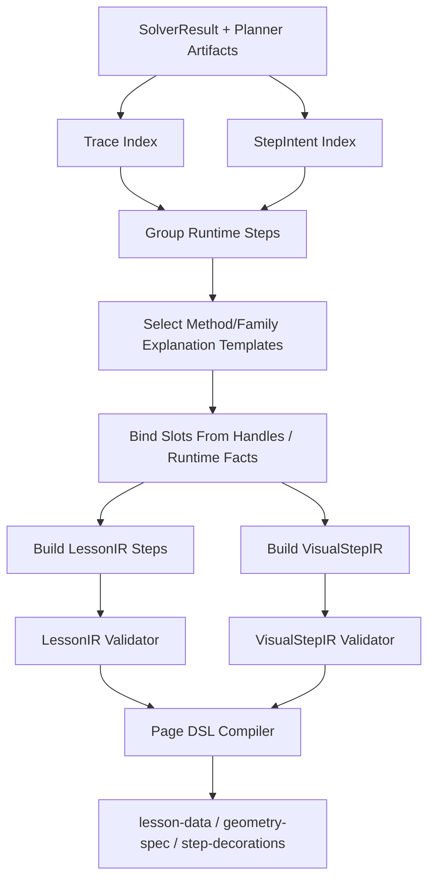

# ExplanationBuilder 设计方案

## Summary

`ExplanationBuilder` 是在线生成网页链路中，连接 **已验算解题结果** 和 **学生可理解教学网页** 的中间层。

当前 Strategy Planner 已经能把 `ProblemIR` 规划成可执行 `StepIntent`，再由代码编译、执行 method 并通过 checks。下一步不能直接把 runtime trace 塞进网页，因为 runtime trace 面向验算和 debug，不等于课堂讲解。

目标链路：

```text
ProblemIR
  -> StrategyPlanner / RecipeTrialExecutor
  -> RuntimeOrchestrator / Method Executor
  -> SolverResult + Planner Artifacts + Runtime Trace
  -> ExplanationBuilder
  -> LessonIR + VisualStepIR
  -> geometry-spec / step-decorations / lesson-data
  -> compiled HTML
```

一句话原则：

> Strategy Planner 负责“怎么解”，Method Executor 负责“算对并验算”，ExplanationBuilder 负责“怎么讲给学生听”。

## 为什么需要

当前 `DerivationStep` 主要包含：

```text
title / goal / reason / calculation / conclusion / method_id
```

它足够用于 CLI review，但不够支撑教学网页：

- method/recipe 粒度常常比学生步骤更细，需要合并。
- 有些 runtime step 是补位或缓存，不应该展示。
- 有些 method 的计算路径很快，但学生需要更几何、更慢的解释。
- 网页还需要图形意图：高亮哪个点、画哪条辅助线、标哪个等长/直角。
- 后续学生对话也需要复用同一套 method/family explanation 模板。

## 输入与输出

### 输入

`ExplanationBuilder` 首版输入应来自已完成求解的结构化产物：

- `ProblemIR`：题意事实、原题文本、scope tree、canonical entities/facts。
- `SolverResult`：answers、checks、methods_used、runtime trace。
- `PlannerOutput`：context declarations、step plans。
- `StepIntentDraft`：LLM 原始步骤意图，包含 `strategy / reason / reads / creates / produces / recipe_hint`。
- `FamilySpec`：题型策略、recipe 菜单。
- `MethodSpecRegistry`：method 摘要。
- `MethodExplanationSpec / FamilyExplanationSpec`：解释模板。

首版可以先不依赖完整 `RuntimeContext`；如果需要读取中间事实值，再由 Orchestrator 暴露 `ExplanationSnapshot`。

### 输出

输出分两层：

```text
LessonIR
  面向教学页面的步骤、推导、结论、引用、分组。

VisualStepIR
  每个教学步骤的图形意图，使用 canonical handle，不直接写低层 SVG/JSON 装饰。
```

最终由 compiler 转成现有三份页面 DSL：

- `lesson-data.json`
- `geometry-spec.json`
- `step-decorations.json`

## 核心对象

### LessonIR

`LessonIR` 是网页内容层，不包含 HTML。

示意：

```json
{
  "problem_id": "tj-2026-nankai-yimo-25",
  "title": "2026 年天津市南开区一模第 25 题",
  "sections": [
    {
      "scope_id": "ii_1",
      "title": "第（Ⅱ）①问",
      "steps": ["explain_derive_N", "explain_solve_m", "explain_minimum"]
    }
  ],
  "steps": [
    {
      "id": "explain_derive_N",
      "source_step_ids": ["derive_N_candidates", "select_N_by_quadrant"],
      "recipe_hint": "right_angle_equal_length_construct_and_select",
      "method_ids": [
        "right_angle_equal_length_candidates",
        "select_point_by_quadrant_constraint"
      ],
      "title": "构造直角等腰三角形，确定 N 点",
      "goal": "先把未知点 N 的坐标确定下来",
      "derive": [
        ["作", "以 DM 为一条直角边，按直角等腰关系旋转得到 N 的两个候选位置"],
        ["∵", "N 在第四象限，且 m>2"],
        ["∴", "N(2, 1-m)"]
      ],
      "box": ["N(2, 1-m)"],
      "trace_refs": ["trace:right_angle_candidates", "trace:quadrant_filter"],
      "visual_step_id": "visual_derive_N"
    }
  ]
}
```

设计规则：

- `source_step_ids` 指向 executable StepIntent / StepPlan，不要求一一对应。
- `derive` 保持现有 `lesson-data.steps[].derive` 的无 HTML 结构。
- `box` 只放当前教学步骤的关键结论。
- `trace_refs` 用于 debug、回放和后续学生提问定位。

### VisualStepIR

`VisualStepIR` 是图形意图层，不直接写 `step-decorations.json`。

示意：

```json
{
  "id": "visual_straighten_path",
  "lesson_step_id": "explain_straighten_path",
  "focus": "local_construction",
  "domain_hint": "auto_zoom",
  "objects": [
    { "action": "showPoint", "handle": "point:ii:D" },
    { "action": "showPoint", "handle": "point:ii:F" },
    { "action": "showPoint", "handle": "point:ii:Aux" },
    { "action": "showSegment", "from": "point:ii:D", "to": "point:ii:G" },
    { "action": "showSegment", "from": "point:ii:Aux", "to": "point:ii:G" },
    { "action": "markEqualSegments", "segments": [["D", "G"], ["Aux", "G"]] },
    { "action": "showSegment", "from": "point:ii:Aux", "to": "point:ii:F" }
  ],
  "annotations": [
    { "type": "formulaTransform", "from": "DG+GF", "to": "D'G+GF" },
    { "type": "methodTag", "method_id": "broken_path_straightening_candidates" }
  ]
}
```

后续 compiler 再把它转成：

- `geometry-spec.fixedPoints / movingPoints / curves`
- `step-decorations.layers`
- `step-decorations.steps[stepId].add`
- `lesson-data.steps[].localControls`

这样可以复用现有 skill DSL 和前端 runtime，同时避免 LLM 直接生成低层装饰 JSON。

### Explanation Template

method 和 family 都应有解释模板。

`MethodExplanationSpec` 解释“这一步为什么对”：

```json
{
  "method_id": "broken_path_straightening_candidates",
  "intents": ["why_reflect", "why_shortest"],
  "slots": ["source_point", "moving_point", "mirror_axis", "reflected_point", "target_point"],
  "derive_template": [
    ["作", "把 {{source_point}} 关于 {{mirror_axis}} 对称到 {{reflected_point}}"],
    ["∵", "轴对称保距，所以 {{source_point}}{{moving_point}}={{reflected_point}}{{moving_point}}"],
    ["∴", "原折线可转成 {{reflected_point}}{{moving_point}}+{{moving_point}}{{target_point}}"],
    ["∴", "两点之间线段最短，最短位置在直线 {{reflected_point}}{{target_point}} 上"]
  ],
  "visual_template": [
    { "action": "reflectPoint", "point": "{{source_point}}", "across": "{{mirror_axis}}", "as": "{{reflected_point}}" },
    { "action": "markEqualSegments", "segments": [["{{source_point}}", "{{moving_point}}"], ["{{reflected_point}}", "{{moving_point}}"]] },
    { "action": "showSegment", "from": "{{reflected_point}}", "to": "{{target_point}}" }
  ]
}
```

`FamilyExplanationSpec` 解释“这类题为什么这样求”：

```json
{
  "family_id": "QuadraticPathMinimumSolver",
  "strategy_phases": [
    "先整理函数和点的坐标关系",
    "未知构造点先由几何关系生成候选",
    "用题设约束筛选唯一点",
    "把路径表达式转化为更容易比较的折线",
    "用对称或拉直把最值问题变成线段最短",
    "最后由最值条件反求参数或交点"
  ]
}
```

## 编译流程



### 1. 建索引

建立几个只读索引：

- `TraceIndex`: `method_id -> trace_fragments`
- `StepIntentIndex`: `step_id -> reads/creates/produces/recipe_hint`
- `FactIndex`: canonical handle -> runtime value / description
- `MethodUseIndex`: method invocation -> outputs/checks

### 2. 分组

把 executable step 合并成教学 step。

合并规则：

- 同一个 recipe 内的多 method 默认合并。
- prep/cache 类型 step 默认隐藏，除非它产生题目最终答案。
- 纯代数代入可合并，几何构造和最值思想通常拆开。
- 一个教学 step 只讲一个认知动作：构造、筛选、求参、路径转化、拉直、求最值、反求参数。

### 3. 选择解释模板

优先级：

1. method/recipe 专属 `MethodExplanationSpec`
2. family 级 `FamilyExplanationSpec`
3. method trace template
4. LLM rewrite，但只能改写文字，不能发明数学事实或图形对象

### 4. 绑定 slots

slot 只能来自：

- `StepIntent.reads / creates / produces`
- canonical entity/fact handle
- method outputs
- verified runtime facts

禁止从 LLM 自由文本中解析坐标或最终答案。

### 5. 生成 LessonIR / VisualStepIR

`LessonIR` 负责学生推导，`VisualStepIR` 负责图形意图。两者通过 `lesson_step_id` 对齐。

## 与 LLM 的边界

LLM 可以参与：

- 将 method trace 改写成初中生能懂的短句。
- 判断多个 runtime step 是否适合合并。
- 从候选 explanation template 中选择一个。
- 给步骤起更自然的标题。

LLM 不可以：

- 改 method 输出值。
- 改 verified facts。
- 生成新答案。
- 直接写 `geometry-spec / step-decorations / lesson-data`。
- 直接写 SVG、HTML、JS、CSS。
- 引用不存在的点、线、事实或 ContextPath。

所有 LLM 结果都必须经过 `LessonIR / VisualStepIR` schema 校验和引用校验。

## 与现有 DSL 的关系

首版不重写前端 runtime，不新造最终页面格式。

现有页面 DSL 继续作为编译目标：

```text
LessonIR -> lesson-data.json
VisualStepIR -> geometry-spec.json + step-decorations.json
```

后续如果现有 DSL 不够表达学生动画，再增强 DSL，而不是让 LLM 绕过 DSL 写代码。

可能需要增强的能力：

- 用 canonical handle 标识图形对象。
- 支持 step 级语义动作，如 `reflectPoint`、`markEqualSegments`、`formulaTransform`。
- 支持 ExplanationScene 与静态 step decoration 共享动作类型。
- 支持自动局部缩放和 label 策略。

## 实施阶段

### EB1：文字推导竖切

目标：已有 golden `ProblemIR` 经 solver 后，生成可读 `LessonIR`。

范围：

- 只处理南开、河西、西青等当前 solver golden 题。
- 不生成完整图形 DSL。
- 先输出 `lesson-data.steps[].derive / box / title / stepLabels`。
- 每个 Lesson step 都带 `source_step_ids / method_ids / trace_refs`。

验收：

- `LessonIR` schema 通过。
- 所有 required answer 都能在最终步骤中出现。
- 不出现 HTML。
- 不展示 prep/cache-only runtime step。

### EB2：MethodExplanationSpec v0

目标：给高频 method/recipe 增加解释模板。

优先 method/recipe：

- `right_angle_equal_length_construct_and_select`
- `two_moving_points_path_reduction`
- `broken_path_straightening_and_select`
- `path_minimum_by_straightened_distance`
- `weighted_axis_path_triangle_transform`
- `linked_broken_path_minimum_expression`

验收：

- 每个模板能绑定当前题 slots。
- 模板引用对象全部可校验。
- 缺 slot 时返回 explanation gap，不生成假解释。

### EB3：VisualStepIR 竖切

目标：为每个 Lesson step 生成图形意图。

范围：

- 先覆盖点、线段、直角、等长、抛物线、对称/辅助点、路径拉直。
- 暂不追求复杂动画，只生成静态 step decoration 意图。

验收：

- `VisualStepIR` 引用的 handle 都存在。
- 能编译成现有 `step-decorations.json` 子集。
- 运行 `node tools/validate-geometry-spec.mjs` 通过。

### EB4：Page DSL Compiler

目标：从 `LessonIR + VisualStepIR` 生成三份页面 JSON，并用现有工具编译 HTML。

验收：

```bash
node tools/validate-geometry-spec.mjs internal/lesson-specs/<problem-id>/
node tools/build-lesson-page.mjs internal/lesson-specs/<problem-id>/
```

### EB5：LLM rewrite / polish

目标：在已校验结构上，允许 LLM 优化学生语言。

约束：

- 输入只给当前 Lesson step 的结构化 facts、模板文本和允许术语。
- 输出只能改 `title / goal / derive text / box text`。
- 输出不能改 handle、method_id、answer value、visual intent。

## 数据落点建议

新增 schema：

```text
internal/schemas/lesson-ir.schema.json
internal/schemas/visual-step-ir.schema.json
internal/schemas/method-explanation.schema.json
internal/schemas/family-explanation.schema.json
```

新增代码模块：

```text
server/shuxueshuo_server/solver/explanation/
  models.py
  builder.py
  template_registry.py
  slot_binder.py
  visual_intent.py
  lesson_compiler.py
```

首版也可以先放在：

```text
server/shuxueshuo_server/solver/runtime/explanation_builder.py
```

等对象稳定后再拆目录。

## 测试计划

- `test_explanation_builder_text_nankai.py`
  - recorded solver result -> LessonIR
  - step 分组稳定
  - 最终答案出现

- `test_explanation_builder_text_hexi.py`
  - weighted family 的 runtime trace 不直接暴露给学生
  - weighted path 使用几何解释模板

- `test_method_explanation_templates.py`
  - slot 绑定成功
  - 缺 slot 生成 gap
  - 不允许未知 handle

- `test_visual_step_ir.py`
  - handle 引用校验
  - VisualStepIR -> step-decorations 子集

- `test_lesson_compiler.py`
  - LessonIR -> lesson-data
  - JSON 不含 HTML
  - step ids 与 policies / stepLabels / decorations 对齐

## 当前优先级

当前最优先做：

1. 定义 `LessonIR` 和 `VisualStepIR` v0。
2. 用现有南开/河西 solver 输出生成文字版 `LessonIR`。
3. 抽第一批 `MethodExplanationSpec`。
4. 再做 `VisualStepIR -> step-decorations` 子集编译。
5. 最后接完整三 JSON 和 HTML 编译。

暂时后置：

- 上传图片生成 ProblemIR。
- 作者对话 patch。
- 学生实时 ExplanationScene。
- 语音输入。
- 学生长期记忆。
