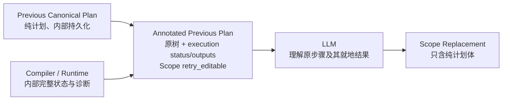
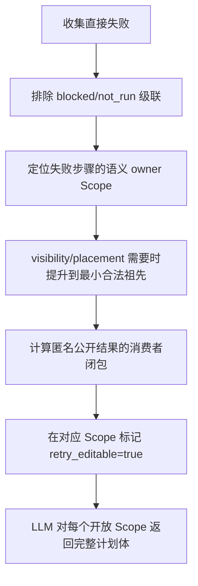
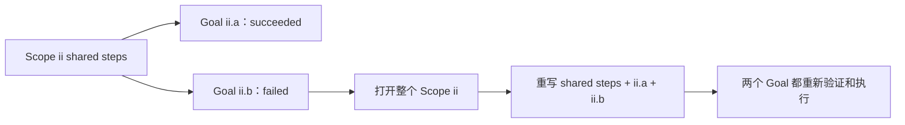
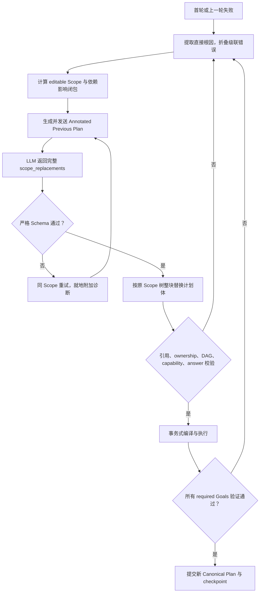

# FunctionalPlan Scope-level Retry vNext 设计

> 状态：R0–R5 已实现；生产已切换到 `functional-scope-repair/v1`，v4 已退役
> 日期：2026-08-27  
> 适用范围：FunctionalPlan 首轮计划失败后的 LLM repair 及其编译、执行、checkpoint 恢复  
> 相关但独立的设计：[原子 Macro 重设计](./path-minimum-macro-redesign.md)

实现记录：

- R0 `5004d3a`：设计、fixtures 与 v4 基线；
- R1 `de8ff21`：Annotated Plan 与无损 runtime projection；
- R2 `b16ca28`：Scope-only authority、严格 Schema 与整块 apply；
- R3 `d39f68b`：普通公共答案引用、自动 answer rebind 与 restore seed；
- R4 `e64498c`：生产入口原子切换；
- R5（本提交）：删除 v4 实现、prompt、Schema、publication 类型与旧 wire 测试，完成静态退役门禁。

## 1. 背景

当前 `functional-goal-repair/v4` 把运行时内部的许多概念直接暴露给了 LLM：

- Goal、Scope、Step 各自拥有编辑权限；
- `editable`、`partially_editable`、`frozen`、`read_only`、`context` 等多种权限；
- `fully_verified`、`authority_failed`、`runtime_failed`、`dependency_blocked`、`awaiting_execution` 等多种状态；
- `editable_step_ids`、`frozen_step_ids`、`promoted_step_ids` 等内部集合；
- `goal_replacements`、`scope_step_replacements`、`answer_binding_replacements` 三种 replacement map；
- `published_goal_ref`、`return_expectations`、`base_plan_id`、`base_retry_context_id` 等附加协议字段。

这些概念分别解决过局部问题，但组合后产生了两个根本缺陷：

1. LLM 不仅要修数学计划，还要理解 checkpoint、placement、合并算法和运行时权限模型。
2. 一次正常的“重写失败范围”会被拆成多种局部补丁，再由复杂合并算法重新拼回旧 Plan。

F4.3B 之后的透明 Macro 展开进一步放大了这个问题。Macro 内部步骤进入普通 Function Plan 后，retry 既要判断改 Macro 还是改展开步骤，又要维护展开前后的 identity、binding 和 step placement。该方案已经回滚；Macro 将保持为 LLM-facing 原子能力。

本设计不继续修补 v4，而是重新定义一个更小的 Retry 协议：

> **Scope 是 LLM 唯一的编辑边界；运行时负责识别根因、打开最小必要 Scope，并在 Scope 之外维护 checkpoint、权限、状态和依赖闭包。**

## 2. 设计目标

### 2.1 LLM 只做语义重规划

LLM 只需要回答三个问题：

1. 哪个 Scope 允许重写；
2. 该 Scope 内的完整步骤应该是什么；
3. 该 Scope 直接包含的每个 Goal 最终从哪个步骤返回值取答案。

LLM 不负责：

- 决定哪些成功步骤被冻结；
- 计算 checkpoint 是否可复用；
- 解释 placement promotion；
- 回显请求哈希或 Plan ID；
- 合并局部 step patch；
- 展开或修补 Macro 内部实现；
- 管理运行时的细粒度状态机。

### 2.2 单一编辑权限

对 LLM 而言，编辑权限只有两种：

- Annotated Previous Plan 中 Scope 的 `retry_editable=true`：整个 Scope 计划体可编辑；
- Scope 的 `retry_editable=false`：不可编辑。

不再在 Goal 或 Step 上设置权限，也不再存在“部分可编辑 Scope”。

### 2.3 单一 replacement 方式

LLM 对每个开放 Scope 返回完整 replacement：

- 该 Scope 的全部 `scope_steps`；
- 该 Scope 直接拥有的每个 Goal 的全部 `steps`；
- 每个直接 Goal 的 `answer_from`。

运行时按 Scope 整块替换，不再把新步骤投影到旧 slot，也不再混合 editable/frozen step。

### 2.4 保留严格正确性

简化 LLM 协议不代表放松验证。Scope replacement 应继续通过：

- JSON Schema；
- Scope/Goal 身份一致性；
- 引用可见性；
- capability 输入输出契约；
- DAG 与执行顺序；
- Goal answer 类型；
- runtime execution；
- checkpoint 读写签名；
- 所有 required Goal 的最终验证。

区别只在于：这些检查由代码执行，LLM 只收到可操作的根因诊断。

## 3. 非目标

本阶段不做以下改动：

- 不允许 LLM 新建、删除或移动 Problem 中的 Scope；
- 不允许 LLM 新建、删除或重命名 required Goal；
- 不允许修改题面事实、条件、目标类型或目标对象；
- 不把 Macro 展开为 LLM 可见的 Function steps；
- 不重新设计全部 Function/Macro capability schema；
- 不降低最终答案、写集合、读集合或 scope visibility 的验证强度；
- 不把 runtime 的全部内部状态删除。内部状态仍可用于调度、debug 和 checkpoint，只是不进入 LLM 协议。

## 4. 核心对象与所有权

### 4.1 代码持有的不可变结构

以下结构由 ProblemIR、GoalIR 和 canonical Plan authority 决定，Retry 不可修改：

- Scope 树及父子关系；
- Scope ID；
- required Goal 集合；
- 每个 Goal 的 ID、目标对象、答案类型和约束；
- Problem facts、conditions 和初始 SourceRef；
- capability 定义和 Macro 契约；
- 本轮允许编辑的 Scope 集合；
- 请求所针对的 base Plan、retry attempt 和 authority token。

### 4.2 LLM 可编辑的 Scope 计划体

本文所说的“Scope 计划体”是此前 `authored body` 的明确中文名称，指由 LLM 编写的计划内容。当 Scope `ii` 被打开时，LLM 可以重写：

```text
Scope ii 计划体
├── scope_steps：直接属于 ii、可供 ii 内多个 Goal/子 Scope 使用的步骤
└── direct goals：直接属于 ii 的每个 Goal
    ├── steps：该 Goal 的局部步骤
    └── answer_from：该 Goal 的公开答案来源
```

“整个 Scope 可编辑”不包括：

- 删除 Scope `ii`；
- 修改 `ii` 的父 Scope；
- 删除或增加 `ii` 的 direct Goal；
- 修改 Goal 的题意或答案类型；
- 修改 child Scope 的计划体，除非 child Scope 自身也标记为 `retry_editable=true`；
- 把输入侧只读的 `execution`、`retry_editable`、`required_answer` 或 `diagnostics` 注解复制到输出。

### 4.3 为什么以 Goal 上一级 Scope 为边界

一个 Scope 内的多个 Goal 往往共享步骤、对象和证明结构。只开放失败 Goal 会产生三类额外协议：

- 成功 Goal 的步骤是否允许被共享步骤影响；
- Goal 之间的引用如何冻结；
- Scope-owned step 改动后由谁同步所有消费者。

Scope 整块开放后，这些问题消失：LLM 可以统一重写共享步骤和所有 direct Goal，代码再整体验证。

代价是该 Scope 内原本成功的 Goal 也需要重新执行。我们接受这一代价，以换取更简单、可解释和稳定的协议。

## 5. LLM 可见的执行状态

Retry 不再发送一份与 Plan 分离的 execution tree。代码以 Previous Canonical Plan 为骨架生成只读的 **Annotated Previous Plan**，把状态直接挂到对应的 Scope、Goal 和 Step 上。

内部 Previous Canonical Plan 保持纯净，仍只包含计划；`execution`、`retry_editable`、`required_answer` 和 `diagnostics` 只存在于 Retry prompt 的投影视图中，不参与 canonical Plan hash。



Annotated Previous Plan 中的每个 Goal 和每个 Step 都带一个 `execution`。为避免把“执行状态”和“计算结果”都叫 result，统一使用：

- `execution.status`：三态执行状态；
- `execution.outputs`：成功 Step 本轮实际物化的完整公开 runtime results；
- `execution.partial_outputs`：runtime 失败前已经产生、但事务未提交的公开 returns；
- `execution.answer`：成功 Goal 由 `answer_from` 指向的最终 runtime 值。

`execution.status` 只使用三种值：

| 状态 | 含义 | 附加字段 |
|---|---|---|
| `succeeded` | 已完成编译和运行，并通过该层验证 | Step 必须带全部实际物化的公开 `outputs`；Goal 必须带最终 `answer` |
| `failed` | Step 直接失败，或 Goal 整体失败 | 直接失败节点必须带 `error.stage`；Goal 仅汇总失败子步骤时可不重复 error |
| `not_run` | 没有执行，可能在等待、被上游阻断或不在本轮有效执行闭包 | 被阻断时带 `blocked_by` |

`failed.error.stage` 只有两类：

- `validation`：Schema、引用、ownership、capability 契约、编译或 authority 校验失败；
- `runtime`：步骤实际执行后报错、结果不满足契约或数学验证失败。

一个汇总 `execution.status` 已足够表达编译校验与运行状态，不再增加两套状态机；实际计算结果由 `outputs/partial_outputs/answer` 表达：

| `execution` | 编译/校验 | 运行 |
|---|---|---|
| `succeeded` | 通过 | 已运行并通过 |
| `failed`, `stage=validation` | 失败 | 未运行 |
| `failed`, `stage=runtime` | 通过 | 已运行但失败 |
| `not_run` | 没有已知 validation failure；可能只完成了部分预检 | 未运行，可用 `blocked_by` 说明上游 |

示例：

```json
{
  "step_id": "derive_single_parameter_expression",
  "capability_id": "derive_parameter_expression",
  "args": {},
  "execution": {
    "status": "failed",
    "error": {
      "stage": "validation",
      "code": "functional.symbolic_state_basis_ambiguous",
      "message": "该步骤需要一个未知参数，但当前表达式仍含两个独立未知量 b、c。",
      "expected": {
        "independent_unknown_count": 1
      },
      "observed": {
        "independent_unknowns": ["b", "c"]
      },
      "suggestion": "增加消元或约束步骤，把表达式化为只含 b 或只含 c 的单参数形式。"
    }
  }
}
```

级联步骤只标记为未运行：

```json
{
  "step_id": "solve_parameter_minimum",
  "capability_id": "solve_parameter_value",
  "args": {},
  "execution": {
    "status": "not_run",
    "blocked_by": ["derive_single_parameter_expression"]
  }
}
```

状态与计划处在同一个结构位置，因此 LLM 不再需要用 `step_id` 把 Previous Plan、root failure 列表和 blocked 列表手工拼接。

### 5.1 状态挂载位置

诊断始终挂到最接近的语义节点：

- Step 编译、契约或运行失败：挂在该 Step 的 `execution.error`；
- Goal 的 `answer_from` 缺失、错误或歧义：挂在该 Goal 的 `execution.error`；
- Scope replacement 缺 Goal、placement 没有具体 Step 等结构错误：挂在该 Scope 的 `diagnostics`；
- 整份响应无法解析、无法归属任何 Scope：使用唯一的顶层 `previous_response_error`；
- 下游级联：Step 使用 `execution.status=not_run`，并以 `blocked_by` 指向直接失败 Step。

Goal 的 `execution.status` 是整体摘要，不产生 Goal 编辑权限。Scope 是否可编辑只看 `retry_editable`。

### 5.2 Runtime 结果投影

所有实际执行过的 Step 都必须把本轮**实际物化的全部公开 runtime results**投影到 `execution.outputs`，不能只发送状态、只发送被下游消费的 result，或只在失败诊断中摘录一部分。未被 runtime 物化的 optional return 不因 Retry 投影而被强制执行。

```json
{
  "step_id": "solve_minimum",
  "capability_id": "solve_quadratic_minimum",
  "args": {
    "expression": {
      "step_id": "derive_shared_expression",
      "return": "expression"
    }
  },
  "execution": {
    "status": "succeeded",
    "outputs": {
      "minimum_expression": {
        "runtime_type": "Expression",
        "value": "2*c^2 - 4*c + 5"
      },
      "minimum": {
        "runtime_type": "ExactNumber",
        "value": "3"
      },
      "attainment_parameter": {
        "runtime_type": "ParameterValue",
        "value": "1"
      }
    }
  }
}
```

每个 output value 使用统一的 prompt-safe runtime projection：

```json
{
  "runtime_type": "Point",
  "object_ref": "G",
  "value": {
    "x": "1",
    "y": "2*c - 1"
  }
}
```

投影规则：

- output key 必须是 capability 的公开 return name；
- capability 没有公开 return 时仍输出 `outputs: {}`，不能省略后让状态含义不确定；
- `runtime_type` 必须是 LLM catalog 中可见的公开类型；
- 表达式保留规范化后的完整符号表达式和自由符号；
- 整数、分数、根式等使用精确字符串，不用浮点近似替代；
- Point、Line、Parabola 等结构对象给出完整的公开定义字段；
- 候选集、等号成立 witness、区间和约束集合完整列出，不只给候选数量；
- 有稳定题面或状态对象身份时附 `object_ref`；匿名值不伪造名称；
- 不暴露 `StateVersionId`、`CallResultId`、checkpoint key、transaction ID 或 Macro 内部 invocation identity；
- 不允许静默截断。若单个值确实超过 prompt transport 上限，必须显式产生 typed projection error，不能让 LLM误以为残缺值是完整结果。

成功 Goal 还把 `answer_from` 对应的实际值附在 Goal 上，避免 LLM 再到 producer Step 中人工查找：

```json
{
  "answer_from": {
    "step_id": "solve_minimum",
    "return": "minimum"
  },
  "execution": {
    "status": "succeeded",
    "answer": {
      "runtime_type": "ExactNumber",
      "value": "3"
    }
  }
}
```

runtime 失败时，如果执行器在失败前已经得到部分公开结果，则放入 `partial_outputs`。这些值只用于诊断，事务已回滚，不能作为下一版 Plan 的合法 StepResultRef：

```json
{
  "execution": {
    "status": "failed",
    "partial_outputs": {
      "candidates": {
        "runtime_type": "CandidateSet",
        "value": ["G_1", "G_2"]
      }
    },
    "error": {
      "stage": "runtime",
      "code": "functional.runtime_search_ambiguous",
      "message": "找到两个满足当前约束的候选点，无法确定唯一结果。",
      "observed": {
        "candidate_count": 2
      },
      "suggestion": "补充能够区分 G_1 与 G_2 的几何约束。"
    }
  }
}
```

### 5.3 内部状态投影

以下内部状态可以继续存在，但不得按原名称进入 Retry prompt：

- `context_only`；
- `fully_verified`；
- `authority_failed`；
- `runtime_failed`；
- `dependency_blocked`；
- `awaiting_execution`；
- `valid`、`ready`、`blocked_by_dependency`、`pruned_dead`；
- checkpoint restored/invalidated；
- transaction committed/rolled_back。

统一投影规则为：

| 内部状态 | LLM 投影 |
|---|---|
| `fully_verified`、`runtime_verified` | `execution.status=succeeded` + 全部实际物化的公开 `outputs` |
| `authority_failed`、`authority_invalid` | `failed` + `stage=validation` |
| `runtime_failed` | `failed` + `stage=runtime` |
| `dependency_blocked` | `not_run` + `blocked_by` |
| `awaiting_execution`、`ready`、`valid` | `not_run` |
| `context_only`、`pruned_dead` | 节点若出现在 Annotated Previous Plan 中则投影为 `not_run`，不暴露内部名称 |

每个出现在 Annotated Previous Plan 中的 Step 都必须得到上述三态之一。公开 runtime outputs 必须进入 prompt；resolved input identity、checkpoint identity、事务和调度状态仍只写 debug。失败诊断除 `partial_outputs` 外，还可把解释错误所需的比较量放入 `error.observed`。

## 6. 编辑 Scope 的计算规则

运行时先区分“直接根因”与“级联未运行”，再计算最小必要 Scope 集合。

### 6.1 根因归属

| 根因位置 | 初始打开的 Scope |
|---|---|
| Goal-local step 校验或运行失败 | 该 Goal 的直接父 Scope |
| Goal 的 `answer_from` 无效或歧义 | 该 Goal 的直接父 Scope |
| Scope-owned step 失败 | 直接拥有该 step 的 Scope |
| placement/visibility 错误 | 能合法持有该步骤或共享结果的最小祖先 Scope |
| Macro call 失败 | 直接拥有该原子 Macro step 的 Scope |
| 纯级联 `not_run` | 不单独打开 Scope |
| 配置、注册或系统错误 | 不启动语义 Retry |

### 6.2 Scope 影响闭包

初始 Scope 集合产生后，代码计算依赖影响闭包：

1. 打开的 Scope 内全部 scope-owned steps 与 direct Goals 都视为可能改变。
2. 如果另一个 Scope 直接消费其匿名公开答案，并且 replacement 可能改变 producer step ID，则消费者 Scope 同轮打开。
3. 如果消费者读取的是稳定的命名 SourceRef，先保留消费者 Scope，通过重放验证该引用；只有引用或契约实际失效时再打开。
4. child Scope 不因为 parent Scope 打开而自动获得编辑权，但其依赖 checkpoint 可能被标记为需要重放。
5. sibling Scope 之间不因结构相邻而互相打开；只有各自存在根因或合法依赖影响时才打开。
6. `not_run` 本身不扩大编辑集合，因为它通常只是上游根因的结果。

计算结果投影到 Annotated Previous Plan 的 Scope 节点，形成唯一的 LLM 权限表达：

```json
{
  "scope_ref": "problem",
  "retry_editable": false,
  "child_scopes": [
    {
      "scope_ref": "ii",
      "retry_editable": true
    },
    {
      "scope_ref": "iii.1",
      "retry_editable": true
    }
  ]
}
```

`retry_editable=true` 的 Scope 完整可编辑；`false` 的 Scope 不可编辑。不再额外标记 Goal 或 Step 权限，也不再发送一份平行的 `editable_scopes` map。

### 6.3 Scope 打开示意



## 7. Retry 输入协议

建议新增 `functional-annotated-plan/v1`。它以 Previous Canonical Plan 的同构 Scope 树为主体，并附加本轮只读状态与 Scope 编辑权。

完整 Retry prompt 由四部分构成：

1. Problem planning context：题面事实、条件和不可变目标含义，不重复执行状态或编辑权限；
2. Annotated Previous Plan：Scope 树、required Goal 合同、上一版 canonical 计划、每个 Goal/Step 的三态状态、完整公开 runtime outputs、就地诊断和 Scope 编辑权；
3. Compact Capability Catalog：本轮可用 Function/Macro 契约；
4. Output Schema：只允许 scope replacement。

不再同时发送一份纯 Previous Plan 和一份平行 Retry Context。LLM 只看一棵已经对齐好的 Annotated Previous Plan。

### 7.1 建议 Schema

```json
{
  "schema_version": "functional-annotated-plan/v1",
  "previous_response_error": null,
  "root_scope": {
    "scope_ref": "ii",
    "retry_editable": true,
    "diagnostics": [],
    "scope_steps": [
      {
        "step_id": "derive_shared_expression",
        "capability_id": "derive_expression",
        "args": {
          "condition": "condition.path_constraint"
        },
        "execution": {
          "status": "succeeded",
          "outputs": {
            "expression": {
              "runtime_type": "Expression",
              "value": "b^2 + c^2 - 2*b - 4*c + 7"
            }
          }
        }
      }
    ],
    "goals": {
      "ii.a": {
        "required_answer": {
          "target_ref": "minimum_length",
          "answer_type": "ExactNumber"
        },
        "execution": {
          "status": "succeeded",
          "answer": {
            "runtime_type": "ExactNumber",
            "value": "2"
          }
        },
        "steps": [
          {
            "step_id": "solve_minimum",
            "capability_id": "solve_multivariable_quadratic_minimum",
            "args": {
              "expression": {
                "step_id": "derive_shared_expression",
                "return": "expression"
              }
            },
            "execution": {
              "status": "succeeded",
              "outputs": {
                "minimum": {
                  "runtime_type": "ExactNumber",
                  "value": "2"
                },
                "attainment_values": {
                  "runtime_type": "ParameterAssignment",
                  "value": {
                    "b": "1",
                    "c": "2"
                  }
                }
              }
            }
          }
        ],
        "answer_from": {
          "step_id": "solve_minimum",
          "return": "minimum"
        }
      },
      "ii.b": {
        "required_answer": {
          "target_ref": "parameter_c",
          "answer_type": "ParameterValue"
        },
        "execution": {
          "status": "failed"
        },
        "steps": [
          {
            "step_id": "derive_single_parameter_expression",
            "capability_id": "derive_parameter_expression",
            "args": {
              "relation": {
                "step_id": "derive_shared_expression",
                "return": "expression"
              }
            },
            "execution": {
              "status": "failed",
              "error": {
                "stage": "validation",
                "code": "functional.symbolic_state_basis_ambiguous",
                "message": "该步骤需要一个未知参数，但当前表达式仍含两个独立未知量 b、c。",
                "expected": {
                  "independent_unknown_count": 1
                },
                "observed": {
                  "independent_unknowns": ["b", "c"]
                },
                "suggestion": "先消去一个未知量，再求单参数最值。"
              }
            }
          },
          {
            "step_id": "solve_parameter_minimum",
            "capability_id": "solve_parameter_value",
            "args": {
              "expression": {
                "step_id": "derive_single_parameter_expression",
                "return": "expression"
              }
            },
            "execution": {
              "status": "not_run",
              "blocked_by": ["derive_single_parameter_expression"]
            }
          }
        ],
        "answer_from": {
          "step_id": "solve_parameter_minimum",
          "return": "parameter_value"
        }
      }
    },
    "child_scopes": []
  }
}
```

`required_answer` 是代码持有的不可变 Goal 合同。`execution` 是只读的上轮结果。即使 `ii.a` 上轮成功，只要它所在的 `ii` 为 `retry_editable=true`，它仍与 `ii.b` 一起完整开放并重新验证。

### 7.2 非 Step 错误的挂载

上一轮 replacement 缺少 direct Goal 等 Scope 结构错误，直接挂在对应 Scope：

```json
{
  "scope_ref": "ii",
  "retry_editable": true,
  "diagnostics": [
    {
      "stage": "validation",
      "code": "functional.scope_replacement_missing_goal",
      "message": "Scope ii 的 replacement 缺少 required Goal ii.a。",
      "suggestion": "完整返回 Scope ii 的 scope_steps，以及 ii.a、ii.b 两个 direct Goal。"
    }
  ]
}
```

只有整份 LLM 响应无法解析、因而无法归属具体 Scope 时，才使用顶层 `previous_response_error`：

```json
{
  "previous_response_error": {
    "stage": "validation",
    "code": "functional.repair_response_invalid_json",
    "message": "上一轮响应不是合法 JSON。",
    "suggestion": "只返回符合 functional-scope-repair/v1 的 JSON 对象。"
  }
}
```

### 7.3 不再进入输入协议的字段

以下字段应从 LLM-facing 输入删除：

- `editable_scopes` 平行 map；
- `root_failures` 平行列表；
- `not_run` 平行列表；
- `direct_goals.previous_result`；
- `previous_repair_issue`；
- `repair_permission`；
- `repair_reason`；
- `editable_step_ids`；
- `frozen_step_ids`；
- `promoted_step_ids`；
- `published_goal_ref`；
- placement normalization report；
- checkpoint restore 明细；
- StateVersion/CallResult identity、transaction log 和完整内部 runtime snapshot。

每个 Plan Step 都有一个就地 `execution.status`。已执行成功的 Step 同时携带全部实际物化的公开 `outputs`，runtime 失败的 Step 在可用时携带 `partial_outputs`，成功 Goal 携带最终 `answer`。这里删除的是内部 identity 和调度数据，不是数学执行结果。

## 8. Retry 输出协议

建议新增 `functional-scope-repair/v1`：

```json
{
  "schema_version": "functional-scope-repair/v1",
  "scope_replacements": {
    "ii": {
      "scope_steps": [
        {
          "step_id": "derive_shared_relation",
          "capability_id": "derive_symbolic_relation",
          "args": {
            "condition": "condition.path_constraint"
          },
          "output_targets": {
            "relation": "state.shared_relation"
          }
        }
      ],
      "goals": {
        "ii.a": {
          "steps": [
            {
              "step_id": "solve_minimum_length",
              "capability_id": "solve_quadratic_minimum",
              "args": {
                "expression": {
                  "step_id": "derive_shared_relation",
                  "return": "expression"
                }
              }
            }
          ],
          "answer_from": {
            "step_id": "solve_minimum_length",
            "return": "minimum"
          }
        },
        "ii.b": {
          "steps": [
            {
              "step_id": "solve_parameter_value",
              "capability_id": "solve_equality_condition",
              "args": {
                "minimum": {
                  "step_id": "solve_minimum_length",
                  "return": "minimum"
                }
              }
            }
          ],
          "answer_from": {
            "step_id": "solve_parameter_value",
            "return": "parameter_value"
          }
        }
      }
    }
  }
}
```

### 8.1 输出的严格要求

对每个开放 Scope：

- `scope_steps` 必须完整返回，允许为空数组；
- `goals` 的 key 必须与该 Scope 的 direct Goal 集合完全相等；
- 每个 Goal 的 `steps` 必须完整返回，允许为空数组；
- 每个 Goal 必须有且只有一个有效 `answer_from`；
- replacement 中不得包含 child Scope 计划体；
- `scope_replacements` 的 key 必须与 Annotated Previous Plan 中所有 `retry_editable=true` 的 Scope ID 完全相等；
- 不得修改 Scope ID、Goal ID、target 或 answer type。

### 8.2 删除三种旧 replacement map

vNext 不再使用：

```text
goal_replacements
scope_step_replacements
answer_binding_replacements
```

统一为：

```text
scope_replacements
```

`answer_from` 是 Goal body 的一部分，不再有 answer-only 特权或独立 patch 通道。

### 8.3 不让 LLM 回显 opaque authority

以下字段不再出现在 LLM 输出中：

- `base_plan_id`；
- `base_retry_context_id`；
- request hash；
- checkpoint ID；
- attempt authority ID。

Orchestrator 在请求 envelope 中持有这些值，并在接收响应时校验：

```text
send request
├── authority envelope：代码保存，不要求模型理解
└── LLM-visible prompt：只含语义计划与修复范围

receive response
├── 先用 envelope 校验响应是否过期
└── 再解析 functional-scope-repair/v1
```

模型没有能力独立验证这些 ID，要求回显只能增加 token 和漂移机会。

## 9. 结果引用模型

vNext 只保留两种正常引用：

### 9.1 SourceRef

引用题面对象或已有命名对象：

```json
"point.G"
```

如果步骤产生的是一个需要在后续长期复用的命名对象，可通过 capability 已有的 `output_targets` 绑定到合法的 existing object。vNext 不新增 scope-local derived name。

### 9.2 StepResultRef

直接引用某个步骤的返回值：

```json
{
  "step_id": "solve_minimum_length",
  "return": "minimum"
}
```

Goal 的公开答案已经由 `answer_from = {step_id, return}` 定义。后续 Goal 可以直接引用这个相同的 StepResultRef，不需要再包装成：

```text
published_goal_ref
derived name
return_bindings
```

### 9.3 跨 Goal 引用规则

跨 Goal StepResultRef 只允许引用 producer Goal 当前公开的 `answer_from`：

```text
consumer StepResultRef == producer Goal.answer_from
```

不允许绕过 Goal 公开接口，读取另一个 Goal 的任意内部步骤返回值。

这样既不需要 `published_goal_ref`，又保留清晰的 Goal 边界。

### 9.4 跨 Scope 引用规则

- ancestor Scope 的命名 SourceRef 可以按现有 visibility 规则供 descendant 使用；
- sibling Scope 不能直接读取彼此的内部步骤；
- child Scope 不能把内部结果反向泄漏给 parent；
- 跨 Scope 的匿名 Goal 答案只有在现有 lexical visibility 和 dependency 规则允许时，才能以公开 `answer_from` 的 StepResultRef 使用；
- 如果 producer Scope 被打开且其公开 step ID 可能变化，代码在生成 Retry Context 时把受影响 consumer Scope 加入编辑闭包；
- 若希望跨多个 Scope 稳定共享，应优先建立合法的命名 SourceRef，而不是新增 publication 语法。

## 10. 各类错误的处理逻辑

### 10.1 Goal-local validation 失败

例：Function 缺少必需输入、输入类型错误、返回名不存在、表达式自由符号数量不符合 capability 契约。

处理：

1. 生成一个 `stage=validation` 的直接根因；
2. 打开该 Goal 的直接父 Scope；
3. 该 Scope 的全部 direct Goals 一起可编辑；
4. 所有由该步骤阻断的步骤标记为 `not_run`，不单独形成根因；
5. LLM 返回整个 Scope replacement；
6. 运行时重新做完整 validation。

### 10.2 Goal-local runtime 失败

例：求解器无候选、等价验证失败、数值结果违反约束、执行异常。

处理与 validation 失败相同，只是诊断使用 `stage=runtime`，并包含 observed runtime facts。

诊断必须告诉 LLM“数学上哪里不成立”，不能只给内部异常名。例如：

```text
错误：该步骤要求把目标化成单参数函数。
当前：表达式仍含两个独立未知量 b、c。
建议：补充 b 与 c 的约束或先消去其中一个变量。
```

### 10.3 下游 blocked / not_run

例：`solve_c`、`evaluate_attainment`、`restore_point` 都因为上游 `derive_expression` 失败而未运行。

处理：

- 只把 `derive_expression` 作为直接根因；
- 下游以 `not_run + blocked_by` 解释依赖链；
- 不把三个下游步骤分别当成三个错误；
- 不因 `not_run` 单独打开更多 Scope。

### 10.4 Scope-owned step 失败

一个 scope-owned step 可能服务同 Scope 的多个 Goal。

处理：

- 打开直接拥有该 step 的 Scope；
- 该 Scope 的 `scope_steps` 和全部 direct Goals 一起重写；
- 不要求 LLM判断哪个成功 Goal被冻结；
- 该 Scope 内全部 checkpoint 作废并重算。

### 10.5 同 Scope 中一个 Goal 失败、另一个成功

假设 Scope `ii` 有 `ii.a` 和 `ii.b`：



`ii.a` 不冻结。LLM 可以保留原计划，也可以为了新的共享结构一起调整。代码最终重新验证 `ii.a`。

### 10.6 同 Scope 多个 Goal 同时失败

只创建一个 Scope repair，不创建多个 Goal repair。多个直接失败分别挂在各自 Step 或 Goal 的 `execution.error` 上，LLM 返回一次完整 Scope replacement。

### 10.7 多个 sibling Scope 分别失败

如果 `ii` 和 `iii` 各自有直接根因：

```json
{
  "scope_ref": "problem",
  "retry_editable": false,
  "child_scopes": [
    {
      "scope_ref": "ii",
      "retry_editable": true
    },
    {
      "scope_ref": "iii",
      "retry_editable": true
    }
  ]
}
```

两者都必须返回 replacement，但仍遵守 sibling visibility；开放两个 Scope 不等于允许互读内部步骤。

### 10.8 child Scope 失败

默认只打开直接拥有失败 Goal/step 的 child Scope。parent 和 sibling 不自动开放。

如果根因其实是“共享步骤放错层级，child 需要 parent 提供”，placement analyzer 会把最小合法祖先作为 root repair Scope；必要时同时打开受影响 child consumer Scope。

### 10.9 ancestor Scope-owned step 失败

处理：

1. 打开 ancestor Scope；
2. 不自动允许修改 descendant body；
3. 使依赖该 ancestor 输出的 descendant checkpoint 失效；
4. replacement 后重放 descendant；
5. 如果 descendant 使用匿名 StepResultRef，且 producer identity 可能变化，则在本轮影响闭包中预先打开该 descendant Scope；
6. 如果读取稳定 SourceRef，先重放，只有契约失效才在下一轮打开 descendant Scope。

### 10.10 placement / visibility 失败

placement 是代码职责。Retry 不展示 `promoted_step_ids`。

示例诊断：

```json
{
  "step_id": "derive_shared_state",
  "execution": {
    "status": "failed",
    "error": {
      "stage": "validation",
      "code": "functional.step_input_not_visible",
      "message": "该步骤的输入只在 Scope ii 可见。",
      "observed": {
        "current_scope": "root"
      },
      "expected": {
        "minimum_legal_scope": "ii"
      },
      "suggestion": "请在 Scope ii 的 replacement 中重新建立该步骤。"
    }
  }
}
```

运行时直接打开 `ii`。LLM 看到的是应放置在哪里，而不是内部 promotion 过程。

### 10.11 `answer_from` 无效

分两类处理：

1. **唯一可确定**：当前 Goal 只有一个类型兼容、可见且已验证的公开返回值。代码直接重绑 `answer_from`，不启动 LLM Retry。
2. **无法确定或有多个候选**：打开 Goal 的直接父 Scope，诊断列出候选和歧义原因，由 LLM 返回完整 Scope replacement。

不再有 `answer_binding_replacements` 或 `answer_only` 权限。

### 10.12 Macro 失败

Macro 对 LLM 始终是一个原子 step：

```text
输入：Macro 的公开 roles/args
输出：Macro 的公开 returns
失败：Macro call 的一个根因诊断
```

处理：

- 打开拥有该 Macro step 的 Scope；
- 允许 LLM 修改 Macro 参数、换用另一个公开 capability，或改写 Scope 中的其他步骤；
- 不向 LLM 展示 Macro 内部 invocation steps；
- 不允许 retry 在内部展开步骤上打补丁；
- shadow fragment、runtime search 和内部证明细节只用于生成 Macro 根因诊断。

### 10.13 LLM replacement 自身不合法

例：漏掉 direct Goal、返回额外 Scope、step 引用越界、JSON Schema 不合法。

处理：

- 不执行不合法 replacement；
- 保持同一批 Scope 的 `retry_editable=true`；
- 能归属 Scope 的问题写入该 Scope 的 `diagnostics`，整份响应无法解析时写入顶层 `previous_response_error`；
- 仍要求完整 Scope replacement；
- 不退化为部分 patch，也不扩大 Scope，除非新的代码分析证明根因范围确实改变。

### 10.14 重复失败或没有进展

运行时对规范化后的 replacement、根因集合和结果签名计算内部 hash。

如果连续 attempt 出现完全相同的 replacement 和完全相同的根因：

- 标记 `functional.retry_no_progress`；
- 停止无意义重试，或在预算允许时只追加一次明确的 no-progress 诊断；
- 达到 retry budget 后返回 typed failure；
- hash 只写 debug，不要求 LLM 回显。

### 10.15 configuration / nonretryable 错误

以下错误不应启动语义 LLM Retry：

- capability 未注册；
- method spec 与实现不一致；
- Schema 编译器自身异常；
- checkpoint 数据损坏；
- orchestrator authority 不一致；
- runtime 环境缺失。

这些错误应 fail-loud，分类为系统或配置错误。相反，“计划还没有把两个未知量化成一个”属于 planner-repairable validation 错误，不能笼统归为 configuration/nonretryable。

### 10.16 过期响应

LLM 不回显 `base_plan_id`。Orchestrator 通过内部 request envelope 判断响应是否仍对应当前 Plan：

- 匹配：继续解析；
- 不匹配：丢弃为 stale response；
- 不把 stale response 当成新的数学失败；
- debug 记录 request/response authority 和 attempt。

## 11. Retry 应用与执行流程



### 11.1 应用顺序

1. 校验响应属于当前内部 authority envelope；
2. 校验 `functional-scope-repair/v1` Schema；
3. 校验 replacement key 与全部 `retry_editable=true` Scope ID 完全相同；
4. 校验每个 Scope 的 direct Goal 集合完全相同；
5. 将开放 Scope 的计划体整块替换到原 Scope 树；
6. 对所有 step 重新做 placement normalization；
7. 校验 SourceRef、StepResultRef、ownership、visibility 和 DAG；
8. 编译 capability 调用；
9. 在事务中恢复可复用 checkpoint，并执行失效部分；
10. 校验全部 required Goals；
11. 成功则 commit，失败则 rollback 并产生下一轮根因。

### 11.2 不再使用混合合并算法

vNext 不调用“把新步骤比例投影到旧 editable slots，再钉回 frozen steps”的 merge 逻辑。

对开放 Scope：旧计划体被完整替换。  
对未开放 Scope：旧计划体原样保留。

因此不会再出现：

```text
新步骤被投影到旧位置 4
保留步骤被钉在旧位置 5
下一新步骤又回到旧位置 4
=> 5 → 4 的虚假 step_order_invalid
```

## 12. Checkpoint 与事务

### 12.1 失效规则

开放 Scope 中：

- 所有 scope-owned step checkpoint 失效；
- 所有 direct Goal-local step checkpoint 失效；
- 所有 direct Goal 重新执行和验证；
- 不因为某个 Goal 上轮成功而冻结它。

开放 Scope 之外：

- 只有 read signature、write signature、capability version 和上游结果 identity 都未变化时才恢复 checkpoint；
- 依赖已变化 producer 的消费者必须重放；
- 若重放发现 authored reference 已失效，再打开消费者所在 Scope。

### 12.2 事务边界

一次 Scope repair 应作为一个事务：

```text
validate replacement
→ build candidate canonical plan
→ execute invalidated subgraph
→ verify all required goals
→ commit
```

任何阶段失败都 rollback candidate writes，避免：

- ghost write；
- 部分 Goal 使用新结果、部分 Goal 使用旧结果；
- checkpoint 指向未提交 step identity；
- 下一轮 prompt 混用两个 Plan 版本。

## 13. 旧协议与 vNext 对照

| 旧设计 | vNext |
|---|---|
| Goal/Scope/Step 多层权限 | 只有 Scope 上的 `retry_editable: true/false` |
| `editable/partially_editable/frozen/read_only/context` | 一个布尔值，不再有 Goal/Step 权限 |
| 三张 replacement map | 一张 `scope_replacements` |
| 局部 step merge | Scope 计划体整块替换 |
| 七种以上执行状态 | `succeeded/failed/not_run` |
| Previous Plan 与 execution tree 分离 | 同构 Annotated Previous Plan，就地挂载 `execution` |
| 成功 Step 只给状态或零散摘录 | `execution.outputs` 完整覆盖本轮实际物化的公开 runtime results |
| Goal 只给 `answer_from` 指针 | 同时附加 `execution.answer` 的实际值 |
| `root_failures`、`not_run` 平行列表 | 诊断直接挂在对应 Step/Goal/Scope |
| `published_goal_ref` | 直接引用 producer Goal 的 `answer_from` StepResultRef |
| `return_bindings`/derived name | 不作为通用结果通道；使用 SourceRef 或 StepResultRef |
| LLM 回显 base IDs | Orchestrator envelope 内部校验 |
| LLM 填 `return_expectations` | compiler 从 capability 与消费者推导 |
| `promoted_step_ids` | 仅 debug，prompt 只给 placement 根因与目标 Scope |
| Macro 展开步骤可见 | Macro 是原子 step |
| 成功 Goal 局部冻结 | 开放 Scope 内所有 direct Goal 重算 |

## 14. Prompt 编写原则

System prompt 应只描述以下规则：

1. 除 `schema_version` 外只能返回 `scope_replacements`；
2. 必须完整返回每个开放 Scope；
3. 必须包含该 Scope 全部 direct Goals；
4. 不得修改 Scope/Goal identity；
5. 只能使用 catalog 中的 capability；
6. 引用只使用 SourceRef 或 StepResultRef；
7. 跨 Goal 只能读取 producer Goal 的公开 `answer_from`；
8. Macro 是原子能力，不展开；
9. 输入中的 `execution`、`retry_editable`、`required_answer`、`diagnostics` 都是只读注解，不得复制到 replacement；
10. 最终返回严格 JSON。

不应在 prompt 中解释：

- checkpoint 算法；
- frozen interval；
- promotion bookkeeping；
- internal status taxonomy；
- authority hash；
- replacement merge 实现；
- debug artifact layout。

## 15. Debug 数据要求

简化 LLM 协议后，debug 仍需完整，以便分析每一轮：

```text
attempt-N/
├── prompt.system.md
├── prompt.user.md
├── response.raw.txt
├── response.parsed.json
├── annotated-previous-plan.llm.json
├── internal-root-causes.json
├── internal-scope-authority.json
├── candidate-plan.json
├── validation-result.json
├── runtime-result.json
└── metadata.json
```

要求：

- 每个 attempt 保存该轮真实 prompt 和真实 raw response；
- 不得用 `planner.last_prompt` 覆盖前面 attempt；
- `attempt_count` 与目录数量、metadata 中 attempt index 一致；
- LLM-facing context 与 internal authority 分文件保存；
- 内部可以记录 promoted steps、checkpoint、status 和 hashes；
- debug 信息不得反向扩大 LLM output schema。

## 16. 关键不变量

实现必须满足以下不变量：

1. Scope 树和 required Goal identity 永远由代码持有。
2. `scope_replacements.keys` 等于 Annotated Previous Plan 中全部 `retry_editable=true` 的 Scope ID。
3. replacement 中 Goal keys 等于该 Scope 的 direct Goal keys。
4. 开放 Scope 使用完整替换，不做 editable/frozen 混合合并。
5. 未开放 Scope 的计划体不被 LLM 修改。
6. sibling Scope 即使同时开放也不能非法互读。
7. 跨 Goal StepResultRef 必须等于 producer Goal 的当前 `answer_from`。
8. Macro 对 LLM 始终是原子 step。
9. Annotated Previous Plan 中每个 Goal 和 Step 都有且只有一个 `execution.status`，取值为 `succeeded/failed/not_run`。
10. 每个 `status=succeeded` Step 的 `outputs.keys` 等于本轮实际物化的全部公开 runtime result names，值使用完整、精确、prompt-safe runtime projection；未物化 optional returns 不在集合中。
11. 每个 `status=succeeded` Goal 的 `execution.answer` 等于其 `answer_from` 指向的实际 runtime 值。
12. `partial_outputs` 只用于解释失败，不能成为下一版 Plan 的可引用 producer。
13. `execution`、`retry_editable`、`required_answer`、`diagnostics` 不进入 replacement，也不参与 canonical Plan hash。
14. `promoted_step_ids`、checkpoint 和内部状态原名不进入 LLM 协议。
15. authority ID 由请求 envelope 校验，不由 LLM 回显。
16. replacement 执行失败时没有 ghost write。
17. 只有全部 required Goals 最终验证成功，candidate Plan 才能 commit。

## 17. 实现分阶段

为避免再次出现长期双执行路径，迁移采用“测试并行、生产单路切换”：vNext 可在测试/debug 中生成 shadow projection，但不得与 v4 同时驱动生产执行。

### R0：基线与 fixtures（COMPLETE）

- 固化当前 F4.3A 后的 recorded replay；
- 固化多 Goal、嵌套 Scope、跨 Goal 引用、Macro 失败 fixtures；
- 固化每轮 debug attempt 正确写入；
- 记录当前 v4 prompt 大小与 Schema 字段数。

### R1：Annotated execution 投影（COMPLETE）

- 新增 internal status → `succeeded/failed/not_run` 投影；
- 以 Previous Canonical Plan 为骨架生成 `functional-annotated-plan/v1`；
- 为每个 Goal/Step 就地附加 `execution`，为每个 Scope 附加 `retry_editable`；
- 为所有已执行 Step 投影完整公开 `outputs`，为成功 Goal 投影最终 `answer`；
- 为 runtime 失败投影可用的 `partial_outputs`，并禁止其成为可执行引用；
- 折叠级联 blocked；
- 新增可操作的 validation/runtime 诊断；
- 删除平行 `root_failures`、`not_run` 和 `editable_scopes` 输入结构；
- 从 LLM context 隐藏 promoted/checkpoint/internal status 原名；
- 暂不改变生产 repair apply。

### R2：Scope-only authority 与完整替换（COMPLETE）

- 实现 root failure → owner Scope；
- 实现最小祖先与消费者影响闭包；
- 新增 `functional-scope-repair/v1` parser/validator；
- 实现 Scope 计划体整块替换；
- 禁止 vNext 进入旧 mixed-scope merge。

### R3：引用简化（COMPLETE）

- 用 producer Goal 的公开 `answer_from` StepResultRef 取代 `published_goal_ref`；
- 禁止读取其他 Goal 的内部返回值；
- 清除通用 derived-name/return-binding 通道；
- 保留合法的 SourceRef 与 StepResultRef。

### R4：移除 LLM authority 回显与 return expectations（COMPLETE）

- 把 base Plan/retry context authority 移入 orchestrator envelope；
- 删除 LLM output 中 opaque IDs；
- compiler 从 capability、consumer 和 Goal 合同推导 return form；
- 删除 LLM-authored `return_expectations`。

### R5：切换与删除旧协议（COMPLETE）

- 在 recorded、unit、integration 和定向 live smoke 通过后原子切换生产协议；
- 删除 v4 三张 replacement map；
- 删除 Goal/Step repair permissions；
- 删除 mixed editable/frozen merge；
- 删除 LLM-facing publication/promotion 字段；
- 同步 roadmap、设计文档和 debug 规范。

R5 最终验收（2026-08-28）：

- 全量 Solver 并行回归：`2281 passed, 12 skipped in 148.34s`；无额外 `serial` 测试；
- live 批次 `functional-scope-retry-vnext-5x3-final-4`：五题各三份、并发 15，`15/15` completion、compile、Plan authority、final contract 与 transaction gate 全部通过；
- 共 `20` 次 semantic attempt、`4` 次 Scope Retry、恢复 `10` 个 call，solved call 重执行为 `0`；
- configuration error、unclassified error、ghost write、repair authority drift 与 prompt identity leak 均为 `0`；
- 代表性 live Scope Retry prompt 为 `45,936` 字符，低于 R0 v4 基线 `68,481` 字符约 `32.9%`；response Schema 为 `3,745` 字符、`19` 个 property occurrence，替换表从 `3` 张降为 `1` 张。

## 18. 测试矩阵

### 18.1 Schema 与 authority

- 缺少开放 Scope；
- 返回额外 Scope；
- 缺少 direct Goal；
- 返回额外 Goal；
- 修改 Scope/Goal identity；
- stale response；
- 非法 child Scope 计划体；
- 非法 sibling 引用。
- 每个 Goal/Step 都有且只有一个三态 `execution.status`；
- 成功 Step 的 output key 精确覆盖本轮实际物化的全部公开 runtime results；
- 表达式、精确数值、几何对象、候选集、约束和 witness 无损投影；
- 成功 Goal 的 `execution.answer` 与 `answer_from` runtime 值相同；
- runtime 失败的 `partial_outputs` 对 LLM 可见但不可引用；
- runtime output projection 不泄漏 StateVersion/CallResult/checkpoint identity；
- 超出 transport 上限时产生 typed error，不静默截断；
- `retry_editable` 只出现在 Scope，Goal/Step 不出现编辑权限；
- response schema 拒绝输入侧只读注解。

### 18.2 错误分类

- validation 直接失败；
- runtime 直接失败；
- validation/runtime 错误就地挂到对应 Step；
- `answer_from` 错误就地挂到对应 Goal；
- Scope 结构错误就地挂到 Scope `diagnostics`；
- 多个下游都标为 `not_run`，但只有直接失败 Step 带根因 `error`；
- planner-repairable 自由符号错误不被归为 configuration；
- capability 注册错误不触发语义 Retry。

### 18.3 Scope authority

- 同 Scope 一成一败时整个 Scope 打开；
- 同 Scope 多 Goal 同时失败只产生一个 replacement；
- sibling Scope 同时失败时分别打开；
- child 失败默认只开 child；
- ancestor scope step 失败只开 ancestor，并正确重放 descendants；
- placement 错误打开最小合法祖先；
- 匿名 producer 改动时 consumer Scope 进入影响闭包；
- 稳定 SourceRef producer 改动时 consumer 先重放而非无条件打开。

### 18.4 引用与答案

- same-scope Goal 直接读取另一个 Goal 的公开 `answer_from`；
- 拒绝读取另一个 Goal 的内部返回值；
- 唯一兼容答案由代码自动重绑；
- 多候选答案打开 owning Scope；
- 不出现 `published_goal_ref`；
- 不出现通用 derived name 或 `return_bindings`。

### 18.5 Macro

- Retry prompt 只出现 Macro 原子 call；
- Macro validation/runtime 失败产生一个根因；
- debug 可含内部 shadow 信息，但 response schema 不能编辑内部 invocation；
- replacement 可以修 Macro args 或换公开 capability。

### 18.6 Checkpoint 与事务

- 开放 Scope 全部 direct Goals 重算；
- 未开放且签名相同的 Scope 恢复 checkpoint；
- producer 改动使消费者 checkpoint 失效；
- runtime 失败后无 ghost write；
- candidate 失败后 base Plan 保持不变。

### 18.7 Retry 多轮与 debug

- replacement Schema 失败后同 Scope 重试；
- 每轮保留真实 prompt/raw response；
- attempt 序号和 attempt_count 正确；
- repeated identical failure 触发 no-progress；
- 达到预算后 typed failure；
- Annotated Previous Plan 与内部 Canonical Plan 同构且不改变 Plan hash；
- LLM context 不含内部 permission/status 原名和 promotion 字段。

## 19. 验收标准

功能验收：

- 所有 required Goals 的现有 recorded 回放通过；
- 重点题目的定向 live smoke 通过；
- 多 Goal、嵌套 Scope、Macro、checkpoint 专项通过；
- vNext 生产路径不再调用 mixed editable/frozen merge；
- Macro 不再透明展开到 LLM repair。

协议验收：

- LLM 输入只有一棵 Annotated Previous Plan，不再并列发送 execution tree 或 Retry Context；
- 每个 Goal/Step 都就地附加 `execution.status=succeeded/failed/not_run`；
- 每个成功 Step 都附加本轮实际物化的全部公开 `execution.outputs`，每个成功 Goal 都附加最终 `execution.answer`；
- runtime 失败在可用时附加只读 `execution.partial_outputs`；
- LLM edit authority 只有 Scope 上的 `retry_editable: true/false`；
- LLM output 只有一张 `scope_replacements`；
- 不含平行的 `editable_scopes`、`root_failures`、`not_run` 列表；
- 不含 `repair_permission`、`editable_step_ids`、`frozen_step_ids`；
- 不含 `promoted_step_ids`、`published_goal_ref`；
- 不要求回显 base IDs；
- 不要求填写 `return_expectations`；
- 不提供通用 derived-name/return-binding 第三通道。

可观测性验收：

- 每轮 attempt 数据真实且互不覆盖；
- 根因与级联未运行可明确区分；
- scope authority 的内部计算可在 debug 中解释；
- LLM-facing context 与 internal runtime report 可一一对应，但不共享复杂 Schema。

## 20. 最终设计结论

Retry vNext 的核心协议可以概括为：

```text
代码：识别直接根因
→ 代码：计算最小必要 editable Scope 集合
→ 代码：生成就地附加三态状态和 Scope 权限的 Annotated Previous Plan
→ LLM：完整重写 `retry_editable=true` Scope 的计划体
→ 代码：严格校验、事务执行、恢复安全 checkpoint
→ 全部 Goal 成功后提交
```

LLM 不再参与“哪些步骤冻结、补丁如何合并、结果如何发布、ID 如何回显”等运行时 bookkeeping。

这套设计有意给开放 Scope 内的 LLM 更大语义自由，同时把结构、安全和一致性收回代码。它与原子 Macro 的方向一致：**公开接口保持小而稳定，复杂执行机制留在 runtime 内部。**
