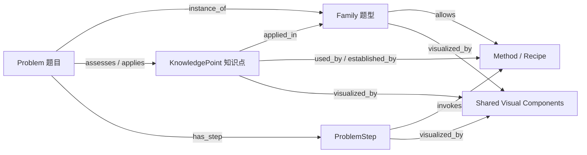

# 不等式知识图谱与可视化组件绑定重构设计

## 1. 文档状态与目标

本文定义不等式可视化组件从“页面内 `visual.kind` 分支”升级为“由 KnowledgePoint、Family、Problem 及其步骤 Method/Recipe 共同驱动的声明式视觉能力”的目标架构。

最终生产链保持为：

```text
ProblemIR
→ FamilyRegistry 匹配
→ KnowledgePoint/Family/Problem 图谱关系解析
→ LLM 生成 FunctionalPlan（method plan）
→ Method/Macro 确定性执行并验证
→ ExplanationSnapshot
→ LessonIR
→ KnowledgePoint/Family/Problem/Method visual binding
→ VisualComponentPlan
→ VisualStepIR
→ 组件编译器
→ 可视化课程页
```

本次重构解决四个问题：

1. 将当前不等式页面中重复的数轴、符号图、函数图和公式映射收敛为共享视觉引擎；
2. 将知识点、题型（Family）和具体题目建模为知识图谱中的三类实体，并让三类实体分别绑定共享视觉组件；
3. 让 LLM 只负责选择数学方法和讲解重点，不直接生成组件名、HTML、SVG 坐标或前端代码；
4. 让 method plan 中的 verified method 自动、稳定地调用对应视觉组件。

本文是 `docs/method-solver-architecture.md`、`docs/explanation-builder-design.md` 与 `docs/visual-step-ir-design.md` 在数学教学组件绑定方面的细化设计。

## 2. 核心判断

### 2.1 三类知识图谱实体必须分开

知识点、题型和题目不是同一对象的三个展示层次，而是知识图谱中的三类实体：

| 图谱实体 | 学生问题 | 当前/目标事实源 | 视觉目标 |
| --- | --- | --- | --- |
| 知识点 `KnowledgePoint` | 这个概念、性质或方法是什么？ | 待新增 `KnowledgePointSpec` | 定义、性质、证明、适用条件和概念关系 |
| 题型 `Family` | 看到这类题通常该怎么组织思路？ | 现有 `SolverFamilySpec` | 识别信号、常见目标、策略骨架和 method 菜单 |
| 具体题目 `Problem` | 这道题每一步怎样得到？ | `ProblemIR`、FunctionalPlan 与 verified execution | 本题对象、数值、步骤、图形变化和结论 |

`Method/Recipe` 不与这三类实体并列。它们是题目求解步骤的可执行机制：

- Family 声明这类题允许或常用哪些 Method/Recipe；
- FunctionalPlan 为具体 Problem 选择并编排 Method/Recipe；
- Problem 的 Lesson step 由 verified Method/Recipe invocation 产生；
- KnowledgePoint 可以与 Family、Method/Recipe 和 Problem 同时建立关联。

三类图谱实体不应维护三套绘图代码。它们分别绑定共享视觉引擎，并使用不同的数据来源、信息密度和外层布局。



### 2.2 LLM 不直接调用前端组件

LLM 的稳定输出仍是 `functional_plan/v1`。LLM 可以决定：

- 使用哪个 method 或 recipe；
- method 的 canonical inputs；
- 哪些数学步骤需要重点讲解；
- 在允许范围内选择讲解粒度。

LLM 不可以决定：

- 任意前端 `component_id`；
- SVG 路径、坐标、颜色和 DOM；
- 未经 KnowledgePointSpec、MethodSpec 或 FamilySpec 声明的视觉变体；
- 从题面字符串猜测根、禁值、等号点或答案；
- 用 expected answer 补全视觉数据。

Problem step 的组件选择由 canonical、verified method invocation 和声明式 binding 确定；KnowledgePoint 与 Family 的组件则由各自版本化 spec 确定。换言之：

> LLM 为题目选择数学方法；KnowledgePoint、Family 和 Method 声明视觉语义；Problem 聚合步骤实例；绑定器填充角色，组件负责渲染。

## 3. 当前基础与需要调整的边界

当前系统已经存在：

- `SolverFamilySpec.method_ids` 与 `step_recipes`：限定 Family 可用的方法菜单；
- `MethodSpec.visual`：声明 method 的视觉角色、scene、annotation 和 timeline 模板；
- `ExplanationSnapshot`：提供 canonical、runtime verified、goal reachable 的事实；
- `LessonIR`：保存教学步骤、method ids、object roles 和 visual intent hints；
- `VisualStepIR`：保存对象、角色、场景、交互和动画；
- `ComponentTypeSpecRegistry`：注册 VisualStepIR 组件与低层图元的编译关系。

当前系统尚缺：

- 一等的 `KnowledgePointSpec`；
- KnowledgePoint、Family、Problem、Method/Recipe 之间的带类型图谱关系；
- KnowledgePoint 和 Problem 自身的统一视觉绑定协议。

当前不等式静态页面中的 `visual.kind` 更接近已经实例化的页面组件，例如：

- `polynomial-threading-graph`；
- `rational-threading-graph`；
- `number-line-reasoning`；
- `quadratic-function-sign-graphs`；
- `basic-inequality-mapping`；
- `fixed-product-construction-flow`。

重构后，这些名称不再同时承担“数学机制、教学层次、前端实现”三种职责，而拆分为：

```text
知识语义：knowledge point / family / problem
步骤机制：method / recipe
绑定范围：binding_scope
视觉能力：component_id + variant
具体内容：role bindings + verified facts
前端实现：renderer/compiler
```

## 4. 总体分层

```text
┌──────────────────────────────────────────────┐
│ Knowledge Graph Resolution                   │
│ KnowledgePoint ↔ Family ↔ Problem            │
└──────────────────────┬───────────────────────┘
                       │ family/context projection
┌──────────────────────▼───────────────────────┐
│ LLM FunctionalPlan                           │
│ Problem steps: method_id + args + recipe     │
└──────────────────────┬───────────────────────┘
                       │ execute + verify
┌──────────────────────▼───────────────────────┐
│ ExplanationSnapshot / LessonIR               │
│ verified facts + method ids + teaching steps │
└──────────────────────┬───────────────────────┘
                       │ deterministic resolve
┌──────────────────────▼───────────────────────┐
│ Visual Binding Layer                         │
│ KnowledgePoint / Family / Problem bindings   │
│ + MethodVisualBinding for problem steps      │
└──────────────────────┬───────────────────────┘
                       │ emit
┌──────────────────────▼───────────────────────┐
│ VisualComponentPlan                          │
│ component id/version/scope/variant/roles     │
└──────────────────────┬───────────────────────┘
                       │ validate + compile
┌──────────────────────▼───────────────────────┐
│ VisualStepIR → shared renderer               │
└──────────────────────────────────────────────┘
```

### 4.1 KnowledgePoint 的职责

KnowledgePoint 描述可复用的数学概念、性质、定理、方法和它们之间的关系，负责：

- 定义、命题、等价形式、前提、结论和反例边界；
- prerequisite、part-of、equivalent-to、generalizes 等知识关系；
- 与 Family 的 `assessed_by / applied_in` 关系；
- 与 Method/Recipe 的 `used_by / established_by / requires` 关系；
- KnowledgePoint 自身的视觉组件绑定，例如定义图、证明图和性质比较表。

当前系统尚未建立统一 `KnowledgePointSpec`，这是本设计必须新增的模型，不能继续把知识点寄存在 Family profile 中。

### 4.2 Family 的职责

Family 对应题型，描述“这类题通常具有什么结构、目标和策略骨架”，负责：

- method/recipe allowlist；
- 与相关 KnowledgePoint 的显式关系；
- 题型识别与策略总览组件；
- 多个 method 视觉的组合、排序和去重策略；
- 本 Family 推荐的视觉表达，不包含具体题目数值；
- 该题型允许出现的视觉组件集合。

Family 不负责：

- 指定单题的 method 链；
- 计算根、区间符号或解集；
- 直接生成 SVG/HTML；
- 按 problem id 写视觉分支。

### 4.3 Method/Recipe 的职责

Method/Recipe 对应具体题目中的一个或一组求解步骤。它描述“一个可执行数学动作如何被看见”，负责：

- 声明视觉语义角色；
- 声明该方法可以映射到哪些共享组件；
- 声明角色绑定器和适用谓词；
- 声明必要的 source facts 与 runtime checks；
- 提供 problem step 的教学流程或 timeline 模板；
- 声明该步骤使用、建立或验证了哪些 KnowledgePoint。

例如“分式不等式移项通分并按临界点判号”method 应声明：

- transformed expression；
- numerator roots；
- denominator forbidden points；
- interval signs；
- equality policy；
- solution set。

它不应声明这些点在屏幕上的像素位置。

### 4.4 Problem 的职责

Problem 是具体题目实体，负责：

- 通过 `instance_of` 关联一个 Family；
- 通过 `assesses / applies` 关联一个或多个 KnowledgePoint；
- 保存 ProblemIR、条件、目标和题面对象；
- 保存 FunctionalPlan 产生的步骤图；
- 每个步骤通过 verified Method/Recipe invocation 绑定视觉组件；
- 聚合步骤组件，形成题目级可视化页面。

Problem 不手写一套独立 renderer。其视觉绑定主要由 method plan 派生，必要的 authored teaching override 也必须引用稳定 step、method 和 source facts。

### 4.5 组件的职责

组件只负责把已经绑定并验证的数据呈现出来：

- 确定性布局；
- 坐标变换；
- 标签避碰；
- 响应式版式；
- 交互与动画；
- 可访问性文本；
- 前端输出。

组件不能重新求解题目，也不能从显示文本反推数学事实。

## 5. 三类图谱实体的视觉绑定协议

新增统一字段：

```text
binding_scope = knowledge_point | family | problem_step | problem
```

### 5.1 KnowledgePoint 绑定

来源为 `KnowledgePointVisualProfile.components`，适合：

- 一元二次不等式按开口和判别式分类；
- 高次不等式“奇穿偶不穿”总览；
- 绝对值不等式三种方法比较；
- 基本不等式三种证明与使用条件。

KnowledgePoint 绑定允许：

- 多列比较；
- 抽象变量；
- 同一组件的多个典型状态；
- authored、可验证的知识事实。

KnowledgePoint 绑定不读取某道题的 answer producer。其事实来源必须是版本化 `KnowledgePointSpec`，而不是 Family 或题目页面中的散落文案。

### 5.2 Family 绑定

来源为 `FamilyVisualProfile.type_components`，适合：

- 题型结构识别；
- 常见目标与条件信号；
- 策略分支和标准 recipe；
- 这类题中 Method/Recipe 的典型编排。

Family 绑定展示题型的策略骨架，但不承担知识点定义，也不代入具体题目数值。

### 5.3 Problem step 的 Method/Recipe 绑定

来源为 `MethodVisualBinding` 或 `RecipeVisualBinding`，适合：

- 作差法：目标 → 作差 → 因式符号 → 结论；
- 构造定积：看目标 → 查定积 → 找线索 → 构造 → 验定积；
- 穿针引线：标准化 → 标临界点 → 定符号 → 取区间；
- 待定系数：拆 → 定 → 合。

Method/Recipe 绑定服务于具体 Problem 的 step。它既可以用 mechanism 模板说明“为什么做这一步”，也必须用 verified facts 填入本题数据。

### 5.4 Problem 聚合绑定

来源为 ProblemIR、verified invocation、ExplanationSnapshot 以及各 step 的组件计划，适合：

- 本题变量到公式槽位的映射；
- 本题实际根、禁值、重数和区间符号；
- 本题函数曲线、整数点和解集；
- 本题反例数值的完整代入；
- 本题等号条件与答案。

Problem 绑定负责页面级排序、步骤导航、组件 retain/update/remove 和跨步骤引用。每个数字和公式必须能回溯到 `source_refs`。

## 6. 共享视觉引擎

现有不等式视觉形式收敛为七个共享引擎。引擎是前端/VisualStepIR 能力，不等同于 method。

### 6.1 `inequality.sign_analysis/v1`

统一：

- 紧凑符号表；
- 高次不等式穿针图；
- 分式不等式穿针图；
- 普通数轴区间推理；
- 绝对值距离数轴。

核心角色：

```text
expression
critical_points[]
critical_point.kind = zero | forbidden | boundary
critical_point.multiplicity
critical_point.included
interval_signs[]
selected_intervals[]
direction
solution_set
```

常用 variant：

```text
compact_chart | threading | rational | distance | set_relation
```

### 6.2 `inequality.function_graph/v1`

统一：

- 二次函数符号图；
- 二次不等式整数窗口；
- 绝对值分段函数图；
- 分段阈值图。

核心角色：

```text
function
domain
curve_kind
zeros[]
special_points[]
threshold
selected_regions[]
integer_points[]
solution_set
```

常用 variant：

```text
quadratic_sign | integer_window | absolute_piecewise | threshold
```

### 6.3 `algebra.formula_mapping/v1`

统一：

- 基本不等式变量映射；
- 定和/定积/和积关系代入；
- 作差后的结构化变形；
- 公式槽位与题目变量对应。

核心角色：

```text
template_expression
slots[]
slot_bindings[]
conditions[]
substitutions[]
transformation_chain[]
conclusion
equality_condition
```

### 6.4 `method.reasoning_flow/v1`

统一 Problem step 中由 Method/Recipe 驱动的思维链：

- 构造定积；
- 待定系数“拆—定—合”；
- 方法选择；
- 观察—猜想—验证—使用。

核心角色：

```text
goal
nodes[]
node.question
node.observation
node.fact_refs[]
edges[]
checkpoint
final_method
```

该组件表达“为什么想到下一步”，不承担数学事实计算。

### 6.5 `knowledge.comparison_table/v1`

用于 KnowledgePoint 绑定中的横向比较：

- 判别式分类；
- 三种绝对值方法；
- 三种基本不等式证明；
- 性质、条件与反例。

### 6.6 `logic.counterexample_review/v1`

保留独立：

```text
claim
premises
candidate_values
premise_check
substitution
contradiction
verdict
```

用于“恒成立判断”和选项辨析。反例只负责否定，性质证明负责肯定。

### 6.7 `optimization.feasible_region/v1`

用于：

- 二元范围矩形；
- 关键角点；
- 线性规划或乘积极值；
- 后续二维约束区域。

## 7. 新的声明模型

### 7.1 VisualComponentSpec

组件注册表中的稳定契约：

```json
{
  "component_id": "inequality.sign_analysis",
  "version": 1,
  "supported_scopes": ["knowledge_point", "family", "problem_step", "problem"],
  "variants": ["compact_chart", "threading", "rational", "distance"],
  "required_roles": ["critical_points", "selected_intervals"],
  "optional_roles": ["expression", "interval_signs", "solution_set"],
  "accepted_fact_types": {
    "critical_points": "CriticalPoint[]",
    "selected_intervals": "IntervalSet"
  },
  "compiler_id": "sign_analysis_svg",
  "fallback_variant": "compact_chart"
}
```

`component_id + version` 是稳定接口；CSS 类名、DOM 和 renderer 函数名不是接口。

### 7.2 MethodVisualBinding

建议将当前 `MethodVisualSpec.scene_templates` 扩展为显式组件绑定：

```json
{
  "binding_id": "rational-sign-analysis",
  "component_id": "inequality.sign_analysis",
  "component_version": 1,
  "binding_scopes": ["problem_step"],
  "variant": "rational",
  "when": {
    "all_facts_present": [
      "transformed_expression",
      "critical_points",
      "selected_intervals"
    ]
  },
  "role_binder_id": "rational_inequality_sign_analysis",
  "role_schema": {
    "expression": "transformed_expression",
    "critical_points": "critical_points",
    "interval_signs": "interval_signs",
    "selected_intervals": "solution_set"
  },
  "source_policy": "verified_goal_reachable_only"
}
```

同一个 method 可以声明多个 binding，但 `when` 必须互斥，或者显式声明可组合；不得靠注册顺序或模糊分数选择。

### 7.3 KnowledgePointSpec 与 KnowledgePointVisualProfile

知识点需要成为一等实体，而不是 Family 内的一段文案：

```json
{
  "knowledge_point_id": "inequality.rational.sign-equivalence",
  "title": "分式不等式的符号转化",
  "kind": "method_principle",
  "statements": [
    "A/B>0 iff AB>0",
    "A/B>=0 iff AB>=0 and B!=0"
  ],
  "relations": [
    {
      "type": "prerequisite",
      "target": "inequality.real-number.sign-rules"
    }
  ],
  "visual_profile": {
    "components": [
      {
        "component_id": "knowledge.comparison_table",
        "version": 1,
        "profile_id": "fraction-zero-vs-forbidden"
      }
    ]
  }
}
```

KnowledgePointSpec 还应被 Family 和 MethodSpec 通过稳定 id 引用，形成可查询、可验证的知识图谱边。

### 7.4 FamilyVisualProfile

Family 对应题型。其声明示例：

```json
{
  "family_id": "rational_inequality",
  "visual_profile": {
    "allowed_components": [
      "inequality.sign_analysis@1",
      "algebra.formula_mapping@1",
      "method.reasoning_flow@1"
    ],
    "knowledge_point_refs": [
      "inequality.rational.sign-equivalence",
      "inequality.sign-analysis.critical-points"
    ],
    "type_components": [
      {
        "component_id": "method.reasoning_flow",
        "version": 1,
        "profile_id": "rational-inequality-strategy"
      }
    ],
    "composition": {
      "dedupe_key": ["component_id", "semantic_source_hash"],
      "order": ["formula_mapping", "sign_analysis", "conclusion"],
      "max_primary_components_per_step": 1
    }
  }
}
```

Family profile 是题型能力边界和 prompt projection 的来源；它引用相关知识点，但不拥有知识点定义，也不把具体 component 参数暴露给 LLM。

### 7.5 ProblemVisualProfile

Problem 的视觉 profile 由 FunctionalPlan 和 verified execution 派生，不应由 LLM 直接编写：

```json
{
  "problem_id": "inequality-practice-q09",
  "family_ref": "rational_inequality",
  "knowledge_point_refs": [
    "inequality.rational.sign-equivalence"
  ],
  "step_bindings": [
    {
      "lesson_step_id": "s1",
      "method_refs": ["solve_rational_inequality_by_sign"],
      "component_plan_ref": "visual:q09:s1:sign-analysis"
    }
  ]
}
```

它使 Problem 成为知识图谱节点，同时保留 Problem → Step → Method/Recipe → Component 的完整 provenance。

### 7.6 VisualComponentPlan

绑定后的中间产物：

```json
{
  "plan_id": "visual:q09:s1:sign-analysis",
  "lesson_step_id": "s1",
  "family_id": "rational_inequality",
  "method_ids": ["solve_rational_inequality_by_sign"],
  "component": {
    "id": "inequality.sign_analysis",
    "version": 1,
    "variant": "rational"
  },
  "binding_scope": "problem_step",
  "binding_owner": {
    "kind": "problem",
    "id": "inequality-practice-q09"
  },
  "roles": {
    "expression": {"source_ref": "fact:standardized-expression"},
    "critical_points": {"source_ref": "fact:critical-points"},
    "interval_signs": {"source_ref": "fact:interval-signs"},
    "selected_intervals": {"source_ref": "fact:solution-set"}
  },
  "layout_hints": {
    "density": "normal",
    "emphasis": ["forbidden_points", "selected_intervals"]
  }
}
```

该 Plan 是 KnowledgePoint、Family、Problem/Method binding 与 VisualStepIR 之间的稳定、可验证边界。

### 7.7 KnowledgeGraphEdge

知识图谱至少支持以下带类型边：

```text
KnowledgePoint --prerequisite_of--> KnowledgePoint
KnowledgePoint --part_of----------> KnowledgePoint
KnowledgePoint --applied_in-------> Family
KnowledgePoint --used_by----------> Method/Recipe
KnowledgePoint --assessed_by------> Problem

Family ---------uses--------------> Method/Recipe
Problem --------instance_of-------> Family
Problem --------assesses----------> KnowledgePoint
Problem --------has_step----------> ProblemStep
ProblemStep ----invokes-----------> Method/Recipe
Method/Recipe --requires----------> KnowledgePoint
Method/Recipe --establishes-------> KnowledgePoint

KnowledgePoint --visualized_by----> VisualComponentSpec
Family ---------visualized_by-----> VisualComponentSpec
Problem/Step ---visualized_by-----> VisualComponentPlan
```

边必须携带稳定 source、版本和可选 evidence：

```json
{
  "edge_id": "edge:rational-family:sign-equivalence",
  "source": {"kind": "family", "id": "rational_inequality"},
  "relation": "requires_knowledge",
  "target": {
    "kind": "knowledge_point",
    "id": "inequality.rational.sign-equivalence"
  },
  "provenance": {
    "kind": "authored_spec",
    "version": 1
  }
}
```

知识图谱负责回答“这个题型依赖哪些知识点”“这道题考查了什么”“某一步为什么能使用这个方法”“一个组件可以在哪些实体上复用”，而不负责替代 solver 执行。

## 8. 从 Method Plan 到组件的确定性解析

### 8.1 解析步骤

对每个 Lesson step：

1. 从 Problem 节点取得 `instance_of Family` 与已关联 KnowledgePoint；
2. 从 `ExplanationSnapshot` 取得 canonical、verified、goal reachable method ids；
3. 依据 Method/Recipe 的知识点边补全并校验 Problem step 的 KnowledgePoint 关联；
4. 读取对应 `MethodSpec.visual.bindings`；
5. 用 typed facts 计算 `when`，不解析学生文案；
6. 检查 binding 的 component 是否在 Family allowlist；
7. 调用 `role_binder_id` 将 facts 绑定到 component roles；
8. 校验 required roles、类型、cardinality 和 provenance；
9. 应用 Family composition policy 去重、排序或组合；
10. 生成 Problem step 的 `VisualComponentPlan` 并挂回 Problem 节点；
11. 编译为 VisualStepIR；
12. 组件编译器生成页面资产。

### 8.2 多 Method 合成规则

一个教学步骤可能含多个 method。合成必须显式：

- `compose`：两个组件表达不同认知动作，例如“公式映射 + 符号数轴”；
- `merge`：多个 method 为同一组件补充角色，例如标准化 method 给 expression，判号 method 给 interval signs；
- `reference`：复用前一步组件并增量强调；
- `suppress`：纯机械 substitution 不单独绘图；
- `gap`：缺少合法组件或角色时生成 `VisualGap`。

禁止“最后注册者覆盖”“按 method 名称包含关键字猜组件”等隐式行为。

### 8.3 选择冲突

若同一步出现两个互斥的 primary binding：

- 不自动取最高分；
- 输出结构化 `VisualBindingConflict`；
- 报告 family、method ids、候选 binding、互斥条件和缺失事实；
- 由配置修复或重新生成 plan。

视觉错误不能静默降级为看似正确的图。

## 9. 示例：同一组件跨三个图谱实体

以分式不等式为例。

### 9.1 KnowledgePoint 节点

知识点 `inequality.rational.sign-equivalence` 绑定：

```text
knowledge.comparison_table
```

比较分子零点和分母禁值，并展示一般转化式：

```text
A/B > 0  ⇔ AB > 0
A/B ≥ 0 ⇔ AB ≥ 0 且 B ≠ 0
```

### 9.2 Family 题型节点

题型 `rational_inequality` 绑定策略骨架：

```text
method.reasoning_flow(family)
```

展示这类题的典型路径：移项通分 → 标临界点 → 从右侧判号 → 选择目标符号；并关联上述 KnowledgePoint 与允许使用的 Method/Recipe。

### 9.3 Problem 与 ProblemStep 节点

具体题目 `inequality-practice-q09` 通过 `instance_of` 指向该 Family；其步骤调用 verified method，并生成：

```text
inequality.sign_analysis(problem_step, rational)
```

绑定本题的 −2、1/2，明确 −2 是可取零点，1/2 是禁值，最后输出具体解集。

这里不是“Method 层”与 Problem 并列，而是 ProblemStep 通过 Method/Recipe 得到组件所需事实。KnowledgePoint、Family 和 Problem 三类节点可以共享同一个 sign analysis engine，但绑定语义、数据来源、密度和外壳不同。

## 10. 与 LLM Planner 的契约

### 10.1 Prompt 中可见的内容

LLM Planner 可看到：

- Family strategy principles；
- Family 关联的 KnowledgePoint 摘要与稳定 id；
- method/recipe allowlist；
- method preconditions、inputs、outputs 和 mechanism summary；
- method/recipe 的 `requires / establishes KnowledgePoint` 关系；
- 哪些 method 具有可视化支持这一布尔能力；
- 教学目标需要“数轴/函数图/公式映射”等抽象 visual intent 时的 method 选择提示。

LLM Planner 不看到：

- renderer 名称；
- CSS/DOM；
- 组件内部字段全集；
- 像素坐标；
- 允许其绕过 method 直接指定 component 的字段。

### 10.2 FunctionalPlan 不新增前端字段

`functional_plan/v1` 的 call 仍只描述数学执行：

```json
{
  "call_id": "c3",
  "capability_id": "solve_rational_inequality_by_sign",
  "args": {
    "expression": "@goal.expression",
    "domain": "@problem.domain"
  }
}
```

组件调用是执行并验证后的派生结果，不是 LLM 对前端的命令。

### 10.3 可选的教学意图

如果未来需要 LLM 调整讲解重点，只允许受控枚举：

```text
teaching_emphasis =
  domain | equality | sign_change | construction | counterexample
```

该字段只影响已允许组件的强调方式，不能改变数学事实或创建新组件。

## 11. Provenance 与安全边界

每个 problem/problem-step role 必须指向合法 source：

- ProblemIR primitive/condition/goal；
- verified method output；
- committed StateVersion write；
- ExplanationSnapshot teaching trace；
- 前一步显式 retained visual state。

以下来源禁止进入组件：

- expected answer；
- failed/blocked/rolled-back invocation；
- LLM 原始自然语言推测；
- 页面中现有公式文本的反向解析；
- problem id 特判；
- 无 source ref 的手工坐标和数值。

KnowledgePoint authored facts 需要独立的 `KnowledgePointSpec`、`KnowledgeFactSpec` 与版本，不冒充 solver fact；Family 只能引用知识点 id，不能复制并成为第二份知识事实源。

## 12. 版本、兼容与迁移

### 12.1 版本规则

- `component_id` 表示稳定数学视觉能力；
- `version` 在 role schema 或语义发生不兼容变化时递增；
- CSS 与布局优化不升级组件版本；
- Method binding 显式固定 major version；
- renderer 可以在同一 major version 内替换实现。

### 12.2 旧 `visual.kind` 适配

迁移期提供只读 adapter：

```text
polynomial-threading-graph
  → inequality.sign_analysis@1 / threading

rational-threading-graph
  → inequality.sign_analysis@1 / rational

number-line-reasoning
  → inequality.sign_analysis@1 / distance 或 set_relation

quadratic-function-sign-graphs
  → inequality.function_graph@1 / quadratic_sign

piecewise-threshold-graph
  → inequality.function_graph@1 / threshold

basic-inequality-mapping
  → algebra.formula_mapping@1

fixed-product-construction-flow
  → method.reasoning_flow@1 + algebra.formula_mapping@1

option-counterexample-review
  → logic.counterexample_review@1

product-range-plane
  → optimization.feasible_region@1
```

adapter 只用于迁移旧 lesson fixtures。新的 MethodSpec 和 FamilySpec 不得再新增旧 kind。

## 13. 验证与测试

### 13.1 Schema 测试

- component id/version 唯一；
- variant 属于注册表；
- required roles 完整；
- role type/cardinality 匹配；
- Method binding 引用的 role binder 存在；
- Family allowlist 覆盖所有可能 binding；
- 多 binding 的 `when` 互斥或声明可组合。

### 13.2 Planner 到视觉的集成测试

每个 Family 至少准备：

- recorded FunctionalPlan；
- verified execution artifact；
- 预期 method ids；
- 预期 component ids/variants；
- source refs 快照；
- VisualStepIR fixture；
- 编译页面截图。

测试重点不是截图相似即可，还要验证：

- LLM 只生成 method plan；
- 相同 canonical method plan 必须生成相同 component plan；
- 不同表述但相同 typed facts 得到相同图；
- failed call 不生成视觉；
- 缺 role 时 fail loud；
- 禁值、等号点、重数和区间开闭不丢失。

### 13.3 数学组件专项测试

`sign_analysis`：

- 临界点严格排序；
- 奇重根变号、偶重根不变号；
- 分母禁值永远空心排除；
- 等号策略与解集一致；
- 区间符号数等于临界点数加一。

`function_graph`：

- 零点与曲线相交一致；
- 开口、阈值与选择区域一致；
- 整数点必须落在有效窗口；
- viewport 不裁掉关键点。

`formula_mapping`：

- 每个 slot 唯一绑定；
- 正数条件与等号条件完整；
- substitution 前后表达式由 verified trace 支持。

## 14. 分阶段实施

### Phase 0：冻结契约与建立注册表

1. 新增 `KnowledgePointSpec`、`KnowledgeGraphEdge` 与 registry；
2. 给 `SolverFamilySpec` 增加 KnowledgePoint refs 与题型 `visual_profile`；
3. 给 `MethodSpec/RecipeSpec` 增加 KnowledgePoint relations；
4. 新增 `VisualComponentSpec` 与 `VisualComponentPlan` schema；
5. 给 `MethodVisualSpec` 增加 problem-step `bindings`；
6. 增加 component/binding/profile/graph validator；
7. 保留旧 kind adapter。

完成门禁：现有页面不变化，但所有旧 kind 都能映射到新 component plan。

### Phase 1：合并数轴与符号组件

先迁移重复最多的一组：

- polynomial threading；
- rational threading；
- number-line reasoning；
- compact sign chart；
- absolute distance。

完成门禁：KnowledgePoint、Family 和 Problem/ProblemStep 三类图谱节点都可绑定 `inequality.sign_analysis@1`，但使用各自的 binding scope。

### Phase 2：合并函数图组件

迁移二次函数、整数窗口、绝对值分段图与阈值图。

完成门禁：曲线、特殊点、阴影和解集使用统一坐标与标签布局。

### Phase 3：迁移公式映射与思维流程

拆开当前“一个大组件同时负责思考和计算”的情况：

- `method.reasoning_flow` 表达为什么这样想；
- `algebra.formula_mapping` 表达公式如何代入和变形。

完成门禁：8-1 到 8-5 能由 method plan 自动生成现有可视化，不读取题号。

### Phase 4：KnowledgePoint 与知识图谱

将知识点页面的表格和证明图迁移为 `KnowledgePointVisualProfile.components`，建立 KnowledgePoint ↔ Family ↔ Problem 以及 KnowledgePoint ↔ Method/Recipe 的带类型关系。

完成门禁：可以从知识点查询题型与题目，也可以从题目追溯 Family、步骤 Method/Recipe 和所使用的知识点；三类节点共享 visual engine 和术语，但不存在重复知识事实源。

### Phase 5：关闭旧入口

1. 禁止新增旧 `visual.kind`；
2. 将现有 authored lesson fixtures 批量迁移；
3. 删除 runtime 中对应的一题一分支；
4. adapter 仅保留读取历史 artifact 的能力；
5. 文档和 skill 统一以 component registry 为事实源。

## 15. 建议新增的代码入口

建议目录，不要求在第一次提交中一次完成：

```text
server/shuxueshuo_server/solver/visual/components/
  models.py
  registry.py
  resolver.py
  validators.py
  adapters.py
  role_binders/

internal/visual-component-specs/
  inequality-sign-analysis.json
  inequality-function-graph.json
  algebra-formula-mapping.json
  method-reasoning-flow.json
  knowledge-comparison-table.json
  logic-counterexample-review.json
  optimization-feasible-region.json

internal/knowledge-point-specs/
  inequality-real-number-sign-rules.json
  inequality-rational-sign-equivalence.json
  inequality-basic-am-gm.json

internal/knowledge-graph/
  inequality-relations.json

internal/family-visual-profiles/
  polynomial-inequality.json
  rational-inequality.json
  absolute-inequality.json
  basic-inequality.json
```

现有 `server/shuxueshuo_server/solver/visual/registry.py` 应逐步升级为上述 component registry 的运行时入口，避免长期并存两个事实源。

## 16. 验收标准

重构完成时必须满足：

1. LLM 只输出 FunctionalPlan，不输出组件或前端代码；
2. KnowledgePoint、Family、Problem 是独立的知识图谱实体；
3. Family 对应题型，Method/Recipe 对应 Problem 中的求解步骤；
4. KnowledgePoint 能同时关联 Family、Method/Recipe 和 Problem；
5. 三类图谱实体都能以各自 scope 绑定共享视觉组件；
6. Family 控制可用 method 和题型视觉能力边界；
7. verified method invocation 能确定性解析为 ProblemStep 的 VisualComponentPlan；
8. 相同 method plan 与 verified facts 产生相同视觉计划；
9. 当前 18 类不等式视觉形式收敛到 7 个共享引擎；
10. 所有 problem-level 数值、公式和结论都有 provenance；
11. 缺失 binding、角色冲突或组件歧义时 fail loud；
12. 不按 problem id、页面路径、题面字符串或答案值写视觉分支；
13. 旧页面视觉与数学表达不退化，并有截图与结构化回归测试。

## 17. 关键结论

本设计不是把知识点、题型和题目合并，而是把它们建成相互关联的知识图谱实体，并只合并重复的绘图能力：

```text
KnowledgePoint 定义“学生需要理解什么知识”并绑定概念视觉
Family 定义“这类题怎样识别、允许怎样想”并绑定题型视觉
Problem 关联 Family 与 KnowledgePoint，并保存具体求解步骤
Method/Recipe 定义“题目中的这一步怎样执行、需要哪些视觉角色”
LLM 生成 method plan
Runtime 验证数学事实
Visual binding 为 KnowledgePoint、Family 和 Problem/Step 确定性选择组件并绑定事实
共享组件在三个图谱实体上以不同语义和外壳呈现
```

这样既能形成“知识点—题型—题目—步骤—方法”的知识图谱，又能让未来 LLM 自动生成可视化网页时，题目步骤的组件调用建立在可执行、可验证、可追溯的 method plan 上。
