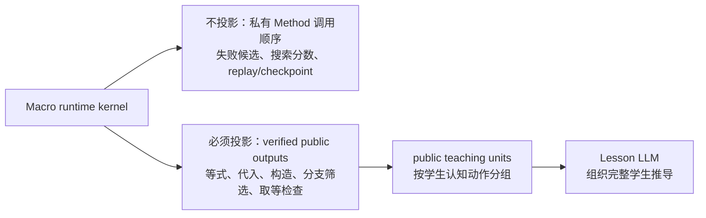
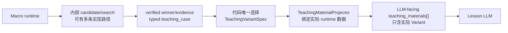
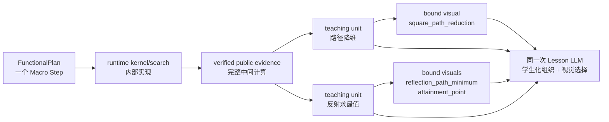
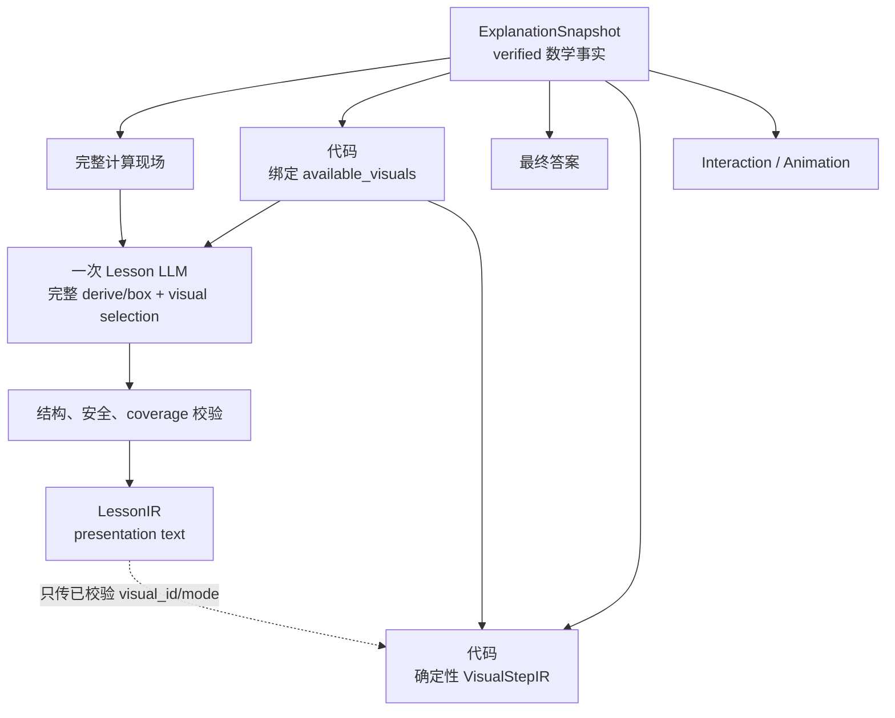
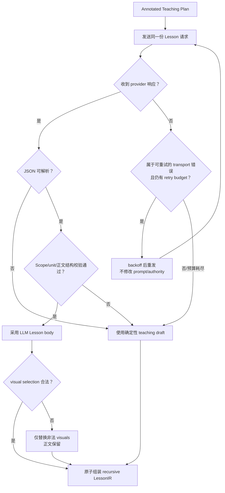
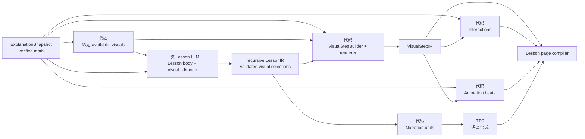
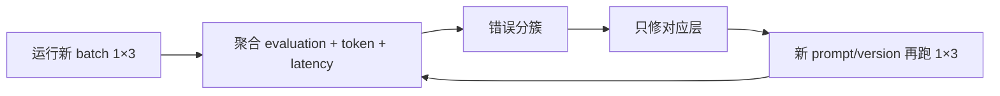

# F5-F5B/G1 Lesson Scope LLM Authoring 与视觉选择 vNext 设计

状态：`IMPLEMENTATION`。`F5-F5B0 COMPLETE`；`F5-F5B1 NEXT`。

日期：2026-09-01。

本文只设计：

```text
Verified FunctionalPlan execution
→ ExplanationSnapshot
→ 同一次 Lesson LLM 学生化编排 + 视觉组件选择
→ recursive LessonIR
→ 代码确定性生成 VisualStepIR
```

本文不改变 FunctionalPlan、Scope Retry 或 Method runtime 合同；也不允许 LLM 生成几何、
interaction formula 或 animation beat。本文同时定义 F5-F5B 学生步骤合同，以及最后一个实现
阶段中 Lesson LLM 如何从代码已绑定的视觉候选中选择组件，再由现有 VisualStepIR builder
确定性渲染。它是对以下文档中 F5-F5B 学生步骤部分的候选替代设计：

- [Teaching Scope、学生步骤、可视化与动画设计](teaching-scope-student-visual-animation-design.md)；
- [Explanation Builder 设计](explanation-builder-design.md)；
- [FunctionalPlan Scope Retry 设计](functional-scope-retry-design.md)。

F5-F5B0 的只读基线、rubric、coverage inventory 与 recorded/live harness 已实现；它们没有
改变生产协议。F5-F5B1 及之后的新 Snapshot、TeachingUnitSpec、LLM wire 与 recursive
LessonIR 仍是待实现设计，不能把 B0 的 legacy coverage 标签解释为新协议已经落地。

## 1. 结论

F5-F5B vNext 采用以下边界：

1. 输入是与 Canonical Plan 同构的递归 Scope/Goal/Step 树。
2. 每个 Step 都携带完整的 student-safe 输入、实际 runtime outputs、中间计算结果、
   verified evidence 和 checks。
3. Method 保留声明一个最小 `TeachingUnitSpec` 的能力：声明了就使用，未声明时由代码根据
   Method intent/capability 生成一个默认 unit。原子 Macro 隐藏多个认知动作时，声明有序的
   `TeachingUnitSpec[]`；若 Macro 存在多种学生推导真正不同的数学分支，则声明内部
   `TeachingVariantSpec[]`，由 verified evidence 唯一选择实际 Variant。内部候选搜索或等价
   实现路径不建立 Variant。稳定 variant/unit key 只属于代码内部 authority；代码先用
   verified runtime 数据绑定实际 Variant 的 unit 模板，再按 Canonical 顺序向 LLM 直接内联建议的
   `title/nav_title/goal/derive/box`、完整计算材料和可用视觉，不存在 guide/unit registry 或
   unit ID。
4. LLM 根据绑定完成的建议草稿和当前题真实输入、输出、中间计算结果，直接输出学生化
   `title/nav_title/goal/derive/box`，并自行决定同一 Scope/Goal 中 canonical-contiguous
   teaching materials 的合并；不回显 `fact_ids/uses`，也不使用 locked math spans。
5. LLM 在代码固定的 Scope/Goal 容器中填写完整 Lesson body；不输出 owner，不移动步骤。
6. 原子 Macro 在 FunctionalPlan 中始终是一个 Step；教学层只展开 verified public
   teaching units。该 Step 必须同时向 LLM 提供支撑所有 units 的 student-safe verified public
   outputs 和中间计算结果；这些事实只在 Step execution 中保存一次，不按 unit 复制或静态
   分配。只隐藏内部 Method chain、search candidate、replay trace 等执行实现。换言之，隐藏的
   是“代码怎么运行”，不是“数学上怎么算出来”。
7. F5-F5B v1 不设计 Lesson 语义 retry。代码只校验结构、owner、coverage 和安全边界，
   不证明 LLM 每一行推导的数学语义；结构校验失败则回退确定性教学草稿。网络超时、
   限流等 provider transport retry 不属于 Lesson 协议。
8. 最终 LessonIR 由代码按原 Scope/Goal topology 原子组装为递归树。
9. 普通 Method 的 MethodVisualSpec、Macro outline unit 的视觉声明提供可用语义组件；代码
   先用 verified evidence 绑定为当前题的安全视觉候选，同一个 Lesson LLM 只选择
   `visual_id` 和受限 `mode`，不能填写坐标、点线角色、样式或动画结构。
10. Visual selection 不增加第二次 LLM 调用，也不增加 semantic retry。选择非法时只对该
    Lesson Step 使用确定性视觉默认值，保留已经合法的讲解正文。
11. 视觉组件选择与渲染放在本计划最后一个实现阶段；前面的 Snapshot、输入投影、Lesson
    output、评测和 recursive LessonIR 必须先独立通过。

核心目标不是让代码替 LLM 写完课程，而是：

> 代码提供完整、真实、可追溯的数学计算材料；LLM 把这些材料组织成学生能读懂的步骤。

视觉层补充原则是：

> 代码提供已验证、已绑定、可渲染的视觉选项；LLM 选择当前教学阶段最合适的选项；代码
> 负责最终图形。

## 2. 当前实现事实

### 2.1 F5-F5A 已有事实边界

当前 `ExplanationSnapshot` 已经保存：

```text
root_scope
├── scope_ref
├── scope_steps[]
│   └── TeachingSource
├── goals{goal_ref}
│   ├── steps[]
│   └── answer_from
└── children[]

TeachingSource
├── source_step_id
├── capability_id
├── args
├── public_results
├── checks
├── evidence_refs
└── closure_refs
```

Scope/Goal owner 来自 Canonical Plan 容器，不从 runtime placement、标题、点名或依赖关系
猜测。当前 `explanation-snapshot/v2` 代码仍有独立 `cross_scope_references`，但它不是 vNext
输入的一部分；F5-F5B1 首先物理删除该字段、模型和 builder，并把精确依赖内联到 consumer
input ref。没有保留期或兼容解析器。

### 2.2 当前代码中的 Lesson retry

当前代码存在一个可选的 `LLMLessonPlanner`：

- 默认 `max_attempts=3`；
- 每轮把前一轮 draft、normalization、diagnostic 和 repair summary 再发给 LLM；
- 校验成功后生成旧 flat LessonIR；
- repair budget 用尽后抛出 `ExplanationRepairLoopError`；
- `ExplanationBuilder` 捕获异常并回退 deterministic skeleton。

它主要检查：

```text
JSON / steps Schema
candidate_group_id / source_step_id 是否存在
是否跨 Scope 合并
是否违反 cognitive merge boundary
是否遗漏 required candidate group
derive 是否是要求的二维格式
是否引用未知 handle、点、事实或结论
最终答案是否出现在相关 box
```

但是 `ExplanationBuilder()` 默认的 `lesson_planner=None`，当前仓库中显式注入
`LLMLessonPlanner` 的调用主要位于专项测试；默认路径是确定性 Lesson builder。因此：

> 当前代码拥有旧 repair 能力，但当前默认 Lesson 生成没有生产可达的 LLM retry。

### 2.3 为什么旧设计需要 repair

旧 LLM 输出是全局 flat `steps[]`。LLM 同时承担：

- 选择 candidate IDs；
- 重建 source step 分组；
- 避免跨 Scope；
- 避免把必须分开的 cognitive actions 合并；
- 回显数学文字和 box；
- 保证所有 source 都被覆盖。

这些自由度使结构错误很常见，所以需要 repair feedback。

vNext 把 Scope/Goal 容器、可用 teaching units、事实集合和数学结果先确定下来，LLM 不再
重建 ownership。因此没有必要把旧 repair loop 迁移到新协议。

## 3. 设计目标与非目标

### 3.1 目标

- 给 LLM 足够完整的当前题计算现场，而不是只给抽象模板或片段。
- 让 LLM 真正负责讲解组织，而不是只给代码生成的固定文案换几个词。
- 让 Scope/Goal owner 由 JSON 容器直接表达。
- 同时支持：
  - 普通 Function 的一个计算动作；
  - 相邻机械 Function 的合并；
  - 一个原子 Macro 的多个学生认知动作；
  - Scope-owned shared producer；
  - 跨 Goal/Scope 的公开结果引用。
- 所有公式、数值、对象、构造和取等条件可追溯至 runtime output 或 verified evidence。
- 一次 Lesson 语义生成失败不影响页面生成：连接超时、网络错误、provider 5xx 或限流先按
  通用 LLM client 的有限 transport retry 策略重试；重试耗尽后才使用确定性 fallback。
  已收到但 JSON/结构校验不通过的响应不做语义 repair，直接按 Scope 粒度 fallback。
- 同一次 Lesson LLM 调用可以根据自己刚生成的学生步骤，从当前 unit 的安全候选中选择最
  合适的视觉组件和展示模式。
- Method/Macro 只声明可用语义组件与默认推荐，不绑定题号、点名或底层页面样式。

### 3.2 非目标

- 不让 LLM 重新解题或验证数学正确性。
- 不把 Macro 内部 Method chain 重新变成 Planner/Lesson wire。
- 不让 LLM 生成 runtime handle、checkpoint、search candidate 或内部 synthetic object。
- 不让 LLM 修改 Scope/Goal topology、answer producer 或依赖图。
- 不让 Lesson LLM 发明视觉组件、填写几何 role binding、坐标布局、颜色偏移、interaction
  formula 或 animation timeline；它只能选择代码在本轮输入中明确暴露的 `visual_id` 和
  supported mode。
- 不在 v1 增加第二个 Visual LLM 调用或让 LLM 直接输出底层 `Point/ColoredLine/SVG`。
- 不在 F5-F5B v1 建立另一套复杂 retry/patch/merge 协议。

## 4. 权威与职责

### 4.1 代码负责

代码只负责不能交给 LLM 猜测的事实和边界：

- Scope/Goal topology；
- Step owner、canonical order 和 dependency edges；
- Step 的 resolved student-safe inputs；
- 全部实际物化的 public runtime outputs；
- verified evidence 中可教学的中间计算结果；
- Macro 当前 winner 的公开等价证明、构造、最值表达式和取等检查；
- calculation provenance 和应完整提供给 LLM 的实际 verified results；
- Method 声明或代码兜底生成的单个教学单元，以及原子 Macro 当前 verified 学生推导所选中的
  有序教学单元；
- runtime value 的 student-safe `value/display` 投影；
- 组件 registry、Method/Macro 可用视觉组件、verified role binding 和本轮
  `available_visuals`；
- 每个视觉组件的默认选择、supported modes、兼容性、数量上限与 deterministic fallback；
- 最终答案、Visual geometry、interaction 和 animation 的数学权威；
- 输出 Schema、校验、fallback 和 LessonIR 组装。

代码不应继续替每一道题完成：

- 当前题学生标题；
- 当前题讲解目标的完整措辞；
- 每一行之间的自然语言过渡；
- 哪些可选计算值得展开；
- 同一 Scope/Goal 中哪些 canonical-contiguous teaching materials 值得合并；
- 学生讲解应该强调哪一个已验证机制。
- 当前学生步骤在已绑定候选中最适合展示哪一个视觉组件，以及使用该组件已支持的哪一种
  展示模式。

### 4.2 LLM 负责

LLM 根据绑定完成的 suggested draft 与完整计算现场负责：

- 润色每个学生步骤的 title、nav_title 和 goal；
- 以 suggested derive 为可信底稿，结合 verified calculations 调整为完整的
  `∵ / ∴ / 作 / 设 / 计算` 推导；
- 参考 suggested box 输出学生可读的关键结论；
- 为关键跳步补充少量学生能理解的解释；
- 选择必讲事实之外的可选细节；
- 在同一 Scope/Goal 中自行判断 canonical-contiguous teaching materials 的讲解粒度与合并；
- 决定一个 Macro 的 public outline units 是保持分开，还是合并成一个较长步骤；
- 删除重复但不影响证明闭合的表述；
- 形成学生友好的导航标题。
- 从当前步骤覆盖的 teaching units 的 `available_visuals` 中选择零个或少量视觉选项；
- 在组件声明的 `supported_modes` 中选择 `static`、`highlight` 或
  `progressive_reveal` 等展示方式。

LLM 不负责产生新的数学量。TeachingUnitSpec 保存通用讲解模板，但不保存当前题答案；代码
必须先用 verified runtime 数据把模板绑定成含具体公式、对象和结论的 suggested draft，再交给
LLM。LLM 也不负责把视觉组件绑定到本题对象；它选择的是已经绑定成功的 `visual_id`，不是
组件参数。

### 4.3 运行时 role 与讲解 role

需要区分两种“角色绑定”：

```text
runtime role resolution
    决定哪个真实对象是 moving_point、fixed_endpoint、square 等
    属于 Solver 正确性，必须由代码验证

lesson wording role mapping
    决定学生文本中如何称呼这些已验证对象、先讲哪个关系
    可以由 LLM 根据完整 evidence 完成
```

例如 `quadratic_square_path_minimum` 的 runtime 已经验证：

```text
moving_point = G
fixed_endpoint = M
reflect_source = A
moving_locus = y=-c/2-1/2
```

这些必须由 runtime evidence 给出。Explanation 层不需要再写一个专用 binder 来重新发现
这些对象；LLM 只负责把已给出的 `G、M、A、轨迹` 组织成学生语言。

## 5. 输入合同：Annotated Teaching Plan

建议新增：

```text
functional-annotated-teaching-plan/v1
```

它只用于 Lesson LLM prompt，不进入 Canonical Plan hash。

### 5.1 树结构

```text
AnnotatedTeachingPlan
├── schema_version
├── problem
├── answers
├── root_scope
│   ├── scope_ref
│   ├── steps[]
│   │   └── AnnotatedTeachingStep
│   ├── goals{goal_ref}
│   │   ├── required_answer
│   │   ├── steps[]
│   │   └── answer_from
│   └── children[]
```

所有集合显式存在，允许为空。

教学层不再区分 `scope_steps` 和 `lesson_steps` 两种字段。Scope 与 Goal 容器都使用
`steps[]`；在同一 artifact 内，两处数组的元素类型完全相同，只有 owner 不同。所在容器
已经唯一表达 owner：

```text
Canonical Scope.scope_steps  -> Teaching Scope.steps
Canonical Goal.steps         -> Teaching Goal.steps
```

这只是教学投影时的字段名归一，不要求 FunctionalPlan 修改已有的 `scope_steps`
公开合同。

不再保存单独的 `cross_scope_references[]`。Scope 树确定 owner/visibility，每个 consumer
`inputs.*.ref` 精确指出它读取的 SourceRef 或 producer Step public return；依赖边由代码从
这两者确定性派生。该字段从 Snapshot、Annotated Teaching Plan 和 LessonIR 合同直接删除，
不提供旧字段兼容读取、双写或 debug sidecar。

同样不保存 `teaching_guides{}`。普通 Method 可以声明一个最小 `TeachingUnitSpec`，未声明
时由代码生成默认值；单一学生推导的原子 Macro 可以声明有序的 `TeachingUnitSpec[]`，多种
学生可见推导的 Macro 则声明 `TeachingVariantSpec[]`，每个 Variant 内含自己的有序 units。
代码解析声明、生成内部 stable key/owner/provenance sidecar 后，只把实际 Variant 的教学信息
按顺序直接投影到当前 Step。LLM 不通过注册表查找教学提示，也不看到或回显任何 unit/variant
ID。

多数学分支 Macro 在投影前必须已由 verified `teaching_case` 唯一选择
`TeachingVariantSpec`；`teaching_materials[]` 只包含实际 Variant 的 units。未选择 Variant、
其他候选及 Variant key 不属于 LLM 输入合同。

### 5.2 Step 结构

```text
AnnotatedTeachingStep
├── step_id
├── capability_id
├── intent?
├── inputs{}
│   └── ref + runtime_type + display/value
├── execution
│   ├── outputs{}
│   ├── calculations[]
│   ├── checks[]
│   └── evidence_refs[]
└── teaching_materials[]
    ├── suggested_title
    ├── suggested_nav_title
    ├── suggested_goal
    ├── suggested_derive[]
    ├── suggested_box[]
    └── available_visuals[]
```

这些建议字段在 LLM 输入中始终存在：显式 TeachingUnitSpec 先用当前 Step 的 verified
student-safe runtime values 完成模板绑定；未声明字段由代码根据 Method intent/capability、
有序 calculations 和 materialized public outputs 确定性兜底。每个 verified Step 至少投影
一个 teaching material；LLM 无需判断“字段缺失还是没有教学草稿”。

`suggested_derive` 是已经套入本题 runtime 数据的学生数学语言，使用结构化
`[作|设|∵|∴|计算, text]`，不是“代入、求解、写出结果”这类空泛动作清单。删除
`important_calculation_ids`、unit calculation/check mapping、`merge_policy` 与 `must_separate`。
每个 Step 的完整 calculations/checks 只出现一次；建议草稿引用其公开数学内容，但不取代
verified facts。LLM 自行判断详略以及如何组织最终学生步骤。`teaching_materials[]` 的数组位置
就是 Canonical 顺序；稳定 key、source Step、owner、evidence 和 bound visual ownership 只
保存在代码内部 sidecar。代码只校验材料覆盖、owner、canonical order 与 contiguous grouping，
不判断教学上应不应该合并。

输入必须同时提供引用和当前值。只给：

```json
{"step_id": "derive_parabola", "return": "parabola"}
```

不足以让 Lesson LLM 讲解。应该投影为类似：

```json
{
  "ref": {
    "kind": "step_result",
    "step_id": "derive_parabola",
    "return": "parabola"
  },
  "runtime_type": "Parabola",
  "value": "-x**2 + (1-c)*x + c",
  "display": "y＝－x²＋(1－c)x＋c"
}
```

`value` 用于精确审计，`display` 用于学生文本。Prompt 中不得要求 LLM 自己把 SymPy 字符串
翻译成数学排版。

### 5.3 已绑定视觉候选

普通 Method 的 visual spec 和 Macro outline unit 可以声明“哪些语义组件可以表达这个数学
动作”。它们不声明当前题点名，也不写底层页面元素。组件 registry 声明 required roles、
supported modes 和确定性 renderer；代码用 Snapshot/evidence 完成 role binding 后，才把
成功绑定的候选内联到当前 teaching material 并投影给 LLM：

```text
Method/Macro visual options
    + verified evidence
    + geometry inventory
    → bound visual candidates
    → student-safe available_visuals
```

LLM-facing 形态保持紧凑：

```json
{
  "visual_id": "derive_path_minimum_ii:square_reduction",
  "component_id": "square_path_reduction",
  "description": "展示正方形、中点和中心关系如何把原路径化为 AG＋MG。",
  "shows": [
    "正方形 AEKG",
    "HF＋FM＋MG＝AG＋MG"
  ],
  "supported_modes": [
    "static",
    "progressive_reveal"
  ],
  "recommended": true
}
```

内部 authority envelope 另外保存 renderer 所需的绑定：

```json
{
  "visual_id": "derive_path_minimum_ii:square_reduction",
  "component_id": "square_path_reduction",
  "role_bindings": {
    "square": ["A", "E", "K", "G"],
    "midpoint": "F",
    "center": "H",
    "original_segments": ["HF", "FM", "MG"],
    "replacement_segments": ["AG", "MG"]
  },
  "source_evidence_refs": [
    "evidence:derive_path_minimum_ii:path-minimum"
  ]
}
```

第二份 envelope 不进入 LLM response，也不允许 LLM 回显或修改。其规则是：

- 只暴露本教学 unit 实际可用且 role binding 唯一成功的候选；
- 零候选时不伪造组件，记录 typed VisualGap/default diagnostic；
- 同一 `visual_id` 在一次请求内唯一并绑定当前 Snapshot hash；
- `description/shows` 是组件的学生效果说明，不是底层 renderer API；
- 不向 LLM 暴露 `from/to/at/dx/dy/color`、geometry internal ID 或 timeline beat；
- 每个 unit 通常只暴露 `1–4` 个候选，不发送全局组件目录。

这意味着 LLM 可以选择“展示路径等价替换”，但不能把其中的 `G` 换成 `E`，也不能自造
一条页面直线。

## 6. “完整中间计算结果”的定义

LLM 需要看到的不只是最终 Step output。

这里必须区分“内部执行过程”和“公开数学推导”：



因此，Macro 虽然在 Plan 中只有一个 Step，LLM 仍会收到这个 Step 求解过程中所有对学生
有意义、经过 runtime 验证且允许公开的中间数学结果。代码只是不把这些结果背后的私有实现
拓扑暴露成可编辑的 Lesson/Plan 结构。

### 6.1 必须投影

对每个成功 Step，输入必须包含：

1. 所有实际物化的 public runtime outputs；
2. 输出的 student-safe display；
3. 产生结论所需的 verified intermediate calculations；
4. 当前题实际使用的构造、等式、代入、候选过滤、分支选择和取等条件；
5. 与最终 answer/后续 Step 直接相关的结果；
6. Macro public evidence 中的等价证明和 attainment checks；
7. symbolic closure 中真正使用的方程、已知代入、解和被排除分支。

### 6.2 不投影

“完整”不等于把 runtime debug 全部交给 LLM。以下内容禁止进入 prompt：

- StateVersion、CallResult、checkpoint 和 transaction；
- Macro shadow branch、失败 candidate 和 search score；
- 内部 MethodInvocation chain；
- synthetic PointRef/path；
- cache key、hash 实现细节和 replay trace；
- 未被 winner 使用的 provisional output；
- 只用于代码证明器的低层 SymPy 调用过程。

多数学分支 Macro 的 verified evidence sidecar 可以额外保存 typed `teaching_case`，仅供
TeachingVariantSpec 选择。它不是学生数学事实，不进入 calculation、Annotated Teaching Plan
或 prompt；选择完成后只保留实际 Variant 绑定生成的学生材料。

### 6.3 统一 calculation 形态

所有 Method/Macro evidence projector 最终都转换为统一 student-safe calculation：

```json
{
  "fact_id": "derive_path_minimum_ii.path_equivalence",
  "kind": "equivalence",
  "premise_fact_ids": [
    "derive_path_minimum_ii.fm_half_ae",
    "derive_path_minimum_ii.hf_half_ag",
    "derive_path_minimum_ii.ae_equals_ag"
  ],
  "display": "HF＋FM＋MG＝AG＋MG",
  "value": "HF+FM+MG=AG+MG",
  "required": true,
  "evidence_ref": "evidence:derive_path_minimum_ii:path-minimum"
}
```

`fact_id` 是 Lesson wire 的稳定引用；它不是 runtime handle，也不要求 LLM 回显 provenance。

## 7. TeachingUnitSpec、默认兜底与 few-shot

### 7.1 当前代码事实

当前仓库没有 `TeachingGuide` 类型、独立 JSON 文件或全局注册表。接近该概念的旧数据实际
分散在：

- 普通 Method：类型定义是
  [`MethodExplanationSpec`](../server/shuxueshuo_server/solver/contracts.py)，实例通常直接写在
  `runtime/methods/*.py` 的 `SPEC.explanation` 中，例如
  [`quadratic_from_constraints.py`](../server/shuxueshuo_server/solver/runtime/methods/quadratic_from_constraints.py)；
- Macro/Recipe：类型定义是
  [`RecipeExplanationSpec`](../server/shuxueshuo_server/solver/runtime/recipes/_spec.py)，实例直接
  写在 `runtime/recipes/*.py` 的 `RecipeSpecSource.explanation` 中，例如
  [`quadratic_square_path_minimum.py`](../server/shuxueshuo_server/solver/runtime/recipes/quadratic_square_path_minimum.py)；
- Macro 拆步提示：`recommended_lesson_splits`、`TeachingSubstepSpec` 与 recipe visual 的
  `teaching_substep_templates`，同样分散在 recipe、contract 和 visual spec 中。

这些字段服务当前 deterministic/flat Lesson builder，不是已存在的 vNext TeachingGuide。
当前和平 Macro 甚至同时在
[`runtime/methods/quadratic_square_path_minimum.py`](../server/shuxueshuo_server/solver/runtime/methods/quadratic_square_path_minimum.py)
和上述 recipe 文件中声明 `MethodExplanationSpec` 与 `RecipeExplanationSpec`，两边都保存
标题、目标或推导模板，正说明旧结构存在重复。

当前生产链确实把这些模板交给 Lesson LLM：`teaching_expansion.py` 一方面投影原始
method/recipe explanation metadata，另一方面先绑定本题 role 生成
`teaching_expansion_draft.student_title/student_nav_title/proof_draft/box`；当前 prompt 要求 LLM
优先使用该可信草稿。vNext 的目标不是删除这类教学先验，而是合并重复 spec、只发送绑定后的
student-safe suggested draft，不再发送原始 role schema、binder ID 或占位符模板。

### 7.2 vNext：Method 保留一个可选 TeachingUnitSpec

普通 Method 通常已经是一个细粒度计算动作，但仍保留声明教学意图的能力：

```text
TeachingUnitSpec（代码侧）
├── unit_key                    # required，仅内部稳定 key
├── title_template?             # 建议步骤标题
├── nav_title_template?         # 建议短导航标题
├── goal_template?              # 建议教学目标
├── derive_templates[]          # 建议 ∵/∴/作/设/计算 数学推导
└── box_templates[]             # 建议框出的结论
```

除 `unit_key` 外均允许省略；投影器必须用 verified 数据补齐为 LLM-facing 五类 suggested 字段。
模板变量只允许引用该 Step 的 student-safe verified binding namespace。

```python
teaching_unit=TeachingUnitSpec(
    unit_key="derive_model",
    title_template="代入已知点求函数解析式",
    nav_title_template="求函数解析式",
    goal_template="把已知点坐标代入二次函数，求出待定系数。",
    derive_templates=(
        ("∵", "{constraint_points_display}在{curve_template_display}上"),
        ("∴", "分别代入得{equation_system_display}"),
        ("∴", "解得{coefficient_solution_display}"),
        ("∴", "{result_curve_display}"),
    ),
    box_templates=("{result_curve_display}",),
)
```

如果声明存在，代码使用该声明；如果未声明，代码确定性兜底生成：

```text
suggested_title/nav_title/goal
    ← Method intent/capability title

suggested_derive
    ← student-safe calculations 的 dependency order

suggested_box
    ← materialized public outputs / answer producer
```

模板占位符只能读取 typed evidence projector 暴露的 student-safe verified bindings。代码在
投影前先完成绑定；`unit_key`、原始占位符、role schema 和 binder identity 都不进入 prompt。
例如本题 runtime 已经求得具体点、方程与系数后，LLM 直接收到：

```json
{
  "teaching_materials": [
    {
      "suggested_title": "代入已知点求函数解析式",
      "suggested_nav_title": "求函数解析式",
      "suggested_goal": "把 A、D 的坐标代入二次函数，求出待定系数。",
      "suggested_derive": [
        ["∵", "A(-1,0)、D(2,-3)在 y=ax²+bx-3 上"],
        ["∴", "分别代入得 a-b=3，2a+b=0"],
        ["∴", "解得 a=1，b=-2"],
        ["∴", "抛物线解析式为 y=x²-2x-3"]
      ],
      "suggested_box": ["y=x²-2x-3"],
      "available_visuals": []
    }
  ]
}
```

因此 suggested derive 已经是“因为哪些具体条件，所以推出哪些具体等式和结论”的数学语言，
不是让 LLM 根据“代入、解方程、写答案”等动作词重新补数学内容。LLM 读取 Step 的完整
`inputs + outputs + calculations + checks` 审核上下文，并把 suggested
`title/nav_title/goal/derive/box` 作为可信参考进行润色、详略调整与相邻材料合并。

vNext 不继续读取旧 `MethodExplanationSpec` 对象，但不会丢弃其中有价值的标题、导航标题、
目标、推导和结论模板；这些字段迁入可选 `TeachingUnitSpec`。旧 role schema/binder 中若有
内容承担 student-safe fact projection，则迁入 typed evidence projector；视觉信息继续留在
独立 MethodVisualSpec。

### 7.3 单一学生推导的原子 Macro 声明有序 TeachingUnitSpec 数组

原子 Macro 在 FunctionalPlan 中只有一个 Step，却可能隐藏多个学生必须理解的认知动作，
因此在公开 Macro/Recipe spec 上声明有序的最小 units：

```python
teaching_units=(
    TeachingUnitSpec(
        unit_key="path_reduction",
        title_template="利用正方形关系化简路径",
        nav_title_template="路径降维",
        goal_template="证明原三段路径等价于一条单动点折线路径。",
        derive_templates=(
            ("∵", "{midpoint_relation_display}"),
            ("∵", "{center_relation_display}"),
            ("∴", "{path_equivalence_display}"),
        ),
        box_templates=("{reduced_objective_display}",),
    ),
    TeachingUnitSpec(
        unit_key="reflection_minimum",
        title_template="利用反射求路径最小值",
        nav_title_template="反射求最值",
        goal_template="确定动点轨迹，利用反射拉直路径并说明取等位置。",
        derive_templates=(
            ("∵", "{moving_locus_display}"),
            ("作", "{reflection_construction_display}"),
            ("∴", "{straightened_path_display}"),
            ("∴", "{minimum_and_attainment_display}"),
        ),
        box_templates=("{minimum_expression_display}",),
    ),
)
```

如果 Macro 只有一种学生可见推导且未声明，代码同样兜底生成一个 `default` unit；存在多种
学生可见推导时使用下一节的 Variant 合同。声明只回答“这个原子 Macro 中有哪些公开认知
动作，以及代码建议学生如何讲清这些动作”。它仍不指定：

- 哪个 calculation 最重要；
- calculation/check 应属于哪一个最终 Lesson Step；
- units 必须分开还是允许合并；
- 当前题点名、表达式、答案或取等值。

LLM 不需要知道 `path_reduction`、`reflection_minimum` 或拼接后的 unit ID。投影时保持声明
顺序，模板套入本题 verified runtime 数据后，直接提供建议草稿：

```json
{
  "teaching_materials": [
    {
      "suggested_title": "利用正方形关系化简路径",
      "suggested_nav_title": "路径降维",
      "suggested_goal": "证明 HF＋FM＋MG 等价于 AG＋MG。",
      "suggested_derive": [
        ["∵", "F 是 AE 的中点，所以 FM＝AE/2"],
        ["∵", "H 是正方形中心，所以 HF＝AG/2"],
        ["∵", "AE＝AG"],
        ["∴", "HF＋FM＝AG"],
        ["∴", "HF＋FM＋MG＝AG＋MG"]
      ],
      "suggested_box": ["HF＋FM＋MG＝AG＋MG"],
      "available_visuals": []
    },
    {
      "suggested_title": "利用反射求路径最小值",
      "suggested_nav_title": "反射求最值",
      "suggested_goal": "确定 G 的轨迹，利用反射拉直 AG＋MG 并求取等点。",
      "suggested_derive": [
        ["∵", "G 在直线 y=-c/2-1/2 上运动"],
        ["作", "作 A 关于该直线的对称点 A′"],
        ["∴", "AG＋MG＝A′G＋MG≥A′M"],
        ["∴", "A′、G、M 共线时取得最小值"],
        ["∴", "最小值为 sqrt(5)|c+1|/2，并得到对应点 G"]
      ],
      "suggested_box": ["最小值为 sqrt(5)|c+1|/2"],
      "available_visuals": []
    }
  ]
}
```

完整 calculations/checks 仍只在 Step execution 中出现一次。LLM 自行选择详略、把数学材料
分配到学生步骤，并决定两个 teaching materials 是分开还是合并；但建议草稿中的公式、对象
和结论必须已经由 runtime/evidence 验证。内部 unit key 仅供代码在组装 LessonIR 时注入
source/evidence provenance。

### 7.4 Macro 多数学分支：TeachingVariantSpec

“Macro 有多条路径”必须先区分两种含义：

| 路径类型 | 是否声明独立 Teaching Variant |
|---|---|
| kernel 调用不同 helper、枚举不同候选、使用不同 SymPy 证明过程 | 否 |
| 输入数值不同，但学生推导结构相同 | 否；共用 Spec，runtime binding 填入实际数据 |
| 最终数学策略、分情况依据或取等逻辑不同 | 是 |
| 最终结果本身是 Piecewise，学生必须同时理解多个分支 | 是；声明一个包含全部必要分支的组合 Variant |

因此 Spec 粒度不是“每条内部执行路径”，而是“每种学生可见的 verified public derivation”。
单一学生推导的 Macro 直接声明 `teaching_units`；多种学生推导的 Macro 改为声明：

```text
MacroTeachingSpec
├── teaching_units[]?                # 单一 public derivation
└── teaching_variants[]?             # 多个 public derivation，二者恰有一个存在
    └── TeachingVariantSpec
        ├── variant_key              # internal only
        ├── evidence_case            # 必须匹配 typed verified evidence case
        └── units[]                  # 有序 TeachingUnitSpec
```

示例：加权路径 Macro 可能有内点取等、边界取最小值和 Piecewise 三种学生推导：

```python
teaching_variants=(
    TeachingVariantSpec(
        variant_key="interior_attainment",
        evidence_case="interior_attainment",
        units=(
            TeachingUnitSpec(unit_key="weight_reduction", ...),
            TeachingUnitSpec(unit_key="interior_minimum", ...),
            TeachingUnitSpec(unit_key="attainment", ...),
        ),
    ),
    TeachingVariantSpec(
        variant_key="boundary_minimum",
        evidence_case="boundary_minimum",
        units=(
            TeachingUnitSpec(unit_key="weight_reduction", ...),
            TeachingUnitSpec(unit_key="domain_boundary", ...),
            TeachingUnitSpec(unit_key="endpoint_comparison", ...),
        ),
    ),
    TeachingVariantSpec(
        variant_key="piecewise_minimum",
        evidence_case="piecewise_minimum",
        units=(
            TeachingUnitSpec(unit_key="weight_reduction", ...),
            TeachingUnitSpec(unit_key="case_split", ...),
            TeachingUnitSpec(unit_key="branch_summary", ...),
        ),
    ),
)
```

选择权属于 runtime authority，不属于 LLM：



选择规则：

1. Macro runtime/evidence projector 必须产生 typed `teaching_case`；它属于 verified execution
   sidecar，不新增 Planner argument、Macro public return 或 LLM 字段。
2. `TeachingMaterialProjector` 只能按 typed case 精确匹配 Variant；禁止从 method trace、候选
   分数、字符串表达式、标题或最终数值启发式猜测。
3. 恰好一个 Variant 必须匹配。零匹配或多匹配产生
   `teaching_variant_selection_invalid` configuration diagnostic，并对该 Macro 使用由实际 verified
   calculations 生成的完整 generic draft；不得选择一个“看起来最像”的 Variant。
4. 非 winner Variant、失败候选和内部搜索过程不进入 Annotated Teaching Plan、prompt、
   LessonIR 或 VisualStepIR。
5. LLM 不看到 `teaching_case`、`variant_key` 或未选择 Variant 的存在；它仍只看到实际
   Variant 绑定后的 ordered `teaching_materials[]`。
6. Piecewise 若是本题真实 public result，选择一个 composite Variant，并把所有必须讲解的
   分支声明为其 units；不能把各分支当作互斥候选后只发送其中一个。

同一个 Macro 内部即使试过十个候选，只要它们最终共享同一种学生证明，就只维护一套
TeachingUnitSpec。只有学生推导结构发生变化时，才增加 TeachingVariantSpec；如果每条公开
路径确实对应不同的学生推导，那么每条路径各声明一个 Variant，而不是为每个内部 helper 或
candidate 各写一份 Spec。每个 Variant 自己可以包含一个或多个 TeachingUnitSpec。

### 7.5 与 few-shot/projector 的区别

```text
TeachingUnitSpec（Method 可选一个；单一推导 Macro 或已选 Variant 使用有序数组）
    保存建议的 title/nav_title/goal/derive/box 模板
    未声明时由代码生成一个 default unit
    unit_key 仅供内部 authority，不投影给 LLM
    不规定 importance、calculation mapping 或 merge policy

TeachingEvidenceProjector
    投影真实 verified outputs/calculations/checks
    提供模板所需的 student-safe runtime bindings
    是当前题数学事实来源

TeachingMaterialProjector
    用 verified bindings 填充 TeachingUnitSpec
    只把绑定后的 suggested title/nav_title/goal/derive/box 给 LLM

few-shot
    展示完整输入如何被组织成学生 Lesson body
    只约束通用风格、粒度和 JSON 形态
```

必要数学事实不能依赖 outline 或 few-shot 生成。旧 role binder 如果只是把 verified output
重新拼成固定文案则删除；如果承担 student-safe evidence 投影，则迁为 typed evidence
projector。

## 8. 原子 Macro 示例：和平二模正方形路径最值

FunctionalPlan 中仍只有一个 Step：

```json
{
  "step_id": "derive_path_minimum_ii",
  "capability_id": "quadratic_square_path_minimum",
  "args": {
    "parabola": {
      "step_id": "derive_parametric_parabola_ii",
      "return": "parabola"
    },
    "path_minimum_target": "HF+FM+MG",
    "square": "正方形 AEKG"
  }
}
```

本题实际 runtime outputs：

```text
minimum_expression = sqrt(5)*Abs(c + 1)/2
attainment_point = G(1/4 - 3*c/4, -c/2 - 1/2)
```

本题 verified public calculations 至少包含：

```text
FM=AE/2
HF=AG/2
AE=AG
HF+FM=AG
HF+FM+MG=AG+MG
G 的轨迹为 y=-c/2-1/2
A 关于该轨迹直线的对称点为 A′(-c,-c-1)
AG=A′G
AG+MG=A′G+MG
当 A′、G、M 共线时路径最短
最小值为 sqrt(5)*Abs(c+1)/2
取等时 G=(1/4-3*c/4,-c/2-1/2)
```

Macro spec 把它声明为两个有序的 public teaching units；内部 key 只供代码关联 provenance：

```text
derive_path_minimum_ii/path_reduction
    正方形、中点和中心关系完成路径等价替换

derive_path_minimum_ii/reflection_minimum
    动点轨迹、反射拉直、最小表达式和取等点
```

这不是展开内部 kernel：



本题代码投影给 LLM 的是按顺序内联的教学信息和视觉候选，不包含上述内部 key：

```json
[
  {
    "suggested_title": "利用正方形关系化简路径",
    "suggested_nav_title": "路径降维",
    "suggested_goal": "证明 HF＋FM＋MG 等价于 AG＋MG。",
    "suggested_derive": [
      ["∵", "F 是 AE 的中点，所以 FM＝AE/2"],
      ["∵", "H 是正方形中心，所以 HF＝AG/2"],
      ["∵", "AE＝AG"],
      ["∴", "HF＋FM＝AG"],
      ["∴", "HF＋FM＋MG＝AG＋MG"]
    ],
    "suggested_box": ["HF＋FM＋MG＝AG＋MG"],
    "available_visuals": [
      {
        "visual_id": "derive_path_minimum_ii:square_reduction",
        "component_id": "square_path_reduction",
        "description": "展示正方形、中点、中心和路径等价替换。",
        "supported_modes": ["static", "progressive_reveal"]
      }
    ]
  },
  {
    "suggested_title": "利用反射求路径最小值",
    "suggested_nav_title": "反射求最值",
    "suggested_goal": "确定 G 的轨迹，利用反射拉直 AG＋MG 并求取等点。",
    "suggested_derive": [
      ["∵", "G 在直线 y=-c/2-1/2 上运动"],
      ["作", "作 A 关于该直线的对称点 A′"],
      ["∴", "AG＋MG＝A′G＋MG≥A′M"],
      ["∴", "A′、G、M 共线时取得最小值"],
      ["∴", "最小值为 sqrt(5)|c+1|/2，并得到对应点 G"]
    ],
    "suggested_box": ["最小值为 sqrt(5)|c+1|/2"],
    "available_visuals": [
      {
        "visual_id": "derive_path_minimum_ii:reflection",
        "component_id": "reflection_path_minimum",
        "description": "展示 A′、A′G 与拉直后的最短线段 A′M。",
        "supported_modes": ["static", "progressive_reveal"]
      },
      {
        "visual_id": "derive_path_minimum_ii:attainment",
        "component_id": "attainment_point",
        "description": "突出显示路径取得最小值时的点 G。",
        "supported_modes": ["highlight"]
      }
    ]
  }
]
```

这里的点名只来自本次 smoke 输入的 student-safe candidate description；通用组件、prompt 和
few-shot 不写死和平二模的点名或答案。

LLM 可以：

- 把两个 teaching units 写成两个学生步骤；
- 自行合并为一个较长步骤；
- 决定哪些等式逐行展示；
- 解释“为什么想到反射”；
- 把 runtime 已验证的表达式写成学生语言。
- 为每个最终学生步骤从其覆盖 units 的候选中选择最合适的组件；
- 选择组件已经声明支持的静态、高亮或逐步揭示模式。

LLM 不能：

- 自己选择另一个反射点；
- 删除 `G` 的合法轨迹；
- 把参数化 `G` 说成已经求出的最终定值点；
- 在没有 verified `c>1` domain fact 时自行删除 `Abs(c+1)`；
- 提前写出后续 Step 才得到的最终点 `E`。
- 输出 `A/E/G/M/A′` 等 role binding、坐标、颜色、偏移或任意底层 scene item；
- 选择未出现在当前 unit `available_visuals` 中的组件。

## 9. 输出合同：Scope Lesson Body

建议新增：

```text
lesson-scope-content/v1
```

### 9.1 顶层结构

```json
{
  "schema_version": "lesson-scope-content/v1",
  "scope_bodies": {
    "ii": {
      "steps": [],
      "goals": {
        "ii.E": {
          "steps": []
        }
      }
    }
  }
}
```

规则：

- `scope_bodies` keys 由代码动态 Schema 精确给定；
- 每个 body 包含该 Scope 的 `steps` 和全部直属 Goals；
- Scope body 与 Goal body 中的 `steps` 都是同一个 `LessonStepDraft[]` 类型；
- `scope_bodies[scope_ref].steps` 的 owner 是该 Scope，
  `scope_bodies[scope_ref].goals[goal_ref].steps` 的 owner 是该 Goal；
- child Scope 不嵌套在 parent body 中；
- LLM 不填写 `scope_ref`、`owner_scope_ref` 或 `owner_goal_ref`；
- 首次生成时 keys 是全部需要教学内容的 Scope；
- 最终递归 topology 由代码从 Snapshot 复制。

### 9.2 LessonStepDraft

为了同时支持 Method 合并和 Macro 拆分，代码先把当前 Scope/Goal 内的 teaching materials
按 Canonical 顺序展平。LLM 不看到 unit ID，也不回显 provenance；每个 LessonStepDraft 只用
一个整数说明它连续消费接下来的几个材料：

每个被消费材料都已经包含绑定完成的 suggested `title/nav_title/goal/derive/box`。LLM 必须
参考这些建议，但仍完整输出最终五个字段；合并多个材料时，负责把多份建议整合为一份连贯
的学生步骤，而不是简单拼接标题或重复结论。

```json
{
  "material_count": 1,
  "title": "把三段路径化为单动点路径",
  "nav_title": "正方形路径降维",
  "goal": "利用中点和正方形关系证明原路径与 AG＋MG 等价。",
  "derive": [
    ["∵", "F 是 AE 的中点，所以 FM＝AE/2"],
    ["∵", "H 是正方形中心，所以 HF＝AG/2"],
    ["∵", "AE＝AG"],
    ["∴", "HF＋FM＝AG"],
    ["∴", "HF＋FM＋MG＝AG＋MG"]
  ],
  "box": [
    "HF＋FM＋MG＝AG＋MG"
  ],
  "visuals": [
    {
      "visual_id": "derive_path_minimum_ii:square_reduction",
      "mode": "progressive_reveal"
    }
  ]
}
```

`material_count` 必须大于零。代码从 Canonical 序列头部依次消费；该 Scope/Goal 内所有
LessonStepDraft 的 count 总和必须精确等于输入材料数。因此顺序、连续性和完整覆盖都无需
LLM 操作 opaque ID：`1` 表示单独讲当前材料，`2` 表示把当前材料与紧随其后的一个材料合并。
LLM 直接输出完整 `title/nav_title/goal/derive/box`，不返回 calculation/fact/unit ID。
`visuals` 集合始终显式存在；没有适合图形的代数步骤允许返回空集合。一个材料需要更详细
时，在同一个 LessonStepDraft 的 `derive` 中展开更多行；若某个原子 Macro 当前实际推导必须
形成多个学生阶段，应由已选中 Variant 的 `TeachingUnitSpec[]` 预先提供相应材料边界。

### 9.3 VisualSelection

每个 LessonStepDraft 的可选视觉集合是其 `material_count` 连续消费材料的
`available_visuals` 并集。LLM 只能返回：

```text
visual_id
mode
```

规则：

- `visual_id` 必须来自当前 Lesson Step 的动态枚举；
- `mode` 必须来自该候选的 `supported_modes`；
- LLM 不返回 `component_id`、role bindings、几何参数、style 或 timeline；
- 一个步骤默认最多选择一个 primary 和一个 supporting visual；
- 合并两个 teaching materials 时允许选择两边的候选，代码按 Canonical order 渲染；
- unit 声明 `visual_required=true` 而 LLM 未选择时，代码使用该 unit 的 recommended default；
- 选择未知、重复、不兼容或超量候选时，不拒绝合法讲解正文，只把该步骤的视觉选择替换为
  deterministic default；
- Visual selection 不参与数学 authority，也不能改变 Lesson Step coverage。

### 9.4 数学文本边界

v1 决定让 LLM 直接输出推导过程。原因是 LLM 已经收到完整的 resolved inputs、runtime
outputs 和 verified intermediate calculations，它执行的是受材料约束的教学改写，不是从
题面重新求解。

接受这个设计的同时，也明确接受以下限制：

> 代码不能证明 LLM 每一行自由数学文本都与 verified calculations 语义等价。

因此：

- `derive` 和 `box` 是 presentation text，不是新的数学事实源；
- LessonIR 保存由代码注入的 `source_step_ids/capability_ids/teaching_substep_ids/evidence_refs`，
  以及经过校验的 visual selections；
- 最终答案继续来自 Snapshot `answer_from`；
- Visual renderer 继续从内部 bound candidate 与 Snapshot/evidence 读取坐标、公式、轨迹和
  对象 identity；只从 LessonIR 读取“选择了哪个 visual_id/mode”；
- interaction 和 animation 继续读取 Snapshot/evidence 与 registered component contract，
  不从 `derive` 解析数学状态；
- Voiceover 可以朗读 LessonIR，但不能把旁白文本回写为数学 Context。

### 9.5 下游权威隔离



即使自由推导文本存在细微错误，也不能污染 Solver、最终答案、几何、交互或动画；它只会
成为可通过模型、prompt、teaching-unit projection 和发布抽样改进的教学文案质量问题。

## 10. 确定性校验

新校验器只验证明确的结构和 authority，不重新做 Solver：

### 10.1 Schema 与容器

- 顶层对象和 `schema_version` 正确；
- Scope keys 精确，无缺失和新增；
- 每个 Scope 的直属 Goal keys 精确；
- Scope 与 Goal body 的 `steps`、`goals` 等集合显式存在；
- LLM-facing Schema 不存在 `scope_steps` 或 `lesson_steps`；
- 不允许 execution、owner、answer producer 或 child Scope 字段出现在响应。

### 10.2 teaching material 覆盖

- 每个 `material_count` 必须为正整数；
- 每个 Scope/Goal body 的 count 总和必须精确等于其 Canonical teaching material 数；
- 代码只从当前容器的下一项开始顺序消费，因此天然不能跳项、逆序或选择不连续材料；
- Scope/Goal body 分开计算，天然不能跨 Scope、Goal 合并；
- Macro 声明的材料不得遗漏；代码不校验它应独立成步还是与相邻材料合并。

### 10.3 visual selection

- 每个 `visual_id` 必须属于当前 Lesson Step 连续消费 materials 的 bound candidate 集合；
- `mode` 必须由候选明确支持；
- 不接受 LLM-authored component、role binding、geometry ref、style、interaction 或 beat；
- primary/supporting 数量与组件兼容性由代码检查；
- `visual_required` unit 必须经 LLM selection 或 deterministic default 获得一个合法组件；
- visual selection 失败只 fallback 当前 Lesson Step 的 visuals，不丢弃已合法的讲解正文；
- renderer 必须重新用内部 authority envelope 校验 Snapshot hash 和 source evidence refs。

### 10.4 provenance 与答案边界

- LessonStep 的 source/evidence provenance 由内部 teaching-material authority 与
  `material_count` 确定性注入；
- LLM 不填写或修改 source/evidence refs；
- downstream Step 结果不进入上游 Step 的 prompt projection；
- partial、failed、shadow、provisional evidence 永远不进入 Lesson LLM 输入；
- 最终答案仍由 Snapshot `answer_from` 提供，代码可做规范化 answer coverage 检查；
- 代码不尝试证明每条自由 `derive` 与 source evidence 语义等价。

### 10.5 自然语言安全

- title、goal、derive、box 非空并受长度预算约束；
- derive item 必须是 `[∵|∴|作|设|计算, text]`；
- 不允许 runtime handle、hash、checkpoint、Python repr 或内部路径；
- 可以对明显不存在的新对象名做保守审计，但不能把它伪装成完整数学验证；
- 不允许在自然语言字段中写 HTML、CSS、JavaScript、raw Visual component、geometry 参数或
  animation 指令；合法视觉选择只能出现在结构化 `visuals[]` 中；
- 不从自由 `derive` 中提取数学 state、几何坐标或下游 runtime 参数。

这些校验用于决定“接受 LLM body 还是 fallback”，不用于构造下一轮 LLM repair prompt。

## 11. 无 Lesson 语义 retry

### 11.1 v1 决策

F5-F5B v1 不保留：

```text
previous_attempts
repair_summary
accepted_steps
current_blocker
next_actions
do_not
max_attempts=3 的 Lesson repair loop
```

流程是：



原因：

1. Scope/Goal keys 由 Schema 固定，不需要反馈 owner 错误；
2. LLM 不接触 teaching unit ID，只按顺序读取材料并返回 `material_count`；
3. LLM 已收到完整计算现场，讲解生成是一次受材料约束的改写任务；
4. teaching-material coverage 可由 `material_count` 和确定性 fallback 完成；
5. 代码不做逐句数学语义验证，因此也没有可靠的 semantic repair diagnostic；
6. Lesson 讲解失败不应阻断已经成功的 Solver；
7. 多轮 repair 增加耗时、token、debug 和状态机复杂性，但不增加数学权威。
8. Visual selection 是有限枚举选择，非法时已有 Method/Macro default，不值得为它增加 LLM
   repair。

### 11.2 transport retry

一次 Lesson 语义生成只具有一份固定的输入、Scope authority 和输出合同，但在取得 provider
响应之前，可以包含多次物理请求。以下失败由通用 LLM client 按有限预算重试，不属于 Lesson
语义 repair：

- 连接超时；
- 读取超时或临时网络中断；
- provider 5xx；
- 限流 backoff；
- 可证明没有到达 provider 的请求重发。

每次 transport retry 必须重发完全相同的 prompt、Schema 和 authority，不携带上一轮 Lesson
draft，也不产生 `previous_attempts` 或 repair diagnostic。每次物理请求应在 debug/metrics 中
单独记录，但统一归属于同一个 Lesson semantic attempt。

处理顺序固定为：

```text
timeout / network / 5xx / rate limit
    → 有 transport retry budget：backoff 后重发同一请求
    → budget 耗尽：deterministic fallback

收到 response，但 JSON / Scope body / derive 结构非法
    → 不做 transport retry
    → 不做 Lesson semantic retry
    → 按 §11.3 deterministic fallback
```

因此，“无 Lesson retry”只表示不把失败讲解反馈给 LLM 再改一轮，并不表示遇到超时或临时
网络故障时只请求一次。

### 11.3 fallback 粒度

建议行为：

- 顶层 JSON 无法解析：整题 deterministic fallback；
- 顶层可解析，单个 Scope body 校验失败：该 Scope deterministic fallback；
- 其他 Scope 的合法 LLM body 可以保留；
- 单个 Lesson Step 只有 visual selection 非法：保留正文，只替换该步骤的 visuals；
- 所有 Scope body 准备完成后一次性组装和提交 LessonIR，不产生半成品 artifact。

这个策略没有 LLM retry，也没有 ghost write。

## 12. 确定性 fallback

fallback 不是旧 flat LessonIR fixture，也不是硬编码某道题答案。

它按统一规则生成：

```text
ordered teaching materials
+ complete verified calculations/checks
+ runtime student display
→ deterministic Lesson body
```

默认规则：

- 一个 Method 声明或兜底生成的 unit 生成一个 Lesson Step；
- 已选中 Macro Variant 中的一个 `TeachingUnitSpec` 生成一个 Lesson Step；
- 不做可选跨 Step 合并；
- title/nav_title/goal 直接使用绑定或兜底生成的 suggested 字段；
- derive 直接使用数学语言 `suggested_derive`；若显式模板缺失，该字段已经由 calculation
  dependency order 兜底生成；
- box 直接使用 `suggested_box`；若显式模板缺失，该字段已经由 required public result/answer
  fact 兜底生成；
- visual 使用成功绑定的 recommended default；没有候选的普通步骤显式为 `none`；
- 未声明 TeachingUnitSpec 的普通 Method 始终由 generic projector 生成单一默认 unit，并
  使用 capability intent/title + verified outputs，而不是 runtime method 名。

因此即使 LLM 完全不可用，LessonIR 仍然数学正确、Scope 正确、可追溯，只是措辞和粒度较
机械。

## 13. 递归 LessonIR 组装

代码从 Snapshot 复制 topology：

```text
LessonIR
├── problem_id
├── problem_revision
├── source_snapshot_hash
├── root_scope
│   ├── scope_ref
│   ├── steps[]                        # LessonStep; owner = current Scope
│   ├── goals{goal_ref}.steps[]        # LessonStep + validated visual selections
│   └── children[]
```

`scope_bodies[scope_ref]` 只填充该 Scope 的本地 body。代码不从 LessonStep 的 source ID
反查 owner，也不允许 LLM 移动 owner。每个 body 的 Canonical teaching-material authority
保存在同步 orchestrator envelope 中，按 `material_count` 顺序消费。

`root_scope.steps` 与 `root_scope.goals[*].steps` 都存放同一 `LessonStep` 类型。前者是
Scope-owned 的共享教学步骤，后者是 Goal-owned 的局部教学步骤；差别只来自容器
路径，不来自 Step Schema。

必要的内存 index：

```text
selected_teaching_variant_by_step_id
teaching_material_authority_by_position
fact_by_id
fact_visibility_by_id
bound_visual_candidate_by_id
lesson_step_by_id
```

这些 index 由输入树派生，不写入 LLM wire 或最终 LessonIR authority。

## 14. 对当前实现的影响

### 14.1 保留

- `ExplanationSnapshotBuilder` 与递归 `TeachingScope/TeachingGoal/TeachingSource`；
- Canonical owner，以及内联在 consumer input 上的精确 SourceRef/StepResultRef projection；
- verified runtime outputs；
- `TeachingEvidenceProjector` registry 方向；
- TeachingUnitSpec、TeachingVariantSpec 与 Method/Recipe visual metadata；
- deterministic Lesson builder/fallback；
- LessonIR 到 VisualStepIR 的 source/evidence 可追溯性。

### 14.2 重构

- `MethodExplanationSpec` 对象从 vNext Lesson 主链删除；其中可复用的
  title/nav_title/goal/derive/box templates 迁入可选 TeachingUnitSpec，事实投影迁到 typed
  evidence projector，视觉信息继续属于独立 MethodVisualSpec；
- `RecipeExplanationSpec` 收敛为单一 `TeachingUnitSpec[]` 或多分支
  `TeachingVariantSpec[]`：保留并迁移可复用的 title/nav_title/goal/derive/box templates，删除
  独立 role schema、allowed completion 和 merge policy；
- 旧 explanation role binder 中的事实投影迁到 typed evidence projector；
- Macro `recommended_lesson_splits` 与对应教学草稿收敛为单一推导的有序
  `TeachingUnitSpec[]`，或按学生推导分组的 `TeachingVariantSpec[]`；二者均不携带 merge
  policy 或 calculation importance；
- flat `LessonCandidateGroup` 输入迁为递归 Annotated Teaching Plan；
- 全局 `steps[]` 输出迁为 `scope_bodies`；
- LLM 参考绑定后的 suggested draft，直接输出完整 `title/nav_title/goal/derive/box`；代码只
  注入 source/evidence provenance 和 canonical answer authority；
- Method/Recipe visual spec 从“固定为当前 Lesson Step 全部渲染”调整为“声明 teaching material
  可用组件、binding contract 与 deterministic default”；
- 同一次 Lesson LLM 输出受限 `visual_id/mode`，VisualStepBuilder 只消费校验后的选择和内部
  bound candidate envelope。

### 14.3 删除或退役

- `LLMLessonPlanner` 的多轮 repair loop；
- `previous_attempts` 与 repair prompt；
- flat candidate placement 和从输出反查 owner；
- LLM-authored `source_step_ids`；
- `TeachingCrossScopeReference`、顶层 `cross_scope_references` 及其 builder/validator/v2 reader；
- LLM-facing `teaching_guides`、`guide_id` 和 guide registry lookup；
- global cross-scope merge validator；
- 依赖 method invocation trace 的 stub `teaching_trace/trace_refs`；
- `fact_ids/uses/locked math spans` 回显协议；
- 对自由数学文本伪装成完备语义验证的复杂字符串规则。
- 以 `LLMVisualStepOptimizer` 作为 vNext 主视觉选择器的双 LLM 路径；
- LLM-authored geometry refs、raw scene item、interaction formula 与 animation beat。

## 15. 测试门禁

### 15.1 输入投影

- Annotated Teaching Plan 与 Snapshot Scope/Goal/Step 树同构；
- Teaching Scope 与 Teaching Goal 都只有 `steps[]`，且元素均为同一
  `AnnotatedTeachingStep` Schema；不出现 `scope_steps`/`lesson_steps`；
- 每个 Step 的全部实际 public outputs 均出现；
- 普通 Method 的关键中间计算可见；
- Method 显式 TeachingUnitSpec 的模板先绑定为完整 suggested
  title/nav_title/goal/derive/box；未声明 Method 确定性生成全部五类建议字段；
- 单一推导 Macro 的 `TeachingUnitSpec[]`，或多分支 Macro 当前选中 Variant 的 units，均按
  声明顺序投影为多个 materials；
- 多分支 Macro 由 typed verified `teaching_case` 精确选择唯一 TeachingVariantSpec；单一分支、
  interior、boundary 和 Piecewise synthetic fixtures 均覆盖；
- 非 winner Variant、失败 candidate、variant/unit key 和 teaching_case 均不进入 LLM payload；
- teaching case 零匹配或多匹配产生 typed configuration diagnostic，并使用 actual verified
  calculations 生成 generic draft，不猜 Variant；
- 每个显式 `derive_templates` 都先绑定为含本题公式、对象与结论的结构化数学语言，不向 LLM
  发送未解析占位符或空泛动作清单；
- 任一模板变量无法绑定时记录 typed configuration diagnostic，并投影完整 generic draft；
  prompt 中不存在半绑定字符串；
- Macro 的 public proof/construction/attainment facts 完整；
- symbolic closure 的方程、代入、解和分支结果完整；
- 每个投影给 LLM 的 teaching material 只包含 role binding 成功的 `available_visuals`，不含
  internal unit key/ID；
- available visual 的 description/shows 是 student-safe 投影，不含 renderer internal args；
- 不含 private runtime identity、shadow candidate 或 internal Method chain。

### 15.2 输出和校验

- Scope/Goal key 缺失或新增 fail closed；
- Scope body 和 Goal body 都只允许 `steps[]: LessonStepDraft[]`；
- `material_count` 非正、总和不足或越界被拒绝；
- LLM 不回显 `fact_ids/uses`；
- derive 使用合法二维数学语言格式；
- 结构 validator 不宣称验证逐句数学语义；
- LLM body 不得修改 answer producer；
- 同一 Scope/Goal 中 canonical-contiguous Method/Macro materials 由 LLM 通过 `material_count`
  自行决定是否合并；
- Macro 一个 source step 可生成多个 Lesson steps。
- visual selection 只能引用本步骤覆盖 units 的动态枚举；
- visual mode、数量和兼容性校验生效；
- LLM 无法填写 component args、geometry refs、interaction 或 animation。

### 15.3 无 retry 与 fallback

- 无 `previous_attempts` 出现在 prompt；
- timeout、网络错误、provider 5xx 和限流按通用 client 的有限 transport budget 重试；
- 收到 invalid JSON 后不发起 Lesson semantic retry，直接整题 fallback；
- 单 Scope invalid 时只 fallback 该 Scope；
- fallback 与 LLM body 原子组装，无半成品 artifact；
- provider transport retry 不被计为 Lesson semantic attempt；
- debug 清楚记录 `llm | deterministic_fallback` 来源。
- 只有 visual selection 非法时保留 LLM 正文，并记录
  `visual_source=deterministic_default`；
- visual selection 不触发第二次 LLM 请求。

### 15.4 五题验收

- equal-length、和平、南开、河西、西青的每个 source Step 均有 student-safe outputs；
- 四类 Path Macro 均有完整 public teaching calculations；
- 和平 Macro 能讲出 `HF+FM+MG=AG+MG`、轨迹、反射、最小值和参数化取等点；
- 南开 Macro 能讲出端点替换、单动点路径和取等状态；
- 河西/西青能讲出权重消去、辅助轨迹、定义域和边界分支；
- 不读取旧内部 PathTransformation chain。
- 和平 visual selection 能把 `path_reduction` 绑定到正方形路径降维组件，把
  `reflection_minimum` 绑定到反射最值/取等点组件；
- 最终 VisualStepIR 和编译页面中的点线全部来自内部 bound candidate，不来自 LLM 文本。

## 16. 已确定与待继续讨论

### 16.1 本轮已确定

1. Scope/Goal 容器进入 LLM 输出合同。
2. 最终 LessonIR 是递归 Scope/Goal 树；两类容器统一使用 `steps[]`，其中元素
   都是同一 LessonStep Schema，owner 只由容器路径表达。
3. LLM 输入包含完整 student-safe runtime outputs 和中间计算结果。
4. 跨 Scope 依赖只由 Scope 树与 consumer input ref 表示；直接删除独立 reference
   collection，不提供旧 Snapshot 兼容读取或双写。
5. 普通 Method 可选声明一个 `TeachingUnitSpec`；声明了就使用，未声明时由代码生成一个
   default unit。单一学生推导的原子 Macro 可声明有序的 `TeachingUnitSpec[]`，未声明时同样
   兜底为一个 default unit；多种学生可见推导使用第 6 条的 Variant 合同。每个 spec 可以提供
   建议的 title/nav_title/goal/derive/box templates。
6. Macro 内部候选或等价实现路径不单独声明 Spec；只有学生推导真正不同的 public
   derivation 才声明 `TeachingVariantSpec[]`。实际 Variant 由 verified evidence typed case
   唯一选择，LLM 只看到 winner materials；Piecewise 使用包含全部必讲分支的 composite
   Variant。
7. `important_calculation_ids`、calculation importance 和 merge policy 全部删除；LLM 负责讲解
   组织、事实详略以及同 owner 连续 units 的合并。
8. variant/unit key 与 teaching_case 只属于内部 authority；LLM 只看到按 Canonical 顺序内联的教学信息，并用
   `material_count` 表达连续材料合并。Macro 只展开 public teaching units，不展开内部
   Method chain。
9. F5-F5B v1 不做 Lesson 语义 retry，失败使用 deterministic fallback。
10. LLM 参考 suggested draft，直接输出完整 `title/nav_title/goal/derive/box`，不返回
   `fact_ids/uses`，代码不做逐句数学语义验证。
11. LessonIR presentation text 不成为答案、geometry、interaction 或 animation 的数学权威。
12. MethodVisualSpec 与 TeachingUnitSpec 对应的 visual metadata 声明可用语义视觉组件与
    默认项；代码先绑定，LLM 后选择。
13. Visual selection 与完整 Lesson body 在同一次 Lesson LLM 调用中返回，不增加第二个
    Visual LLM。
14. LLM 只返回 `visual_id/mode`；role binding、layout、interaction 和 animation 仍由代码
    确定性完成。
15. Visual selection 无 semantic retry；局部非法只回退该步骤的视觉默认值。

### 16.2 待继续讨论

1. 普通 Method 的 calculation projector 能否完全按 runtime type 泛化，哪些候选/几何
   Method 必须有专用 evidence projector？
2. 单 Scope fallback、其他 Scope 保留 LLM body 是否足够简单，还是首版应选择整题 fallback？
3. `value` 与 `display` 是否都进入 prompt；对很大的候选集和表达式采用什么无损预算策略？
4. v1 是否只开放 `static/highlight/progressive_reveal` 三种 mode，以及一个步骤是否固定为
   最多一个 primary、一个 supporting visual？

## 17. 可视化 LLM 边界

### 17.1 当前代码事实

LessonIR 之后，当前代码中只有一个可选 LLM 组件：

```text
LLMVisualStepOptimizer
```

当前调用顺序是：

```text
ExplanationSnapshot + LessonIR
→ VisualStepBuilder（代码先生成完整 VisualStepIR）
→ LLMVisualStepOptimizer（可选安全 patch）
→ VisualStepIRValidator
→ compiler
```

它只能：

- 追加安全的 visual annotation/highlight；
- 调整 focus/dim/hide；
- 对已存在对象追加允许的视觉强调；
- 在已有 geometry refs 和 component registry 范围内 patch。

它不能：

- 修改 LessonIR、答案或数学事实；
- 发明点、线、坐标或公式；
- 删除代码生成的 scene object；
- 修改 interaction、parameterized point、timeline 或 animation；
- 创建 carry-forward 生命周期。

该 optimizer 当前也是测试显式注入，默认代码路径不启用；它只调用一次，无 semantic retry。
失败时保留代码生成的 VisualStepIR，并记录 optimizer gap。

### 17.2 vNext：一次 Lesson LLM 同时完成视觉选择



因此 vNext 主路径只保留一个 LLM 调用：

1. **Lesson LLM**：写完整学生步骤，并从已经绑定的候选中选择视觉组件与 supported mode；
2. **代码**：校验选择、读取内部 role bindings、生成 scene/interactions/timeline 并编译页面。

当前 `LLMVisualStepOptimizer` 只作为旧实验事实保留，不进入 vNext 主链。完成 recorded 对比后
退役其生产候选入口，避免同一个页面先由 Lesson LLM 选组件、再由第二个 LLM 修改视觉的
双重决策。

### 17.3 组件暴露方式

MethodVisualSpec 与 Macro unit 对应的 visual metadata 声明“该 teaching material 可以使用
哪些语义组件”，而不是最终必须全部渲染哪些组件。代码执行 binding 后，只把安全实例暴露
给 LLM：

```text
global component registry
    定义 component contract / supported modes / renderer

Method declared/default unit / selected Macro TeachingUnitSpec
    引用可用 component + binding spec + recommended default

runtime candidate builder
    verified evidence → 唯一 role bindings → available_visuals

Lesson LLM
    从 available_visuals 选择 visual_id/mode

VisualStepBuilder
    用内部 bound candidate 确定性渲染
```

组件描述必须说明学生将看到什么以及适用教学时机，不能只给内部类名。LLM 不看到也不
填写 `from/to/at/color/dx/dy`。

### 17.4 不增加第二个讲解或视觉 LLM

LessonIR 已经包含完整学生标题、目标、derive 和 box。Voiceover 不应再调用一个 LLM 重写
数学讲解，否则可能：

- 改坏已经 review 的公式或条件；
- 让屏幕文字与旁白不一致；
- 引入额外 token、延迟、cache/version 和质量漂移；
- 迫使系统再建设一套 narration semantic validation/retry。

推荐：

```text
LessonIR title/goal/derive/box
→ 确定性 narration compiler
→ narration units
→ TTS
```

TTS 是语音生成服务，不是新的数学推理 LLM。未来如果确有口语化需求，可以增加一个
可选 narration stylist，但它必须只处理非数学过渡语；这不属于 F5-F5B/G v1。

同理，v1 不在 LessonIR 后再调用 Visual optimizer。若 LLM visual selection 非法，代码使用
Method/Macro recommended default；若选择合法但页面布局不理想，应修复通用 layout、组件
renderer 或 binding，而不是再开启一轮自由视觉改写。

### 17.5 交互、动画和页面编译

- Interaction formulas、domains、point overrides：代码从 Snapshot/evidence 生成，无 LLM；
- Animation beats、timeline、retain/remove：Method/Recipe specs + 确定性 builder，无 LLM；
- geometry/lesson-data/step-decorations/HTML：compiler 生成，无 LLM；
- Lesson LLM 的 visual selection 只能选择 registered presentation intent，不能回写上述
  authority。

### 17.6 为什么视觉放在最后实现

视觉选择依赖前面已经稳定的四项产物：

1. 完整 verified evidence；
2. 稳定但仅内部可见的 teaching-unit authority、Canonical 顺序与 owner；
3. 最终 Lesson Step 分组；
4. 一次调用的 LLM output/evaluation/fallback 链。

若先实现视觉，后续 Lesson unit、Scope body 或分组一变，candidate ownership、component
selection 和 VisualStepIR 都会反复迁移。因此本计划先完成并验收纯 Lesson 链，最后才打开
`available_visuals` 并接入 renderer。

## 18. 分阶段实现与纵向冒烟验收

### 18.1 唯一纵向主样本

整个实现使用同一道已通过 Solver 的题贯穿验收：

```text
fixture: tj-2026-heping-ermo-25
关键 Macro step: derive_path_minimum_ii
capability: quadratic_square_path_minimum
```

选择它不是为了把题解写入 prompt，而是因为它一次覆盖：

- 递归 Scope/Goal 与前后依赖；
- 原子 Macro 的一个 Solver Step 到两个 teaching units；
- 完整 runtime outputs、等价证明、构造、轨迹、最值与 attainment；
- 一个 unit 合适展示路径降维，另一个 unit 合适展示反射与取等点；
- 最终页面已有 recorded VisualStepIR 回归，可比较重构前后图形。

该题的 expected teaching points 只存在于测试 evaluator fixture，不进入 generator prompt、
当前题专用 Macro outline 或 few-shot。通用 few-shot 必须继续统一，并使用不同对象名、
数值和题面机制的抽象示例，防止 smoke 泄题。

### 18.2 每个 sample 的审计 artifacts

在 sample 目录之外，B0 为整个基线 batch 生成一份只读
`teaching-spec-coverage.json`；相同 Canonical Plan 的 sample 不重复保存该盘点。

从 B2 起，每次 recorded/live smoke 至少保存：

```text
sample-01/
├── snapshot.json
├── teaching-authority.json              # internal-only Variant/material selection
├── annotated-teaching-plan.json
├── prompt.system.md
├── prompt.user.md
├── llm-metadata.json
├── raw-response.txt
├── parsed-scope-content.json
├── lesson-evaluation.json
├── lesson-ir.json
├── bound-visual-candidates.json       # 最后视觉阶段才非空
├── visual-selection-evaluation.json  # 最后视觉阶段才生成
├── visual-step-ir.json               # 最后视觉阶段才生成
└── compiled/
    ├── geometry-spec.json
    ├── step-decorations.json
    └── lesson-data.json
```

`llm-metadata.json` 必须记录真实 provider/model、prompt hash、semantic attempt、input/output
tokens、总 token、首 token/总耗时和 fallback source。不同 sample/attempt 不能覆盖。
`teaching-authority.json` 可记录 `step_id -> teaching_case -> variant_key` 的唯一选择证据，供
测试和 debug 审计；该文件不是 LLM 输入或公开 LessonIR 合同。

### 18.3 F5-F5B0：基线、rubric 与 harness（COMPLETE）

实现：

- 固化和平二模当前 successful Snapshot、Macro evidence、deterministic LessonIR 与编译页面；
- 从和平二模 Canonical Plan 机械枚举本题实际用到的所有 Method/Macro，生成
  `teaching-spec-coverage.json`，逐项记录当前是显式 TeachingUnitSpec、default unit、
  evidence projector 已覆盖或存在缺口；
- 建立独立 smoke evaluator fixture，声明但不发送给生成 LLM 的 required teaching points：
  `HF+FM+MG=AG+MG`、`G` 的轨迹、`A′` 反射、`AG=A′G`、最小值与参数化取等点；
- 固化当前 prompt 字符数、token、耗时、Lesson step 数和 Visual scene 对比基线；
- harness 支持 recorded 与 live `samples-per-case=3`，按真实 sample 保存 artifacts；
- 本阶段不新增或修改 TeachingUnitSpec、TeachingVariantSpec、evidence projector、
  prompt 或生产 builder。required teaching points 与 coverage report 都是测试观测工具，
  不是生产教学数据。

门禁：现有 Solver/Lesson/Visual recorded tests 全通过，生产行为零变化；coverage
report 能明确指出 B1 需要补齐的通用 Spec/projector 缺口。

完成记录（2026-09-01）：

- checked-in 基线位于
  `server/tests/solver/fixtures/lesson_scope_authoring_vnext/heping_ermo_b0/`；`source_revision`
  固定记录 B0 前基线 `b42f0e2`，只作 provenance；
- recorded batch 为 `f5-f5b0-recorded`：`explanation-snapshot/v2`，Canonical source Step
  `12` 个，唯一 capability `9` 个（Function `8`、Macro `1`），Macro evidence `1` 个，
  candidate group `12` 个；deterministic LessonIR `10` 步，VisualStepIR `10` 步且
  `10` 个 scene 非空；
- 初始旧 Prompt 为 system `947` 字符、user `53,760` 字符、合计 `54,707` 字符，统一
  few-shot 数量为 `1`，同题 few-shot 关闭；
- deterministic rubric 覆盖 `2/5`：已有路径等价、最小值与参数化取等点；缺少 `G` 的
  轨迹、`A′` 反射构造和 `AG=A′G`；这些 expected teaching points 只存在测试 rubric，未进入
  Prompt、payload 或 few-shot；
- coverage inventory 从 successful Snapshot 递归枚举得到 `12` 个 occurrence，不依赖题号或
  手写 capability 清单。报告中的 `legacy explanation/visual explicit/default` 只描述当前旧
  Spec；所有 capability 的 vNext `TeachingUnitSpec` 均明确标记 `not_implemented_in_b0`；
- live batch `f5-f5b0-live-1x3` 使用 `deepseek-v4-flash` 并行运行，`3/3` 均收到真实 provider
  响应、保存逐轮 metadata/diagnostic 并编译 HTML。旧 semantic retry 轮数为 `2/3/3`，其中
  `2` 份接受 LLM Lesson，`1` 份三轮均触发 `cross_scope_merge_not_allowed` 后使用确定性
  fallback；总 token `178,157`（prompt `161,043`、completion `17,114`），每份平均
  `59,385.667` token；sample 耗时为 `24.725/40.040/41.997` 秒，三份 rubric 均为 `2/5`；
- 上述 live token、耗时、fallback 和质量数据只是历史观测值，不是稳定阈值。同步 client
  无首 token 时间，artifact 明确记录 `first_token_seconds: null` 及原因；
- `verified_execution_hash` 当前含 run-local execution identity。fixture 保存本次观测值，
  但 golden 稳定性只比较 Canonical Plan、公开结果、evidence 与教学树的规范化投影，不把该
  run-local 签名伪装成跨等价 recorded run 的稳定语义 hash；
- 专项 7 模块并行回归为 `401 passed, 5 skipped`；全部非 serial、非 live Solver 回归为
  `2297 passed`。当前 Solver 测试集中没有 serial、非 live 用例。

### 18.4 F5-F5B1：Evidence Projector 与 teaching units（NEXT）

实现：

- 将 Snapshot 合同直接升级为 `explanation-snapshot/v3`：删除
  `TeachingCrossScopeReference`、`cross_scope_references` 字段、builder 与 validator；不提供
  v2 兼容读取或双写；
- v3 教学树中 Scope 与 Goal 容器统一使用 `steps[]`；代码机械投影
  `Canonical Scope.scope_steps -> Teaching Scope.steps`，不改 FunctionalPlan 合同；
- 把精确 dependency/public-result authority 投影到 consumer 的 per-input `ref`，Scope 树与
  input ref 是唯一 owner/dependency 表示；
- 建立 `TeachingEvidenceProjector` registry；
- 首批覆盖普通 public runtime results、`PathMinimumWitness` 和 symbolic closure public
  evidence；
- 定义 `TeachingUnitSpec` 与结构化 derive template：Method 可选单个，单一推导 Macro 或一个
  Teaching Variant 使用有序数组；
  模板变量只能引用 typed projector 暴露的 student-safe binding namespace；
- 定义 `TeachingVariantSpec(variant_key,evidence_case,units)` 与 MacroTeachingSpec 的
  `teaching_units XOR teaching_variants` 不变量；多分支 Macro evidence projector 必须产生
  typed teaching case，不能读取 method trace 推断；
- 普通 Method 支持一个可选 `TeachingUnitSpec`，未声明时机械生成单一默认 unit；为
  `quadratic_square_path_minimum` 声明两个有序 TeachingUnitSpec：`path_reduction` 与
  `reflection_minimum`，每项包含内部 unit key 与建议 title/nav_title/goal/derive/box templates；
- 依据 B0 coverage report 审核和平二模实际经过的每个普通 Method：通用
  default unit 已能完整表达者不额外写 Spec；需要领域化标题、数学推导或结论
  边界者，补充可复用 `TeachingUnitSpec` 和必要的 typed projector；
- 所有新 Spec 以 capability 通用角色和 runtime binding 为输入，禁止写入和平二模
  problem id、固定点名、固定数值或答案；
- 删除对 private method trace、search candidate 和 replay text 的教学依赖。

和平门禁：Snapshot 中能逐项看到上述 required teaching points；Macro 仍只有一个 Solver
Step；没有 internal kernel identity；Snapshot JSON/Schema/生产代码中不存在
`cross_scope_references`。此阶段不调用 Lesson LLM。

Variant synthetic 门禁：同一 Macro 的 `interior_attainment`、`boundary_minimum` 与
`piecewise_minimum` typed evidence 各自唯一选择正确 units；多个内部 candidates 但相同
public derivation 时仍共用一套 units；零匹配和多匹配均产生
`teaching_variant_selection_invalid`，不静默选路。

### 18.5 F5-F5B2：Annotated Teaching Plan 输入投影

实现：

- 生成递归 `functional-annotated-teaching-plan/v1`；
- 每个 Scope/Goal/Step 保留 canonical owner 和顺序；
- 实现 `TeachingMaterialProjector`：用当前 Step 的 verified bindings 填充 TeachingUnitSpec；
  未解析占位符产生 typed configuration diagnostic，并对该 unit 使用完整 generic draft，禁止
  把残缺模板发送给 LLM；缺省模板字段按 intent/calculations/public outputs 确定性补齐；
- 对多分支 Macro 先按 verified teaching case 唯一选择 TeachingVariantSpec，再绑定其 units；
  零匹配/多匹配使用 typed diagnostic + generic draft，非 winner variants 不进入 projection；
- 内联 resolved inputs、完整 materialized outputs、calculations、checks 与按 Canonical 顺序
  排列的 `teaching_materials[]`；每项都包含绑定/兜底后的 suggested
  title/nav_title/goal/derive/box，不向 LLM 投影 unit key/ID 或未解析模板；
- 不生成 `teaching_guides`/`guide_id`、`important_calculation_ids`、calculation-to-unit mapping
  或 merge policy；
- `available_visuals` 字段先固定为空集合，视觉尚不启用；
- 生成 prompt/schema snapshot 和 private identity audit。

和平门禁：人工 review `annotated-teaching-plan.json + prompt.user.md`，确认 LLM 已经获得完整
推导材料和数学语言 suggested draft，却没有未绑定模板、expected answer、private
PathTransformation、synthetic PointRef、teaching_case、variant_key、未选择 Variant 或本题
专用 few-shot；Schema/prompt 静态 gate 禁止
`cross_scope_references`、`teaching_guides`、
`guide_id`、`unit_id`、`source_unit_ids`、`important_calculation_ids`、`merge_policy` 和
`must_separate`，并禁止 `teaching_case`、`variant_key`、`teaching_variants` 出现在
LLM-facing Schema 或 prompt payload 中；教学容器不得使用 `scope_steps` 或
`lesson_steps`。

### 18.6 F5-F5B3：Scope Lesson output、一次调用与评测器

实现：

- 新增 `lesson-scope-content/v1` 动态 Schema；
- LLM 在固定 Scope/Goal 容器中输出完整 `title/nav_title/goal/derive/box/visuals`；
- Scope 与 Goal body 统一使用 `steps[]: LessonStepDraft[]`；动态 Schema 禁止
  `scope_steps` 和 `lesson_steps`；
- 本阶段 `available_visuals=[]`，所以 `visuals` 必须显式为空；
- 实现 `material_count` 正数/总和/越界校验、自然语言安全、answer boundary 和 atomic
  fallback；owner、连续性与 canonical order 由容器和顺序消费保证，不实现语义 merge policy；
- 不实现 previous-attempt/repair prompt。

`lesson-evaluation.json` 分三层：

```text
contract
    JSON/Schema、Scope keys、material_count coverage、owner 与 Canonical 顺序

authority
    无未知对象、内部 handle、下游提前结果或 answer producer 修改

teaching_quality（smoke-only rubric）
    required teaching point coverage、步骤顺序、box 完整性、数学语言简洁度
```

报告至少输出：

```json
{
  "contract_pass": true,
  "authority_pass": true,
  "fallback_used": false,
  "required_points": {
    "covered": [],
    "missing": []
  },
  "unexpected_objects": [],
  "step_count": 0,
  "presentation_review": {
    "derivation_order": "pass | review",
    "box_completeness": "pass | review",
    "conciseness": "pass | review"
  }
}
```

结构与 authority 是发布硬门禁。`teaching_quality` 由表达式规范化、对象/关系 coverage 和
人工抽样共同评测；如后续增加 evaluator LLM，它只用于聚类和对比，不作为数学正确性或
发布的唯一 authority。

和平 live 首轮运行 `1×3`，报告每份：是否一次成功、fallback、缺失 teaching point、异常新增
对象、步骤数、输入/输出/总 token 与耗时。三份 raw response 必须分别可审计。

### 18.7 F5-F5B4：recursive LessonIR 生产切换

实现：

- Scope body 原子组装为与 Snapshot 同构的 recursive LessonIR；
- source/capability/unit/evidence provenance 由代码注入；
- deterministic fallback 使用相同递归合同；
- 生产入口一次性切换，删除旧 flat candidate placement、多轮 Lesson repair 和
  LLM-authored source refs；
- 删除 vNext Lesson 主链对旧 `MethodExplanationSpec`/`RecipeExplanationSpec` 对象的读取；
  将其中可复用的 title/nav_title/goal/derive/box templates 迁入 MethodSpec 可选单个
  `TeachingUnitSpec`、单一推导 Macro 的有序 `TeachingUnitSpec[]`，或多推导 Macro 的
  `TeachingVariantSpec[]`；删除 importance/merge 字段，并把 student-safe runtime binding
  统一交给 typed evidence/material projector；
- flat view 只允许作为临时派生 index，不持久化。

和平门禁：LLM body 与 fallback 两条路径均生成相同 owner/topology；最终答案继续来自
Snapshot；相同 Snapshot 下 recorded 输出稳定。

### 18.8 F5-F5C：LLM 输出质量迭代与五题扩展

先只用和平 `1×3` 做优化闭环：



错误与修复层必须对应：

| 错误簇 | 修复位置 |
| --- | --- |
| LLM 根本没收到必要计算 | evidence projector / input projection |
| 已收到但漏讲、顺序差 | Macro outline（仅 Macro）/ projector / system prompt / 通用 few-shot |
| Scope、unit 或 JSON 误解 | output Schema / concise contract wording |
| 文案冗长或不像学生推导 | style rules / 通用 few-shot |
| smoke rubric 自身误判 | evaluator normalization，不改 generator prompt |
| 单纯 provider 波动 | 记录 variance；不增加 semantic retry |

每次改动必须产生新的 prompt/schema hash，并对比前后 `3/3` 的 first-call completion、required
point coverage、平均 token 和 P50/P95 latency。禁止把和平点名、等式或答案加入通用 prompt
或 few-shot 来提高这一个 smoke 的分数。

和平达到 `3/3` 后，再运行 equal-length、和平、南开、河西、西青五题 teaching-only `5×3`；
此时仍不实现 visual selection，先稳定 Lesson 质量。

### 18.9 G1：视觉组件选择与确定性渲染（最后实现）

前述阶段全部通过后才实现：

- component registry 声明 required roles、student-facing description、supported modes、
  compatibility 与 renderer；
- MethodVisualSpec/Macro outline unit 声明 available components、binding spec、recommended
  default 和 `visual_required`；
- 代码先绑定角色，只把成功候选投影到 `available_visuals`；
- 同一次 Lesson LLM 在 `visuals[]` 中选择 `visual_id/mode`；
- visual validator 只校验枚举、mode、数量、兼容性和 owner；
- VisualStepBuilder 使用内部 bound candidate 生成 VisualStepIR；
- interaction、timeline、scene persistence 和页面 compiler 仍完全由代码负责；
- 退役 vNext 主链中的第二个 `LLMVisualStepOptimizer`。

和平视觉门禁：

```text
path_reduction
    可选择 square_path_reduction
    页面展示 AEKG、F/H、HF/FM/MG 与 AG/MG 的替换

reflection_minimum
    可选择 reflection_path_minimum + attainment_point
    页面展示 A′、A′G、A′M 与取等点 G
```

若 LLM 把两个 units 合并为一个 Lesson Step，代码允许选择两边候选并按 canonical unit order
渲染；若分成两个步骤，各步骤只能选择自己 unit 的候选。任何 LLM 选择错误都只触发视觉
default，不重跑 LLM。

最终先跑和平 visual live `1×3`，再跑五题 full lesson-page `5×3`，并记录：

- Lesson first-call pass/fallback；
- visual selection valid/default 比例；
- 每题选择的 component/mode；
- VisualGap、unknown role、duplicate handle、layout/compiler failures；
- input/output/total token 与总耗时；
- 编译 HTML 与截图/交互/动画回归。

### 18.10 发布门禁与提交边界

- B0–B4、C、G1 各自独立提交；G1 是本 F5-F5B/G1 计划最后一个新增生产能力的提交，
  后续 G2 Animation/G3 Context 不属于本文实现范围；
- 每阶段先跑相关 recorded tests，再并行跑目标 smoke，集中分析失败簇；
- 最终 `5×3` 前不得使用本题专用 few-shot；
- 和平纵向 artifacts 能从 Snapshot 一直追到 compiled page；
- Lesson 主链只有一次 LLM 调用，无 semantic retry；
- visual selection 失败不丢弃合法 Lesson body；
- private identity、LLM-authored geometry、ghost write 和半成品 artifact 均为零；
- 最后运行 `git diff --check`、Solver/Lesson/Visual 专项与页面 compiler 门禁。
