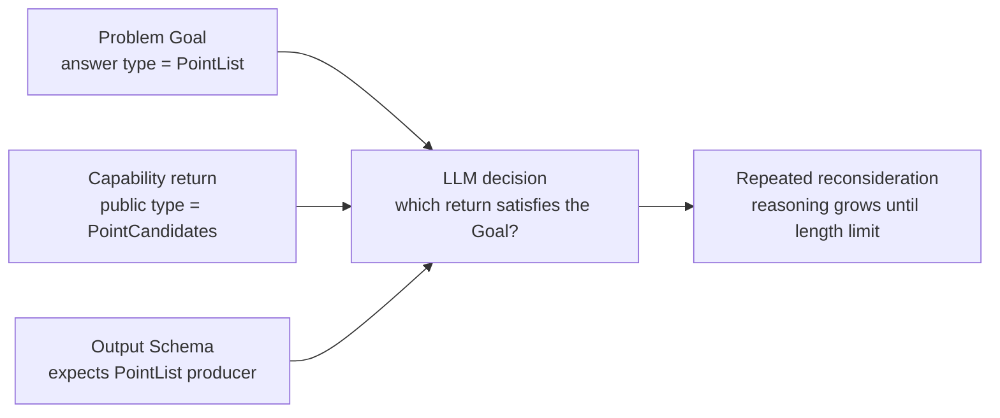
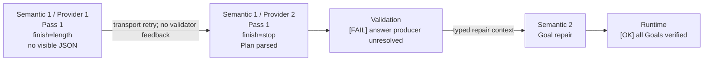
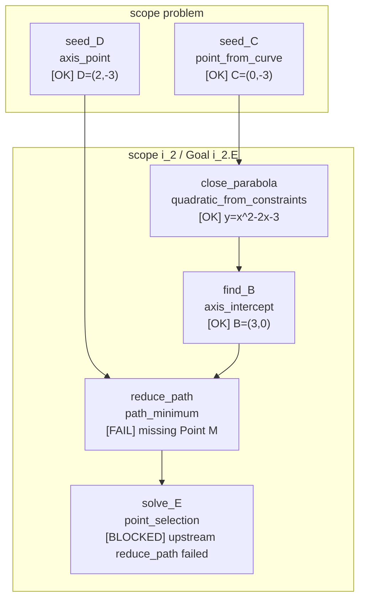
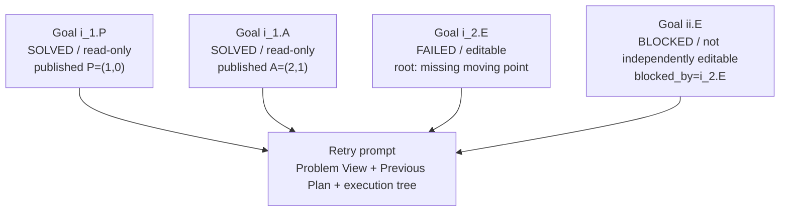
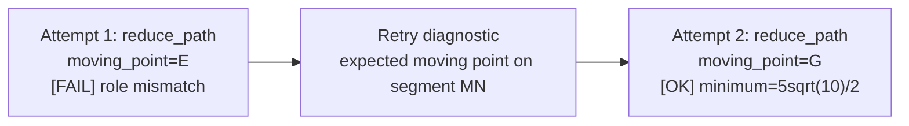

# LLM Sample 故障审查指南

## 1. 目的

本文规定如何审查 Functional Planner 真实 batch 中的单个 sample，覆盖：

- LLM thinking 或输出超长；
- provider timeout、空响应和 transport retry；
- JSON、Schema 与 Plan assembly 错误；
- scope、Goal、binding、compiler、Method、Macro 和 runtime 错误；
- answer、closure、provenance、checkpoint 与 Goal repair 错误；
- 同题不同 sample 的模型方差与上下文缺陷。

审查目标不是复述最终错误，而是还原完整因果链：

```text
LLM 看到了什么
→ LLM 如何推理和输出
→ 代码如何归一、校验、编译和执行
→ 哪个步骤最先失败
→ 哪些错误只是级联结果
→ 下一轮实际收到了什么修复信息
```

本文是逐 sample 调试的规范入口。总体可靠性指标和批量门禁见
`docs/llm-planner-reliability-engineering.md`。

## 2. 基本原则

### 2.1 Artifact 是事实源

`review.html`用于导航，不是最终权威。结论必须能回到本地 artifact：

- Prompt 以`attempt-N.prompt.system.md`和`attempt-N.prompt.user.md`为准；
- provider 行为以`attempt-N.llm-metadata.json`为准；
- thinking 以`attempt-N.provider-attempt-K.reasoning.txt`为准；
- 模型可见输出以`attempt-N.raw-response.txt`为准；
- canonical Plan 以归一、校验后的 Plan artifact 为准；
- 实际运行结果以 transaction 和 checkpoint 为准；
- retry 权限以 Goal retry authority/context 为准。

文件存在但内容为`null`表示该阶段没有建立产物。例如 Plan 为`null`时，不能根据
thinking 猜测“模型本来会输出什么”；transaction 为`null`时，不能把静态推导当成
已执行结果。

### 2.2 先找首个阻断点

一次失败可能同时产生十几个 issue。必须区分：

- **root failure**：按执行顺序最早、移除后可让后续继续的错误；
- **cascade failure**：由上游未产出结果导致的 blocked、unbound 或 closure 错误；
- **independent failure**：不依赖 root failure、即使上游修好仍会存在的错误。

修复和 retry projection 应围绕 root failure；不能把所有 blocked Goal 都当成独立的
LLM 错误。

### 2.3 Semantic attempt 与 provider attempt 分开编号

一个 semantic attempt 可以包含多个 provider attempt。例如：

```text
Semantic Attempt 1
  Provider Attempt 1: finish_reason=length，无 visible JSON
  Provider Attempt 2: finish_reason=stop，返回完整 JSON

Semantic Attempt 2
  Provider Attempt 1: Goal repair
```

provider transport retry不等于新的 Plan retry。审查报告和图中必须同时标出两层编号，
否则会把同一轮重发误认为 LLM 已收到 validator 反馈。

### 2.4 不替 runtime 编造结果

图中可以写实际坐标、表达式、最值和候选集合，但只能来自 runtime artifact。规则是：

- 已执行：标注实际 result、write 或 closure；
- 编译成功但未执行：标注`not executed`及阻断原因；
- binding/schema 阶段失败：标注`no runtime result`；
- 仅 thinking 中推算出的值：标注`LLM reasoning only`，不得当作运行证据。

## 3. Debug Artifact 地图

| Artifact | 用途 |
|---|---|
| `sample-result.json` | sample 总状态、总 usage、最终 gate |
| `llm-metadata.json` | 所有 semantic/provider attempt 的合并 usage |
| `attempt-N.attempt-stage.json` | 本轮协议、阶段和最终 error code |
| `attempt-N.llm-metadata.json` | 本轮 provider attempts、finish reason、thinking 与 token |
| `attempt-N.provider-request.redacted.json` | 实际 provider 参数、模型和 response format |
| `attempt-N.prompt.system.md` | 本轮实际 system prompt |
| `attempt-N.prompt.user.md` | 本轮实际 user prompt |
| `attempt-N.provider-attempt-K.reasoning.txt` | provider 返回的 thinking；每次 transport 调用独立保存 |
| `attempt-N.raw-response.txt` | provider 可见输出原文 |
| `attempt-N.plan-content.json` | 解析后的 LLM Plan 内容 |
| `attempt-N.plan-content-normalizations.json` | 确定性 wire 归一记录 |
| `attempt-N.plan-content-validation.json` | content/schema/owner 校验结果 |
| `attempt-N.plan.json` | 本轮 canonical Plan；未建立时为`null` |
| `attempt-N.structured-error.json` | 本轮对外根错误 |
| `attempt-N.transaction.json` | 实际调用、输入、结果、write、blocked 与 root issue |
| `attempt-N.goal-execution-checkpoint.json` | 内部 typed execution authority |
| `attempt-N.goal-execution-checkpoint.prompt.json` | 可发送给 LLM 的执行树 |
| `attempt-N.goal-retry-authority.json` | solved/failed/blocked Goal 与 editable scope 权威 |
| `attempt-N.goal-retry-context.json` | retry 内部 Context；没有 canonical Plan 时可为`null` |
| `attempt-N.repair.json` | repair wire 与应用结果 |
| `effective-execution-plan.json` | 最终实际执行 Plan |

不同失败阶段不会生成所有文件。缺失或`null`本身就是证据，应写入报告。

## 4. 标准审查流程

### 4.1 建立轮次表

先从 metadata 和 stage 文件建立，不先读最终 error：

| Semantic attempt | 协议 | Provider attempts | thinking | visible output | 结束阶段 |
|---|---|---:|---|---|---|
| 1 | Pass 1 | 2 | low | 第2次有 | answer binding |
| 2 | Goal repair | 1 | low | 有 | runtime |

每个 provider attempt至少记录：

- model；
- thinking mode / reasoning effort；
- `finish_reason`；
- prompt、reasoning、visible output 和 total tokens；
- cache hit/miss；
- reasoning artifact 是否存在；
- 是否返回 visible JSON。

### 4.2 确认 LLM 实际上下文

逐项检查：

1. Problem View中的scope、Entity、Fact和Goal。
2. Capability Catalog中模型可选的方法、参数和返回类型。
3. 输出 JSON Schema及字段说明。
4. Pass 1或repair专用规则。
5. repair时的Previous Plan。
6. retry execution tree、root issue、blocked_by和editable authority。

不要把`planner-state-context.json`、BindingCatalog或内部checkpoint误认为已经发送给LLM；
只有出现在实际 prompt 或 provider request 中的内容才属于模型上下文。

### 4.3 还原每轮 Plan

每个 semantic attempt分别完成：

1. 从 raw response确认模型原始输出。
2. 对照 normalizations确认代码改了什么。
3. 对照 validation确认Schema与Plan结构是否通过。
4. 从 canonical Plan列出scope steps和Goal steps。
5. 从 transaction按依赖顺序标记实际执行状态与结果。
6. 从 checkpoint确认solved、failed、blocked和provisional结果。
7. 从 retry context确认下一轮究竟看到了哪些信息。

### 4.4 判定责任层

| 首个失败位置 | 常见责任 | 是否应消耗 semantic retry |
|---|---|---|
| Provider timeout/429/5xx | provider/transport | 否 |
| `finish_reason=length`且无JSON | 上下文歧义、模型长循环或输出预算 | 通常先做同请求transport retry，再修上下文 |
| JSON解析 | 模型wire或有限容错缺口 | 是；无Plan时仍用Pass 1协议 |
| Schema | 模型wire、schema描述或无害格式归一缺口 | 是；可确定的空字段等由代码归一 |
| Plan assembly/owner | 模型Plan组织或assembly实现 | 模型错误可retry，代码冲突应fail loud |
| Scope/Goal authority | 模型越权或authority实现 | 模型越权可retry，authority漂移不可retry |
| Binding/reconciliation | SemanticRef、typed source、动态依赖 | 计划错误可retry；代码配置错误不可retry |
| Compiler | capability lowering/spec | 通常configuration，不应让LLM猜内部参数 |
| Method/Macro runtime | 数学输入、前提或候选路径 | typed planner-repairable才retry |
| Closure/answer | 残余自由元、分支、答案producer | 结构化反馈后retry |
| Provenance/checkpoint | revision/source/signature漂移 | 非retryable authority错误 |

## 5. 输出超长专项检查

### 5.1 先证明“超长”而不是笼统说“模型卡住”

至少同时检查：

```text
finish_reason == length
reasoning_tokens 接近或达到provider上限
reasoning_content_available == true
visible_content == false，或raw response在JSON中途结束
本次provider attempt未建立可解析Plan
```

如果同一semantic attempt随后出现provider attempt 2并成功返回，报告必须写成
“同轮transport重试恢复”，不能写成“第二轮repair成功”。

### 5.2 分段阅读 thinking

不要整段复制数十万字符。把thinking按决策阶段压缩成轨迹：

```text
识别Goal
→ 枚举capability
→ 比较输入/返回类型
→ 尝试构造Plan
→ 回到同一类型矛盾
→ 重写同一scope
→ 再次回到矛盾
→ token耗尽
```

重点记录：

- 第一次犹豫发生在哪里；
- 重复出现的对象、Goal、capability和类型；
- 是否反复推翻已经确定的选择；
- 是否花大量token模拟Schema、转义JSON或手算题目；
- 是否因两个公开术语指向同一内部概念而来回切换；
- 是否在完整题意与严格输出契约之间看到冲突。

thinking只能解释模型为何纠结，不能证明步骤已经执行。

### 5.3 精确比较上下文，而不是凭长度猜测

分段统计实际 prompt：

- system rules；
- Problem View；
- Plan authority frame；
- Capability Catalog；
- few-shot；
- output schema；
- Previous Plan；
- retry execution tree和diagnostics。

同时记录字节数、provider prompt tokens和cache hit。对同题其他sample先比较prompt hash：

- hash相同、只有一个sample超长：模型方差暴露了潜在歧义；
- hash不同：先定位哪一段变化，不把差异误归给随机性；
- cache miss异常：检查动态内容是否被放在固定前缀之前。

### 5.4 优先查找上下文矛盾

超长thinking最常见的根因不是“题太难”，而是模型无法同时满足多个契约。重点检查：

- Goal声明`PointList`，Catalog却把对应公开return写成`PointCandidates`；
- 题面自然语言说“点E”，Schema却要求集合答案，但附近没有解释二者关系；
- Prompt一处要求Entity读取最新状态，另一处仍要求具名Entity写`StepResultRef`；
- capability公开参数与内部Method参数混在一起；
- 同一role在Problem、Catalog和Schema中使用不同名称；
- 通用规则与具体capability的`use_when`或return contract冲突；
- retry context重复Previous Plan，或同时发送完整Problem与局部Goal视图；
- JSON示例、Schema description和renderer实际字段不一致。

建议画一张“模型看到的冲突”图：



### 5.5 修复优先级

按以下顺序处理，不先把token上限当答案：

1. 统一Problem、Catalog、Prompt和Schema的公开术语与类型。
2. 删除重复或冲突的规则，让同一事实只有一个权威描述。
3. 把决定性约束放到对应字段或capability附近。
4. 对空数组、重复字段等无语义格式噪声做确定性归一并记录。
5. 把内部Method、state version和runtime path从LLM上下文移除。
6. 必要时按Goal可达性裁剪catalog，但不能隐藏真实可选路径。
7. 最后才提高timeout或token上限，用于确认诊断，不作为长期根修复。

### 5.6 超长修复的回归顺序

```text
同一失败sample定向1次
→ 同题3个独立sample
→ 五题5x1
→ 五题5x3
→ prompt/schema snapshot与全量离线门禁
```

通过条件不能只看最终成功，还要检查：

- `finish_reason=length`数量；
- reasoning token P50/P95和最大值；
- provider attempts / semantic attempts；
- 同一冲突术语在所有上下文中的一致性；
- cache hit；
- configuration/unclassified error；
- retry是否真的收到上一轮root diagnostic。

## 6. 其他 Sample 问题的检查方法

### 6.1 JSON 与 Schema

检查顺序：raw response、output schema、parse error path、normalizations、canonical Plan。

- 多一个尾随`}`等可唯一恢复的JSON噪声，可以有限容错并记录；
- 空`steps/goals/children`等无语义字段，可以确定性删除；
- 缺失capability、对象或数学关系不能由代码猜测；
- Schema接受但compiler拒绝同一结构，属于代码契约冲突。

### 6.2 Scope、Goal 与 step owner

检查每个step是否只出现一次，并明确属于：

- `scope.steps`：服务该scope内多个Goal或后代Goal的共享前提；
- `goal.steps`：只服务一个Goal的求解步骤。

完全相同的跨容器副本可确定性去重；同`step_id`但内容不同必须生成可修复issue。
不要仅凭step名字判断归属，使用consumer Goal集合与依赖DAG。

### 6.3 Binding 与动态状态

检查：

- Entity ref是否由Method view contract解析为identity或latest state；
- 具名对象是否错误使用`StepResultRef`；
- 匿名中间结果是否遗漏`StepResultRef`；
- producer是否在当前scope或祖先scope可见；
- sibling状态是否泄漏；
- 并列writer是否可比较；
- runtime实际值是否证明等价、收敛或冲突。

合并或删除step必须基于runtime结果等价，不使用字符串、step id或输入形状代替。

### 6.4 Compiler、Method 与 Macro

先判断失败是否暴露了LLM可修复的公开角色：

- 缺公开参数或对象：生成typed planner-repairable diagnostic；
- 公开参数存在但无法lower到内部Method：configuration error，不继续LLM retry；
- Method数学前提失败：保留公开对象、role、expected/observed和repair action；
- Macro搜索：记录authored role、候选、runtime checks、winner和歧义原因；
- 内部Method参数、`PointRef`、runtime path不得直接要求LLM补齐。

### 6.5 Runtime、Closure 与 Answer

按执行DAG而非Plan数组顺序查看：

- 哪些step实际执行；
- 每个step的exact inputs、actual outputs和writes；
- 第一个failed call；
- 哪些step只是blocked；
- residual free symbols、branch count和candidate count；
- Goal answer producer是否存在、类型匹配且scope可见；
- answer verification、symbolic closure和provenance是否全部通过。

如果前三个Goal已通过、第四个Goal在binding阶段失败，报告必须明确前三个是否真的执行并
冻结，不能用“整轮失败”抹掉局部成功。

### 6.6 Retry

对比上一轮与下一轮的实际prompt，确认：

- Previous Plan是否只出现一次；
- solved Goal是否只读但仍携带每步实际结果；
- failed Goal是否可完整替换steps和answer binding；
- blocked Goal是否因依赖等待，而非被错误标成editable；
- root issue是否保留对象、role、expected/observed和候选详情；
- scope/Goal结构是否与Problem View对齐；
- 下一轮是否收到上一轮canonical Plan，而不是空Plan或过期Plan；
- repair应用后是否重新校验DAG、binding、answer和checkpoint。

## 7. 强制图示规范

每个失败sample的审查必须包含以下图。不能只提供文字摘要。

### 7.1 全局轮次图

展示semantic attempt、provider attempt、协议和阻断阶段：



### 7.2 每轮 Plan 与执行图

每个semantic attempt单独画一张，不允许只画最终轮。scope用`subgraph`表达，依赖用箭头
表达。每个step节点至少包含：

```text
step_id
capability_id
status: OK / FAIL / BLOCKED / NOT EXECUTED
actual result（如有）
root error（失败节点）
```

示例：



若本轮在schema或binding阶段失败，也必须画图，并将所有未执行节点明确标为
`NOT EXECUTED`，不能省略后让读者误以为它们执行过。

### 7.3 Retry authority 图

展示哪些Goal被冻结、哪些可重写、哪些只是阻塞，以及LLM下一轮收到了什么：



### 7.4 轮间 Plan diff 图

repair发生时画出旧步骤、replacement和实际效果：



### 7.5 图示纪律

- 图中的结果必须注明来自哪个attempt的runtime artifact。
- 表达式保留runtime原值；只做排版，不自行化简后冒充actual output。
- root failure使用`FAIL`，级联节点使用`BLOCKED`。
- reasoning中的候选计算与runtime结果分开标注。
- sibling scope并列画，不用一条线暗示不存在的依赖。
- shared scope producer连到所有真实consumer Goal。
- 每轮图后用一段话说明“模型错、上下文错、代码错”各占哪一部分。

## 8. 同题多 Sample 比较

同题一个sample失败、另外两个通过时，按以下顺序比较：

1. system/user prompt hash是否一致。
2. output schema与Capability Catalog hash是否一致。
3. model、thinking、temperature、timeout和token上限是否一致。
4. provider queue/transport证据是否不同。
5. thinking第一次分叉发生在哪个决策。
6. Plan选择的capability、对象角色和scope owner如何不同。
7. normalization和validator是否把同类wire处理一致。
8. retry收到的Previous Plan、execution tree和diagnostic是否一致。

相同prompt下只有一个sample进入长循环，仍然说明上下文存在可被模型方差放大的歧义；
不能简单归为“模型随机”。并发限制只有在provider状态、延迟或限流证据支持时才能成为结论。

## 9. 常用检查命令

先指定sample目录：

```bash
SAMPLE=internal/solver-runs/.../sample-02
```

列出逐轮证据：

```bash
find "$SAMPLE" -maxdepth 1 -type f -print | sort
```

查看semantic/provider attempt和token：

```bash
jq '.' "$SAMPLE/llm-metadata.json"
```

查看每轮结束阶段与根错误：

```bash
jq '.' "$SAMPLE/attempt-1.attempt-stage.json"
jq '.' "$SAMPLE/attempt-1.structured-error.json"
```

统计prompt、thinking和visible output字节：

```bash
wc -c "$SAMPLE"/attempt-1.prompt.* \
  "$SAMPLE"/attempt-1.provider-attempt-*.reasoning.txt \
  "$SAMPLE"/attempt-1.raw-response.txt
```

比较同题sample的Prompt是否一致：

```bash
shasum -a 256 sample-*/attempt-1.prompt.system.md
shasum -a 256 sample-*/attempt-1.prompt.user.md
```

定位thinking中的反复决策词：

```bash
rg -n "PointList|PointCandidates|answer|return|scope|retry" \
  "$SAMPLE"/attempt-1.provider-attempt-*.reasoning.txt
```

检查Plan是否真正建立：

```bash
jq 'type' "$SAMPLE/attempt-1.plan.json"
jq 'type' "$SAMPLE/attempt-1.transaction.json"
```

这些命令只用于定位证据。最终报告仍需阅读上下文并绘制逐轮因果图。

## 10. 标准审查报告模板

```markdown
# <case> / <sample> 审查

## 结论
- 最终状态：
- semantic attempts：
- provider attempts：
- root responsibility：LLM / context / code / provider
- 是否存在configuration error：

## 证据链接
- sample目录：
- review.html：
- attempt metadata：
- reasoning：
- raw response：
- canonical Plan：
- transaction/checkpoint：
- retry context：

## 轮次总览
<表格 + Mermaid全局轮次图>

## Attempt 1
- LLM输入：Problem / Catalog / Schema中与本轮相关的内容
- thinking轨迹：
- raw/canonical差异：
- 首个阻断点：
- 实际执行结果：
- 下一轮收到的反馈：
<本轮scope/Goal Plan执行图>

## Attempt 2
<同上，不得省略>

## Attempt 3
<同上，不得省略>

## Root 与级联错误
- root：
- cascade：
- independent：

## 上下文问题
<Problem、Catalog、Schema、Prompt、retry数据的冲突图>

## 泛化修复
- contract/schema：
- prompt/catalog：
- compiler/runtime：
- retry authority：
- offline regression：
- live acceptance：
```

本地文件链接必须指向具体attempt artifact，不能只给batch首页。

## 11. 禁止的审查方式

- 只读最终`structured-error.json`就断言模型错了。
- 把provider attempt误写成semantic retry。
- 用thinking中的手算结果冒充runtime结果。
- 只画最终Plan，不画前两轮为何失败。
- 图中省略未执行步骤，让binding失败看起来像Method失败。
- 把所有blocked Goal都列成独立root error。
- 看到一个sample超长就只增加token/timeout。
- 没有provider证据就归因并发或排队。
- 用字符串相似、step名称或gold答案替代typed/runtime authority。
- configuration error继续消耗Planner semantic retry。
- 为单题增加特判，而不检查同类Method、Macro、Schema和diagnostic。
- 直接粘贴整份thinking，缺少阶段化摘要和首次分叉点。

## 12. 完成检查表

- [ ] semantic attempt与provider attempt已分开。
- [ ] 每轮实际system/user prompt均已检查。
- [ ] output schema与provider response format均已检查。
- [ ] thinking已按阶段摘要，首次循环/分叉点已定位。
- [ ] raw、normalized、canonical Plan差异已说明。
- [ ] 首个root failure与级联错误已分开。
- [ ] 每个semantic attempt都有scope/Goal Plan执行图。
- [ ] 图中每个已执行step都标注实际结果。
- [ ] 未执行step明确标注`NOT EXECUTED`或`BLOCKED`。
- [ ] retry authority图展示solved、failed、blocked和editable范围。
- [ ] 下一轮实际收到的Previous Plan、执行结果和诊断已核对。
- [ ] 同题其他sample的prompt hash与首次thinking分叉已比较。
- [ ] 结论已区分LLM、上下文、代码和provider责任。
- [ ] 修复是同类契约修复，不是单sample特判。
- [ ] 已列出最小离线回归和真实smoke验收顺序。

