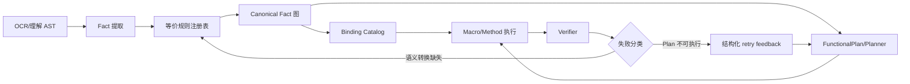

# 数学语义等价约束归一化实现设计

- 状态：已确认
- 日期：2026-09-19
- 适用范围：题目理解、FunctionalPlan、Macro/Method 执行、验证失败重试

## 1. 背景

当前求解链路可以识别“垂直”“直角”“点在坐标轴上”“点的横坐标大于零”等表达，但这些表达可能以不同的 AST、Binding 或 Macro 参数形态进入后续阶段。理解结果语义正确，并不保证执行器能找到对应的可执行约束，最终会出现：

- planner 生成了语义合理但无法执行的 plan；
- Macro 展开时找不到绑定，或动态约束被判定为无效；
- 验证失败后只能显示通用的“系统错误”；
- 重试重复生成同一类 plan，无法收敛。

近期案例中，移动点 `N=(n,0)` 与 `x(N)>0` 没有统一成可执行的 `n>0`，导致 `derive_minimum` 的约束候选为空，最终触发 `planner.scope_retry_exhausted`。另一个案例是 LLM 将直角条件表达为两条直线垂直；如果两者未进入同一语义层，后续 Method 可能只支持其中一种形式。

## 2. 目标与非目标

### 目标

1. 建立可注册、可审计的数学语义等价规则集。
2. 将等价表达统一为稳定的 Canonical Fact，供 planner、Macro、Method 和 verifier 共同使用。
3. 保留原始表达及转换证明，使失败信息可以反馈给 LLM，而不是退化为通用错误。
4. 对一批等价关系进行参数化测试，避免每出现一个案例就增加一条孤立的 `if`。
5. 保证重试能够利用规范化结果，且不会因反复转换产生循环。
6. 明确题意抽取与语义归一化的边界：抽取优先保留题面直观、可读的表达，等价改写交给归一化层。

### 非目标

- 不在本阶段重写 LLM 的题目理解能力。
- 不把一般性的数学推理交给字符串替换。
- 不默认把近似等价、带额外前提的推理当作无条件等价。

## 3. 核心设计原则

1. **类型优先**：规则匹配 Typed Fact/AST，不匹配自然语言字符串。
2. **等价与推导分离**：保持原语义不变的 canonicalization，与新增前提或结论的 derived fact 分开记录。
3. **证明优先**：每个转换都携带前提、规则 ID、输出和可读证明。
4. **作用域显式**：点、线、函数、参数、坐标轴等实体必须在规则上下文中明确绑定。
5. **固定点归一化**：多条规则可串联，但输出必须最终稳定、幂等且不可循环。
6. **执行器只消费规范语义**：Method/Macro 不再为同一数学概念维护多套临时兼容逻辑。
7. **来源数学表达优先**：LLM 直接输出题面可读的数学表达式，不要求填写面向解析器的构造语法；等价改写只在代码内部完成。

抽取层与归一化层的职责必须分开。题面写“∠ABC=90°”或“∠ABC为直角”时，LLM-facing
候选统一保留为直接数学表达 `∠ABC = 90°`，不能要求模型填写 `angle(A,B,C) = 90°`，也不能主动改写成
`line(A,B) ⟂ line(B,C)`；题面明确写“两直线垂直”或使用 `⊥` 时，才抽取为垂直关系。解析器可以把
这些直接表达绑定为内部 `angle` AST，但该 AST 不属于抽取协议。两种事实在归一化层进入同一个
`right_angle` Canonical Fact，并分别保留来源和转换证明。抽取层不因“看起来等价”而补写另一种表达，
也不把图形推断出的直角当作题设条件。

## 4. 总体架构



归一化层应位于“理解结果已生成”之后、“planner 和 runtime binding 建立”之前。它既不能依赖某个具体 Macro 的实现，也不能只在验证失败后临时修补。

## 5. 模块与数据结构

实现沿用现有模块，并新增规则注册与报告模块：

```text
server/shuxueshuo_server/problem_understanding/equivalence_rules.py
server/shuxueshuo_server/problem_understanding/normalization_report.py
server/tests/solver/test_semantic_equivalence.py
server/tests/solver/fixtures/semantic_equivalence/*.json
```

### 5.1 规则接口

```python
@dataclass(frozen=True)
class EquivalenceRule:
    rule_id: str
    input_kinds: tuple[str, ...]
    output_kind: str
    apply: Callable[[Fact, RuleContext], RuleResult | None]
    requires: tuple[Predicate, ...] = ()
    priority: int = 100
    reversible: bool = False
```

```python
@dataclass(frozen=True)
class DerivedFact:
    fact: Fact
    rule_id: str
    premises: tuple[FactId, ...]
    proof: str
    strength: Literal["equivalent", "entailed"]
    confidence: Literal["certain", "conditional"]
    source_span: SourceSpan | None
```

`equivalent` 表示与原事实在给定前提下可互换；`entailed` 表示由原事实推出的新事实，不能自动反向使用。规则结果还应返回 `blocked_reason`，用于诊断缺失前提，而不是静默丢弃。

### 5.2 Canonical Fact

Canonical Fact 至少包含：

- `kind`：如 `right_angle`, `perpendicular`, `coordinate_membership`, `symbol_constraint`；
- `entities`：参与关系的点、线、函数或参数；
- `expression`：规范化后的表达式；
- `scope`：变量和实体的作用域；
- `provenance`：原始 Fact、规则链和证明；
- `assumptions`：规则成立所需的前提。

同一事实应通过稳定 key 去重，例如 `kind + sorted(entity_ids) + normalized_expression + scope_id`。不得仅按渲染文本去重。

## 6. 第一批规则

### 6.1 垂直与直角

LLM-facing 抽取层保留来源数学表达：题面给出 `∠ABC = 90°` 时保留该表达，题面给出
`line(A,B) ⟂ line(B,C)` 时保留垂直表达。解析器内部可以把前者绑定为 `angle` AST，但不能要求模型输出该构造语法。
两条线段/直线 `l1 ⟂ l2` 且交点为 `P` 时，归一化层输出内部 `right_angle(P,l1,l2)` Canonical Fact；需要展示时仍使用
直接角表达，不把内部 AST 或派生表达回写到候选。

角表达和垂直表达进入同一个 Canonical Fact，强度为 `equivalent`。转换必须记录两条边、顶点、交点和作用域。

反向派生只有在角的两条边、顶点和所在平面已明确时才启用。若“直角”只描述一个角而无法确定两条执行对象，应保留原 Fact 并报告 `ambiguous_entity_scope`；不能为了得到垂直关系猜测两条边。

### 6.2 坐标轴成员关系

输入：`P` 在 x 轴上；输出 `y(P)=0`。输入：`P` 在 y 轴上；输出 `x(P)=0`。

这类转换是确定等价，且应同时保留几何 Fact，便于图形和解释层使用。

### 6.3 移动点坐标域降级

输入：`N=(n,0)`、`x(N)>0`。

输出：参数域中的 `n>0`，强度为 `entailed`，前提是坐标绑定明确且 `x(N)` 已被可靠解析为 `n`。若 `N` 的坐标表达式包含未解析函数或分支，应返回条件阻塞，不得猜测。

同理支持 `y(N)≥c`、`x(N)=x(A)`、`N` 在某条参数曲线上等形式，但每条规则都应明确适用条件。

### 6.4 路径表达式交换

输入：`A->B->C` 与 `B->A->C` 等表达，只在定义了对称距离/长度或明确的路径交换律时转换。不能把任意序列重排视为等价。

### 6.5 方程和关系的规范化

支持交换律、项排序、等式两侧交换、零项消除、同类项合并等纯代数规范化。规则必须使用符号 AST，避免对字符串做正则替换。

### 6.6 目标状态与中间状态

`derive_minimum`、`solve_parameter`、`construct_point` 等目标不能通过同义词直接互换。应为每个目标定义状态类型、输入契约和输出契约；等价层只转换数学事实，不改变 planner 的任务语义。

## 7. 归一化算法

1. 从理解结果提取初始 Facts。
2. 对每个 Fact 按规则优先级匹配。
3. 生成 Canonical Fact 和 Derived Fact，并记录 proof。
4. 将新 Fact 放入队列，继续处理可串联规则。
5. 以 Fact key 去重，达到固定点或超过最大深度时停止。
6. 输出 `FactGraph`、`BindingCatalog` 和 `NormalizationReport`。

要求：

- `normalize(normalize(x)) == normalize(x)`；
- 每条规则声明单调方向或规范形式，禁止 A→B→A 循环；
- 规则失败不应吞掉原始 Fact；
- 条件规则的假设进入 `assumptions`，不能伪装成确定事实。

## 8. Planner、Macro 与 retry 的边界

### Planner

Planner 只读取 Canonical Fact 和目标契约。若候选为空，应报告：

```json
{
  "code": "functional.weighted_axis_path.dynamic_constraint_invalid",
  "phase": "normalization_or_binding",
  "missing_fact_kind": "symbol_constraint",
  "source_facts": ["x(N)>0"],
  "suggested_action": "retry_with_semantic_normalization"
}
```

### Macro/Method

Macro 只接受稳定的 typed input。兼容旧格式时，在入口调用统一 normalizer，并把转换结果回写到执行上下文；不要在每个 Macro 内复制等价判断。

### retry

Retry feedback 应区分：

- `understanding_invalid`：题意或实体作用域不可靠；
- `normalization_missing`：有原始事实，但缺少等价转换；
- `binding_missing`：规范事实存在，但未生成运行时绑定；
- `plan_invalid`：planner 选择了不满足契约的步骤；
- `verification_failed`：执行结果与事实不一致。

只有前两类适合要求 LLM 重写或补充语义；`binding_missing` 应优先由确定性运行时修复，避免把可修复的编译问题反馈成“重新理解题目”。

## 9. 测试策略

### 9.1 机器可读规则夹具

每条规则至少包含：输入 Facts、前提、期望 Canonical Facts、期望 proof、期望强度和反例。

```json
{
  "rule_id": "geometry.perpendicular_to_right_angle",
  "input": ["line(A,B) ⟂ line(B,C)"],
  "expect": ["right_angle(A,B,C)"],
  "strength": "equivalent",
  "negative": ["line(A,B) ⟂ line(C,D)", "shared_vertex_unknown"]
}
```

### 9.2 参数化测试

- 每个规则覆盖正向、缺前提、作用域歧义、重复归一化和反向误用。
- 对坐标轴、垂直/直角、参数约束、等式规范化分别做规则族测试。
- 对所有规则运行固定点、幂等性和无循环测试。
- 增加端到端回放：理解结果 → 归一化 → binding → Macro replay → verifier。
- 将真实失败样本保存为回归夹具，验证错误代码和 retry feedback 稳定。

## 10. 迁移计划

### 阶段一：抽取现有逻辑

把 `runtime_lowering.py`、planner retry 和 Macro 中的等价判断迁移到规则注册表，保持现有输出不变。

### 阶段二：接入 FactGraph

在 understanding 与 planner 之间生成 `NormalizationReport`，并将 provenance 写入 checkpoint，前端显示具体失败阶段和缺失转换。

### 阶段三：扩大规则族

先加入几何关系和坐标约束，再加入纯代数规范化、函数关系和路径表达式。每加入一族规则，必须同时加入正例、负例和真实回放样本。

### 阶段四：收敛 retry

统计 `normalization_missing`、`binding_missing`、`plan_invalid` 和 `scope_retry_exhausted` 的比例。若同一错误连续重试无新 Facts，应停止重试并返回可读诊断。

详细实施顺序、接口、Prompt 迁移和验收门槛见[数学表达式优先：等价归一化实施计划](math-notation-equivalence-normalization-implementation-plan.md)。

## 11. 验收标准

1. “直线垂直”与“夹角为直角”在明确交点和作用域时进入同一个 Canonical Fact。
2. `N=(n,0)`、`x(N)>0` 可以稳定生成 `n>0` 的运行时约束，并被原有 Method 重放接受。
3. 重建从“求解步骤”开始时复用已完成的理解和归一化快照，不重复执行理解阶段。
4. 规则缺前提或实体歧义时，系统保留原始事实，并输出结构化诊断。
5. planner 失败时能够区分理解、归一化、绑定、计划和验证阶段；LLM 只收到适合重试的反馈。
6. 规则测试以参数化夹具覆盖一批等价关系，而不是每个线上案例增加一个特例分支。
