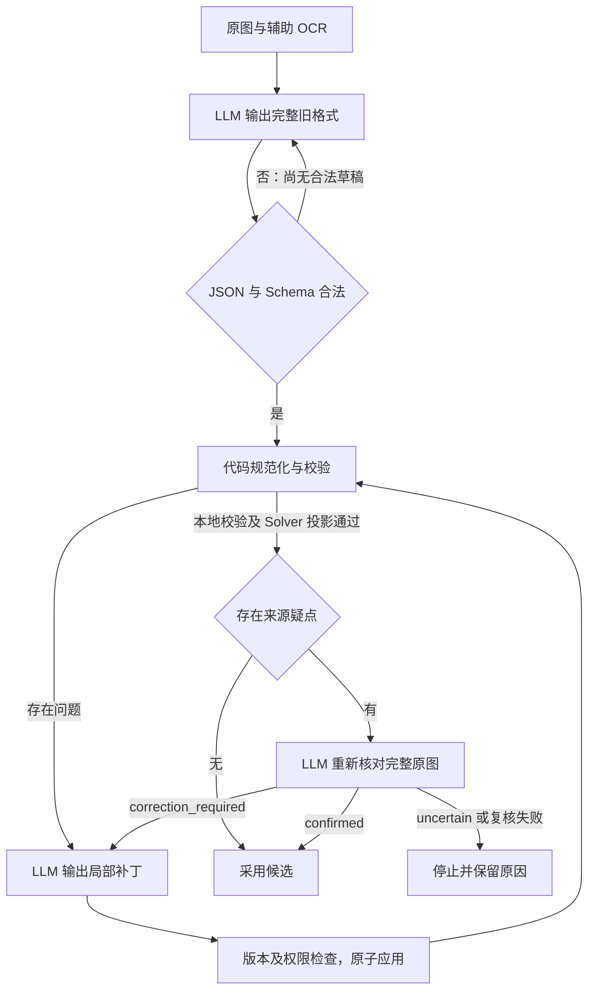
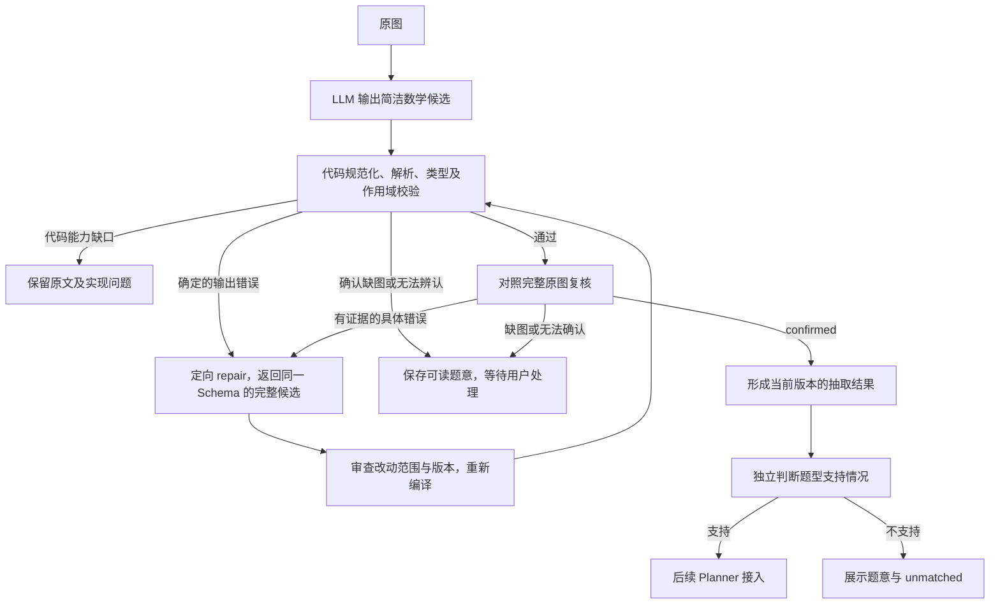
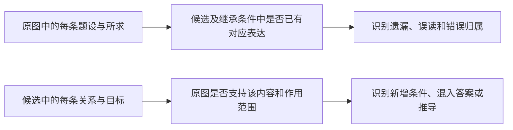

# 数学记法题意抽取：repair 与原图复核设计

2026-09-17 当前状态：**目标at已删除，条件统一放facts，部分目标的局部状态用children表达；不保留旧at输入兼容。** 实现说明见第11节；本版没有追加模型调用。以下数值为删除字段前的历史验证结果。

日期：2026-09-16；2026-09-17 更新 review 上下文与不确定性规则。状态：**本设计已定案并实现独立闭环；真实调用前离线门禁 425 项通过，七题冻结首轮及闭环均为 5/7；比较器修复后同一批响应离线复验 7/7，当前门禁 512 项通过，结果见第 10 节及 [review 调整报告](validation/math-notation-review-prompt-20260917/README.md)。** 原图复核检查代码难以发现的来源差异。完整返回的 repair、预算、停止和恢复策略均已确认，不再处于讨论状态。

代码基线：`3129e787`，原有相关回归 358 项全部保留。此前真实批次 DeepSeek 6/7、Doubao 4/7，代码修复后的离线回放均为 6/7；这些是历史成绩。新增 `--workflow review-repair`，默认仍为 `single`。两种入口均保持 `candidate_only=true`、`solver_ready=false`；只有当前修订完成 confirmed 复核时，闭环结果的 `source_reviewed=true`。

本轮实现独立协调器、外置契约、录制门禁和一次 DeepSeek 七题真实闭环。Planner、Solver、生产 API 和部署不在本轮范围；不自动追加付费批次，不运行 24 例付费模型评价。

相关入口：[主计划](seven-problem-math-notation-review.md)、[当前验证报告](validation/math-notation-angle-catalog-20260916/README.md)、[已知问题 MN-001](math-notation-known-issues.md)。完整历史运行归档保留在本地 `internal/solver-runs/`，未随本次代码提交加入 Git；必要录制响应、金标和哈希已纳入测试 fixture，验证报告及离线回放产物已提交。

## 1. 先区分三个问题

| 问题 | 负责机制 | 结论边界 |
| --- | --- | --- |
| 输出是否能被代码正确理解？ | Schema、数学解析、对象类型、引用与作用域校验 | 合法不代表忠实或完整 |
| 输出是否忠实、完整地表达原题？ | 对照原始图片的 source review | 模型复核也可能遗漏或误判 |
| 当前系统能否求解？ | 独立的 family、能力及后续执行检查 | 不支持不能反向要求模型补写题设 |

Repair 是对已定位问题的修订动作，不是寻找所有读题错误的万能检查器。测试中的金标语义比较只用于评测，生产环境没有金标；金标、答案及金标差异不得进入抽取、复核或 repair 请求。

## 2. 原生产链路的实际行为

生产入口仍使用 `solver/extraction` 下的 `ProblemDomainExtractionService`。首次输出契约为 `problem-domain/v1`；已有合法草稿后的修复契约为 `problem-repair/v1`。这与已清理的实验性 `problem-domain/v2` 不同。



所有循环受预算和无进展检查限制。已有合法草稿后，某次补丁格式错误不会销毁之前的草稿。

### 2.1 旧代码校验的内容

- JSON、字段结构、枚举、必填项及输出截断。
- 分问和实体名称冲突、父子继承、引用存在性、可见性和对象类型。
- 受限代数式是否合法、自由符号是否声明。
- 冗余对象、重复或冲突定义、重复目标，以及模型自己的题面转录和对象名称是否一致。
- family 所需的基础条件数量和特征；是否能投影到 Solver 输入、建立运行上下文、满足方法输入预检。

旧 `source_text` 一致性检查并不是图片识别。模型如果同时在转录和结构化条件中漏掉某条题设，内部检查仍可能通过。旧校验中也混合了抽取合法性与 Solver 就绪性，新设计应拆开。

旧协调器明确阻断原图复核的 uncertain、复核格式无效和复核失败；其他问题主要进入受预算限制的循环。不能把 issue 上存在 `retryable` 字段误认为当前协调器已完整按错误类别执行分流；新设计需要显式分流测试。

### 2.2 旧补丁 Schema

[完整 Schema](../internal/schemas/problem-repair.schema.json)。以下 ID 为示意，实际必须复制请求提供的值：

```json
{
  "schema_version": "problem-repair/v1",
  "base_revision_id": "problem-revision:…",
  "replacements": [
    {
      "unit_id": "代码提供的条件ID",
      "value": {"kind": "point_coordinate", "point": "A", "value": ["-1", "0"]}
    }
  ],
  "additions": [],
  "removals": []
}
```

`replacements` 按单元替换；`additions` 指定作用域、集合与内容；`removals` 指定单元。内容沿用旧实体、fact、goal 等对象，因此 Schema 较大。

代码根据错误及依赖关系生成允许修改的范围，验证补丁基准版本，禁止越界或隐式修改其他单元，原子应用后重新校验。允许修改不意味着可以随意删条件来规避错误；旧代码也对删除单独授权。无语义变化的补丁会被判为无进展，来源纠错另有字面变化处理。

### 2.3 旧原图复核与预算

旧复核仅在本地校验及投影通过、且有来源疑点时触发。疑点来自 OCR 与候选转录不一致、题型来源标记未覆盖、未解决的观察问题。复核会看完整题目，不只看差异区域。

`problem-source-review/v1` 输出 confirmed、correction_required 或 uncertain，findings 带单元、原图短文、说明及区域。复核本身不修改草稿。结果绑定图片与候选修订，不能用于另一个版本。

当前生产预算为内容调用最多 3 次、复核最多 3 次、总语义调用最多 6 次、网络尝试最多 12 次。恢复机制保留调用审计，不会把结果未知的复核悄悄再跑一次。

代码依据：[协调器](../server/shuxueshuo_server/solver/extraction/problem_domain_service.py)、[校验器](../server/shuxueshuo_server/solver/extraction/problem_domain_validation.py)、[补丁应用](../server/shuxueshuo_server/solver/extraction/problem_domain.py)、[原图复核](../server/shuxueshuo_server/solver/extraction/problem_source_review.py)、[生产预算](../server/shuxueshuo_server/product/execution.py)。

## 3. 已实现的新闭环



复核和编译通过不等于 Solver 已可执行。本阶段不改变 `solver_ready=false`。缺图在任一阶段确认后，都阻断后续自动求解；保留可读题意，不通过删除 uncertainties 解除阻断。

### 3.1 错误分流

| 情况 | 处置 |
| --- | --- |
| 空白、等价符号、明确角度简写、可证明的重复关系 | 代码规范化，保留原始返回，不调用 repair |
| definitions/facts 混写但能正确识别对象；可选变量提示省略 | 接受，不因组织偏好重试 |
| 无效 JSON、Schema 类型错误、目录内操作的确定语法/类型错误、引用或目标类型错误 | 给出位置和原因，允许 repair；尚无可靠候选时按同契约重新抽取 |
| Schema/目录允许的记法未被解析器支持，或等价性暂不能证明 | 记录代码能力缺口，不要求模型删条件或改变题意 |
| 复核从原图发现漏条件、范围错误、比例方向错误、目标或分问错误 | 带证据定向修订 |
| 图形缺失、文字无法辨认、原题存在不能消除的歧义 | 等待用户处理，不猜测补齐 |
| 未匹配 family、缺少方法、Solver 投影或配置缺口 | 与抽取有效性分开；不能要求模型补出 Solver 想要的条件 |
| 与金标不等价 | 评测报告，不作为生产 repair 的提示来源 |

解析器及绑定器保留结构化 `reason_code`，内部诊断记录稳定 JSON Pointer、原内容、阶段、代码、处置类别和 `repair_scope`。来源诊断另外保存 `source_excerpt`。这些字段只存在于服务端及定向修复请求，不增加首轮 LLM 输出要求。

`NotationError` 的机器码由调用点显式给出，不从说明文本拆分。混合 `repair` / `code_gap` 时，只修复与缺口无重叠的授权字段，再重新诊断；剩余缺口继续阻断。缺口的父子路径不能获得覆盖性修复权限。明确缺图等需要确认的来源问题仍先停止。

有些解析失败的责任无法立即确定，例如合法的新写法与自造操作名。分类依据应是已发布的 Schema/表达目录及已实现能力；无法确认时保留不支持诊断，不能默认模型数学理解错误。无法证明交点唯一等情况也不能强迫模型补写非退化假设。

## 4. repair 契约：同一 Schema，完整返回，代码审查改动

### 4.1 请求

提供同一组完整原图、当前候选、具体问题、允许修改的范围，以及当前 Schema、表达目录和 repair 提示词。沿用 image-only 来源，不引入旧 OCR、答案、金标辅助文字或初次模型推理过程。

示例反馈是代码提供的诊断，不是让模型生成的新结构：

```json
{
  "path": "/root/children/0/facts/2",
  "source": "angle(A,B)=40°",
  "stage": "compile",
  "code": "binding.call_arity",
  "action": "repair",
  "message": "角的三个点参数不完整，请回看原图修复该关系。",
  "repair_scope": [{"path": "/root/children/0/facts/2", "mode": "replace"}]
}
```

复核发现遗漏时，应给出所属分问与短原文证据，不能捏造一个不存在的条件路径。复杂父子结构错误应明确授权相应子树范围，不能靠数组位置碰巧对上。

### 4.2 响应

继续使用 [problem-math-notation/v1](../internal/schemas/problem-math-notation-v1.schema.json)：`root`、`match_status`、`family_id`、`match_reason`。definitions/facts 仍为字符串；goals 仍为现有少量字段。LLM 不输出补丁操作、内部 ID、修订号、哈希或运算树。

独立小例子的完整候选如下；修复真实整题时须返回整题，不能只返回发生变化的片段：

```json
{
  "root": {
    "label": "题目",
    "facts": ["P ∈ segment(A,B)"]
  },
  "match_status": "unmatched",
  "family_id": null,
  "match_reason": "未匹配已注册题型"
}
```

选择完整返回的理由：现有候选已较简洁，同一 Schema 降低模型学习另一套修订协议的负担，也便于处理分问结构变动。代价是重复输出 token 与无关内容漂移风险。若后续测量证明这一成本过高，再评估局部子树替换；本轮不同时设计两套输出协议。

### 4.3 服务端采用条件

1. 调用记录绑定基准候选修订、图片哈希、Schema/Prompt/目录版本；响应只能作用于该请求的基准版本。
2. 修改范围由具体诊断及依赖决定，默认最小范围。原图复核可以针对此前“解析合法”的内容提出纠错；解析通过不是题意不可更改的证明。
3. 用基准快照解释诊断路径，不能在新数组中直接沿用旧索引。禁止依靠 label 唯一性猜测对应分问；结构重排须有明确授权，否则报告越界。
4. 不相关内容必须保持不变或经代码证明等价。定义与 facts 之间的安全移动、条件顺序变化可通过规范化处理；证明不了就保留差异，不能只因文字相似而接受。
5. 修复解析错误不授权删掉关系、目标、量词、状态条件或缺图声明。语义删改需要具体来源依据；不能靠变成 unmatched 逃避题意校验。
6. 应用是原子的。越界或无效返回保留旧候选，不拼接部分成功字段。被拒绝的候选和原因也入审计。
7. 候选发生变化后重新解析、绑定和检查整题；父问定义变动会影响子问。旧编译结果、匹配校验和原图复核结论不得直接复用。

首版全量重新编译。服务端采用完整返回为新的工作修订后，仍可能发现其他编译问题；只有整题校验及当前修订复核通过，才进入 `reviewed_candidate`。不拼接部分返回，不把模型输出的“已修复”当成采用依据。

权限模式：`replace` 修复确定的语法/类型错误且保留目标、量词和逻辑要求；`append` 只能在指定容器补项；`source_edit` 修正有来源证据的具体项；`subtree` 只调整授权子树的归属并保留全部内容；没有可靠候选时才用 `reextract`。未知局部引用另授权本问 definitions 的补充，不能改动兄弟问。目标列表级诊断仅允许追加，删除或修正目标必须精确到项。多项变化若无法对应到基准位置则整体拒绝。repair 新发现缺图/歧义时，可在根 uncertainties 补诊断并停止；这不扩大数学内容修改范围，也不算修复成功。

2026-09-17 收紧来源复核的路径授权：空 JSON Pointer `""` 只允许用于 `wrong_transcription`，且当前候选确实缺失 `original_text`；它在服务端转换为唯一的 `/original_text` 授权。其他 finding 必须指向已有的非空路径，整题数学分问为 `/root`。Schema 限制空路径的 kind，代码再核对候选字段是否存在。非法 review 以 `review.invalid_response` 停止，不进入 repair、不改变原候选。

授权生成再次检查 review 的精确路径，不沿用编译诊断的“回退到最近父路径”规则。最终 guard 独立拒绝整份候选的 `source_edit`、`subtree`、`replace`、`append`，已有可用候选时也拒绝 `reextract`；没有可用候选时保留明确的重新抽取。`source_edit` 对分问容器按路径识别，即使容器只有 label、没有 facts/children，也不能整块改写。补充原文、具体数学字符串纠错与保留内容的分问迁移继续可用。该修复有独立攻击回归并纳入 affected 门禁，见[空路径授权修复报告](validation/math-notation-product-stage-one-20260917/repair-authority.md)。

空路径诊断的 `source` 为 null，完整候选仅从 `base_candidate` 读取，不在每个诊断中重复携带。诊断补全也遵循此规则；具体路径继续保留该位置的原内容，不改变授权范围。

## 5. source review：完整图片对照，简洁诊断输出

采用独立 LLM 调用对照完整原图与候选。职责是发现遗漏、误读及擅自新增的条件。每份本地校验通过且无已确认终止条件的候选都进入复核；正常路径是 1 次抽取 + 1 次复核。每次修订后再次复核。已确认缺图等终止状态不为获得 confirmed 而追加调用。

review 输入 candidate 为**当前已采用的 LLM 完整返回经严格 JSON 解析后的对象**，重新序列化后随原图发送；不采用补齐缺省字段后的规范化候选、内部 IR 或等价比较投影，不附带第一轮思考过程。代码先校验，但不覆盖原始数学写法；repair 后发送新采用的候选。复核路径和修订因此直接对应原始候选。已有测试验证别名归约、缺省字段补齐不会改变发送给 review 的数据，以及 repair 后会更新复核对象。

review有两个专用上下文字段：`candidate_contract` 从当前候选Schema生成六类目标、必填/可选字段、in_terms_of/variables含义，以及facts与子节点的作用域规则，避免复核猜测字段是否合法；`code_validation` 提供当前候选的JSON/Schema、记法/绑定和匹配声明检查结果。生成前核对候选修订、契约、图片来源哈希、注册表快照及校验状态，不接受旧修订或失败报告，不向模型发送内部IR。`source_alignment`和`family_semantics`明确为未检查，不能把格式及注册ID合法说成原图一致、题型适用。repair后摘要与候选同步更新，外置文件及生成代码参与版本冻结。

同日清理 review 的题型上下文：新增外置 [problem-math-notation-review-families.json](../internal/llm-prompts/problem-math-notation-review-families.json)。请求中的 `registered_families` 改为按当前注册 ID 选择该文件中的 `family_id/title/source_conditions/source_conflicts`，另发送 `family_review_scope` 说明边界；不从原注册表拷贝编写要求或求解机制描述。当前四个注册题型均有独立来源判据。路径表达式已完整时不寻找旧 `path_minimum_target` 类型；路径中的权重与题面的其他线段比例区别处理。

这是一项来源冲突检查，不证明 Solver 可执行，也不要求分析解法来选出唯一或最佳题型。多个条目都符合可见条件时，不以无法推导解法为由返回 uncertain；合法 unmatched 不强制匹配。原图的数学条件、目标、分问和歧义仍须完整复核。抽取与 repair 的现有注册表接口保持原状，本次仅隔离独立 review 的上下文。

闭环入口在首次付费调用前校验目录格式及注册 ID 覆盖；未知题型报 `review.family_catalog_missing:<id>`，目录非法或注册 ID 无效也明确停止，不回退到旧说明。文件进入 `frozen_files`、批次冻结和恢复绑定，变更后不能沿用旧账本继续付费。离线门禁覆盖四题型全量覆盖、仅按 ID 选择、旧说明不得进入实际 provider 请求、repair/抽取接口不漂移、缺目录不调用及版本变更拒绝恢复。题型上下文紧凑 JSON 从 2,479 减至 1,387 字符（−44.05%）；尚未追加真实调用验证 thinking 或耗时变化。

### 5.1 已确认的重点：代码合法不等于原图一致

| 复核关注点 | 应识别的问题 | 代码的边界 |
| --- | --- | --- |
| 条件完整性 | 漏掉四边形构型、参数范围、正半轴限制或图中明确标记的关系 | 剩余表达仍可解析，代码不知道原题多了什么 |
| 数字与符号 | 正负号、严格/非严格不等式、指数、分数或根号覆盖范围读错 | 错误的表达式也可能完全合法 |
| 关系对象及方向 | 取比对象混淆、射线起点反向、角顶点错误、图形顶点次序错误 | 类型正确不代表对应原题 |
| 分问与条件归属 | 局部“当……时”提升为全局；条件串入兄弟问；漏掉子问 | 错误的作用域结构本身也可能合法 |
| 逻辑与量词范围 | 与/或分支缺失；公共限制只作用于一个分支；任意变存在；区间端点改变 | 解析器只能理解候选写出的逻辑 |
| 目标及状态限定 | 漏掉并列目标；漏写或多写“此时”；最小值误成普通取值 | 目标字段仍可能符合 Schema |
| 非题设内容混入 | 把手写答案、学生辅助线、批注或推导结论当成条件 | 新增关系可以自洽，甚至帮助求解 |
| 图像完整性与图中条件 | 题目引用的图未提供；漏掉直角、等长等明确标记；将纯视觉印象当成题设 | 需要直接检查原始图片 |

这些是通用检查维度。K 题已观察到的四边形遗漏、比例操作职责混淆及逻辑范围差异可以用来评价复核能力，但其题面、金标或预期结论不能作为复核 few-shot 或运行时提示。

### 5.2 已确认的双向核对顺序

先独立阅读原图的全部题干、分问和图中明确标记，再核对候选，避免只顺着候选阅读而忽略根本没有出现的条件。不要求输出完整转录、第二份完整候选或思考过程。



报告遗漏前检查所属分问、可见父条件及等价表达；不得从兄弟问借条件。报告错误前核对候选确实存在所述写法，不能根据印象编造候选内容。每项诊断指出原图依据、当前候选位置及具体差异。

复核不检查排版偏好，不求解，不要求与示例采用相同写法，也不要求抽取先推导排除定义分支。已由代码兼容的 `angle(BDC)`、条件顺序变化、definitions/facts 混写、可证明冗余、可选 variables 省略不应被误报。代码提供的默认实数域等元数据须与模型原始题设区分，不当作模型新增条件。

若怀疑某条构型可能由其他关系推出，但不能确认，不能为判定是否冗余而展开解题；保留不确定诊断。人工金标的“未证明等价”也不能直接转成原图复核的确定错误。

外置复核提示词落实以下原则：

> 优先核对条件和目标是否完整，数字、符号、对象、方向、范围、分问和逻辑归属是否与原图一致。每个错误必须指出原图依据、候选位置以及具体差异。报告遗漏前检查可见父条件和等价表达；不把合法别名、简写、字段放置或代码默认值误判为读题错误。不解题，不输出完整转录或思考过程。

进一步要求一次双向覆盖核对：有疑点可局部回看，有清晰依据后结束该项，没有新证据不反复重述已确认的条件。默认实数域、常数说明、可选变量和已由关系引用的连接声明不再作为字段缺失疑点；复核题型目录不包含旧primitive分类要求。不因此放宽正负范围、构型、目标或作用域检查。状态关系与其他条件同为facts，review核对其来源及作用范围；仅部分目标受限定时使用子节点，正确增加该子节点不是分问错误。不无条件接受新增最优状态；实际重复思考是否减少仍需真实验证。

视觉不确定性优先于题型常识。回看后仍不能区分会改变题意的符号时，输出 uncertain + unreadable/ambiguous，不能因为“通常如此”“否则不好解”或候选已编译就确认。来源摘录只保留可辨认部分，模糊处明确标记；已有同一不确定性声明无需重复要求修改。清晰字符按原图核对，不能因新增模糊示例而普遍误报。录制测试只能验证状态处理，不能保证模型会遵守这条规则。

2026-09-17 两题实测后，按用户确认补入 review 的坐标原点惯例：题面使用平面直角坐标系或 x/y 轴、已引用 O，且没有其他定义或冲突时，接受候选的 O=(0,0)。未出现 O 不要求补点；题面明确的其他定义优先，纯几何题不适用，多坐标系归属、O/0 字符或定义仍有歧义时报告 uncertain。该规则解释已有候选的来源依据，不向编译 IR 自动补点或修改坐标，也不放宽模糊符号、缺图检查。此次只更新提示词及设计，历史两次真实调用的冻结版本和报告保持原样。

### 5.3 简洁复核响应

独立契约 `problem-math-source-review/v1`，对应[复核 Schema](../internal/schemas/problem-math-source-review-v1.schema.json)。版本在请求管理，响应示例：

review 的 Markdown 模板只作为 system 消息；[请求装配](../server/shuxueshuo_server/problem_understanding/review_contract.py) 始终将完整复核 Schema 放入 user 消息的 `response_schema`，包括 description、required、枚举和状态约束。`candidate_contract` 是输入候选的字段摘要，不能替代复核输出 Schema。2026-09-17 在模板中补明这一区别，并在实际 provider 消息层断言发送内容与 Schema 文件完全一致。DeepSeek 的 `response_format=json_object` 只约束 JSON 输出；完整业务 Schema 由提示词传入、返回后由代码再次校验。

```json
{
  "status": "correction_required",
  "findings": [
    {
      "path": "/root/children/0",
      "kind": "missing_condition",
      "source_excerpt": "在四边形ABCD中",
      "message": "该分问未保留题面明确的四边形构型。"
    }
  ]
}
```

规则：

- `status` 枚举 confirmed、correction_required、uncertain。confirmed 时 findings 必须为空；其他状态必须有诊断。
- findings.kind 为 missing_condition、wrong_expression、wrong_scope、wrong_goal、unsupported_addition、missing_figure、unreadable、ambiguous；具体职责由 Schema 的 description 解释。
- path 必须指向当前候选已有字段或分问；缺项指向所属容器。跨分问问题可分别列出诊断，不创造对象 ID。
- 只提供支持结论的短原文，不恢复完整 source_text。缺图等无法引用图内文字的情形，可引用题面“如图”等文字并说明所缺对象。
- 首版不输出 bbox、内部 ID 或哈希；Schema 拒绝额外字段。
- 版本及图片绑定在请求审计中由代码管理。不要让模型复制长哈希。
- 复核只报告问题，不同时输出修复后的候选。先复核再 repair，保留每一步责任与证据。
- correction_required 是模型判断，不能自动视为数学证明。代码校验路径与诊断结构，repair 必须回看原图；相互矛盾或反复摇摆的反馈应停止并交给用户确认。

这为 MN-001 构型遗漏增加发现机会，但不能保证任何模型都能完整发现。不能因此关闭已知问题，或把复核通过写成“题意绝对正确”。

已确认缺图时尽力保留可读文字和诊断，停止自动后续流程；不为了取得复核 confirmed 反复调用模型。误报缺图的人工纠正属于有来源依据的新修订。

### 5.4 few-shot：八个独立短例，兼顾漏检和误报

首版已选定六例：正半轴遗漏、比例对象错误、局部条件提升三个纠错例；等价根号、父条件继承、正确缺图声明三个接受例。例子教复核行为，不教解题，不使用七题题面、金标或答案。

2026-09-17 再加入“> 与 ≥ 无法辨认则 uncertain”和“≥ 清晰时接受等价 >=”一组对照。当前八例均为文字行为例，可读性用文字模拟情境，明确不是本次图片的证据，也不是实际视觉评价；只进入 review 请求，不进入抽取或 repair。六次既有真实 review 的输入文字相对冻结请求增加 3,068 字符（约 23%）。保留现有 low thinking、输出上限和调用预算，不通过截断响应压缩成本。

同日用户另行授权的两题 review 对照已完成：同图、同候选下和平 thinking 从 9,720 降至 2,117，南开从 9,684 降至 8,987；总 token 分别下降 40.00%、上升 3.68%，收益不均匀。两次均 confirmed，南开仍存在大量重复核对，视觉不确定性规则的有效性未获证明。详见[两题实测与 thinking 分析](validation/math-notation-review-two-20260917-065500/README.md)。这两次不属于七题历史批次重跑，未追加抽取、repair 或 24 例真实评价。

随后用户授权三题高成本 review，按各题最近一次记录选中南开、河西、西青；原图和候选不变，使用当前 Prompt 与 Files API。三次均 confirmed，thinking 合计从 24,569 降至 23,098（−5.99%），总 token 从 43,734 增至 45,485（+4.00%），累计耗时从 118.394 增至 124.686 秒（+5.31%）。旧题型字段指令、求解机制分析与 at 接受规则仍造成反复推敲，记录为 MN-004；MN-003 未关闭。这次只进行了三次 review，没有自动扩展调用或修改 Prompt。[三题分析与后续建议](validation/math-notation-review-three-20260917-083103/README.md)。

以下保留后续扩展示例池；不代表全部注入请求：

| 示例主题 | 独立题面与错误候选 | 正确对照／防误报 |
| --- | --- | --- |
| 范围遗漏与严格性 | 题面 P 在 y 轴正半轴，候选仅有 `P ∈ y_axis`，或写 `y(P) ≥ 0` | `P ∈ y_axis` 和 `y(P) > 0` 已在本问或父问时不再报遗漏 |
| 数字与公式覆盖范围 | 题面 `h(t)=sqrt(t+5)`，候选写成 `h(t)=sqrt(t)+5` | `h(t)=√(t+5)` 应确认；平方根写法不同不是错误 |
| 取比对象与方向 | 题面直线 UV 平分 PQ，取 UV 被交点截得的两段之比，候选却取 `cut_ratio(PQ,UV)` | 保留正确对象；若交点已命名 T，`UT/TV` 可表达相同方向，不强制改写成 cut_ratio |
| 分问、逻辑和量词范围 | 题面只在第二问令 `s=3`，候选把它放根节点；另用独立变体说明 `(A∨B)∧C` 与 `A∨(B∧C)` 的范围差异 | 父问明确公共条件可以继承；未知方向保留 OR 不是多余分支。A/B/C 在此仅是逻辑元记号，实际 few-shot 应用具体数学关系 |
| 目标与状态 | 题面“当路径取得最小值时，求R的坐标及曲线方程”，候选少一个目标或漏掉状态关系 | 两个目标共用所属节点的状态facts；仅部分目标受限定时检查子节点归属，不新增无依据状态 |
| 图像与来源 | 独立小图中手写辅助线/答案混入候选；另一变体引用图乙却只给图甲 | 缺图已正确记录时不要求编造图；图中明确印刷标记应保留，纯视觉相似不能补成等长 |

缺图状态可使后续流程阻断，同时候选对“缺图”的表达本身是正确的；review 不应仅因存在 `missing_figure` 就断言候选需要修改。confirmed 表示候选忠实，不能覆盖代码的缺图阻断决定。

例如“正半轴遗漏”的复核输出可以是：

```json
{
  "status": "correction_required",
  "findings": [
    {
      "path": "/root",
      "kind": "missing_condition",
      "source_excerpt": "点P在y轴正半轴上",
      "message": "候选只有P属于y轴的关系，未保留正半轴的严格范围；原题不包含原点。"
    }
  ]
}
```

当本问或可见父条件已经有 `P ∈ y_axis` 与 `y(P) > 0`，且其余题意完整时，正例输出应为：

```json
{"status": "confirmed", "findings": []}
```

已实现[复核 few-shot JSON](../internal/llm-prompts/problem-math-notation-review-few-shots.json)，只进入 review 请求；行为规则在[review 模板](../internal/llm-prompts/problem-math-notation-review.md)。基础记法复用现有数学表达目录。修复规则在[repair 模板](../internal/llm-prompts/problem-math-notation-repair.md)，没有硬编码 few-shot。

每例包含明确的来源、待审候选及期望复核结果；必要时用小型独立合成图片体现手写、图示和缺图情形。文字示例只是核对规则演示，不能代替真实看图能力的验证。确认缺图的样例不应把 K 题或“本次必定缺图”这样的暗示写入真实请求。

few-shot 不使用七题、七题金标或模型失败响应，不携带答案。独立评价集保留未在 few-shot 中出现的对象名、条件组合和图示布局；更名变体只能检验表面稳定性，不能独自证明泛化。

## 6. 预算、停止与恢复

已确认并实施：内容调用（首轮及 repair）最多 3 次，复核最多 3 次，总语义调用最多 6 次，每次语义调用最多 2 次受控网络尝试，总网络尝试最多 12 次；保持 300 秒超时和 16,384 输出 token 上限。DeepSeek 使用 `deepseek-flash`、thinking enabled、reasoning_effort low，并发最多 3；没有供应商回退。

| 路径 | 通常语义调用数 |
| --- | --- |
| 抽取 → 本地通过 → 原图复核通过 | 2 |
| 抽取 → 原图复核发现错误 → repair → 再复核通过 | 4 |
| 抽取后明确缺图 | 停止继续调用，保留当前候选 |

这些是预算上限与路径示意，不保证模型在预算内成功。网络重试仅处理受控传输故障，不得因为数学验收失败重放请求冒充网络重试。

停止条件覆盖：预算耗尽；未改变题意的返回或重复被拒绝的候选；候选来回振荡；确认缺图或不可辨认；代码能力缺口；复核响应非法、无法确认或调用失败。无效 JSON 尚未形成语义候选，不仅因相同格式错误码重复就声称数学修复无进展。

保留原始响应、请求、图片和模板哈希、基准修订、规范化候选、编译结果、诊断、改动审查、复核结果、采用决定、耗时与用量。候选修订与复核结论绑定；恢复时复用已完成且匹配版本的结果，结果未知时保留未知状态，不能静默追加付费调用。

2026-09-17 修正文件指纹中的机器路径依赖：`frozen_files.templates` 使用仓库相对 POSIX 路径，`implementation` 继续使用 Python 包相对路径。相同文件布局、字节、请求及预算的账本迁移到另一目录后可以复用已完成响应；模板或实现字节改变仍会触发 `workflow.stale_binding`。旧版绝对路径账本不自动改写或放宽校验；代码版本变化后需使用新运行目录，旧账本作为历史证据保留。Files 传输的凭据作用域仍参与请求绑定，换凭据不是单纯换目录。

产物提交边界：`internal/solver-runs/` 下的批次目录和 `docs/validation/**/frozen-files/` 源码副本由 Git 忽略，已有受版本控制的文件保留。验证摘要、清单和必要的离线复现 fixture 逐项审阅后选择提交；不要整包暂存验证目录或强制添加原始批次。

### 6.1 DeepSeek Files API 复用（2026-09-17）

当前独立七题入口的 DeepSeek 单次抽取和 review-repair 均默认采用 Files API：原始图片第一次通过 `/files` 上传，抽取、review、repair 使用 `{"type":"file","file_id":"file-api-…"}` 引用同一文件。图片字节、顺序及来源哈希不变，不发送旧 OCR；本次不接入生产 API。协议依据：[DeepSeek Files API](https://api-docs.deepseek.com/guides/files_api/)。

- 本地缓存按 API endpoint、API Key 的哈希及图片 SHA-256 隔离，存入被 Git 忽略的 `internal/solver-runs/.deepseek-files-cache/`；不保存密钥。跨 provider 实例、跨进程通过文件锁和原子写入复用，支持并发批次。远程文件设置 24 小时有效期。
- `prepare_request` 与版本冻结只检查图片和传输策略，不上传。账本预留之后才解析 file_id；冻结中包含 Files 传输策略、凭据作用域哈希及实现文件。逻辑请求以图片哈希为依据，实际 file_id 单独记录，避免文件过期改变题目身份。
- 缓存有效期需覆盖两次语义网络尝试及余量；临近过期重新上传。服务端明确返回该 file_id 不存在或过期时，仅在原有第二次尝试内重新上传并重试。普通 400/404 不触发重新上传，不回退 base64 或其他供应商。
- 文件上传单次最多 60 秒，SDK 自动重试关闭；每次解析每张独立图片最多上传一次。失败即停止并保留文件操作记录。语义调用仍为原有最多 6 次、网络尝试最多 12 次、每次最多 300 秒与 16,384 输出 token。`file_api_calls` 单独统计，不伪装成模型调用；总耗时包含上传。
- 每个调用目录的 `request.json` 保存逻辑请求；`provider-attempts/NN-request.json` 在模型请求发出前保存实际 file_id 与原图哈希；`file-operations.json` 记录上传、缓存命中、失效和耗时。响应 metadata 保留绑定及文件 API 次数，失败账本也记录已经发生的文件调用。上传前先记录 started，崩溃留下未知状态时原账本拒绝自动重跑；未知上传可能留下无引用文件，由 24 小时到期回收。

复用 file_id 减少上传流量，不意味着图片 token 或 thinking token 减少。已完成响应的恢复不会再次解析或上传文件。验证详情见 [Files API 接入验证](validation/math-notation-files-20260917/README.md)；没有额外启动七题付费批次。

实验入口支持显式 `--image-transport files` 或 `--image-transport base64`，DeepSeek 默认 Files，Doubao 仅支持 base64；生产配置不变。模式进入冻结输入和结果汇总，质量、token 与 provider 调用耗时按传输方式分组。历史模式从原始请求恢复，缺失依据不猜测；不同契约/提示词批次不能用来估计单独的传输收益。见[四项 P2 修复与分组报告](validation/math-notation-p2-fixes-20260917/README.md)。

## 7. 结果状态分开保存

内部独立记录：

- `parse_status`：候选是否通过结构、解析和绑定。
- `source_status`：未复核、已确认、需纠正、无法确认或复核失败。
- `match_status`：matched / unmatched，题型支持不决定题意是否有效。
- `continuation`：当前是否可继续，以及缺图、能力缺口、预算等阻断原因。

独立报告区分题型未匹配、需要补图/确认、代码能力缺口、修复未成功和模型调用失败。成功终态为 `reviewed_candidate`；阻断终态包括 `needs_confirmation`、`code_gap`、`review.invalid_response`、`workflow.budget_exhausted`、`workflow.no_progress`、`workflow.oscillation` 及调用/恢复错误。这里只是抽取协调器状态，生产产品状态映射留到后续接入。

## 8. 门禁与验收

先用录制 provider 离线验证，无须调用模型：

1. 同一 Schema 覆盖首轮与 repair；最终请求不含金标、答案或测试缺图预期。
2. 确定兼容形式不触发 repair；可选字段省略与 definitions/facts 混写不造成无效重试。
3. 无效 JSON 重抽、局部表达式修正、父子分问纠错、原图证据支持的遗漏补齐均有成功用例。
4. 越界修改、删条件逃避错误、改变目标/状态条件/量词、兄弟引用、过期响应均不能被采用。
5. 修订后重新绑定、复核失效；默认值与规范化不冒充题面新增条件。
6. 代码能力不足不诱导模型改题；unmatched 不被强制修成已有 family。
7. 缺图、复核 uncertain、格式失败、无进展、预算耗尽、恢复时结果未知都能正确停止并保留产物。
8. 首轮、repair、review、网络尝试分别计数；含故障恢复时仍不超过预算。
9. review 请求实际包含独立规则、共用数学目录及所选 few-shot，版本进入冻结记录；不混入测试题金标、答案或特定缺图预期。few-shot 响应符合复核 Schema，候选表达符合声明的适用范围。

复核效果另建来源对照评价集：负例必须能通过 Schema、数学解析和绑定，却相对原图遗漏或改变题意，覆盖第 5.1 节八类关注点；正例覆盖忠实提取、等价符号/别名、父问继承、字段混写和正确缺图声明。只靠录制 provider 能验证路由和采用规则，不能证明真实 LLM 的复核效果。

真实 review 验证应分别统计有错候选的漏检率、正确候选的误报率、问题定位及原图依据是否正确，并按错误类别记录；不能只统计模型是否返回 correction_required。few-shot 中出现的题例不计入独立泛化成绩，不因复核通过自动关闭 MN-001。

本轮已授权且只运行一次七题真实闭环，调用前冻结代码、全部模板、图片、金标和验收政策。首轮通过率、闭环通过率、来源复核结果、各阶段 token 与耗时分别统计。K 题缺图是预期阻断；其他语义差异及已知问题独立报告，不因正确阻断就掩盖抽取错误。

## 9. 实现与调用

协调器 [workflow.py](../server/shuxueshuo_server/problem_understanding/workflow.py) 只接收请求图片、注册表、供应商和预算，不依赖金标或验收政策；[workflow_smoke.py](../server/shuxueshuo_server/problem_understanding/workflow_smoke.py) 在结束后独立评测。首轮候选和验收结果始终单独保存。

- [workflow_diagnostics.py](../server/shuxueshuo_server/problem_understanding/workflow_diagnostics.py)：结构化分流与最小修改范围。
- [repair_guard.py](../server/shuxueshuo_server/problem_understanding/repair_guard.py)：完整返回原子审查、实际差异、等价判定和删除保护。
- [workflow_ledger.py](../server/shuxueshuo_server/problem_understanding/workflow_ledger.py)：持久化预留、文件锁、预算和恢复。
- [review_contract.py](../server/shuxueshuo_server/problem_understanding/review_contract.py)：外置 Schema、目录、模板、示例装配和路径校验。
- [录制门禁](../server/tests/solver/test_math_notation_workflow.py) 与 [24 例评价集](../server/tests/solver/fixtures/math-notation-v1/review-evaluation-24.json)：八类问题各两例和八个正确对照。评价集使用独立人工文字来源说明；涉及图示/手写的说明尚不是图片视觉评价。没有额外调用模型，录制通过不能证明 review 识别率。

账本在发请求前以 fsync 和原子替换保存阶段、基准修订、请求哈希与预算预留；同目录并发被文件锁拒绝。已完成响应按哈希恢复处理，未知结果停止。图片、候选、注册表、代码或模板变更造成版本不符时停止，不重复付费。每次调用均保存完整请求、响应及原始 provider 数据；完整候选、规范化与编译产物、诊断、授权范围、实际差异、采用决定、复核结论、耗时与 token 可追溯。

从 `server` 目录运行（真实调用须显式打开环境开关，输出目录必须全新）：

```bash
RUN_LLM_INTEGRATION=1 uv run python -m shuxueshuo_server.problem_understanding.batch_smoke \
  --workflow review-repair --provider deepseek --case all --concurrency 3 \
  --output ../internal/solver-runs/<new-batch>
```

不传 `--workflow` 保持原单次抽取。恢复已有闭环使用同一协调器、相同请求和 output；批次 CLI 不自动重开旧目录。预算可向下限制，不能超过已定上限。生产接入、Planner 投影以及完整图片评价集的真实识别率验证属于后续范围。

## 10. 历史闭环验证（移除目标字段前）

真实调用前：425 passed、7 live tests deselected，静态检查通过；当前为 **502 passed、7 deselected**。七题真实批次 `math-notation-review-repair-20260916-222053` 冻结首轮/闭环均为 5/7；比较器修复后同一批原始响应离线复验 **7/7**，六题严格等价，K 题按既定遗漏政策接受且正确阻断。六次 review 均 confirmed，未触发 repair。河西、西青的 at 不改变所求参数 b 的答案集合，MN-002 已修复并撤回此前 review 漏检归因。

西青顶点别名与参数目标冗余 at 均由代码证明等价，金标、验收政策、原始候选和冻结成绩不变。新增 `parameter_goal_extremum_witness` 只归约比较投影：以祖先曲线参数、参数确定的端点、单个轴上自由坐标、同问无条件有限最值事实和一致的变量提示证明存在最优点不影响参数答案；不解题，不跨分问或逻辑分支借条件，不统一忽略 at。所求依赖动点、状态有额外条件或证明超出能力时仍保留差异。49 项独立生成正反例和 review 数据来源测试已纳入门禁。

共 13 次语义/网络调用，墙钟 141.814 秒；输入 108,059、输出 85,189 token（输出已含 reasoning）。完整逐题结果、当前门禁及版本差异见[全过程报告](validation/math-notation-review-repair-20260916-222053/README.md)。本轮没有追加付费批次或 24 例真实评价。

## 11. 2026-09-17：条件统一为facts

用户确认项目尚未上线，直接移除目标`at`，不做旧格式适配或自动转换。六种目标的Schema均不再允许该字段，严格验证在编译前拒绝它；抽取、review、repair及数学表达目录同步更新。当前仍为未发布的`problem-math-notation/v1`，文件哈希参与批次和账本冻结，旧批次不能按新模板恢复。

facts是本节点及其子节点适用的条件，goals只说明在这些条件下求什么。`min(S)=c`给出最小值，`S=min(S)`表示当前取到该最小值；两者均为关系，但不能互相替代。共同状态写一次；若同问只有部分目标受限定，将条件与这些目标置于独立子节点，不提升为整问前提。最值仍指原题可行范围，不因选择最优状态而缩小原优化范围。

七题金标版本更新为`20260917-state-facts`：和平二模、南开明确的最优状态移入所在分问facts，题设和目标不变。六个抽取few-shot中，两例分别展示单目标局部状态和多目标共同状态；review新增两例，分别接受正确子节点、纠正状态被提升到父节点。24例来源评价集的擅自新增状态改为facts中的合法数学关系，不以Schema非法替代来源错误检查。

编译与比较删除目标条件分支。既有参数答案等价证书转为`parameter_state_extremum_witness`，仅用于比较投影，不改原候选或原始IR；仅在无子节点且所有目标均有证明时才能消除不影响参数答案的冗余状态，坐标目标或后续子问需要的状态不会被消除。repair按普通关系保护、补充或纠正状态，只有来源证据授权的非题设新增才可删除。

历史真实响应、金标及哈希不改写。含旧字段的录制样本检查其原始证据与当前Schema拒绝行为，不再声称可以按新契约回放通过；其余兼容当前结构的录制仍正常回归。移除字段时先完成下述离线验证，随后按用户要求运行一次新契约真实批次，结果见第12节。

本版离线验证：**667 passed、13 live tests deselected，20.34秒**；Ruff及`git diff --check`通过。覆盖七题金标自身编译/比较、六类目标对旧字段的拒绝、局部状态与兄弟问隔离、状态遗漏/越界/误放的review-repair流程、已证明的参数冗余及其反例、请求内容与版本冻结、Files调用边界，以及独立数学树审计回归。该结果不是新的真实模型通过率。

## 12. 2026-09-17：facts状态契约七题真实闭环

批次`math-notation-state-facts-seven-20260917-094219`使用当前契约、冻结图片及金标，DeepSeek并发3，完整启用`review-repair`。**首轮6/7、最终6/7，六题均严格通过且review为confirmed，repair为0次。** 七个抽取响应均无旧`at`字段；六个实际review请求均不含`path_minimum_target`旧要求。调用期间冻结的代码、模板、Schema、图片和金标没有变化。

K题的四项`missing_figure`均正确，按既定规则在review前终止，这一子项成功；整题语义验收仍失败。根节点的`k≥1`把各问k绑定为全局`r:scalar:k`，与金标局部对象的作用域不同；图2及（2）漏掉`quadrilateral(A,B,C,D)`，现有证明未消除这些差异。未把缺图阻断计作review confirmed，也未放宽验收或追加调用。

共7次抽取、6次原图review，13次语义调用和13次网络尝试；墙钟117.762秒，调用累计308.109秒。输入114,391、输出66,593 token，合计180,984；输出中已含63,469 reasoning token。仍为`candidate_only=true`、`solver_ready=false`。完整原始返回、逐阶段用量、具体差异及冻结清单见[本轮报告](validation/math-notation-state-facts-seven-20260917-094219/README.md)和[交互页面](validation/math-notation-state-facts-seven-20260917-094219/outputs.html)。
