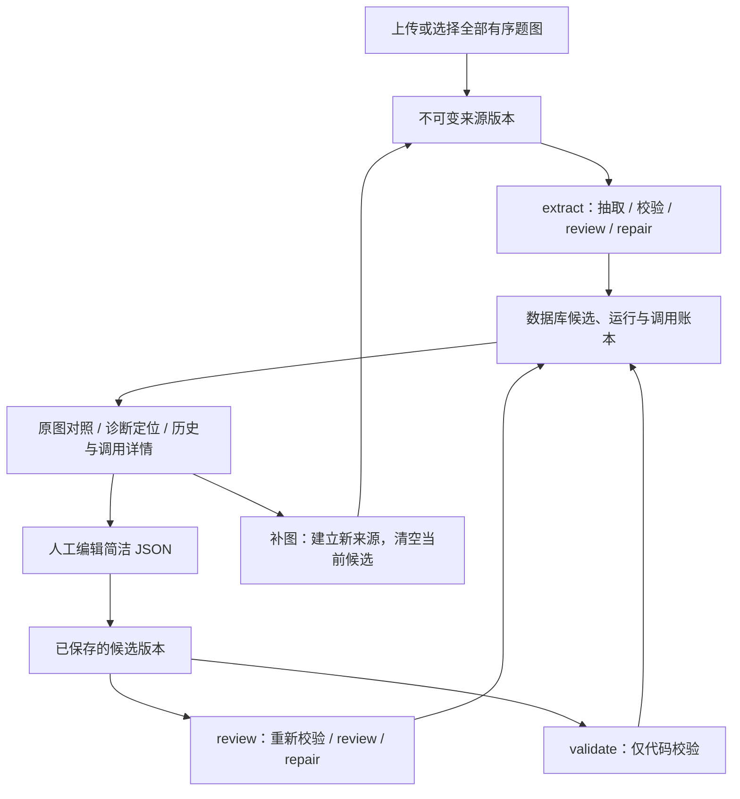

# 阶段一：题意候选入库、查询、补图与修订

2026-09-17。实现已完成，使用独立 PostgreSQL 和录制模型响应验收。初次验收未迁移日常实例；随后按用户要求跳过备份，将本机 `local` 实例升级到 `0003_problem_understanding` 并重启整套应用，详见[本地升级记录](validation/math-notation-product-stage-one-20260917/local-upgrade.md)。远程生产环境未部署，以上过程付费模型调用为 0。

验收结果见[产品流程报告](validation/math-notation-product-stage-one-20260917/README.md)和[七题候选及调用记录](validation/math-notation-product-stage-one-20260917/outputs.html)。

## 产品入口与边界

主工作台提供“仅提取题意”入口，以及既有题目的“提取题意 · 查看候选、补图与修订”链接。新页面位于 `/understanding`、`/understanding/{problem_id}`。旧完整生成入口继续使用正式题意和页面版本。

新工作流为 `problem_understanding/v1`，只有来源准备和题意处理两个阶段。始终 `candidate_only=true`、`solver_ready=false`，不调用独立 OCR、Planner、Solver、讲解或页面生成。不恢复 `at`，数学记法及验收政策保持不变；按用户确认，在候选顶层增加供人阅读的 `original_text`。

“保存修订”执行 JSON/Schema 检查与数学编译；结构合法但数学解析失败的候选仍保存。“复核当前版本”才发起模型调用。补图保存后点击“重新提取整题”，使用当前来源版本的全部图片。历史候选显示其自身对应原图，历史运行的复核结论不冒充当前版本。

## 工作台列表展示

题目列表和题目详情增加只读 `presentation` 投影，统一提供摘要、原图引用、当前阶段、处理状态、原因及未读结果标识。列表不再只根据旧正式题意和页面构建状态判断新题意流程是否完成；查询批量读取当前来源、候选和运行，不逐题读取完整调用产物。

- 新题意只从当前候选的 `original_text` 截取题干开头作为列表文字，不从 definitions/facts 或 IR 生成摘要。详情分别展示完整原题文字和数学候选。
- 已有正式题意可显示原题文字；尚无可展示内容时显示原图缩略图和“待提取题目”，文件名仅为附件属性。
- 历史候选若没有 `original_text`，显示原图和“原题文字待提取”；不反向生成题干、不改写旧候选，也不自动追加付费调用。用户重新提取或复核时可补充转录。
- 抽取与原图复核通过，显示“题意已提取”；同时 unmatched，显示“题意已提取 · 暂不支持题型”。这里的完成不表示 Solver 就绪。
- 缺图优先显示“待确认题目 · 缺少配图”；其他原图不确定显示“待确认题目”。不能被 unmatched 或任务完成状态覆盖。
- 人工修订显示“题意已保存 · 待复核”；配置变化使复核失效时提示重新复核；数学解析失败、代码能力缺口、技术调用失败分别显示。
- 详情页明确区分“处理结束”和“原图复核通过”。缺图、待确认、代码能力缺口、仅代码校验等正常结束都保留各自提示，不把底层任务的 `succeeded` 当作题意已确认或解析页已生成。
- 旧流程成功生成页面显示“解析已生成”，与题意保存完成区分。最新来源或候选不能沿用旧版本已复核状态。
- 提取结束同步题目更新时间及事件；列表保留定时刷新，并在页面重新可见时立即刷新。新题意结果也有独立未读标识。

中间栏暂不新增两套流程的判断与展示。等生产统一到新路径后，按“接收题图 → 提取及复核 → 求解准入 → 求解 → 讲解与页面”展示整体进度，每一步给出完成、执行中、等待或阻断原因及可执行操作。当前题意通过但题型不支持时，应停在求解准入并说明原因；缺图则停在题意确认并提供补图操作。

## 原题文字与 OCR

旧完整生成流程仍包含 `observation`（OCR 与观察），其正式题意节点的 `source_text` 汇集为原题文字，并投影到后续讲解与页面使用的 `original_text`。新流程跳过 `observation`，直接给视觉模型完整题图，不输入旧 OCR 文本；共享安装中的 OCR 能力仍供旧入口使用，没有删除。

新抽取在同一次模型返回中输出顶层 `original_text` 和 `root`：前者忠实转录原图中的中文、公式、题号、分问和参数说明，后者保持数学字符串契约。原文不是摘要，不从 IR 反向改写；允许等义公式排版，忽略手写解答与批注，模糊位置标注无法辨认并保留不确定性。抽取模板的六个独立示例同步展示两份数据。

该字段随完整候选 JSON 存入现有 `problem_candidates.candidate_json`，与来源版本、候选哈希和原始响应绑定，原样保存在规范化产物中。无需新增数据库表或迁移；不进入数学编译，也不能因数学等价比较通过就认定转录正确。Schema 允许历史候选缺省该字段，新抽取提示词要求填写。

原图 review 同时核对转录和数学候选，转录不作为原图的替代证据。`wrong_transcription` 仅授权修订 `/original_text`；字段缺失时复核指向顶层空 JSON Pointer，服务端仍只授予这个字段的修改权。没有授权时须原样保留，不因代数等价放行改写。转录修订使候选哈希及旧复核失效，修订后重新复核。数学条件的修改仍需自己的诊断与授权。

空路径仅供缺失原文的 `wrong_transcription` 使用，其他复核诊断使用空路径时直接停止为 `review.invalid_response`。授权生成不把不存在的 review 路径回退到父节点；最终 guard 也拒绝整份候选的修订授权。见[修复及门禁记录](validation/math-notation-product-stage-one-20260917/repair-authority.md)。

## 数据与权限

迁移为 `0003_problem_understanding`，新增四表：

| 表 | 内容与约束 |
|---|---|
| `problem_source_versions` | 父版本、完整有序图片清单、单图哈希和整组哈希；内容不可覆盖 |
| `problem_candidates` | 完整候选、来源/父候选、内容哈希、模型或人工来源、首次校验与响应引用；内容不可覆盖 |
| `extraction_runs` | 任务、模式、基准候选、来源、代次、冻结配置、结果和采用候选；同题只允许一个活动运行 |
| `extraction_call_reservations` | 调用序号、阶段、请求哈希、基准修订、预留/完成状态、响应与用量引用；每个序号唯一 |

`problems` 的 `current_source_version_id`、`current_candidate_id`、`latest_extraction_run_id`、`understanding_generation` 独立于旧正式题意和页面指针。通过带工作空间和题目身份的外键防止串题；写操作使用所有者检查、基准版本校验和幂等请求。不可变触发器、应用账号列权限、启动迁移检查同步更新。

原始请求响应、编译结果、校验、实际修改和采用决定复用 artifacts；逐次调用复用 model_calls；最终诊断复用 diagnostics 和事件流。人工修订的编译材料也保存为关联产物。非法 JSON/Schema 返回只保存原始材料与诊断；越界 repair、未采用候选以及有完整合法 JSON 但结束标记异常的返回均保留历史。

候选历史写入与采用都在事务中校验当前运行、来源、代次和执行租约。已作废运行的迟到返回只保留调用及原始响应审计，不新增候选历史；有效运行中的越界 repair 仍保留未采用候选。

人工修订和幂等回执共用 `Application.request()` 的数据库事务，不存在候选先提交而回执稍后提交的窗口。候选 ID 由操作、工作空间、用户、题目和幂等键稳定派生，使文件已落盘、数据库事务回滚后的同请求重试复用产物路径；同键不同请求仍返回 409。

## 预算与恢复

CLI 继续使用文件存储；产品使用 `DatabaseWorkflowStorage` 和数据库账本，两者共用 `run_workflow()`，不复制抽取与 repair 规则。

- 默认 DeepSeek Flash，thinking enabled / low，Files API；每次 300 秒、16,384 输出 token。
- 每题内容最多 3、review 最多 3、总语义最多 6、网络尝试最多 12，每次最多 2 次；产品同时运行最多 3 题。
- 容量预留的 PostgreSQL advisory lock 和活动数检查只用于 `problem_understanding`。旧 `problem_lesson` 领取不获取该锁，不占用这三个名额。
- 请求在短事务内原子预留，网络调用期间不持有数据库事务。调用审计不重复扣预算。
- 响应先写不可变回执，带请求、基准版本和响应内容哈希，再登记数据库完成；登记间中断可验证回执并恢复。仅预留而没有回执时停止为 `workflow.outcome_unknown`，不重发。
- 已完成调用可重放到处理阶段；已提交阶段但尚未提交任务结束状态时，从 checkpoint 完成收尾。重复投递不会重新调用。
- 补图、人工编辑、新运行均提升题目代次并使旧运行失效；取消旧任务。迟到响应仍可审计，不能采用到新版本。
- 缺图、复核 uncertain、代码能力缺口、无进展和预算耗尽是已处理的终止结果；调用失败、非法复核响应和内部错误独立标记技术失败。任务结束不表示题意通过验收。
- 复核有效性检查当前候选、完整来源版本和冻结的代码/模板/注册表/供应商配置。任一相关绑定变化，当前复核失效。
- 详情接口通过 `review_stale_reason` 区分 `configuration_changed`、`candidate_or_source_changed` 和 `run_not_completed`；有效或尚未复核时为 null。配置指提取/复核所冻结的文件、注册表、供应商和预算，不包含无关的前端或产品部署版本。详情页明确提示配置变化后的复核失效及重新复核操作，不自动追加模型调用。

同题写入的数据库锁顺序从题目开始，避免补图/取消与调用登记、采用候选互相等待；抽取任务领取在此之前先获取该流程的容量锁。不可变候选本身不因重新校验而改写，新的结果放在新的运行记录中。

Files API 与历史 base64 批次采用不同图片传输方式；比较性能时应记录并控制该差异，不能直接归因于产品接入或提示词。此次审查修复未更改传输方式、预算或模型契约，验证见[审查修复报告](validation/math-notation-product-stage-one-20260917/review-fixes.md)。

## 接口

前缀均为 `/api/product/v1`。新增修改操作使用 `Idempotency-Key`；候选与来源修改携带基准版本，冲突返回 409。

| 方法与路径 | 用途 |
|---|---|
| `GET /problems/{id}/understanding` | 当前来源、候选、独立状态和最新运行 |
| `POST /problems/{id}/source-images` | 补图到原题 |
| `GET /problems/{id}/source-images/{source_id}` | 读取有权访问的关联题图 |
| `POST /problems/{id}/source-versions` | 按有序图片列表建立来源版本 |
| `GET /problems/{id}/candidates` | 分页候选历史 |
| `GET /problems/{id}/candidates/{candidate_id}` | 候选、原图版本、父候选与诊断 |
| `GET /problems/{id}/candidates/{candidate_id}/artifacts/{artifact_id}` | 读取该候选关联编译材料 |
| `POST /problems/{id}/candidates` | 保存人工修订并代码校验 |
| `POST /problems/{id}/extraction-runs` | extract/review/validate，返回 202 |
| `GET /problems/{id}/extraction-runs` | 分页处理历史，包含无候选的失败运行 |
| `GET /extraction-runs/{run_id}` | 诊断、调用、用量、产物与配置 |

取消、模型调用产物下载及事件推送继续复用既有任务接口。客户端把未确认写请求的键和请求体保存在浏览器，恢复使用同一请求；网络故障不会静默新建任务。

## 后续接入

其他实例部署时需要按现有产品管理流程应用新迁移，再一起更新 API、worker 和前端。本机 `local` 实例现已完成迁移和重启，没有启动新的付费批次。阶段二仍是新题意到运行时的绑定、求解准入和简洁 Planner 输入；不能仅根据 confirmed 或 matched 放行到 Solver。
