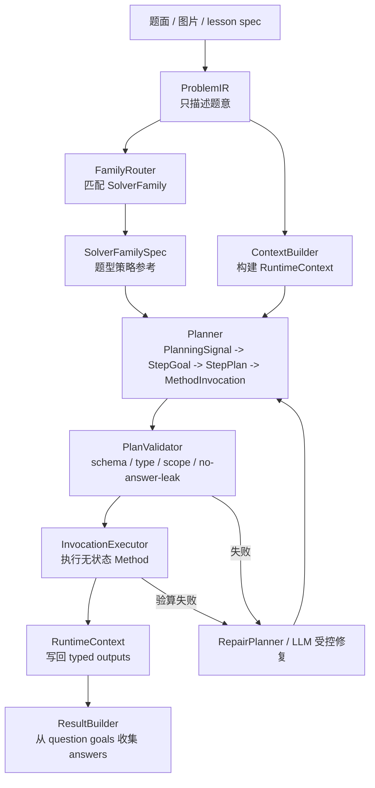

# Method Solver 数学解题引擎架构设计

## 1. 核心目标

Method Solver 的目标不是让 LLM 现场自由解题，而是把题库中反复出现的解题方法沉淀成可执行、可验算、可生成推导日志的资产。

核心分工：

```text
ProblemIR      负责表达题意
SolverFamily   负责表达题型策略参考
Planner        负责把目标拆成 StepPlan 和 MethodInvocation
Method         负责无状态数学动作
SymPy          负责计算和验算
Trace          负责沉淀可讲解推导骨架
```

最终形态不是“每道题一个 Solver”，而是：

```text
少量 SolverFamily + 大量 Stateless Method + 可回归的题库案例
```

## 2. 总体链路




在线和离线走同一条链路，只是策略不同：

- 在线：优先使用高置信 SolverFamily；失败时进入 Method-Guided LLM 或 Free LLM + Verifier。
- 离线：批量跑题库，统计 miss case，聚类出新 method / 新 family，回灌测试。

### 2.1 当前南开 25 代码调用过程

当前 canonical 南开 25 是第一阶段完整跑通的黄金用例。默认 CLI 和 `solve_problem()` 都走 deterministic planner，不调用真实 LLM。

```text
python -m shuxueshuo_server.solver.solve_problem --fixture ../internal/solver-fixtures/tj-2026-nankai-yimo-25.json
  -> solve_problem.main()
  -> load_problem_ir(fixture)
  -> engine.solve_problem(problem_ir)
  -> RuntimeOrchestrator.solve(problem_ir)
```

`RuntimeOrchestrator.solve()` 内部顺序：

```text
1. FamilyRegistry.match(problem)
   -> 命中 QUADRATIC_PATH_MINIMUM_FAMILY
   -> family_id = QuadraticPathMinimumSolver

2. ContextBuilder.build(problem)
   -> 建立 problem / question / subquestion scope
   -> 写入 symbols、constraints、quadratic expression、coefficient relation
   -> 从 data.path_problem 写入 $problem.conditions.path_minimum
   -> 写入题设点 D/M/N/F；显式坐标为 Point，定义型点为 PointRef
   -> 不从 fixture 注入 D_prime

3. MethodSpecRegistry.load_from_code()
   -> 从 runtime/methods/*.py 的 SPEC 加载 MethodSpec

4. extract_question_goals(problem)
   -> 读取题面最终作答目标 QuestionGoal

5. ContextInventoryBuilder.build(context, specs)
   -> 枚举可见 ContextPath、relation graph、constraints、planning signals、method candidates

6. PlannerInputs(...)
   -> problem_id + family_spec + question_goals + context_inventory + method_specs

7. Nankai25DeterministicPlannerAdapter.plan(inputs)
   -> 委托 QuadraticPathMinimumPlannerV15.plan(context)
   -> planner 创建 G 与 D_prime 过程占位
   -> 当前直接写入可写 PointRef；后续应迁移为显式 ContextDeclaration
   -> 返回 StepPlan[]

8. InvocationExecutor.execute_plan(context, plans)
   -> PlanValidator 校验每个 MethodInvocation
   -> 解析 ContextPath typed inputs
   -> 调用 Stateless Method
   -> method output 写 step temp
   -> StepPlan.promote_outputs 写回 question/subquestion/problem scope
   -> 聚合 checks 与 trace fragments

9. ResultBuilder.build(context, execution, question_goals)
    -> 从 goal.target_path 读取最终答案
    -> 序列化为 SolverResult.answers

10. RuntimeOrchestrator 组装 SolverResult
    -> status / solver_family / methods_used / trace / answers / checks / errors
```

南开 25 当前 method invocation 顺序：

```text
quadratic_axis_from_relation
quadratic_from_known_coefficients
right_angle_equal_length_candidates
select_point_by_quadrant_constraint
parameter_from_segment_length
quadratic_coefficients_from_curve_points
midpoint_point
two_moving_points_path_reduction
broken_path_straightening_candidates
select_straightening_candidate
distance_between_points
parameter_from_minimum_value
quadratic_coefficients_from_curve_points
line_intersection_point
```

### 2.2 数学计算分层

当前数学能力不是只有 SymPy 或 `math_kernel` 一层，而是三层：

```text
Layer 1: SympyKernel
  -> 原子数学能力：解方程、化简、等价判断、代回、距离、交点等。

Layer 2: math_ops.py
  -> 组合数学动作：把多个原子操作组合成初中代数/几何常见步骤。

Layer 3: Stateless Method
  -> 从 typed inputs 调用 math_ops / kernel，返回 typed outputs、checks、trace。
```

`math_ops.py` 的定位很重要：它在 kernel 之上、method 之下，承载纯数学、可复用、
无上下文副作用的组合操作。它不读取 fixture、不知道题号、不写 RuntimeContext。

典型能力包括：

- 二次函数操作：`substitute_known_coefficients`、`solve_missing_coefficients`、`axis_x_from_relation`、`vertex_of_quadratic`。
- 几何构造：`rotated_equal_length_candidates`、`reflect_point_across_line`、`parametric_point_on_line`。
- 候选筛选与约束判断：`pick_by_lower_bound`、`satisfies_lower_bound`、`simplify_abs_by_constraints`。
- 规划辅助计算：`point_complexity_score` 用于候选复杂度评分，帮助选择更容易计算的拉直方案。

这层的边界是：`math_ops.py` 可以表达数学套路，但不决定某道题该按什么顺序调用这些套路；
调用顺序仍属于 Planner / MethodInvocation，验算和写回仍属于 Method / Executor。

## 3. 角色边界

### 3.1 ProblemIR

`ProblemIR` 只表达题意，不表达解法。

应该包含：

- 原题文字和题号。
- 函数、点、线、关系、条件。
- 分问和小问结构。
- 目标，如求解析式、求参数、求最值、求点坐标。
- 约束，如 `m > 2`、点在第四象限。

不应该包含：

- 标准答案。
- method chain。
- SolverFamily 的固定步骤。
- 非题设的辅助点构造，除非原题明确给出。
- method 临时变量。

### 3.2 RuntimeContext

`RuntimeContext` 是求解运行时的层级黑板，不等同于 fixture。

它负责保存 typed facts、constraints、temp values 和 outputs。这里的
“黑板”不是自由写入的全局字典，而是带 scope、类型、可见性和锁定规则的运行时状态。

作用域结构：

```text
problem
  question
    subquestion
      step
```

读写规则：

- 下层可以读取父层事实。
- 当前 step 可以读取自身、父 subquestion、父 question、problem。
- sibling question / subquestion 不能互相读取。
- question 不能读取子 step 的临时值。
- step 临时值默认不泄露。
- MethodInvocation 输出只能写当前 step 的 `temp` 或 `outputs`。
- 只有 `StepPlan.promote_outputs` 声明的结果才能写回上层。
- locked fact 不能覆盖。

#### 3.2.1 ContextPath

ContextPath 是 method 输入输出的唯一绑定方式。

示例：

```text
$problem.points.D
$question.ii.points.M
$question.ii.constraints.N_quadrant
$subquestion.ii_1.outputs.m
$step.derive_N.temp.candidates
```

禁止 invocation 传入裸值。这样可以保证：

- Planner 不能偷偷塞答案。
- Validator 能检查 scope 可见性和类型。
- Trace 可以回溯每个结果来源。

### 3.3 Method

Method 是无状态解题动作。

```text
typed inputs -> typed outputs + checks + trace fragments
```

Method 不读取 fixture，不知道题号，不决定输出写入哪里，也不直接收集最终答案。

例如 `right_angle_equal_length_candidates` 只负责由已知直角边生成候选点；`select_point_by_quadrant_constraint` 只负责用象限和参数约束筛选候选点。它们都不应该知道“南开 25”。

### 3.4 MethodSpec

MethodSpec 是 Method 的能力说明书，代码里的 `SPEC` 是唯一事实源，JSON 只是派生资产，用于 review、检索和离线索引。

MethodSpec 描述：

- `method_id`
- solves 哪类 goal
- 输入槽位、类型、角色
- 输出槽位、类型
- 前置条件
- 后置验算
- trace 模板

### 3.5 MethodInvocation

MethodInvocation 是某个 method 在某道题、某个 step 里的具体调用。

它只绑定 ContextPath：

```json
{
  "method_id": "right_angle_equal_length_candidates",
  "scope": "derive_N",
  "inputs": {
    "anchor": "$problem.points.D",
    "reference": "$question.ii.points.M",
    "target": "$question.ii.points.N"
  },
  "outputs": {
    "candidates": "$step.derive_N.temp.candidates"
  }
}
```

禁止在 invocation 中直接写裸坐标、裸参数值或最终答案。

### 3.6 StepPlan

StepPlan 是一个可执行解题步骤，可以包含一个或多个 MethodInvocation。

```json
{
  "step_id": "derive_N",
  "goal": {
    "type": "derive_point_coordinate",
    "target_path": "$question.ii.points.N"
  },
  "scope": "ii",
  "invocations": [],
  "promote_outputs": {
    "$step.derive_N.temp.selected_point": "$question.ii.points.N"
  }
}
```

一个学生解题步骤常常不是一个 method，例如“确定 N 点”可以拆成：

```text
1. 由直角等腰关系生成两个候选点
2. 由第四象限和 m>2 筛选唯一点
```

### 3.7 SolverFamily

SolverFamily 不是单题固定步骤，也不应该直接执行 method。

它的目标角色是“题型策略参考”，即向 Planner 提供这类题的宏观知识：

- 支持哪些 pattern / problem_type。
- 这类题通常有哪些 goal。
- 这类题的解题策略原则。
- 哪些关系结构经常有用。
- 哪些 method 能力值得优先考虑。
- 最终结果如何从 ProblemIR 的 question goals 收集。
- family 级别的校验规则是什么。

也就是说，SolverFamily 应该是 Planner 的输入，而不是 Planner 的替代品。

## 4. SolverFamilySpec

建议把 SolverFamily 的可配置部分显式建模为 `SolverFamilySpec`。

示意结构：

```json
{
  "family_id": "quadratic_path_minimum",
  "match": {
    "patterns": ["path-minimum"],
    "problem_types": ["quadratic_path_minimum"],
    "required_objects": ["quadratic_function", "moving_path"]
  },
  "common_goal_types": [
    "derive_parabola",
    "derive_constructed_point",
    "derive_parameter",
    "reduce_path_expression",
    "straighten_broken_path",
    "derive_minimum_value",
    "derive_extremal_point"
  ],
  "strategy_principles": [
    "先解析题设中的函数、点、关系和参数约束",
    "若构造点坐标未知，先由几何关系生成候选，再用题设约束筛选",
    "能先确定未知参数时，优先先求参数再代入后续表达式",
    "路径最值先做路径转化，再做折线拉直或等价最短路径处理",
    "最短路径对应点通常来自约束轨迹与拉直线段的交点"
  ],
  "relation_patterns": [
    "coefficient_relation_on_quadratic",
    "point_on_parabola",
    "right_angle_equal_length",
    "moving_points_with_segment_binding",
    "point_on_segment_or_line_path"
  ],
  "method_capability_hints": [
    "quadratic_coefficient_solving",
    "right_angle_or_rotation_point_construction",
    "parameter_solving",
    "path_reduction",
    "broken_path_straightening",
    "line_intersection"
  ],
  "result_collection_policy": "collect answers from ProblemIR question goals and their resolved target paths"
}
```

`SolverFamilySpec` 不保存某一道题的答案，不保存南开题专属坐标，也不写死第几问输出什么对象。最终答案应由 `ProblemIR.data.questions[].goals` 决定，ResultBuilder 只按照这些 goals 对应的 resolved target paths 收集结果。

### 4.1 ProblemIR QuestionGoal 定义

`ProblemIR.data.questions[].goals` 表达的是“题目要求学生最终作答什么”，不是“求解过程中需要临时求什么”。

因此 QuestionGoal 的边界是：

- 只对应原题 `asks` 中的最终问题，例如“求抛物线解析式”“求最小值”“求点 G 坐标”。
- 不包含中间推导量，例如为了求解析式先解出的参数 `m`、候选点、辅助点、最小值表达式模板等。
- 如果某个中间量需要传给后续 method，应由 `StepPlan.promote_outputs` 写入对应 scope 的 `outputs`、`points` 或 `temp`，而不是写成 question goal。
- ResultBuilder 只收集 QuestionGoal；它不负责判断哪些中间量应该展示。

这条边界很重要：后续 LLM 抽取 ProblemIR 时，只需要理解“题目问了什么”，不需要猜测解题过程会产生哪些中间变量。中间变量的发现和组织属于 Planner / MethodInvocation / RuntimeContext 的职责。

示例：南开 25 第（Ⅱ）①问题面要求“抛物线解析式及 `EG+FG` 的最小值”，所以 goals 是 `parabola` 和 `min_value`；虽然求解中会先得到 `m=3`，但 `m` 只是中间参数，不进入 `SolverResult.answers`。

### 4.2 QuestionGoal / PlanningSignal / StepGoal 边界

三类对象的边界固定如下：


| 类型               | 来源                                                                  | 用途                      | 示例                                        |
| ---------------- | ------------------------------------------------------------------- | ----------------------- | ----------------------------------------- |
| `QuestionGoal`   | `ProblemIR.data.questions[].goals`                                  | ResultBuilder 收集最终答案    | 第（Ⅱ）①输出 `parabola`、`min_value`            |
| `PlanningSignal` | `ContextInventoryBuilder` 用代码规则从 RuntimeContext / relation graph 生成 | 提醒 Planner 关注未解析点、关系、约束 | `$question.ii.points.N` 是未知点且参与直角等长关系     |
| `StepGoal`       | Planner 生成 StepPlan 时创建                                             | 描述某一步要推进的中间目标           | 为了后续推导，当前 step 先求 `$question.ii.points.N` |


`PlanningSignal` 不是 goal，不表示“必须先求什么”，也不生成 method invocation。它是
确定性上下文索引，不调用 LLM、不携带答案、不写 RuntimeContext。真正的中间解题目标
只能由 Planner 生成，并保存在 `StepPlan.goal` 的 `StepGoal` 中。

### 4.3 PointRef 与延迟解析

`PointRef` 是 RuntimeContext 中的“未落坐标点引用”。它让系统可以先保存一个点的
结构化定义，再在合适的时机由 RuntimeContext 或 method 求出坐标。

典型来源：

- 题设声明但没有显式坐标的点，例如 `D` 是对称轴与 x 轴交点。
- 由几何关系定义的派生点，例如 `N` 满足直角等腰关系。
- Planner 运行期声明的目标点或辅助点，例如 `G`、`D_prime`。

`ContextBuilder` 会把显式坐标写成 `Point`，把定义型点写成 `PointRef`。当
`RuntimeContext.read_path(..., expected_type="Point")` 读到 `PointRef` 时，只会解析
安全、确定、无需选择的定义，例如 `axis_x_intercept`、`y_axis_intercept`、`vertex`、
`midpoint`、`square_opposite_point`。

需要选择或策略判断的关系不会在 RuntimeContext 中隐式完成。例如未知点 `N` 参与
`right_angle_equal_length` 题面关系时，可能产生两个候选点，必须由 method 生成候选，
再由题设约束筛选；`line_intersection`、`straightening_auxiliary_point` 也需要对应
method 计算和验算。这个边界能保证 RuntimeContext 是受控黑板，不是隐藏的 solver。

### 4.4 Planner 占位声明

南开 25 当前 deterministic planner 会在生成 StepPlan 前预创建两个占位：

- `_ensure_result_point(context, "ii", "G")`：声明后续会由 `line_intersection_point` 求出交点 `G`。
- `_ensure_straightening_auxiliary_point(context, "ii", "D_prime")`：声明后续会由折线拉直候选选择求出辅助点。

这是 planner 才知道的运行期策略，不应该回写到 fixture。占位 `PointRef` 只包含
`path`、`definition intent` 和 `source="planner"`，不包含坐标、不包含最终答案、不包含
候选选择。后续仍由 stateless method 输出 `Point`，再通过 `promote_outputs` 覆盖这个未锁定占位。

通用 Planner 里建议把这个行为从“planner 直接改 context”升级为显式阶段：

```text
PlannerInputs
  -> Planner.plan()
  -> ContextDeclaration[] + StepPlan[]
  -> PlanValidator.validate_declarations()
  -> apply declarations
  -> PlanValidator.validate_steps()
  -> InvocationExecutor
```

`ContextDeclaration` 可以声明“需要一个辅助点/目标点占位”，但不得携带坐标或裸答案。
LLM planner 后续可以参与判断是否需要声明辅助点，但声明必须经过 validator，并且真正
计算仍只能通过 MethodInvocation 完成。

## 5. Planner

Planner 的职责是把：

```text
FamilySpec + QuestionGoal + PlanningSignal + ContextInventory + MethodSpecRegistry
```

变成：

```text
StepPlan[] + MethodInvocation[]
```

长期目标是一个通用 Planner，而不是每个 SolverFamily 一个固定 planner。FamilySpec 只是给通用 Planner 的上下文和约束，不能指定 planner，也不能替代 planner。

Planner 建议拆成以下组件：


| 组件                        | 职责                                             | 是否需要 LLM        |
| ------------------------- | ---------------------------------------------- | --------------- |
| `ContextInventoryBuilder` | 用代码规则生成 visible paths、relations、PlanningSignal | 否               |
| `StrategyPlanner`         | 将 QuestionGoal/PlanningSignal 组织成可执行解题步骤       | LLM 参与，规则做约束    |
| `MethodRetriever`         | 根据 step goal 检索可用 MethodSpec                   | 规则 + 向量         |
| `InvocationResolver`      | 把 ContextPath 映射到 method 输入槽位                  | LLM 参与，候选枚举降低幻觉 |
| `PlanValidator`           | 校验 scope、类型、写入权限、无裸答案                          | 纯代码             |
| `RepairPlanner`           | 根据 validator / verifier 错误修复计划                 | LLM 适合参与        |


这里最难的不是计算，而是“确定解题步骤”和“确定每一步 method 与变量的调用关系”。这两件事很难完全靠结构化规则覆盖各种题面变化，因此需要 LLM 参与；规则、FamilySpec、MethodSpec、ContextPath 枚举和 Validator 的价值，是把 LLM 限制在规划空间内，减少幻觉，而不是完全替代 LLM。

接入真实 LLM 之前，可以保留南开 25 的特定 planner 作为 deterministic slice。它的作用是让端到端流程、runtime、method、checks 和 trace 先跑通；它不是最终规划抽象。

### 5.1 Orchestrator 与 LLM Planner Loop 边界

`RuntimeOrchestrator` 管外层求解生命周期，`Planner` 管 LLM 规划与修复循环。

Orchestrator 的职责是：

- 匹配 FamilySpec。
- 构建 `RuntimeContext`、`ContextInventory`、`PlannerInputs`。
- 调用 `planner.plan()` 或 `planner.repair()`。
- 运行 `PlanValidator` / `InvocationExecutor`。
- 管理全局预算、最大尝试次数、失败状态和最终 `SolverResult`。

Planner 的职责是：

- 结合 QuestionGoal 与 PlanningSignal，拆解出可执行 StepGoal。
- 检索 / 排序 MethodSpec。
- 选择 ContextPath 并生成 MethodInvocation。
- 根据 validator、executor、verifier 的结构化错误修复 plan。
- 维护 LLM 规划过程中的候选、失败历史和 scratchpad。

也就是说，LLM 多轮调用循环应主要放在 Planner 内部；Orchestrator 只负责决定“是否需要再请求 Planner 修复一次”和“什么时候终止”。如果 Orchestrator 开始理解 step decomposition、method 选择或参数映射，它就会变成第二个 Planner。

记忆也应分层：


| 记忆层                                   | 归属                      | 内容                                                                  | 是否参与确定性执行                     |
| ------------------------------------- | ----------------------- | ------------------------------------------------------------------- | ----------------------------- |
| `RuntimeContext`                      | Orchestrator / Executor | typed facts、constraints、outputs、temp、checks                         | 是                             |
| `PlannerMemory` / `PlannerScratchpad` | Planner                 | LLM 候选步骤、method 候选、失败的 ContextPath 映射、repair history                | 否，必须经 plan 输出和 validator 才能生效 |
| `SolveSession` / `RunMemory`          | Orchestrator            | attempt 记录、planner 输入输出摘要、validation/execution errors、耗时、token、最终状态 | 否，用于调试、回放和离线学习                |


推荐的未来控制流：

```text
orchestrator.solve(problem)
  -> build context / inventory / planner_inputs
  -> planner.plan(inputs)
  -> validator + executor
  -> if validation / execution failed:
       planner.repair(inputs, previous_plan, structured_errors, planner_memory)
       retry under orchestrator budget
  -> ResultBuilder
```

这能保持边界稳定：Planner 可以逐步变聪明，Orchestrator 仍然保持简单、可测试、可替换。

### 5.2 当前 Planner 判断

当前 `QuadraticPathMinimumPlannerV15` 的合理性在于：它已经用正确的 runtime 骨架跑通了南开 25。

```text
StepPlan
  -> MethodInvocation
  -> ContextPath
  -> PlanValidator
  -> Stateless Method
  -> Trace / Checks
```

这说明 V1.5 的执行模型是可行的。

但它不是真正的 planner，更准确地说是：

```text
Nankai25DeterministicPlanTemplate
```

它目前仍然写死：

- step 顺序。
- 点名和 scope，如 `D/M/N/F/G`、`i/ii/ii_1/ii_2`。
- ContextPath 参数绑定。
- 最终答案收集已移到 `QuestionGoal` 与 `ResultBuilder`。

因此它只能作为接入 LLM 前的测试切片。后续不能沿着“继续堆规则模板”的方向扩展，否则每道 25 题都会长出自己的 planner。

### 5.3 PlannerInputs 与 ContextInventory

接入通用 Planner 前，应先把 planner 的输入收束成一个明确对象。

建议：

```text
PlannerInputs
  problem_id
  family_spec
  question_goals
  context_inventory
  method_specs
  previous_errors?
```

其中 `ContextInventory` 是从 `RuntimeContext` 生成的可规划上下文摘要，提供给规则和 LLM 使用：

```text
ContextInventory
  visible_paths:
    - path
    - type
    - scope
    - locked
    - short_description
  relation_graph:
    - relation_type
    - participants
    - roles
    - source_path
  constraints:
    - path
    - expression / semantic constraint
  planning_signals:
    - signal_type
    - path
    - scope_id
    - participants
    - roles
    - reason
  candidate_methods:
    - method_id
    - solves
    - required_inputs
    - outputs
```

`relation_graph` 只搬运 `ProblemIR.data.relations` 中的题面关系，例如点在线段上、
线段关系、路径最值条件和 `right_angle_equal_length`。点的 `definition="unknown"`
只说明坐标未定，不承载几何关系。

`planning_signals` 则由代码规则从 `RuntimeContext`、`relation_graph` 和 constraints
中生成，例如 unresolved point、orientation constraint、未知点参与直角等长关系等。
它不是 goal，也不是解法步骤。

`ContextInventory` 的价值是把 LLM 的工作限制为“在已有 ContextPath 和 MethodSpec 中选择、组合、修复”，而不是让 LLM 从自然语言里自由编造变量和答案。

### 5.4 StrategyPlanner

StrategyPlanner 根据 QuestionGoal、PlanningSignal 和 FamilySpec 的策略原则生成抽象步骤。
这里允许并且预期 LLM 参与，因为同一类题的步骤顺序会被题目条件、已知量、目标问法、
辅助构造方式影响。

例如 `quadratic_path_minimum` 的 FamilySpec 只声明策略原则：

```text
先解析函数和参数约束
构造点未知时先生成候选再筛选
能先求参数时优先先求参数
路径最值先做路径转化再做折线拉直
```

具体题目中是否需要某一步、步骤先后顺序是什么，由 Planner 结合 context、
QuestionGoal 和 PlanningSignal 决定。规则可以提供候选依赖，但复杂情形下的
step decomposition 应由 LLM 受控生成。

### 5.5 MethodRetriever

MethodRetriever 根据 step goal 和可见事实检索 MethodSpec。

排序信号：

- `solves` 是否匹配 step goal。
- required inputs 是否能从当前 scope 找到。
- outputs 是否能推进 expected output。
- method capability 是否符合 FamilySpec 的 hints。
- 历史回归中该 method 是否稳定。

### 5.6 InvocationResolver

InvocationResolver 负责参数映射。

以直角等腰求点为例：

1. 从 goal target 得到 unknown endpoint：`$question.ii.points.N`。
2. 在 relation graph 中找到包含 N 的 right-angle-equal-length relation。
3. 根据 relation roles 找到 anchor 和 reference。
4. 枚举可见 ContextPath。
5. 检查类型和 scope。
6. 生成候选 invocation。
7. 将候选 ContextPath、MethodSpec、局部题意和 FamilySpec 提供给 LLM 做受控选择或组合。

LLM 只允许选择或组合 ContextPath 与 method invocation，不允许直接写坐标、参数值或最终答案。

### 5.7 LLM Planner 边界

允许 LLM：

- 在多个 strategy candidate 中选择。
- 在多个 method candidate 中选择。
- 在多个 ContextPath candidate 中消歧义。
- 根据 validator/verifier 错误修复 plan。
- 解释选择原因，作为 debug trace。

不允许 LLM：

- 直接给最终答案。
- 编造不存在的 ContextPath。
- 绕过 MethodSpec。
- 向 invocation 写裸数值。
- 修改 locked fact。

所有 LLM 输出必须通过 PlanValidator 后才能执行。

## 6. 执行与验算

执行器只做确定性动作：

```text
StepPlan
  -> validate_step
  -> resolve ContextPath inputs
  -> method.run(inputs, kernel)
  -> write step temp outputs
  -> promote declared outputs
  -> collect checks and trace fragments
```

关键约束：

- Method 输出先写入 step scope。
- 上层写回必须通过 `promote_outputs`。
- 覆盖题设 locked fact 必须失败。
- 输入类型必须匹配 MethodSpec。
- Invocation 不能携带裸数值作为答案捷径。

## 7. Search / Rank / Fallback

Search & Rank 分三层：

1. Family ranking：根据 ProblemIR 的 pattern、对象结构、目标类型和历史案例匹配 SolverFamily。
2. Method ranking：根据 step goal、required inputs、produces、历史成功率检索 MethodSpec。
3. Invocation ranking：在多个 ContextPath 候选中选择最合理的输入映射。

Fallback 不是完全自由解题，而是分层降级：

```text
Deterministic V1.5 slice
  -> Method-Guided LLM Planner
  -> Free LLM + Verifier
  -> Low Confidence Review
```

所有 miss case 都应进入离线队列，用于新增 method、补 FamilySpec 或添加测试。

## 8. 当前代码与目标架构的差距

当前代码已经完成：

- `ProblemIR` 与 `SolverResult` 拆分。
- 多层 `RuntimeContext`。
- `ContextPath`。
- `StepPlan` / `MethodInvocation`。
- `PlanValidator` / `InvocationExecutor`。
- Stateless Method + MethodSpec from code。
- `QuestionGoal` 解析与 `ResultBuilder` 答案收集。
- `RuntimeOrchestrator` 通用运行编排。
- 南开 25 的端到端求解。

当前仍需重构：

- `QuadraticPathMinimumPlannerV15` 仍是南开固定 step 模板。
- `enabled_problem_ids` 仍是 canonical 南开 25 的临时支持门控。
- Planner 占位点目前由 deterministic planner 直接写 RuntimeContext；长期应抽成可校验的 `ContextDeclaration` 阶段。

这里的 `enabled_problem_ids` 是硬门控，不是弱提示。`FamilyRegistry.match(problem)`
会调用 `SolverFamilySpec.supports(problem)`：先判断 `pattern/problem_type` 是否命中，
再检查 `problem.problem_id` 是否在 `enabled_problem_ids` 中。因此在当前阶段，即使
一道题的题型信号完全命中 `quadratic_path_minimum`，只要不在白名单里，也会返回
`unsupported`。

退出 `enabled_problem_ids` 的条件：

1. 至少两道同一 `quadratic_path_minimum` family 的完整端到端题目通过。
2. Planner 或 invocation resolver 不再依赖 canonical 南开 25 的点名和分问 id，例如
  `D/M/N/F/G`、`i/ii/ii_1/ii_2`。
3. 去掉门控后，alt-label 同构题可以通过，河西 weighted path 或未知题型仍不会误路由。
4. 测试覆盖“pattern/type 命中但 problem_id 不在门控内”的拒绝行为，以及去门控后的正负样例。
5. 满足以上条件后，从 FamilySpec 删除该字段，或让空 tuple 表示不再按题号限制。

目标代码结构建议：

```text
server/shuxueshuo_server/solver/
  engine.py
  problem_models.py
  question_goals.py
  result_models.py
  contracts.py
  family/
    models.py                 # SolverFamilySpec / MatchSignals / StrategyPrinciples
    registry.py               # FamilyRegistry
    quadratic_path_minimum.py  # QuadraticPathMinimumFamilySpec
  runtime/
    context.py
    models.py
    planner.py                # GenericPlanner / PlannerInputs 接口
    context_inventory.py      # RuntimeContext -> 可规划上下文摘要
    orchestrator.py           # FamilySpec -> Planner -> Executor -> ResultBuilder
    llm_step_planner.py       # Fake LLM + step decomposition 受控切片
    result_builder.py         # QuestionGoal -> SolverResult.answers
    deterministic_planners/   # 接入 LLM 前的测试切片
    executor.py
    methods/
  math_kernel/
  math_ops.py
```

当前代码映射：


| 当前代码                                | 目标职责                                                      |
| ----------------------------------- | --------------------------------------------------------- |
| `problem_models.py`                 | ProblemIR 输入模型                                            |
| `result_models.py`                  | SolverResult / Trace 输出模型                                 |
| `contracts.py`                      | MethodSpec / TypedValue / Check / Trace 契约                |
| `runtime/context.py`                | RuntimeContext + ContextBuilder                           |
| `runtime/models.py`                 | ContextPath / StepGoal / StepPlan / MethodInvocation      |
| `runtime/methods/*.py`              | Stateless Method + SPEC                                   |
| `runtime/method_specs.py`           | MethodSpecRegistry                                        |
| `runtime/executor.py`               | PlanValidator + InvocationExecutor                        |
| `runtime/quadratic_path_planner.py` | 当前南开固定 planner，后续迁移到 deterministic planners               |
| `runtime/llm_step_planner.py`       | Fake LLM + AbstractStepPlan step decomposition 切片         |
| `runtime/orchestrator.py`           | 通用运行编排：FamilySpec -> Planner -> Executor -> ResultBuilder |
| `family/quadratic_path_minimum.py`  | 二次函数路径最值 FamilySpec                                       |


## 9. 第一阶段完成状态

### Phase 1：抽出 FamilySpec，不改变行为

- 已新增 `SolverFamilySpec` 数据模型和 `FamilyRegistry`。
- 已把 concrete solver 的题型匹配信息抽到 `QuadraticPathMinimumFamilySpec`。
- `enabled_problem_ids` 仍作为 deterministic slice 的临时硬门控，只允许 canonical 南开 25；题型命中但不在门控内的题目仍会返回 `unsupported`。
- FamilySpec 不指定 planner，不保存答案结构，不承担执行职责。

### Phase 2：定义 Planner 接口与上下文索引

- 已新增 `PlannerInputs` 和 `GenericPlanner` 接口。
- 已新增 `ContextInventoryBuilder`，从 RuntimeContext 枚举可见 ContextPath、类型、scope、locked 状态、relation graph 和 planning signals。
- 已新增 `Nankai25DeterministicPlannerAdapter`，把当前南开 deterministic planner 接到通用接口。

### Phase 3：补 QuestionGoal 与 ResultBuilder

- 已在 ProblemIR 中补充 question goals 的目标表达。
- QuestionGoal 只表示题目最终作答目标，不表示推导中间量。
- 目标先允许带显式 target path，避免一次性做复杂 goal resolution。
- 已新增 `ResultBuilder`，从 question goals 对应的 resolved target paths 收集答案。
- 已从南开 deterministic planner 删除 `answer_paths()` 职责，planner 只负责 StepPlan。

### Phase 4：把 SolverFamily 改成通用 Orchestrator

- 已让 `engine.solve_problem()` 委托 `RuntimeOrchestrator`。
- 已删除 concrete `QuadraticPathMinimumSolver` 执行类，SolverFamily 只保留 spec/registry。
- 当前 planner provider 使用临时静态映射，不写入 FamilySpec。
- 当前流程：

```text
family = FamilyRegistry.match(problem)
context = ContextBuilder.build(problem)
context_inventory = ContextInventoryBuilder.build(context)
question_goals = extract_question_goals(problem)
planner_inputs = PlannerInputs(family.spec, question_goals, context_inventory, method_specs)
plans = Planner.plan(planner_inputs)
execution = Executor.execute_plan(context, plans)
result = ResultBuilder.build(context, execution, question_goals)
```

### Phase 5：接入 LLM Planner 的受控切片

- 已新增 Fake LLM planner 协议层，不接真实 API、不引入网络或密钥。
- 已让 LLM 只做 step decomposition：输出 `AbstractStepPlan[]`，不允许直接给 method 参数。
- 已新增 `AbstractStepPlanCompiler`，首版只把 canonical 南开抽象步骤编译回 deterministic StepPlan。
- 默认 `solve_problem()` 仍走 deterministic planner；LLM slice 只通过 Orchestrator planner provider 注入启用。
- 当前未实现真实 OpenAI provider、invocation mapping 和 repair loop。
- `PlanValidator` 仍是执行前强边界；LLM 输出先过 abstract-step validation，再由 compiler 产出可执行计划。
- 记忆分为 `RuntimeContext`、`PlannerMemory`、`SolveSession` 三层，不能混成一个全局黑板。

### Phase 6：减少 fixture 中的 planner hints

- 已从 solver fixture 中清理 `input.solver_config`；fixture 不再保存 method 顺序、辅助点、最小线段或交点线。
- `ProblemIR.data.path_problem` 只表达题面给出的路径最值目标，例如路径类型、所属 scope 和原始路径表达式。
- `D_prime`、候选最短线段、交点线等都属于 planner/runtime 推导产物，由 deterministic planner 或后续通用 Planner 创建。
- 当前 `G`、`D_prime` 通过 planner 预创建 `PointRef` 占位；通用 Planner 阶段应改为 `ContextDeclaration[]`，由 Validator 统一校验后再写入 RuntimeContext。
- 每次新增题目时继续检查字段是否属于“题意事实”；凡是解法策略、候选选择或中间构造，都不能写进 fixture。

### Phase 7：接第二道完整题

- 用第二道 25 题验证同一个 FamilySpec 是否能覆盖。
- 如果必须新增 SolverFamily，说明抽象还不够；优先补 method、补 relation schema、补 planner resolver。

## 10. 测试策略

测试是 Method Solver 的核心回归保护。当前 `server/tests/solver` 下有 19 个
`test_*.py` 文件，覆盖从数学原语到端到端求解的完整链路。

分层策略：

- 数学层：`test_math_kernel.py`、`test_math_ops.py` 验证 SymPy 原子能力和 Layer 2 组合操作。
- Runtime 层：`test_context_path.py`、`test_runtime_context_scopes.py`、`test_context_inventory.py`、`test_context_builder.py` 验证 scope、path、PointRef、relation graph 和可见性。
- Method 层：`test_runtime_stateless_methods.py`、`test_method_spec_loader.py` 验证 MethodSpec 与无状态 method 的输入输出契约。
- Planner/Executor 层：`test_step_planner_v15.py`、`test_plan_validator.py`、`test_invocation_executor.py`、`test_llm_step_decomposition_planner.py` 验证 plan 生成、校验、执行和 fake LLM 受控切片。
- Result/CLI/E2E 层：`test_result_builder.py`、`test_quadratic_path_minimum_solver.py`、`test_cli.py` 验证最终答案、trace、checks 和命令行输出。

端到端测试以 `server/tests/solver/expected/*.expected.json` 作为 expected answer JSON。
这让 CLI 输出、`SolverResult.answers`、`methods_used`、`trace` 和 `checks` 都能被稳定回归。

新增 method 或 planner 行为时，原则是先补该层单测，再补端到端 fixture 或 expected JSON。
这样我们能区分“数学操作错了”“参数映射错了”“规划顺序错了”和“答案收集错了”。

## 11. 当前验收状态

第一阶段重构完成后，南开 25 当前验收基线是：

```text
第（Ⅰ）问：D(1,0)，y=2*x**2 - 4*x - 5
第（Ⅱ）①：m=3，y=x**2 - 2*x - 2，最小值 5/2
第（Ⅱ）②：m=8，y=x**2/6 - x/3 - 7，G(4,-13/3)
```

并且：

- 所有 checks 通过。
- trace steps 非空。
- method 不读取 fixture。
- `engine` 不硬编码 concrete solver。
- Planner 显式接收 FamilySpec。

## 12. 成功标准

短期：

- 南开 25 继续端到端通过。
- SolverFamilySpec 能作为 planner 输入。
- `engine` 不再依赖单个 concrete solver。

中期：

- 至少两道 25 题复用同一个 `quadratic_path_minimum` family。
- 新增题目优先新增 fixture 和测试，而不是新增 SolverFamily。
- Method 的复用率持续提升。

长期：

- 题库越大，FamilySpec / MethodSpec / Planner 越稳定。
- LLM 的角色从“现场解题”转为“抽取题意、消歧义、修复 plan、改写讲解”。

