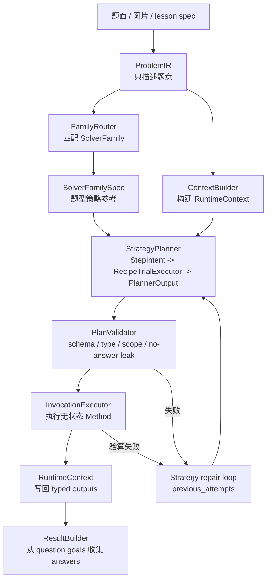

# Method Solver 数学解题引擎架构设计

## 1. 核心目标

Method Solver 的目标不是让 LLM 现场自由解题，而是把题库中反复出现的解题方法沉淀成可执行、可验算、可生成推导日志的资产。

核心分工：

```text
ProblemIR      负责表达题意
SolverFamily   负责表达题型策略参考
Planner        deterministic 路径生成 PlannerOutput；Strategy 路径生成 StepIntent
Trial/Compiler 负责把 StepIntent 编译为 PlannerOutput
Method         负责无状态数学动作
SymPy          负责计算和验算
Trace          负责沉淀可讲解推导骨架
```

最终形态不是“每道题一个 Solver”，而是：

```text
少量 SolverFamily + 大量 Stateless Method + 可回归的题库案例
```

## 2. 总体链路




在线和离线走同一条链路，只是策略不同：

- 在线：优先使用高置信 SolverFamily；失败时进入 Method-Guided LLM 或 Free LLM + Verifier。
- 离线：批量跑题库，统计 miss case，聚类出新 method / 新 family，回灌测试。

### 2.1 当前黄金题运行链路

当前 canonical 南开 25 与河西 25 已经完整端到端通过。现有代码里的默认 CLI 和
`solve_problem()` 主链路仍走 deterministic planner；本文后续章节定义的是把这一步替换为
Strategy Planner 的目标设计。

注意：`engine.solve_problem(problem_ir)` 不传 `runtime_config` 时不读取 `.env`，直接使用
deterministic provider。CLI 会通过 `SolverRuntimeConfig.from_sources()` 读取 `server/.env`
和环境变量；如果当前环境显式设置 `SOLVER_PLANNER_MODE=llm`，由于旧 LLM planner 已删除，
CLI 会明确失败。现阶段人工运行黄金题建议显式传 `--planner deterministic`。

```text
python -m shuxueshuo_server.solver.solve_problem \
  --fixture ../internal/solver-fixtures/tj-2026-nankai-yimo-25.json \
  --planner deterministic
  -> solve_problem.main()
  -> load_problem_ir(fixture)
  -> engine.solve_problem(problem_ir)
  -> RuntimeOrchestrator.solve(problem_ir)
```

`RuntimeOrchestrator.solve()` 内部顺序：

```text
1. FamilyRegistry.match(problem)
   -> 南开命中 QUADRATIC_PATH_MINIMUM_FAMILY
   -> 河西命中 QUADRATIC_WEIGHTED_PATH_MINIMUM_FAMILY

2. ContextBuilder.build(problem)
   -> 建立 problem / question / subquestion scope
   -> 写入 symbols、constraints、quadratic expression、coefficient relation
   -> 从 data.path_problem 写入 $problem.conditions.path_minimum
   -> 写入题设点 D/M/N/F；显式坐标为 Point，定义型点为 PointRef
   -> 不从 fixture 注入 D_prime

3. MethodSpecRegistry.load_from_code()
   -> 从 runtime/methods/*.py 的 SPEC 加载 MethodSpec

4. extract_question_goals(problem)
   -> 读取题面最终作答目标 QuestionGoal

5. ContextInventoryBuilder.build(context, specs)
   -> 枚举可见 ContextPath、relation graph、constraints、planning signals、method candidates

6. PlannerInputs(...)
   -> problem_id + family_spec + question_goals + context_inventory + method_specs

7. PlannerProvider 创建 deterministic planner
   -> 南开委托 QuadraticPathMinimumPlannerV15.plan(context)
   -> 河西使用 Hexi25WeightedPathPlannerV15.plan(inputs)
   -> 南开 planner 创建 G 与 D_prime 过程占位
   -> 返回 PlannerOutput(context_declarations, step_plans)

8. InvocationExecutor.execute_plan(context, plans)
   -> PlanValidator 校验每个 MethodInvocation
   -> 解析 ContextPath typed inputs
   -> 调用 Stateless Method
   -> method output 写 step temp
   -> StepPlan.promote_outputs 写回 question/subquestion/problem scope
   -> 聚合 checks 与 trace fragments

9. ResultBuilder.build(context, execution, question_goals)
    -> 从 goal.target_path 读取最终答案
    -> 序列化为 SolverResult.answers

10. RuntimeOrchestrator 组装 SolverResult
    -> status / solver_family / methods_used / trace / answers / checks / errors
```

南开 25 当前 method invocation 顺序：

```text
quadratic_axis_from_relation
quadratic_from_constraints
right_angle_equal_length_candidates
select_point_by_quadrant_constraint
parameter_from_segment_length
quadratic_from_constraints
midpoint_point
two_moving_points_path_reduction
broken_path_straightening_candidates
select_straightening_candidate
distance_between_points
parameter_from_minimum_value
quadratic_from_constraints
line_intersection_point
```

河西 25 当前 method invocation 顺序：

```text
quadratic_from_constraints
quadratic_vertex_point
quadratic_from_constraints
quadratic_y_axis_intercept_point
right_angle_equal_length_candidates
filter_point_candidates_by_quadratic_curve
select_curve_point_candidate_and_solve_coefficients
quadratic_from_constraints
point_on_parabola_at_x
weighted_axis_path_triangle_transform
linked_broken_path_geometric_minimum
```

其中 `quadratic_from_constraints` 是当前二次函数系数求解的统一 method。它接收
已知系数、系数关系、曲线点约束、额外方程和可选自由参数，然后统一生成
`coefficients` 与 `parabola`。此前南开的
“已知系数 + 关系求抛物线”“两点在曲线上 + 关系求系数”，以及河西的
“已知系数 + 曲线点求含参抛物线”都收敛到这一入口，避免同一类代数约束按题目拆成
多个近似 method。河西第（Ⅱ）问也使用它先代入 `a=2` 和 `A(-1,0)` 得到
`y=2*x**2-b*x-b-2`，再求 C、列 D 候选，最后把 D 候选代回当前问抛物线求出 `b`，
并由 `c=-b-2` 得到 `c`。

河西第（Ⅲ）问的加权路径不再默认走代数求导。当前链路先调用
`weighted_axis_path_triangle_transform` 构造辅助等腰直角三角形 `AQN`，把
`sqrt(2)*MN+AN` 转成 `sqrt(2)*(MN+QN)`；再调用
`linked_broken_path_geometric_minimum` 使用“将军饮马/折线拉直”的几何最短状态，
由 `M,N,Q` 共线且拉直线垂直于 `Q` 的运动射线推出最小值表达式并反求 `b`。
辅助点名由 planner 声明为 `PointRef` 后传给
`weighted_axis_path_triangle_transform`，method 不写死 `Q`；它只根据题面路径端点和
传入的辅助点名生成 `MN+QN` 这类转化文本。这个 method 还会显式输出
`auxiliary_locus`，表示辅助点所在运动射线，例如 `kind=ray`、起点 A、方向 `(1,1)`。
后续 `linked_broken_path_geometric_minimum` 必须读取这条射线，才能验证“拉直后的最短
路径垂直于辅助点轨迹”。该 method 现在用点到辅助点轨迹的垂线距离计算最小值：
先求曲线点到 `auxiliary_locus` 的垂足，再由 `Q(n)=垂足` 反推出动点参数，最后用
`scale * distance(M, auxiliary_locus)` 得到原路径最小值表达式。后续遇到 30°/60° 直角三角形构造时，应扩展
`weighted_axis_path_triangle_transform` 的权重-三角形构造表，而不是让 planner 写死
辅助点坐标。
`filter_point_candidates_by_quadratic_curve` 专门承担“把几何候选点代入当前问二次函数，
按参数约束快速筛掉不可行候选”的步骤，避免把候选筛选和最终求系数混在同一个 method。

### 2.2 数学计算分层

当前数学能力不是只有 SymPy 或 `math_kernel` 一层，而是三层：

```text
Layer 1: SympyKernel
  -> 原子数学能力：解方程、化简、等价判断、代回、距离、交点等。

Layer 2: math_ops.py
  -> 组合数学动作：把多个原子操作组合成初中代数/几何常见步骤。

Layer 3: Stateless Method
  -> 从 typed inputs 调用 math_ops / kernel，返回 typed outputs、checks、trace。
```

`math_ops.py` 的定位很重要：它在 kernel 之上、method 之下，承载纯数学、可复用、
无上下文副作用的组合操作。它不读取 fixture、不知道题号、不写 RuntimeContext。

典型能力包括：

- 二次函数操作：`substitute_known_coefficients`、`solve_missing_coefficients`、`axis_x_from_relation`、`vertex_of_quadratic`。
- 几何构造：`rotated_equal_length_candidates`、`reflect_point_across_line`、`parametric_point_on_line`。
- 候选筛选与约束判断：`pick_by_lower_bound`、`satisfies_lower_bound`、`simplify_abs_by_constraints`。
- 规划辅助计算：`point_complexity_score` 用于候选复杂度评分，帮助选择更容易计算的拉直方案。

这层的边界是：`math_ops.py` 可以表达数学套路，但不决定某道题该按什么顺序调用这些套路；
调用顺序仍属于 Planner / MethodInvocation，验算和写回仍属于 Method / Executor。

## 3. 角色边界

### 3.1 ProblemIR

`ProblemIR` 只表达题意，不表达解法。

应该包含：

- 原题文字和题号。
- 函数、点、线、关系、条件。
- 分问和小问结构。
- 目标，如求解析式、求参数、求最值、求点坐标。
- 约束，如 `m > 2`、点在第四象限。

不应该包含：

- 标准答案。
- method chain。
- SolverFamily 的固定步骤。
- 非题设的辅助点构造，除非原题明确给出。
- method 临时变量。

当前存在两类 ProblemIR 用法：

- solver runtime fixture：服务 deterministic planner、ContextBuilder 和端到端回归，仍包含既有 `data.function / data.relations / data.path_problem` 等结构。
- `.llm.json` canonical ProblemIR：服务 Strategy prompt，显式保存 `original_text / scopes / entities / facts / question_goals`，只给 LLM 暴露 canonical Entity/Fact/answer handle。

Strategy Planner 只把 `.llm.json` 当作题目事实源；runtime 仍可读取旧 fixture 字段。两者若表达冲突，应视为 ProblemIR 抽取或同步错误，而不是让 Resolver 通过模糊匹配自行猜测。

### 3.2 RuntimeContext

`RuntimeContext` 是求解运行时的层级黑板，不等同于 fixture。

它负责保存 typed facts、constraints、temp values 和 outputs。这里的
“黑板”不是自由写入的全局字典，而是带 scope、类型、可见性和锁定规则的运行时状态。

作用域结构：

```text
problem
  question
    subquestion
      step
```

读写规则：

- 下层可以读取父层事实。
- 当前 step 可以读取自身、父 subquestion、父 question、problem。
- sibling question / subquestion 不能互相读取。
- question 不能读取子 step 的临时值。
- step 临时值默认不泄露。
- MethodInvocation 输出只能写当前 step 的 `temp` 或 `outputs`。
- 只有 `StepPlan.promote_outputs` 声明的结果才能写回上层。
- locked fact 不能覆盖。

#### 3.2.1 ContextPath

ContextPath 是 method 输入输出的唯一绑定方式。

示例：

```text
$problem.points.D
$question.ii.points.M
$question.ii.constraints.N_quadrant
$subquestion.ii_1.outputs.m
$step.derive_N.temp.candidates
```

禁止 invocation 传入裸值。这样可以保证：

- Planner 不能偷偷塞答案。
- Validator 能检查 scope 可见性和类型。
- Trace 可以回溯每个结果来源。

### 3.3 Method

Method 是无状态解题动作。

```text
typed inputs -> typed outputs + checks + trace fragments
```

Method 不读取 fixture，不知道题号，不决定输出写入哪里，也不直接收集最终答案。

例如 `right_angle_equal_length_candidates` 只负责由已知直角边生成候选点；`select_point_by_quadrant_constraint` 只负责用象限和参数约束筛选候选点。它们都不应该知道“南开 25”。

### 3.4 MethodSpec

MethodSpec 是 Method 的能力说明书，代码里的 `SPEC` 是唯一事实源，JSON 只是派生资产，用于 review、检索和离线索引。

MethodSpec 描述：

- `method_id`
- solves 哪类 goal
- 输入槽位、类型、角色
- 输出槽位、类型
- 前置条件
- 后置验算
- trace 模板

### 3.5 MethodInvocation

MethodInvocation 是某个 method 在某道题、某个 step 里的具体调用。

它只绑定 ContextPath：

```json
{
  "method_id": "right_angle_equal_length_candidates",
  "scope": "derive_N",
  "inputs": {
    "anchor": "$problem.points.D",
    "reference": "$question.ii.points.M",
    "target": "$question.ii.points.N"
  },
  "outputs": {
    "candidates": "$step.derive_N.temp.candidates"
  }
}
```

禁止在 invocation 中直接写裸坐标、裸参数值或最终答案。

### 3.6 StepPlan

StepPlan 是一个可执行解题步骤，可以包含一个或多个 MethodInvocation。

```json
{
  "step_id": "derive_N",
  "goal": {
    "type": "derive_point_coordinate",
    "target_path": "$question.ii.points.N"
  },
  "scope": "ii",
  "invocations": [],
  "promote_outputs": {
    "$step.derive_N.temp.selected_point": "$question.ii.points.N"
  }
}
```

一个学生解题步骤常常不是一个 method，例如“确定 N 点”可以拆成：

```text
1. 由直角等腰关系生成两个候选点
2. 由第四象限和 m>2 筛选唯一点
```

### 3.7 SolverFamily

SolverFamily 不是单题固定步骤，也不应该直接执行 method。

它的目标角色是“题型策略参考”，即向 Planner 提供这类题的宏观知识：

- 支持哪些 pattern / problem_type。
- 这类题通常有哪些 goal。
- 这类题的解题策略原则。
- 哪些 method 属于该 family 的能力边界。
- 哪些 recipe 是该 family 的标准解题动作。
- family 级 method binding rule 如何把 canonical handle 映射到 method input。
- family 级别的校验规则是什么。

也就是说，SolverFamily 应该是 Planner 的输入，而不是 Planner 的替代品。

## 4. SolverFamilySpec

建议把 SolverFamily 的可配置部分显式建模为 `SolverFamilySpec`。

示意结构：

```json
{
  "family_id": "quadratic_path_minimum",
  "match": {
    "patterns": ["path-minimum"],
    "problem_types": ["quadratic_path_minimum"],
    "required_objects": ["quadratic_function", "moving_path"]
  },
  "common_goal_types": [
    "derive_parabola",
    "derive_constructed_point",
    "derive_parameter",
    "reduce_path_expression",
    "straighten_broken_path",
    "derive_minimum_value",
    "derive_extremal_point"
  ],
  "strategy_principles": [
    "先解析题设中的函数、点、关系和参数约束",
    "若构造点坐标未知，先由几何关系生成候选，再用题设约束筛选",
    "能先确定未知参数时，优先先求参数再代入后续表达式",
    "路径最值先做路径转化，再做折线拉直或等价最短路径处理",
    "最短路径对应点通常来自约束轨迹与拉直线段的交点"
  ],
  "method_ids": [
    "quadratic_axis_from_relation",
    "quadratic_from_constraints",
    "right_angle_equal_length_candidates",
    "select_point_by_quadrant_constraint",
    "two_moving_points_path_reduction",
    "distance_between_points"
  ],
  "step_recipes": [
    {
      "recipe_id": "right_angle_equal_length_construct_and_select",
      "goal_type": "derive_constructed_point",
      "method_ids": [
        "right_angle_equal_length_candidates",
        "select_point_by_quadrant_constraint"
      ]
    },
    {
      "recipe_id": "two_moving_points_path_reduction",
      "goal_type": "reduce_path_expression",
      "priority": "preferred",
      "method_ids": ["two_moving_points_path_reduction"]
    }
  ],
  "method_binding_rules": [
    {
      "method_id": "parameter_from_minimum_value",
      "input_bindings": [
        ["minimum_expression", "read_type:MinimumExpression"],
        ["condition", "fact:minimum_value:Condition"]
      ]
    }
  ]
}
```

`SolverFamilySpec` 不保存某一道题的答案，不保存南开题专属坐标，也不写死第几问输出什么对象。最终答案应由 `ProblemIR.data.questions[].goals` 决定，ResultBuilder 只按照这些 goals 对应的 resolved target paths 收集结果。

### 4.1 ProblemIR QuestionGoal 定义

`ProblemIR.data.questions[].goals` 表达的是“题目要求学生最终作答什么”，不是“求解过程中需要临时求什么”。

因此 QuestionGoal 的边界是：

- 只对应原题 `asks` 中的最终问题，例如“求抛物线解析式”“求最小值”“求点 G 坐标”。
- 不包含中间推导量，例如为了求解析式先解出的参数 `m`、候选点、辅助点、最小值表达式模板等。
- 如果某个中间量需要传给后续 method，应由 `StepPlan.promote_outputs` 写入对应 scope 的 `outputs`、`points` 或 `temp`，而不是写成 question goal。
- ResultBuilder 只收集 QuestionGoal；它不负责判断哪些中间量应该展示。

这条边界很重要：后续 LLM 抽取 ProblemIR 时，只需要理解“题目问了什么”，不需要猜测解题过程会产生哪些中间变量。中间变量的发现和组织属于 Planner / MethodInvocation / RuntimeContext 的职责。

示例：南开 25 第（Ⅱ）①问题面要求“抛物线解析式及 `EG+FG` 的最小值”，所以 goals 是 `parabola` 和 `min_value`；虽然求解中会先得到 `m=3`，但 `m` 只是中间参数，不进入 `SolverResult.answers`。

### 4.2 QuestionGoal / PlanningSignal / StepGoal 边界

三类对象的边界固定如下：


| 类型               | 来源                                                                  | 用途                      | 示例                                        |
| ---------------- | ------------------------------------------------------------------- | ----------------------- | ----------------------------------------- |
| `QuestionGoal`   | `ProblemIR.data.questions[].goals`                                  | ResultBuilder 收集最终答案    | 第（Ⅱ）①输出 `parabola`、`min_value`            |
| `PlanningSignal` | `ContextInventoryBuilder` 用代码规则从 RuntimeContext / relation graph 生成 | 提醒 Planner 关注未解析点、关系、约束 | `$question.ii.points.N` 是未知点且参与直角等长关系     |
| `StepGoal`       | Planner 生成 StepPlan 时创建                                             | 描述某一步要推进的中间目标           | 为了后续推导，当前 step 先求 `$question.ii.points.N` |


`PlanningSignal` 不是 goal，不表示“必须先求什么”，也不生成 method invocation。它是
确定性上下文索引，不调用 LLM、不携带答案、不写 RuntimeContext。真正的中间解题目标
只能由 Planner 生成，并保存在 `StepPlan.goal` 的 `StepGoal` 中。

在当前 Strategy Planner probe 中，中间意图先表达为 `StepIntent.goal_type / target`；
只有被 `RecipeTrialExecutor` 编译成 `StepPlan` 后，才进入 `StepGoal` 和
`MethodInvocation` 的可执行层。Strategy prompt 不再输入 PlanningSignal。

### 4.3 PointRef 与延迟解析

`PointRef` 是 RuntimeContext 中的“未落坐标点引用”。它让系统可以先保存一个点的
结构化定义，再在合适的时机由 RuntimeContext 或 method 求出坐标。

典型来源：

- 题设声明但没有显式坐标的点，例如 `D` 是对称轴与 x 轴交点。
- 由几何关系定义的派生点，例如 `N` 满足直角等腰关系。
- Planner 运行期声明的目标点或辅助点，例如 `G`、`D_prime`。

`ContextBuilder` 会把显式坐标写成 `Point`，把定义型点写成 `PointRef`。当
`RuntimeContext.read_path(..., expected_type="Point")` 读到 `PointRef` 时，只会解析
安全、确定、无需选择的定义，例如 `axis_x_intercept`、`y_axis_intercept`、`vertex`、
`midpoint`、`square_opposite_point`。

需要选择或策略判断的关系不会在 RuntimeContext 中隐式完成。例如未知点 `N` 参与
`right_angle_equal_length` 题面关系时，可能产生两个候选点，必须由 method 生成候选，
再由题设约束筛选；`line_intersection`、`straightening_auxiliary_point` 也需要对应
method 计算和验算。这个边界能保证 RuntimeContext 是受控黑板，不是隐藏的 solver。

### 4.4 Planner 占位声明

Planner 运行期可能需要声明题设中没有直接出现的辅助点或目标点，例如南开 25 的交点 `G`
和折线拉直辅助点 `D_prime`。这些占位是解法策略的一部分，不应该回写到 fixture。

当前 runtime 已经把占位声明升级为显式 `ContextDeclaration`：

```text
PlannerInputs
  -> Planner.plan()
  -> ContextDeclaration[] + StepPlan[]
  -> PlanValidator.validate_declarations()
  -> apply declarations
  -> PlanValidator.validate_steps()
  -> InvocationExecutor
```

`ContextDeclaration` 可以声明“需要一个辅助点/目标点占位”，但不得携带坐标或裸答案。
声明通过后写入未锁定 `PointRef`；真正坐标仍由 stateless method 输出，再通过
`promote_outputs` 覆盖占位。Strategy Planner 后续如果需要创建辅助点，应通过
`creates` 产生 derived Entity，再由 `RecipeTrialExecutor` 编译为 declaration。

## 5. LLM Strategy Planner 目标架构

Planner 的职责从“直接生成 `StepPlan / MethodInvocation`”改为两层：

```text
.llm ProblemIR + FamilySpec + method_catalog + recipe_catalog + few-shot + previous_attempts
  -> LLM 输出老师式 StepIntent[]
  -> HandleResolver / CandidateResolver / RecipeTrialExecutor
  -> PlannerOutput(context_declarations, step_plans)
```

现在南开 25 与河西 25 已经证明执行层可行：只要给出正确的 `PlannerOutput`，
`PlanValidator -> InvocationExecutor -> ResultBuilder` 可以稳定完成计算、验算和答案收集。
新的重点是让 LLM 只负责“像老师一样拆步骤”，让代码层负责 recipe/method 选择、参数绑定、
scope 校验和试执行。

Strategy Planner 的原则是：

- LLM 负责“看懂当前题该怎么拆步骤”和“这一步倾向用哪个 recipe/method”。
- LLM 只引用 canonical Entity / Fact / answer handle，不写 ContextPath、slot candidate 或 method invocation。
- 代码负责 recipe/method 候选、canonical handle 绑定、scope 可见性、dry-run/checks 和答案收集。
- 真实执行结果也要进入 LLM loop；只有 runtime 求解成功且答案 gate 通过，才算 attempt 成功。

### 5.1 Orchestrator 与 Planner 边界

`RuntimeOrchestrator` 管外层求解生命周期和总 attempt 预算，Strategy Planner 负责单次
生成 StepIntent。当前 DeepSeek probe 采用整体重生成 plan：每次失败后重建干净
`RuntimeContext`，把 validator/candidate/execution/result errors 压缩进下一轮
`previous_attempts`。

Orchestrator 的职责：

- 匹配 `SolverFamilySpec`。
- 构建 `RuntimeContext`、`QuestionGoal`、`MethodSpecRegistry`。
- 组装 Strategy payload。
- 调用 DeepSeek/Fake StrategyPlanner 生成 StepIntent。
- 调用 `RecipeTrialExecutor` 编译为 `PlannerOutput`。
- 执行 `PlanValidator` / `InvocationExecutor`。
- 在全局预算内把 validation / execution / result errors 结构化后交回 planner 修复。
- 管理最终 `SolverResult`、run log、耗时、token 和失败状态。

Planner 的职责：

- 读取 `.llm.json` ProblemIR、QuestionGoal、FamilySpec、method catalog、recipe catalog 和 few-shot。
- 输出按 scope 分组的 `StepIntent[]`。
- 使用 `recipe_hint` 表示标准动作倾向；不直接决定最终执行。
- 不生成 ContextPath、MethodInvocation、`promote_outputs` 或 `depends_on`。
- 根据结构化错误生成下一版 plan。
- 维护 LLM 规划过程中的候选、失败历史和 scratchpad。

如果 Orchestrator 开始理解“该先求哪个点”，它就会变成第二个 Planner。因此
Orchestrator 只负责预算、执行和终止条件；repair 的语义信息通过 `previous_attempts`
交给 LLM，而不是由 Orchestrator 自己改 plan。

记忆分层：


| 记忆层              | 归属                      | 内容                                               | 是否参与确定性执行                     |
| ---------------- | ----------------------- | ------------------------------------------------ | ----------------------------- |
| `RuntimeContext` | Orchestrator / Executor | typed facts、constraints、outputs、step temp、checks | 是                             |
| `PlannerMemory`  | Planner                 | 单次 LLM 调用的 StepIntent 摘要、结构化错误、候选能力、失败历史、scratchpad | 否，必须经 plan 输出和 validator 才能生效 |
| `SolveSession`   | Orchestrator            | 每次 attempt 的输入摘要、LLM 输出摘要、错误、耗时、token、最终状态       | 否，用于调试、回放和离线学习                |


### 5.2 LLM Planner 状态：旧方案已移除，Strategy 竖切已跑通

旧的三条 LLM planner 实验链路已经从代码中删除：

- step decomposition：LLM 只输出抽象步骤，再编译回 deterministic template。
- controlled draft：LLM 输出 method、slot candidate、`promote_to`、`depends_on` 等可执行草案。
- intent draft：LLM 输出 method 与语义 handle，再由 resolver 编译成 StepPlan。

删除原因：这些方案仍然让 LLM 承担过多“程序员式”工作，例如选择精确 slot、
管理跨步骤数据流、处理输出路径和遵守复杂 schema。当前方向已经改成 Strategy Planner：

```text
LLM Strategy Planner
  -> 只输出老师式 StepIntent[]
Code Resolver / RecipeTrialExecutor
  -> 解析 canonical handle
  -> 按 recipe_hint / goal_type / produces 找 recipe/method 候选
  -> 按 family method_binding_rules 生成 MethodInvocation
  -> 编译 PlannerOutput
  -> 交给现有 runtime 执行和验算
```

当前南开 canonical 的真实 DeepSeek opt-in probe 已经能在最多 3 轮内完成：

```text
DeepSeek StepIntent -> RecipeTrialExecutor -> PlannerOutput -> RuntimeOrchestrator -> expected answers
```

它仍是测试/probe 路径，不是默认 `solve_problem()`。默认 CLI 继续使用 deterministic planner，
直到 Strategy Planner 在南开、河西、alt-label 等样例上稳定，并补齐 provider 接入与失败降级策略。

### 5.3 与 ProblemIR 生成阶段的关系

LLM 会出现在两个地方，但职责不同：

```text
ProblemIR 生成 LLM：从题面/图片抽取题意结构
Planner LLM：从已结构化的题意和 method 能力生成可执行 plan
```

ProblemIR 生成阶段只负责题意事实：点、函数、关系、条件、分问、最终 QuestionGoal。
它不负责生成 method chain，也不负责猜测中间变量。

旧 RuntimeContext/ContextInventory 中的 PlanningSignal 仍可作为 deterministic runtime 的内部索引，
但当前 Strategy prompt 不再输入 PlanningSignal；LLM 只看 `.llm.json` canonical Entity/Fact、
FamilySpec、method/recipe catalog 和 few-shot。

## 6. 执行与验算

执行器只做确定性动作：

```text
ContextDeclaration[]
  -> validate declarations
  -> apply declarations
StepPlan[]
  -> validate_step
  -> resolve ContextPath inputs
  -> method.run(inputs, kernel)
  -> write step temp outputs
  -> promote declared outputs
  -> collect checks and trace fragments
```

关键约束：

- Method 输出先写入 step scope。
- 上层写回必须通过 `promote_outputs`。
- 未 promote 的 step temp 不能被 sibling/后续 step 读取。这是当前安全边界，后续 Strategy Planner
  的 trial engine 也必须遵守同一套可见性校验协议。
- 覆盖题设 locked fact 必须失败。
- 输入类型必须匹配 MethodSpec。
- Invocation 不能携带裸数值作为答案捷径。
- QuestionGoal 缺失或类型错误由 ResultBuilder 报错，不由 Planner 伪造答案。

## 7. Search / Rank / Fallback

Search & Rank 分四层：

1. Family ranking：根据 ProblemIR 的 pattern、problem_type、对象结构、目标类型和历史案例匹配 SolverFamily。
2. Step strategy ranking：根据 `.llm.json`、FamilySpec、QuestionGoal、method/recipe catalog 和 few-shot 生成 StepIntent。
3. Capability ranking：根据 `recipe_hint / goal_type / target / produces` 在 family recipe 和 method 中找候选。
4. Binding / trial ranking：根据 canonical handle、method binding rule、scope 可见性和 runtime checks 选择可执行绑定。

Fallback 不是完全自由解题，而是分层降级：

```text
StrategyPlanner with canonical handles + recipe/method constraints
  -> StrategyPlanner repair loop
  -> deterministic golden fallback for known fixtures only
  -> Free LLM draft + Verifier, marked low confidence
  -> Human review queue
```

所有 miss case 都应进入离线队列，用于新增 method、补 FamilySpec/recipe、补 binding rule 或添加测试。

## 8. 当前代码与目标架构的差距

当前代码已经完成：

- `ProblemIR` 与 `SolverResult` 拆分。
- 多层 `RuntimeContext`。
- `ContextPath`。
- `StepPlan` / `MethodInvocation`。
- `PlanValidator` / `InvocationExecutor`。
- Stateless Method + MethodSpec from code。
- `QuestionGoal` 解析与 `ResultBuilder` 答案收集。
- `RuntimeOrchestrator` 通用运行编排。
- 南开 25 与河西 25 的端到端求解。
- 二次函数约束求解已统一到 `quadratic_from_constraints`。
- 加权路径最值已拆成几何转化 `weighted_axis_path_triangle_transform` 和几何最短 `linked_broken_path_geometric_minimum`。
- `PlannerOutput` / `ContextDeclaration` 边界已建立。
- Strategy Planner probe 已建立：`.llm.json` canonical ProblemIR、StepIntent schema、recipe_hint、valid_scope、HandleResolver、StepIntentCandidateResolver、RecipeTrialExecutor。
- 南开 canonical 已通过真实 DeepSeek opt-in 竖切：StepIntent -> PlannerOutput -> runtime expected answers。

仍需重构：

- `QuadraticPathMinimumPlannerV15` 仍是南开固定 step template。
- `Hexi25WeightedPathPlannerV15` 仍是河西固定 step template。
- `enabled_problem_ids` 仍是 deterministic template 的临时硬门控。
- Planner provider 仍是 `family_id -> planner factory` 静态映射。
- Strategy Planner 仍未接入默认 `solve_problem()`，当前只在 opt-in probe 和固定 StepIntent fixture 中验证。
- Strategy Planner 尚未覆盖河西、alt-label 和更多 family。
- `SolverResult.trace` 当前是 runtime 计算轨迹，不是学生可直接阅读的解题稿。

### 8.1 enabled_problem_ids 退出条件

`enabled_problem_ids` 是硬门控，不是弱提示。`FamilyRegistry.match(problem)` 会先判断
`pattern/problem_type` 是否命中，再检查 `problem.problem_id` 是否在白名单中。因此即使题型信号
完全命中，只要不在白名单里，也会返回 `unsupported`。

退出条件：

1. Strategy Planner 不再依赖 canonical 点名和分问 id，例如 `D/M/N/F/G`、`i/ii/ii_1/ii_2`。
2. 南开、河西两道黄金题都能通过 Strategy Planner 生成计划并端到端通过。
3. alt-label 同构题能通过 Strategy Planner，未知题型或其他 family 不会误路由。
4. 去掉门控后，测试仍覆盖正负样例和 unsupported 行为。
5. 满足以上条件后，从 FamilySpec 删除该字段，或让空 tuple 表示不再按题号限制。

### 8.2 Runtime Trace 不等于学生推导

当前无状态 method 返回的 `trace_fragments` 主要服务三件事：

1. 便于开发者 review solver 是否按预期调用 method。
2. 便于 CLI/JSON 对每个 runtime step 做回归测试。
3. 便于定位 check 失败时是哪一步的输入、输出或验算出了问题。

这类 trace 是“机器计算轨迹”，不是“课堂推导稿”。例如河西第（Ⅲ）问，
`linked_broken_path_geometric_minimum` 可以用点到辅助点运动射线的垂足公式快速算出
最小值表达式；但学生更容易理解的推导是：

```text
构造等腰直角三角形 AQN
=> AN = sqrt(2)*QN
=> sqrt(2)*MN + AN = sqrt(2)*(MN + QN)
=> MN + QN >= MQ
=> 最短时 M,N,Q 共线，且 MQ 垂直 Q 的运动射线
=> 因为射线与 x 轴成 45°，作 MH 垂直 x 轴，得到 △MHN 是等腰直角三角形
=> 由 MH、HN、MN、AN、QN 的长度链得到最小值表达式
```

因此后续需要新增 `ExplanationBuilder` / `DerivationInterpreter` 层：

```text
PlanExecutionResult + RuntimeContext + QuestionGoal
  -> collect explanation facts from method outputs/checks/trace metadata
  -> apply audience policy (middle-school / teacher-review / debug)
  -> hide or merge non-answer runtime steps
  -> produce student-facing derivation steps
```

`ExplanationBuilder` 的输入不应是自由文本拼接，而应优先使用 method 输出的结构化解释事实，
例如路径转化、辅助点轨迹、等号条件、最小值条件、长度链和 visibility policy。

## 9. 目标代码结构

```text
server/shuxueshuo_server/solver/
  engine.py
  problem_models.py
  question_goals.py
  result_models.py
  contracts.py
  family/
    models.py
    registry.py
    quadratic_path_minimum.py
    quadratic_weighted_path_minimum.py
  runtime/
    context.py
    models.py
    planner.py
    context_inventory.py
    strategy_planner.py       # StepIntent / payload / validator / recipe trial 竖切
    orchestrator.py
    result_builder.py
    explanation_builder.py
    deterministic_planners/   # golden fallback / regression oracle
    executor.py
    methods/
  math_kernel/
  math_ops.py
```

当前代码映射：


| 当前代码                                    | 目标职责                                                    |
| --------------------------------------- | ------------------------------------------------------- |
| `problem_models.py`                     | ProblemIR 输入模型                                          |
| `result_models.py`                      | SolverResult / Trace 输出模型                               |
| `contracts.py`                          | MethodSpec / TypedValue / Check / Trace 契约              |
| `runtime/context.py`                    | RuntimeContext + ContextBuilder                         |
| `runtime/models.py`                     | ContextPath / StepGoal / StepPlan / MethodInvocation    |
| `runtime/methods/*.py`                  | Stateless Method + SPEC                                 |
| `runtime/method_specs.py`               | MethodSpecRegistry                                      |
| `runtime/executor.py`                   | PlanValidator + InvocationExecutor                      |
| `runtime/context_inventory.py`          | RuntimeContext -> 可规划上下文摘要                              |
| `runtime/strategy_planner.py`           | Strategy payload、StepIntent 校验、HandleResolver、RecipeTrialExecutor 竖切 |
| `runtime/quadratic_path_planner.py`     | 当前南开固定 planner，迁移到 deterministic golden fallback        |
| `runtime/hexi_weighted_path_planner.py` | 当前河西固定 planner，迁移到 deterministic golden fallback        |
| `runtime/orchestrator.py`               | FamilySpec -> Planner -> Executor -> ResultBuilder      |
| `family/*.py`                           | SolverFamilySpec                                        |


## 10. 测试策略

测试是 Method Solver 的核心回归保护。策略是每一层都有独立单测，端到端题目使用
expected answer JSON 做验收。

分层策略：

- 数学层：`test_math_kernel.py`、`test_math_ops.py` 验证 SymPy 原子能力和 Layer 2 组合操作。
- Runtime 层：`test_context_path.py`、`test_runtime_context_scopes.py`、`test_context_inventory.py`、`test_context_builder.py` 验证 scope、path、PointRef、relation graph 和可见性。
- Method 层：`test_runtime_stateless_methods.py`、`test_method_spec_loader.py` 验证 MethodSpec 与无状态 method 的输入输出契约。
- Planner/Executor 层：验证 ContextDeclaration、PlanValidator、InvocationExecutor、StepIntent、recipe/method candidate、binding rule、RecipeTrialExecutor 和 DeepSeek repair loop。
- Result/CLI/E2E 层：验证最终答案、trace、checks 和命令行输出。

Strategy Planner 新增测试要求：

- 固定 StepIntent fixture 能编译为 PlannerOutput，并通过 runtime 算出南开 expected answers。
- 真实 DeepSeek opt-in loop 必须以 runtime 执行结果为成功条件，而不是只校验 JSON 合法。
- Method/recipe candidate、binding rule、valid_scope、重复 fact、公共 MinimumExpression fact 都有独立单测。
- Trial 失败不能污染主 RuntimeContext。
- 找不到 family/method/binding 时生成结构化 gap，而不是静默降级。
- 去掉 deterministic provider 前，至少南开、河西、alt-label 都应能通过 Strategy Planner。
- deterministic planner 只作为 golden fallback，不再是默认 provider。

新增 method 或 planner 行为时，原则是先补该层单测，再补端到端 fixture 或 expected JSON。
这样可以区分“数学操作错了”“参数映射错了”“规划顺序错了”和“答案收集错了”。

## 11. 当前验收状态

南开 25 当前验收基线：

```text
第（Ⅰ）问：D(1,0)，y=2*x**2 - 4*x - 5
第（Ⅱ）①：m=3，y=x**2 - 2*x - 2，最小值 5/2
第（Ⅱ）②：m=8，y=x**2/6 - x/3 - 7，G(4,-13/3)
```

河西 25 当前验收基线：

```text
第（Ⅰ）问最终答案：P(1,2)
第（Ⅱ）问最终答案：D(sqrt(2),1)
第（Ⅲ）问最终答案：b=2
```

并且：

- 两道题所有 checks 通过。
- trace steps 非空。
- method 不读取 fixture。
- `engine` 不硬编码 concrete solver。
- `QuestionGoal` 只收集题面最终答案。
- 河西第（Ⅲ）问的最小值验证和点 N 是推导过程产物，不进入 `SolverResult.answers`。

## 12. LLM Planner 成功标准

短期成功标准：

- 南开 25 真实 DeepSeek opt-in loop 能由 StepIntent 生成 PlannerOutput，并端到端通过答案 gate。
- 固定 StepIntent fixture 不依赖测试输出目录，能稳定回归。
- DeepSeek loop 的成功条件包含 runtime 执行和 ResultBuilder 答案收集，不只是 JSON schema 合法。
- LLM 输出不包含 ContextPath、ctx_N、method invocation、promote 或 depends_on。
- deterministic planner 只作为测试 oracle / fallback，不再是主链路。
- 失败时能返回结构化 planner error，而不是静默 fallback 到自由解题。

中期成功标准：

- alt-label 同构题无需新增 deterministic planner 即可通过。
- 至少两道同 family 题目复用同一个 FamilySpec、MethodSpec 和 LLM Planner。
- `enabled_problem_ids` 可以移除或变成空门控。
- 新题接入优先补 fixture、expected JSON、method 单测，而不是新增 SolverFamily。
- 默认 planner provider 可以切到 Strategy Planner。

长期成功标准：

- 题库越大，FamilySpec / MethodSpec / recipe / binding rule / canonical handle 体系越稳定。
- LLM 的角色从“现场解题”收敛为“受控规划、消歧义、修复 plan、改写讲解”。
- runtime trace 与学生版 ExplanationBuilder 分层，既能验算，也能讲给中学生听。
