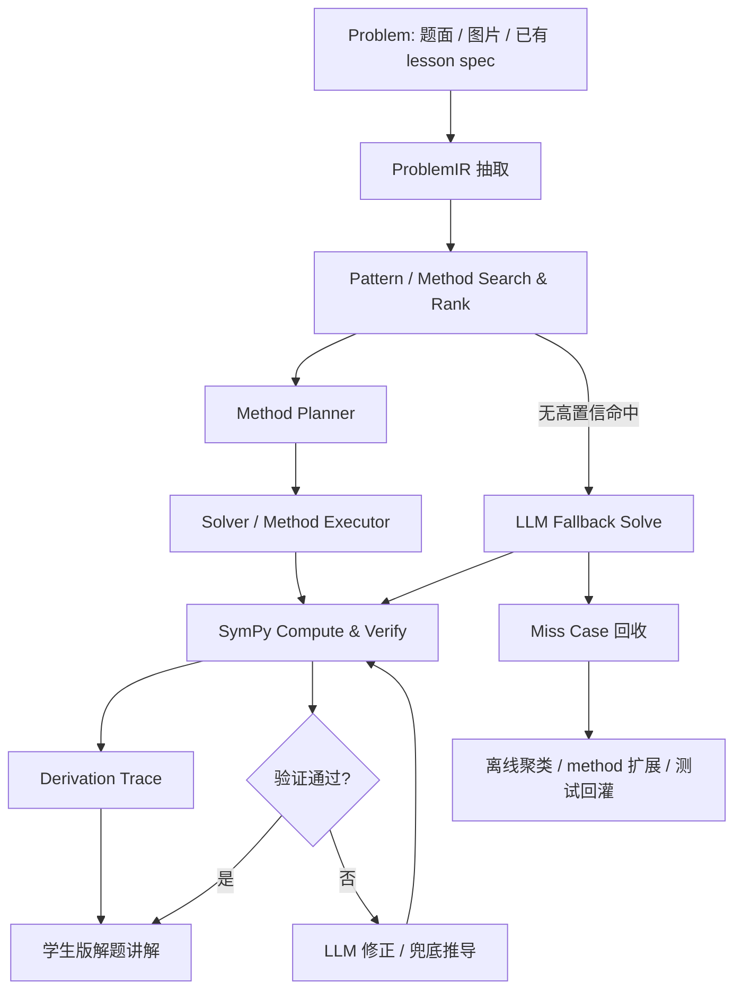

# Method Solver 数学解题引擎架构设计

## 1. 背景

当前数学说的核心解题资产主要分布在三类文件中：

- `internal/lesson-specs/<problem-id>/`：单题题面、解法、视觉步骤和可渲染 JSON。
- `internal/knowledge-points/junior-math-methods.md`：初中数学 pattern / method 知识库。
- `internal/knowledge-points/case-index.md`：按 pattern 和 method 倒排的案例索引。

现有流程依赖 LLM 读题、解题、写步骤和生成视觉 spec。这个方式灵活，但有几个明显瓶颈：

- 代数计算、参数范围、面积表达式容易出现心算或化简错误。
- 同一类题的推导结构不够稳定，容易受提示词状态影响。
- 已经沉淀的 method 知识仍主要是文本提示，没有变成可执行能力。
- 新题命中旧题型时，系统不能自动复用已验证的解题链路。

本方案的目标是把现有 method 知识库升级为“可检索、可排序、可结构化调用、可验算、可生成推导日志”的解题引擎。

## 2. 核心判断

SymPy 适合承担“计算和验算”，不适合单独承担“发现解法”。

因此系统不应尝试做一个通用数学自动解题器，而应采用：

```text
LLM 负责读题和表达
Method Solver 负责解题骨架
SymPy 负责代数计算和校验
题库负责离线沉淀和回归测试
```

最终形态不是“每道题一个 Solver”，而是“少量高频 SolverFamily + 大量 Method 执行单元 + 题库案例测试”。

## 3. 总体链路

离线和在线使用同一条主链路，只是运行策略不同。




在线模式关注低延迟和可兜底：

- 高置信命中 SolverFamily：结构化求解。
- 部分命中 method：Method-Guided LLM 推导。
- 未命中 method：Free LLM 推导，但关键结论必须进入 verifier。
- 验算失败：重试修正，仍失败则标记低置信并进入离线队列。

离线模式关注覆盖率提升：

- 批量遍历题库。
- 抽取 method 使用链。
- 生成候选 MethodSpec / SolverSpec。
- 聚类 miss case。
- 生成回归测试。
- 人工审核高频方法后回灌知识库。

## 4. 概念模型

### 4.1 Pattern

Pattern 是题型家族，决定大方向。

示例：

- `path-minimum`：路径最值。
- `coefficient-constraint`：系数约束。
- `moving-point-translation-area`：动点平移面积。
- `moving-point-folding-area`：动点折叠面积。
- `moving-point-rotation-area`：动点旋转面积。

Pattern 不直接求解，它负责选择候选 SolverFamily 和 method 集合。

### 4.2 Method

Method 是可复用的解题动作。

示例：

- `coefficient-from-point-on-parabola`
- `known-root-factorization`
- `right-triangle-congruence-coordinate`
- `rotation-by-congruence`
- `horse-drinking`
- `area-piecewise-by-overlap`

当前知识库里的 method 主要是文本说明。下一步需要把它升级为可执行 MethodSpec。

### 4.3 SolverFamily

SolverFamily 是多个 method 的稳定编排。

示例：

- `QuadraticPathMinimumSolver`
- `QuadraticCoefficientConstraintSolver`
- `MovingOverlapAreaSolver`
- `RotationOverlapAreaSolver`
- `FoldingOverlapAreaSolver`

SolverFamily 不应按单题创建，而应按高频题型创建。题库中的具体题目主要作为测试用例。

### 4.4 ProblemIR

ProblemIR 是 LLM 从题面中抽取的结构化数学对象。

它应包含：

- 点、线、圆、多边形、函数。
- 点在线上、点在抛物线上、平行、垂直、相等、比例、角度。
- 动态参数，如 `t`、`m`、`a`。
- 目标问题，如求解析式、求线段长、求面积范围、求最小值。
- 题位和区域标签，如天津 24、天津 25、上海 25。
- 原始题面引用，保留可回溯性。

## 5. MethodSpec 设计

每个 method 建议从纯文本卡片升级成结构化规格。

```json
{
  "id": "coefficient-from-point-on-parabola",
  "name": "点在抛物线上求系数",
  "patterns": ["coefficient-constraint", "path-minimum"],
  "trigger": {
    "keywords": ["点在抛物线上", "求解析式", "求 a,b,c"],
    "required_facts": ["parabola", "point_on_curve"]
  },
  "inputs": [
    {"name": "parabola", "type": "quadratic_function"},
    {"name": "points", "type": "point[]"}
  ],
  "outputs": [
    {"name": "equations", "type": "equation[]"},
    {"name": "coefficients", "type": "symbolic_solution"}
  ],
  "sympy_ops": ["solve", "simplify", "subs"],
  "derivation_template": [
    "因为 {point} 在抛物线 {parabola} 上，所以把点坐标代入解析式。",
    "由代入得到方程 {equation}。",
    "联立这些方程，解得 {solution}。"
  ],
  "checks": [
    "substitute_points_back",
    "coefficient_domain_check"
  ]
}
```

MethodSpec 的关键不是让它变成黑盒函数，而是让它同时产生：

- 新 facts。
- 方程和计算结果。
- 推导步骤。
- 验算项。
- 失败原因。

## 6. 运行时数据结构

### 6.1 Fact

Fact 是解题过程中的最小事实单元。

```json
{
  "id": "fact_n_coordinate",
  "type": "point_coordinate",
  "object": "N",
  "value": ["2", "1-m"],
  "source": {
    "method": "right-triangle-congruence-coordinate",
    "step": "transfer_leg_lengths"
  },
  "confidence": 0.96
}
```

### 6.2 MethodResult

每次 method 调用返回 MethodResult。

```json
{
  "method_id": "right-triangle-congruence-coordinate",
  "status": "ok",
  "facts": [],
  "equations": [],
  "derivation_steps": [],
  "checks": [],
  "used_inputs": [],
  "warnings": []
}
```

### 6.3 DerivationTrace

DerivationTrace 是最终讲解的骨架。

```json
{
  "problem_id": "tj-2026-nankai-yimo-25",
  "pattern": "path-minimum",
  "methods": [
    "right-triangle-congruence-coordinate",
    "coefficient-from-point-on-parabola",
    "horse-drinking"
  ],
  "steps": [
    {
      "title": "由系数关系确定 D 点",
      "goal": "先确定对称轴与 x 轴交点",
      "reason": "由 2a+b=0 可得 b=-2a",
      "calculation": "x=-b/(2a)=1",
      "conclusion": "D(1,0)",
      "checks": ["axis_check"]
    }
  ]
}
```

LLM 在最后阶段只负责把 DerivationTrace 改写成学生可读语言，不再自由编造关键计算。

## 7. Search & Rank

Search & Rank 分两级。

### 7.1 Pattern Ranking

输入 ProblemIR 后，先判断题型大类。

信号来源：

- 题位：24 题更偏动点面积，25 题更偏二次函数综合。
- 关键词：平移、旋转、折叠、重合面积、最小值、抛物线。
- 对象结构：是否有二次函数、是否有动参数、是否有重叠区域。
- 目标类型：求面积范围、求解析式、求最值、求参数范围。
- 已有案例相似度：与 `case-index.md` 中 problem summary 的向量相似度。

### 7.2 Method Ranking

Pattern 命中后，再检索 method。

排序信号：

- method trigger 与 ProblemIR facts 的匹配度。
- required inputs 是否齐全。
- method outputs 是否能推进当前目标。
- 与历史案例的 method chain 相似度。
- 当前题位中的高频 method 先验。
- verifier 反馈：历史上该 method 在相似题中是否通过。

方法检索结果不应直接执行，必须先做签名匹配：

```text
条件是否足够?
输出是否有用?
是否违反初中方法约束?
是否需要先调用其他 method 产生输入?
```

## 8. Planner 与 Solver

Method Planner 负责把候选 method 组合成可执行链路。

例如南开 25 题：

```text
pattern: path-minimum
目标: 求解析式 + EG+FG 最小值

chain:
1. coefficient relation -> D(1,0)
2. right-triangle-congruence-coordinate -> N(2,1-m)
3. coefficient-from-point-on-parabola -> a,b,c
4. isosceles-right-triangle-transform -> EG=DG
5. horse-drinking -> 最短路径表达式
6. solve parameter equation -> m
7. substitute back -> 解析式与 G 坐标
```

例如南开 24 题：

```text
pattern: moving-point-rotation-area
目标: 求 CG、t 范围、S 范围

chain:
1. construct fixed equilateral triangle -> C, CD
2. construct rotating triangle -> M,N as functions of t
3. line intersection / boundary solve -> t stages
4. area-piecewise-by-overlap -> S(t)
5. optimize piecewise quadratic -> S range
```

Planner 初期可以半规则化，不必一开始追求通用自动规划。优先支持高频 SolverFamily 内部的固定 method chain。

## 9. SymPy 计算与验算层

SymPy 层只暴露稳定的数学原子能力，避免上层直接拼复杂代码。

建议封装为 `math_kernel`：

- `solve_equations(equations, symbols, domain_constraints)`
- `simplify_expr(expr)`
- `verify_equivalent(left, right)`
- `point_on_curve(point, curve)`
- `line_intersection(line1, line2)`
- `distance(point1, point2)`
- `triangle_area(points)`
- `polygon_area(points)`
- `rotate_point(point, center, angle)`
- `quadratic_vertex(expr, variable)`
- `optimize_piecewise(piecewise_expr, intervals)`
- `solve_range_inequality(expr, variable, interval)`

SymPy 计算结果必须带原始输入和可重复检查记录，方便定位错误。

## 10. LLM 兜底策略

没有 search 到 method，或 method chain 不完整时，系统进入 LLM fallback。

兜底不是完全放飞，而是分层降级：

```text
A. Deterministic Solver
   高置信 SolverFamily，结构化求解。

B. Method-Guided LLM
   检索到部分 method，LLM 负责补中间连接。

C. Free LLM + Verifier
   未命中 method，LLM 自由推导，但结论必须尽量转成可验算对象。

D. Low Confidence Review
   验算失败或关键结论无法验算，标记人工复核。
```

Fallback 的产物要进入离线队列：

```json
{
  "problem_id": "new-problem-id",
  "problem_ir": {},
  "search_result": {
    "matched_patterns": [],
    "matched_methods": []
  },
  "llm_solution": "",
  "verified_facts": [],
  "failed_checks": [],
  "candidate_methods": [],
  "nearest_cases": []
}
```

这样线上 miss 不会浪费，而是成为知识库增长的入口。

## 11. 离线闭环

离线任务建议周期性运行。

### 11.1 批量分析题库

遍历：

- `internal/lesson-specs/*/01_problem.md`
- `internal/lesson-specs/*/02_solution.md`
- `internal/lesson-specs/*/lesson-data.json`

抽取：

- pattern。
- method chain。
- 关键对象。
- 动态参数。
- 计算动作。
- 最终答案。
- 可验证公式。

### 11.2 聚类 Method Chain

不按题面文字聚类，而按解题动作序列聚类。

示例：

```text
点在抛物线上 -> 旋转/全等求点 -> 代入求参 -> 路径转化 -> 拉直求最短
```

这个序列可形成一个 SolverFamily 候选。

### 11.3 生成候选 SolverSpec

离线 LLM 可以为高频 cluster 生成候选规格：

```json
{
  "family": "quadratic_rotation_path_minimum",
  "patterns": ["path-minimum"],
  "methods": [
    "right-triangle-congruence-coordinate",
    "coefficient-from-point-on-parabola",
    "horse-drinking"
  ],
  "required_inputs": ["quadratic", "rotation_or_right_isosceles_condition", "path_expression"],
  "sympy_ops": ["solve", "subs", "simplify"],
  "test_cases": ["tj-2026-nankai-yimo-25"]
}
```

### 11.4 回归测试

每个 SolverFamily 至少绑定若干题库案例：

- 输入：ProblemIR 或手写 fixture。
- 输出：关键 facts、最终答案、推导步骤标题。
- 验算：表达式等价、点代回、范围正确。

测试目标不是逐字匹配解法，而是确保核心数学结论稳定。

## 12. 工程集成建议

建议新增目录：

```text
server/shuxueshuo_server/solver/
  ir.py
  method_registry.py
  planner.py
  executor.py
  verifier.py
  trace.py
  math_kernel/
    sympy_kernel.py
  methods/
    coefficient_from_point_on_parabola.py
    known_root_factorization.py
    right_triangle_congruence_coordinate.py
    horse_drinking.py
  solver_families/
    quadratic_path_minimum.py
    moving_overlap_area.py

internal/method-specs/
  coefficient-from-point-on-parabola.json
  right-triangle-congruence-coordinate.json

internal/solver-fixtures/
  tj-2026-nankai-yimo-25.json
  tj-2026-nankai-yimo-24.json
```

建议新增命令：

```text
python -m shuxueshuo_server.solver.solve_problem --problem-id tj-2026-nankai-yimo-25
python -m shuxueshuo_server.solver.audit_methods --all
python -m shuxueshuo_server.solver.export_trace --problem-id ...
```

如果后端继续使用 `uv`，需要把 `sympy` 加入 `server/pyproject.toml`。

## 13. MVP 路线

### Phase 1：计算内核和 Trace

- 引入 SymPy。
- 封装 `math_kernel`。
- 实现 `DerivationTrace` 数据结构。
- 手工实现 2 个 method：
  - `coefficient-from-point-on-parabola`
  - `right-triangle-congruence-coordinate`

### Phase 2：25 题路径最值 Solver

- 实现 `QuadraticPathMinimumSolver`。
- 首个测试案例使用 `tj-2026-nankai-yimo-25`。
- 支持输出结构化步骤和最终答案。
- 验算点坐标、抛物线解析式、最值表达式。

### Phase 3：24 题重叠面积 Solver

- 实现 `MovingOverlapAreaSolver`。
- 支持平移、旋转、折叠三类入口先各做一个。
- 首个测试案例使用 `tj-2026-nankai-yimo-24`。
- 支持边界值、面积分段、最值范围验算。

### Phase 4：Search & Rank

- 从 `case-index.md` 生成 machine-readable index。
- 增加 pattern ranking 和 method ranking。
- 在线链路先使用规则 + 向量相似度混合。

### Phase 5：Fallback 闭环

- 在线 miss case 持久化。
- 离线聚类 miss case。
- 生成候选 MethodSpec。
- 人工审核后回灌。

## 14. 风险与边界

### 14.1 不要把 SymPy 当老师

SymPy 不会发现“为什么想到辅助线”。它只能证明某个代数结论成立。因此推导过程必须来自 method / solver 的显式设计。

### 14.2 不要过早追求全自动规划

初期应先做高频 SolverFamily，覆盖 24、25 题的大部分核心计算。完全开放式规划成本高，也难以保证教学语言符合初中要求。

### 14.3 LLM 抽取 ProblemIR 会有误差

ProblemIR 必须保留原文引用，并通过 verifier 尽量发现抽取错误。低置信抽取应进入人工复核。

### 14.4 Method 不能只看关键词

例如“旋转”可能用于求点坐标，也可能用于构造最短路径，还可能用于重叠面积。Search hit 后必须做输入签名和目标匹配。

### 14.5 教学推导不能只展示计算

即使计算由 SymPy 完成，学生版讲解仍要保留初中方法语言：全等、相似、勾股、等腰直角、折线最短、面积分割。

## 15. 成功指标

短期：

- 高频 25 题中，解析式求解和最值计算可稳定结构化输出。
- 高频 24 题中，面积分段表达式和范围可稳定验算。
- 生成的 DerivationTrace 能直接转换为 `02_solution.md` 风格步骤。

中期：

- 新题 search 到已有 SolverFamily 的比例超过 60%。
- LLM fallback 的关键结论可验证比例超过 80%。
- 每次 miss 都能沉淀为可审核的 candidate method 或 test case。

长期：

- method 知识库从“提示词材料”演进为“可执行解题资产”。
- 题库越大，在线解题越稳，而不是提示词越长。
- 解题、验算、讲解、互动页面生成共享同一套数学推导 trace。

