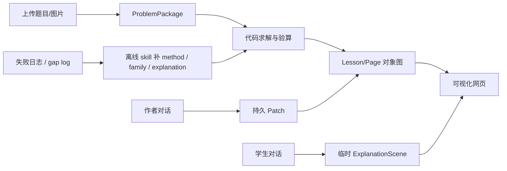

# 在线服务开发计划

当前状态：**Phase 0，对象图与在线底座阶段**。

目标不是继续让 skill 直接生成题目网页，而是把题目、解题、网页、对话都沉淀为一个可校验、可版本化、可局部编译的数学教学对象图。

## 核心原则

- LLM 在线只做三类事：抽取 `ProblemIR/DiagramIR`、规划解题路线、选择 patch 或解释模板。
- 代码负责计算、编译、执行、验算、局部刷新和版本管理。
- method / family / explanation 能力缺失时，线上记录 gap log，离线用 skill 补能力。
- 网页不是最终事实源；网页由结构化对象图编译而来。

## 总体链路



## Phase 0：对象图与在线底座

先定义 `ProblemPackage`，让后续生成、修改、学生对话都复用同一套对象。

建议对象：

- `ProblemIR`：结构化题意事实。
- `DiagramIR`：图片和图形识别结果，带来源与置信度。
- `SolvePlan`：解题路线，不保存裸答案。
- `TraceNode`：代码执行后的推导节点。
- `MethodSpec / FamilySpec`：可执行数学能力与题型策略。
- `MethodExplanationSpec / FamilyExplanationSpec`：可实例化解释模板。
- `LessonIR / PageIR`：教学网页结构。
- `ArtifactPatch`：作者修改网页时产生的持久补丁。
- `ExplanationScene`：学生提问时产生的临时动画讲解。

Phase 0 还需要完成：

- 账号、项目、题目、版本的基础模型。
- solver / planner / validator / unsupported 的结构化日志。
- gap log 队列，用于离线补 method、family、schema、解释模板。
- 前后端 API 边界：对象图读写、版本发布、预览编译、局部刷新。

## Phase 1：上传题目生成可视化网页

面向老师或内容生产者，提供在线上传题目图片/文字并生成可视化网页的服务。

链路：

```text
上传题目
  -> LLM 抽取 ProblemIR / DiagramIR
  -> family match
  -> LLM 规划 SolvePlan
  -> 代码执行 method
  -> checks / trace
  -> 生成 LessonIR / PageIR
  -> 编译预览网页
```

验收重点：

- 先支持少量高质量题型，不追求泛化。
- 失败时返回明确原因：识别不确定、缺 family、缺 method、plan validation failed。
- 每个失败样本都能进入离线补能力流程。

## Phase 2：作者对话修改网页

生成后如果网页不符合预期，作者可以和网页对话修改。

建议产品上保留语音入口，但工程内核先以文字 turn 为核心：

```text
语音输入 -> ASR -> normalized text -> patch planner
文字输入 -> normalized text -> patch planner
```

LLM 生成的是持久 `ArtifactPatch`，例如：

- 修正题意或图片识别。
- 修改图形对象、辅助线、标注。
- 拆分或合并教学步骤。
- 调整讲解文本。
- 在已有 method 中重新选择或重排步骤。

LLM 不直接修改 method 代码、HTML、CSS、JS、裸答案或 validator。

体验目标：后端校验 patch 后只重算受影响对象，前端局部刷新对应步骤、图形和导航。

## Phase 3：学生和网页对话引导

学生对话不是修改网页，而是实时生成临时 `ExplanationScene`。

链路：

```text
学生问题
  -> 定位当前 step / trace node / method
  -> 选择 MethodExplanationSpec 或 FamilyExplanationSpec
  -> 代入当前题上下文
  -> 编译 ExplanationScene
  -> 前端播放动画、板书、语音
```

系统目标是引导学生自己思考，而不是直接给答案。

学生拍照搜题建议先做“匹配已有题目”；匹配不到时再生成临时 `ProblemPackage`，并保留低置信度标记。

## Phase 4：学生记忆与专项推荐

在学生对话和练习数据稳定后，再加入长期记忆。

需要建设：

- `StudentState`
- `KnowledgeNode`
- `MistakePattern`
- `MasteryModel`
- `PracticeSet`
- `RecommendationPolicy`

记录的不只是做错哪题，而是学生卡在哪个 method、看过几层提示、是否理解关键知识点、是否需要专项练习。

这一步依赖系统化知识整理：

```text
年级 -> 单元 -> 知识点 -> 方法 -> 题型 -> 典型题 -> 变式题
```

## 当前优先级

当前只做 Phase 0：

1. 定义 `ProblemPackage` 与对象图版本模型。
2. 区分持久 `ArtifactPatch` 和临时 `ExplanationScene`。
3. 定义 gap log，服务离线 skill 补能力。
4. 定义 method / family explanation 模板的 v0 schema。
5. 明确线上 LLM、代码执行、离线 skill 的责任边界。
