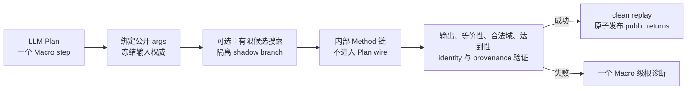
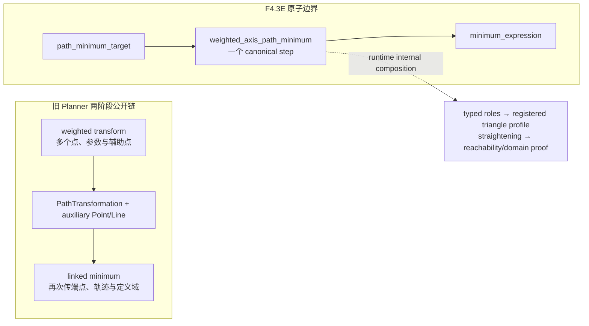

# 路径最值原子 Macro 设计

Macro 在 Annotated Plan 与 Scope replacement 中始终保持原子 step。现行 Retry 合同见
[FunctionalPlan Scope Retry](functional-scope-retry-design.md)。

状态：**F5-F4.1–F5-F4.3F 已完成**。路径最值只向 Planner 暴露四个原子 Macro；旧的
降维、轨迹、拉直、candidate 和 `PathTransformation` 能力只保留为 kernel 私有数学
实现，不再注册为 Method/Recipe、进入 catalog/Schema/fixture/few-shot，或投影到
Plan/Retry。Macro 不得透明展开为 Planner-authored Function 子图。

统一运行时权威链见 [Method Solver 架构](method-solver-architecture.md) 与
[Capability authoring guide](capability-authoring-guide.md)。
本文只规定路径最值 Macro 的 Planner 边界、runtime 原子执行、retry 投影、family
迁移顺序与验收门禁。

## 1. 固定设计决策

以下边界不得逆向扩张：

1. Macro 对 LLM 与 canonical FunctionalPlan 是一个原子 step。
2. Macro 内部可以调用多个 Method、执行有界候选搜索并生成完整验证证据，但内部
   invocation 永不物化为 Planner-authored 或 retry-editable steps。
3. 不再引入 `FunctionalPlanFragment`、`ScopedDerivedBinding`、derived name、
   `MacroSemanticBlueprint` 的 LLM 投影或 `MacroExpansionRecord` 的 Planner wire。
4. 不新增 Macro 专用 Plan/Retry schema；Function 与 Macro 在 LLM Plan 中都使用同一
   个普通 capability step 结构。
5. 中间结果仍只有两种公开消费方式：匿名新结果使用 `StepResultRef`；写入题面已有对象
   使用现有 `output_targets`。Goal 答案继续使用 `answer_from`。
6. runtime 内部复杂性不得转化为 LLM 需要学习、回显或合并的协议复杂性。

“原子”只描述 Planner 边界，不表示 runtime 不验证。Macro 必须比普通黑箱拥有更严格的
候选隔离、数学 postcondition、clean replay、checkpoint 与 evidence 门禁。

## 2. 目标链路



Planner 只负责：

- 选择一个公开数学 capability；
- 填写该 capability 固定公开的 Entity、Fact 或允许的匿名结果参数；
- 用 `answer_from` 选择 Goal 答案 producer；
- Macro 失败时替换其所属 Goal 或 scope block。

Planner 不负责：

- 组装 Macro 内部 Method 调用；
- 传递 `PathTransformation`、`PathWitness`、`PathCandidate`、内部端点或辅助轨迹；
- 选择 StateVersion、runtime path、candidate winner 或 clean replay 策略；
- 编辑、冻结、重排或引用 Macro 内部 invocation；
- 解释 checkpoint、search signature 或内部证据对象。

## 3. LLM 公开契约

### 3.1 Catalog

一个 Macro 的 LLM-facing catalog 只允许投影：

```text
capability_id
title
use_when
do_not_use_when              # 只写数学适用性
args[]                       # name/domain_type/required/cardinality/role/allowed_refs
returns[]                    # name/type/binding/简短数学说明
```

不得投影：

```text
recipe_id / Method id / internal call graph
execution_mode / candidate provider / search budget / winner
runtime input slot / adapter / resolver / StateVersion
semantic blueprint / expansion dependencies / proof fragment
internal witness / checkpoint / provenance signature
```

LLM 不需要根据 `kind=function|macro` 改变 authoring 语法；两者都是一个普通 step。
实现来源与执行模式只属于代码。

### 3.2 Plan step

```json
{
  "step_id": "ii_path_minimum",
  "capability_id": "quadratic_square_path_minimum",
  "args": {
    "parabola": "parabola",
    "path_minimum_target": "fact_ii_path_target",
    "square": "fact_square_ABCD"
  }
}
```

Macro public return自然存在。后续步骤读取匿名结果，或读取声明
`reference_mode="exact_result"`的runtime精确结果时使用：

```json
{"step_id": "ii_path_minimum", "return": "minimum_expression"}
```

Goal 使用：

```json
{
  "answer_from": {
    "step_id": "ii_path_minimum",
    "return": "minimum_expression"
  }
}
```

不得为 Macro 增加 `return_bindings`、derived name、scope-local symbol 或第三种中间结果
引用形式。Macro 的结果 form 由公开 return contract 与 runtime 决定；路径 Macro 不要求
LLM 填写 `return_expectations`。

## 4. 参数与角色规则

每个 Macro 参数必须在定义时固定为以下两类之一：

1. **LLM-owned public arg**：数学选择确实会改变解法或产生非等价结果。该参数始终出现在
   catalog；必需时始终 `required=true`。
2. **code-owned hidden arg**：可由结构化 Fact、typed Context 或前序精确结果唯一机械推出。
   该参数永不出现在 catalog，由 F5-C / Macro preparation 绑定。

明确禁止：

- 因当前候选数为一而临时隐藏 public arg；
- 候选数变多时再动态恢复同一 arg；
- Schema 允许填写、Catalog 却省略该 arg；
- hidden role 同时作为 public return identity 的未公开来源；
- 用点名、顶点数组位置、Context 顺序或字符串相似度决定数学角色。

可选 role hint 只有在确实降低搜索成本、且错误 hint 可被 runtime 验证或纠正时才允许。
一旦公开，它必须在所有相同 family/context 投影中保持同一名称和可见性。优先用结构化
Fact 表达角色关系，减少裸 `moving_point/fixed_point` 参数。

## 5. Runtime 原子执行契约

复用现有 `MacroSpec`、`MacroImplementationRegistry`、`MacroPreparationAuthority`、
`MacroRuntimeSearchService`、transaction 与 checkpoint，不建立第二套 subplan runtime。

每次 Macro 调用必须满足：

1. 公开 args 与所有 code-owned inputs 在执行前完成 typed binding 并冻结。
2. `direct` Macro 只有一个确定调用图；`runtime_search` Macro 只搜索声明的有限机械候选。
3. 每个候选在 disposable branch 中执行完整内部 Method 链。
4. 候选必须通过 active return、runtime type、identity、数学等价、合法域、达到性、Goal
   closure 与 provenance 检查。
5. 只能选择唯一成功候选，或实际 public outputs 数学等价的多个成功候选。
6. 非等价多 winner 必须返回歧义诊断，禁止按 candidate id、调用数或符号复杂度静默选取。
7. winner 必须从干净 Context clean replay；shadow result/write 不得复制进正式事务。
8. 全部检查通过后才能一次性发布 public returns、Condition、StateVersion 与 evidence。
9. 任一内部 invocation 失败时整个 Macro 不产生公开部分结果，不产生 ghost write。
10. checkpoint 保存 winner、exact input authority、write/result signature；restore 不重新搜索、
    不重新选择 latest state。

允许内部复用通用距离、反射、构造、轨迹、表达式改写和验证 Method。共享的是确定性数学
原语与执行外壳，不是 Planner 可见的通用路径子图 DSL。

## 6. 诊断与 Retry

### 6.1 一个公开根诊断

Macro 内部可以在 debug artifact 中保存完整 candidate、Method 与 postcondition 记录；
Planner retry 只接收一个 Macro 级可操作根诊断，例如：

```json
{
  "code": "functional.macro_no_valid_candidate",
  "step_id": "ii_path_minimum",
  "capability_id": "quadratic_square_path_minimum",
  "message": "给定公开条件不能确定唯一有效的路径最值构造",
  "repair_action": "修正公开参数，或选择其他可用 capability"
}
```

不得把内部调用链投影成多个失败/blocked Planner steps。后续内部步骤的 blocked 状态只是
debug evidence，不是多个独立错误。

失败分类固定为：

- public arg、可见数学条件或非等价候选歧义：`planner_repairable`；
- 候选全部因公开数学前提不满足而失败：`planner_repairable`；
- Registry、binding authority、checkpoint、signature、contract drift、未知异常：
  `configuration/nonretryable`，不得消耗 LLM retry。

### 6.2 不新增 Macro repair 协议

不增加 `macro_repair_policies`、`repair_mode` 或“先修 Macro、下一轮才允许展开”的状态机。
Macro 失败仍使用 Scope replacement：

```text
Goal-owned Macro  -> 打开 Goal 的直接父 Scope
Scope-owned Macro -> 打开 Macro 的 owner Scope
开放 Scope        -> 完整替换 scope_steps + 全部直属 Goal body
```

LLM 可以保留 Macro 并修公开 args、改选另一个 Macro，或改用 catalog 已有 Functions；
但永远不能编辑 Macro 内部 invocation。关闭 Scope、child Scope、checkpoint 与 restore 由
代码保护，不要求 LLM 理解细粒度冻结或合并规则。

## 7. 证据、Explanation 与 Visual

Macro 原子性不降低数学可验证性。路径 Macro 必须生成内部 verified evidence，至少覆盖：

```text
原目标与改写目标
公开角色与 runtime chosen 角色
必要构造及其条件
路径/距离等价证明
合法域
最值策略
最小值表达式
达到点或达到条件
candidate search summary
source/provenance signature
```

证据保存在 `VerifiedFunctionalPlanExecution`、checkpoint 或 Explanation projection 的内部
payload 中，不成为 Planner public return。Explanation/Visual 从 verified evidence 生成
教学内容，不解析 LLM prose，也不要求 Planner 重现内部证明 steps。

## 8. 当前基线与遗留问题

F4.3C 当前已具备：

- per-call Macro preparation 与 bounded runtime search；
- shadow branch 隔离与 clean replay；
- finalized F5-C binding 与 typed Method input authority；
- transaction、checkpoint v3 与 restore signature；
- output allocation 与 companion output authority；
- 重名点 fail-loud 与生产 input selector 退役。
- `equal_length_ray_path_reduction` 固定只公开 path/equal-length/segment/ray 四个 Fact；
- `anchor/reference_point/ray_point/fixed_point` 永久由代码解析，不再动态改变 catalog；
- 结构上没有合法候选时返回 planner-repairable 根诊断，Registry/budget/未知错误仍为
  configuration；
- 该 Macro 只有一个 recipe/spec owner，公开 return 固定为 `minimum_expression`；
- 真实执行门禁覆盖失败 shadow 零 ghost write、非等价歧义、clean replay drift 与
  checkpoint restore 免重搜；
- transaction 向 Retry 投影时保留 Macro 错误的 `retryability`。
- `quadratic_square_path_minimum` 固定公开 `parabola`、`path_minimum_target`、
  `square` 三个输入以及 `minimum_expression`、`attainment_point` 两个输出；
- midpoint、square center、axis membership、side start、axis point、moving point 与
  fixed endpoint 全部由结构化题面关系解析，公开 Catalog 不含这些角色；
- M 一类固定端点按 `axis_x_intercept(of=parabola)` 定义确定，其坐标由当前 parabola
  状态计算，不通过点名或录制答案注入；
- 和平二模生产 Plan 已由公开 path chain 迁移为一个原子 Macro step；参数方程求解和最终
  题面点恢复仍作为独立 Goal steps 留在 Macro 外；
- Macro 内部只执行一个 kernel invocation，完成正方形降维、轨迹、拉直、距离、合法域和
  达到性验证，并原子发布两个 public returns 与 verified witness；
- Family catalog、recorded fixture、scope-native fixture 与 few-shot 已迁移到相同公开契约。

F4.3F 已物理删除旧 MethodSpec、兼容 capability pack、公开 recipe/compiler dispatch、
Explanation/Visual fallback 和孤儿注册；deterministic planner、recorded/scope-native
fixture、compile manifest 与 mechanism few-shot 均只使用原子 Macro。仍被三个 kernel
复用的数学实现已迁入 `runtime/methods/_internal/path/`，模块不再声明 `SPEC`，静态门禁
只允许三个 `*_path_minimum.py` kernel 导入它们，并要求每个内部 `method_id` 都存在原子
Macro tombstone。内部 trace 被 kernel 自有 trace 封装；任何私有 Path runtime type、
synthetic `#*-reflection` path 或 witness 若越过公开 output/retry projection 都会 fail loud。

## 9. 目标 Macro

### 9.1 Golden reference

`equal_length_ray_path_reduction` 保持公开 capability ID，并作为原子 Macro golden
reference。LLM 只提交结构化 path/equal-length/membership Facts；角色搜索、辅助构造、
SAS 等价、路径恒等式、合法域与达到性留在 runtime。

### 9.2 正方形路径

```text
quadratic_square_path_minimum

public input（固定且全部 required）:
  parabola: Function
  path_minimum_target: Fact[path_minimum_target]
  square: Fact[square]

public output:
  minimum_expression: MinimumExpression
  attainment_point: Point  # 降维后唯一正方形动点的取等坐标，身份由代码绑定

code-owned hidden input:
  midpoint_definition
  square_center
  axis_membership
  side_start
  axis_point
  moving_point
  fixed_endpoint

internal:
  正方形降维、轨迹恢复、反射/拉直、距离、合法域、达到性与 PathMinimumWitness
```

`quadratic_square_path_minimum_kernel` 是明确的 **internal composition boundary**。
它内部继续复用 `SquarePathDimensionReductionMethod`、
`BrokenPathStraighteningCandidatesMethod` 及 `PathTransformation` 状态；F4.3F 删除的是
这些类型和能力的 Planner-facing 暴露，不得误删 kernel 的私有组合依赖。kernel 内创建的
反射辅助 `PointRef` 同样只属于 shadow/runtime witness，不得进入 capability catalog、
Canonical/Annotated Plan 或公开 runtime outputs。

该 Macro 在 elaboration 与 runtime search 共用同一诊断族：public input 未唯一解析为
`functional.macro_search_public_input_invalid`，结构候选为零时为
`functional.macro_search_no_structural_candidate`，执行后无合法候选时为
`functional.macro_search_no_valid_candidate`，多条非唯一候选为
`functional.macro_search_ambiguous`。这些错误均保留发生阶段和候选数量，并统一投影为
planner-repairable；统计层不再使用 quadratic-square 专属别名。

这是“二次函数约束下，正方形结构中的三段路径最小值”题型能力，不是和平二模题号或
`HF+FM+MG` 的封装。候选解析只使用结构化关系：中点必须位于正方形一条边，中心必须属于
同一正方形，边上另一端点必须满足所选抛物线的轴关系，固定端点必须定义为该抛物线的
x 轴交点，原路径必须连通这些角色。顶点轮换、反向排列和点名变化不改变角色解析结果。

M 一类输入按两层权威处理：`axis_x_intercept` 定义来自 ProblemIR，具体坐标由 Macro 读取
当前 `parabola` 状态并计算。因此 LLM 不传 M，Macro 也不硬编码 M 的点名或坐标。

`attainment_point` 也不要求 LLM 猜测对象身份。角色搜索已经唯一确定降维后正方形动点，
所以 Planner 不为该 return 设置 `output_targets`；后续步骤直接使用
`{"step_id": "ii_path_minimum", "return": "attainment_point"}`。这一区分很重要：
Macro 返回的是降维后动点的取等状态，不一定就是当前 Goal 最终要求的题面点；最终点恢复仍在
Macro 外完成。

参数方程求解、把解代回题面点以及最终恢复其他题面对象不属于该 Macro；这些步骤继续在
Macro 外通过普通 `StepResultRef` 消费 `minimum_expression` 或 `attainment_point`。

### 9.3 两动点/标准路径

```text
coupled_segment_endpoint_replacement_path_minimum
single_moving_point_path_minimum

public input:
  path target、运动范围、绑定关系 Facts及必要Entity

public output:
  minimum_expression

internal:
  降维、轨迹恢复、端点替换、拉直、距离与达到性
```

南开不再由 LLM 传递 `PathTransformation` 或拼装拉直阶段。

### 9.4 加权路径

```text
weighted_axis_path_minimum

public input:
  path target、weight/binding、axis membership、dynamic constraint Facts

public output:
  minimum_expression

internal:
  加权三角形构造、辅助点/轨迹、等价性、合法域与达到性
```

`right_angle_equal_length_construct_and_select` 与 `curve_candidate_parameter_solve` 表达
独立的候选构造/筛选机制，继续保留为原子能力，不因名称相近并入路径 Macro。

## 10. 分阶段实施

### F4.3B：原子边界与 golden reference

状态：`COMPLETE`。

- 在测试中固定“一个 Macro = 一个 canonical Plan step”；
- 固定 Catalog/Schema/Retry 不含内部 step、blueprint、fragment、derived binding；
- 重写动态角色投影为固定 public/code-owned contract；
- 固化 `equal_length_ray_path_reduction` 的结构错误反馈、非等价歧义、ghost write、
  clean replay 与 restore 门禁；该 Macro 不公开 role hint；
- 只运行专项、L0 affected 与 L2 contract，不运行付费 live。

### F4.3C：和平二模正方形原子 Macro

- 状态：`COMPLETE`；
- 新增 `quadratic_square_path_minimum` 原子入口；
- 内部复用现有确定性 Method，不物化 generated Plan steps；
- 删除该 family 对公开 `square_path_dimension_reduction`、locus handoff 与
  `broken_path_straightening_minimum_expression` 的依赖；
- 固定三 public inputs、两 public returns 和七个 code-owned hidden roles；
- `attainment_point` 的 hidden `moving_point` identity 由代码自动绑定；LLM 猜测的
  `output_targets` 会在 elaboration 中丢弃，避免把降维后动点误绑为最终 Goal 答案点；
- 迁移 Family、recorded fixtures、scope-native fixture、few-shot 与教学 recipe；
- 离线 recorded 门禁通过后运行和平二模并行 live `1x3`。

当前验收记录：

- 受影响测试 `696 passed, 2 skipped`；Scope Retry/C0–C5 generated gate
  `82 passed`；
- 旧公开 square-path 子图的专用测试已物理删除，并由原子 Macro、旧能力不可见、加权
  family 不回归等新断言替代；
- live r3 为 `2/3`，唯一失败是 `required_goal_unbound(scope_id=ii)` 未打开 Scope；修复后
  已用原始 checkpoint 精确回放确认 `editable_scope_refs=(ii)`；
- live r4 三份均未收到 provider response，统一为 `APIConnectionError`，不计作产品失败；
- provider 恢复后的 r6 `1x1` 首轮通过：`4/4` Goal、`11/11` authority-valid step、transaction
  成功，且 identity leak、ghost write、retry drift 均为零；
- 最终 batch `f5-f4.3c-quadratic-square-release-1x3` 为 `3/3` completion、`3/3` transaction、
  `33/33` authority-valid step。sample-02/03 首轮通过；sample-01 首轮把 Macro 的
  `attainment_point` 错绑为 E，identity authority 正确拒绝后，`functional-scope-repair/v1`
  开放 Scope ii，将输出改绑 G 并由正方形关系求 E，第二轮通过；恢复 6 个调用且没有重执行。
  全批次 authority drift、ghost write、identity leak、configuration error 与未分类异常均为零。

### F4.3D：南开路径原子 Macro

- 状态：`COMPLETE`；
- 新增 `coupled_segment_endpoint_replacement_path_minimum` 原子入口；公开只接收
  `path_minimum_target + segment_binding_relation`，公开返回
  `minimum_expression + attainment_point`；
- 代码从所选两个 Fact 唯一解析 E/G、D/M/N/F、两条成员关系与保留动点 G；
- F 等由题面构造定义的固定端点仍先由普通 Function 在其 owner Scope 物化，随后
  作为 code-owned hidden state 进入 Macro；这不是公开路径子图；
- 内部 kernel 复用 `two_moving_points_path_reduction` 与 broken-path Method，但它们
  只处于 internal composition boundary，不生成 Planner/retry step；
- 取等点除了承载直线共线检查，还必须证明位于原动线段内；南开 witness 的线段参数
  为恒定 `t=2/3`；
- Family catalog、recorded Plan、scope-native fixture、compile manifest、few-shot、
  explanation recipe 与 witness 已迁移；旧两阶段 capability 不再向南开 Planner 暴露；
- 当固定端点 state 缺失时，诊断给出对象与 `required_scope_ref`，Scope Retry 开放
  构造点所属祖先 Scope，不再诱导 LLM 在多个子 Scope 重复构造；
- scope-native few-shot selector 优先匹配当前 runtime-search Macro，并把实际
  `example_id + asset_sha256` 写入只读 selection sidecar。

当前验收记录：

- 受影响离线门禁 `595 passed, 2 skipped`；few-shot/Scope 专项补充门禁
  `64 passed`；本轮 fixed-form normalization、统一 smoke few-shot 与 repair
  canonicalization 受影响模块并行门禁另为 `455 passed`，最终专项为 `78 passed`；
- 初次 live 暴露“F 未物化却只开放 ii_1/ii_2”的错误修复范围，导致重复 N producer
  和 `runtime_source_path_drift`；修复后缺失 state 会打开 ii；
- 旧 batch `f5-f43d-nankai-release-1x3-r4` 使用了从南开 authored Plan
  匿名抽取的 `coupled_segment_path_minimum`；它可用于同机制诊断，但不得作为
  release 泛化证据；
- release smoke harness 现固定五题共享 synthetic
  `quadratic_constraints_vertex`，不再按当前题选择同题机制 few-shot；
- fixed-form return 上误写的 `return_expectations` 会在 capability-bound Schema
  前确定性删除并记录 normalization，不再消耗一次 LLM wire feedback；Scope Repair
  candidate 也会在执行前经过与 Pass 1 相同的 content canonicalization；
- 公平验收 batch
  `f5-f43d-nankai-shared-fewshot-normalization-1x3-r2` 为 `3/3`
  completion、`3/3` transaction、`39/39` authority-valid step；三份均
  `pass1_wire_schema_valid=true`、`semantic_attempt_count=1`、`retry_attempt_count=0`；
- 三份实际 few-shot payload SHA-256 均为
  `d1fdcd478eb6edd5029369cfe185420f29345a1f35738f0860cb99167207f0bb`，其中不存在
  `coupled_segment*`、南开 problem id、路径目标或线段耦合关系。

### F4.3E：加权路径原子 Macro

状态：`COMPLETE`。

Planner 公开合同固定为：

```json
{
  "capability_id": "weighted_axis_path_minimum",
  "args": {"path_minimum_target": "..."},
  "returns": ["minimum_expression"]
}
```

题设给定的最小值和最终主参数不进入 Macro。后续仍由普通
`parameter_from_expression_value` 读取 `minimum_expression`、`minimum_value` 与
主参数 Symbol。曲线端点、轴上动点、固定端点、主参数、动点参数及两者定义域均为
code-owned role，不成为 LLM 参数。



实现结果：

- `path_minimum_target.terms` 现在无损保存每项 canonical endpoint handle 与 scale；
  `sqrt(2)` 和 `2` 分别选择已登记的等腰直角与 30°/60° 三角形 profile；
- runtime-search 只从 typed path graph 解析共享动点和两端点，再由对象状态解析唯一的
  主参数/动点参数及其约束；不读取点名、`aux` 子串或 Context 遍历顺序；
- kernel 内部复用旧 transform 与 linked minimum 作为 internal composition boundary，
  synthetic auxiliary `PointRef`、`PathTransformation`、locus 和内部 evidence 不进入
  Planner/Retry 或 public runtime outputs；
- 河西原旧链把仅在 `b>1/2` 可达到的直线垂足表达式当成全域最小值；新 kernel 将
  动点定义域闭包写成一个 `Piecewise` 最小值表达式，仍由外部参数求解得到 `b=2`；
- 西青输出保持等价的 `(b+3)(1+sqrt(3))`，但不再公开辅助点、轨迹或中间 Path 类型；
- Family catalog、两代 recorded Plan、scope-native fixture、compile manifest、MethodSpec、
  mechanism few-shot、Explanation recipe 与 witness 均已迁移；旧两步 capability 不再向
  河西/西青 Planner 暴露；
- 受影响离线门禁为 `804 passed`（并行 `67.70s`）；发布 batch
  `f5-f43e-weighted-atomic-release-1x3` 中河西 `3/3`、西青 `3/3`，六份均首轮通过、
  `57/57` authority-valid step、0 Retry、0 configuration/unclassified、0 ghost write、
  0 identity leak；
- 六份 live 均使用 shared synthetic `quadratic_constraints_vertex`，few-shot payload
  SHA-256 均为
  `d1fdcd478eb6edd5029369cfe185420f29345a1f35738f0860cb99167207f0bb`；其内容不含
  河西/西青题面或加权路径解法。

### F4.3F：Planner 协议与旧能力清理

- 状态：`COMPLETE`；
- prompt、catalog、dynamic schema、repair、fixture、compile manifest 与 few-shot 中的内部
  Path 类型和旧 capability 已归零；
- 旧 MethodSpec/Registry、recipe/compiler dispatch、Family pack/resolver、Explanation/
  Visual fallback 和孤儿注册已删除，visual marker 改为原子 Macro 语义命名；
- 旧数学 helper 物理迁入 `methods/_internal/path/` 并移除 `SPEC`；registry invariant 保证
  root method 的每个 `SPEC` 都已注册，private helper 的每个 `method_id` 都已登记 tombstone，
  import-lint 只允许三个原子 path kernel 依赖该目录；
- `functional.macro_inline_expansion_forbidden` 在 content compiler 与 elaborator 两层
  fail loud，不能通过绕开 prompt 来拼装旧子图；
- `PathTransformation`、candidate、synthetic auxiliary `PointRef` 和私有 witness 只允许
  存在于 kernel 内部组合边界；公开 runtime/retry projection 对私有 runtime type 与
  `#coupled-segment-reflection`、`#quadratic-square-reflection`、`#weighted-axis-triangle`
  字符串标记做递归审计，命中后直接报
  `functional.retry_runtime_output_projection_invalid`；
- 加权 kernel 的符号证明使用 `true/false/unknown` 三态；SymPy 无法证明时返回
  `functional.weighted_path_symbolic_proof_inconclusive`，不再静默当作 `false`。新增
  weight/profile/domain 必须补 kernel 代码与三态边界测试，不属于 Planner retry 或 prompt
  调优范围；
- Scope Retry 在 failed-step 与 root diagnostic 两条路径都读取代码给出的
  `expected.required_scope_ref`，再决定最小开放 Scope；
- deterministic planner 与三个 kernel 的公开 trace 都已收敛为一个原子 invocation。
- 最终 Planner-only batch `f5-f43f-atomic-path-release-5x3-20260829` 在共享 synthetic
  `quadratic_constraints_vertex` few-shot 下为 `15/15` completion、`15/15` transaction、
  `160/160` authority-valid step；21 个 semantic attempt 中 6 个 Scope Retry wire 全部合法，
  restore `34` 个调用且重执行为 `0`；configuration error、unclassified error、ghost write、
  authority drift 与 prompt identity leak 均为 `0`。
- 该 batch 的 prompt/raw response/Annotated Plan 中旧 Path 类型和 capability 名称命中为
  `0`；五题 few-shot payload SHA-256 均为
  `d1fdcd478eb6edd5029369cfe185420f29345a1f35738f0860cb99167207f0bb`。6 次 Retry 均来自
  普通题目建模或 Scope 引用修复，不是 Macro 内联、私有 Path 投影或 kernel 失败。

每个 family 独立提交、独立离线门禁、独立定向 live。禁止先建设一个会进入 Planner wire
的“通用路径子图内核”。

## 11. 硬门禁

```text
每个LLM-authored Macro canonical step数量 == 1
Macro内部generated Planner step数量 == 0
Planner/Retry可编辑Macro内部step数量 == 0
Planner wire derived binding / scope-local name数量 == 0
Planner prompt semantic blueprint / expansion metadata数量 == 0
Planner prompt internal Path types == 0（F4.3F最终）
Macro失败公开根诊断数量 == 1
runtime_search Macro缺失Registry实现数量 == 0
公开role hint的Macro错误hint唯一纠正成功率 == 100%（equal-length不公开hint）
非等价runtime ambiguity全部fail loud
shadow candidate ghost write == 0
winner clean replay drift == 0
restore重新搜索/重新选择latest次数 == 0
configuration/unclassified error == 0
每个family定向live通过
最终Planner-only 5x3在三轮内15/15通过
```

## 12. 当前下一步

路径 Macro 重构在 F4.3F 收口，下一阶段进入 **F5-F5 Teaching scope**：教学链只消费
verified execution 与 kernel evidence，把内部证明投影成讲解/图形步骤，但绝不反向生成
Planner-authored Macro 子步骤。F4.3F 没有新增 Plan/Retry wire 字段。
