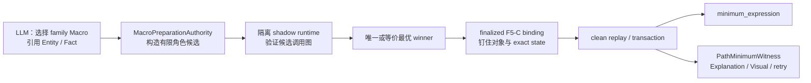

# 路径最值 Macro 重构

状态：F5-F4.1、F5-F4.2、F5-F4.2R 与 F5-F4.3A 已完成；下一项为
F5-F4.3B 共享路径运行时内核。

统一运行时权威链记录在
[F5-F4.2运行时权威收敛](problem-extraction-context-implementation-plan.md#f5-f4-2-runtime-authority-convergence)。
本文聚焦 Planner 可见的路径最值 Macro 契约、内部数学搜索，以及 F5-F4.3
的迁移顺序。

## 1. 目标边界

Planner 只负责选择高层数学能力，并引用题面中的 Entity 与 Fact；它不负责：

- 组装内部 Method 调用；
- 区分 Entity identity、latest state 或 exact result；
- 选择运行时状态版本；
- 传递 `PathTransformation`、辅助点或拉直端点；
- 决定反射、直达、端点等内部最值策略。

目标链路为：



LLM 给出的角色只是优先尝试的数学假设，不是 source authority。若存在唯一的
runtime-valid 替代项，代码可以纠正；若存在多个非等价的有效候选，则必须以
prompt-safe 诊断要求 LLM 消歧，不能静默猜测。

## 2. 已完成的基础

### 2.1 F5-F4.1：参考 Macro

`equal_length_ray_path_reduction` 已成为第一条完整竖切：

```text
四个结构化 Fact
  -> 有界角色搜索
  -> shadow runtime 验证
  -> winner clean replay
  -> minimum_expression + PathMinimumWitness
```

它证明了以下边界可行：

- 角色唯一时不向 LLM 暴露角色字段；
- 角色有歧义时只暴露候选受限的数学实体；
- 错误 hint 不进入最终 F5-C binding 或 provenance；
- 辅助构造、SAS 等价证明、合法域和最值点进入 witness，不进入 Plan；
- Explanation 与 Visual 从 verified witness 读取证据，不解析 trace 文本。

### 2.2 F5-F4.2：运行时权威收敛

Macro 搜索已经移动到 per-call F5-C finalization 之前：

```text
TypedExecutionGraph
  -> Macro pre-binding search
  -> MacroPreparationAuthority
  -> finalized FunctionalProblemCallBinding
  -> MethodInputReadAuthority
  -> derived v1 execution IR
  -> transaction / checkpoint v3 / VerifiedExecution
```

shadow 候选彼此隔离，winner 必须从干净分支重放；恢复时复用 checkpoint 中的
winner、exact input version 和 write signature，不重新搜索候选，也不重新选择
latest state。

### 2.3 F5-F4.2R：Method input selector 退役

生产 Method input 已不再通过字符串 selector 扫描 Context。当前单向链为：

```text
MethodInputBindingSpec(source | derivation)
  -> FunctionalProblemCallBinding
  -> MethodInputReadAuthority
  -> compiler 机械投影 runtime path
  -> MethodInputViewResolver
  -> Method
```

Entity、StateVersion、Condition、CallResult 和 Macro prepared role 均在 F5-C
阶段确定。compiler 与 runtime 缺少 typed authority 时 fail loud，不得回退到
`FunctionAdapterRegistry._select()`。

F4.3 仍需处理的相邻债务是：

- 四条 `MethodCompanionOutputSpec.target_selector/registration_selector` 字符串协议；
- standalone debug `equal_length_ray_point` 的平行角色推断；
- Path family 中仍存在的几何 helper 与公开内部 Path 类型；
- 尚未迁移的 Macro 当前必须保持 `direct`，不能提前宣称 `runtime_search`。

## 3. 当前能力清单

现有七个 `StepRecipeSpec` Macro：

1. `right_angle_equal_length_construct_and_select`
2. `curve_candidate_parameter_solve`
3. `two_moving_points_path_reduction`
4. `broken_path_straightening_and_select`
5. `path_minimum_by_straightened_distance`
6. `broken_path_straightening_minimum_expression`
7. `equal_length_ray_path_reduction`

另外三个 Method 实际承担了 Macro 级策略，也必须在同一阶段迁移：

1. `square_path_dimension_reduction`
2. `weighted_axis_path_triangle_transform`
3. `linked_broken_path_minimum_expression`

若只迁移七个已注册 Macro，而保留后三个 Planner-facing Method，
`PathWitness`、辅助点和内部连线仍会从另一入口泄漏到 Plan。

## 4. 中间类型边界

### 4.1 从 Planner wire 删除

以下类型只属于 Macro 内部执行证据：

- `PathTransformation` / `PathWitness`；
- `PathCandidate`；
- 没有题面身份的反射点、构造点和辅助点；
- `straightened_endpoint_1` / `straightened_endpoint_2`；
- 仅用于连接两个内部 Method 的运动轨迹；
- 内部 Method 的 call id、input name 与 return name。

它们不得出现在 Planner prompt、response schema、`FunctionalPlan` 或 repair wire。

### 4.2 保留公开数学结果

`MinimumExpression` 是可以被下游参数求解消费的匿名数学结果，因此保留
`StepResultRef`。所有高层路径 Macro 统一公开：

```text
minimum_expression: MinimumExpression
```

结果是 `open_expression` 还是 `closed_value` 由 runtime result form 决定，不再用
`path_minimum_expression`、`evaluated_path_minimum_expression` 等多个名字表达同一语义。

### 4.3 统一运行证据

每个路径 Macro 生成非 Planner-facing 的严格 witness：

```text
PathMinimumWitness
  original_objective
  reduced_objective
  role_resolutions
  constructions
  equivalence_proof
  legal_domain
  minimum_strategy
  minimum_expression
  minimizing_points
  attainment_checks
  macro_search_report
  provenance_signature
```

`FunctionalPlan` 只保存求解意图。实际输出与证据进入：

```text
VerifiedFunctionalPlanExecution
  canonical_plan
  plan / planning-context / revision authority
  checkpoint_id
  scope-shaped execution tree
    step status
    actual outputs
    typed evidence
```

retry 只接收裁剪后的 `PathMinimumPromptWitness`；Explanation 与 Visual 读取
verified witness，而不是把 witness 重新塞回 Plan。

## 5. 各 Macro 的目标输入输出

### 5.1 `right_angle_equal_length_construct_and_select`

当前：

```text
input:  right_angle_equal_length Fact
output: selected_target_point
```

目标：

```text
input:
  right_angle_equal_length Fact
  target Point（仅 Goal 无法唯一确定目标身份时）
  optional direction / quadrant / symbol constraint Facts

output:
  selected_point

internal:
  ConstructedPointWitness
```

候选构造与分支验证由 runtime search 完成，LLM 不选择象限实现路径。

### 5.2 `curve_candidate_parameter_solve`

当前：

```text
input:
  candidates: PointList
  parabola
  target_point
  point_on_curve Fact?
  symbol_constraint Fact?

output:
  selected_curve_point
  parameter_value?
  solved_parabola?
```

目标仍允许真正可复用的匿名 `PointList`，但常见的“构造候选再筛选”应封装为
family composite Macro：

```text
input:
  candidate-producing Fact 或 authenticated anonymous candidate result
  parabola Entity
  target Point
  point_on_curve Fact
  optional symbol constraint Fact

output:
  selected_curve_point
  parameter_value?
  solved_parabola?

internal:
  CurveCandidateSelectionWitness
```

### 5.3 两动点路径

当前公开 `two_moving_points_path_reduction -> PathWitness`，目标替换为：

```text
two_moving_points_path_minimum

input:
  path_minimum_target Fact
  moving-point membership Facts
  length/proportion binding Fact
  optional moving-point role hint

output:
  minimum_expression
  minimizing_configuration?（仅 Goal 明确询问时）

internal:
  path reduction
  locus recovery
  straightening
  endpoint construction
  distance / attainment proof
  PathMinimumWitness
```

`two_moving_points_path_reduction` 不再作为 Planner 可见的独立阶段。

### 5.4 拉直与距离

`broken_path_straightening_and_select` 目标是内部共享搜索引擎，不再有
Planner-facing 契约。

`path_minimum_by_straightened_distance` 目标是内部距离原语。只有当两个端点本身就是
题面数学输入时，才允许保留直接距离能力；公开返回统一为 `minimum_expression`。

### 5.5 单动点路径

当前 `broken_path_straightening_minimum_expression` 同时公开 scheme、辅助点、端点和
表达式。目标替换为：

```text
single_moving_point_path_minimum

input:
  path_minimum_target Fact
  moving-locus Fact
  optional moving-point role hint
  optional parameter Entity

output:
  minimum_expression
  minimizing_point?（仅 Goal 明确询问时）

internal:
  straightening candidates
  selected construction
  endpoints
  attainment proof
  PathMinimumWitness
```

### 5.6 正方形路径

当前 `square_path_dimension_reduction -> PathWitness`，目标替换为：

```text
square_relation_path_minimum

input:
  path target Fact
  square Fact
  midpoint Fact
  center Fact
  relevant locus Facts
  optional moving-point role hint

output:
  minimum_expression
  minimizing_configuration?（仅 Goal 明确询问时）

internal:
  square reduction
  locus derivation
  straightening
  distance / attainment proof
  PathMinimumWitness
```

### 5.7 加权路径

当前公开两步链：

```text
weighted_axis_path_triangle_transform
  -> auxiliary_point / path_transformation / auxiliary_locus

linked_broken_path_minimum_expression
  -> minimum_expression
```

目标合并为：

```text
weighted_axis_path_minimum

input:
  path_minimum_target Fact
  weight/binding Fact
  axis-membership Fact
  dynamic-constraint Fact
  optional moving/fixed role hints

output:
  minimum_expression

internal:
  weighted triangle construction
  auxiliary point / locus
  path equivalence
  linked minimum calculation
  PathMinimumWitness
```

题目给出的最小值仍应作为后续参数求解输入，不能冒充路径结构 Fact。

### 5.8 等长射线路径参考实现

`equal_length_ray_path_reduction` 保持公开 capability ID，输入固定为：

```text
path_minimum_target
equal_length_condition
point_on_segment
point_on_ray
```

四个 Fact 无法唯一确定结构时，才动态暴露：

```text
anchor
reference_point
ray_point
fixed_point
```

公开返回：

```text
minimum_expression
segment_minimizing_point / ray_minimizing_point（仅 Goal 需要时）
```

内部搜索角色、等长辅助点、SAS 与路径恒等式、直达/反射/端点候选、合法域与
可达性，并生成完整 `PathMinimumWitness`。

## 6. F5-F4.3 分段实施计划

F4.3 不一次性完成。每一段必须形成独立可回滚提交；未完成 Registry、lowerer、
postcondition 与 evidence builder 的 Macro 保持 `direct`，不能提前改为
`runtime_search`。


### 6.1 F4.3A：伴随输出权威（COMPLETE）

目标：先移除输出侧剩余的字符串分发协议，避免新 Macro 继续复制 input selector
已经退役的旧模式。

已完成：

- 四个固有伴随输出改由MethodSpec声明`emission=always`与
  `authority=return_allocation`，FunctionSpec只投影内部materialization policy；
- `MethodOutputWriteAuthority`按Function return key与唯一
  `FunctionalReturnAllocation`生成state或exact call-result destination，compiler只做机械lowering；
- transaction在执行前、运行结果产生后与commit后分别审计allocation、promote路径、
  runtime type、MathObject、scope和exact StateVersion；checkpoint v3保存authority payload与签名；
- family层重复companion声明、字符串target/registration selector、专用handle推断和
  standalone debug角色provider已物理删除；结构化等长射线候选只允许通过
  `macro_preparation`模块的owner入口构建。
- 等长射线角色上下文保留完整的`point label -> visible handles[]`权威；legacy路径文本
  真正引用重名点时稳定报`planner.macro_point_name_ambiguous`，不会把重名对象静默移出
  候选集。使用精确Point handle的结构化Fact不受展示标签重名影响。

`FunctionalOutputTargetSelectorSpec`继续保留：它负责Planner公开return的题面Entity消歧，
与已经删除的Method companion target/registration字符串分发不是同一层协议。

测试与提交：

```text
L0 affected
L2 contract
不运行付费 live
commit: refactor(solver): type companion output authority
```

### 6.2 F4.3B：共享路径运行时内核

目标：建立所有 Path Macro 共用的内部数学内核，先统一候选与 witness，再迁 family。

新增内部契约：

```text
PathObjective
MacroRoleAssignmentCandidate
PathAttainmentCandidate
StraighteningResult
PathMinimumWitness
```

固定区分：

- `MacroRoleAssignmentCandidate`：谁是动点、固定点、参考点等对象角色；
- `PathAttainmentCandidate`：直达、反射、端点等最值策略。

两类候选分别拥有 winner 与诊断，禁止共用模糊的 `candidate/search` authority。

实施内容：

- 内部化直达、反射、端点、拉直、距离、合法域与可达性检查；
- 收敛companion物理destination的机械派生：数学权威继续只来自return allocation，最终让
  promote path直接由allocation/projected write通用规则生成。F4.3A期间仍由transaction的
  compile前、runtime后和commit后三道审计阻止路径漂移；不得把promote path升级为数学权威。
- 将 `broken_path_straightening_and_select` 与
  `path_minimum_by_straightened_distance` 收为 kernel 内部步骤；
- 统一 public return 为 `minimum_expression`；
- 将 `right_angle_equal_length_construct_and_select` 和
  `curve_candidate_parameter_solve` 接入相同 shadow/clean replay 框架；
- Registry 统一拥有 candidate builder、validation policy、lowerer、postcondition
  与 evidence builder，transaction 不得按 Macro ID 分支。

测试与提交：

```text
kernel 单元测试 + L0 affected + L2 contract
现有未迁移 family 仍保持 direct
不运行全题 live
commit: refactor(solver): add shared path minimum runtime kernel
```

### 6.3 F4.3C：标准路径与两动点路径

目标：迁移 `quadratic_path_minimum` family，并优先解决南开题中 Planner 需要拼装
PathTransformation、端点和拉直步骤导致的超长输出。

公开能力：

```text
two_moving_points_path_minimum
single_moving_point_path_minimum
```

实施内容：

- Planner 只传 path target、运动约束/绑定 Fact、题面 Entity 与可选角色 hint；
- 降维、轨迹恢复、拉直、端点构造、距离与最值证明全部进入 Macro；
- `PathTransformation`、内部端点和 Method 连线不进入 prompt；
- family 的 Registry 实现完整后，原子地从 `direct` 切换为 `runtime_search`；
- 输出 `minimum_expression`，仅在 Goal 需要时公开 minimizing point/configuration。

测试与提交：

```text
L0 affected + L2 contract
南开定向 live 1x3
单 provider attempt 为目标
finish_reason=length 数量 == 0
commit: refactor(solver): migrate standard path minimum macro
```

### 6.4 F4.3D：正方形路径

目标：将 `quadratic_square_reflection_path_minimum` family 收敛为
`square_relation_path_minimum`。

实施内容：

- Macro 消费 square、midpoint、center、locus 与 path target Facts；
- 内部完成正方形降维、动点轨迹恢复、反射/拉直、端点与最值计算；
- LLM 的 moving-point hint 只影响候选顺序，唯一 runtime winner 可以纠正；
- witness 保存正方形关系、等价路径、最值策略与 minimizing configuration；
- 删除公开 `square_path_dimension_reduction` 与内部 Path witness 连线。

测试与提交：

```text
L0 affected + L2 contract
和平二模定向 live 1x3
错误动点 hint 自动纠正且 source binding drift == 0
commit: refactor(solver): migrate square path minimum macro
```

### 6.5 F4.3E：加权路径

目标：将两步公开链合并为 `weighted_axis_path_minimum`。

实施内容：

- 合并 `weighted_axis_path_triangle_transform` 与
  `linked_broken_path_minimum_expression`；
- 辅助点、辅助轨迹、三角形转换和 `PathTransformation` 全部进入 witness；
- public input 只保留 path target、weight/binding、axis membership、dynamic
  constraint Facts 与必要角色 hint；
- runtime 验证权重变换恒等式、合法域、候选可达性和最终表达式；
- 删除 compiler 中按点名、`aux` 子串或 Context 顺序寻找辅助对象的 helper。

测试与提交：

```text
L0 affected + L2 contract
河西或对应 weighted family 定向 live 1x3
内部辅助对象 identity 泄漏 == 0
commit: refactor(solver): migrate weighted path minimum macro
```

### 6.6 F4.3F：Planner 协议清理

目标：所有 family 迁移完成后，一次性删除 Planner wire 中的内部 Path 实现细节。

实施内容：

- 从 prompt、dynamic schema、catalog 与 repair wire 删除
  `PathTransformation`、`PathWitness`、`PathCandidate`、内部端点和 Method wiring；
- 删除旧公开 recipe、return alias、few-shot 旧写法和 debug bypass；
- 重写五份 fixture、few-shot 与 compile manifest；
- 静态门禁禁止生产 internal Path type、companion 字符串 selector、standalone role
  inference 和 Macro ID transaction 分支；
- Explanation / Visual 全部从 `VerifiedFunctionalPlanExecution` witness 读取路径证据。

测试与提交：

```text
L0 affected
L2 contract
L3 full
Planner-only live 5x3 --concurrency 15
commit: refactor(solver): retire planner path implementation wire
```

## 7. 分段原则与提交边界

每段都遵守以下规则：

1. 一个提交只改变一个权威边界或一个 family，不把共享 kernel 与 family 迁移混在一起。
2. Macro 只有在 candidate builder、validation policy、lowerer、postcondition、evidence
   builder 与 restore 全部接通后，才可声明 `runtime_search`。
3. shadow 候选只能读取 dependency envelope 内的 Entity、Fact 与 exact state；任意
   configuration/contract 异常必须 fail loud，不能伪装成“候选不通过”。
4. winner 确定后才生成最终 F5-C binding；authored hint 只能进入 search report。
5. clean replay 必须从干净 Context 重新执行，禁止复制 shadow write 或 result。
6. 每个 family 定向 live 通过后再迁下一个；只有 F4.3F 运行全量 L3 与 5x3。
7. 中间提交不得通过兼容 alias 让新旧公开 Path 契约同时长期存在。

## 8. 最终门禁

```text
Planner prompt internal Path types == 0
Planner-authored internal Method arguments == 0
production input selector == 0
production companion-output string selector == 0
standalone production role inference == 0
transaction Macro ID branch == 0
runtime_search Macro缺失Registry实现数量 == 0
wrong role hint唯一纠正成功率 == 100%
non-equivalent runtime ambiguity全部fail loud
shadow candidate ghost write == 0
winner clean replay drift == 0
restore重新搜索/重新选择latest次数 == 0
minimum_expression与witness provenance覆盖率 == 100%
Explanation无需解析LLM prose即可还原路径证明
定向family live全部通过
Planner-only 5x3在三轮内15/15通过
configuration / unclassified error == 0
```

## 9. 当前下一步

下一项实现是 **F4.3B 共享路径运行时内核**。F4.3A已经关闭输出侧字符串selector
与等长射线平行角色owner；后续Path family必须复用typed output authority，不能重新
引入按名称、类型或Context顺序选择输出对象的helper。
