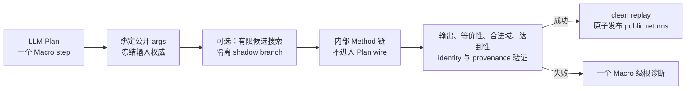

# 路径最值原子 Macro 设计

> 2026-08-27 更新：Scope Retry vNext R0–R5 已完成。Macro 在 Annotated Plan 与
> Scope replacement 中始终保持原子 step；文中对 `functional-goal-repair/v4` 的描述
> 仅用于解释已退役方案。现行 Retry 合同见
> [FunctionalPlan Scope-level Retry vNext](functional-scope-retry-vnext-design.md)。

状态：F5-F4.1、F5-F4.2、F5-F4.2R 与 F5-F4.3A 已完成。原 F4.3B
“透明 Macro 展开为普通 FunctionalPlan 子图”的实现已回滚；当前下一阶段是
**F5-F4.3B 原子 Macro 边界与参考实现固化**。

统一运行时权威链见
[F5-F4.2 运行时权威收敛](problem-extraction-context-implementation-plan.md#f5-f4-2-runtime-authority-convergence)。
本文只规定路径最值 Macro 的 Planner 边界、runtime 原子执行、retry 投影、family
迁移顺序与验收门禁。

## 1. 决策记录

2026-08-27 将代码直接回滚到 F4.3A 最后提交 `56500bb`。本轮重新设计作出以下
不可逆向扩张的决策：

1. Macro 对 LLM 与 canonical FunctionalPlan 是一个原子 step。
2. Macro 内部可以调用多个 Method、执行有界候选搜索并生成完整验证证据，但内部
   invocation 永不物化为 Planner-authored 或 retry-editable steps。
3. 不再引入 `FunctionalPlanFragment`、`ScopedDerivedBinding`、derived name、
   `MacroSemanticBlueprint` 的 LLM 投影或 `MacroExpansionRecord` 的 Planner wire。
4. 不新增 Macro 专用 Plan/Retry schema；Function 与 Macro 在 LLM Plan 中都使用同一
   个普通 capability step 结构。
5. 中间结果仍只有两种公开消费方式：匿名新结果使用 `StepResultRef`；写入题面已有对象
   使用现有 `output_targets`。Goal 答案继续使用 `answer_from`。
6. runtime 内部复杂性不得转化为 LLM 需要学习、回显或合并的协议复杂性。

“原子”只描述 Planner 边界，不表示 runtime 不验证。Macro 必须比普通黑箱拥有更严格的
候选隔离、数学 postcondition、clean replay、checkpoint 与 evidence 门禁。

## 2. 目标链路



Planner 只负责：

- 选择一个公开数学 capability；
- 填写该 capability 固定公开的 Entity、Fact 或允许的匿名结果参数；
- 用 `answer_from` 选择 Goal 答案 producer；
- Macro 失败时替换其所属 Goal 或 scope block。

Planner 不负责：

- 组装 Macro 内部 Method 调用；
- 传递 `PathTransformation`、`PathWitness`、`PathCandidate`、内部端点或辅助轨迹；
- 选择 StateVersion、runtime path、candidate winner 或 clean replay 策略；
- 编辑、冻结、重排或引用 Macro 内部 invocation；
- 解释 checkpoint、search signature 或内部证据对象。

## 3. LLM 公开契约

### 3.1 Catalog

一个 Macro 的 LLM-facing catalog 只允许投影：

```text
capability_id
title
use_when
do_not_use_when              # 只写数学适用性
args[]                       # name/domain_type/required/cardinality/role/allowed_refs
returns[]                    # name/type/binding/简短数学说明
```

不得投影：

```text
recipe_id / Method id / internal call graph
execution_mode / candidate provider / search budget / winner
runtime input slot / adapter / resolver / StateVersion
semantic blueprint / expansion dependencies / proof fragment
internal witness / checkpoint / provenance signature
```

LLM 不需要根据 `kind=function|macro` 改变 authoring 语法；两者都是一个普通 step。
实现来源与执行模式只属于代码。

### 3.2 Plan step

```json
{
  "step_id": "ii_path_minimum",
  "capability_id": "square_relation_path_minimum",
  "args": {
    "path_target": "fact_ii_path_target",
    "square_relation": "fact_square_ABCD"
  }
}
```

Macro public return 自然存在。后续步骤读取匿名结果时使用：

```json
{"step_id": "ii_path_minimum", "return": "minimum_expression"}
```

Goal 使用：

```json
{
  "answer_from": {
    "step_id": "ii_path_minimum",
    "return": "minimum_expression"
  }
}
```

不得为 Macro 增加 `return_bindings`、derived name、scope-local symbol 或第三种中间结果
引用形式。Macro 的结果 form 由公开 return contract 与 runtime 决定；路径 Macro 不要求
LLM 填写 `return_expectations`。

## 4. 参数与角色规则

每个 Macro 参数必须在定义时固定为以下两类之一：

1. **LLM-owned public arg**：数学选择确实会改变解法或产生非等价结果。该参数始终出现在
   catalog；必需时始终 `required=true`。
2. **code-owned hidden arg**：可由结构化 Fact、typed Context 或前序精确结果唯一机械推出。
   该参数永不出现在 catalog，由 F5-C / Macro preparation 绑定。

明确禁止：

- 因当前候选数为一而临时隐藏 public arg；
- 候选数变多时再动态恢复同一 arg；
- Schema 允许填写、Catalog 却省略该 arg；
- hidden role 同时作为 public return identity 的未公开来源；
- 用点名、顶点数组位置、Context 顺序或字符串相似度决定数学角色。

可选 role hint 只有在确实降低搜索成本、且错误 hint 可被 runtime 验证或纠正时才允许。
一旦公开，它必须在所有相同 family/context 投影中保持同一名称和可见性。优先用结构化
Fact 表达角色关系，减少裸 `moving_point/fixed_point` 参数。

## 5. Runtime 原子执行契约

复用现有 `MacroSpec`、`MacroImplementationRegistry`、`MacroPreparationAuthority`、
`MacroRuntimeSearchService`、transaction 与 checkpoint，不建立第二套 subplan runtime。

每次 Macro 调用必须满足：

1. 公开 args 与所有 code-owned inputs 在执行前完成 typed binding 并冻结。
2. `direct` Macro 只有一个确定调用图；`runtime_search` Macro 只搜索声明的有限机械候选。
3. 每个候选在 disposable branch 中执行完整内部 Method 链。
4. 候选必须通过 active return、runtime type、identity、数学等价、合法域、达到性、Goal
   closure 与 provenance 检查。
5. 只能选择唯一成功候选，或实际 public outputs 数学等价的多个成功候选。
6. 非等价多 winner 必须返回歧义诊断，禁止按 candidate id、调用数或符号复杂度静默选取。
7. winner 必须从干净 Context clean replay；shadow result/write 不得复制进正式事务。
8. 全部检查通过后才能一次性发布 public returns、Condition、StateVersion 与 evidence。
9. 任一内部 invocation 失败时整个 Macro 不产生公开部分结果，不产生 ghost write。
10. checkpoint 保存 winner、exact input authority、write/result signature；restore 不重新搜索、
    不重新选择 latest state。

允许内部复用通用距离、反射、构造、轨迹、表达式改写和验证 Method。共享的是确定性数学
原语与执行外壳，不是 Planner 可见的通用路径子图 DSL。

## 6. 诊断与 Retry

### 6.1 一个公开根诊断

Macro 内部可以在 debug artifact 中保存完整 candidate、Method 与 postcondition 记录；
Planner retry 只接收一个 Macro 级可操作根诊断，例如：

```json
{
  "code": "functional.macro_no_valid_candidate",
  "step_id": "ii_path_minimum",
  "capability_id": "square_relation_path_minimum",
  "message": "给定公开条件不能确定唯一有效的路径最值构造",
  "repair_action": "修正公开参数，或选择其他可用 capability"
}
```

不得把内部调用链投影成多个失败/blocked Planner steps。后续内部步骤的 blocked 状态只是
debug evidence，不是多个独立错误。

失败分类固定为：

- public arg、可见数学条件或非等价候选歧义：`planner_repairable`；
- 候选全部因公开数学前提不满足而失败：`planner_repairable`；
- Registry、binding authority、checkpoint、signature、contract drift、未知异常：
  `configuration/nonretryable`，不得消耗 LLM retry。

### 6.2 不新增 Macro repair 协议

不增加 `macro_repair_policies`、`repair_mode` 或“先修 Macro、下一轮才允许展开”的状态机。
Macro 失败仍使用现有 owner replacement：

```text
Goal-owned Macro  -> 完整替换该 Goal 的 steps + answer_from
Scope-owned Macro -> 替换 repair authority 给出的 scope editable block
```

LLM 可以保留 Macro 并修公开 args、改选另一个 Macro，或改用 catalog 已有 Functions；
但永远不能编辑 Macro 内部 invocation。Solved Goal 与 frozen producer 继续由代码保护，
不要求 LLM 理解 Macro 内部冻结或 merge 规则。

## 7. 证据、Explanation 与 Visual

Macro 原子性不降低数学可验证性。路径 Macro 必须生成内部 verified evidence，至少覆盖：

```text
原目标与改写目标
公开角色与 runtime chosen 角色
必要构造及其条件
路径/距离等价证明
合法域
最值策略
最小值表达式
达到点或达到条件
candidate search summary
source/provenance signature
```

证据保存在 `VerifiedFunctionalPlanExecution`、checkpoint 或 Explanation projection 的内部
payload 中，不成为 Planner public return。Explanation/Visual 从 verified evidence 生成
教学内容，不解析 LLM prose，也不要求 Planner 重现内部证明 steps。

## 8. 当前基线与遗留问题

F4.3A 已具备：

- per-call Macro preparation 与 bounded runtime search；
- shadow branch 隔离与 clean replay；
- finalized F5-C binding 与 typed Method input authority；
- transaction、checkpoint v3 与 restore signature；
- output allocation 与 companion output authority；
- 重名点 fail-loud 与生产 input selector 退役。

仍需处理：

1. `PathTransformation`、`PathWitness`、`PathCandidate`、内部端点和轨迹仍进入当前 Planner
   catalog、schema、fixture 与 recipe chain。
2. 南开仍要求 LLM 拼接“两动点降维 -> 拉直求最值”。
3. 和平二模仍要求 `square_path_dimension_reduction -> locus -> broken path`，并恢复了已知
   `PathTransformation` moving-object identity 风险。
4. 河西/西青仍要求 `weighted_axis_path_triangle_transform -> linked minimum`。
5. 只有 `equal_length_ray_path_reduction` 是完整 `runtime_search` 参考 Macro；其他未迁
   Macro 必须保持 `direct`。
6. contextual catalog 当前仍会在动态角色只有一个候选时删除该参数，必须改为固定的
   public/code-owned 参数规则。
7. debug writer 的真实逐 attempt 保存、自由符号 basis 的 planner-repairable 诊断属于
   独立通用缺陷；回滚后仍需重新实现，但不得借机增加 Macro wire。
8. `functional-goal-repair/v4` 自身仍有 status、editable/frozen、三类 replacement map、
   opaque ID 与 `return_expectations` 等复杂性；它们属于独立 Retry 简化阶段，不与原子
   Macro 迁移捆绑。

## 9. 目标 Macro

### 9.1 Golden reference

`equal_length_ray_path_reduction` 保持公开 capability ID，并作为原子 Macro golden
reference。LLM 只提交结构化 path/equal-length/membership Facts；角色搜索、辅助构造、
SAS 等价、路径恒等式、合法域与达到性留在 runtime。

### 9.2 正方形路径

```text
square_relation_path_minimum

public input:
  path target Fact
  square / midpoint / center / locus Facts
  必要的题面 Entity
  固定可见性的 optional role hint（确有必要时）

public output:
  minimum_expression
  Goal确实需要的最终 minimizing result

internal:
  正方形降维、轨迹恢复、反射/拉直、距离、合法域与达到性
```

优先迁移该 family，以直接消除当前 `PathTransformation` identity 已知问题。

### 9.3 两动点/标准路径

```text
coupled_segment_endpoint_replacement_path_minimum
single_moving_point_path_minimum

public input:
  path target、运动范围、绑定关系 Facts及必要Entity

public output:
  minimum_expression

internal:
  降维、轨迹恢复、端点替换、拉直、距离与达到性
```

南开不再由 LLM 传递 `PathTransformation` 或拼装拉直阶段。

### 9.4 加权路径

```text
weighted_axis_path_minimum

public input:
  path target、weight/binding、axis membership、dynamic constraint Facts

public output:
  minimum_expression

internal:
  加权三角形构造、辅助点/轨迹、等价性、合法域与达到性
```

`right_angle_equal_length_construct_and_select` 与 `curve_candidate_parameter_solve` 表达
独立的候选构造/筛选机制，继续保留为原子能力，不因名称相近并入路径 Macro。

## 10. 分阶段实施

### F4.3B：原子边界与 golden reference

- 在测试中固定“一个 Macro = 一个 canonical Plan step”；
- 固定 Catalog/Schema/Retry 不含内部 step、blueprint、fragment、derived binding；
- 重写动态角色投影为固定 public/code-owned contract；
- 固化 `equal_length_ray_path_reduction` 的错误 hint、非等价歧义、ghost write、clean
  replay 与 restore 门禁；
- 恢复逐 attempt debug artifact 与清晰的自由符号诊断，但不修改 Macro wire；
- 只运行专项、L0 affected 与 L2 contract，不运行付费 live。

### F4.3C：和平二模正方形原子 Macro

- 新增 `square_relation_path_minimum` 原子入口；
- 内部复用现有确定性 Method，不物化 generated Plan steps；
- 删除该 family 对公开 `square_path_dimension_reduction`、locus handoff 与
  `broken_path_straightening_minimum_expression` 的依赖；
- 运行和平二模并行 live `1x3`。

### F4.3D：南开路径原子 Macro

- 迁移耦合线段端点替换与单动点路径；
- 删除 LLM-facing `two_moving_points_path_reduction -> broken path` 两阶段链；
- 运行南开并行 live `1x3`，检查每轮实际 few-shot ID/hash。

### F4.3E：加权路径原子 Macro

- 合并 weighted transform 与 linked minimum；
- 删除按点名、`aux` 子串或 Context 顺序寻找辅助对象的 helper；
- 运行河西/西青对应 family 并行 live。

### F4.3F：Planner 协议与旧能力清理

- 从 prompt、catalog、dynamic schema、repair、fixture 与 few-shot 物理删除内部 Path 类型；
- 删除旧公开 recipe/Method、compiler dispatch、Explanation/Visual fallback 和孤儿注册；
- 重写 compile manifest；
- 运行 L3 full 与 Planner-only `5x3 --concurrency 15`。

每个 family 独立提交、独立离线门禁、独立定向 live。禁止先建设一个会进入 Planner wire
的“通用路径子图内核”。

## 11. 硬门禁

```text
每个LLM-authored Macro canonical step数量 == 1
Macro内部generated Planner step数量 == 0
Planner/Retry可编辑Macro内部step数量 == 0
Planner wire derived binding / scope-local name数量 == 0
Planner prompt semantic blueprint / expansion metadata数量 == 0
Planner prompt internal Path types == 0（F4.3F最终）
Macro失败公开根诊断数量 == 1
runtime_search Macro缺失Registry实现数量 == 0
错误hint唯一纠正成功率 == 100%
非等价runtime ambiguity全部fail loud
shadow candidate ghost write == 0
winner clean replay drift == 0
restore重新搜索/重新选择latest次数 == 0
configuration/unclassified error == 0
每个family定向live通过
最终Planner-only 5x3在三轮内15/15通过
```

## 12. 当前下一步

下一项实现是 **F4.3B 原子边界与 golden reference**。先增加静态/契约门禁并修正
动态角色公开规则；不新增数学 Macro，不修改 LLM wire。该阶段通过后，首先迁移和平二模
`square_relation_path_minimum`。
