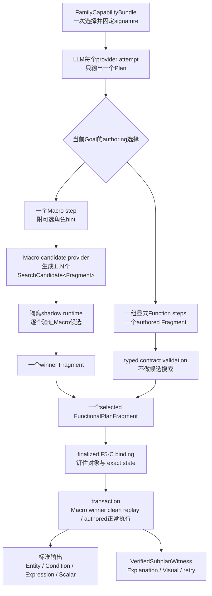
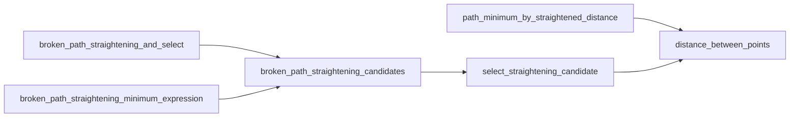
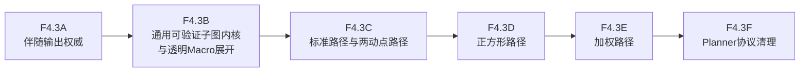

# 路径最值 Macro 重构

状态：F5-F4.1、F5-F4.2、F5-F4.2R与F5-F4.3A已完成；F5-F4.3B为
`IN PROGRESS`，当前子阶段是F5-F4.3B-R Runner Convergence；完成后再进入
F5-F4.3C标准路径与两动点路径。

统一运行时权威链记录在
[F5-F4.2运行时权威收敛](problem-extraction-context-implementation-plan.md#f5-f4-2-runtime-authority-convergence)。
本文聚焦 Planner 可见的路径最值 Macro 契约、内部数学搜索，以及 F5-F4.3
的迁移顺序。

## 1. 目标边界

Family识别只发生一次，并生成不可变的`FamilyCapabilityBundle`。该bundle以唯一的
`capabilities[]`保存`kind=function|macro`的公共能力；Macro Capability额外挂接semantic
blueprint及展开依赖。Macro失败后的Goal retry继续使用同一bundle和同一signature，不再执行
第二次“按Goal筛选Capability”。如果为控制prompt长度而分阶段展示Function Capability
schema，那只是同一bundle的projection，不是新的能力选择。

### 1.1 统一Capability术语

`Capability`是LLM-facing catalog entry的公共外壳，不是Function、Macro之外的第三种执行
对象。公共分类固定为：

```text
FunctionalCapability
  kind = function
    source = FunctionSpec
    implementation = MethodSpec / runtime Method

  kind = macro
    source = MacroSpec
    implementation = 1..N FunctionalPlanFragment candidates
```

- `Function Capability`表示一个可被LLM显式组合的确定性语义动作，当前通常由一个
  `FunctionSpec.method_id`lower为底层Method；
- `Macro Capability`表示成熟解法入口，可以通过blueprint和candidate provider展开为多个
  Function step组成的fragment候选；
- `Method`只属于runtime primitive层，不是Planner Capability kind，不直接进入prompt；
- “可组合语义Function”统一改称“可组合Function Capability”。它是
  `FunctionalCapability(kind=function)`的用途描述，不是第二份catalog或新的模型；
- 历史`CapabilityContractSpec.kind=method|recipe`只反映旧实现来源，与公共
  `FunctionalCapabilityKind=function|macro`重名冲突。F4.3B必须原子迁移为同一公共分类；
  若代码仍需记录实现来源，使用独立的内部字段，不得继续占用`kind`。

Planner默认优先选择高层数学能力，并引用题面中的Entity与Fact。已知Macro可以把成熟
解法压缩成一个step；LLM也可以使用同一份`FunctionalPlan content/v2`和同一bundle中的
Function显式组合解法。不存在第二套路径策略DSL，也不存在只供Macro理解的路径类型系统。

LLM 不负责：

- 组装带 runtime view、隐藏 target 或物理 path 的内部 Method 调用；
- 区分 Entity identity、latest state 或 exact result；
- 选择运行时状态版本；
- 传递内部 `PathTransformation`、runtime辅助端点或Method wiring；
- 重现 shadow、F5-C、checkpoint、winner clean replay 等执行机制。

改变数学思路的选择仍属于 LLM；同一思路内部有限、机械且可验证的角色排列、
直达、反射和端点变化属于 Macro/runtime；对象视图、状态版本和执行地址属于
compiler/runtime。

目标链路为：



“Macro与LLM生成同一种fragment”只表示两者最终交付相同的`FunctionalPlanFragment`结构，
不表示候选数量和选择生命周期相同。LLM每个provider attempt只author一个Plan：选择Macro
时，一个Macro step可由代码展开为1..N个有限候选；选择显式Function时，本轮只有一个
authored fragment，直接进入typed validation，不生成search report或winner tie-break。

Macro候选中的LLM角色hint只是优先尝试的数学假设，不是source authority。若存在唯一的
runtime-valid替代项，代码可以纠正；若存在多个非等价的有效候选，则必须以prompt-safe
诊断要求LLM消歧，不能静默猜测。显式Function fragment若数学验证失败，则进入下一次Goal
semantic retry，由LLM返回一个新的完整fragment；runtime不会在同一provider response中
替LLM创造第二套开放解法。

## 2. 已完成的基础

### 2.1 F5-F4.1：参考 Macro

`equal_length_ray_path_reduction` 在F4.1曾作为第一条完整竖切：

```text
四个结构化 Fact
  -> 有界角色搜索
  -> shadow runtime 验证
  -> winner clean replay
  -> minimum_expression + PathMinimumWitness
```

这里的`PathMinimumWitness`只描述F4.1退出时的历史形状，不是当前production。F4.3B已将
其表达内容迁到通用`VerifiedSubplanWitness`中的标准Entity、Condition、Expression、Scalar、
verification outcome与provenance记录，并物理删除旧类、schema和同步入口；Explanation/Visual
直接从通用证据投影教学字段，不再保留同名兼容模型。

它证明了以下边界可行：

- 角色唯一时不向 LLM 暴露角色字段；
- 角色有歧义时只暴露候选受限的数学实体；
- 错误 hint 不进入最终 F5-C binding 或 provenance；
- 一步Macro调用不要求LLM author辅助构造、SAS等价证明、合法域和最值点；它们进入
  witness。F4.3B后，同一数学链也必须能由LLM使用公开Function Capability显式展开为Plan fragment；
- Explanation 与 Visual 从 verified witness 读取证据，不解析 trace 文本。

### 2.2 F5-F4.2：运行时权威收敛

Macro 搜索已经移动到 per-call F5-C finalization 之前：

```text
TypedExecutionGraph
  -> Macro pre-binding search
  -> MacroPreparationAuthority
  -> finalized FunctionalProblemCallBinding
  -> MethodInputReadAuthority
  -> derived v1 execution IR
  -> transaction / checkpoint v4 / VerifiedExecution v2
```

shadow 候选彼此隔离，winner 必须从干净分支重放；恢复时复用 checkpoint 中的
winner、exact input version 和 write signature，不重新搜索候选，也不重新选择
latest state。

### 2.3 F5-F4.2R：Method input selector 退役

生产 Method input 已不再通过字符串 selector 扫描 Context。当前单向链为：

```text
MethodInputBindingSpec(source | derivation)
  -> FunctionalProblemCallBinding
  -> MethodInputReadAuthority
  -> compiler 机械投影 runtime path
  -> MethodInputViewResolver
  -> Method
```

Entity、StateVersion、Condition、CallResult 和 Macro prepared role 均在 F5-C
阶段确定。compiler 与 runtime 缺少 typed authority 时 fail loud，不得回退到
`FunctionAdapterRegistry._select()`。

F4.3A已经删除四条companion字符串selector和standalone debug角色provider。后续仍需处理：

- Path family 中仍存在的几何helper与公开内部Path类型；
- F4.1参考实现中的路径专用candidate/witness兼容模型必须迁入F4.3B通用外壳；
- 尚未迁移的Macro当前必须保持`direct`，不能提前宣称`runtime_search`。

## 3. 当前能力清单

现有七个 `StepRecipeSpec` Macro：

1. `right_angle_equal_length_construct_and_select`
2. `curve_candidate_parameter_solve`
3. `two_moving_points_path_reduction`
4. `broken_path_straightening_and_select`
5. `path_minimum_by_straightened_distance`
6. `broken_path_straightening_minimum_expression`
7. `equal_length_ray_path_reduction`

另外三个 Method 实际承担了 Macro 级策略，也必须在同一阶段迁移：

1. `square_path_dimension_reduction`
2. `weighted_axis_path_triangle_transform`
3. `linked_broken_path_minimum_expression`

若只迁移七个已注册 Macro，而保留后三个 Planner-facing Method，
`PathWitness`、辅助点和内部连线仍会从另一入口泄漏到 Plan。

### 3.1 五题端到端使用矩阵

以当前五份recorded FunctionalPlan及其compile manifest为权威基线，路径相关调用图为：

| 题目 | 当前公开调用链 | 实际内部Method链 | F4.3目标 |
|---|---|---|---|
| 南开一模 | `right_angle_equal_length_construct_and_select` -> `two_moving_points_path_reduction` -> `broken_path_straightening_minimum_expression` | 候选构造/筛选；两动点降维；拉直候选/选择/距离 | 保留构造Macro；后两段替换为`two_moving_points_path_minimum`，并提供通用`single_moving_point_path_minimum` |
| 河西一模 | `curve_candidate_parameter_solve` -> `weighted_axis_path_triangle_transform` -> `linked_broken_path_minimum_expression` | 曲线筛选/参数求解；加权三角形构造；联动折线最值 | 保留曲线筛选Macro；后两段合并为`weighted_axis_path_minimum` |
| 西青一模 | `weighted_axis_path_triangle_transform` -> `linked_broken_path_minimum_expression` | 与河西相同的两段加权路径链 | 合并为`weighted_axis_path_minimum` |
| 和平一模 | `equal_length_ray_path_reduction` | 等长辅助点构造 -> 距离计算，并由pre-binding search确定角色 | 保留公开capability ID，迁入F4.3B通用fragment与witness协议 |
| 和平二模 | `square_path_dimension_reduction` -> `broken_path_straightening_minimum_expression` | 正方形三段降维；拉直候选/选择/距离 | 合并为`square_relation_path_minimum` |

这五题证明了三种不同情况，不能统一按“名称相近”删除：

1. **真正的调用图重复**：拆分入口与合并入口表达同一串Method；
2. **公共边界过细**：两个不同数学阶段有先后依赖，但不应要求LLM传递内部Path结果；
3. **独立数学机制**：虽然也使用候选或距离，但适用结构和证明义务不同，应保留为独立Macro。

### 3.2 去重与退役矩阵

当前三条拉直能力存在严格的调用图包含关系：



即：

```text
broken_path_straightening_and_select
  = candidates + select

path_minimum_by_straightened_distance
  = distance_between_points

broken_path_straightening_minimum_expression
  = candidates + select + distance_between_points
```

因此退役分类固定为：

| 分类 | 旧能力 | 处理 |
|---|---|---|
| F4.3B可直接删除 | `broken_path_straightening_and_select` | 五题和few-shot均不消费，且已不向LLM公开；删除独立Recipe/compiler分支，底层通用Function按需保留 |
| F4.3B可直接删除 | `path_minimum_by_straightened_distance` | 只是`distance_between_points`的一层Macro别名；显式Plan直接调用Function Capability |
| F4.3C迁移后删除 | `two_moving_points_path_reduction` | 删除同名一Method Macro与策略Method；其数学证明拆为普通Function/predicate并由`two_moving_points_path_minimum`展开 |
| F4.3D迁移后删除 | `broken_path_straightening_minimum_expression` | C完成后只允许作为和平二模迁移期临时依赖；D完成后由`single_moving_point_path_minimum`/`square_relation_path_minimum`取代 |
| F4.3D迁移后删除 | `square_path_dimension_reduction` | 删除Planner-facing策略Method；正方形关系证明进入透明Macro fragment |
| F4.3E迁移后删除 | `weighted_axis_path_triangle_transform` | 与下一项共同被`weighted_axis_path_minimum`取代 |
| F4.3E迁移后删除 | `linked_broken_path_minimum_expression` | 删除策略Method边界；投影、距离和约束验证拆为通用Function/predicate |
| 保留并接入通用内核 | `right_angle_equal_length_construct_and_select` | 独立的候选构造与方向筛选机制，不属于路径拉直重复 |
| 保留并接入通用内核 | `curve_candidate_parameter_solve` | 独立的曲线候选筛选与参数闭合机制，不属于加权路径重复 |
| 保留公开ID | `equal_length_ray_path_reduction` | 当前完整pre-binding runtime-search参考实现；只替换内部专用模型，不删除语义入口 |

“删除”指删除旧Capability/Method契约和专用lowering，不是丢弃数学算法。中点、中位线、
直角三角形、距离等价、投影垂足和距离计算必须先提取为LLM与Macro都能使用的普通Function
Capability或predicate，再物理删除策略Method。禁止把旧Method改名后继续作为Macro黑箱。

除语义能力去重外，F4.3B还必须关闭声明层重复：同一`capability_id`只能有一个
`MacroDefinition`事实源。Capability pack与family-local不得各保存一份完整
`StepRecipeSpec`再依赖覆盖顺序合并；family差异只能通过蓝图参数、适用条件或bundle投影表达。

## 4. 中间类型边界

### 4.1 从 Planner wire 删除

以下题型专用类型和物理执行细节只属于 Macro 内部执行证据：

- `PathTransformation` / `PathWitness`；
- `PathCandidate`；
- `straightened_endpoint_1` / `straightened_endpoint_2`；
- 仅用于连接两个内部 Method 的运动轨迹；
- 内部 Method 的 call id、input name 与 return name。

它们不得出现在 Planner prompt、response schema、`FunctionalPlan` 或 repair wire。
没有题面身份并不意味着数学对象必须隐藏。LLM显式展开解法时，反射点、构造点、交点、
辅助直线和验证成功后发布的Condition可以使用普通基础数学类型，作为scope-local派生绑定
进入`FunctionalPlan`；被禁止的是路径题专用包装和内部Method连线，而不是中间数学对象本身。

### 4.2 公开结果只使用基础数学类型

最值表达式可以被下游参数求解消费，因此仍允许使用`StepResultRef`。现有wire暂时保留
`minimum_expression: MinimumExpression`，但`MinimumExpression`只是一层兼容的语义
角色标记，其runtime基础值仍是`Expression`或`Scalar`，不能据此继续增加
`PathObjective`、`PathEquivalence`、`AttainmentEvidence`等题型专用公共类型。

所有高层路径Macro当前统一公开：

```text
minimum_expression: MinimumExpression
```

结果是 `open_expression` 还是 `closed_value` 由 runtime result form 决定，不再用
`path_minimum_expression`、`evaluated_path_minimum_expression` 等多个名字表达同一语义。
新Function优先返回`Entity`、`Condition`、`Expression`、`Scalar`及其标准集合；题目中的
“最小值”“最大值”“轨迹”等含义由Function output role与Goal binding表达，不建立一套
对应每类题型的Python/JSON结果模型。

### 4.3 Scope-local派生数学对象

一个Function step产生的普通数学对象若会被后续step、retry、Explanation或Visual再次使用，
LLM应当为该return声明一个可读的scope-local变量名，而不是在每个消费者中重复书写
`StepResultRef`。这不是新的解题DSL，而是现有`return_bindings`增加一个通用的派生绑定
variant。目标wire形状为：

```json
{
  "call_id": "construct_G",
  "capability_id": "construct_point_on_ray_at_reference_distance",
  "args": {
    "anchor": {"ref": "C", "kind": "point"},
    "ray_point": {"ref": "D", "kind": "point"},
    "reference_point": {"ref": "B", "kind": "point"}
  },
  "return_bindings": {
    "point": {
      "ref": "G",
      "kind": "derived",
      "domain_type": "Point"
    },
    "distance_equality": {
      "ref": "CG_eq_CB",
      "kind": "derived",
      "domain_type": "Condition"
    }
  }
}
```

该声明在scope authority中形成通用`ScopedDerivedBinding`：

```text
ScopedDerivedBinding
  semantic_ref
  domain_type
  owner_scope
  origin = step_output
  producer_step_id / return_name
  problem_owned = false
  exact_result_authority
```

固定语义如下：

- `Point`、`Line`、`Function`、`Symbol`等Entity在Plan装配时获得scope-local
  `MathObject`身份，producer成功后才写入首个StateVersion；失败候选或失败transaction
  不得留下可见对象或ghost write；
- 谓词Function的Condition别名可以预先声明，但只有底层Method返回true且runtime按exact
  input authority验证成功后才注册Condition；Plan声明本身不能冒充数学事实；
- 下游step使用普通SemanticRef，例如`G`或`CG_eq_CB`。TypedExecutionGraph仍根据
  `producer_step_id + return_name`建立精确依赖，F5-C和checkpoint在sidecar中pin
  `CallResultId`、`StateVersionId`或`ConditionId`；名字只负责可读性，不拥有source authority；
- 派生绑定只在owner scope中producer之后及其后代可见，不向祖先或sibling泄漏。需要被多个
  sibling Goal共享的中间对象必须由LLM或Macro模板直接声明在它们的LCA scope，代码不得提升；
- 派生名不得与同scope或可见祖先中的ProblemIR Entity、Fact及其他派生绑定冲突。同名对象在
  不同sibling scope可以存在，但必须拥有不同的fully-qualified SemanticRef；
- retry保留frozen producer的派生身份和exact result；editable producer被替换时，其派生绑定
  随repair cone重新建立。checkpoint restore不得重新命名、重新找producer或重新选择latest；
- Macro模板使用的`aux_1`与LLM写出的`G`可以在canonicalization中做alpha-renaming。fragment
  等价比较依据scope、producer、return role、类型、Condition和runtime结果，不依据局部变量拼写；
- 真正一次性且不需要在数学叙述中出现的匿名值仍可使用`StepResultRef`。需要重复消费、进入
  retry诊断或进入Explanation/Visual的中间Entity/Condition应优先声明派生名。

和平一模显式fragment因此可以写成：

```text
construct_G.point             -> derived Point G
construct_G.distance_equality -> derived Condition CG_eq_CB
prove_congruence.condition    -> derived Condition CBN_congruent_CGM
derive_equal_side.condition   -> derived Condition BN_eq_MG
rewrite_objective.expression  -> derived Expression reduced_objective
intersect_OG_BC.point         -> derived Point P
verify_attainment.condition   -> derived Condition minimum_attained_at_P
```

后续Function直接引用`G`、`BN_eq_MG`、`reduced_objective`和`P`。Macro展开与LLM显式展开
都必须生成同一种派生绑定；它们的可读名字可以不同，但canonical authority和运行证据必须等价。

### 4.4 统一运行证据

F4.1历史实现曾为路径Macro生成非Planner-facing的`PathMinimumWitness`。当前实现已经改为
Macro winner与LLM显式子图共用`VerifiedSubplanExecution`和`VerifiedSubplanWitness`。
只有Macro/runtime candidate provider使用搜索外壳：

```text
VerificationOutcome
  passed
  predicate
  expected / observed
  diagnostic

SearchCandidate[TFragment]
CandidateEvaluation[TResult]
CandidateSearchReport[TResult]

VerifiedSubplanWitness
  verified_fragment
  actual_outputs[]
  published_conditions[]
  verification_outcomes[]
  provenance
  execution_signature
```

`TFragment`固定为普通`FunctionalPlanFragment`，`TResult`只由标准基础数学值和引用组成。
不得为路径最值、正方形、加权路径或后续特殊题型再定义新的candidate、evaluation或witness
外壳。Macro内部的角色选择、机械解法变化和达到方式都只是不同fragment payload，统一由
同一候选协议执行。LLM-authored fragment不进入候选集合；它只复用相同的typed contract、
predicate、transaction、Condition publication、checkpoint和witness assembler。

`FunctionalPlan` 只保存求解意图。实际输出与证据进入：

```text
VerifiedFunctionalPlanExecution
  canonical_plan
  plan / planning-context / revision authority
  checkpoint_id
  scope-shaped execution tree
    step status
    actual outputs
    typed evidence
```

retry只接收`VerifiedSubplanWitness`的prompt-safe摘要；Explanation与Visual从标准输出、
Condition和provenance生成领域展示，不把witness重新塞回Plan。现有
`PathMinimumPromptWitness`作为兼容projector逐步退役，不再向其他family复制。

## 5. 各 Macro 的目标输入输出

### 5.1 `right_angle_equal_length_construct_and_select`

当前：

```text
input:  right_angle_equal_length Fact
output: selected_target_point
```

目标：

```text
input:
  right_angle_equal_length Fact
  target Point（仅 Goal 无法唯一确定目标身份时）
  optional direction / quadrant / symbol constraint Facts

output:
  selected_point

internal:
  VerifiedSubplanWitness（标准Point与Condition输出）
```

候选构造与分支验证由 runtime search 完成，LLM 不选择象限实现路径。

### 5.2 `curve_candidate_parameter_solve`

当前：

```text
input:
  candidates: PointList
  parabola
  target_point
  point_on_curve Fact?
  symbol_constraint Fact?

output:
  selected_curve_point
  parameter_value?
  solved_parabola?
```

目标仍允许真正可复用的匿名 `PointList`，但常见的“构造候选再筛选”应封装为
family composite Macro：

```text
input:
  candidate-producing Fact 或 authenticated anonymous candidate result
  parabola Entity
  target Point
  point_on_curve Fact
  optional symbol constraint Fact

output:
  selected_curve_point
  parameter_value?
  solved_parabola?

internal:
  VerifiedSubplanWitness（标准Entity、Condition与Scalar输出）
```

### 5.3 两动点路径

当前公开 `two_moving_points_path_reduction -> PathWitness`，目标替换为：

```text
two_moving_points_path_minimum

input:
  path_minimum_target Fact
  moving-point membership Facts
  length/proportion binding Fact
  optional moving-point role hint

output:
  minimum_expression
  minimizing_configuration?（仅 Goal 明确询问时）

internal:
  path reduction
  locus recovery
  straightening
  endpoint construction
  distance / attainment proof
  VerifiedSubplanWitness
```

`two_moving_points_path_reduction` 不再作为 Planner 可见的独立阶段。

### 5.4 拉直与距离

`broken_path_straightening_and_select` 目标是内部共享搜索引擎，不再有
Planner-facing 契约。

`path_minimum_by_straightened_distance` 目标是内部距离原语。只有当两个端点本身就是
题面数学输入时，才允许保留直接距离能力；公开返回统一为 `minimum_expression`。

### 5.5 单动点路径

当前 `broken_path_straightening_minimum_expression` 同时公开 scheme、辅助点、端点和
表达式。目标替换为：

```text
single_moving_point_path_minimum

input:
  path_minimum_target Fact
  moving-locus Fact
  optional moving-point role hint
  optional parameter Entity

output:
  minimum_expression
  minimizing_point?（仅 Goal 明确询问时）

internal:
  straightening candidates
  selected construction
  endpoints
  attainment proof
  VerifiedSubplanWitness
```

### 5.6 正方形路径

当前 `square_path_dimension_reduction -> PathWitness`，目标替换为：

```text
square_relation_path_minimum

input:
  path target Fact
  square Fact
  midpoint Fact
  center Fact
  relevant locus Facts
  optional moving-point role hint

output:
  minimum_expression
  minimizing_configuration?（仅 Goal 明确询问时）

internal:
  square reduction
  locus derivation
  straightening
  distance / attainment proof
  VerifiedSubplanWitness
```

### 5.7 加权路径

当前公开两步链：

```text
weighted_axis_path_triangle_transform
  -> auxiliary_point / path_transformation / auxiliary_locus

linked_broken_path_minimum_expression
  -> minimum_expression
```

目标合并为：

```text
weighted_axis_path_minimum

input:
  path_minimum_target Fact
  weight/binding Fact
  axis-membership Fact
  dynamic-constraint Fact
  optional moving/fixed role hints

output:
  minimum_expression

internal:
  weighted triangle construction
  auxiliary point / locus
  path equivalence
  linked minimum calculation
  VerifiedSubplanWitness
```

题目给出的最小值仍应作为后续参数求解输入，不能冒充路径结构 Fact。

### 5.8 等长射线路径参考实现

`equal_length_ray_path_reduction` 保持公开 capability ID，输入固定为：

```text
path_minimum_target
equal_length_condition
point_on_segment
point_on_ray
```

四个 Fact 无法唯一确定结构时，才动态暴露：

```text
anchor
reference_point
ray_point
fixed_point
```

公开返回：

```text
minimum_expression
segment_minimizing_point / ray_minimizing_point（仅 Goal 需要时）
```

内部搜索角色、等长辅助点、SAS与路径恒等式、直达/反射/端点候选、合法域与可达性，
并将标准Point、Condition、Expression与验证结果组装进通用`VerifiedSubplanWitness`。
Explanation/Visual只从该通用证据生成展示projection，不再消费路径专用witness类型。

### 5.9 Macro 透明性与开放组合

Macro 是成熟解法的可复用快捷方式，不是系统唯一掌握该解法的黑箱。每个生产
Macro 必须满足 `Macro Transparency Contract`：

```text
MacroDefinition
  public_contract
  semantic_blueprint
  functional_plan_fragment_templates[]
  candidate_provider
  acceptance_contract
```

Family在进入Planner前只构造一次：

```text
FamilyCapabilityBundle
  family_id / bundle_signature
  capabilities[]                       # kind=function|macro的唯一事实源
  macro_blueprints_by_capability_id    # 只允许Macro Capability拥有
  expansion_dependency_closure

  derived indexes
    function_capability_ids
    macro_capability_ids
```

- `semantic_blueprint`向 LLM 公开适用结构、数学角色、构造步骤、保持量、证明义务、
  目标改写、最值达到策略、限制条件及可展开的Function Capability；
- `functional_plan_fragment_templates`使用现有 `FunctionalPlan content/v2` 的 step、
  arg、return 与 dependency 语义，不建立第二套 LLM DSL；
- Macro 生成的 fragment 与 LLM 直接生成的 fragment 必须进入同一个 typed compiler、
  `VerifiedSubplanExecution`、transaction、checkpoint 与 witness assembler；
- Macro 可在普通 prompt 中表现为一个 step，但不能把数学证明只藏在专用 lowerer、
  post-hoc witness builder 或 transaction 分支中；
- runtime authority、StateVersion、candidate hash、物理 path、shadow Context 与
  checkpoint signature 继续只属于代码，不进入 prompt。

适用结构必须按角色不变量描述，不能把参考题中的字母当作契约。例如等长射线路径的
结构是：

```text
segment_moving ∈ Segment(anchor, reference_point)
ray_moving ∈ Ray(anchor, ray_direction_point)
distance(anchor, ray_moving) = distance(anchor, segment_moving)
objective = distance(fixed_point, segment_moving)
          + distance(reference_point, ray_moving)
```

其中 `fixed_point` 是任意满足 scope 与状态权威的定点；和平一模中的 `O` 只是该角色
的一次绑定，不属于适用条件。线段端点交换、等式两边交换、目标项交换、图形旋转翻转
及点名变化由同一结构匹配器覆盖，不逐题声明变式。数学拓扑真正不同才建立不同的已知
候选provider。

已知结构与策略Registry只负责提供低成本候选，不构成可解题目的封闭白名单。若没有已知
候选，或已知候选全部以数学原因失败，Goal retry仍使用最初固定的
`FamilyCapabilityBundle`，让LLM改用其中的Function Capability组合新解法；不得再次运行Family、
Function或Macro Capability筛选。configuration、authority或checkpoint错误不得伪装成这一
fallback。

Function和Method也不能为路径题创造一套专用结果语言。公开证明链只使用基础数学对象：

```text
Entity
Fact / Condition
Expression / Scalar
standard collection
```

纯Method返回`bool`或基础数学值。例如距离等价验证Method返回`true/false`；只有返回
`true`时，runtime才根据已钉住的调用输入确定性发布标准
`Condition(Equality(Distance(...), Distance(...)))`，并记录scope与provenance。下游LLM
步骤消费该`ConditionRef`，而不是消费`DistanceEquality`或`PathEquivalence`专用对象。
构造步骤产生普通Entity及约束Condition；表达式改写产生普通Expression，并由等价性验证
发布标准Equality Condition。

因此参考Macro的完整展开仍能表示“构造辅助对象 -> 验证距离等价 -> 改写目标 -> 验证
结果与合法域”；LLM也可以改用参数化、旋转、反射或其他受runtime支持的Function形成新
fragment。若缺少可表达或验证某一步的通用原语，应报
`functional.proof_obligation_unsupported`，后续补通用能力，而不是增加题号或点名特判。

## 6. F5-F4.3 分段实施计划

F4.3 不一次性完成。每一段必须形成独立可回滚提交；未完成 Registry、lowerer、
postcondition 与 evidence builder 的 Macro 保持 `direct`，不能提前改为
`runtime_search`。



### 6.1 F4.3A：伴随输出权威（COMPLETE）

目标：先移除输出侧剩余的字符串分发协议，避免新 Macro 继续复制 input selector
已经退役的旧模式。

已完成：

- 四个固有伴随输出改由MethodSpec声明`emission=always`与
  `authority=return_allocation`，FunctionSpec只投影内部materialization policy；
- `MethodOutputWriteAuthority`按Function return key与唯一
  `FunctionalReturnAllocation`生成state或exact call-result destination，compiler只做机械lowering；
- transaction在执行前、运行结果产生后与commit后分别审计allocation、promote路径、
  runtime type、MathObject、scope和exact StateVersion；checkpoint v4保存authority payload与签名；
- family层重复companion声明、字符串target/registration selector、专用handle推断和
  standalone debug角色provider已物理删除；结构化等长射线候选只允许通过
  `macro_preparation`模块的owner入口构建。
- 等长射线角色上下文保留完整的`point label -> visible handles[]`权威；legacy路径文本
  真正引用重名点时稳定报`planner.macro_point_name_ambiguous`，不会把重名对象静默移出
  候选集。使用精确Point handle的结构化Fact不受展示标签重名影响。

`FunctionalOutputTargetSelectorSpec`继续保留：它负责Planner公开return的题面Entity消歧，
与已经删除的Method companion target/registration字符串分发不是同一层协议。

测试与提交：

```text
L0 affected
L2 contract
不运行付费 live
commit: refactor(solver): type companion output authority
```

### 6.2 F4.3B：通用可验证子图内核与透明 Macro 展开（IN PROGRESS；B-R统一runner待收口）

目标：先关闭“Macro拥有一套隐藏数学逻辑、LLM显式Plan只能调用不完备Method”的断层，
同时避免为路径最值、正方形、加权路径或未来题型创建专用candidate、result与witness
体系。Macro与LLM必须生成同一种可验证FunctionalPlan子图；Registry是成熟候选库，
不是未来题型与解法的封闭全集。

新增或收敛的通用契约：

```text
FamilyCapabilityBundle
MacroSemanticBlueprint
FunctionalPlanFragment
ScopedDerivedBinding
FunctionalCapabilityKind = function | macro
VerificationOutcome
SearchCandidate[TFragment]
CandidateEvaluation[TResult]
CandidateSearchReport[TResult]
VerifiedSubplanExecution
VerifiedSubplanWitness
```

`FunctionalPlanFragment`复用现有Plan step语义，只是一个Goal局部、可嵌入的代码侧模型，
不形成新的LLM wire。`SearchCandidate`只包装Macro/runtime generator产生的fragment、
dependency envelope与稳定signature；
`CandidateEvaluation`只记录通用验证结果和标准输出；`VerifiedSubplanWitness`只聚合标准
Entity、Condition、Expression、Scalar、provenance与diagnostic。泛型参数不能由新的题型
专用Python/JSON模型填充。

`ScopedDerivedBinding`是普通Plan return在scope树中的通用语义别名，不是路径题专用结果类型。
Entity输出获得scope-local MathObject身份，Condition输出在谓词验证成功后发布，Expression与
Scalar保留exact result authority。LLM后续使用SemanticRef读取这些变量；StepResultRef只作为
未命名值的wire形式以及F5-C/checkpoint中的精确producer证据。局部变量名不进入数学等价签名。

角色选择通过Macro公开参数或普通Entity binding表达；构造、变换、参数化、直达、反射、
端点等不同方案通过不同`FunctionalPlanFragment`表达。它们不再分别建立
`MacroRoleAssignmentCandidate`、`PathReductionCandidate`、`StraighteningResult`或
`PathAttainmentCandidate`。候选来源只能是Macro模板或声明式runtime generator，并全部进入
同一个搜索外壳。LLM显式步骤每个provider attempt只形成一个authored fragment，不包装为
Planner可见的候选数组；若底层为了复用执行器进行singleton包装，该包装不得产生search
authority、search report、tie-break或“自动尝试其他思路”的语义。

实施内容：

- 统一Capability命名与单一事实源：`FamilyCapabilityBundle.capabilities[]`保存全部
  Function/Macro Capability，`function_capability_ids`与`macro_capability_ids`只能从该数组
  派生；不得再维护独立`macros[]`、`semantic_functions[]`或第二份能力定义；
- `FunctionalCapability.to_prompt_payload()`显式输出必填`kind=function|macro`。Function与
  Macro共用`capability_id/title/use_when/args/returns`公共字段；只有Macro投影
  `semantic_blueprint`和候选展开说明，Function不得伪造Macro search元数据；
- 将历史`CapabilityContractSpec.kind=method|recipe`迁为
  `capability_kind=function|macro`，并让method contract projection产生`function`、recipe
  contract projection产生`macro`。若调试或lowering确实需要实现来源，使用内部
  `implementation_source=method|recipe`，该字段不得进入prompt、Plan wire或Capability签名；
- `FunctionalCapabilityKind`下沉到共享contracts并由family contract、FunctionSpec、
  MacroSpec、catalog、schema与prompt共用。旧`method|recipe` Capability kind直接拒绝，
  不保留alias；`FunctionSpec.method_id`和内部`RecipeSpec`名称继续表示实现引用，不改变
  已有`capability_id`或FunctionalPlan step；
- Family识别一次性建立`FamilyCapabilityBundle`，同时固定Function/Macro Capability、
  Macro blueprint、expansion closure与bundle signature；Pass 1和Goal retry不得重新筛选
  Capability，retry只允许改变同一bundle的prompt projection；
- 增加 `MacroSemanticBlueprint` 的catalog投影，完整公开适用结构、角色语义、构造、
  保持量、证明义务、目标改写、达到策略、限制条件和可展开Function Capability；描述按角色
  不变量生成，禁止把和平一模的`O/B/C/D/M/N`等示例字母固化为适用条件；
- 增加Macro expansion contract：已知Macro的每个候选必须展开为普通
  `FunctionalPlanFragment`，然后才进入统一typed compile、shadow、F5-C、clean replay、
  checkpoint与witness流程；禁止数学结论只存在于Macro ID专用lowerer或post-hoc adapter；
- 建立Macro单一事实源并删除pack/family-local的同ID完整声明副本；bundle只能投影
  `MacroDefinition`，不得依赖“family local覆盖pack recipe”的顺序产生最终契约；
- 物理删除五题和few-shot均未使用的`broken_path_straightening_and_select`与
  `path_minimum_by_straightened_distance` Recipe、专用compiler入口和catalog测试；前者的
  候选/选择逻辑进入通用fragment provider，后者由`distance_between_points` Function
  Capability取代；
- 增加scope-local派生绑定：Function return可声明`kind=derived`的Entity、Condition、
  Expression或Scalar变量。scope树记录其owner、producer与非ProblemIR来源，下游使用普通
  SemanticRef，typed sidecar继续pin exact result；禁止把未知Entity名称或拼写错误自动当成
  派生声明；
- 建立通用predicate执行协议：Method只返回`bool`或基础数学值；验证为true时由runtime根据
  exact input authority发布标准Condition，false时不发布Condition并返回结构化
  `VerificationOutcome`。禁止Function返回`DistanceEquality`、`PathEquivalence`、
  `ConstructionEvidence`等题型专用结果；
- 建立通用`VerifiedSubplanExecution`：Macro的1..N个候选共享隔离执行、非等价歧义、
  等价tie-break与winner clean replay；LLM-authored fragment不经过该搜索阶段。Macro winner
  与LLM-authored fragment共享selection、clean execution、witness、checkpoint和restore信封，
  但截至B阶段物理执行粒度仍不同：Macro由fragment runner一次执行selected fragment，LLM
  普通Function仍由主transaction按call执行。canonical Plan会在transaction前按scope/Goal
  owner声明一个多步LLM fragment边界，checkpoint只为该边界生成一个evidence，不再事后为
  N个call伪造N个单步fragment；把这份边界直接交给同一原子runner是进入F4.3C前的门禁；
- clean winner不再编译或执行历史Recipe：Macro的派生v1编译结果只包含公开return的
  publication envelope，`plans/replay_plans/method_output_authorities`均为空；shadow与clean两次
  执行都由`FunctionalPlanFragmentTransactionalRunner`逐个运行selected fragment中的普通
  Function。公开`minimum_expression`直接来自fragment export，最值搜索或达到性证明只能作为
  fragment中的验证Function，不能在fragment之外重算并覆盖结论；
- `FunctionalExecutionEvidence`只接受`VerifiedSubplanExecution/v2`。Macro使用
  `MacroSearchSelection`保存真实search report，LLM-authored Function使用
  `SingleFragmentSelection`且不伪造search report。历史`PathMinimumWitness`不再由transaction、
  checkpoint或retry构造/保存；Explanation与Visual需要旧教学字段时，只从通用selected
  fragment、verification、standard outputs和provenance确定性投影兼容视图；
- Macro无已知结构或全部候选以数学原因失败时，Goal retry直接在原
  `FamilyCapabilityBundle`中改用Function Capability显式组合，不得再次运行能力筛选；
- 收敛companion物理destination的机械派生：数学权威继续只来自return allocation，最终让
  promote path直接由allocation/projected write通用规则生成；不得把物理path升级为数学
  权威；
- Registry继续拥有candidate provider与验收contract，但prompt blueprint、fragment展开和
  runtime证据必须来自同一`MacroDefinition`可执行事实源；family不再保存同ID的本地
  `StepRecipeSpec`覆盖。迁移期仍保留三层非执行投影：pack recipe提供Planner-facing参数和
  return，`MacroSpec`提供typed catalog facade，presentation Recipe提供Explanation/Visual
  元数据。runtime-search Macro的`MacroSpec.search`必须直接引用Definition-owned contract并
  携带Definition signature，内部calls必须为空；这些投影壳不得拥有candidate builder、
  validator、fragment图或Method wiring。物理合并投影模型留到F4.3F，文档中的“单一事实源”
  只指单一可执行语义owner。transaction不得按Macro ID分支。

参考等价门禁：和平一模分别通过“一步调用`equal_length_ray_path_reduction`”与“显式展开
构造等长点、证明SAS距离等价、改写路径、证明折线路径最值”两条Plan完成；二者的最终
标准输出、发布Condition、对象authority、transaction、provenance及`VerifiedSubplanWitness`
必须runtime等价。临时从catalog移除该Macro后，recorded显式fragment仍须通过。

测试与提交：

```text
capability taxonomy / generic candidate / predicate publication / Macro blueprint / expansion equivalence专项
L0 affected + L2 contract
现有未迁移 family 仍保持 direct
不运行全题 live
commit: refactor(solver): add generic verified subplan kernel
```

验收状态：架构复审后的专项门禁额外验证了clean Macro无Recipe plan、Macro/LLM单一
`VerifiedSubplanExecution`信封、LLM同owner多步Function只形成一个预声明fragment evidence、
fragment export为标准输出权威、公共Capability kind仅为
`function|macro`、`MacroDefinition`与catalog签名一致，以及历史Path witness builder和
等长射线专用runtime recipe入口为0。旧`equal_length_ray_point`已从生产family、Capability
bundle、contract和typed binding中删除，只保留为显式v1 debug Method；presentation
RecipeSpec的`method_sequence`为空，不再构成第二份执行图。B阶段初次验收的L3 full为
`2427 passed`；复审收口后最终定向回归为`75 passed`、L0 affected为
`1576 passed, 57 deselected`、L2 contract为`2366 passed`，`git diff --check`通过；本轮未
重复运行L3或付费LLM冒烟。
复审后已物理删除无生产消费者的`PathMinimumWitness`、其schema/sync入口及测试专用
`search_segment_path_minimum`，lineage标签改为`verified_path_minimum_subplan`。尚未完成的
唯一B级架构项正式记为**F4.3B-R Runner Convergence**：LLM多步fragment的原子runner统一。
完成前F4.3B不得标记COMPLETE，也不得宣称“一步Macro与显式多步Plan从selected fragment
起使用同一物理执行路径”。

### 6.2.1 F4.3B-R：Runner Convergence 实现计划

#### 目标链路


B-R只收敛执行、提交、证据与恢复权威，不新增Planner DSL，不修改LLM-facing
`FunctionalPlan v3`、`functional-goal-repair/v5`或`FamilyCapabilityBundle`。Macro与LLM
仍有不同的选择生命周期：Macro先搜索1..N个候选，LLM只有一份authored fragment；二者从
`selected FunctionalPlanFragment`开始必须使用同一个transaction coordinator。

#### 1. Canonical Fragment Boundary

新增不可变契约：

```text
FunctionalPlanFragmentBoundary
  fragment_id
  source = macro | llm
  scope_id / semantic_owner_ref / repair_authority_ref
  member_step_ids[]
  external_dependency_ids[]
  export_bindings{}
  boundary_signature

FunctionalPlanFragmentBoundaryIndex
  plan_id / typed_graph_signature
  boundaries[]
  step_to_fragment{}
  index_signature
```

边界在TypedExecutionGraph完成后、任何runtime执行前确定：

- 一个Macro winner天然形成一个边界；候选搜索期间使用同一候选边界的临时signature，winner
  确定后才写入最终index；
- LLM Function按“同scope、同semantic owner、同repair authority”的Function-only依赖图划分
  最大弱连通分量；Macro节点、restore边界和不同owner都是硬分隔；
- 相互独立的Function不因为碰巧位于同一Goal而被捆成一个transaction；
- 每个Function step必须且只能属于一个边界，跨边界依赖只进入
  `external_dependency_ids`，sibling不可见边不得进入index；
- fragment内部保持typed graph拓扑序；forward reference、环、跨scope写入或一个step多owner
  在执行前fail loud；
- `fragment_id`由plan、owner、成员call identity和图结构生成；alpha-equivalence另由
  `FunctionalPlanFragment.fragment_signature`负责，二者不得混用。

新增稳定错误：

```text
planner.functional_fragment_boundary_invalid
planner.functional_fragment_owner_drift
planner.functional_fragment_dependency_drift
```

全部属于configuration error，不消耗semantic retry。

#### 2. Unified Preparation 与 F5-C

新增：

```text
PreparedFunctionalSubplan
  boundary
  selected_fragment
  selection_authority
  prepared_calls[]
  finalized_call_bindings[]
  exact_read_authorities[]
  output_write_authorities[]
  publication_authorities[]
  preparation_signature
```

- LLM fragment复用现有per-call F5-C ledger，但必须在整个fragment开始前完成所有外部source、
  exact StateVersion、Condition、CallResult、return allocation和destination finalization；
- fragment内部结果统一使用`InvocationResultReadAuthority`，producer未成功前不得物化；
- Macro shadow候选只消费`MacroCandidateBindingAuthority`允许的外部Entity、Fact和exact state；
  configuration/authority错误立即终止整个search，数学predicate为false才淘汰单个候选；
- Macro winner确定后，使用chosen role与winner fragment生成正式per-step F5-C binding；authored
  hint和失败候选不得进入binding、source units或provenance；
- clean replay和LLM执行都只接收`PreparedFunctionalSubplan`，coordinator不得重新查latest、扫描
  Context或推断output target。

#### 3. 单一 Transaction Coordinator

将当前主transaction中“prepare -> compile -> stamp -> Method execute -> closure -> commit”的
单call逻辑抽为不提交全局状态的`PreparedFunctionalStepTransactionService`。新增：

```text
FunctionalSubplanTransactionCoordinator
FunctionalSubplanStagedResult
FunctionalSubplanCommitBundle
```

执行规则：

1. 为整个fragment各创建一个`RuntimeContext.fork()`和`WorkingPlannerState.fork()`；
2. 按fragment拓扑序执行成员step，每步仍经过现有MethodInputReadAuthority、MethodOutputWriteAuthority、
   symbolic closure、predicate publication、StateFinalization和runtime equivalence probe；
3. 内部成功结果只写入fragment branch，供后续成员读取，不更新父WorkingState、全局CallResult索引、
   checkpoint或Goal状态；
4. 任一步失败时丢弃整个branch。先前成功成员标为`provisional_verified_rolled_back`，不得冻结、
   恢复或产生Condition/StateVersion/CallResult ghost write；
5. 全部成员成功后执行fragment-wide export、answer binding、object identity、Condition、closure、
   provenance和write-set审计；
6. 审计通过后以一个`FunctionalSubplanCommitBundle`原子合并Context、StateVersion、CallResult、
   Condition、symbol binding及per-call状态；合并签名漂移时报configuration error；
7. Macro shadow使用`mode=shadow`，永不提交；Macro winner clean replay和LLM selected fragment都
   使用`mode=clean`及同一commit实现；
8. call-level execution result继续作为fragment result的派生视图供Goal closure/debug使用，不能
   再拥有独立commit生命周期。

完成迁移后删除当前轻量`FunctionalPlanFragmentTransactionalRunner`；生产只保留
`FunctionalSubplanTransactionCoordinator`。禁止在`functional_subplan.py`中直接建立第二个
`InvocationExecutor`执行协议。

#### 4. Verified Execution 等价

`VerifiedSubplanExecution`继续使用v2，但新增确定性的数学等价projection：

```text
VerifiedSubplanEquivalenceProjection
  alpha_fragment_signature
  chosen_external_object_authorities
  exact_input_version_signatures
  standard_entities / standard_conditions / standard_results
  verification outcomes
  committed state/result/condition signatures
  semantic provenance signature
  equivalence_signature
```

- `MacroSearchSelection`与`SingleFragmentSelection`、候选失败记录、tie-break及authored名字不进入
  等价signature，因为它们描述来源而非数学执行结果；
- selected graph、Function顺序、公开及被消费的派生Entity/Condition、exact source、最终输出、
  state lineage和provenance必须等价；
- Macro与LLM的Condition均只从同一个predicate publication结果生成；false或未发布Condition不能
  出现在witness；
- 多个return重名继续使用`step_id.return`消歧，但alpha projection按producer角色比较，不因变量
  拼写不同而漂移；
- 门禁比较完整equivalence projection，不直接比较包含不同selection来源的原始JSON，也不能只
  比较`minimum_expression`。

`VerifiedSubplanExecution`必须由coordinator的clean result直接创建。删除checkpoint阶段的
`_llm_verified_subplan_execution()`和任何“先提交calls、再重建fragment evidence”的路径。

#### 5. Checkpoint v5 与 Retry

执行恢复协议升级为：

```text
functional-goal-execution-checkpoint/v5
functional-execution-restore-state/v2
```

Plan v3、repair v5、retry prompt context v4和Verified execution v2保持不变。restore state新增：

```text
FunctionalFragmentRestoreAuthority
  boundary payload/signature
  selected fragment/selection signature
  member call bindings与compiled authorities
  exact StateVersion / CallResult / Condition records
  commit bundle signature
  VerifiedSubplanExecution signature
```

- solved fragment作为整体恢复，不重新compile、搜索Macro候选、选择latest或逐call提交；
- restore逐项验证plan、typed graph、boundary、implementation、exact reads、writes、publication、
  commit bundle和VerifiedSubplan signature；任一漂移fail loud；
- failed/editable fragment丢弃旧preparation、partial evidence和provisional writes后重新执行；
- 一个失败fragment中的前缀成功step不能成为frozen producer；同Goal内其他已经原子提交且不在
  repair cone中的fragment仍可冻结；
- mixed-scope repair继续由现有step-level authority决定可编辑范围，但checkpoint只能按完整
  fragment恢复；若repair需要修改fragment内部任一步，则该fragment全体进入editable execution
  boundary，不能拼接新旧半个transaction；
- v4 checkpoint稳定报`planner.goal_checkpoint_version_unsupported`，不做hydrate兼容。

#### 6. 清理与静态门禁

物理删除：

- `_transaction_execution_evidence()`中的LLM事后聚合逻辑与`_llm_verified_subplan_execution()`；
- call循环中的独立commit分支；
- Macro专用fragment clean runner及任何只对Macro生效的Method执行旁路；
- checkpoint中的call-first、fragment-later证据装配；
- 允许一个fragment成员已提交、后续成员失败的兼容测试和fixture。

静态门禁要求：

```text
生产fragment executor/coordinator数量 == 1
LLM post-hoc VerifiedSubplan builder引用 == 0
Macro-only clean runner引用 == 0
fragment外独立call commit入口 == 0
checkpoint v4生产引用 == 0
```

#### 7. 分段提交与测试

建议使用三个可独立审查的提交：

1. `refactor(solver): declare canonical functional subplan boundaries`
   - 增加boundary index、partition oracle和equivalence projection；
   - production仍保持原执行路径，先验证五题边界稳定、无step遗漏或重复；
2. `refactor(solver): unify functional subplan transactions`
   - 抽取staged step service与统一coordinator；
   - 迁移Macro shadow/clean和LLM clean执行，启用原子commit/rollback；
3. `refactor(solver): restore verified subplans atomically`
   - checkpoint v5、restore v2、retry边界迁移；
   - 删除旧runner、post-hoc evidence和call-level commit入口，开启静态零引用门禁。

新增测试：

```text
test_functional_fragment_boundaries.py
test_functional_subplan_transaction_coordinator.py
test_functional_subplan_atomic_commit.py
test_functional_subplan_equivalence.py
test_functional_goal_checkpoint_v5.py
test_functional_subplan_retry_restore.py
test_scope_native_subplan_generated_gate.py
```

必须覆盖：

- LLM链式多步、独立同Goal steps、scope producer、Macro前后Function被正确分区；
- 第二/第k步失败时前缀StateVersion、CallResult、Condition和对象allocation均为0；
- configuration异常不降级为候选失败，predicate false只淘汰Macro候选；
- symbolic closure、answer producer、runtime-equivalent alias和create/transition在fragment原子提交后
  与当前五题结果一致；
- Macro一步与显式Function fragment的Entity、Condition、结果、exact versions、state lineage、
  verification和semantic provenance等价；
- solved fragment restore执行次数为0，Macro candidate builder调用次数为0，latest重选次数为0；
- mixed-scope frozen/editable repair不产生半fragment恢复；
- 至少256个`boundary -> transaction -> failure/commit -> checkpoint -> retry/restore`生成场景；
- 五份recorded Plan的答案、Goal状态、transaction、provenance和Explanation/Visual输入不漂移。

验收顺序：

```bash
cd server
uv run pytest \
  tests/solver/test_functional_fragment_boundaries.py \
  tests/solver/test_functional_subplan_transaction_coordinator.py \
  tests/solver/test_functional_subplan_atomic_commit.py \
  tests/solver/test_functional_subplan_equivalence.py \
  tests/solver/test_functional_goal_checkpoint_v5.py \
  tests/solver/test_functional_subplan_retry_restore.py -q

uv run python tools/run_solver_tests.py affected
uv run python tools/run_solver_tests.py contract --workers 4
uv run python tools/run_solver_tests.py full --workers 4
git diff --check
```

本阶段不运行付费LLM冒烟；B-R只改变执行权威，不改变Planner能力选择。完成门禁：

```text
Function step fragment归属覆盖率 == 100%
生产subplan transaction coordinator数量 == 1
Macro/LLM完整等价projection mismatch == 0
fragment中途失败ghost write == 0
fragment外独立call commit次数 == 0
restore重新执行/search/latest选择次数 == 0
configuration/unclassified error == 0
L3 full通过
```

### 6.3 F4.3C：标准路径与两动点路径

目标：迁移 `quadratic_path_minimum` family，并优先解决南开题中 Planner 需要拼装
PathTransformation、端点和拉直步骤导致的超长输出。

进入条件：先完成F4.3B-R Runner Convergence。LLM显式多步fragment必须由与Macro winner
相同的transaction coordinator执行、一次形成clean execution并按fragment边界提交或回滚；
禁止继续“普通call先提交、checkpoint再聚合证据”的双路径。Macro与显式Plan的等价门禁必须
比较整个`VerifiedSubplanExecution`，而不是只比较最终表达式。

公开能力：

```text
two_moving_points_path_minimum
single_moving_point_path_minimum
```

实施内容：

- 已知路线下Planner只传path target、运动约束/绑定Fact、题面Entity与可选角色hint；
- Macro blueprint同时向LLM公开降维、轨迹恢复、拉直、端点构造、距离与最值证明的完整
  数学思路及可展开Function Capability，不把这些语义只藏进实现；
- Macro模板与LLM显式组合的标准/两动点fragment都复用F4.3B的通用candidate、Condition
  publication、execution与witness协议；
- `PathTransformation`、内部端点和 Method 连线不进入 prompt；
- family 的 Registry 实现完整后，原子地从 `direct` 切换为 `runtime_search`；
- 输出 `minimum_expression`，仅在 Goal 需要时公开 minimizing point/configuration；
- 南开recorded Plan迁移完成后删除`two_moving_points_path_reduction`的公开Macro、同名策略
  Method、PathTransformation return及专用binding/lowering；
- `broken_path_straightening_minimum_expression`在本阶段从南开family移除，但为避免跨family
  半迁移，只允许作为和平二模迁移期依赖保留到F4.3D，不得再被新fixture或few-shot引用。

测试与提交：

```text
L0 affected + L2 contract
南开定向 live 1x3
单 provider attempt 为目标
finish_reason=length 数量 == 0
commit: refactor(solver): migrate standard path minimum macro
```

### 6.4 F4.3D：正方形路径

目标：将 `quadratic_square_reflection_path_minimum` family 收敛为
`square_relation_path_minimum`。

实施内容：

- Macro 消费 square、midpoint、center、locus 与 path target Facts；
- blueprint公开正方形降维、动点轨迹恢复、反射/拉直、端点与最值计算的证明链，Macro
  模板只负责复用成熟fragment；LLM可用相同Function Capability显式改写；
- LLM 的 moving-point hint 只影响候选顺序，唯一 runtime winner 可以纠正；
- 通用witness保存标准square Condition、Expression等价Condition、结果与minimizing
  configuration，不新增SquarePathWitness；
- 删除公开`square_path_dimension_reduction`、`broken_path_straightening_minimum_expression`
  及内部Path witness连线；D完成后旧拉直三步Macro的生产引用必须为0。

测试与提交：

```text
L0 affected + L2 contract
和平二模定向 live 1x3
错误动点 hint 自动纠正且 source binding drift == 0
commit: refactor(solver): migrate square path minimum macro
```

### 6.5 F4.3E：加权路径

目标：将两步公开链合并为 `weighted_axis_path_minimum`。

实施内容：

- 合并 `weighted_axis_path_triangle_transform` 与
  `linked_broken_path_minimum_expression`；
- 辅助点使用普通Entity，辅助轨迹与三角形约束使用标准Condition，转换前后目标使用
  Expression及Equality Condition，并进入通用witness；其数学构造和证明义务同时进入
  Macro blueprint，内部runtime对象与物理path不进入prompt；
- public input 只保留 path target、weight/binding、axis membership、dynamic
  constraint Facts 与必要角色 hint；
- runtime 验证权重变换恒等式、合法域、候选可达性和最终表达式；
- 删除 compiler 中按点名、`aux` 子串或 Context 顺序寻找辅助对象的 helper；
- 河西、西青recorded Plan迁移后物理删除`weighted_axis_path_triangle_transform`与
  `linked_broken_path_minimum_expression`的Planner-facing Method/Capability契约；可复用数学
  逻辑必须已拆入普通Function/predicate，不保留仅供新Macro调用的同构黑箱Method。

测试与提交：

```text
L0 affected + L2 contract
河西或对应 weighted family 定向 live 1x3
内部辅助对象 identity 泄漏 == 0
commit: refactor(solver): migrate weighted path minimum macro
```

### 6.6 F4.3F：Planner 协议清理

目标：所有 family 迁移完成后，一次性删除 Planner wire 中的内部 Path 实现细节。

实施内容：

- 从 prompt、dynamic schema、catalog 与 repair wire 删除
  `PathTransformation`、`PathWitness`、`PathCandidate`、内部端点和 Method wiring；
- 删除旧公开 recipe、return alias、few-shot 旧写法和 debug bypass；
- 重写五份 fixture、few-shot 与 compile manifest；
- 静态门禁禁止生产 internal Path type、companion 字符串 selector、standalone role
  inference 和 Macro ID transaction 分支；
- Explanation / Visual 全部从`VerifiedFunctionalPlanExecution`中的通用
  `VerifiedSubplanWitness`读取标准Entity、Condition、Expression与provenance，不依赖
  题型专用witness类型。

测试与提交：

```text
L0 affected
L2 contract
L3 full
Planner-only live 5x3 --concurrency 15
commit: refactor(solver): retire planner path implementation wire
```

## 7. 分段原则与提交边界

每段都遵守以下规则：

1. 一个提交只改变一个权威边界或一个family，不把通用verified-subplan kernel与family
   迁移混在一起。
2. Macro 只有在 candidate builder、validation policy、lowerer、postcondition、evidence
   builder 与 restore 全部接通后，才可声明 `runtime_search`。
3. shadow 候选只能读取 dependency envelope 内的 Entity、Fact 与 exact state；任意
   configuration/contract 异常必须 fail loud，不能伪装成“候选不通过”。
4. winner 确定后才生成最终 F5-C binding；authored hint 只能进入 search report。
5. clean replay 必须从干净 Context 重新执行，禁止复制 shadow write 或 result。
6. 每个 family 定向 live 通过后再迁下一个；只有 F4.3F 运行全量 L3 与 5x3。
7. 中间提交不得通过兼容 alias 让新旧公开 Path 契约同时长期存在。
8. 每个Macro必须有结构化semantic blueprint和普通FunctionalPlan fragment展开；Macro
   winner与LLM-authored fragment在selected-fragment边界后汇入同一typed执行协议，不要求
   LLM fragment进入Macro候选搜索。
9. Macro适用条件必须使用数学角色与关系不变量；示例题的点名、题号、朝向或坐标不得
   成为结构匹配条件。
10. Family只选择一次`FamilyCapabilityBundle`。Registry只提供已知候选；无已知数学候选
    时LLM在同一bundle中改用Function Capability显式组合，不得进行第二次Capability筛选。任何
    configuration、authority或restore错误不得借此消耗LLM retry。
11. Method只返回bool或基础数学值；成功谓词由runtime发布标准Condition。禁止新增
    `DistanceEquality`、`PathEquivalence`等题型专用公共结果。
12. candidate、evaluation、search report和witness只能使用F4.3B的通用外壳；family只能
    提供普通FunctionalPlan fragment与标准数学值，不得定义题型专用执行模型。
13. 可复用中间Entity、Condition、Expression和Scalar使用显式scope-local派生绑定。局部名
    只用于Plan可读性，不能参与对象选择；Macro与LLM fragment的等价比较必须支持局部变量
    alpha-renaming，并以producer、return role、scope、类型和exact authority为准。
14. 旧能力只能按3.2退役矩阵删除：先有runtime等价的新fragment与recorded Plan，再删除旧
    Capability/Method。已判定为直接重复的两个Recipe不得被后续family重新引用。
15. 同一`capability_id`只能由一个`MacroDefinition`拥有；pack、family、catalog与runtime
    registry中的其他结构均为派生projection，不得以覆盖顺序维护第二份完整契约。

## 8. 最终门禁

```text
Planner prompt internal Path types == 0
Planner-authored internal Method arguments == 0
production input selector == 0
production companion-output string selector == 0
standalone production role inference == 0
transaction Macro ID branch == 0
runtime_search Macro缺失Registry实现数量 == 0
wrong role hint唯一纠正成功率 == 100%
non-equivalent runtime ambiguity全部fail loud
shadow candidate ghost write == 0
winner clean replay drift == 0
restore重新搜索/重新选择latest次数 == 0
Family capability bundle每次规划选择次数 == 1
Pass 1与Goal retry的bundle signature漂移 == 0
prompt Capability缺失kind数量 == 0
prompt Capability kind非function/macro数量 == 0
公开method/recipe Capability kind数量 == 0
Family bundle独立macros/semantic_functions事实源数量 == 0
Macro blueprint挂载到Function Capability数量 == 0
题型专用candidate/evaluation/search-report/witness新增数量 == 0
Method题型专用evidence result新增数量 == 0
验证成功谓词的标准Condition publication覆盖率 == 100%
标准输出与通用witness provenance覆盖率 == 100%
生产Macro semantic blueprint覆盖率 == 100%
生产Macro FunctionalPlan fragment展开覆盖率 == 100%
Macro调用与显式展开fragment runtime等价漂移 == 0
LLM每个provider attempt的authored Plan数量 == 1
LLM显式fragment产生search authority/report/tie-break次数 == 0
可复用中间对象的scope-local派生绑定覆盖率 == 100%
派生对象sibling泄漏、名称碰撞与restore producer漂移 == 0
Macro与LLM fragment局部变量alpha-renaming等价漂移 == 0
示例点名进入Macro适用结构契约数量 == 0
移除参考Macro后recorded显式fragment仍可执行
broken_path_straightening_and_select生产引用 == 0
path_minimum_by_straightened_distance生产引用 == 0
two_moving_points_path_reduction旧Macro/Method生产引用 == 0
broken_path_straightening_minimum_expression生产引用 == 0
square_path_dimension_reduction生产引用 == 0
weighted_axis_path_triangle_transform生产引用 == 0
linked_broken_path_minimum_expression生产引用 == 0
同一capability_id的完整Macro定义数量 <= 1
right_angle_equal_length_construct_and_select保留且透明展开覆盖率 == 100%
curve_candidate_parameter_solve保留且透明展开覆盖率 == 100%
equal_length_ray_path_reduction公开ID保留且通用内核覆盖率 == 100%
Explanation无需解析LLM prose即可还原路径证明
定向family live全部通过
Planner-only 5x3在三轮内15/15通过
configuration / unclassified error == 0
```

## 9. 当前下一步

下一项实现是 **F4.3C 标准路径与两动点路径**。F4.3A已经关闭输出侧
字符串selector与等长射线平行角色owner；B先证明Macro模板和LLM显式Plan能够产生同一种
可验证fragment，并由通用candidate、Condition publication与witness协议执行，再迁后续
family。新能力不得重新引入按名称、类型或Context顺序选择输出对象的helper，不得把数学
证明只放进Macro专用adapter，也不得新增路径最值或其他题型专用执行类型。
