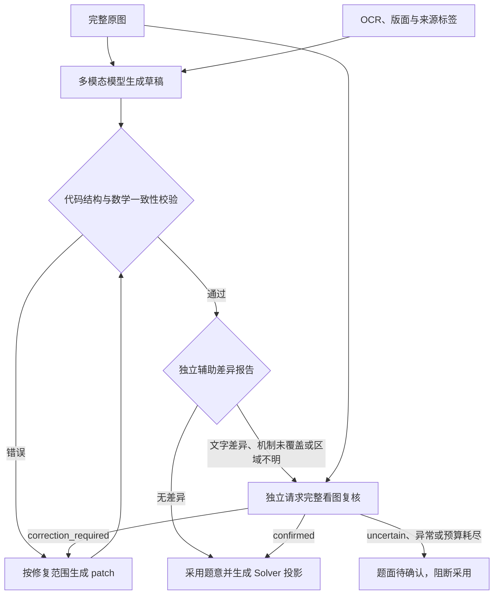

# 原图主导的题意抽取与独立复核

## 职责与处理流程

完整题图是语义依据。多模态模型负责理解题面；OCR 和版面观察负责提供辅助线索，不能以“没有识别到”证明“题面不存在”。代码继续严格检查作用域、实体引用、符号语法、表达式、定义冲突、目标与 Solver 投影。

旧流程的问题：版面只覆盖前两行时，后续 OCR 行保留为 `unknown`，却又被排除在印刷文本证据之外。射线题型的 OCR 关键词硬校验因此失败，修复提示会错误引导模型改换题型。



OCR 差异报告 `problem-source-differences/v1` 独立于 `ProblemValidationReport.issues`。后一报告中的 `ok` 始终表示没有阻止采用的错误。草稿与其自身转录一致，只证明内部一致性；不能用它声称原图支持草稿。

数字、符号和单字符错漏不能被长文本相似度阈值吞掉。差异比较只做排版规范化，不因高相似度忽略数学符号或数值变化。差异不自动修改模型转录，而是交给视觉复核。

## 内部复核与修复契约

`problem-source-review/v1` 返回 `confirmed`、`correction_required` 或 `uncertain`。每项 finding 包含受影响单元、原文、说明、页码和归一化 `[x0,y0,x1,y1]` 坐标。`region_id` 可以引用已有区域，也可以为 `null`；后者支持版面完全漏检的区域。

代码验证 JSON、图像／草稿修订绑定、单元引用、页码和坐标，不把有效坐标当成语义正确的证明。复核请求同时包含完整题图、候选的转录与结构化条件、来源标签和中性差异。错误反馈必须经过原有定向 patch 权限检查；复核本身不修改草稿。

复核后修改草稿会生成新的绑定，旧结论不能继续采用。相同绑定已完成时恢复已有返回，结果未知时保持阻断，不重复付费调用。复核明确授权的字面修正，即使不改变 Solver 等价语义哈希，也允许生成新修订并重新复核；空 patch 仍被拒绝。

规范化保留源语义等价表示，包括共享最值表达式、范围约束和正方形中心。新增“两条对角线上的同一点 → 正方形中心”的反向规范化，只在可见正方形和同一作用域的两条对角线条件均存在时成立，不能拼接兄弟小问的条件。

## 预算、恢复与审计

| 项目 | 固定上限／行为 |
|---|---|
| 草稿生成与 patch | 合计最多 3 次 |
| 独立视觉复核 | 每个图像／修订绑定最多 1 次，合计最多 3 次 |
| 语义请求 | 合计最多 6 次 |
| 底层网络尝试 | 合计最多 12 次；关闭 SDK 隐式重试 |
| 恢复 | 持久化预算不重置；未完成的已保留复核不得重发 |
| 无辅助差异 | 不额外调用复核模型 |

产品有效配置持久化以上预算。执行审计先保留请求名额，再调用 provider；请求、输入图片、原始返回和调用记录进入现有审计。解析后的复核结果单独存储；产品另外登记 `problem-source-review-audit/v1` 产物，记录结果与 `adopted`，便于直接查看。

阶段未提交也可通过持久化完成记录恢复原复核响应，不依赖尚未登记的阶段输出列表。恢复返回不重复累计 token；provider 没有返回 token usage 时保留未知，不估算成已知计费值。

新构建使用 pipeline `v2`，其中 extraction 阶段契约为 `v2`；旧 pipeline `v1` 定义保持不变。重建预览会使旧抽取 checkpoint 及下游失效。公开 HTTP API、领域图和 repair 契约保持兼容，历史构建和原始观察不回写。

## 2026-09-13 验收记录

- 抽取、观察、证据、领域模型离线回归：**330 passed**。
- 产品完整离线／独立 PostgreSQL 回归：**94 passed、3 skipped、1 deselected**。三个跳过项需要单独启用专用 RabbitMQ 的 transport 测试；deselected 是另行真实运行的九阶段测试。这些项目没有计入通过数。
- 和平版面漏检题：最终代码 **3/3** 独立 Doubao 抽取通过，均保留 `QuadraticEqualLengthRayPathMinimumSolver` 并通过 Solver 语义比较。记录在 `/private/tmp/source-review-live-heping-acceptance-20260913`。
- 五题真实回归批次 `image-authority-five-source-patch-20260913`：**5/5** 接受，题型、领域语义哈希和 Solver 投影语义均与金标一致。各题语义调用数为和平二模 2、和平一模 2、河西一模 2、南开一模 4、西青一模 2。
- 专用 PostgreSQL 实例 `source-review-test` 的真实 OCR、Doubao、DeepSeek 九阶段构建通过。最终构建 `de440e1c-a7e3-43e9-87c3-8d72becce0b3` 的九阶段均成功，校验了 `y=x²−2x−3`、`E=(-2/3,-11/9)`、`a=3/4`、编译后的 HTML，以及独立版本化复核审计产物。记录在 `/private/tmp/source-review-product-audit-accepted-20260913/build-result.json`；测试耗时 215.51 秒。
- 独立复核审计登记与恢复的最终产品专项测试 **5 passed**。最终抽取离线回归重新执行，仍为 **330 passed**。
- 本地任务已通过管理脚本排空，API、Publisher、Worker、Frontend 均重启且版本一致：`ce8d5340e1d2a0d909a59754a7b05b8db50dac8baf3c8643eae0c0a9532cce8b`。`services-doctor` 返回 `ok=true`，`outbox_pending=0`、`expired_leases=0`、Worker/Publisher 心跳正常。结果保存于 `/private/tmp/source-review-services-doctor-final.json`。

调试中曾出现真实模型复核误判、非法坐标、遗漏结构化条件，以及合法修复被无进展规则拦截。对应原始批次保留在 `internal/solver-runs/problem-extraction/problem-domain/image-authority-five-*`；上面的 5/5 是修复后的指定批次，不代表所有调试批次都通过，更不代表模型在任何运行中都不会误判。

回放夹具位于 `server/tests/solver/fixtures/source_review`，包括实际漏检题图、OCR、首轮错误草稿、作用域修复和真实视觉确认返回；五题回放使用匹配图像及真实观察数据，不使用 `_SourceIndependentValidator`。

复现离线与真实模型测试时在 `server` 目录执行：

```sh
RUN_LLM_INTEGRATION=0 uv run pytest -q tests/solver/test_problem_domain_*.py tests/solver/test_problem_extraction_*.py tests/solver/test_problem_source_review.py

# PRODUCT_TEST_DATA_DIR 必须指向独立安装的测试实例
PRODUCT_TEST_DATA_DIR=/private/tmp/shuxueshuo-source-review-20260913 PRODUCT_TEST_INSTANCE=source-review-test RUN_LLM_INTEGRATION=0 uv run pytest -q tests/product -m 'not live_llm'

RUN_LLM_INTEGRATION=1 uv run pytest -q tests/solver/test_problem_source_review_live.py
RUN_LLM_INTEGRATION=1 uv run python -m shuxueshuo_server.solver.extraction.problem_domain_smoke --case all --samples-per-case 1 --concurrency 5 --batch-id UNIQUE_BATCH_ID
PRODUCT_TEST_DATA_DIR=/private/tmp/shuxueshuo-source-review-20260913 PRODUCT_TEST_INSTANCE=source-review-test RUN_LLM_INTEGRATION=1 uv run pytest -q tests/product/test_source_review_live.py
```

本次不提供 OCR 服务故障时的纯图片降级，不逐题固定增加独立复核；模型与 OCR 共同遗漏仍可能不触发复核。真实模型测试必须显式启用，缺少模型、OCR 或独立数据库时不能以回放通过代替。

## 未提交改动审查后的补充修复

- **已审计成功、文件仍为 started 的恢复**：SourceReviewer 通过 `restore_source_review` 只读取产品侧已持久化响应。数据库没有完成记录，或者普通 provider 不提供该能力时，仍保持 uncertain；不会重新发起付费请求。补充了在校验、解析产物写入、文件状态提交三个位置模拟进程退出的产品回归，断言恢复 confirmed、模型实际调用仅一次、预算不增加。
- **漏检区域裁图**：`region_id=null` 的页码与 bbox 作为 `source-review-bbox:` 自包含引用进入 issue 和后续修复提示；修复服务从复核所见的完整题图生成 zoom。它不创建 OCR 观察，也不改变来源标签。回归检查真实 2134×340 题图的底部 bbox 生成 2134×92 裁图，且修复请求保留完整原图。
- **用户文案**：`extraction.problem_source_uncertain` 显示“原图题面仍待确认”，与结构错误区分。旧配置或过期部署提示重新预览并提交新构建。
- **旧构建配置**：原部署栅栏已阻止旧版本任务在新版本下继续执行；另外在运行守卫、抽取入口和模型调用处检查旧阶段契约／冻结预算，明确返回 `extraction.rebuild_required`。不把历史 3 次语义预算静默扩成 6 次，也不在缺少复核预算和恢复围栏时调用模型。

本轮先通过 48 项定向后端回归；最终在全新隔离实例 `source-review-findings-test`（`/private/tmp/shuxueshuo-source-review-findings-20260913`）完成 **428 passed、3 skipped、1 deselected** 的完整后端回归。三个跳过项仍为专用 RabbitMQ 测试，未选中的是付费九阶段测试。前端 **125 passed**，TypeScript 类型检查和 `git diff --check` 通过。日志为 `/private/tmp/source-review-findings-fresh-full.log`。

旧测试实例积累了 150 个过期运行任务，超过恢复扫描的一次 100 条上限，导致第一次全量运行的恢复测试失败；已保留该次失败日志及旧实例记录，未通过清理历史记录使测试通过。新隔离实例全量回归通过。

此前真实模型验收记录属于上一轮，本轮修复以故障注入和录制九阶段回归验证，未重新执行付费模型测试。

本轮修复后已排空并重启本地受管理服务，API、Publisher、Worker、Frontend 版本均为 `3f0d2f5afb9b56810214daabb21520af59b84121bd8f52dcd96796ed1c272a1e`。健康检查 `ok=true`，积压消息和过期租约均为 0；结果保存在 `/private/tmp/source-review-findings-services-doctor.json`。
