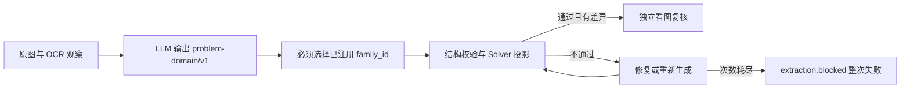
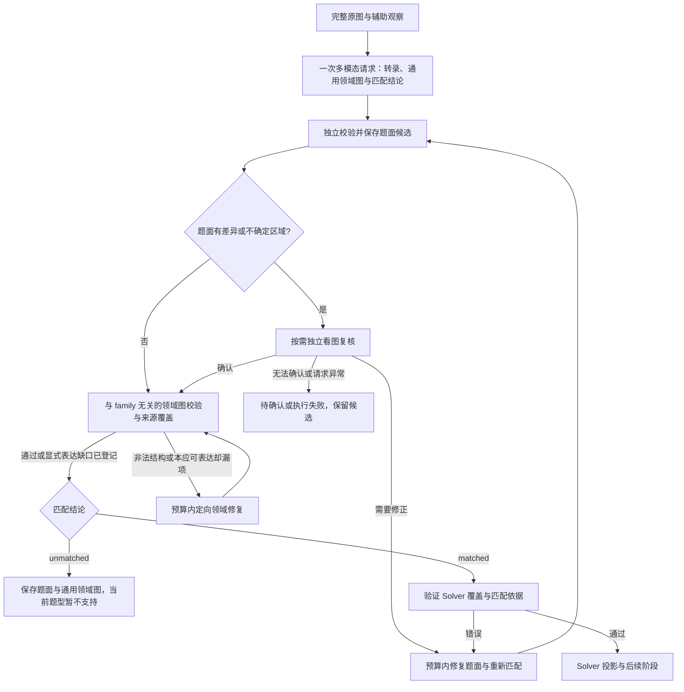

# 题面抽取与 Solver 匹配解耦设计

日期：2026-09-14；修订：2026-09-15（含风险审查、六步计划及第一步五题验收）

状态：第一步 DeepSeek 视觉切换已实施并通过五题验收；第二至第六步尚未实施。后续新契约、字段和状态仍属设计方案，现有实现以代码为准。

## 1. 目标与已确认决策

让系统能够准确区分：

1. 题面已提取，已有求解能力覆盖，继续生成解析页。
2. 题面已提取，当前没有匹配的题型，保存并展示题目，正常结束，告诉用户“当前题型暂时不支持”。
3. 题面无法确认，或者请求、解析、校验发生异常，保留已获得的材料并给出对应原因。

用户已确认：LLM 必须有明确的“匹配不到”回答；不能强制选择已有题型；匹配不到不能直接作为整次生成失败，也不能丢掉已经提取的题目。

职责保持为：完整原图主导语义，多模态 LLM 理解题目，OCR 是辅助；代码检查结构、引用、作用域和一致性。题型匹配是对现有求解能力的选择，不应决定哪些原题内容允许被保留。

本次统一交付：

- **题意理解的多模态模型从豆包切换到 DeepSeek**：首轮理解、内容修复和独立视觉复核均使用新的 DeepSeek 视觉适配器；不能使用现有纯文本 DeepSeek 基线冒充看图。
- **首轮即启用低强度思考**：用户已指定 DeepSeek 首轮请求使用 `thinking={"type":"enabled"}`、`reasoning_effort="low"`，不沿用豆包首轮关闭思考的策略。
- 独立题面产物、显式未匹配分支、正常产品终态、预算与恢复。
- **本题所需的通用几何表达**：角度、长度、三角形面积、比值、正切、关系和目标；对角线交点、中点、平行四边形，以及可复用的“k 倍四边形”定义、分支与实例化。具体边界见第 14 节。
- 与 family 无关的领域图校验、来源覆盖和展示；现有已支持题目的 Solver adapter 回归。
- 上述路径的单元、回放、产品及真实模型测试。

此前延后几何表达仅为缩小首轮范围，不是技术前置限制。本次不再延后：不能让本题只剩自然语言转录而不保留结构化几何条件。范围限制放在“暂不新增本题的完整求解器与教学页面能力”，而不是限制题意表达。

已确认目前没有用户，**允许清空全部历史业务数据，不要求兼容旧线上记录、旧 checkpoint 或旧产物**。采用停服、清空业务数据、初始化新结构、整套服务统一升级的方式；不开发 legacy 读取、双写和在线迁移分支。代码、脱敏回归夹具、部署配置与密钥不属于历史业务数据，保留。清空流程见第 10 节；本文修订本身不执行删除。

本次验收要求本题可读条件完整进入通用题意结构；若没有匹配的 Solver，正常显示已提取题面与暂不支持。不承诺任意数学语言均可表达，也不把表达能力完成等同于本题已经能自动求解。

## 2. 当前实现与问题证据

诊断构建：`6de57b87-fcd6-4977-8e99-2d3c4d7db01b`。题目为 k 倍四边形，包含面积比、角度倍数、等角条件和正切值目标。

现有路径：



代码依据：

| 位置 | 当前行为 | 问题 |
| --- | --- | --- |
| `solver/extraction/problem_domain.py` 的 `problem_domain_schema()` | `family_id` 必填，枚举来自默认 registry | 不能返回未匹配 |
| `solver/family/__init__.py` | 默认注册四类二次函数路径最值 family | 本题没有合适选项 |
| `problem_domain.py` 的 `_fact_schemas()` | 有直角、角和、长度关系，没有直接的等角与角度倍数关系 | 已理解的条件难以合法编码 |
| `_goal_schemas()` 与 `problem_domain_validation.py` | `parameter_value.target` 必须指向 symbol | 面积比、正切表达式不能直接作目标 |
| `problem_domain_service.py` | 正式采用要求合法领域草稿与 Solver 投影 | 题面保存被绑定到求解能力 |
| `product/runner.py` 的 `extraction()` | 未 accepted 统一走异常，部分 source-review 错误单独映射；直接实例化 Doubao provider | 不支持与执行失败混在一起，视觉 provider 选择硬编码 |
| `multimodal_provider.py` | 有 Doubao 视觉适配器和 `DeepSeekTextProblemDomainProvider` 文本基线 | 改模型字符串不能完成真正的 DeepSeek 图像接入 |
| `product/models.py`、前端 `terminal()` | 没有 unsupported 业务终态 | 无法正常展示不支持结果 |

本次实际失败过程：

1. 第一轮用单元素 `angle_sum` 描述角，违反 `minItems=2`；同时有 `equation.symbols=[]`，表达式使用解析器不理解的 `∠BDC` 记号。
2. 第二轮选了 `QuadraticEqualLengthRayPathMinimumSolver`，出现跨小问引用和未定义目标；角倍数与等角条件只剩在转录中。
3. 第三轮补出 `scalar_expression`，但内部角、面积变量未定义，目标仍要求 symbol，继续失败。
4. 三轮均未到独立视觉复核。不能把此次错误归因为视觉复核 uncertain。

输入图片还没有图 1～4。应单独记录图示缺失，不得把推测的图形关系补成题面事实。

## 3. 新流程：逻辑解耦，不固定增加模型调用

保持九个产品阶段，先在第三阶段内部拆职责，避免为了结构重构固定增加一次请求。



图中步骤是逻辑顺序。首次请求同时返回题面、通用领域草稿和匹配结论，不固定增加第二次调用。unmatched 仍保留通用领域图，不能通过 family 选择省略本题的几何表达。

必须满足以下不变量：

- 不支持结果不需要 Solver 就绪的 `VerifiedProblem` 或 Solver 投影，但需要独立领域图产物与校验状态。本题新增表达覆盖的内容不能以 unmatched 为由省略。
- `matched` 不是执行许可；必须继续通过现有数学结构校验及能力覆盖检查。
- 字符串转录通过 schema，只能说明可读和结构合法，不能证明原图语义正确。
- 原图复核不应再以 Solver 投影成功为前置条件。
- 不能通过删除难以表达的条件把不支持题目变成已支持题目。
- 不能从 schema 错误、超时、预算耗尽自动推断 unmatched。
- 不能仅因未生成 HTML，就把正常 unsupported 结果标成失败。

## 4. 新内部契约与版本化产物

### 4.1 `problem-transcription/v1`：独立题面

包含原文、分问、求解要求及图示线索，允许自然语言数学表达；不要求转换成当前 Solver 的实体和事实枚举。

示意：

```json
{
  "schema_version": "problem-transcription/v1",
  "problem_id": "<problem uuid>",
  "source_image_sha256": "<sha256>",
  "question_number": null,
  "title": "k 倍四边形",
  "preamble": [
    {"id": "definition-1", "text": "按原图逐字保留 k 倍四边形的定义", "regions": []}
  ],
  "parts": [
    {
      "id": "q2",
      "label": "（2）",
      "text": "按原图保留完整第（2）问",
      "conditions": [{"id": "q2-angle-condition", "text": "∠BDC = 2∠ABD", "regions": []}],
      "requirements": [{"id": "q2-goal-1", "text": "求 k 的值"}],
      "figure_refs": ["图3"],
      "regions": []
    }
  ],
  "source_gaps": [
    {"kind": "missing_figure", "references": ["图1", "图2", "图3", "图4"], "description": "当前图片未包含所引用图示"}
  ]
}
```

字段规则：

- 示例不是金标全文。生产内容必须来自原图，不能凭示例补齐；题号没有可见依据就为 null，本次模型返回的“24”不可直接当作证据。
- 保留题面中的参数范围、等号／不等号方向、角度符号、下标与分问边界。
- `requirements` 只是原题所求，不携带模型生成的答案、证明或求解步骤。
- `conditions` 为原文条件片段分配稳定 ID，保留逐字文本和区域，不新增推导。定义、条件和要求的 ID 组成领域图来源引用表；每个条件片段必须能对应到该 part 的原文或明确原图区域，不能凭 ID 存在证明语义正确。
- 分问内多个独立图景支持子 part，避免把第（1）问图 1、图 2 的同名点和不同 k 混成同一数学上下文。
- `regions` 可引用已知区域，也可使用有效页码与归一化 bbox；不依赖 layout 检测全部成功。
- 缺少坐标不自动证明漏提取；坐标存在也不证明文字正确。
- `source_gaps` 保留文字缺失、看不清的公式、所引用图示缺失等信息；缺图是否阻断，要看是否影响题面理解，不一律判失败。
- 文件只保存纯文本及约定数学标记；不接收任意 HTML。展示沿用安全文本和数学渲染限制。

服务端生成不可变 `transcription_revision_id` 和语义内容哈希，绑定原图哈希。模型不能自签“已验证”。

`problem_id`、source_id 和原图哈希的权威来源是服务端 build 上下文。请求中注入预期身份；模型回传的 problem_id／图片哈希仅用于交叉校验，必须与上下文完全一致。错配作为契约错误保存到该调用审计，不允许模型选择其他 problem、重定向写入或由服务端静默改 ID 后采用。修订 ID 和 workspace 绑定完全由服务端生成；此规则同时适用于 domain 和后续 repair。

采用状态使用独立元数据：

| 状态 | 含义 |
| --- | --- |
| `candidate` | 可读候选，未达到采用条件 |
| `accepted` | 完成题面校验和规定的按需复核 |
| `needs_confirmation` | 存在影响理解的不确定内容 |

同时记录 `review_mode=not_triggered/independent_review`，避免 accepted 被误读为每题均经过两次独立看图。

### 4.2 `problem-solver-match/v1`：显式匹配结果

用判别联合约束两种结果，禁止模糊的空字符串题型：

```json
{
  "schema_version": "problem-solver-match/v1",
  "status": "unmatched",
  "family_id": null,
  "reason_code": "no_supported_family",
  "reason": "当前题型不覆盖本题的角度关系、面积比和三角函数求值",
  "uncovered_requirements": [
    {"part_id": "q2", "requirement_id": "q2-goal-1", "source_unit_ids": ["q2-angle-condition"], "domain_unit_ids": ["q2-angle-relation"], "description": "需要处理角度倍数关系"}
  ]
}
```

`matched` 分支要求有效 family_id、匹配依据，以及每个必要分问目标的覆盖说明。`unmatched` 分支要求 family_id 为 null、非空理由和至少一个 `uncovered_requirements` 条目；每条必须引用实际存在的 part、requirement 以及相关条件／领域单元，解释该要求依赖的哪种能力不被当前 registry 覆盖。禁止仅用“不支持”“无法匹配”等空话。允许原因 `no_supported_family`、`unsupported_requirement`。置信度若保留，只用于审计，不是采用条件。

绑定规则：服务端在持久化时关联 `transcription_revision_id`、`domain_revision_id`、registry 哈希与匹配策略版本；缺少绑定的结果不得用于继续执行。family_id 只存在于匹配产物，不进入通用领域图。

代码校验：

- matched 的 family 必须存在；引用的分问与要求必须存在。
- 所有必要目标都应覆盖；不能只因第（3）问出现射线就宣布整题匹配。
- 模型返回合法但 unknown family 仍为契约错误，不能静默转换成 unmatched。
- unmatched 无需穷举并证明排除全部 family，但必须提供可审计的、与本题相关的理由。
- 已支持金标题不得被长期误判 unmatched，使用真实模型回归监测召回率。
- 对 registered family 的“结构还未修好”与“能力确实不支持”分别处理。只有显式的新匹配结论或专门能力检查结果才可转 unsupported，普通校验异常不可转换。

### 4.3 `problem-understanding/v1`：一次请求的返回封装

```text
schema_version
transcription: problem-transcription/v1
match: problem-solver-match/v1
domain: problem-domain/v2
```

- matched 与 unmatched 均提供 domain；v2 移除必填 family_id，加入第 14 节的通用量、关系、定义、目标及来源覆盖。
- domain 用 `coverage.status=complete|partial` 与 `unencoded_items` 明确表达覆盖程度；每个未编码项必须引用原文并说明具体表达缺口。不能用任意字符串充当可执行事实。
- 对范围外的题目，合法 partial 图配 accepted 转录和显式 unmatched 可以正常结束；本题全部可读条件属于此次新增范围，不能用 partial 作为通过验收的捷径。缺图导致的语义不确定另走 needs_confirmation。
- matched 要求完整、独立校验通过的领域图，match 绑定其修订；由对应 adapter 生成既有 Solver 输入，不允许适配时丢条件。
- 统一升级为 `problem-domain/v2` 与 `problem-repair/v2`，保留有效的数学语义和 repair cone 思路，但不承担旧 wire／产物兼容。通用领域图通过检查不等于 Solver 就绪。
- 顶层 JSON 可解析时，各子对象分开校验、登记。domain 不合法不应导致合法转录无法持久化；但不能把部分有效响应整体当作通过。
- 顶层 JSON 损坏时只保存原始返回，不使用截取字符串等不可靠方式生成 accepted 转录。
- Provider 输出格式按 DeepSeek 实际接口能力适配，首版使用 Chat Completions 的 JSON Output，将完整契约和样例写入提示词；服务器必须执行完整 schema 及判别联合。JSON 合法不代表符合 domain／match 契约，不能照搬 Doubao 的 json_schema 参数。详细接入与真实验证见 §13 第一步。

### 4.4 首包判别联合与硬约束

采用**公共题意图 + 匹配判别联合**，不采用“unmatched 删除／置空通用 domain”。后者与本次已确认的“无 Solver 也要保留本题几何表达”冲突，且会重新让题意表达受题型支配。

明确区分：`domain` 是 family 无关的题意；`solver_projection` 和 `verified_problem` 是服务端校验及 adapter 产生的执行产物。**两种模型首包分支都禁止携带这些执行产物**，也没有可选的 `solver_domain` 字段。matched 仅声明匹配，不能自签可求解；unmatched + 非空、合法通用 domain 是正例。

服务端完整 schema 中以下结构必须成立（此为关键结构摘录，引用的 `$defs` 在完整 schema 中展开）：

```json
{
  "type": "object",
  "additionalProperties": false,
  "required": ["schema_version", "transcription", "domain", "match"],
  "properties": {
    "schema_version": {"const": "problem-understanding/v1"},
    "transcription": {"$ref": "#/$defs/transcription"},
    "domain": {"$ref": "#/$defs/domain_v2"},
    "match": {
      "oneOf": [
        {
          "type": "object",
          "additionalProperties": false,
          "required": ["schema_version", "status", "family_id", "coverage"],
          "properties": {
            "schema_version": {"const": "problem-solver-match/v1"},
            "status": {"const": "matched"},
            "family_id": {"$ref": "#/$defs/registered_family_id"},
            "coverage": {"type": "array", "minItems": 1, "items": {"$ref": "#/$defs/matched_coverage"}}
          }
        },
        {
          "type": "object",
          "additionalProperties": false,
          "required": ["schema_version", "status", "family_id", "reason_code", "reason", "uncovered_requirements"],
          "properties": {
            "schema_version": {"const": "problem-solver-match/v1"},
            "status": {"const": "unmatched"},
            "family_id": {"type": "null"},
            "reason_code": {"enum": ["no_supported_family", "unsupported_requirement"]},
            "reason": {"type": "string", "minLength": 1},
            "uncovered_requirements": {"type": "array", "minItems": 1, "items": {"$ref": "#/$defs/uncovered_requirement"}}
          }
        }
      ]
    }
  }
}
```

`domain_v2` 本身是非空结构约束的 object，禁止 family_id；`registered_family_id` 为当前注册表枚举。coverage 的语义引用、理由非空白和全部目标覆盖由服务端再校验，JSON schema 不能证明这些语义。

DeepSeek 首版在请求层使用 `response_format={"type":"json_object"}`，在提示词提供完整契约，在服务端执行上面的 oneOf。这是明确区分“供应商保证 JSON 格式”与“服务端强制业务 schema”；不能声称供应商原生保证了判别联合。后续若使用支持 json_schema 的接口也必须保留服务端校验。不能降级成自由文本后默认接受；真实 provider 约束及服务器拒绝行为都必须纳入验收。提示词明确两种分支同等完整，unmatched 不扣质量分、不被提示修成已有 family；这能去掉结构上的强迫，但不能保证模型不会误匹配，仍需金标和负例验证。

## 5. 题面校验、差异检查与复核

### 5.1 拆开三套校验报告

- `TranscriptionValidationReport`：分问和要求引用、重复 ID、空正文、长度与深度限制、原图绑定、区域坐标、未解决的题面疑点。
- `DomainValidationReport`：领域实体、事实、作用域、几何量类型、定义实例、目标、来源覆盖和表达式检查；不依赖 family 和 Solver 投影。
- `SolverReadinessReport`：匹配依据、family 机制、adapter 支持、运行时投影和求解能力覆盖。由原 `ProblemValidationReport` 中与 Solver 相关的检查拆出，避免再次耦合。
- OCR 差异继续放独立 advisory 报告，不能混入阻断错误。

“题面可展示”不以领域图或 Solver 报告通过为条件；“通用结构可采用”要求独立领域校验；“允许进入 Solver”要求完整结构及 Solver 就绪检查通过。报告分别持久化，不能共用一个 ok 混淆三种结论。

### 5.2 独立复核与版本

统一采用 `problem-source-review/v2`，包含转录和通用领域语义审查目标，不增加 v1 历史读取分支：

这是明确的行为变更：**当前代码要求领域结构与 Solver 投影通过后才可能复核；新实现只要求转录结构、身份与区域绑定合法，就可以触发题面复核。** `problem_domain_service`／新协调服务必须调整顺序，不能仅增加返回字段而沿用旧触发条件。

- 绑定原图哈希、转录修订、审查类型；如果审查涉及领域语义，再绑定 domain 修订。
- 返回 confirmed、correction_required、uncertain，继续区分模型请求异常和内容不确定。
- 保留完整原图、相关区域和中性差异说明，不提示模型“系统已判断不支持，因此忽略缺失”。
- 原转录或影响语义的领域内容修改后，相应复核失效；只修改匹配理由不能随意复用对另一题面修订的复核。
- 即使 matched 的领域图已在首包返回，只审转录的 confirmed 也不能批准 domain。复核要求修改转录时，首包 domain 和 match 一律失效；修订请求重新绑定并校验，不允许恢复路径把旧首包领域图接回。只有审查类型明确包含该 domain 修订的复核才能为其提供语义审查证据。
- 无 layout region 的 bbox 继续进入 zoom 与修复输入，不把未知来源文字提升为 printed。

触发条件沿用实质 OCR 差异、未知／混合／遮挡区域，并新增“模型声称图示缺失或文字无法辨认”。未匹配本身不自动增加复核调用。

题面因缺图仍无法确认时，优先显示“需补充题图”，匹配结论仅作为附加信息；不能标为“完整题目已提取”。如果复核确认文字已完整读取、缺图不影响对当前能力不覆盖的判断，可以显示 accepted 转录与 unsupported，同时保留缺图提示。

### 5.3 防止删条件来通过

保留不可变转录作为领域草稿的来源。

- 每个条件／要求保留稳定文本单元 ID，领域草稿使用独立覆盖产物引用这些 ID。
- 新增或者修改领域事实必须能指向相关题面单元；代码只验证引用和覆盖结构，不把引用存在当成语义证明。
- 有未覆盖条件、目标或者新的语义差异时，进入修复／复核，不可直接继续求解。
- 不能通过改原文、删要求来修复“当前 schema 不支持”。真正的转录纠错应有原图依据，并产生新修订及新匹配。
- 第一版覆盖产物不宣称解决所有模型共同遗漏；按需复核的既有残余风险继续明确保留。

可测完成标准限定为：**转录已列出的条件／要求必须有有效领域映射或显式缺口；match 声称覆盖但 domain 缺少相应引用时必须拦截。** 引用存在但数学含义错配仍需语义复核；原图中的条件在转录阶段就被 LLM 与 OCR 同时遗漏，引用检查无法发现。测试与验收不得把前一种保证表述成“能拦住全部假 matched”。

## 6. 抽取服务与修复路径

新增协调结果类型，替代上层仅以 `accepted` 判断一切：

```text
UnderstandingResult
  outcome: ready_for_solver | unsupported | needs_confirmation | failed
  transcription: artifact reference or null
  transcription_status: candidate | accepted | needs_confirmation
  domain: artifact reference or null on malformed response
  domain_status: candidate | validated_complete | validated_partial
  match: artifact reference or null
  verified_problem: Solver-ready authority or null
  solver_projection: existing projection or null
  attempts, ledger, review_records, error
```

约束：

| outcome | 必须存在 | 不允许 |
| --- | --- | --- |
| ready_for_solver | accepted 转录、validated_complete 领域图、matched、Solver 就绪的 VerifiedProblem、投影 | 空投影或未确认题面 |
| unsupported | accepted 转录、独立校验通过的领域图、有效 unmatched；范围外缺口显式登记 | 伪造 VerifiedProblem／空解析页；隐藏应能表达的条件 |
| needs_confirmation | 疑点和区域；可读候选若有则保留 | 表示为完整已验证题面 |
| failed | 明确错误及原始审计；合法候选若有则保留 | 将超时改成 unmatched |

修复分类：

1. 转录结构错误：新封装重生成或限定转录修订；不要求一次修复同时修改不相关领域单元，但最终采用的结果必须绑定对应领域图。
2. 原图复核提出文字修正：修订转录、重新匹配，废弃旧 domain 与旧匹配结论。
3. 无论是否 matched，领域结构错误都使用 `problem-repair/v2` 的定向修复；不能因无 Solver 而把非法引用当合法。
4. 明确 unmatched 且转录、通用结构有效：停止为匹配题型而修复，进入正常 unsupported 终态；领域本身有错误不能跳过必要修复。
5. 非法匹配输出：作为契约错误修复，不能默认选第一类，也不能默认 unsupported。

人工领域修订入口统一使用新契约，unsupported 的合法通用领域图可进入“题意修订”，不要求已有 VerifiedProblem。修改后生成新修订并重新校验、匹配；非法候选只提供审查和重试，不伪造可编辑已采用基线。直接编辑转录若纳入现有编辑功能，同样需要新修订和复核失效处理。

## 7. 调用预算与恢复

不新增固定匹配请求：首次 understanding 请求完成转录、通用 domain 与匹配。转录重生成、重新匹配、domain repair 共享三次内容生成预算；新增表达增加 token 成本，通过真实用量评估，不自动扩大次数。

| 预算 | 上限 |
| --- | --- |
| understanding／内容修订／domain repair 合计 | 3 次语义调用 |
| 独立视觉复核合计 | 3 次语义调用 |
| 全部语义调用 | 6 次 |
| 全部底层网络尝试 | 12 次 |

无差异 unmatched 理想路径：1 次内容生成、0 次复核、0 次 Solver 调用。无差异 matched 题目不得因拆分固定增加调用。

### 7.1 配额分配与耗尽优先级

保留 3/3/6/12 上限，本轮不隐式加预算，但将调度原则写死：

1. 首次内容调用占内容配额 1。视觉复核属于独立的复核配额，不挤占剩余 2 次内容调用。
2. correction 后，下一次内容请求优先合并“修订题面 + 重建受影响通用图 + 重匹配”，合计记 1 次，不拆成三个请求。若之后只有领域结构错误，再使用第 3 次定向修复。
3. 每次采用一份结果先做确定性校验、判断能否正常结束，再决定下一次请求；不能先判断内容余额为 0 就抛预算错误。
4. 已有 accepted 转录、合法通用图、当前修订的有效 unmatched，且所有必需复核都完成：**立即完成 unsupported 收尾，收尾不调用模型，内容余额为 0 也不影响。** domain repair 不得为“争取匹配”抢占这个终态。
5. 只有 accepted 转录、没有合法图或有效 unmatched，不能借预算耗尽转 unsupported。非法结构／缺失匹配未修好时 outcome=failed；保留题面候选与具体预算错误。
6. 复核明确 uncertain 时 outcome=needs_confirmation，优先于通用预算耗尽提示。必需复核尚未执行、或 correction 待落实但配额用尽时 outcome=failed、原因是预算耗尽；不能当作 confirmed，也不伪称模型已返回 uncertain。
7. 3 次内容调用覆盖不了所有多轮纠错，这是显式资源边界；金标因此失败须记录为真实回归失败，不能改成 unsupported 来使验收通过。只可通过后续单独批准的预算策略版本调整上限。

仅 rematch 的规则：原图、转录哈希、domain 哈希、registry 哈希、匹配策略版本和相关审查绑定均相同时，恢复已有匹配为确定性复用，0 次调用。registry 或策略变化需要新判断时可用精简匹配提示，只传必要已接受语义与能力清单；**仍计 1 次内容语义调用**，不能因 token 少就绕过计数。该请求禁止修改题面或领域图，变更任何语义都转回内容修订路径。

必测调用序列（C 为内容调用，R 为复核调用）：

| 场景 | 序列与配额 | 结果 |
| --- | --- | --- |
| 无差异、结构合法 unmatched | C1 | 正常 unsupported；无 R、无 Solver |
| 原图复核纠正后 unmatched | C1 → R1 correction → C2 合并修订／重匹配 → R2 confirmed | 正常 unsupported；2 C + 2 R |
| 已有一次结构修复，再纠正后 unmatched | C1 → C2 → R1 correction → C3 合并修订 → R2 confirmed | 内容余额为 0 仍正常 unsupported |
| matched，纠正后再修结构 | C1 → R1 correction → C2 合并修订 → C3 领域修复 → R2 confirmed（如需要） | 校验完成后进入 Solver；不能挤占终态判断 |
| 同一修订审计恢复 | 持久化响应重放，不追加 C/R | 不重复扣预算 |
| 三次内容后仍是非法图 | C1 → C2 → C3 | failed，保留转录，不转 unsupported |

### 7.2 持久化与恢复

同一候选复核去重键包含原图哈希、转录修订、审查类型和所审领域修订。有效配置固化预算、registry 哈希、新契约版本和提示词版本。恢复不能重置预算，预算增加只能由用户提交新构建体现。

切换视觉 provider 不改变上述调用配额。effective_config 还须固化视觉 provider、请求 model、base URL、输出模式、thinking 参数、图片处理策略和 token／timeout 上限；恢复以原配置为准，不能在同一 build 中悄悄从 DeepSeek 切回豆包。请求 model 和响应 model／可用的服务端 fingerprint 分别审计，模型别名不代表永久冻结底层权重。

首轮 effective_config 必须显式记录 `thinking.type=enabled` 与 `reasoning_effort=low`，请求构建与恢复均校验这两个值；不能依赖供应商默认值，也不能因超时自动关闭思考或改变强度。启用思考仍是一条语义调用，不额外占用一次内容配额。

持久化顺序与故障处理：

1. 持久化调用意图并占用预算，再发送模型请求。
2. 成功响应先写入现有持久化调用审计，再解析各子对象。
3. 单独登记转录、匹配、领域候选与复核产物。
4. 提交第三阶段 manifest 与 checkpoint。
5. unsupported 通过专用事务完成构建正常终止。

如果步骤 2 后崩溃，从审计恢复原响应，不再付费重发；本地 started 状态不能覆盖数据库已完成记录。真正 outcome_unknown 保持异常语义，不按通过或 unsupported 处理。

如果步骤 4 后、步骤 5 前崩溃，恢复时读取 extraction outcome 并完成 unsupported 收尾，不能因 extraction 已成功就继续运行 projection。所有复用／恢复分支均需执行此检查。

## 8. 产品状态机与数据库

### 8.1 新终态

建议新增 `builds.status=unsupported`，表示已得到正常业务结果、未生成解析页。

| 对象 | unsupported 路径的状态 |
| --- | --- |
| builds | unsupported，finished_at 已设置，error_code 为 null |
| jobs | succeeded，清除 lease，避免自动重试 |
| job_executions | succeeded；执行完成不等于解析页生成 |
| source、observation、extraction 阶段 | succeeded，有真实 accepted manifest/checkpoint |
| projection 至 page 阶段 | skipped，reason 为 problem.unsupported |
| 未执行阶段的 stage_attempts | 不伪造 attempt |
| page_build / 最终解析页 | 不创建 |

新增 `build_stages.status=skipped`；更新数据库 CHECK、状态枚举、终态判定和统计。不能只改前端文案，也不能把跳过阶段标为成功或失败。

needs_confirmation 在第一版沿用已有 source-uncertain 错误／受阻机制与明确 UI，避免本次顺带重构全部异常状态；转录读取接口在该路径也返回候选。它与 unsupported 严格分离。

#### 8.1.1 对外消费规则

本次保留 jobs／job_executions 的 succeeded，含义仅为“工作任务正常执行完毕”，不再新增 completed 枚举。**任何对外解析成功、页面入口、成功率、成功通知都只能依据 build.status 与 build.outcome，禁止由 job succeeded 推断。**

区分两个 outcome：extraction 的 `ready_for_solver` 是阶段结果，不是构建成功；build.outcome 使用 `page_generated | unsupported | needs_confirmation | failed | interrupted | cancelled`（运行时可为空）。有页面的判定为 `build.status=succeeded AND outcome=page_generated`，并校验存在属于该 build 的已发布 page 引用。status／outcome 不一致或页面引用缺失按完整性错误处理，不能回退到 job 状态。

队列指标可统计 job 正常完成率，但不能命名为“解析成功率”。页面生成、题型不支持、题面待确认和执行失败分别计数；计费统计始终读取调用账本，不按结果推断免费或收费。

#### 8.1.2 Outcome × 状态真值表

下表 extraction 异常行假设 source／observation 已成功。后续 Solver 等阶段失败时保留已成功阶段，只把实际运行失败阶段标 failed、其未执行下游标 blocked。

| 场景／build.outcome | build.status | job / execution | extraction；后续阶段 | 终态事件 | 构建 terminal／页面 | 重建 |
| --- | --- | --- | --- | --- | --- | --- |
| 抽取 ready_for_solver，build.outcome 为空 | running | running / running | succeeded；按顺序运行 | stage.succeeded（extraction） | 否／无 | 不在运行中重复提交 |
| page_generated | succeeded | succeeded / succeeded | 九阶段 succeeded | build.succeeded，payload.outcome=page_generated | 是／有 | 可按依赖重建 |
| unsupported | unsupported | succeeded / succeeded | succeeded；后六阶段 skipped | build.unsupported | 是／无 | extraction 起步，新 build |
| needs_confirmation | failed | failed / failed | failed；后续 blocked | build.failed，payload.outcome=needs_confirmation | 是／无 | 补图或 extraction 重建 |
| 抽取执行异常 failed | failed | failed / failed | failed；后续 blocked | build.failed，payload.outcome=failed | 是／无 | 修复原因后新 build |
| cancelled | cancelled | cancelled / cancelled | 已成功不变；剩余取消 | build.cancelled | 是／无本次新页 | 显式新 build |
| interrupted | interrupted | interrupted / interrupted | 已成功不变；剩余按中断规则 | build.interrupted | 本次执行终止／无本次新页 | 按现有租约策略恢复同一 build 或显式重建 |

interrupted 的 terminal 表示客户端不展示活动运行，不禁止受控恢复；恢复时必须发布新的 running 状态并沿用预算。unsupported、failed、cancelled 不因普通队列重投自动恢复。needs_confirmation 虽复用 failed 的存储值，UI／通知必须按 outcome 分流，不能生成“抽取服务出错”告警。

#### 8.1.3 必改消费者与 skipped 约束

| 消费者／当前相关位置 | 强制规则 |
| --- | --- |
| `product/services.py` 认领、取消、finish_failure、失联／预算结束 | 先检查 build 终态与 job 执行状态；不能把 unsupported 再认领或覆盖；不能批量把 skipped 改为 failed |
| `product/transport.py`、运行恢复与环境栅栏 | 无页面不等于未完成；unsupported 队列重投只确认已结束，不跑 projection |
| `product/runner.py` restore／复用分支 | 读取 extraction outcome；unsupported 正常收尾，禁止继续遍历后续阶段 |
| `product/services.py` begin_stage／commit_stage／finish_page | skipped 无 accepted_attempt_id、无伪 manifest；不能作为成功依赖、不能 commit 为成功；finish_page 要求九阶段真实成功 |
| `product/application.py` 列表／详情／重建预览、数据库查询 | 最近 build outcome 决定显示；不 join job succeeded 来找“有页面”；skipped 不可作为可复用 checkpoint，unsupported 重建入口显式允许 extraction |
| 事件／outbox 消费者、监控、统计 | 正常无页只发 build.unsupported；不得同时发 build.succeeded 或“解析已生成”通知；事件携带 build.outcome |
| 前端 `client.ts`、`workspace.ts`、工作台及 review 阶段材料 | 页面条件使用 build 权威；终态停止活动轮询；skipped 统一显示“未执行”，不显示“失败”或“已跳过”混用 |

`skipped` 只用于正常 unsupported 导致的不执行；`blocked` 用于失败／待确认造成的下游受阻，两者都不能作为成功依赖。升级 `finish_failure` 中目前“所有非 succeeded 标失败”的批量逻辑，保留既有终态并按真实执行情况区分 failed 与 blocked。这些规则必须由查询、事务和 UI 测试同时约束，不只写文案。

### 8.2 持久化采用关系

建议新增不可变 `problem_transcription_revisions` 表：

- id、workspace_id、problem_id、source_id、source_image_sha256；
- parent_revision_id 可空；
- content_artifact_id、content_sha256、schema_version；
- validation_artifact_id、review_artifact_id 可空；
- adoption_status、review_mode、created_at、producer_version。

为 builds 增加 outcome、accepted_transcription_revision_id、match_artifact_id 和 outcome_reason_code。对 status/outcome 组合增加约束，按 §8.1.2 执行；外键／租户约束必须保证产物属于该 workspace/problem/source。

domain 修订与 transcription 修订分开。直接重建 `problem_revisions` 的语义：保存 family 无关的通用领域图、独立校验报告、覆盖状态和 transcription 绑定；Solver 就绪证明及匹配绑定另存。unsupported 可以持有合法 domain 修订，不能持有伪造的 Solver 就绪证明。不实现旧表内容的迁移映射。

候选产物先登记，采用关联随 extraction checkpoint 一起提交；不要在审计材料尚未持久化时宣布“题目已提取”。大正文放产物存储，列表接口不内嵌完整 JSON。

### 8.3 正常结束事务

增加 `finish_unsupported(...)` 服务方法，不调用 `finish_failure()` 或 `finish_page()`。必须：

1. 校验 lease、execution id、epoch，拒绝旧 worker 提交。
2. 核对 source/observation/extraction 已成功，checkpoint 声明 unsupported，accepted 转录、合法领域图与 unmatched 绑定一致。
3. 同一事务设置 build 终态、job/execution 完成、后续 pending 阶段 skipped、结束时间和业务原因。
4. 追加唯一且幂等的 `build.unsupported` 事件及现有 outbox 通知。
5. 拒绝覆盖 cancelled、已生成页面等既有终态；与取消操作竞争时由现有租约／状态栅栏决定唯一结果。

更新 worker 认领、失联恢复、取消、环境不兼容扫描、过期租约扫描和统计的终态集合。终态 unsupported 不再被认领，不得触发自动修复重试。

## 9. HTTP API、工作台与高级审查

### 9.1 API

build 详情响应统一使用新契约，包含 `outcome`、转录摘要与授权读取引用、通用领域图摘要和覆盖状态、match 摘要、source gaps。现有路径可复用，但不要求兼容旧响应结构；前后端统一发布。

全文读取使用现有产物授权链；不能通过公开静态目录暴露用户上传题面。workspace 校验、哈希验证和缓存隔离沿用产品产物逻辑。

历史数据在上线前清空，无 legacy 转录回填、旧领域图展示适配或旧状态降级分支。GET 仍必须只读，不能重新运行模型。

### 9.2 工作台

unsupported 的主卡片显示：

> 题目已提取，当前题型暂时不支持。
>
> 你可以查看原图和已提取题目；后续支持该题型后可重新尝试。

展示内容：

- 完整题干、定义、分问和求解要求。
- 明确的缺图／模糊区域提示；有不确定内容时调整标题，不能写“完整已提取”。
- 简短、受控的能力缺口说明，不直接显示 family 类名或原始模型推理。
- “查看原图”“重新尝试”“补充题图”操作；补图创建新 source/build，不回写历史。

不出现空白 iframe、“解析已生成”、六个红色失败阶段或持续转圈。右侧 extraction 显示“已完成 · 当前题型暂不支持”，后续阶段为“未执行”。列表使用中性状态标签，耗时和计费仍可查看。

新版本运行后，如果同一道题已有更早的成功页，必须标注页面所属构建，不能用它伪装本次 unsupported 的结果。这是本版本内结果隔离，不是升级前数据兼容。

### 9.3 高级审查与恢复入口

新增独立“已提取题面”“题型匹配”产物分类或可识别材料标题，显示：

- 转录版本、采用状态、来源图哈希、复核是否触发；
- match 状态、registry 版本、未覆盖的分问要求；
- 模型调用、原始返回、预算和恢复采用记录；
- unmatched 也可审查通用领域图、来源覆盖与独立校验结果；范围外部分结构明确显示“部分结构化”，不能冒充完整题意结构。

unsupported 构建允许从 extraction 重新开始；不允许从 projection 起步，因为没有 Solver 就绪证明。重新匹配使用当前 registry，生成新构建。不得自动给已经结束的 unsupported 构建重跑收费请求。

### 9.4 互斥的结果卡片与错误码

顶层卡片首先按 build.outcome 选择一个分支，再以 error_code 细化；不能同时显示“不支持”和“抽取失败”。以下新业务 reason 不作为 ProductError 抛出，现有错误码继续保留其技术语义。

| outcome / code | 卡片标题及说明 | 题面状态 | 操作 |
| --- | --- | --- | --- |
| unsupported / outcome_reason_code=`problem.unsupported`，error_code=null | 题目已提取，当前题型暂时不支持 | accepted 转录；合法通用结构或明确范围外部分结构 | 查看原图、题意修订、重新尝试；不暗示重试一定获得支持 |
| needs_confirmation / `extraction.problem_source_uncertain` | 题面待确认；指出缺图、无法辨认或来源不明区域 | candidate 或 needs_confirmation，不标完整已提取 | 补充题图优先；允许重新尝试，创建新 build |
| failed / `extraction.problem_source_review_invalid` | 题面复核未完成；复核返回格式不合法 | 保存已有候选，不称模型看不清 | 重新尝试、查看审查材料 |
| failed / `extraction.problem_source_review_failed` | 题面复核未完成；调用超时或处理异常 | 同上 | 重新尝试、查看调用记录 |
| failed / `extraction.blocked` | 题意结构校验未通过；列出可理解的缺失／冲突摘要 | 候选题面仍可读，不标结构已验证 | 题意审查、修复后重试 |
| failed / `model.budget_exhausted`（沿用底层）；新增协调码 `extraction.problem_budget_exhausted` | 本次识别尝试次数已用完；所需校验尚未完成 | 保留已获得内容，不推断不支持 | 新构建重新尝试；不能重置原 build 预算 |
| failed / `extraction.rebuild_required` | 识别策略已更新，请重新提交 | 如有本版本可读候选则保留；无则显示原图 | 重新预览并创建新 build |

当 `correction_required` 尚未落实而内容预算耗尽时使用 budget_exhausted，不映射成 source_uncertain。unknown、超时和解析失败不等于“图片不清晰”。SSE 事件、列表标签、工作台卡片和高级审查的 outcome 映射保持一致。

### 9.5 Upload reuse × unsupported

当前 `frontend/lib/product/workspace.ts` 的同图复用逻辑会对非 succeeded／queued／running 的最近结果自动创建 build，必须显式修正 unsupported 分支；只增加状态标签不足以完成行为变更。

| 上传结果／最近 build | 行为 |
| --- | --- |
| reused + unsupported | 打开已有 problem，展示最近 accepted 题面、通用图与不支持结果；不发 create-build 或模型请求 |
| reused + unsupported，registry 已更新 | 同样展示最近结果，可提示“能力已更新，可重新尝试”；不自动重匹配 |
| reused + running/queued | 打开已有运行，不重复创建 build |
| reused + succeeded | 展示该成功结果及其页面 |
| created 或 reused 但从未构建 | 按上传生成流程创建初始 build |
| reused + failed/needs_confirmation/interrupted/cancelled | 展示最近 outcome 与重试入口；复用本身不隐式重跑，避免仅因上传同图重新计费 |

只有“重新尝试”的显式动作创建新 build，使用当前 registry、独立预算和请求幂等键；可以合法复用 source/OCR 及契约未变的已接受图，必须重新计算有变化的匹配依赖。服务端详情的 latest_build_id／outcome 是权威，前端不得用上传前的缓存状态代替；重复点击必须幂等。多候选 ambiguous 继续先由用户选择，不自动匹配一个 problem。

清空历史数据后仍需此规则：新版本会持续产生多次上传和 unsupported 结果，不属于旧数据兼容工作。

## 10. 全量重置、统一发布与新 Checkpoint

### 10.1 数据策略

用户已确认无线上用户，可清空所有历史业务数据。取消在线迁移、历史读取、双版本 pipeline 并行、旧 schema 自动转换和 legacy UI 的工作。

实施时先把本题原图、实际 OCR、原始模型返回和五题回归所需材料导出成脱敏仓库夹具，校验文件哈希与可独立回放性。之后历史运行数据无需保留；测试夹具不要求新业务服务具备旧产物读取器。

重置范围为选定产品实例的业务数据库 schema／数据、上传与生成产物目录或专用对象前缀、页面包、审计调用记录、工作目录和 checkpoint、outbox／租约、专用队列积压及消息结果缓存。按依赖一起清理，避免数据库清空后旧消息重放或者对象缓存留下幽灵页面。

不删除源代码、Git 历史、脱敏回归夹具、服务配置、证书、模型密钥和其他应用数据。若数据库、Redis、RabbitMQ 或对象存储与别的应用共用，仅重置本产品命名空间；禁止使用未限定范围的清空命令。开发用账号／workspace 可随业务库重建，通过 bootstrap 重新初始化。

### 10.2 执行顺序

1. 完成离线和隔离实例验收，导出前述最小回归材料。
2. 关闭新任务入口，停止本产品 Worker、Publisher、API 及相关定时认领进程，防止清理期间有写入；既有任务无需为兼容而跑完。
3. 核对配置解析得到的实例标识、数据库、存储前缀和队列名称；生成清理清单后执行针对该实例的重置。
4. 从新 schema 初始化空业务库及种子账号／workspace，清除旧消息和产品缓存；不迁移旧记录。
5. 部署同一 release 的 API、Publisher、Worker、前端和相应缓存版本；只启用新 pipeline 与新契约。
6. 启动服务，验证空实例无旧任务被认领、版本一致，再跑已支持题与不支持题的产品 smoke。
7. 恢复入口。回滚如确有需要，停服重新初始化与目标代码匹配的数据结构，不维护跨版本读写模式。

重置工具应支持只打印清单的 dry-run，并在测试实例验证清理范围。当前任务只修订设计，不执行停服或清空数据；后续实施执行时按明确的实例配置落地，不能凭旧调试路径猜测目标。

### 10.3 新版本内部仍需要的恢复保证

- 使用新的理解、领域、修复与复核契约，保留版本号作为当前产物审计和恢复围栏，不为兼容旧数据保留代码路径。
- 注册新 pipeline（建议 v3），只让新提交使用它。旧线上 checkpoint 和排队任务已清空，不做复用迁移。
- 新 checkpoint 包含 outcome、转录与领域修订绑定、覆盖报告、match、registry 哈希、预算和复核摘要；只有 ready_for_solver 包含 Solver 就绪证明与投影。
- 更新 manifest：unsupported 要求题面、通用领域图与正常结束证据，不要求 Solver 产物。
- 新版本产生的数据仍必须支持本版本内的幂等恢复、修订追踪与重建；清空历史不是取消这些正确性保证。
- 同一新契约内 source/OCR 的合法 checkpoint 可复用；registry 变化使匹配及下游失效，不需要重新 OCR；通用领域图契约变化则使该图与下游失效。
- unsupported 可有 requested domain revision，但没有 Solver 投影；从 projection 重建仍必须拒绝。

### 10.4 发布版本绑定与遗留消息防御

**pipeline v3 必须同时包含 understanding v1、domain v2、repair v2 与 source-review v2。** 不发布“先 v3 outcome、以后再 review v2”的半完成组合：题面复核已解除 Solver 投影前置条件，旧 review 绑定不足以表达新采用语义。

本次 v3 release 还必须启用已验收的 DeepSeek 视觉 provider；不能先把首轮改成 DeepSeek、复核仍留在豆包。切换模型是开发计划的独立步骤，不是提前单独上线的版本。各步骤完成本地／隔离验证，最终同一次停服清库后发布。

可以拆为契约、服务／复核、产品状态与 UI、测试等多个实现 PR，但只在集成分支验收后启用同一个 release。依赖清单显式固定各契约版本；配置不完整时在请求模型前拒绝，不容许不同版本 Worker 混跑。

正常发布已清空旧数据与队列，**不增加旧 v2 执行兼容器**。仍复用现有栅栏防御遗漏消息：

- v2 消息引用的 build 已不存在：按孤立消息规则确认消费并记录，不创建 build、不发模型请求、不无限重投。
- 能读到旧 build 但 frozen extraction／review 契约不兼容：返回 `extraction.rebuild_required`，停止执行且不改预算；通用 release 不匹配仍由现有 execution 环境栅栏处理，不覆盖其原始错误原因。
- 用户只能提交当前契约的新 build；禁止把旧 checkpoint 重新标成通过。测试注入旧消息即可验证，不要求保存旧线上数据。

## 11. 实施文件与模块划分

以下服务器路径相对 `server/shuxueshuo_server/`：

| 模块 | 计划改动 |
| --- | --- |
| `solver/extraction/multimodal_provider.py` / 新 DeepSeek 视觉适配器 | 真实图片输入、DeepSeek JSON Output、thinking 参数、错误／usage 归一化；复用公共请求结构而不是复用纯文本模式 |
| `solver/runtime/config.py` / 产品配置与 smoke CLI | 独立视觉 provider/model 配置、图片与输出限制、能力检查；不通过共享 DEFAULT_DEEPSEEK_MODEL 意外修改下游 Solver 配置 |
| 新 `solver/extraction/problem_transcription.py` | 转录契约、独立校验、修订与采用元数据 |
| 新 `solver/extraction/problem_solver_match.py` | matched/unmatched 契约、registry 绑定、覆盖结构校验 |
| 新 `solver/extraction/problem_understanding_service.py` | 封装协调、预算、分支结果；统一采用新契约 |
| `problem_domain.py` / 新几何量与定义模块 | v2 family 无关领域图、几何 AST、定义实例、来源覆盖与目标 |
| `problem_domain_validation.py` / 投影器 | 拆分独立语义检查与 Solver 就绪检查；类型／作用域／分支检查，显式 adapter 缺口 |
| `problem_domain_service.py` / 请求构建器 | v2 定向修复；支持接收已提取题面及领域候选，避免重新请求 |
| `problem_source_review.py` | v2 转录审查目标、绑定、bbox、响应恢复与去重 |
| `product/runner.py` | 新 extraction outcome、恢复分支检查、正常 unsupported 收尾 |
| `product/services.py` | 转录绑定、finish_unsupported、重建与终态规则 |
| `product/models.py`、数据库初始化及实例重置工具 | 新表／字段、unsupported/skipped CHECK、全新 schema 初始化及范围受限的重置 |
| `product/execution.py` / `application.py` / `pipelines.py` | 预算分类、调用审计、依赖指纹、阶段 manifest 与新 pipeline |
| `product/api.py`、review 读取服务 | 授权转录／领域图读取、状态与材料摘要；不实现旧构建适配 |
| `frontend/lib/product/client.ts` / `workspace.ts` | 状态与终态、轮询、提示和展示数据 |
| `frontend/app/_components/product-workspace.tsx` / `preview-pane.tsx` | unsupported 题面卡、原图、缺口、无页面分支 |
| `frontend/app/review/runs/*` | skipped 阶段、匹配审计、重建限制 |

实施前重新核对未提交改动及 frontend/AGENTS.md，保留此前 source-review、缓存、并发和 gzip/ETag 工作；本设计不授权覆盖其他修改。

## 12. 测试计划与可验收标准

### 12.1 契约与确定性单元测试

1. unmatched + 完整转录 + 本题完整通用领域图合法，不要求存在 Solver；unmatched 不允许用 domain=null 省略结构。
2. matched 必须指定 registry 内 family 并绑定完整领域修订；通用图不含 family_id；未知 family、空理由、非法联合拒绝。
3. 合法转录配非法 domain：候选／采用结果独立保存，domain 不能进入 Solver。
4. 完全损坏 JSON、超时、网络异常、预算耗尽均不转换成 unsupported。
5. 图 1 与图 2 同名点／参数的原文分问不被合并；不自行推导或补答案。
6. 来源题号、区域、图片哈希和修订绑定校验；无依据题号保持空。
7. 手写／unknown 原样保留来源，不自动提升为题目条件。
8. 结构合法、无差异的 unmatched 不发复核、不发修复；无差异 matched 不增加固定调用。unmatched 的非法结构仍必须定向修复。
9. confirmed/correction_required/uncertain、非法结果、过期修订、bbox、超时全部覆盖。
10. 转录变化废弃旧匹配和相关复核；相同绑定恢复不重复扣预算。
11. 匹配覆盖全部要求；通过删除角条件或漏掉面积比目标的“假 matched”被阻止。
12. 第 14 节的角相等／倍数、面积比、正切、定义实例与双向比值分支均有正负例；拒绝量纲错误、退化项、跨图引用及不受控定义展开。
13. 本题完整图在没有任何 family registry 的测试环境中仍通过独立领域校验，并能渲染原有条件；证明表达层不依赖 Solver。
14. 范围外题目允许合法 partial 图且逐项登记未编码原文；本题漏掉角关系、定义或目标不得伪装 partial 成功。
15. 首包判别联合正例：unmatched + 合法非空 domain 通过；负例包括 unmatched+非空 family_id、matched+null family、domain=null、空白理由、空 uncovered_requirements、未定义的 requirement 引用，以及模型携带 solver_projection／verified_problem。
16. problem_id、原图哈希与服务端上下文不一致时拒绝采用；不能写入模型指定的另一个 problem，也不能静默改 ID 后通过。
17. §7.1 所有预算序列均测试，尤其 correction+unmatched、C3 后已有完整 unsupported 结果仍正常收尾、必需复核未完成不得以配额耗尽当通过。
18. matched 首包只经过转录审查后发生 correction：原 domain 和 match 标记失效，恢复和正常路径都不能重新采用旧修订。
19. 有原文要求、match 声称覆盖但 domain 无对应引用必拦截；引用存在但语义错误由复核负例覆盖。转录与 OCR 共漏作为已知限制记录，不把引用校验宣称为该风险的解决方案。
20. DeepSeek 视觉请求含完整图和必要 zoom；首轮、修复、复核统一使用视觉工厂，禁止接入文本基线。json_object 只保证格式，仍执行完整业务 schema；供应商空返回、截断及错误参数不能默认通过。
21. 请求捕获测试断言首轮实际发送 `thinking={"type":"enabled"}`、`reasoning_effort="low"`；配置、网络重试、审计和恢复保持一致，禁止继承旧的首轮 disabled 常量。真实首轮 smoke 使用同一配置。

### 12.2 录制回放集成

将本次题图、真实观察、三轮原始返回整理为最小脱敏夹具；去掉本机路径、运行身份和无关元数据，测试不得依赖本地业务数据库。

至少包含：

- 原三轮返回作为诊断夹具保留；新契约回放为 accepted 转录 + 完整通用领域图 + unmatched，结构化保留角倍数、等角、面积比、正切求值、定义和缺图线索。旧失败原因可在专项诊断脚本重现，不要求新服务兼容旧 wire。
- unmatched 后不再错误选择二次函数题型，不添加 AO=OC 来满足错误 family。
- 缺图影响理解的负例返回 needs_confirmation，保留候选而非完整已提取。
- schema 合法但乱报未知 family 不返回 unsupported。
- 以现有五题匹配图像和观察数据回放，更新输入／响应 fixture 为新契约，保持题型和数学语义及 Solver 投影金标。schema 变化后不强求领域 JSON 字节哈希不变；使用真实观察适配器、证据包和默认校验器，不用 `_SourceIndependentValidator` 绕过证据。

录制的新 unmatched 响应须标明人工编写或真实录制来源；不得把人工 fixture 宣称真实模型输出。

### 12.3 产品集成与故障注入

在独立产品数据库／队列实例中验证：

| 场景 | 必须断言 |
| --- | --- |
| unsupported 正常结束 | 前三阶段成功、后六阶段 skipped、无 page、job/execution succeeded、build unsupported |
| 授权读取题面 | 同 workspace 可读，跨 workspace 拒绝，损坏 artifact 不绕过哈希验证 |
| 已审计响应后崩溃 | 恢复原响应、不增加模型调用或预算 |
| 转录入库后 checkpoint 前崩溃 | 幂等恢复，不出现两个已采用修订 |
| extraction 提交后收尾前崩溃 | 恢复到 unsupported，projection 调用数为 0 |
| 终态事件提交后重投队列 | 不重跑，不重复发终态事件 |
| 取消与 unsupported 竞争 | 唯一合法终态，旧 epoch 无权提交 |
| registry 升级后重新匹配 | 新构建重新匹配，不改历史记录，按条件复用 source/OCR |
| 从 projection 重建 unsupported | 明确拒绝并指向 extraction 重建 |
| matched 录制九阶段 | 仍生成可编译页面，既有产物链和修订绑定正确 |
| 全新实例初始化／重置 | 新 schema 完整；产品数据、对象与积压消息清除，无旧任务复活；测试哨兵证明其他命名空间和配置未被删除 |
| job succeeded + build unsupported | 页面查询不返回页面；列表不显示解析成功；页面成功指标不增加；仅有 build.unsupported，不发成功页通知 |
| skipped 与阶段依赖 | 无假 attempt／manifest；commit_stage、checkpoint 复用和 finish_page 不能把 skipped 当成功；失败收尾不能覆写终态 |
| needs_confirmation 与技术错误 | outcome、error_code、事件 payload 符合 §8.1.2／§9.4；内容不确定和调用故障分流 |
| 同图 reused + unsupported | 返回最近结果；registry 更新也不自动创建 build；显式重试采用新 registry 且请求幂等 |
| 旧 v2 消息与不完整 v3 配置 | 孤立消息不重投；旧 frozen contract 返回 rebuild_required；缺少 review v2 时启动语义请求前拒绝，付费调用数为 0 |
| DeepSeek 视觉统一配置 | 首轮／修复／复核记录实际 provider/model 与图片哈希；没有豆包密钥仍能运行；恢复不改供应商或重置计数；不影响下游 Solver 模型配置 |

并覆盖详情、列表、事件流、轮询终止、恢复扫描、耗时和计费统计，避免只测 runner 分支。

### 12.4 前端与真实浏览器

- 状态映射和 terminal() 包含 unsupported，刷新页面仍能看到题面。
- 无 page 时展示转录卡，同一新版本中更早的成功页不会冒充本次结果。
- 公式、中文、分问、长题干与移动端可读；未确认内容有明确标识。
- 恶意 HTML／链接不能通过转录或模型理由执行；使用现有安全渲染和长度限制。
- 高级审查可见转录、通用几何结构、定义展开、覆盖状态与匹配材料；不测试旧构建兼容。
- unsupported 不出现“重试处理中”或失败红条，下游显示未执行。
- unsupported、needs_confirmation、failed 三种卡片互斥；source_uncertain 与 review_failed 不共用“看不清题面”的文案。按钮行为按 §9.4。
- upload reuse 不自动重试 unsupported；按最新 outcome 刷新；“重新尝试”创建新 build，双击不创建两次。
- skipped 的阶段、列表和材料面板统一文案“未执行”；不显示伪造的零字节产物，也不允许从该阶段直接重建。

### 12.5 真实模型与验收

所有付费调用通过现有显式集成开关执行，记录模型、输入哈希、提示词／registry 版本、耗时、调用数、token 和产物。

本节抽取、修复和复核的真实验收全部使用 DeepSeek 视觉模型。豆包历史结果只作诊断参考，不计入本轮通过数；纯文本 DeepSeek 回放也不能算视觉验收。先通过 §13 第一步的图像接入 smoke，再运行新契约语义回归。

- k 倍四边形题至少 3 次独立抽取：均不得硬选二次函数 family；第 14 节范围内的所有可读条件与目标完整进入通用结构，独立校验通过，合理处理缺图。若缺图影响确认，应诚实返回 needs_confirmation，不能为凑 unsupported 通过率忽略证据缺口；模糊图示不取消其余清晰几何条件的结构化验收。
- 增加一题原图完整、明确不在 registry 的题作为稳定 unsupported 产品金标：3 次均正确匹配不到并展示转录。
- 现有五题各 1 次真实回归：均匹配原正确 family，领域／投影语义无退化。
- 独立实例对完整 unsupported 金标运行真实 source→observation→extraction→正常终态，确认没有下游付费请求。
- 至少一题已支持题运行真实九阶段，验证期望数学答案与可编译页面。

依赖不可用时分别报告未执行项目；回放通过、跳过和真实集成通过分别计数。

## 13. 实施顺序与完成标准

按六步实现，每步完成相应测试；作为一个完整 v3 release 统一发布，不保留旧线上数据兼容。

| 步骤 | 主要交付 | 进入下一步的证据 |
| --- | --- | --- |
| 1. DeepSeek 多模态接入 | 新视觉 provider、独立配置、图片请求／返回审计 | 适配器测试与真实图像 smoke；不是改名称或纯文本调用 |
| 2. 新题意契约与几何表达 | 转录、通用图、定义、目标、匹配联合、独立校验 | 本题可在无 Solver 环境完整表达并通过单元／语义回放 |
| 3. 多模态理解流程 | DeepSeek 首包、定向修复、独立复核、预算与恢复、Solver adapters | 本题正常 unmatched，已支持五题匹配不退化，预算故障注入通过 |
| 4. 产品执行与存储 | 空库 schema、outcome 事务、skipped、审计、授权 API、重建 | 状态真值表、恢复、授权与重置范围测试通过 |
| 5. 工作台与高级审查 | 题面／结构展示、互斥结果卡、同图复用、显式重试 | 前端及真实浏览器验收，无空白页面和隐式收费重跑 |
| 6. 整链验收与统一发布 | DeepSeek 真实回归、两类产品路径、清库发布 | §12 真实验收通过后，停服清库、统一升级并 smoke |

### 第一步：从豆包切换到 DeepSeek 多模态

**目标配置（2026-09-15 官方文档核实）**：provider=`deepseek`，OpenAI 格式 base URL=`https://api.deepseek.com`，请求模型=`deepseek-flash`，当前对应 DeepSeek-V4.1-Flash。官方说明该模型支持图像，`deepseek-v4-pro` 不支持图像；旧 `deepseek-v4-flash-vision-exp` 名称对应模型已退役，不作为新配置的默认名。依据：[模型说明](https://api-docs.deepseek.com/quick_start/pricing/)、[API 入口说明](https://api-docs.deepseek.com/)。已于 2026-09-15 使用该账号完成真实带图请求；阶段验收记录见下方实施状态。

接入策略：

1. 新增 `DeepSeekMultimodalExtractionProvider`，真实发送完整题图和必要 zoom，覆盖首轮理解、修复与独立复核。现有 `DeepSeekTextProblemDomainProvider` 不得作为这条路径的工厂返回值。
2. 首版采用 Chat Completions，图片放在 user 消息的 image_url 内容块中，使用产物字节生成 base64 data URL；原图角色、顺序、哈希和裁图坐标保留审计。图片细节采用 high，不在请求构建器丢图或仅发送 OCR 文本。依据：[官方 Vision 指南](https://api-docs.deepseek.com/guides/vision/)。
3. 根据官方限制做图片尺寸、数量和请求体大小预检；保留完整原图与裁图，不用隐蔽降采样换取通过。超过限制时明确报告，或通过已审核的确定性图片策略生成派生图并记录哈希。第一版不引入远程公开图片 URL 或 Files API 生命周期管理。
4. 使用 `response_format={"type":"json_object"}`；提示词包含 JSON 要求、契约与样例，返回后由服务端严格校验。JSON Output 不保证符合业务 schema；空 content、截断 JSON、错误联合都必须按失败／修复处理。依据：[官方 JSON Output](https://api-docs.deepseek.com/guides/json_mode/)。不向 DeepSeek 发送 Doubao 专用 `json_schema`；thinking 与 reasoning_effort 按下述 DeepSeek 固定策略发送。
5. 新增视觉独立配置（建议 `PROBLEM_VISION_PROVIDER`、`DEEPSEEK_VISION_MODEL`、`DEEPSEEK_VISION_BASE_URL`；认证可复用已有 `DEEPSEEK_API_KEY`），通过现有只读挂载的 `server/.env` 传递到 API、Worker、Publisher 容器；本地同样读取该文件。默认仅启用 DeepSeek 视觉配置，不维护豆包自动 fallback。下游 Solver／讲解原有 DeepSeek 模型配置独立，不因此次改全局默认而被意外替换。
6. 用同一个 provider 工厂创建首轮／修复／复核客户端，全部经过 AuditedClient；记录请求／响应 model、image hashes、响应内容、finish_reason、耗时、usage、网络尝试和采用情况。usage 未提供的字段保持未知，不自行估算成已知计费。
7. **首轮配置固定为 `thinking={"type":"enabled"}`、`reasoning_effort="low"`**，按用户要求直接作为实现和验收基线，不再把“首轮不思考”作为待选方案。使用 OpenAI SDK 时在 `extra_body` 中传 thinking，并显式传 reasoning_effort；请求捕获测试验证实际发送的 JSON。修复／复核的思考参数分别显式配置，不得反向覆盖首轮。本步骤输出上限固定初值为 16,384 tokens，每次网络尝试超时 300 秒，SDK 自动重试为 0；两者可用独立视觉环境变量配置并冻结，不能沿用旧 4096 上限，`finish_reason=length` 不可采用。
8. SDK 隐式重试必须关闭或纳入统一网络计数，HTTP 错误／超时／outcome_unknown 的处理继续受 3/3/6/12 预算和恢复规则控制。切换账号、model 或 provider 不能重置同一 build 的账本。

该步独立测试和完成标志：

- 请求捕获测试确认不是文本基线：user 消息有真实可解码图片，完整图和 zoom 的哈希、顺序正确；拒绝空 images 和明确不支持视觉的配置。
- 使用测试专用图片，关掉 OCR 辅助，在相同提示下更换仅图中可见的数字／几何标记，验证响应随图片改变；答案不得藏在文件名、prompt、元数据里。避免仅以 HTTP 200 作为“模型看到了图”的证明。
- 对 JSON 合法但结构不合法、空内容、截断、图片超限、429、5xx、超时及审计后崩溃建立回放／故障注入测试。
- 用 `RUN_LLM_INTEGRATION=1` 跑真实带图 JSON smoke，保存模型和 usage 证据；没有账号权限、额度或网络时标记未执行，不启用模型切换。后续契约开发可继续离线进行，但发布门槛仍未满足。
- 第一步除接口 smoke 外，必须在同一最终版本的一次完整批次中通过和平一模、和平二模、河西一模、南开一模、西青一模五题：真实 DeepSeek 图片输入、默认生产校验链、accepted、题型一致、领域语义哈希一致、Solver 投影一致，且预算不超限。本步骤沿用现有领域契约与数学金标，不实现通用几何。
- CLI `problem_domain_smoke --provider deepseek` 与 `test_deepseek_vision.py` 的五个真实参数化用例共用 `_run_sample`。正式验收选择 CLI，不再重复执行 pytest 五题以重复付费。默认使用仓库匹配原图与实际 OCR 夹具，运行不依赖 OCR 服务或业务数据库。开启 `RUN_LLM_INTEGRATION=1` 后缺少密钥／原图／观察数据必须失败；不可通过 skip 获得验收通过。
- 第二、三步完成后仍须用新契约做 matched/unmatched/复核测试，第一步通过不能代替新契约验收。

**第一步实施状态（2026-09-15）：已完成，未部署。** 新增 DeepSeek 视觉 Provider 与独立配置，首轮、修复和独立复核统一 enabled/low；产品工厂、冻结配置、调用审计和恢复已接入。最终完整批次 `deepseek-vision-20260915-05` 五题 **5/5**：全部 accepted、题型和领域哈希一致、Solver 投影一致，复核全部 confirmed；和平一模 2 次草稿＋1 次复核，其余各 1＋1，未超过预算。图像依赖真实 smoke 通过，相关离线和隔离产品回归 285 项通过。

详细命令、过程批次、每题调用数、可核验图片／模型返回归档见 [第一步验收记录](validation/deepseek-vision-step1-20260915/README.md)。本步未执行后续真实求解／讲解／绘图／页面构建，没有修改数学金标或放宽校验；后续第二至第六步仍待实施。

### 第二步：独立题意契约与本题通用几何表达

完成转录、family 无关 domain v2、几何量与定义、匹配、修复契约及一次调用封装；实现独立语义校验、内容渲染与持久化模型，补本题所有表达及 matched/unmatched 单元测试。新图不得要求现有 Solver 才能通过。JSON schema、提示词里的同一契约和 DeepSeek 返回解析由同一版本来源生成，避免两份定义漂移。

### 第三步：多模态理解、修复、复核与恢复

将第一步 DeepSeek 视觉 provider 接入第二步契约，实现转录和通用图采用、显式 unmatched、v2 定向修复、按需独立看图复核、现有 family adapters、共享预算和审计恢复。通过本题及五题新契约离线回放，并用 DeepSeek 真实返回验证主要分支。按 §7 验证 1 次正常 unmatched 与 correction 后收尾；不能退回豆包使测试通过。

### 第四步：产品执行与存储

完成全新数据库 schema 与重置工具、正常终态事务、skipped 阶段、题面／领域图授权 API、事件与统计消费、重建和上传复用的服务端规则。完成故障注入、重置范围、状态真值表及独立产品实例测试，无旧数据迁移工作。

### 第五步：工作台与高级审查

完成题面卡、几何结构及定义审查、unsupported／needs_confirmation／failed 互斥展示、页面所属 build 校验、skipped 文案和重建入口。修正同图复用的前端自动建任务分支，显式重试才创建新 build。通过前端测试和真实浏览器桌面／窄屏检查，确认刷新与事件更新后状态一致。

### 第六步：整链验收与统一发布

使用 DeepSeek 多模态运行 §12.5 的本题三次抽取、完整 unsupported 金标三次、五题回归，以及 unsupported 正常终态和已支持题九阶段真实产品链。记录失败样本、未执行项、模型配置、图像哈希、调用数、耗时和 usage；性能数据只报告实测，不预先承诺比豆包更快或更便宜。

全部验收后，按第 10 节停服、清空历史业务数据、初始化并统一发布 v3 与 DeepSeek 视觉配置。上线 smoke 确认首轮与复核实际使用 DeepSeek、无旧队列复活、无需豆包密钥。上线初期统计 unsupported 比例、已支持金标误拒率、通用图覆盖率、复核次数和平均调用量。

完成标准：首轮理解、修复和独立复核均通过 DeepSeek 真实多模态验收；本题可读条件完整进入与 family 无关的通用几何图并通过校验；清晰完整但无 Solver 的题目得到准确题面及“暂不支持”正常结果；构建不是 failed、不生成假页面、不触发下游求解、不无限重试；已有支持题目保持正确；实例能从空数据按新契约启动。

上述“完整”按本题人工审核金标和逐条条件／目标映射验收，不泛化为所有题目无遗漏保证。自动覆盖检查的硬保证仅为 §5.3 定义的“转录已有要求而领域引用缺失必须拦截”；转录与 OCR 共漏的剩余风险不计作已解决。§8.1.2 状态真值表、§9.4 卡片互斥、§9.5 上传复用和 §10.4 版本绑定也必须通过对应产品测试才能完成交付。

## 14. 本次必做：覆盖本题的通用几何表达

### 14.1 从题目逐项确定最小范围

不建立无边界的几何语言，不为这道题添加仅供匹配的特殊 family。把原题需要的数学对象、关系和所求表达为可复用构件：

| 原题内容 | 通用表达 | 本次要求 |
| --- | --- | --- |
| A、B、C、D，四边形 ABCD | point、ordered polygon | 复用并检查顶点引用与顺序；不能默认所有四边形是正方形 |
| AC、BD 为对角线且相交 | diagonal term、intersection | 对角线由四边形顶点次序确定；交点绑定两条线段 |
| 一条对角线平分另一条 | midpoint、diagonal relation | 谁被平分必须明确；保留定义里“任选一条”的逻辑分支 |
| 平行四边形 ABCD（须核实原符号） | parallelogram、parallel relation | 对边平行；中点性质若展开需记录推导来源 |
| E 为 OB 中点 | midpoint | 复用，O 与 E 的身份和作用域正确 |
| BD=4CD | segment_length 与等式／倍数 | 复用长度关系，并规范化为同一量表达 |
| ∠BDC=2∠ABD | angle_measure 与倍数等式 | 直接绑定 B、D、C 与 A、B、D，不用伪造 angle_BDC 变量 |
| ∠BAC=∠DAC | angle_measure 与等式 | 使用同一通用关系，不另加仅限本题的 fact |
| AB⊥BM | perpendicular／right_angle | 复用直角，并支持有类型的直线／线段方向引用 |
| C 在射线 BM 上 | ray、point_on_ray | 复用，保留动点而非猜坐标 |
| “k 倍四边形”及 k≥1 | 参数化定义、all/any、定义实例 | 保留两种对角线角色和长度比方向；可实例化到 AECD、ABCD |
| 求 k | 求值目标，引用本图景局部 k | 与其他图的 k 隔离 |
| 求 S△ACD / S△ACB（用 k 表示） | triangle_area、divide、表达式目标 | 明确输出依赖参数 k，不误写成“求 k” |
| 求 tan∠ACD | tan(angle_measure)、求值目标 | 显式角度单位，不把正切当面积或普通参数 |

原图“□ABCD”如果是转录丢失后的平行四边形符号，应由看图复核确认；不能看到方框就推成正方形。若仍无法辨认，用 source gap 保留不确定，不能靠 Solver 常见题型补条件。

### 14.2 有类型的量与运算树

新增封闭的 `QuantityTerm` 判别联合，几何量不是字符串变量：

```text
QuantityTerm :=
  number(value)                         # 精确数字；禁止 float 舍入改变常数
  scalar(symbol_ref)                    # 有作用域的题面参数
  scalar_algebra(expression, refs)       # 沿用现有代数解析能力；变量必须绑定
  segment_length(segment)
  angle_measure(angle, unit="degree")
  triangle_area(vertices, convention="unsigned")
  add(terms) | multiply(terms) | divide(numerator, denominator)
  tan(angle)
```

数值节点和 scalar_algebra 的 token／函数白名单继续沿用受控数学表达式校验；几何点名不能塞进代数字符串冒充普通 symbol。现有二次函数表达式保留其数学能力，几何部分走明确节点。AST 限制深度、节点数和表达式长度，禁止任意函数名、任意代码和递归引用。

类型规则：

- 长度为 L，面积为 L²，角度为独立 angle 类型；参数和普通数字是 scalar。`2 × angle` 合法，`angle + length` 非法。
- 加法两边类型一致；乘除记录量纲。面积比、长度比和 tan 的结果为 scalar。
- tan 只接受角度量及保持 angle 类型的运算，统一使用度数语义；需要进入 SymPy 时明确转换 `degree × π/180`，不依赖默认弧度。
- 角常量使用显式 degree 值节点（如 `angle_constant(value="90", unit="degree")`），纳入 QuantityTerm；不能把无单位 number(90) 自动当作角。原 right_angle 规范化时由代码生成这个常量。
- 三角形面积为无向非负面积。请求带方向面积不在本次范围，必须显式缺口，不能静默取绝对值。
- angle 使用由 start→vertex→end 三点定义的非定向内角，范围 [0°,180°]，两边长度非零；本次不处理有向角、反身角或自动按模 180° 合并关系。
- 面积比的分母必须非零，tan 在 90° 不定义。代码能证明矛盾时拒绝；无法静态证明非零时登记 `well_definedness_obligations`，交给可执行 Solver 验证，不能把这些义务伪装成原题给定条件。
- 未指定的自由点不需要编造坐标。检查重复引用、显式退化和已知约束矛盾；无法确定的几何可实现性不由 schema 宣称已证明。

示例 `∠BDC=2∠ABD`：

```json
{
  "kind": "quantity_relation",
  "operator": "=",
  "left": {"kind": "angle_measure", "angle": {"start": "B", "vertex": "D", "end": "C"}, "unit": "degree"},
  "right": {
    "kind": "multiply",
    "terms": [
      {"kind": "number", "value": "2"},
      {"kind": "angle_measure", "angle": {"start": "A", "vertex": "B", "end": "D"}, "unit": "degree"}
    ]
  },
  "source_unit_ids": ["q2-angle-condition"]
}
```

等角将右侧直接改为另一个 angle_measure；原有 angle_sum 可规范化为 add，不再要求把单个角写成“至少两个角的和”。模型无需为角或面积制造英文符号，几何量直接引用点。

### 14.3 所求量独立于普通参数

新增统一 `quantity_goal`：

```json
{
  "kind": "quantity_goal",
  "answer_key": "area_ratio",
  "expression": {
    "kind": "divide",
    "numerator": {"kind": "triangle_area", "vertices": ["A", "C", "D"], "convention": "unsigned"},
    "denominator": {"kind": "triangle_area", "vertices": ["A", "C", "B"], "convention": "unsigned"}
  },
  "answer_form": {"kind": "expression_in", "parameters": ["k"]},
  "source_unit_ids": ["q1-figure2-goal"]
}
```

- 求 k：expression 为 scalar(k)，answer_form 为 exact_value。
- 求 tan∠ACD：expression 为 tan(angle_measure(A,C,D,degree))，answer_form 为 exact_value。
- 面积比明确是用 k 表示的表达式，不能因 answer_key 为 area_ratio、target 却仍为 k 而通过。
- answer_key 只负责答案槽，不决定数学意义。表达式及参数引用必须在目标作用域可见。
- 既有点坐标、二次函数方程、最值目标保留／规范化到新图，Solver adapter 负责与现有运行时对应，不让新目标破坏已有题型。

### 14.4 通用逻辑与题内定义

新增有界定义结构：

```text
definition
  id, source_unit_ids
  parameters: typed formal parameters
  local_witnesses: typed constructions
  body: all(relations) | any(branches) | relation

definition_instance
  definition_ref
  arguments: formal parameter → visible object/quantity
  source_unit_ids
```

定义是题内术语的数学含义，不是新增一个 Solver family。“k 倍四边形”可以保留原名作为 label，但其 body 必须由上述通用关系组成，不能只存一段字符串或一个没有展开语义的 `k_quad=true`。

本题定义的形式化语义：对有序、简单且非退化的四边形 P=(V0,V1,V2,V3)，对角线为 V0V2 和 V1V3。引入定义局部交点 X，表示两条对角线线段内部的交点；实例不把 X 伪装成原图印刷名称。

```text
KQuad(P, r) :=
  r >= 1
  AND X = intersection(segment(V0,V2), segment(V1,V3)), X 在两段内部
  AND (
    [midpoint(X, V0V2)
     AND (|V1X| = r*|XV3| OR |XV3| = r*|V1X|)]
    OR
    [midpoint(X, V1V3)
     AND (|V0X| = r*|XV2| OR |XV2| = r*|V0X|)]
  )
```

这段是定义等价展开，不是解题答案。两个角色分支对应“哪一条对角线被平分”，内部的两个分支对应较长／较短线段的方向。r≥1 但原图没有指定长短方向，不能任选 `DX=r*BX`；r=1 时允许分支重合，不能强行设为互斥。

实例化到图 1 的 AECD 时，其对角线是 AC 和 ED，交点一般不等于原平行四边形 AC 与 BD 的交点 O。代码按顶点序推导对角线；**禁止为了复用 O 而把两个交点合并**。

定义展开要求：

- 只允许同题内的无环定义依赖；形式参数有类型，实参类型与作用域必须匹配。
- 局部 witness 使用实例专有身份，记录 `definition_instance_id`、构造依据和原文来源。不用“印刷 label 必须出现在转录”去否决合法定义局部变量，也不允许任意新点借此绕过来源检查。
- 展开由确定性代码完成，不要求模型复制四遍条件；每个展开 fact 追踪到定义和使用它的原文。
- 设置最大定义数、最大实例数、展开深度及总节点数；拒绝自引用、互递归与指数膨胀。
- any 表示保留数学可能性，不是让模型随意选一个答案。未获得原图或确定性约束证据前不能剪去分支。
- 平行四边形、中点、对角线和交点属于可复用基础关系；从它们推出的事实标为确定性展开／推导，不能写成模型声称的额外题设。

### 14.5 本题作用域与覆盖清单

```text
root
  共享：KQuad 的定义模板（r 是绑定的形式参数，不是全题共用未知数）
  q1
    figure1：A B C D O E、局部 k、ABCD 平行四边形、E 为 OB 中点、KQuad(AECD,k)、求 k
    figure2：独立 A B C D、局部 k、KQuad(ABCD,k)、BD 平分 AC、求面积比关于 k 的式子
  q2
    独立 A B C D、局部 k、KQuad(ABCD,k)、BD 平分 AC、角倍数、长度倍数、求 k
  q3
    独立 A B C D M、AB⊥BM、C 在射线 BM、BD 平分 AC、等角、KQuad(ABCD,2)、求正切值
```

每个图景使用独立对象身份，显示名称可以相同；定义模板通过实参绑定复用，而不是向所有子问广播同一个 k 或 O。q3 的 2 直接作为定义实参，不把别的图景 k 改成 2。

图缺失时只编码文字明确给出的关系。图 2 的面积比若依赖图示才能确定为 k 或 1/k，保留方向分支／缺图说明，不在抽取阶段猜一个结论；图 4 也不能凭常见画法把 D 放进某个三角形区域。

每条原文条件、定义和要求必须映射到相应图单元或明确的 source gap；不能只比较全文字符串是否还在。语义覆盖包括上表所有行，以及“已知定点”“动点”等对象角色；角色不会自动产生额外坐标。

### 14.6 与 Solver 的边界及本轮验收

领域图的规范化序列化、类型／引用校验、定义实例化和条件展示必须与 family 无关。本题无 Solver 时，也能查看、复核、修订这张图。

现有 family adapters 只在 matched 后运行。支持的节点准确转换成既有 Solver 输入；遇到无法覆盖的关键几何节点或逻辑分支时，产生显式能力缺口，触发审计过的 unmatched 结果，不能忽略节点后继续执行。

本轮必须交付：

1. 本节所有原语、定义实例和目标的 schema、解析、引用／类型检查、来源映射及独立渲染。
2. 本题完整的通用图金标及录制回放；无 registry 环境也能校验。
3. 等价写法稳定性：交换等式两侧、乘法项顺序、定义形参改名不改变数学语义；分支保留与作用域不误合并。
4. 负例：90° 正切与零分母义务、面积与长度相加、错顶点顺序、图 1 误用 O 作 AECD 对角线交点、跨图共享 k、擅选比值方向、定义递归、漏角度条件均能拦截或明确登记未解决义务。
5. 现有五题用新契约表达、经过 adapters 后保持 Solver 语义金标；一条已有题目的真实九阶段继续成功。

本轮不要求新增 k 倍四边形求解 family、求出本题全部答案或生成本题讲解页。新的数学结构可以完整表示而 Solver 暂时不支持，这正是本次解耦需要验证的行为。后续只需补相应求解与教学能力，无需再次改写已提取的原题语义。

## 15. 残余风险

- LLM 可能误报 unmatched；金标召回回归和审计理由必要，但不能保证所有题型边界判断正确。
- LLM 与 OCR 同时漏掉内容时，按需复核可能不触发；本次不承诺每题双模型独立复核。
- 缺图或原文存在歧义可能阻止完整题面确认，不能用业务正常结束要求掩盖事实不确定。
- 新状态会影响队列、统计、轮询和重建，即使清空数据仍需统一修改并整套发布，不能仅修改一处 schema。
- 将题面理解与求解解耦会增加内部产物与版本管理复杂度；通过不可变修订、单一采用事务及明确哈希绑定控制。

## 16. 相关文档

- [原图主导的题意抽取与独立复核](problem-source-review-v1.md)
- [题目抽取 Context 设计](problem-extraction-context-design.md)
- [产品数据库设计](product-database-design.md)
- [产品服务架构](product-service-architecture.md)
- [Solver 测试策略](solver-test-strategy.md)
