# 产品数据库设计：工作空间、题目身份、版本与产物

更新：2026-09-11。状态：**P1 代码已实现，本地验收通过；服务器 Docker 完整验收待完成**。

本文保存产品数据库的表结构、字段含义、关系图、去重规则和 P1 空库初始化、结构升级设计。
代码、工作空间数据、本地/服务器安装及部署脚本的目录安排见[第 15 节](#15-目录安装部署与备份脚本设计)。
总体职责见[产品服务架构](product-service-architecture.md)，实施顺序见[在线服务开发计划](online-service-development-plan.md)。
当前 Review 仍使用 SQLite、本机文件、专属 worker 和 SSE；P1 PostgreSQL 底座独立运行，尚未接入 Review/API/Worker，也未实现语义去重。
实际入口与验收边界见[安装手册](../deploy/product/README.md)、[P1 内部接口](product-p1-interfaces.md)和[验收记录](product-p1-acceptance.md)。

## 1. 范围与设计结论

### 1.1 分期

产品一期只交付拍照/选图上传题目到解析网页；之后依次建设官方题库、题目对话、个人知识掌握图谱与推荐闭环。
四期从学生围绕自己上传题目和官方题目的每次交互中评估学习证据、更新个人图谱，并据此推荐题目和专项练习。
本文的 P1/P2 等编号是一期内部技术工作项，不是产品版本号。

| 范围 | 本次约定 |
| --- | --- |
| P1 | PostgreSQL、SQLAlchemy/Alembic、产品数据模型、产物接口、空库种子初始化、安装与备份恢复工具；不迁移旧 Review 数据 |
| P2 预留 | 构建/job/execution、执行权、事件、请求幂等、outbox；P2 接通队列及共用业务服务 |
| 重复文件 | 首版支持按文件 SHA256 查找并默认引用已有题目；不自动重新构建 |
| 语义同题 | 后续再讨论规范化题意指纹、候选检索和数学条件核验；向量搜索暂不实现，P1 仅支持一题多来源及匹配证据关联 |
| 部署 | 本地原生 PostgreSQL + uv，不依赖 Docker；服务器 PostgreSQL 和应用使用 Docker/Compose |
| 身份 | 固定 user + 固定 workspace，不做登录；保留多用户、多工作空间的关系结构 |
| 暂不实现 | 学生授权与学习状态、公开发布、跨题求解缓存、对象存储/CDN、多节点高可用 |

首次安装从空库开始，仅创建一个默认用户 `internal`、一个默认工作空间 `default`，
以及该用户在该空间的 `owner` 成员关系。所有使用者在首版都通过这个固定用户和空间操作。
业务表不预置题目、批次、来源、修订、任务、事件或产物；Alembic 的结构版本记录除外。
旧 SQLite、旧运行及文件留在原处，不导入、不合并、不删除。未来新系统自身仍保留版本历史和备份恢复能力。

官方工作空间、固定版本发布与授权、知识图谱及学生学习记录作为二期及后续设计，
统一见[后续产品架构](product-service-architecture.md#61-后续产品版本的职责)。
一期不增加官方题库种子、发布/授权表、图谱表、会话表或推荐表，不改变上述最小空库初始化。
`private / workspace` 是创作访问范围；后续学生访问官方题目通过发布授权，不把官方用户的全部题目自动公开。

### 1.2 核心语义

1. 使用 `users` 表；用户身份独立于工作空间，通过 `workspace_members` 建立多对多关系。
2. 题目属于工作空间，并记录 `owner_user_id`。题目 ID 全局唯一不代表全局共享。
3. 多个 `batch_items` 可以引用同一个 `problem`，不能给 `batch_items.problem_id` 加唯一约束。
4. 相同文件重复上传，默认在**当前工作空间、当前用户拥有的题目**中查找已有题；不跨用户或跨空间自动共享。
5. 题目可以有多个来源。不同图片经后续语义核验也可以引用同一题目，原图和匹配证据分别保留。
6. 题目保存稳定身份，revision 保存不可变题意；build 保存构建请求，job/execution 保存后台执行状态。
7. 引用题目、保存修订、提交构建是不同操作。引用已有题目不自动触发模型调用。
8. 构建成功、当前有效、人工通过、公开发布分别表达；历史成功不能直接推导当前有效。

## 2. 数据关系总览

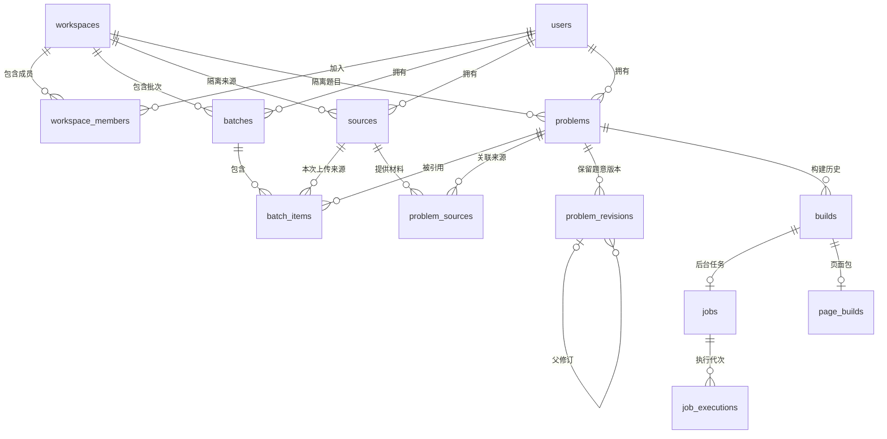

图中 `||` 表示恰好一个，`o|` 表示零或一个，`o{` 表示零到多个。
图中只画主要关系；所有工作空间归属和版本引用还需满足后文的复合外键约束。

```text
用户 A
├── A 的个人工作空间
│   ├── 批次 B1 / 项目 I1 ──┐
│   └── 批次 B2 / 项目 I2 ──┴→ 同一道题 P
│                               ├── 来源 S1：第一次截图
│                               ├── 来源 S2：另一张同题截图（后续语义匹配）
│                               ├── 题意 R1 → R2 → R3
│                               └── 构建 G1、G2、G3 及固定页面
└── 教研团队工作空间 ← 用户 B 也可加入
```

## 3. 公共类型、身份和约束

| 类型/字段 | 规则 |
| --- | --- |
| 业务主键 | 应用生成 UUID；不建立旧系统 ID 映射 |
| `workspace_id` | 业务数据隔离键；`users`、`workspaces` 不带该字段，成员关系表显式携带 |
| 时间 | `timestamptz`，数据库会话 UTC；界面按用户时区显示 |
| 状态 | `text + CHECK`，首版不使用 PostgreSQL 原生 enum |
| SHA256 | 64 位十六进制字符串，加格式约束 |
| 字节数/计数 | 非负 `bigint`；顺序字段用正整数 |
| 结构化内容 | JSONB；状态、外键和列表检索字段单独建列 |
| 删除 | 核心历史关系默认 `ON DELETE RESTRICT`，不提供级联清除历史的业务入口 |
| 可变元数据 | 带 `created_at/updated_at`；版本指针通过事务受控修改 |
| 不可变记录 | 题意修订、产物内容、完成的阶段证据及审查结论不覆盖；保留 `created_at` |

产品 UUID 与现有领域 JSON 中的 `problem_id/source_id/revision_id` 是不同身份体系。
生成与复用不得用数据库 UUID 改写领域 JSON，数学身份及哈希继续由既有合同校验。

记录的创建时间取实际创建时间；不需要未知历史作者、缺失历史时间或旧 ID 的兼容处理。

工作空间内的父子引用应使用 `(workspace_id, id)` 唯一键及复合外键。
用户引用本身指向全局 `users.id`；`owner_user_id/created_by_user_id` 等还需验证相应工作空间成员身份。
不通过工作空间名称、文件路径、URL 或哈希判断授权。

## 4. 用户与工作空间

### 4.1 `users`：全局用户身份

| 字段 | 类型 | 必填 | 意义 |
| --- | --- | --- | --- |
| `id` | uuid，PK | 是 | 用户唯一身份 |
| `key` | text，UNIQUE | 是 | 稳定内部标识；首版固定用户为 `internal`，不是登录密钥 |
| `display_name` | text | 是 | 用户展示名称 |
| `created_at` | timestamptz | 是 | 用户登记时间 |
| `updated_at` | timestamptz | 是 | 展示资料更新时间 |

首版不保存密码、手机号、验证码或登录令牌。认证方式留待账户功能阶段确定。
同一个用户加入多个工作空间时仍使用同一个 `users.id`，不复制用户记录。

### 4.2 `workspaces`：数据隔离边界

| 字段 | 类型 | 必填 | 意义 |
| --- | --- | --- | --- |
| `id` | uuid，PK | 是 | 工作空间唯一身份 |
| `slug` | text，UNIQUE | 是 | 稳定配置标识，例如 `default`；非空 |
| `name` | text | 是 | 展示名称，例如“数学说内部工作空间” |
| `created_at` | timestamptz | 是 | 创建时间 |
| `updated_at` | timestamptz | 是 | 展示名称等元数据更新时间 |

工作空间可以代表个人空间或团队空间；首版只初始化一个固定空间，不实现创建空间界面。
拥有成员或业务数据的空间不能直接删除。

### 4.3 `workspace_members`：用户与空间的多对多关系

| 字段 | 类型 | 必填 | 意义 |
| --- | --- | --- | --- |
| `workspace_id` | uuid，FK | 是 | 加入的工作空间 |
| `user_id` | uuid，FK | 是 | 加入空间的用户 |
| `role` | text | 是 | `owner / member`；空间拥有者或成员 |
| `created_at` | timestamptz | 是 | 加入时间 |

联合主键为 `(workspace_id, user_id)`。首版种子数据为固定用户、固定空间及一条 `owner` 成员关系。
空间成员关系决定能进入哪些空间，业务表 `owner_user_id` 决定某份数据归谁；两者不能混用。
首版没有成员邀请、移除和角色管理流程；角色不自动授予读取其他成员私有 raw 的权限。

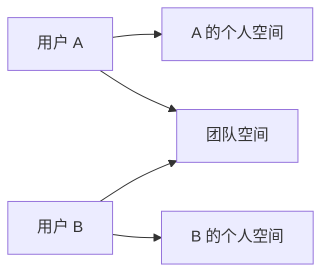

## 5. 批次、来源和题目身份

### 5.1 `batches`：一次题目集合操作

| 字段 | 类型 | 必填 | 意义 |
| --- | --- | --- | --- |
| `id` | uuid，PK | 是 | 批次身份 |
| `workspace_id` | uuid，FK | 是 | 所属空间 |
| `owner_user_id` | uuid，FK | 是 | 批次拥有者 |
| `name` | text | 否 | 展示名称；为空时可按时间展示 |
| `created_at` | timestamptz | 是 | 创建时间 |
| `updated_at` | timestamptz | 是 | 批次元数据更新时间 |

批次中的成功、失败、进行中数量由成员对应的任务/页面状态汇总，不维护另一份可独立修改的权威计数。
首版批次均由新上传产生，不设置历史导入分组或仅用于区分导入的 `origin` 字段。

### 5.2 `batch_items`：批次与题目的引用

| 字段 | 类型 | 必填 | 意义 |
| --- | --- | --- | --- |
| `id` | uuid，PK | 是 | 批次项身份 |
| `workspace_id` | uuid，FK | 是 | 所属空间 |
| `batch_id` | uuid，FK | 是 | 所属批次 |
| `position` | integer | 是 | 展示顺序，从 1 开始 |
| `problem_id` | uuid，FK | 是 | 此项引用的题目；允许被其他批次项重复引用 |
| `source_id` | uuid，FK | 是 | 此次上传实际使用的来源，而非题目的默认展示来源 |
| `initial_build_id` | uuid，FK | 否 | 此项首次提交的构建；只引用题目但未提交构建时为空 |
| `created_at` | timestamptz | 是 | 创建时间 |

约束：`CHECK(position >= 1)`、`UNIQUE(batch_id, position)`。
**不增加 `UNIQUE(problem_id)`，也不限制一道题只能属于一个批次。**
首次构建引用确定后保留；后续重建不覆盖它。具体构建必须属于本项题目。
批次历史构建固定版本；查看当前题目时按题目的当前指针解析，两种入口不能混淆。

语义匹配尚未完成的上传以后需单独的接入状态承载；本表代表已绑定题目的批次项。
未来接入状态机不通过把未验证的候选提前当作已匹配题目来实现，详见第 8 节。

### 5.3 `sources`：原始材料登记

| 字段 | 类型 | 必填 | 意义 |
| --- | --- | --- | --- |
| `id` | uuid，PK | 是 | 产品来源身份 |
| `workspace_id` | uuid，FK | 是 | 所属空间 |
| `owner_user_id` | uuid，FK | 是 | 来源材料拥有者 |
| `original_artifact_id` | uuid，FK | 是 | 已保存并通过完整性校验的原始上传文件登记 |
| `normalized_artifact_id` | uuid，FK | 否 | 标准化图片登记；尚未生成时为空 |
| `filename` | text | 是 | 清理路径后的原始展示文件名；不是磁盘读取路径 |
| `media_type` | text | 是 | 实际检测的原文件 MIME 类型，如 `image/jpeg` |
| `metadata` | jsonb | 是 | 默认 `{}`；宽高、页码、既有来源指纹和标准化描述等 |
| `created_at` | timestamptz | 是 | 来源登记时间 |

原图字节、文件哈希、大小、storage key 的权威是 `artifacts` 及产物存储，不在本表重复维护可编辑副本。
来源登记完成后冻结；不同图片保留不同来源，即使它们最终匹配同一道题。
相同文件的重复上传可以关联已有来源；一次上传请求的文件名等接收元数据需留在接入审计，不能覆盖首次来源记录。

现有提取器的规范化像素指纹、原图文件 SHA256 和标准化图片文件 SHA256 不保证相等。
`metadata` 复用现有来源合同，不以自行拼接的指纹替换领域来源身份。

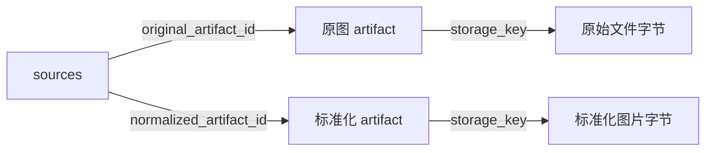

### 5.4 `problems`：稳定题目身份与当前指针

| 字段 | 类型 | 必填 | 意义 |
| --- | --- | --- | --- |
| `id` | uuid，PK | 是 | 稳定产品题目身份；修订和重建不改变它 |
| `workspace_id` | uuid，FK | 是 | 所属空间；题目不是全局共享题库条目 |
| `owner_user_id` | uuid，FK | 是 | 题目拥有者 |
| `primary_source_id` | uuid，FK | 是 | 默认展示来源；其他来源在 `problem_sources` 关联 |
| `title` | text | 否 | 列表标题，不作为数学事实 |
| `visibility` | text | 是 | `private / workspace`，默认 `private`；不存在自动公开 |
| `current_revision_id` | uuid，FK | 否 | 当前采用的题意修订；首次提取前可以为空 |
| `latest_build_id` | uuid，FK | 否 | 最近一次已提交构建，可能排队、运行或失败 |
| `current_page_build_id` | uuid，FK | 否 | 当前有效的 `page_builds.id`；无有效页面时为空 |
| `lock_version` | bigint | 是 | 初始 0；受控元数据/指针更新时递增，用于并发冲突检查 |
| `created_at` | timestamptz | 是 | 题目创建时间 |
| `updated_at` | timestamptz | 是 | 元数据或当前指针更新时间 |

`private` 只允许拥有者按业务权限读取；`workspace` 允许空间成员访问相应题目内容。
题目可见性不能自动开放原始响应、reasoning 等私有产物。
来源、修订、构建和页面引用必须属于同一空间及本题。

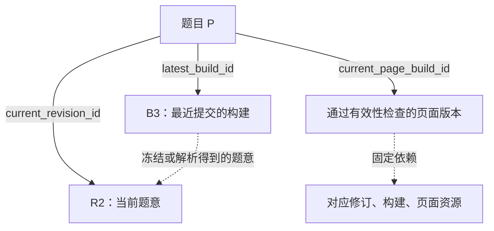

`latest_build_id` 不是最后一次成功构建。当前页面必须核对修订、请求和依赖，不能仅凭曾经成功来展示。
保存新题意修订时清除当前有效页面指针；旧构建及页面仍能从历史入口访问。

### 5.5 `problem_sources`：一题多来源与匹配关联

| 字段 | 类型 | 必填 | 意义 |
| --- | --- | --- | --- |
| `id` | uuid，PK | 是 | 来源关联身份 |
| `workspace_id` | uuid，FK | 是 | 所属空间 |
| `problem_id` | uuid，FK | 是 | 关联的稳定题目 |
| `source_id` | uuid，FK | 是 | 一份原始材料 |
| `matched_revision_id` | uuid，FK | 否 | 已验证匹配的具体题意修订；初始尚未提取或匹配未确认时为空 |
| `match_method` | text | 是 | `initial / file_hash / semantic / manual`；关联建立方式 |
| `match_evidence_artifact_id` | uuid，FK | 否 | 关联依据，例如文件哈希核对或后续语义条件对应证据 |
| `created_at` | timestamptz | 是 | 关联建立时间 |

`UNIQUE(problem_id, source_id)`。默认来源也必须有对应关联。
文件首次建立题目关系为 `initial`；再次上传可复用该关联，单次匹配过程由请求审计保存。
`semantic` 仅在后续核验功能接通后使用，P1 不生成伪语义匹配证据。
首次取得可靠的匹配修订时允许一次性补全空引用；新的判断、撤销或重判需保留独立匹配证据，不覆盖既有历史结论。

同一来源若因后续人工判定等原因关联多个独立题目，查找时记录歧义，不任意选一个自动引用。

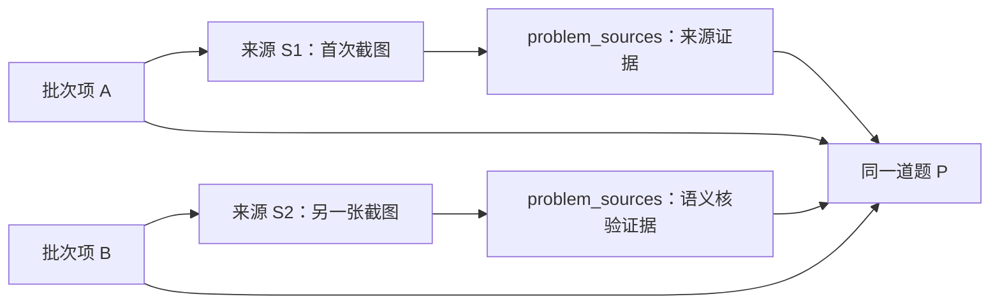

## 6. `problem_revisions`：不可变题意版本

| 字段 | 类型 | 必填 | 意义 |
| --- | --- | --- | --- |
| `id` | uuid，PK | 是 | 产品修订身份，不覆盖领域 revision ID |
| `workspace_id` | uuid，FK | 是 | 所属空间 |
| `problem_id` | uuid，FK | 是 | 所属题目 |
| `revision_no` | integer | 是 | 题目内版本号，从 1 开始递增 |
| `parent_revision_id` | uuid，FK | 否 | 本次修订基于的产品修订；第一版时为空 |
| `kind` | text | 是 | `extracted / manual`；自动提取或人工修订 |
| `domain_json` | jsonb | 是 | 完整 `ProblemGraph`：对象、已知条件、目标及小问结构 |
| `verified_json` | jsonb | 是 | `VerifiedProblem` 完整序列化结果，含领域身份及校验证据 |
| `semantic_hash` | text | 是 | 现有领域算法生成的语义指纹 |
| `schema_version` | text | 是 | `domain_json` 的合同版本 |
| `human_diff` | jsonb | 否 | 人工修订相对父版本的结构化差异，供审阅使用 |
| `created_by_user_id` | uuid，FK | 是 | 登记修订的用户；首版使用默认用户 |
| `origin_build_id` | uuid，FK | 否 | 题意来源证据所在构建；人工修改可以继承来源关联 |
| `created_at` | timestamptz | 是 | 修订创建时间 |

约束：`UNIQUE(problem_id, revision_no)`；父修订必须同题、版本号更早。
所有修订必须有完整校验与 promotion 证据，不保留不完整历史的可空兼容。
尚未完成提取的题目可以没有修订，不以空 JSON 补造提取成功。

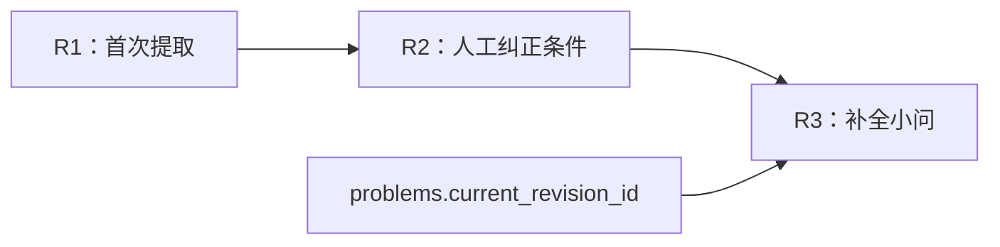

### 6.1 JSON 内容与权威

```text
domain_json
├── schema_version：题意图合同版本
├── problem_id：领域题目身份
├── family_id：题型家族
├── source：领域来源信息
└── root：根作用域
    ├── source_text：题干文字
    ├── entities：数学对象
    ├── facts：已知条件及关系
    ├── goals：待证明或求解的目标
    └── children：子作用域和小问
```

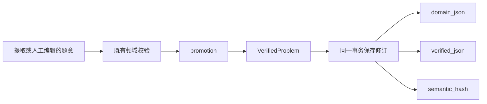

新修订要求 `domain_json` 与 `verified_json.graph` 一致，semantic hash 与领域计算结果一致。
`schema_version` 与 `domain_json.schema_version` 一致；verified JSON 自己保留另一层合同版本。
不能提供两个互不约束的 JSON 编辑入口。修订是数据库题意权威，导出的题意文件只是构建审计副本。

`human_diff` 保存 path/before/after 等差异；恢复读取完整 domain JSON，不依靠重放差异拼接题意。
`semantic_hash` 不设全局唯一，同题恢复到过去语义也可以产生新的历史版本。

### 6.2 保存与并发

保存前校验 `base_revision_id`，事务内锁定题目、再次比较基础修订，分配新版本号后更新当前指针和 `lock_version`。
两个操作基于同一旧修订提交，只允许一个生效；另一方返回冲突。
规范化后没有语义变化时沿用现有规则返回当前修订，不无故生成重复版本。
保存题意不提交模型任务；重建需另行预览影响并提交构建。

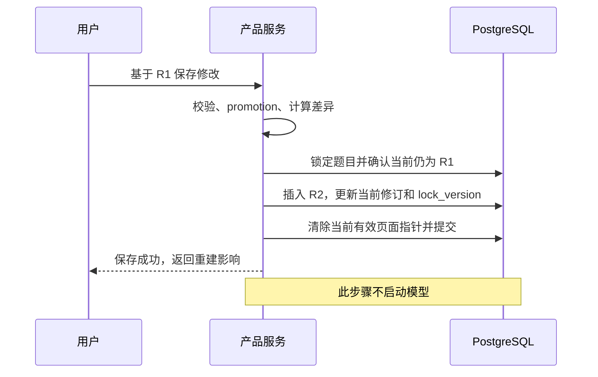

## 7. 第一阶段重复文件匹配

重复上传默认引用已有题目；上传服务接线在 P2/P3，P1 提供数据与事务接口。

1. 保存并校验原始文件 SHA256。
2. 只在当前 workspace、当前 owner 范围内查找同文件来源及题目关联。
3. 唯一命中时创建新的批次项，关联已有题目和本次来源；不创建新的题意修订。
4. 未命中时建立来源、题目、初始来源关系及批次项。
5. 相同文件并发上传应按 `(workspace_id, owner_user_id, file_sha256)` 协调事务并在锁内重查，避免同时创建两道题。
6. 文件相同但已有多个题目候选时记录歧义；不以数据库返回顺序决定题目身份。

文件匹配证明来源相同，不证明当前人工修订仍与原图完全一致，也不证明旧页面仍有效。
沿用题目身份后，页面和重建继续检查当前修订及依赖。引用已有题目本身不触发付费模型调用。
同一题被多批次引用时共享修订历史；各批次具体构建记录和历史页面仍固定自己的版本。

## 8. 后续语义同题判断

**当前不实现向量搜索，也不把语义去重作为一期前置条件。**一期只执行第 7 节的文件 SHA256 匹配：
唯一命中则引用已有题目，未命中则建立新题目并进入正常生成链，不调用 embedding 或语义匹配模型。
不安装 pgvector，不增加向量列、向量索引、向量生成/回填任务、检索 API 或相应验收门禁。
以下仅保留后续讨论的概念和判定边界，具体方案需重新确认。

### 8.1 后续匹配的概念流程（暂不接入）

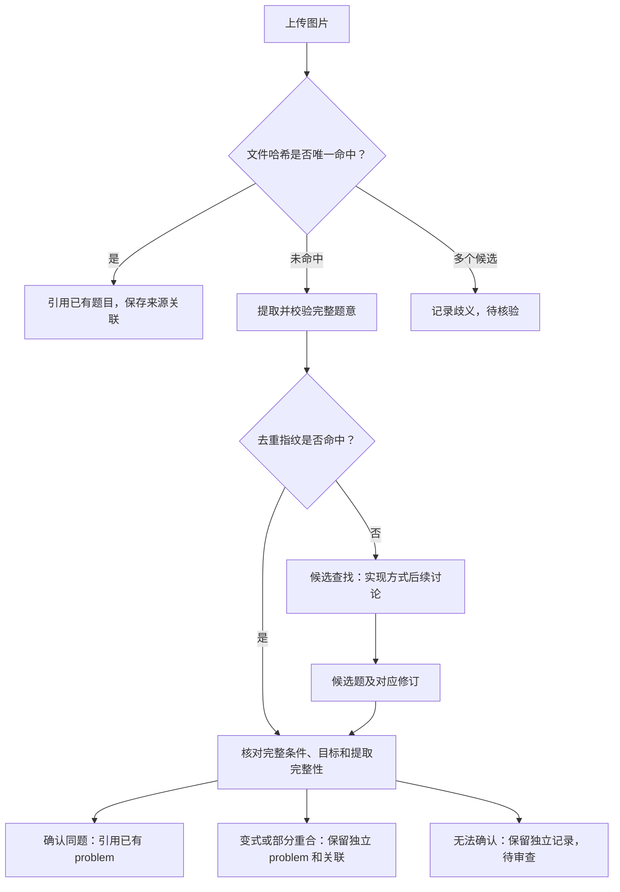

### 8.2 规范化题意指纹

后续可考虑独立、带规则版本的 `dedup_fingerprint`，当前不新增，不更改现有 semantic hash 合同。
必须保留对象关系、数值、公式、单位、取值范围、端点开闭、小问目标、条件作用域和图中明确条件。
可以规范化排版、题号、分值、换行和无意义内部 ID；表达式等价转换必须保留定义域。
指纹命中后仍比较规范化内容，检查是否漏提条件。

当前 [`_graph_semantic_equivalence_payload`](../server/shuxueshuo_server/solver/extraction/problem_domain.py)
用于跨修订语义检测，仍包含领域 problem ID、题号、分值和规范化题干文字，不能直接作为跨来源同题键。
现有原图来源身份见 [`source_identity.py`](../server/shuxueshuo_server/solver/extraction/source_identity.py)。

### 8.3 向量搜索暂不实现

向量仅是后续查找相似候选的一种可选方式，当前不确定技术选型、模型或接入排期。
若以后采用，检索内容需保留完整条件和各问目标；最终仍要逐项核对数学条件，相似度不是同题证明。
下面是后续同题核验需遵守的判定原则，不表示当前已具备语义匹配能力。

| 差异 | 判定原则 |
| --- | --- |
| 仅排版、题号、分值不同 | 同题 |
| 文字改写，全部条件及目标一致 | 核验后同题 |
| 一个系数、坐标或不等号不同 | 独立题目，可记录为变式 |
| 缺少或多出一问 | 整题不同，可记录部分重合 |
| 点名全换但结构同构 | 默认独立变式，不自动复用原页面 |
| 正负号或图示条件无法确认 | 待审查，不自动合并 |

检索默认仍限定当前 workspace、当前 owner。相同内容不扩大权限。
匹配历史修订时记录 `matched_revision_id`，不自动覆盖当前人工修订，也不自动搬用旧 checkpoint。

### 8.4 后续重新设计的边界

当前数据库仍采用普通 PostgreSQL。是否使用 pgvector 或其他候选检索方式，后续结合需求与真实题对评测重新决定。
当前不创建 `problem_search_documents`、`problem_match_decisions` 等语义检索专用表，亦不预置 embedding 数据。
如未来采用向量，它应作为按修订和模型版本登记的可重建派生数据，不替代题意权威。
检索表结构、模型和维度、阈值、候选数量、复杂等价规则及接入任务状态机均留待后续讨论。
语义模式应先保存来源和接入记录，匹配完成后再绑定稳定题目；不能把候选提前标记成已确认题目。
既有来源身份可能不同，若需要在已有题目下生成新修订，必须显式校验身份映射，不改写已验证历史产物。

参考：[pgvector](https://github.com/pgvector/pgvector)、
[Retrieve & Re-Rank](https://www.sbert.net/examples/sentence_transformer/applications/retrieve_rerank/README.html)。

## 9. 构建、任务与阶段执行

以下表是 P1 持久化设计，队列及执行循环在 P2 接通。
本节及后续表格中，除特别声明的关联主键外，实体表包含 `id uuid PK`、`workspace_id uuid FK`、`created_at timestamptz`。
字段后的 `?` 表示可空；`*_id` 使用 UUID，`*_json` 使用 JSONB，时间使用 timestamptz。

### 9.1 表与主要字段

| 表 | 字段 | 意义与约束 |
| --- | --- | --- |
| `builds` | `problem_id`、`parent_build_id?`、`source_id`、`requested_revision_id?`、`resolved_revision_id?` | 所属题目、父构建、本次实际来源、请求修订及最终绑定修订；构建必须冻结实际来源，不能运行时改读 primary source |
| `builds` | `pipeline_key text`、`pipeline_version text`、`pipeline_snapshot jsonb` | 流水线类型、定义版本及不可变定义快照，均必填；每次构建按自己的快照解释阶段和完成条件 |
| `builds` | `from_stage text`、`target_dependencies jsonb`、`target_fingerprint text`、`deployment_version text`、`effective_config jsonb` | 请求重建起点及冻结依赖；指纹包含流水线定义；配置脱敏，创建构建前必须准备完整 |
| `builds` | `status text`、`started_at?`、`finished_at?`、`error_code text?` | 运行结果；请求内容冻结，状态允许受控推进 |
| `jobs` | `build_id UNIQUE`、`status text`、`execution_epoch bigint`、`active_execution_id?`、`lease_expires_at?` | 首版一个构建一个任务；epoch 与 lease 管理执行权 |
| `jobs` | `cancel_requested_at?`、`delivery_count bigint`、`retry_budget jsonb` | 取消请求、投递次数和有界预算；不把所有重试混成一个数字 |
| `job_executions` | `job_id`、`epoch bigint`、`worker_id text`、`status text`、`started_at`、`heartbeat_at`、`finished_at?`、`failure_code text?` | 一次实际取得执行权；`UNIQUE(job_id, epoch)` |
| `build_stages` | `build_id`、`stage_key text`、`ordinal smallint`、`status text`、`accepted_attempt_id?`、`summary text?` | 本次冻结定义中的阶段状态和采用结果；`UNIQUE(build_id, stage_key)`、`UNIQUE(build_id, ordinal)`；ordinal 为正数，不限制为 1–9 |
| `stage_attempts` | `build_stage_id`、`execution_id?`、`attempt_no int`、`kind text`、`status text`、`started_at?`、`finished_at?` | `UNIQUE(build_stage_id, attempt_no)`；kind 为 `executed / reused`；实际执行必须有 execution，准备阶段的复用可无 |
| `stage_attempts` | `manifest_json jsonb?`、`manifest_artifact_id?`、`manifest_sha256 text?`、`checkpoint_artifact_id?`、`reused_from_attempt_id?` | 冻结依赖及可恢复证据；复用保留原来源，不伪造执行 |

新增的 `builds.source_id` 与一题多来源配套，明确哪份材料参与本次构建。
来源相同、题意相同、恢复证据可用是不同判断，复用继续经过原有身份和依赖门禁。

当前首个流水线定义版本包含九个阶段：source → observation → extraction → projection → solver → evidence → lesson → visual → page。
这是当前版本的执行顺序，不是数据库永久固定的阶段集合；增删阶段通过新的流水线定义版本表达。
数据库不对 `stage_key` 或 `from_stage` 设置只允许这九个值的约束，提交时按本次冻结定义和受支持执行器校验。

| 对象 | 状态 |
| --- | --- |
| build | `initializing / queued / running / succeeded / failed / interrupted / cancelled` |
| job | `queued / running / succeeded / failed / interrupted / cancelled` |
| stage | `pending / running / succeeded / failed / blocked / interrupted / cancelled` |

### 9.2 事务边界

- 重新取得执行权时 epoch 增加；每次阶段提交和最终提交都检查 epoch，旧执行不能写入。
- 模型调用期间不持有数据库事务；领取、阶段检查点和最终提交使用短事务。
- `accepted_attempt_id` 必须属于本阶段，已接受结果完成后不可改写内容。
- 创建构建时校验并冻结 pipeline 定义，按该定义一次性创建阶段记录；与请求、job、事件及 outbox 一同提交，不能产生半套阶段。
- 首次提取可以一次性绑定 resolved revision；不能更改已有构建的请求来冒充重建。
- 空库初始化不创建 job、execution 或 outbox；只有新系统接收的构建请求才产生任务。
- 数据库记录执行权与结果，不实现轮询数据库领取待执行任务的第二套消息队列。

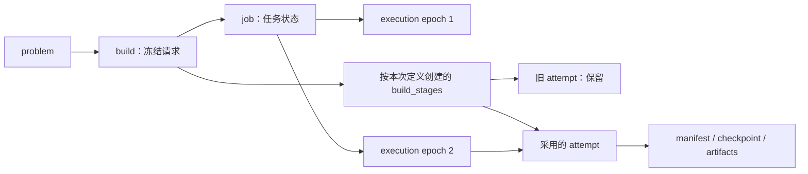

### 9.3 流水线版本与冻结定义

| 新增字段 | 意义 |
| --- | --- |
| `builds.pipeline_key` | 流水线类型的稳定标识，例如 `problem_lesson`；不是具体任务 ID |
| `builds.pipeline_version` | 该类型的定义版本；阶段集合、依赖、合同或完成规则变化时产生新版本 |
| `builds.pipeline_snapshot` | 提交构建时实际采用的完整定义；既是执行解释依据，也是旧构建的展示依据 |

流水线定义在 Git 中维护，创建构建时读取受支持的定义并存入快照，不接受用户任意提交可执行流程。
相同 `(pipeline_key, pipeline_version)` 不能在后续部署中换成不同定义；变更展示名称也生成新定义版本，旧快照保留原名称。
一期不增加可在线编辑的流水线管理表、通用动态工作流系统或分支/并行执行引擎。

快照包含的最小内容：

| 快照内容 | 意义与校验 |
| --- | --- |
| `schema_version` | 快照自身的存储格式版本；与 pipeline 定义版本、Alembic revision 分开 |
| `stages[].stage_key` | 本定义内唯一、非空的阶段标识；不能将一个 key 改用为完全不同的职责 |
| `stages[].title` | 提交时的展示名称；读旧构建时不查当前代码中的阶段名替代 |
| `stages[].ordinal` | 唯一的正数展示/顺序执行位置；写入 `build_stages` 的对应列 |
| `stages[].contract_version` | 阶段输入输出及检查点合同版本，决定执行器和恢复兼容性 |
| `stages[].depends_on` | 直接依赖的 stage key 列表；必须存在于本定义、无重复/自环/循环 |
| `completion.required_stages` | 该构建成功必须完成的阶段集合；当前版本为全部九阶段 |
| `completion.required_artifacts` | 必须由指定阶段提供的逻辑产物及合同要求；当前包括有效解析页面包及其所需材料 |

上述是受代码校验的声明式内容，完成条件不能携带任意脚本。
当前顺序执行器还要求所有依赖在执行顺序上先于使用阶段；未来是否支持并行另行设计。
数据库阶段行的 key、数量和 ordinal 必须与快照一致，title、合同和依赖从快照读取，避免另一套可独立编辑的定义。

`target_fingerprint` 覆盖 pipeline key/version、规范化定义快照以及已有目标依赖、有效配置和输入标识。
JSON 对象键按规范化规则处理，阶段列表等有意义的顺序必须保留；不能以整个快照的字符串排版变化代替语义变化。
阶段资源、prompt、配置及实际输入指纹继续保存在 `target_dependencies` 和 manifest 中，流水线版本不替代它们。
`deployment_version` 绑定实际代码部署，`contract_version` 绑定接口合同，三者职责独立。

### 9.4 新增、删除与修改阶段

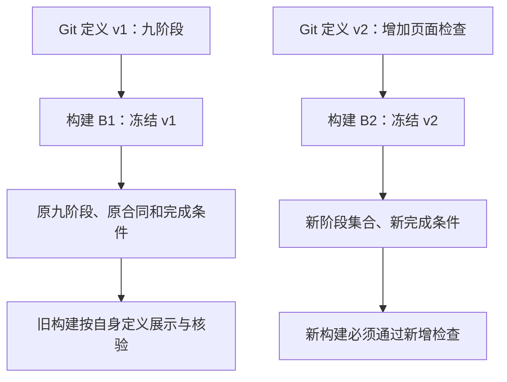

| 变更 | 新构建 | 既有构建 |
| --- | --- | --- |
| 新增阶段 | 新定义包含新阶段，完成规则明确是否必需 | 不补插阶段，不把原成功状态改成未完成 |
| 删除阶段 | 新定义移除该阶段并校验剩余依赖 | 保留原阶段、attempt、产物及证据，不做物理删除 |
| 修改实现 | 固定新部署及阶段资源指纹，按变化范围重建 | 保留原实现指纹及产物；不能因 stage key 相同就复用 |
| 修改输入输出合同 | 提升阶段合同版本，验证执行和恢复兼容性 | 不把旧 checkpoint 直接当作新合同输入 |
| 拆分/合并阶段 | 使用新的阶段标识及依赖关系 | 不改名旧记录冒充新结构，不自动按位置映射 |
| 修改展示名称 | 新定义保存新 title | 使用原快照中的 title，保留准确历史 |

不提供运行中编辑 pipeline snapshot 或增删阶段记录的业务接口；切换流程产生新的构建。
当前必需阶段均必须成功；未完成、失败或 blocked 不能被省略检查，也不引入含糊的“跳过即成功”。
阶段复用通过 `kind=reused` 的 attempt 和校验证据表达，满足合同后才计为成功。

### 9.5 依赖、重建与旧执行恢复

`ordinal` 不是依赖权威。例如 visual 同时使用 evidence 与 lesson，必须在冻结定义中表达其依赖。
`from_stage` 表示用户请求的起点，必须属于目标定义；实际受影响集合按依赖及产物指纹计算。
一期仍可保守地重建受影响起点之后的完整后缀，但后缀必须覆盖全部失效依赖闭包，不能只按数字位置判断可复用。
跨定义重建若原 stage key 已删除，返回过期计划/起点冲突并重新预览，不静默映射到相同 ordinal 的另一阶段。

旧结果复用至少核对实际输入、代码/prompt/配置指纹、阶段合同、上游依赖和 checkpoint 完整性。
跨流水线版本并非一律禁止复用，但必须由领域代码明确支持兼容关系；没有兼容证据则重新执行，不凭相同名称或版本号猜测。
展示名称变化不必强迫重新调用模型，实际阶段依赖和合同未变时可按上述规则复用，快照和目标指纹仍记录新定义。

旧构建中断后按原 snapshot、原合同和冻结依赖恢复，由兼容的部署/Worker 执行；每次提交仍检查 execution epoch。
升级前排空旧任务或保留兼容 Worker，不能让最新代码无条件接手并重新解释旧阶段。
找不到兼容执行环境时明确中止恢复并记录原因；若用户提交新流程，创建采用新定义的子构建，原运行保持可追溯。
UI 的阶段列表、标题、进度分母和历史完成状态均读取本次快照，不根据当前全局 STAGES 补齐或过滤。
能显示旧快照不代表当前 Worker 能执行旧合同，未知快照格式应明确提示，不降级为当前定义猜测展示。

## 10. 产物、调用与诊断

### 10.1 关系表

| 表 | 字段 | 意义与约束 |
| --- | --- | --- |
| `artifacts` | `owner_user_id`、`producer_build_id?`、`producer_attempt_id?`、`artifact_type text` | 归属、生产构建、阶段尝试和产物类型 |
| `artifacts` | `storage_key text UNIQUE`、`sha256 text`、`size_bytes bigint`、`content_type text`、`schema_version text?` | 不可变文件定位和完整性；禁止机器绝对路径 |
| `artifacts` | `access_class text`、`availability text` | 访问类别和文件可用性；availability 为 `verified / missing / corrupt`；文件完整不等于数学已验证 |
| `stage_artifacts` | `stage_attempt_id`、`artifact_id`、`role text`、`name text`、`position int`、`reused_from_artifact_id?` | input/output/raw/validation/configuration/call 角色、顺序和复用来源 |
| `artifact_dependencies` | `artifact_id`、`depends_on_artifact_id`、`kind text` | 三字段唯一；kind 为 `audit / build_input / reuse` |
| `model_calls` | `origin_attempt_id`、`provider text?`、`request_model text?`、`response_model text?`、`provider_version text?`、`provider_request_id text?` | 一次真实调用的来源和型号审计；供应商未提供的版本保留 NULL |
| `model_calls` | `call_kind text`、`started_at?`、`duration_ms bigint?`、`status text`、`usage_json jsonb?`、`input_tokens bigint?`、`output_tokens bigint?` | 调用种类、耗时、结果和原始用量；缺用量为 NULL，不记成 0 |
| `model_calls` | `request_artifact_id?`、`response_artifact_id?`、`audit_artifact_id` | 完整请求、响应及调用登记证据；没有返回时不补造响应 |
| `stage_call_refs` | `stage_attempt_id`、`model_call_id`、`relation text` | `executed / reused`；引用旧调用不重复计入实际消耗 |
| `diagnostics` | `build_id`、`stage_attempt_id?`、`code text`、`severity text`、`message text`、`details jsonb?`、`evidence_artifact_id?` | 可检索错误索引及完整证据关联 |

manifest 的数据库 JSONB 索引和审计文件通过哈希/版本关联，不允许各自编辑。
成功阶段必须具备配套 manifest 和所需恢复证据；执行中或失败阶段允许尚无完成材料，不能据此认定可恢复。
审计依赖与构建依赖分开，现有宽泛审计 DAG 不能直接决定重建范围。

### 10.2 数据与文件权威

| PostgreSQL | 产物存储 |
| --- | --- |
| 用户、工作空间、来源关联、批次、题意修订 | 原始图片、标准化图片、PDF/裁剪图 |
| 构建请求、任务状态、执行权、事件、幂等、outbox | 完整模型请求/响应/reasoning |
| 产物登记、依赖索引、调用用量和诊断索引 | Plan、typed checkpoint、ExplanationSnapshot、LessonIR、VisualStepIR |
| 当前页面指针、审查结论 | 固定 HTML、CSS/JS、SVG、manifest 审计快照 |

密钥不进入数据库有效配置快照或产物。题目对工作空间可见不等于 raw 可以作为页面资源读取。

### 10.3 存储接口

以下为接口草案，完整产物和关系提交由 repository/service 协调：

```python
ArtifactStorage.put_immutable(key, stream, expected_sha256=None) -> StoredObject
ArtifactStorage.open(key) -> BinaryIO
ArtifactStorage.stat(key) -> ObjectStat
ArtifactStorage.verify(key, sha256, size) -> VerificationResult

ArtifactRepository.register(metadata, transaction) -> Artifact
ArtifactRepository.get(workspace_id, artifact_id) -> Artifact
```

storage key 示例：

```text
workspaces/{workspace_id}/sources/{source_id}/{artifact_id}
workspaces/{workspace_id}/builds/{build_id}/{artifact_id}
```

先在同一文件系统临时写入并计算哈希，再采用不覆盖已有文件的原子提交，同步文件与目录，最后提交数据库引用。
同 key 同内容可幂等成功，同 key 不同内容必须失败。数据库回滚后的无引用文件进入孤儿报告。
禁止绝对路径、`..` 和符号链接越界；P1 孤儿扫描只报告，不自动删除。

## 11. 页面与人工审查

| 表 | 字段 | 意义与约束 |
| --- | --- | --- |
| `page_builds` | `build_id UNIQUE`、`revision_id`、`entry_artifact_id`、`package_manifest_artifact_id`、`package_sha256 text` | 不可变页面包；必须绑定有效修订和完整页面产物 |
| `page_assets` | `page_build_id`、`relative_path text`、`artifact_id` | `UNIQUE(page_build_id, relative_path)`，页面入口只能访问登记资源 |
| `review_decisions` | `page_build_id`、`revision_id`、`reviewer_user_id`、`decision text`、`comment text?`、`supersedes_id?` | 追加式审查，decision 为 `approved / rejected / revoked`；引用必须同一页面版本 |

页面终态提交在同一事务完成：按本次 `pipeline_snapshot.completion` 检查必需阶段及产物合同，
核对阶段记录与快照一致、产物完整性、当前执行权、取消状态、题意和目标依赖；
登记页面、构建结果及事件，只有仍为本题最新有效请求时才更新当前页面指针。
旧构建晚完成可以保留成功历史，但不能覆盖新修订或新请求的页面指针。
人工通过只绑定具体页面和修订，新构建不继承旧批准状态。
新增流水线检查不回写旧构建的成功结果；旧页面能否继续作为当前有效内容，可按新的使用要求单独判断并提示重建。

## 12. 幂等、事件与 outbox

| 表 | 字段 | 意义与约束 |
| --- | --- | --- |
| `idempotency_requests` | `user_id`、`operation text`、`request_id text`、`request_hash text`、`resource_type text?`、`resource_id uuid?`、`response_json jsonb?` | `UNIQUE(workspace_id, user_id, operation, request_id)` |
| `event_streams` | `stream_kind text`、`aggregate_id uuid`、`last_seq bigint`、`min_retained_seq bigint` | `UNIQUE(workspace_id, stream_kind, aggregate_id)`；各流单调序号 |
| `events` | `stream_id`、`seq bigint`、`event_type text`、`schema_version text`、`payload jsonb` | `UNIQUE(stream_id, seq)`；断线补读权威 |
| `outbox_messages` | `job_id`、`message_type text`、`protocol_version text`、`payload jsonb`、`dedupe_key text UNIQUE` | 可靠发布的任务标识与协议，不包含另一份可编辑题意 |
| `outbox_messages` | `status text`、`attempt_count int`、`available_at`、`locked_until?`、`publisher_token?`、`published_at?`、`last_error text?` | 发布状态、重试和发布器租约；P2 执行发布循环 |

- 创建构建时，幂等记录、build/job、最新请求指针、事件和 outbox 同事务提交。
- 同 request ID、同内容返回原结果；同 ID 不同内容返回冲突。
- 事件追加先锁定对应 stream 行，在事务内分配序号；不能直接用全局自增 ID 当安全补读水位。
- P1 不清理事件；保留期和过期游标响应由 P2 实现。
- publisher confirm 后再标记 outbox；重复发布仍可能发生，Worker 业务提交必须幂等。
- P1 只实现记录和事务接口，不启动 RabbitMQ、Celery 或数据库轮询派工逻辑。

## 13. 索引与跨表一致性

### 13.1 主要索引

| 表/用途 | 索引 |
| --- | --- |
| 题目列表 | `problems(workspace_id, updated_at DESC, id)`；按 owner 过滤的查询配套索引 |
| 文件候选 | `artifacts(workspace_id, owner_user_id, sha256)` 加来源/题目关联索引；哈希不设全局唯一 |
| 构建历史 | `builds(workspace_id, problem_id, created_at DESC)` |
| 任务监控 | `jobs(workspace_id, status, created_at)`，活动状态部分索引 |
| 阶段恢复 | build/stage 和 stage/attempt 的唯一索引 |
| 产物查询 | `artifacts(workspace_id, producer_build_id, artifact_type)` |
| 依赖引用 | artifact dependencies 正向唯一约束和反向引用索引 |
| 补读事件 | `events(stream_id, seq)` |
| 待发 outbox | 待发布状态下 `(available_at, created_at)` 部分索引 |
| 诊断/用量 | diagnostics 按 workspace/code/time；model_calls 按 workspace/provider/time |

高频外键补索引，首版不对所有 JSONB 建 GIN，不提前建向量索引。

### 13.2 不变量

- 用户为全局身份，其业务操作和资源归属均有显式 workspace 上下文。
- 所有空间内引用保持相同 workspace；修订、构建、页面指针还需保持同一 problem。
- `initial_build_id` 属于批次项题目；`matched_revision_id` 属于来源关联题目。
- 默认来源存在于 problem_sources；批次项使用的来源也需有本题关联。
- 当前修订的父链单调递增，不允许循环；当前指针和创建版本在同一事务维护。
- 冻结请求和完成产物不可覆盖，运行状态与执行权允许条件更新。
- pipeline snapshot 与对应阶段行在提交时完整一致；所有成功判定读取本次定义，不使用全局固定九阶段列表。
- 新写入关系不完整时拒绝提交，不为满足外键而伪造领域题目、父修订或执行证据。

## 14. 空库初始化

首次安装只创建结构及最小种子数据。既有 SQLite 和产物留在原处，不属于新库初始化输入。
不实现旧记录映射、导入登记表、导入命令、补造缺失证据或历史回填流程。

### 14.1 种子数据

| 表 | 初始化结果 |
| --- | --- |
| `users` | 一条：`key=internal`，`display_name=默认用户` |
| `workspaces` | 一条：`slug=default`，`name=默认工作空间` |
| `workspace_members` | 一条：关联上述 user/workspace，`role=owner` |
| 其他业务表 | 全空，包括批次、来源、题目、修订、构建、任务、事件和产物 |
| `alembic_version` | 记录当前结构 revision，属于数据库管理元数据 |

首版所有使用者通过同一个默认用户和工作空间操作，服务端固定注入该上下文，不接受客户端任意指定用户来替代认证。
这不代表已经实现多用户隔离或登录；多对多成员表仅保留未来扩展结构，当前仍限本机或受限内部使用。

### 14.2 初始化顺序和幂等


种子创建在单独事务中执行，按 `users.key`、`workspaces.slug` 和成员联合主键查找/创建。
初始化并发调用时依靠数据库唯一约束和事务保证各一条；UUID 在首次创建时生成，重复运行沿用原 ID。
种子部分存在时补齐缺失关联；已有角色或身份配置与预期冲突时明确报错，不静默改权。
重复安装不重置名字、角色或业务数据，也不以“空库起步”为由清空已开始使用的新库。
首次安装验收业务表为空；后续重跑只检查种子和结构有效，不要求业务表重新变空。

P1 提供建表、种子和管理接口；P2 接通统一入口时直接使用新库，只处理新提交的请求。
旧 worker 停止接收新请求并完成停用交接；不搬迁其运行记录，也不建立旧库和新库双写。

## 15. 目录、安装、部署与备份脚本设计

本节保留已审阅的目录与脚本设计。P1 已实现的命令、具体参数及环境验收状态以[安装手册](../deploy/product/README.md)为准；P2 标注的 API/Worker 配置仍待实现。

### 15.1 技术与交付

- 本地与服务器统一 PostgreSQL 17 主版本；服务器交付锁定补丁版本和镜像 digest，本地记录实际补丁版本并校验兼容性；SQLAlchemy 2.0 + psycopg 3 同步事务接口。
- Alembic 迁移独立执行；自动生成结果人工检查约束、索引、改名及旧数据处理。
- `server/shuxueshuo_server/product/`：模型、repository、事务服务、存储、种子初始化和管理 CLI。
- `server/alembic/`：结构迁移；数据库 revision 与数学 JSON schema version 独立。
- `deploy/product/`：Compose、admin 镜像、环境模板、Bash 管理入口。
- Bash 负责参数与编排，Python 负责数据库检查和幂等种子初始化；Alembic 只管理结构版本。

| 服务器 Compose 服务 | 行为 |
| --- | --- |
| postgres | 默认启动；命名持久卷、healthcheck、重启策略；只映射 `127.0.0.1:5432`，端口可配置 |
| admin | 一次性运行结构升级、种子初始化和检查；与项目代码同版本 |
| API/Worker/RabbitMQ | P2 接入，P1 安装不启动 |

本地模式直接运行 PostgreSQL，使用 uv 同步开发依赖和执行管理命令；安装、启动、自检和备份都不依赖 Docker。
macOS 通过 Homebrew 安装 `postgresql@17`，脚本使用该版本的原生工具；具体实例管理见 §15.8。
服务器管理命令使用 admin 容器；镜像支持 arm64/amd64，并支持加载离线镜像包，不能因拉取失败而自动切换未经记录的镜像版本。
仅服务器要求预装 Docker/Compose，脚本只检查，不承担操作系统级 Docker 安装。

### 15.2 配置

| 配置 | 含义 |
| --- | --- |
| `PRODUCT_DATA_DIR` | Git 外持久化目录；macOS 默认 `$HOME/Library/Application Support/shuxueshuo/local`，服务器默认 `/srv/shuxueshuo`，允许覆盖 |
| `PRODUCT_INSTANCE` | 本地默认 `local`，服务器默认 `server`；绑定独立数据目录；服务器固定 Compose project 为 `shuxueshuo-product-{instance}` |
| `PRODUCT_DB_PORT` | 默认 5432，仅 loopback |
| `PRODUCT_PG_BIN_DIR` | 仅本地：PostgreSQL 17 工具目录；macOS 通过 `brew --prefix postgresql@17` 定位，不写死 Intel/Apple Silicon 路径 |
| `PRODUCT_PG_DATA_DIR` | 仅本地：默认 `${PRODUCT_DATA_DIR}/postgres`，保存本实例的原生 PostgreSQL 集群文件 |
| `PRODUCT_DATABASE_URL` | 普通业务账号连接串 |
| `PRODUCT_MIGRATION_DATABASE_URL` | 迁移账号连接串 |
| `PRODUCT_ARTIFACT_ROOT` | 宿主机默认 `${PRODUCT_DATA_DIR}/artifacts`；容器内固定 `/var/lib/shuxueshuo/artifacts` |
| `PRODUCT_WORK_ROOT` | 宿主机默认 `${PRODUCT_DATA_DIR}/work`；容器内固定 `/var/lib/shuxueshuo/work`，存执行临时文件 |
| `PRODUCT_BACKUP_ROOT` | 宿主机默认 `${PRODUCT_DATA_DIR}/backups`；备份管理容器内固定 `/var/lib/shuxueshuo/backups` |
| `PRODUCT_WORKSPACE_SLUG` | 固定空间 `default` |
| `PRODUCT_INTERNAL_USER_KEY` | 固定用户 `internal` |

凭据首次生成，重复安装不覆盖；凭据文件 `0600`，不覆盖现有 `server/.env`，不打印含密码的连接串。
数据库角色区分 bootstrap 管理员、migration owner、app；app 无 DDL 权限。
不可变表不向普通 app 授予常规 UPDATE/DELETE；需一次性补全的字段通过受限列权限/事务入口处理。
成员关系与修订内容不能靠宽泛授权绕过；种子初始化使用管理权限，不能开放为无权限校验的业务入口。

### 15.3 管理入口与执行顺序

```bash
# 命令示意；服务器 --release 使用已校验发布包的绝对路径，完整参数见安装手册
./deploy/product/local/install.sh
./deploy/product/server/install.sh --release <absolute-release-directory>

./deploy/product/manage.sh --mode local status
./deploy/product/manage.sh --mode local db-start
./deploy/product/manage.sh --mode local db-stop
./deploy/product/manage.sh --mode local migrate
./deploy/product/manage.sh --mode local seed
./deploy/product/manage.sh --mode local doctor

./deploy/product/manage.sh --mode server backup
./deploy/product/manage.sh --mode server restore --backup <path> --target <new-instance>
./deploy/product/server/deploy.sh --release <absolute-release-directory>
```

`local/install.sh` 与 `server/install.sh` 是两个明确入口，共享公共逻辑，模式统一命名为 local/server。
Linux 开发机也可使用 local 模式；server 表示服务器交付方式，不单指操作系统。
管理命令显式选择 mode，可用 `--data-dir <absolute-path>` 和 `--instance <name>` 指定其他实例。
实例名、数据目录、本地 PGDATA 或服务器数据库卷须成组绑定并校验，不能因切换 Git worktree 或工作目录而误连另一套数据。

本地安装顺序：检查 uv/原生 PostgreSQL 17 工具、端口和权限 → 按需通过 Homebrew 安装 PostgreSQL →
同步 Python 依赖 → 创建目录及配置 → 首次 `initdb` → `pg_ctl` 启动本实例并等待健康检查。
服务器安装顺序：检查 Docker/Compose/架构/端口/权限 → 创建目录及配置 → 校验并拉取或加载镜像 →
启动 PostgreSQL 容器并等待健康检查。
两种环境随后共用：幂等创建角色和数据库 → advisory lock 下 `alembic upgrade head` →
初始化固定 user/workspace/member → doctor；本地由 uv 执行，服务器由 admin 容器执行。

安装从空库创建结构和种子，不启动业务 worker、不安装 OCR、不要求模型密钥。
迁移发现未知 revision、分叉或锁超时则退出；API/Worker 不竞争启动时改表。
已为 head 时幂等返回。数据库失败不自动 downgrade，不清空本地 PGDATA 或服务器卷。

doctor 检查：数据库实际账号连接及权限、Alembic head、存储原子写入/哈希、固定成员关系、
当前实例路径与登记产物完整性；服务器额外检查容器与宿主机挂载一致性；不执行模型调用。

退出码：0 成功；2 参数/前置条件；3 服务不可用；4 迁移/版本错误；5 完整性验收失败。

### 15.4 备份和恢复

备份包含新系统的 pg_dump、相应产物集合、哈希清单、数据库 revision、应用版本和备份校验报告。
本地调用选定 PostgreSQL 17 工具目录中的 `pg_dump`/`pg_restore`；服务器使用带相同主版本工具的 admin 镜像。
本地恢复为新 PGDATA、独立端口和新数据根，服务器恢复为新卷及新数据根；不能直接复制运行中的 PGDATA 充当备份。
首版使用短暂停写窗口，同时暂停产物清理；完整校验后才把临时备份标为完成。
默认恢复到新实例和新目录，验证外键、数量、登记文件哈希与历史页面资源后再切配置。
不提供自动清空数据库、覆盖现有目录或 `down -v` 的安装/恢复快捷路径。

参考：[PostgreSQL 版本政策](https://www.postgresql.org/support/versioning/)、
[SQLAlchemy psycopg](https://docs.sqlalchemy.org/en/20/dialects/postgresql.html#module-sqlalchemy.dialects.postgresql.psycopg)、
[Alembic 自动生成边界](https://alembic.sqlalchemy.org/en/latest/autogenerate.html)、
[Compose 启动顺序](https://docs.docker.com/compose/how-tos/startup-order/)。

### 15.5 代码和脚本在仓库中的安排

下面是审阅时确定的目标布局。“新增”表示相对于旧 Review 的新模块；P1 已按职责实现，P2 标注部分仍待接入。
实际 models/repositories/services/storage/pipelines 使用同名 Python 文件，原生进程和管理逻辑集中在 product/admin；不要求每张表建立一个文件。

```text
shuxueshuo/                              # Git 仓库：代码、模板、迁移，不存生产数据
├── frontend/                           # 已有：学生/工作台前端
├── server/
│   ├── pyproject.toml / uv.lock         # 已有：Python 依赖与锁文件
│   ├── alembic.ini                      # 新增：迁移配置，不包含密码
│   ├── alembic/                         # 新增
│   │   ├── env.py                      # 加载模型和迁移连接配置
│   │   └── versions/                   # 只追加经过审阅的结构迁移
│   ├── shuxueshuo_server/
│   │   ├── main.py                     # 已有：API 组装入口
│   │   ├── solver/                     # 已有：识别、求解、教学及可视化能力
│   │   ├── review/                     # 已有：旧 Review；不在 P1 搬迁旧数据
│   │   └── product/                    # 新增：产品持久化与共用业务服务
│   │       ├── config.py / db.py        # 配置、连接池、事务上下文
│   │       ├── models/                 # SQLAlchemy 表模型和约束
│   │       ├── repositories/           # 带工作空间约束的读写，不自行提交事务
│   │       ├── services/               # 上传、匹配、修订、构建等事务边界
│   │       ├── storage/                # ArtifactStorage 接口、本地文件实现
│   │       ├── pipelines/              # 按 key/version 保存构建定义与合同
│   │       ├── admin/                  # CLI、角色检查、seed、doctor、备份校验
│   │       ├── api/                    # P2：HTTP/SSE 输入输出与身份注入
│   │       └── workers/                # P2：队列消费、执行权和 outbox 发布
│   ├── tests/product/                  # 新增：约束、并发、存储与事务验证
│   └── tools/                          # 已有：开发和 solver 辅助工具
├── tools/                              # 已有：页面编译、校验等仓库级工具
├── site/                               # 已有：现有站点静态文件
├── docs/                               # 设计、实施与运维说明
└── deploy/
    ├── nginx/                          # 已有：反向代理配置
    └── product/                        # 以下全部新增
        ├── README.md                   # 安装、升级、备份恢复操作手册
        ├── compose.yml                 # 服务器 postgres + 一次性 admin 服务
        ├── compose.server.yml          # 服务器镜像、权限及资源配置
        ├── compose.app.yml             # P2：API、Worker、RabbitMQ、publisher
        ├── Dockerfile.admin            # P1：固定版本的迁移/管理运行环境
        ├── Dockerfile.app              # P2：API/Worker 共用运行镜像
        ├── env/                        # 无密码的配置模板
        │   ├── local.env.example       # 本地原生 PostgreSQL 工具、PGDATA 和端口
        │   ├── compose.env.example
        │   ├── app.env.example
        │   ├── migration.env.example
        │   └── bootstrap.env.example
        ├── lib/common.sh               # 路径、参数、锁和错误处理
        ├── lib/postgres-local.sh       # 原生 initdb/pg_ctl 和工具定位
        ├── lib/compose-server.sh       # 服务器 Compose 编排
        ├── manage.sh                   # 状态、迁移、备份恢复；本地另有 db-start/db-stop
        ├── local/install.sh            # 本地安装：uv 应用环境 + 原生 PostgreSQL
        ├── server/install.sh           # 服务器首次安装：固定镜像 + 目录/数据库初始化
        ├── server/deploy.sh            # 服务器后续版本部署，不重新生成身份和密钥
        └── build-release.sh            # 构建机生成版本清单、镜像包和校验文件
```

`services/` 组合多个 repository，在同一个事务中写业务状态、事件和 outbox。
API、Worker 和管理 CLI 调用对应的服务；solver 不直接操作产品表，也不依赖宿主机目录布局。
`pipelines/` 只保存构建定义及适配入口，实际数学能力继续复用 `solver/`；提交 build 时冻结定义快照。
P1 可以验证和存储构建定义，不提前启动 P2 的任务执行入口。

服务器镜像由仓库根目录作为构建上下文，明确复制所需文件。
P2 Worker 镜像必须包含实际用到的页面编译工具、模板、数学资源及相应 Node/Python 运行时，不能只复制 Python 包就宣称能生成网页。
镜像不打包 `.env`、本地数据库、上传原图、执行目录、备份或模型密钥；以 `.dockerignore` 和打包白名单共同约束。

### 15.6 本地与服务器的持久化目录

代码仓库与数据根目录独立。开发者换分支、重建镜像或删除虚拟环境不会移动工作空间数据。
一个部署实例可以包含多个工作空间；不是一个工作空间启动一套数据库或容器。

| 用途 | 本地开发默认位置 | 服务器默认位置 |
| --- | --- | --- |
| Git 代码 | 当前检出目录，例如 `/Users/haorong/projects/code/shuxueshuo` | 现有 `/home/ronghao/code/shuxueshuo`；发布脚本由已核验的对应版本执行 |
| Python 应用环境 | 仓库 `server/.venv`，uv 按锁文件同步 | 固定 digest 的 admin/app 镜像；不依赖宿主机 `.venv` |
| 数据根目录 | `$HOME/Library/Application Support/shuxueshuo/local`；Linux 开发机默认 `${XDG_DATA_HOME:-$HOME/.local/share}/shuxueshuo/local` | `/srv/shuxueshuo` |
| PostgreSQL 数据 | `${PRODUCT_DATA_DIR}/postgres`，由当前开发用户运行的原生 PostgreSQL 管理 | Docker 命名卷 `shuxueshuo-product-server_postgres_data` |
| 对外服务 | 本机开发端口 | 既有 Nginx 反代 P2 应用；数据库不开放公网访问 |

本地 PGDATA 是宿主机普通目录；服务器数据库原始文件由 Docker 命名卷管理，卷名由固定实例名推导并显式配置。
两者都不在 artifacts 目录中，备份均通过 pg_dump。
服务器 P2 RabbitMQ 使用独立命名卷；本地 P2 队列环境另行补充，不因此给 P1 本地数据库引入 Docker 依赖。

```text
PRODUCT_DATA_DIR/                       # 业务数据布局一致；数据库和运行配置按环境区分
├── config/                             # 实例私有配置，不进入 Git/镜像/普通日志
│   ├── local.env                       # 仅本地：实例名、工具路径、PGDATA、端口
│   ├── compose.env                     # 仅服务器：实例名、宿主路径、端口、固定镜像引用
│   ├── app.env                         # 业务账号及应用配置；P2 模型密钥也在此管理
│   ├── migration.env                   # 仅迁移/管理进程可读的迁移账号
│   └── bootstrap.env                   # 仅初始化管理进程可读的角色创建凭据
├── postgres/                           # 仅本地：PGDATA；服务器使用 Docker 命名卷
├── artifacts/                          # 持久化、不可覆盖的登记产物
│   ├── .tmp/                           # 同文件系统内的写入暂存，成功后原子落盘
│   └── workspaces/{workspace_id}/       # 原图及构建产物，详见下一节
├── work/                               # 可写运行目录，不能作为唯一恢复材料
│   └── {workspace_id}/{build_id}/{execution_id}/
├── backups/{backup_id}/                # 完成后带清单和校验报告的数据库/产物备份
├── logs/                               # 安装、部署、doctor 日志；脱敏并轮转
├── packages/{release_id}/               # 服务器可选：离线镜像包、发布清单、校验文件
├── deployments/{deployment_id}.json     # 服务器部署版本、迁移 revision、结果；不含秘密
└── locks/                              # 宿主机安装/部署互斥锁，不替代数据库锁
```

`config/` 默认 `0700`、秘密文件 `0600`；产物和运行目录授予实际应用服务 UID/GID 所需权限，不使用 `chmod 777`。
服务器脚本检查 `/srv/shuxueshuo` 的创建和写入权限，必要时要求管理员预先创建并授权给部署用户；不递归修改其他目录权限。
app、migration、bootstrap 凭据分别注入对应进程，不把整个 config 目录挂载给 API/Worker。
共享应用 Unix 账号并不等于不同数据库账号拥有相同权限；服务器的配置读取权限也必须由受控部署过程约束。

配置加载必须区分运行位置：本机 uv 使用 `127.0.0.1:PRODUCT_DB_PORT` 和宿主机路径；
容器使用 Compose 服务名 `postgres:5432` 和容器内挂载路径。
管理入口从选定实例配置派生本次进程环境，不把容器内的 localhost 当作宿主数据库，也不把 Mac 绝对路径写进业务表。
实际 app/migration 连接串分别只注入需要它的进程；部署日志不能回显派生后的秘密值。

新装时只创建公共基础目录和三条默认种子记录；`workspaces/{workspace_id}` 在首次写入原图时按需建立，
不为默认用户虚构题目或空构建文件。仓库里的既有 SQLite、Review runs 和 `site/` 内容保持原位置。

### 15.7 工作空间目录与数据库如何对应

**数据库保存“文件属于谁、对应哪道题和哪个版本”；目录负责按稳定 ID 存文件。**
不使用空间名称 `default`、用户名或题目标题做真实路径，改名无需搬文件。

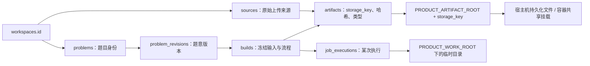

图中箭头表示归属或查找流程，完整外键关系以前文表结构为准。

```text
artifacts/workspaces/{workspace_id}/
├── sources/
│   └── {source_id}/
│       └── {artifact_id}                # 上传原图；文件名和 MIME 在数据库中
└── builds/
    └── {build_id}/
        ├── {artifact_id_1}              # 某阶段 plan/checkpoint/raw 等
        ├── {artifact_id_2}              # 另一阶段的产物
        ├── {artifact_id_3}              # HTML 文件
        └── {artifact_id_4}              # 页面所用资源

work/{workspace_id}/{build_id}/{execution_id}/
├── inputs/                             # 按本次执行需要准备输入
├── scratch/                            # 工具和模型调用临时文件
└── outputs/                            # 校验前结果，成功后登记为不可变产物
```

| 路径或对象 | 保存内容与规则 |
| --- | --- |
| `artifacts/workspaces/{workspace_id}` | 工作空间的持久产物；空间 UUID 是隔离键，目录本身不替代权限检查 |
| `sources/{source_id}/{artifact_id}` | 来源文件，storage key 为 `workspaces/{workspace_id}/sources/{source_id}/{artifact_id}` |
| `builds/{build_id}/{artifact_id}` | 构建产物，storage key 为 `workspaces/{workspace_id}/builds/{build_id}/{artifact_id}`；不将阶段名称硬编码为目录层级 |
| `problem_revisions` | 结构化题意等权威内容在 PostgreSQL；不再强制另建一份 `problems/{id}/revisions/` 文件树 |
| `page_builds` / `page_assets` | 在数据库把网页逻辑入口及资源路径映射到 artifacts；不再复制一份按批次组织的 HTML 目录 |
| `work/.../{execution_id}` | 每次执行单独使用，重试不会覆盖另一执行的临时结果；epoch 校验仍由数据库保证 |
| `artifacts/.tmp` | 只用于存储接口原子写入；与目标文件必须在同一文件系统，未登记/半写结果不能当有效产物 |

例如空间 W1 的批次 B1、B2 都引用题目 P1，P1 的来源是 S1、成功构建是 G1。
两个批次通过数据库读到同一组 S1/G1 产物，不复制两套目录。用户修订后创建 G2，新增 G2 目录，保留 G1 的历史页面。
复用旧产物时引用已有 artifact；它可以仍存放在原构建 G1 的目录，不为 G2 复制或改写原 storage key。
清理必须检查所有有效引用，不能因为原构建不再是当前构建，就直接递归删除其目录。

原图、模型 raw 和网页可以共存于存储根，但 **Nginx 不直接公开 artifacts 根目录**。
页面请求先经过业务授权，再按 `page_assets` 白名单读取允许的文件；不能凭目录名或猜测 URL 读取其他产物。
`site/` 是既有静态站点目录，不能成为新上传题目的默认输出目录。
所有读写都经过存储接口校验 key，拒绝绝对路径、`..` 和符号链接逃逸。

Worker 失败后，`work/` 可清理；要跨执行恢复的 checkpoint 必须先校验、登记并持久化到 artifacts。
清理 work 时检查对应执行已结束或失效且超过保留期；运行中目录不能只因文件“较旧”就删除。
`.tmp` 和未登记孤立文件按保留期及活跃写入状态回收；空间删除和产物垃圾回收另走受控流程，不由安装脚本执行。

### 15.8 本地安装、服务器安装与版本部署的职责

| 入口 | 使用时机 | 主要动作 | 完成标志 |
| --- | --- | --- | --- |
| `local/install.sh` | 开发机首次安装或补齐环境 | 检查 uv 和 PostgreSQL 17，macOS 按需通过 Homebrew 安装；同步 server 依赖；准备专属 PGDATA 并启动原生数据库；uv 执行角色初始化、迁移、seed 和 doctor | 无 Docker 环境下安装、自检、备份可用；P1 不启动求解 |
| `server/install.sh` | 新服务器/新实例首次安装，也支持幂等补齐 | 检查 Docker/Compose、架构、权限；验证发布清单；拉取或加载固定镜像；准备目录；通过 admin 容器完成初始化和验收 | 空库及默认身份正确，镜像与结构版本有记录 |
| `server/deploy.sh` | 已安装实例升级到指定版本 | 校验目标版本和迁移路径；取得部署锁；按需停写、备份、迁移；切换镜像；健康和权限验收；记录部署结果 | 目标版本验收通过；失败停在明确状态，不自动回退数据库 |
| `manage.sh` | 两种环境的日常维护 | 按 mode 选 uv 或一次性 admin 容器，调用同一套 Python 管理逻辑 | 使用 §15.3 的统一退出码和检查规则 |
| `build-release.sh` | 开发机或 CI 构建发布包 | 按锁文件构建所需架构镜像，输出源码版本、镜像 digest、目标 Alembic revision、校验文件和可选离线镜像包 | 可复现定位交付版本；不包含数据和秘密 |

本地 uv 由开发者预装，缺失则明确提示；Python 和项目依赖按锁定配置准备。
macOS 缺少 PostgreSQL 17 时，安装入口通过已有 Homebrew 执行 `brew install postgresql@17`；
缺少 Homebrew 则提示先准备包管理器，不隐式安装它。Linux 开发机预装发行版提供的 PostgreSQL 17 完整工具集，
通过 `PRODUCT_PG_BIN_DIR` 指定路径；不自动执行跨发行版的系统安装命令。
Homebrew 提供版本化安装与工具路径；其默认集群不作为本产品实例使用。[Homebrew PostgreSQL 17](https://formulae.brew.sh/formula/postgresql@17)。

本地脚本只管理本产品的专属 PGDATA：首次在空目录用 `initdb` 初始化，以当前非 root 用户运行，
使用 UTF-8，并明确设置本地和 TCP 密码认证为 SCRAM；bootstrap 密码通过受限临时密码文件传入，完成后移除临时副本。
监听地址固定为 loopback，不使用无密码 trust 作为应用连接配置。[PostgreSQL initdb](https://www.postgresql.org/docs/17/app-initdb.html)。
随后用 `pg_ctl` 启停该目录对应的实例，日志写入本实例 logs；不同时用 `brew services` 管理同一实例，
也不接管 Homebrew 默认集群。首版按需启动，不安装开机启动项。[PostgreSQL pg_ctl](https://www.postgresql.org/docs/17/app-pg-ctl.html)。
重复安装先核对 PGDATA 身份、主版本、进程和端口，再复用；存在不完整或不兼容目录时明确退出，不重新 initdb。
端口冲突提示显式配置另一端口，不停止其他项目的数据库。`db-start`/`db-stop` 只操作本实例，status/doctor 不隐式启动服务。
服务器镜像构建继续由构建机或 CI 执行；本地日常开发不要求具备构建镜像的 Docker 环境。

服务器不通过现场 `git pull`、安装未锁定包或使用 `latest` 标签来隐式选择版本。
发布清单还记录 Compose/脚本版本及当前支持的 pipeline 版本；所用脚本和镜像必须来自同一交付版本。
服务器可保留现有 Git 目录用于运维入口，但运行代码以已核验的发布镜像为准。
`packages/` 只是可清理的安装介质缓存，`deployments/` 保留部署记录，二者都不是工作空间数据来源。

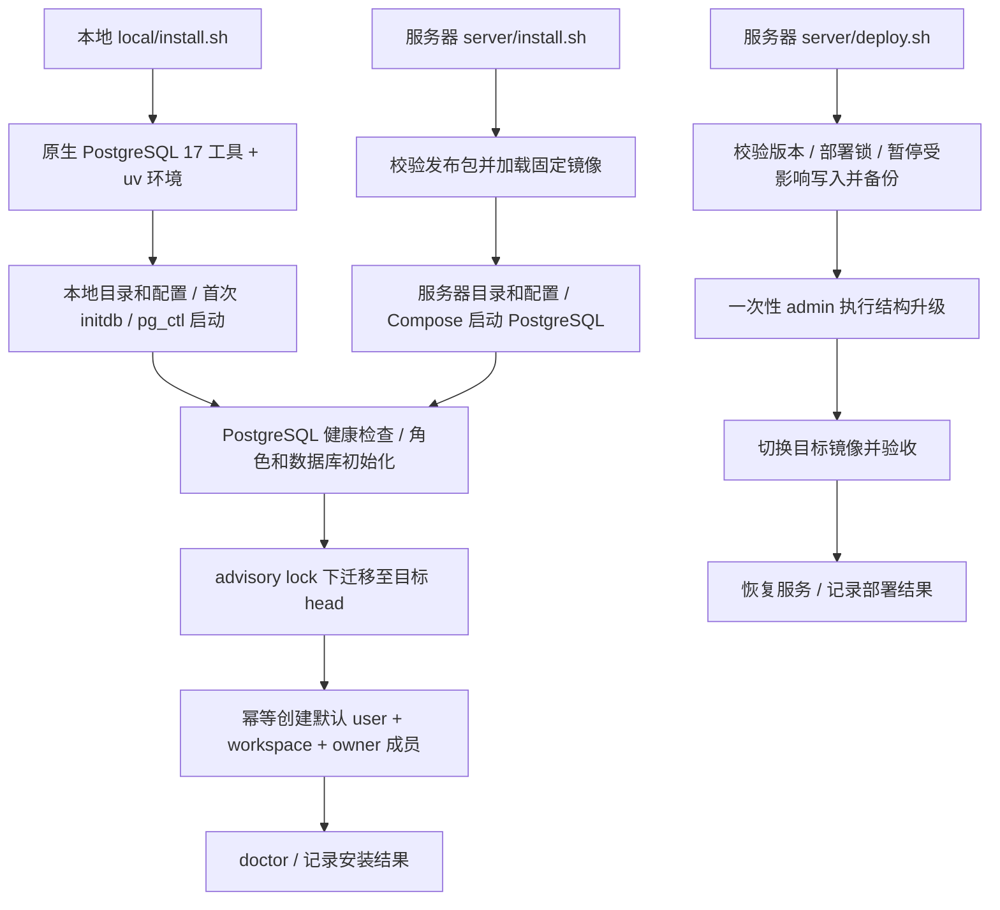

P1 的部署仅升级管理镜像及数据结构；P2 接通后才增加 API、Worker、publisher、RabbitMQ 的启动与停写协调。
停写窗口须暂停新上传/构建及 outbox 投递，排空或受控终止在途任务，确认无旧执行仍能提交后再迁移。
迁移或验收失败时保持明确的维护状态；只在已验证数据库向后兼容时允许切回旧应用镜像，不能自动 `alembic downgrade`。
队列中的旧构建还需满足 §9 的旧 pipeline 恢复兼容规则；切镜像不会把旧构建改成新流程。
现有 Nginx、微信签名 API 和旧 Review 的接管另在 P2 部署清单明确，P1 安装不覆盖既有服务配置。

### 15.9 容器挂载和目录验收

| 容器/进程 | 可访问目录 | 原则 |
| --- | --- | --- |
| 本地 PostgreSQL | 本实例 PGDATA 和数据库日志 | 原生进程，由当前开发用户管理；不依赖 Docker 挂载 |
| 服务器 PostgreSQL | 自己的命名卷 | 不挂载原图、备份根或应用工作目录 |
| 本机 uv 应用/管理命令 | 当前实例的宿主机路径 | 与 Docker 内路径不同，但登记的 storage key 相同 |
| admin | 当前操作所需的 artifacts、backups；doctor 的受限测试位置 | 普通检查只读，写入探针/备份/恢复按操作明确开放；不暴露管理凭据给 app |
| API（P2） | artifacts 挂载至 `/var/lib/shuxueshuo/artifacts` | 上传需写入；页面通过授权和资源白名单读取；不挂载备份和部署包 |
| Worker（P2） | artifacts 和 work 挂载至对应固定路径 | 共享持久产物，每次执行独立临时目录；不挂载 bootstrap/migration 配置 |
| outbox publisher（P2） | 通常无需文件挂载 | 访问数据库及 RabbitMQ 即可 |
| Nginx | 既有站点和代理配置 | 不挂载整个产品数据根用于静态直出 |

安装脚本需从自身路径定位仓库；仅服务器定位和加载 Compose 文件，本地入口不调用或检查 Docker/Compose。
所有路径参数正确处理空格。实例对应的 PGDATA/数据库卷、宿主机数据根及服务器挂载须在 status/doctor 中可核对，展示中隐藏秘密。
同一实例重复安装复用原配置和数据库；改数据根或实例名必须显式选择并校验，不能静默得到另一套空库。
将数据根误设到仓库内或与其他实例共用同一 artifacts/work 根时，安装应拒绝并提示改正。

目录与交付验收补充：

- 在包含空格的本地数据路径和非默认服务器路径完成安装、doctor、备份和新实例恢复。
- 在未安装 Docker 的 macOS 上通过原生 PostgreSQL 完成本地验收；重复安装不操作其他本地集群，端口冲突明确失败。
- 同一 storage key 经本机进程和容器读取，字节及 SHA256 一致；容器重建、代码换目录后仍能读取原数据。
- 更新脚本不覆盖秘密、默认身份和业务文件；镜像包及 Git 变更不含真实配置、原图、数据库、临时产物或备份。
- 独立实例不能误共用 PGDATA/卷/数据根；未授权页面请求不能读取 raw、其他空间文件或越界路径。
- 备份恢复同时验证数据库与产物；只复制仓库或只保留 PostgreSQL 数据均不算完整备份。

## 16. 实施顺序与验收

| 顺序 | 交付 | 退出条件 |
| --- | --- | --- |
| 1 | 模型、约束、角色及 Alembic | 空库升 head，权限检查通过；后续结构变化验证上一 revision 的新系统数据升级 |
| 2 | 默认种子初始化 | 仅一条 user、一条 workspace、一条 owner 成员关系；空业务表、重复及并发初始化通过 |
| 3 | 存储接口和登记服务 | 原子写入、不可覆盖、哈希和路径边界通过 |
| 4 | 修订、来源匹配、版本化构建/事件事务接口 | 定义冻结、阶段演进、按定义判定完成、PostgreSQL 并发及旧执行隔离通过 |
| 5 | 安装、自检、备份恢复 | macOS/Linux 安装演练和新目录恢复通过 |
| 后续另议 | 语义去重及可选向量搜索 | 暂不实现；需求和方案重新确认后再制定模型、规则与评测门禁 |

P1 验收必须覆盖：

- 一个 user 加入多个 workspace；跨空间及非成员引用被拒绝。
- 重复文件跨批次引用同题，批次项保留来源；不同 owner 不自动共享。
- 同文件并发上传不产生重复题；多个候选不被任意合并。
- 一题多来源，构建冻结实际来源；引用旧修订不覆盖当前人工修订。
- v1 九阶段与新增/删除阶段的 v2 构建并存，阶段集合、名称和进度按各自快照展示，不修改旧运行或产物。
- 快照缺引用、循环依赖、重复 key/ordinal、完成条件引用未知阶段或阶段行不匹配时拒绝提交。
- 修改 pipeline snapshot 或目标依赖使构建指纹变化；同 key/version 不允许替换定义；展示名变化可在兼容验证后复用旧产物。
- 新必需阶段未成功或必需产物不满足合同不能完成；旧成功构建不因新规则被改写，新使用要求单独检查。
- 删除重建起点明确返回冲突；合同不兼容、指纹变化或恢复材料损坏时拒绝复用，兼容未变阶段可复用。
- 兼容 Worker 按旧定义恢复；旧环境不可用时明确中止恢复，不套用新流程；新流程使用独立子构建。
- 并发修订 CAS、同 request ID 重放及内容冲突、旧构建晚完成、新构建失败。
- 旧 epoch 提交和取消后的页面发布被拒绝；事务回滚同时回滚事件/outbox。
- 事件事务提交顺序变化仍不漏补读；不能依赖全局自增 ID 的提交顺序。
- 半写文件、文件成功而 DB 回滚、同 key 内容冲突、损坏文件、越界路径、私有 raw 混入页面。
- 首次安装的业务表为空；默认用户、空间及成员关系各一条；重复/并发 seed 不重复、不清空新业务数据。
- 修订验证信息和页面修订引用非空；损坏文件、失败阶段不被认定有效，复用调用不重复计费。
- 重复安装保留密码和数据；端口冲突、启动超时明确失败；备份恢复后全量哈希一致。
- 现有 Review 服务、修订、依赖及重建回归继续通过；P1 不需要付费模型验收。

若以后启动语义去重，再单独制定评测：同题改写/换图，以及只改一个数字、符号、范围、小问的难例；
分别报告候选召回率、自动匹配准确率、误合并、漏匹配和待审查比例，不以一个向量阈值代替验收。

完成上述文档不等于完成实现。P1 通过后再由 P2 切换 Review/API/Worker，不以数据库安装成功代替真实产品闭环验收。
