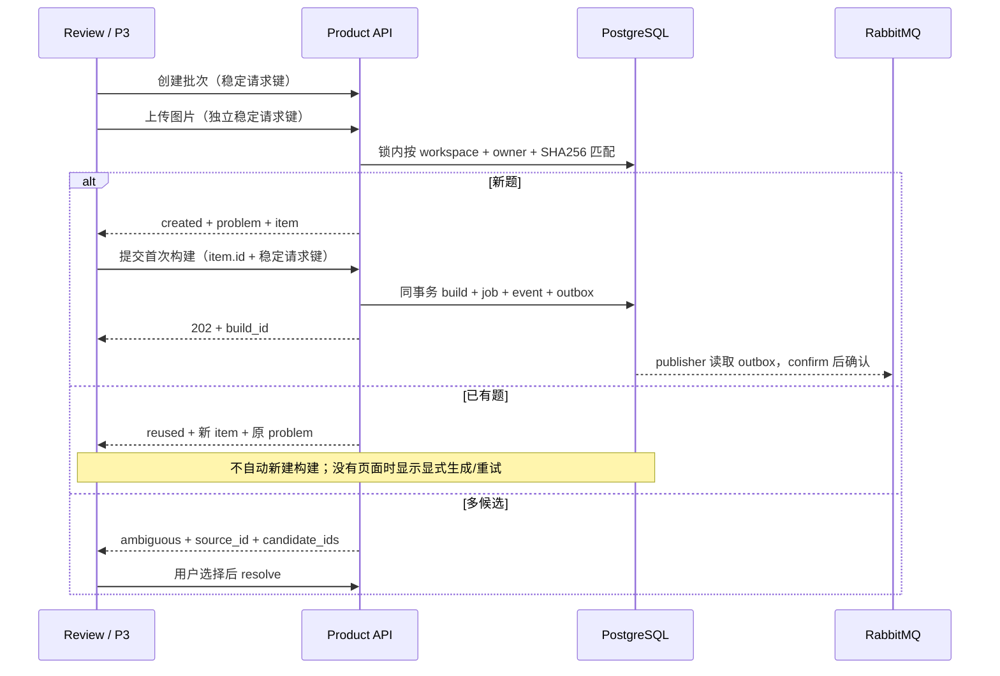

# P2 产品接口与 P3 交接

基址 `/api/product/v1`。正式本地 Review 入口 `/review/runs`；Next 代理同一路径的 HTTP，WebSocket 直接连接 `ws://127.0.0.1:8000/api/product/v1/ws`。

## 身份、事务与响应

服务端固定 `internal/default`；不接受调用方传入 user/workspace。实际数据库账号 `product_app`，启动只检查既有 `0002_product_runtime_indexes`，不建表、不初始化种子。loopback TCP、Host 和 Origin 均检查，不信任转发头。产品默认模式下旧 Review 写入路由不挂载。

写入业务与请求幂等记录共享 PostgreSQL 事务；事件和 outbox 与对应业务共同提交。所有资源 ID 是 UUID。DTO 不包含存储路径、凭据和冻结配置；执行材料通过专门授权接口读取。

创建批次、上传、来源选择、题意保存、首次构建、重建、审查要求 `Idempotency-Key`（1–200 字符）。同操作同键同内容返回原结果，内容改变返回 `409`。不要把网络重试当作新操作生成新键。

常规错误形状：

```json
{"error":{"code":"request.content_changed","message":"同一请求标识的内容发生变化，请重新操作。","request_id":"..."}}
```

输入错误 `422`、权限 `403`、不存在 `404`、冲突/检查点不一致 `409`、服务不可用 `503`。上传过大 `413`。客户端应优先展示 message，保留 code/request_id 供诊断，不显示驱动异常。

## HTTP 合同

| 方法与路径 | 输入 / 输出要点 |
| --- | --- |
| `GET /health` | `status=ok, mode=product`，验证数据库连接 |
| `POST /batches` | `{name?}` → `{id,name,created_at}` |
| `GET /batches/{id}` | 批次项、关联构建状态、当前页面与事件水位 `last_seq` |
| `POST /batches/{id}/uploads` | multipart 单个 `image`，PNG/JPEG/WebP ≤20 MiB → `created/reused/ambiguous` |
| `POST /sources/{id}/resolve` | `{problem_id}`；仅允许本次来源的仍有效候选，返回批次项 |
| `GET /requests/{operation}/{request_id}` | `{found,response}`；用于中断后找回上传或提交结果 |
| `GET /problems` | `limit` 1–100；下一页传最后一条 `updated_at,id` 为 `before_time,before_id` |
| `GET /problems/{id}` | 当前修订、来源、最近构建、有效页面和 `last_seq` |
| `GET /problems/{id}/revisions/{revision_id}` | 指定题意版本及人工差异 |
| `POST /problems/{id}/revision-preview` | `{base_revision_id,domain}` → 校验、差异、失效阶段；不保存、不调用模型 |
| `POST /problems/{id}/revisions` | 同上，CAS 保存；无语义变化不增加修订，有变化清除有效页面 |
| `POST /problems/{id}/builds` | `{source_id,batch_item_id?}` → `202 {build_id,job_id}` |
| `GET /problems/{id}/builds` | 构建历史 |
| `GET /builds/{id}` | 快照阶段标题/顺序、attempt、产物、版本绑定审查、页面有效性、水位 |
| `POST /builds/{id}/rebuild-preview` | `{requested_stage?}` → 复用/重跑阶段、原因、模型阶段、基础修订、指纹 |
| `POST /builds/{id}/rebuild` | `{requested_stage?,fingerprint}`；再次计算预览，变化则 `409` |
| `POST /builds/{id}/cancel` | 幂等取消，撤销执行权，返回当前快照 |
| `GET /builds/{id}/artifacts/{artifact_id}` | 仅该构建产生或接受复用的材料；调试 HTML/SVG/JS 按纯文本返回 |
| `GET /pages/{page_id}/index.html` | 授权页面入口，其他相对路径仅限登记资源；CSP sandbox、nosniff |
| `POST /pages/{page_id}/reviews` | `{decision:approved/rejected/revoked,comment?,supersedes_id?}`；追加版本绑定审查 |
| `GET /events` | `kind=build/problem/batch,aggregate_id,after` → 按 seq 排序的事件，单次最多100条 |

`operation` 查询值：`batch.create / upload / source.resolve / revision.save / build.create / build.rebuild / page.review`。

## 上传与首次构建



Review 在 localStorage 保存当前上传的请求键、批次和响应；刷新后查询原操作结果并恢复首次提交。跨批次重复文件复用题目，不按语义匹配。首次提交还锁定批次项，防止不同请求键的并发提交重复创建初始构建。

## WebSocket

连接后15秒内发送一次订阅，最多20个 stream：

```json
{"streams":[{"kind":"build","id":"..."},{"kind":"batch","id":"...","after":12}]}
```

不传 `after` 时先返回 `{type:"snapshot",kind,id,data}`，`data.last_seq` 是该 stream 的水位。传 `after` 时补读该游标之后的事件。增量为：

```json
{"type":"event","kind":"build","id":"...","seq":13,"event_type":"stage.succeeded","schema_version":"product-event/v1","payload":{"stage_key":"source"},"created_at":"..."}
```

事件的实际 `schema_version` 以响应为准。各 stream 独立计数；客户端按 `(kind,id,seq)` 去重。断线从已消费游标恢复，收到 `resnapshot_required` 则丢弃旧游标重新取快照。服务端每500ms补读，发送超时断开慢客户端。`heartbeat` 只表示连接存活，不作为任务进度。

## 执行与恢复约束

- 队列名 `product.build.<deployment_version>`，durable classic，JSON 消息仅 `protocol_version/job_id/build_id`。没有 result backend。
- 重启后若代码指纹变化，publisher 会把仍停在旧 `deployment_version` 的 queued/running/interrupted 构建标为 `execution.incompatible_environment`，避免发往已无消费者的旧队列饿死；需要重建时由当前部署重新提交。
- publisher 在独立短事务领取 outbox；confirm 后用 publisher token 确认。确认丢失可能重复发布，执行权消除重复结果。
- Worker threads/concurrency=1，每个 build 独立子进程；90秒租约、10秒续租、60分钟总时限。过期扫描每15秒按 job+epoch 写恢复 outbox，最多3次成功取得执行权。
- 已接受的检查点逐阶段验证内容哈希、完整输出映射、原始产物归属、Context ancestry、authority、数学证据和 typed 合同。重建预览同样执行恢复验证。
- extraction 修订绑定与接受该阶段检查点在同事务提交，避免“已绑定修订但没有可恢复阶段”的窗口。
- 模型语义请求按规范化请求哈希计数；实际 SDK 请求另行持久化计数，SDK 自动重试关闭。当前提取3/6、Solver3/6、讲解1/2（语义/网络）上限由冻结配置决定。execution 恢复不重置预算。
- 调用开始诊断先落库；进程中断后缺少结束审计表示结果未知，usage 保持 NULL，不虚构零费用。重用历史调用只新增引用。
- 旧 execution、过期租约、取消均不可提交；旧构建可以历史成功，但不能覆盖最新有效页面。

P3 可直接使用批次接口、事件和授权页面，不需要重新实现持久化。完整工作台批量交互、登录、官方题库、向量/知识图谱、对话推荐和服务器部署不在本轮。
