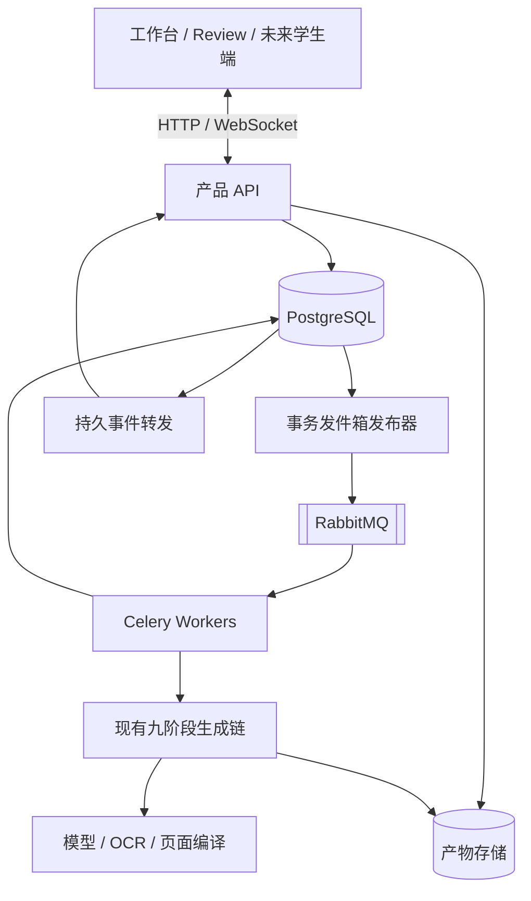
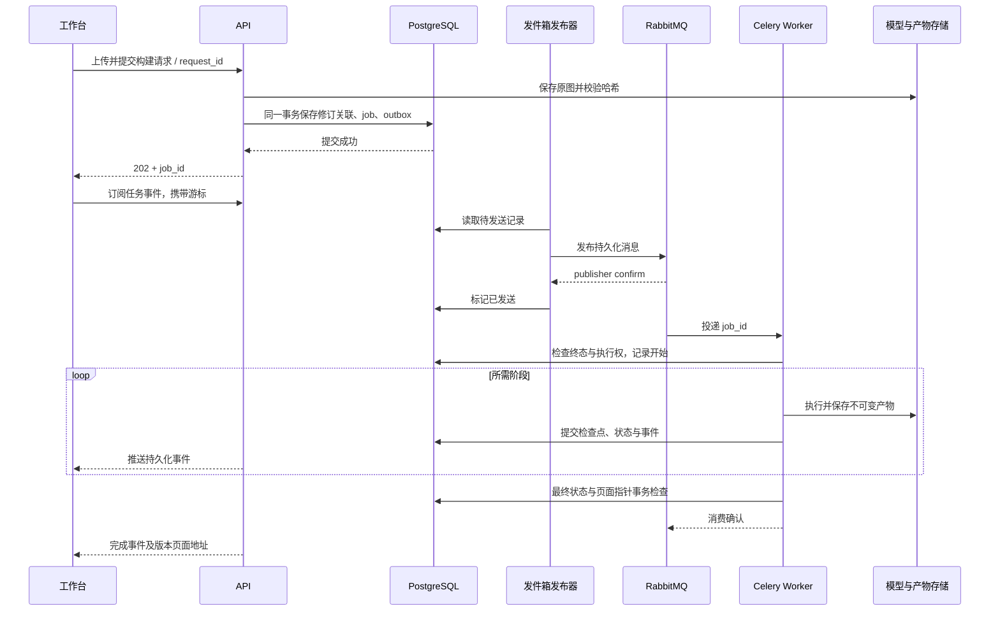
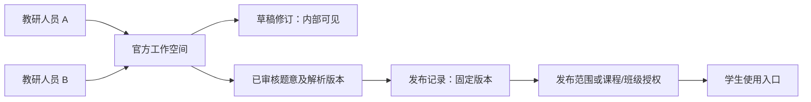
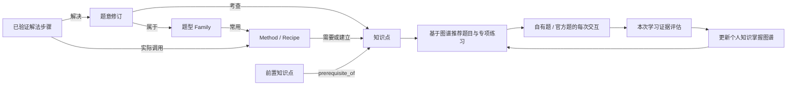

# 产品服务架构：任务、实时交互、存储与版本

更新：2026-09-11。状态：**已确定的目标架构，待按计划实施**。
本文维护稳定职责和设计决策，排期及验收见[在线服务开发计划](online-service-development-plan.md)。
详细表结构、题目去重与来源关系、空库种子及 P1 安装设计见[产品数据库设计](product-database-design.md)。
当前 Review 仍使用 SQLite、本机文件、专属 worker 和 SSE；不能把本文当作现有部署手册。

## 1. 选型与部署边界

| 职责 | 选型与边界 |
| --- | --- |
| 应用服务 | Python FastAPI；Review、工作台、未来学生端共用领域服务 |
| 业务存储 | PostgreSQL；SQLAlchemy 数据访问，Alembic 管理结构迁移 |
| 消息持久化与投递 | RabbitMQ；不另实现数据库任务队列 |
| 后台执行 | Celery Worker；首版一任务运行一个构建，按冻结的流水线版本执行；当前定义为九阶段 |
| 客户端通信 | HTTP 资源操作 + WebSocket 实时事件/学生交互；现有 SSE 可在迁移期保留 |
| 产物存储 | 初期单机共享持久化目录；统一 storage key/interface，后续接对象存储 |
| 页面访问 | 产品域名下的内部版本化预览；公开发布与 CDN 后续实施 |
| 首版身份 | 一个默认用户、一个默认工作空间及 owner 成员关系，所有使用者共用；不做登录，仅本机或受限内部部署 |

API、Worker、PostgreSQL、RabbitMQ 是独立进程/服务，由部署配置启动并监督重启。
初期单机部署不宣称高可用；数据库、消息代理和产物目录都使用持久化卷。
RabbitMQ 多节点容错需要 quorum queues 等配置及多数副本可用，不能由“开启持久化”推导高可用。
新增 Redis、Kubernetes 或 Temporal 不是首版前置条件。



发布器与事件转发是职责，不强制各部署一个服务。Review 是审查视图，不拥有另一套生成链或队列。

## 2. 一次构建请求



- HTTP 202 表示任务和 outbox 已持久化，不表示模型已开始或队列已完成处理。
- 队列消息只携带任务标识及必要的协议版本，实际输入取自冻结的数据库/产物记录。
- 发件箱由不依赖该任务成功入队的发布路径驱动；数据库提交后未发出可补发。
  RabbitMQ 已确认但 outbox 未标记时可能重复发送，业务必须幂等。
- 配置持久队列、持久消息、publisher confirms、正确路由及未路由消息处理；
  consumer ack 与 publisher confirm 分别证明处理完成和消息接收，不能互相替代。
- Celery 显式配置延迟确认、Worker 丢失策略、长任务消费超时与有界重试。
  崩溃重投递不等于数学失败重试；永久失败须记录终态并完成消息处理，防止无限重排。

## 3. 恢复、执行权与资源控制

队列提供投递可靠性，领域服务继续负责已完成任务跳过、合法检查点恢复、目标版本与发布规则。
领取时用事务/条件更新取得执行权；以执行代次或 token 隔离旧执行，必要时用心跳判断旧执行是否失联。
重新分配执行权后，旧 Worker 的阶段提交和最终提交必须被拒绝，不能仅检查一次 running 状态。
这不是另写队列调度器，也不承诺外部模型恰好调用一次：响应返回但未保存就崩溃时，可能再次调用。

- 当前九阶段依赖和 manifest 复用现有实现；每次构建冻结 pipeline key/version、阶段定义、合同和完成规则，后续增删阶段发布新定义，不改写旧构建。
- 成功判定与阶段展示读取本次快照，不依赖全局九阶段列表；ordinal 用于顺序，依赖关系决定失效范围。详细字段及演进规则见[数据库设计](product-database-design.md#93-流水线版本与冻结定义)。
- 模型重试、Scope repair、任务重投递分别记录预算。
- 取消先记录请求，再在可安全中止的位置处理；外部调用取消尽力而为，已取消执行不能发布页面。
- 批量生成与未来实时问答使用不同队列/资源配额；provider 限流应跨 Worker 生效，不能把单进程限额当总限额。
- 学生等待回答时只保留会话状态，不长期占用 Worker；新输入触发处理，旧响应受会话版本约束。
- 生产任务绑定部署版本和有效配置，升级时旧任务排空或路由至兼容 Worker；不混用新旧代码产物。
- 旧任务按原流水线定义恢复；缺少兼容 Worker 时明确中止恢复，新定义只能创建独立子构建。跨版本复用须通过实际输入、阶段合同、资源指纹和恢复材料验证。
- Review 本地开发的源码指纹探测继续保留；生产镜像版本不能替代 prompt/配置/实际输入的依赖记录。

## 4. HTTP 与 WebSocket

HTTP 负责上传、资源读取、修订保存、重建计划和任务查询；WebSocket 负责订阅进度、
学生回答、追问与打断。业务协议独立于传输，现有 SSE 与新 WebSocket 共用事件权威。

事件至少携带协议版本、event_id、所属任务/会话、对应流的单调序号、事件类型和数据。
客户端命令携带 request_id；只在可靠接收后确认，重发命令不得产生重复业务操作。
先持久化业务变化和事件，再发送通知；重连按游标补读，快照附带事件水位，避免查询与订阅之间漏事件。
游标超过保留范围时明确返回重取快照要求。UI 按事件标识去重，不把所有系统事件假定为全局有序。

首版可由 API 读取数据库事件推进订阅；多实例时每实例都要收到其客户端订阅事件，不能把广播事件
放入只有一个实例能消费的工作队列。消息提醒只是唤醒，持久事件仍是恢复来源。
大量流式 token 可做短期缓冲并在最终保存响应；不承诺每个 token 都是永久业务事件。
重要状态、学生输入、答案和打断必须可追溯。连接中断不取消构建，缓慢客户端需限缓冲与恢复策略。

## 5. 数据与文件的权威分工

| 内容 | 权威存储 |
| --- | --- |
| workspace、题目/批次、题意修订、domain JSON、人工差异 | PostgreSQL；关系字段 + JSONB |
| job、阶段状态、执行权、请求幂等、outbox | PostgreSQL |
| manifest/依赖摘要、检查点有效性、产物登记、诊断索引与调用用量 | PostgreSQL |
| 当前页面引用、版本化人工审查、未来发布引用与授权 | PostgreSQL |
| 未来学生会话、输入、学习进度、作答和持久事件 | PostgreSQL |
| 原图/PDF/裁剪图、完整模型请求与响应/reasoning | 产物存储；密钥不进入产物 |
| 完整 Plan、typed checkpoint、LessonIR、VisualStepIR、manifest 审计快照 | 不可变产物存储 |
| HTML、固定版本 CSS/JS、SVG、未来音频 | 不可变产物存储 |
| 代码、prompt、Schema、Spec、模板、数据库迁移 | Git；构建记录内容指纹 |

数据库登记 artifact_id、run/stage/type、storage_key、sha256、size、content_type、schema_version、
归属/可见性与创建时间。结构化索引用于查询，完整快照用于恢复；二者有哈希/版本关联，不能各自可编辑。
例如题意修订以数据库为准，导出 JSON 是构建审计副本；运行时 checkpoint 以登记的不可变产物为准。

```text
sources/{source_id}/original.png
runs/{run_id}/solver/response.json
runs/{run_id}/solver/checkpoint.json
runs/{run_id}/lesson/lesson-ir.json
pages/{build_id}/index.html
pages/{build_id}/assets/...
```

这些是 storage key 示例，不是数据库中的机器绝对路径。初期数据目录独立于 Git 和容器临时层，
API/Worker 共享挂载；多主机前切换共享对象存储。先写产物、校验完整性，再提交数据库引用。
失败遗留文件按保留期和引用检查清理；删除不能破坏历史运行/发布/复用依赖。备份恢复联合验证数据库与产物哈希。

## 6. 课程页面与未来学生空间

生成课程页是一个不可变页面包，不需要为每题重新部署 Next.js。首版由产品服务提供内部预览，
静态资源服务传输页面包；后续可以使用私有对象存储和 CDN。以下路由是待实现的语义示例：

- `/lessons/{problem_id}`：稳定入口，按访问场景和权限解析允许展示的版本。
- `/lesson-builds/{build_id}/index.html`：固定构建版本，内部审阅与历史回看。
- 未来 `/me/courses`、`/learn/{enrollment_id}`：个人课程和学习记录入口。

构建成功、当前有效、人工通过、公开发布是不同状态。新构建完成不自动公开；首次仅提供内部预览，
公开发布待后续明确实现。已发布引用固定完整依赖闭包；失败不能用旧页冒充新成功。
页面包固定 CSS/JS 版本或内容哈希；可变稳定入口重新校验版本，固定构建资源可长期缓存。
保留现有隔离 iframe/CSP 边界；课程资源包不包含私有 raw、reasoning、密钥或内部诊断。

学生空间不等于“一人一目录”：共享课程内容只保存一份，课程授权、学习进度、作答和笔记按学生分别记录。
私有上传与个性化讲解通过数据库归属和访问控制隔离；每个请求验证身份与资源权限，URL/storage key 不是授权凭据。
学生个性化状态通过 API 加载，不嵌入共享 HTML；内容相同不自动获得共享或公开授权。
首版保留 workspace、owner/可见性边界并使用固定内部主体，完整账户与权限系统后续实施。

### 6.1 后续产品版本的职责

产品按[系统路线图](functional-planner-next-stage-roadmap.md)分四期：拍照解析、官方题库、题目对话、个人知识掌握图谱与推荐闭环。
下述官方题库与图谱设计作为二期及后续方向，不增加一期建表、种子或验收前置条件。

| 阶段 | 建设内容 | 边界 |
| --- | --- | --- |
| 一期：拍照解析 | 拍照/选图上传，真实提取、求解、解析网页、状态恢复和重试 | 固定默认用户与空间，空库起步，不迁移旧记录 |
| 二期：官方题库 | 官方内容维护、审核、版本发布和学生使用入口；基础知识/方法/题型关系 | 按发布范围授权，官方草稿不自动对学生开放 |
| 三期：题目对话 | 围绕官方或自有题目的追问、解释、讨论及会话恢复 | 绑定题意和解析版本，不以聊天文本覆盖已验证数学事实 |
| 四期：个人知识掌握图谱与推荐闭环 | 基于学生上传题目和官方题目的对话交互建立个人掌握图谱，每次交互后更新，基于图谱推荐题目和专项练习 | 两类题目的证据汇入同一学生图谱；图谱更新不等到会话结束，个人状态与共享内容分离 |

真实学生身份及必要访问控制在对应学生功能上线前接入，账户细节另行设计。
默认共享用户只能用于一期内部生成流程，不能代表多个学生的独立作答和进度。

### 6.2 官方题库：归属、发布与授权

官方工作空间承载题库，由教研用户作为成员维护；可以有运营账号，但不依赖特殊官方 user 来判断公开权限。
`workspace_id` 表示创作空间，`owner_user_id` 表示负责人，`created_by_user_id` 追溯具体编辑者。
官方空间不必为每位编辑复制题目，学生也不需要成为官方创作空间成员。



创作仍使用 `private / workspace`；发布另行表达全体已登录学生、指定课程/班级或明确选择的公开访问。
官方所属题目不全部自动全局可见，互联网公开与全体学生可用是不同发布范围。
发布固定题意 revision 与对应资源；新草稿不改写已发布版本。审核、发布和撤销需要独立记录。

学生通过发布/课程条目引用内容，自己的作答、得分和进度另存；共享题目与页面不按学生复制。
跨空间访问只经过显式发布授权，不放开现有创作表的全部跨 workspace 引用。
发布与练习表的完整字段、课程/班级权限和撤销后的访问策略在二期细化，当前不视为已实现 API 合同。

### 6.3 共享知识图谱与个人学习证据

共享基础图谱组织题目、知识、方法和题型，二期随官方题库建设；三期积累讨论证据，
四期为每个学生建立持续更新的知识掌握图谱，基于个人图谱推荐题目和专项练习。
先用 PostgreSQL 实体表及带类型关系表实现，不因命名为知识图谱就引入独立图数据库。
复杂路径查询或图算法成为核心负载后，再根据真实查询性能评估 Neo4j 等方案。



题目考查关系绑定题意修订，实际使用方法绑定具体已验证执行/步骤；某次解法使用一个方法，不代表该题只能用它。
每条关系保留来源、版本及必要证据；人工标注、模型建议和已验证调用分别表达。
现有 Method/Family 等可执行 Spec 保持原权威，数据库保存稳定 ID、版本和可查询关系，避免形成第二份独立执行定义。
范围和语义沿用[知识图谱实体与关系设计](inequality-visual-component-refactor-design.md#77-knowledgegraphedge)。

学生不复制整张图谱，只记录自己的知识点掌握状态及来源证据；对话总结不能未经核验直接认定掌握。
知识点到题目的遍历同样执行访问控制，不泄露官方草稿或其他用户的私有题。
向量搜索暂不实现，一期仅用文件 SHA256 匹配，不增加 pgvector、embedding 或向量检索服务。
后续若采用向量检索，其职责是相似候选召回；图谱描述明确知识关系，两者不互相替代，语义同题识别也不等于个性化推荐。

### 6.4 对话与推荐的逐步接入

三期对话从具体题意/解析版本进入，支持官方题和自己上传的题；消息、解释及引用有会话版本和证据来源。
对话里的假设、错误尝试或新条件不自动改写原题，正式题意修改仍走修订和校验流程。
先完成可恢复的题目讨论，不把完整长期掌握模型和推荐算法塞入对话首版。

四期以每个学生的个人知识掌握图谱为核心，统一汇集其上传题目和官方题目的对话、作答、提示使用、追问及纠错证据。
每次业务交互完成后都评估证据、更新图谱及处理进度，不推迟到做完整题或结束会话。
证据不足时保持未知或原结论并记录原因；每次更新不等于每次都提高或降低掌握分数，单纯上传或阅读解析不能证明掌握。
交互更新须可追溯且幂等，重复投递不重复累计，同一学生的并发会话更新不能互相覆盖。
推荐读取已提交的个人图谱版本，针对薄弱知识及其前置关系给出题目与专项练习，并记录推荐依据；
练习产生的新交互继续更新同一图谱。推荐候选执行授权过滤，具体冷启动、图谱更新算法与专项组题策略后续评测确定。
详细教学与个人状态方向见[学生交互与个性化教学设计](student-tutor-chat-system-design.md)。

## 7. 数据库与产物格式版本

采用 SQLAlchemy + Alembic；迁移文件进入 Git，数据库通过 alembic_version 记录结构版本。
每次结构变化新增迁移，不改已部署历史；自动生成候选需检查改名、约束、索引和旧数据处理。
部署由单独迁移步骤执行，不让所有 API/Worker 启动时竞争改表。使用扩展、回填、切换、收缩的兼容顺序；
长任务升级期间保持旧字段兼容，大批量回填可单独执行。降级脚本不能替代数据备份。

首次从空库升至 head，仅创建默认用户 `internal`、默认工作空间 `default` 及 owner 成员关系，其他业务表为空。
不迁移旧 SQLite 记录或旧产物，不实现历史导入程序；旧库和文件留在原处。
种子初始化独立于 Alembic，重复执行保留原 ID 和新业务数据；首次空表、种子幂等及 PostgreSQL 并发必须验收。
后续有结构版本变化时，验证上一 revision 含新系统数据的升级；Alembic 继续负责结构演进和 head 检查。
数据库结构 revision 与 domain/Plan/checkpoint 的 schema_version 分开管理，旧数学产物不因改表自动升级。

## 8. 模型与 Plan 多候选

提取 provider 配置化，保留 Schema、数学合同、promotion、OCR 与 Bundle；DeepSeek 与豆包用相同原图对照。
截至 2026-09-10 的选型记录，官方推荐 `deepseek-flash`（V4.1-Flash），旧 `deepseek-v4-flash` 别名已转向新模型；
实施时核对真实 endpoint，尤其是代理映射。请求名称、实际返回名称、供应商版本信息与配置版本分别记录，
供应商未提供固定模型标识时明确限制。切换默认模型后重新验证真实生成链。

Plan Pass 1/repair 维持 low thinking，讲解 disabled；提取配置独立验证。图片不进入后续每轮 Plan prompt。
默认 N=1，候选机制支持有界 N=2/3。每份候选独立编译与数学验证，先过门禁再按可解释质量指标选一个进入下游；
不合并状态、不按答案投票、不向其他候选追加完整历史。正确性冲突须诊断；记录候选输入、结果、排名及成本。
首个通过即停与完成全部后选优是不同策略，必须明确返回采用哪种策略，不将前者称为真正 Best-of-N。
传输、Scope repair 与候选数量共用明确总预算。缓存和全题默认 N=3 不是前置条件。

## 9. 选型依据

- [RabbitMQ 确认机制](https://www.rabbitmq.com/docs/confirms)与[quorum queues](https://www.rabbitmq.com/docs/quorum-queues)：消息持久化、发布与消费确认。
- [Celery Tasks](https://docs.celeryq.dev/en/stable/userguide/tasks.html)：延迟确认、幂等与 Worker 丢失行为。
- [事务发件箱](https://docs.aws.amazon.com/prescriptive-guidance/latest/cloud-design-patterns/transactional-outbox.html)：数据库变更与消息发送的一致性。
- [WebSocket](https://developer.mozilla.org/en-US/docs/Web/API/WebSockets_API)：双向实时传输；业务恢复仍由应用协议实现。
- [PostgreSQL JSONB](https://www.postgresql.org/docs/current/datatype-json.html)：结构化文档查询与索引。
- [Alembic](https://alembic.sqlalchemy.org/en/latest/)与[自动生成边界](https://alembic.sqlalchemy.org/en/latest/autogenerate.html)：数据库结构版本管理。
- [DeepSeek 官方型号](https://api-docs.deepseek.com/quick_start/pricing/)：实际接入时重新核对版本与能力。

Temporal 是未来长期工作流的备选，不与 Celery 同时引入；当前复用现有阶段链与恢复机制优先。
