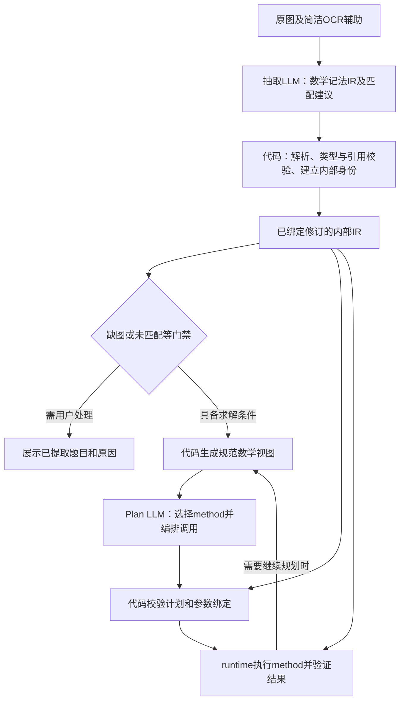

# 七题数学记法 IR 与 Planner 输入审查

日期：2026-09-16。状态：**第一步抽取契约、七题最小解析与校验已实现；最近真实批次 DeepSeek 6/7、Doubao 4/7，代码修复后的两家原始响应离线回放均为 6/7，尚未达到真实 7/7。相关离线回归 358 项通过。Planner、Solver 与生产切换未改动。** 最新兼容修复及剩余差异见[验证报告](validation/math-notation-angle-catalog-20260916/README.md)，构型遗漏见[已知问题 MN-001](math-notation-known-issues.md)。本地独立抽取入口现在只支持 `problem-math-notation/v1`，旧 `problem-domain/v2` 专用代码与测试分派已清理，历史金标和批次记录保留；见[清理报告](validation/math-notation-legacy-cleanup-20260916/README.md)。

本文把现有七题写成同一种简洁格式，供逐题 review。示例由人工根据目标题面整理，不是模型测试返回；现已作为独立新契约金标冻结，七题均通过 Schema、解析、作用域绑定及自身语义比较。现有五题的 family 名称沿用当前注册表；这不表示新格式已经完成 Solver 投影。

核心分工：LLM 将自然语言翻译成数学语言并提出题型匹配；代码解析、建立对象身份、检查表达是否合法，并生成内部 IR。Plan LLM 阅读从该 IR 生成的简洁数学视图，编排可执行方法。

**已确认（2026-09-16）：采用“字符串数学关系＋少量目标字段”，保持当前七题的简洁输出，不恢复专用 fact JSON。** `facts` 保持数学字符串列表；类型化关系、表达式结构和对象绑定由代码解析并维护，不要求抽取 LLM 填写每类条件的专用对象字段。当前实现限于七题抽取与校验，未完成生产接入。

## 1. 阅读约定：JSON 管组织，数学记法管内容

保留一份整题 `root/children`。不再输出两棵转录树与领域树，不增加 `parts`、逐句来源关联、对象全局 ID 或运算树。

- `definitions`：函数、曲线、数学对象的定义；题内新概念的原文也可保留在这里。
- `facts`：条件组成的字符串列表，各项同时成立；字符串内部使用数学关系、量词和逻辑符号。
- `goals`：区分求值、坐标、方程、最值、范围，以及“用什么参数表示”。这是少量必要的结构。
- `children`：题面小问层级。同一小问包含独立图景时再分一层。
- `uncertainties`：缺图、模糊等阻断信息。省略的数组视为空，不要求模型反复填写空数组。
- `match_status/family_id/match_reason`：题型匹配建议，独立于表达合法性。`unmatched` 仍保留完整题意。

数学式不是任意自由文本，也不是任意 Python/LaTeX 程序。已确认保留 `bisects`、`cut_ratio`、`midpoint` 等直观的基础记法；普通关系优先使用熟悉的数学符号，不必全部函数化。以下约定需要写入提供给 LLM 的 Schema 注释，同一关系只保留一种首选写法。

| 记法 | 含义与边界 |
| --- | --- |
| `Γ: y = a*x^2+b*x+c` | 定义曲线 Γ；x、y 是坐标变量，不要求模型另写实体记录 |
| `A = (-1,0)`、`A ∈ Γ` | 点坐标、点在曲线上 |
| `AB` | 长度表达式中的无向线段长度；仅用于单字母点名，复杂点名可用 `length(A1,B1)` |
| `segment(A,B)`、`line(A,B)`、`ray(A,B)` | 线段、直线、以 A 为端点经 B 的射线；不能混淆取值范围 |
| `∠BAC = 2*∠DAC` | 非定向内角的倍数关系；保留 ∠，不把 BAC 当成代数变量 |
| `area(△ACD)/area(△ACB)` | 无向面积之比，不能交换分子分母 |
| `E = midpoint(O,B)` | 中点关系，由代码转成内部关系 |
| `square(A,E,K,G)`、`parallelogram(A,B,C,D)` | 按给定顶点顺序构成正方形、平行四边形；提取阶段不另写推导性质 |
| `bisects(BD,AC)` | BD 所在直线经过 AC 的中点；不额外断言该点位于 BD 内部 |
| `cut_ratio(BD,AC)` | 设两直线交点为 X，表示 BX/XD；X 是代码内部的交点引用，模型无需给它起名 |
| `P ∈ line(A,B) ∩ line(C,D)` | 已命名点 P 同时在两条直线上；唯一性和非退化条件由代码检查 |
| `∀x∈ℝ: ...`、`∃x0∈[1,3]: ...` | 量词、绑定变量及定义域；不能丢掉量词或改变量词范围 |
| `(...) ∧ (...)`、`(...) ∨ (...)` | 同时成立、至少一项成立；保留括号和比例方向 |
| `min_{M,N}(OM+BN)`、`min(HF+FM+MG)` | 表达题述最小值；下标是可选提示，填写时只列题面明确的动点或变量；即使题面明确也可省略，不要求模型分析依赖关系或补列固定参数 |

`cut_ratio` 是通用截线比例记法，不认识“k 倍四边形”这个名称。分母不为零、交点存在且唯一等要求由代码检查或记录为待证明义务；不能静默补成已知题设。这里也不默认交点在两个线段内部。

**Schema 注释要求（已确认）：**以人和 LLM 都能一眼看懂为目标，在相关字段的 `description` 中说明含义、参数顺序、边界及短例子；这些说明随 Schema 实际提供给 LLM，不能只留在开发文档或代码注释中。`facts.items` 仍是字符串，不为每种基础记法新增 JSON 对象类型，也不要求模型在输出中重复解释记法。

例如 `facts.items.description` 中应包含以下简短说明：

- `F = midpoint(D,N)`：F 是线段 DN 的中点。
- `bisects(BD,AC)`：前者所在直线经过后者的中点，即直线 BD 经过线段 AC 的中点；不额外要求交点位于线段 BD 内。
- `cut_ratio(BD,AC)`：设直线 BD 与 AC 的交点为 X，取无向长度比 BX/XD；第一参数的端点顺序决定分子、分母。X 仅用于解释，不要求模型为未命名交点起名，也不默认交点在线段内部。
- 若题面已命名该交点为 O，可直接写 `BO/OD = k`；未命名时使用 `cut_ratio(BD,AC) = k`。
- `square(A,E,K,G)`：A、E、K、G 按顺序构成正方形；`AC = AD` 等普通关系直接使用数学符号。

`definitions`、`goals`、`children` 等字段也应在各自的 `description` 中给出对应规则，尤其说明量词范围、题面明确的动点或变量、`at` 的含义和分问条件的继承边界。目前新契约已将这些说明发送给 LLM，并用请求装配测试核对；真实批次也暴露出 `definitions` 对混合自然语言的约束仍不够明确，详见验证报告。

**最值抽取边界（已确认）：**只忠实保留题面的动点、最值条件和“此时”要求，不要求抽取 LLM 补充依赖分析或求解步骤。Schema 的 `description` 应明确以下规则：

- 最值下标及目标的 `variables` 均为可选提示，题面明确时建议填写，未填写也可接受，不据此判为漏条件或抽取失败。填写时只列题面明确的动点或变量，不要求列出随之变化的所有构造点或额外列出固定参数；不能仅因一个字母出现在最值表达式中就把它加入变量列表。无需另加 `moving(...)` 或动点标签来替代省略的变量提示；题面给出的取值范围、点所在的线段或射线及关联条件仍须保留。
- `at` 表达题面明确要求的状态，例如“取得最小值时，求点的坐标”；它不是模型推导出来的最优条件。若原文只说“最小值为……”，不足以明确所求点是否处于最优位置，则保留原意并用 `uncertainties` 记录歧义，不自行添加最优状态限定。
- 依赖关系、固定量与可变量的判定、求最值与反求参数的执行顺序，交给后续代码与规划阶段。下标或 `variables` 省略不表示对全部字母共同优化；代码需结合已有题意建立语义，无法确定时报告歧义，不能静默猜测。

给 LLM 的 `description` 可直接写：“最值变量提示可选。题面明确给出动点或变量时，建议在最值下标或 `variables` 中填写；也可省略。无需推断变量依赖或额外标记动点，但须保留题给范围、关联条件、最值表达式及目标。”Schema 不应把 `variables` 列为必填，解析器应接受带下标和不带下标的最值式，验收规则不得仅因缺少这些提示拒收。提示省略与题意本身存在歧义需分别处理；这些仍是待实现的设计要求。

名称按树解析：根层共用条件向下可见；兄弟问的局部条件互不可见。同一根层几何配置的子问继承其对象，独立图景中的 A、B、k 各自独立。代码需要从字面节点及定义建立绑定，无法确定沿用关系时报告歧义，不让模型设计 `p1_A`。这种简洁格式依然需要作用域语义，只是由代码维护身份。

本组初中题中，题面未另行限定数域的参数由代码默认按实数处理；题面明确给出的数域和范围仍须保留，并优先于默认值。题面未直接给出的 `b,c ∈ ℝ` 等默认声明，以及由“抛物线”类型带来的 `a ≠ 0`，均不要求抽取 LLM 输出，也不因缺少这些声明判为漏条件。代码补充的默认数域和类型约束应与题面已知区分记录。

Prompt 建议写为：“只提取题面给出的定义、条件和目标；无需补写默认实数域或由对象类型带来的隐含约束，这些由代码处理。”不额外鼓励模型补写，以保持输出简洁。模型若输出与题意一致的默认声明，代码可校验后归一化，不将其视为题面明确给出的条件；冲突声明不能直接接受。此项属于拟议的解析与验收规则，尚未实现。

`Γ` 是本文件为匿名抛物线统一使用的别名，`x_axis/y_axis/axis(Γ)/vertex(Γ)` 是受控数学对象引用，不是要求模型凭空添加几何点。

## 2. 和平一模：等长射线路径

Case：`tj-2026-heping-yimo-25`。

[原图](../internal/source-images/tj-2026-heping-yimo-25/source-page-01.png)。只取印刷题干，彩色手写演算及其辅助图不作为额外条件。

```json
{
  "root": {
    "label": "第25题",
    "definitions": ["Γ: y = a*x^2+b*x-3", "O = (0,0)"],
    "facts": [
      "a,b ∈ ℝ",
      "a > 0",
      "Γ ∩ x_axis = {A,B}",
      "A = (-1,0)",
      "Γ ∩ y_axis = {C}",
      "D = C+(2,0)"
    ],
    "children": [
      {
        "label": "（I）",
        "facts": ["D ∈ Γ"],
        "children": [
          {
            "label": "①",
            "goals": [{"kind": "find_equation", "object": "Γ"}]
          },
          {
            "label": "②",
            "facts": [
              "E ∈ Γ",
              "x(E) = m",
              "-1 < m < 0",
              "∠CBE + ∠ACO = 45°"
            ],
            "goals": [{"kind": "find_coordinates", "object": "E"}]
          }
        ]
      },
      {
        "label": "（II）",
        "facts": [
          "M ∈ segment(B,C)",
          "N ∈ ray(C,D)",
          "CN = CM",
          "min_{M,N}(OM+BN) = sqrt(34)"
        ],
        "goals": [{"kind": "find_value", "expression": "a"}]
      }
    ]
  },
  "match_status": "matched",
  "family_id": "QuadraticEqualLengthRayPathMinimumSolver",
  "match_reason": "抛物线条件、等长约束下的线段与射线动点，以及路径最小值反求参数。"
}
```

审查重点：`N ∈ ray(C,D)` 必须保留；不能变成整条直线或线段。第（II）问不继承第（I）问的 `D ∈ Γ`。O 采用坐标原点的题面惯例；不加入手写解答中的新点或参数答案。

## 3. 和平二模：正方形与路径最值

Case：`tj-2026-heping-ermo-25`。

[原图](../internal/source-images/tj-2026-heping-ermo-25/source-page-01.png)。本节只表示第 25 题，不包含同页第 24 题的折叠问题。

```json
{
  "root": {
    "label": "第25题",
    "definitions": ["Γ: y = -x^2+b*x+c"],
    "facts": [
      "b,c ∈ ℝ",
      "c > 1",
      "P = vertex(Γ)",
      "Γ ∩ x_axis = {A,B}",
      "x(A) < x(B)",
      "Γ ∩ y_axis = {C}",
      "M ∈ axis(Γ) ∩ x_axis",
      "E ∈ axis(Γ)",
      "square(A,E,K,G)",
      "y(G) < 0"
    ],
    "children": [
      {
        "label": "（I）",
        "facts": ["b = -2", "c = 3"],
        "children": [
          {
            "label": "①",
            "goals": [
              {"kind": "find_coordinates", "object": "P"},
              {"kind": "find_coordinates", "object": "A"}
            ]
          },
          {
            "label": "②",
            "facts": ["G ∈ Γ"],
            "goals": [{"kind": "find_coordinates", "object": "E"}]
          }
        ]
      },
      {
        "label": "（II）",
        "facts": [
          "A = (-c,0)",
          "F = midpoint(A,E)",
          "H ∈ segment(A,K) ∩ segment(E,G)",
          "min(HF+FM+MG) = 3*sqrt(5)"
        ],
        "goals": [
          {
            "kind": "find_coordinates",
            "object": "E",
            "at": "HF+FM+MG = min(HF+FM+MG)"
          }
        ]
      }
    ]
  },
  "match_status": "matched",
  "family_id": "QuadraticSquareReflectionPathMinimumSolver",
  "match_reason": "抛物线与以AE为边的正方形构造，以及中心和中点参与的路径最小值。"
}
```

原图只说“点 E 在对称轴上”，没有明确列出最值的优化变量，因此示例使用 `min(HF+FM+MG)`，不要求抽取 LLM 推断或列出 E、K、G、F、H 的变化依赖。正方形、中点和交点条件照常保留，由后续代码与规划阶段处理这些关系。

原文为“当 HF+FM+MG 取得最小值为 3√5 时，求点 E 的坐标”，所以这里保留 `at`，直接表达题述取得最小值时的坐标要求；不要求抽取阶段分析如何求最小值或反求抛物线参数。

没有把“正方形对角线互相平分”展开成额外已知。此性质可以由代码或 method 推导，不应增加抽取负担。

## 4. 河西一模：加权路径最值

Case：`tj-2026-hexi-yimo-25`。

[原图](../internal/source-images/tj-2026-hexi-yimo-25/source-page-01.png)。只表示第 25 题。

```json
{
  "root": {
    "label": "第25题",
    "definitions": ["Γ: y = a*x^2-b*x+c"],
    "facts": ["a,b,c ∈ ℝ", "b > 0"],
    "children": [
      {
        "label": "（I）",
        "facts": ["a = 1", "b = 2", "c = 3", "P = vertex(Γ)"],
        "goals": [{"kind": "find_coordinates", "object": "P"}]
      },
      {
        "label": "（II）",
        "facts": [
          "a = 2",
          "A = (-1,0)",
          "A ∈ Γ",
          "D ∈ Γ",
          "Γ ∩ y_axis = {C}",
          "∠CAD = 90°",
          "AC = AD"
        ],
        "goals": [{"kind": "find_coordinates", "object": "D"}]
      },
      {
        "label": "（III）",
        "facts": [
          "a = 1",
          "A = (-1,0)",
          "A ∈ Γ",
          "M ∈ Γ",
          "x(M) = b+1/2",
          "N = (n,0)",
          "n > 0",
          "min_{n}(sqrt(2)*MN+AN) = 21/4"
        ],
        "goals": [{"kind": "find_value", "expression": "b"}]
      }
    ]
  },
  "match_status": "matched",
  "family_id": "QuadraticWeightedPathMinimumSolver",
  "match_reason": "抛物线上的点、直角等长条件和正半轴动点的加权距离和最小值。"
}
```

题面没有直接给出 `a ≠ 0`，因此示例不列出，也不要求 LLM 补写。代码在已确认“抛物线”类型时维护相应的非退化约束，不能仅因公式含有 `a*x^2` 就断言 `a ≠ 0`。第（III）问保留题述动点 N 的坐标参数 n、最小值条件及求 b 的目标，不因 b 是待求量就把它加入最值下标；具体求解顺序由后续规划阶段决定。

## 5. 南开一模：直角等长与关联动点

Case：`tj-2026-nankai-yimo-25`。

[原图](../internal/source-images/tj-2026-nankai-yimo-25/source-page-01.jpg)。只表示第 25 题。

```json
{
  "root": {
    "label": "第25题",
    "definitions": ["Γ: y = a*x^2+b*x+c"],
    "facts": [
      "a,b,c ∈ ℝ",
      "a > 0",
      "Γ ∩ y_axis = {C}",
      "2*a+b = 0",
      "D ∈ axis(Γ) ∩ x_axis"
    ],
    "children": [
      {
        "label": "（I）",
        "facts": ["a = 2", "c = -5"],
        "goals": [
          {"kind": "find_coordinates", "object": "D"},
          {"kind": "find_equation", "object": "Γ"}
        ]
      },
      {
        "label": "（II）",
        "facts": [
          "M = (m,1)",
          "m > 2",
          "M ∈ Γ",
          "N ∈ Γ",
          "x(N) > 0",
          "y(N) < 0",
          "∠MDN = 90°",
          "DM = DN",
          "E ∈ segment(D,M)",
          "G ∈ segment(M,N)",
          "F = midpoint(D,N)",
          "DE = sqrt(2)*NG"
        ],
        "children": [
          {
            "label": "①",
            "facts": ["MN = sqrt(10)"],
            "goals": [
              {"kind": "find_equation", "object": "Γ"},
              {
                "kind": "find_minimum",
                "expression": "EG+FG",
                "variables": ["E", "G"]
              }
            ]
          },
          {
            "label": "②",
            "facts": ["min_{E,G}(EG+FG) = 5*sqrt(10)/2"],
            "goals": [
              {"kind": "find_equation", "object": "Γ", "at": "EG+FG = min_{E,G}(EG+FG)"},
              {
                "kind": "find_coordinates",
                "object": "G",
                "at": "EG+FG = min_{E,G}(EG+FG)"
              }
            ]
          }
        ]
      }
    ]
  },
  "match_status": "matched",
  "family_id": "QuadraticPathMinimumSolver",
  "match_reason": "抛物线上的直角等长构型和等比例关联动点的路径最小值。"
}
```

题面明确 E、G 分别是线段 DM、MN 上的动点，示例选择在最值下标和 `variables` 中提供 E、G 这一可选提示，不代表模型必须这样输出。省略 `variables`，并将最值式写为 `min(EG+FG)`，同样可接受；第②问的 `at` 也可相应写为 `EG+FG = min(EG+FG)`。无需额外增加动点标签，但必须保留 `E ∈ segment(D,M)`、`G ∈ segment(M,N)` 和题给关系 `DE = sqrt(2)*NG`，不要求抽取 LLM 分析两点如何联动或额外列出固定点。第②问原文是“此时抛物线的解析式和点G的坐标”，因此两个并列目标都保留同一 `at`；不要求模型先判断曲线参数是否随动点变化，也不把所有可行的 E、G 都当成最优点。此项按用户确认修订，金标版本为 `20260916-goal-at-scope`，旧金标及历史验收结果保留。

第①问的 `MN = sqrt(10)` 不流入第②问。这里的第四象限被翻译成两个严格不等式，不需要 `quadrant` 专用 fact。

## 6. 西青一模：长度比与加权路径

Case：`tj-2026-xiqing-yimo-25`。

[原图](../internal/source-images/tj-2026-xiqing-yimo-25/source-page-01.png)。只表示第 25 题，排除上一题和手写演算。

```json
{
  "root": {
    "label": "第25题",
    "definitions": ["Γ: y = -x^2+b*x+c"],
    "facts": [
      "b,c ∈ ℝ",
      "b > 0",
      "A = (-1,0)",
      "Γ ∩ x_axis = {A,B}",
      "Γ ∩ y_axis = {C}"
    ],
    "children": [
      {
        "label": "（I）",
        "facts": ["b = 4"],
        "goals": [{"kind": "find_coordinates", "object": "vertex(Γ)"}]
      },
      {
        "label": "（II）",
        "facts": ["D ∈ Γ", "x(D) = b+2"],
        "children": [
          {
            "label": "①",
            "facts": ["AD = 2*BC"],
            "goals": [{"kind": "find_value", "expression": "b"}]
          },
          {
            "label": "②",
            "facts": [
              "M = (m,0)",
              "m > 0",
              "min_{m}(2*DM+AM) = 5+5*sqrt(3)"
            ],
            "goals": [{"kind": "find_value", "expression": "b"}]
          }
        ]
      }
    ]
  },
  "match_status": "matched",
  "family_id": "QuadraticWeightedPathMinimumSolver",
  "match_reason": "抛物线上的点与长度倍数条件，以及正半轴动点的加权距离最小值。"
}
```

无需给原题未命名的顶点起一个新点名。`vertex(Γ)` 由代码引用；`AD = 2*BC` 的倍数方向保留。

## 7. 题内定义：k 倍四边形

Case：`k-quad`。

[原图](../server/tests/solver/fixtures/understanding-v2/k-quad/source.png)。**图片只有题目文字，没有图1～4。** 本题继续完整提取可读文字，并用 `uncertainties` 如实记录缺图；由代码阻断后续自动求解，等待用户补图或确认按现有文字处理。抽取 LLM 无需先判断无图能否求解；缺图标记表示输入尚不完整，不表示数学上一定无法仅凭文字求解。不能因表达合法就忽略该标记继续执行。

**测试意图已确认（2026-09-16）：用户故意省略图1～4，用来测试模型是否发现缺图并触发阻断；准备集成测试时原样保留，不要求用户为本用例补图，也不预先向模型提示本题缺图。** 上述补图或确认流程是产品处理真实缺图输入的行为，不是要求修复此测试样本。

第（1）问图1的“□ABCD”按本次用户已确认的含义表示为平行四边形。这是本 case 的确认，不是把所有不清晰方框一律解析为平行四边形。

```json
{
  "root": {
    "label": "k倍四边形",
    "definitions": [
      "若四边形的一条对角线被另一条对角线平分，且另一条对角线被交点分成的两条线段长度之比为k（k≥1），则称该四边形为k倍四边形。"
    ],
    "children": [
      {
        "label": "（1）",
        "children": [
          {
            "label": "图1",
            "facts": [
              "parallelogram(A,B,C,D)",
              "O ∈ segment(A,C) ∩ segment(B,D)",
              "E = midpoint(O,B)",
              "quadrilateral(A,E,C,D)",
              "k ≥ 1",
              "(bisects(ED,AC) ∧ (cut_ratio(ED,AC)=k ∨ cut_ratio(ED,AC)=1/k)) ∨ (bisects(AC,ED) ∧ (cut_ratio(AC,ED)=k ∨ cut_ratio(AC,ED)=1/k))"
            ],
            "goals": [{"kind": "find_value", "expression": "k"}],
            "uncertainties": [{"kind": "missing_figure", "text": "未提供图1。"}]
          },
          {
            "label": "图2",
            "facts": [
              "quadrilateral(A,B,C,D)",
              "k ≥ 1",
              "bisects(BD,AC)",
              "cut_ratio(BD,AC)=k ∨ cut_ratio(BD,AC)=1/k"
            ],
            "goals": [
              {
                "kind": "find_value",
                "expression": "area(△ACD)/area(△ACB)",
                "in_terms_of": ["k"]
              }
            ],
            "uncertainties": [{"kind": "missing_figure", "text": "未提供图2，不能据图确定比例方向。"}]
          }
        ]
      },
      {
        "label": "（2）图3",
        "facts": [
          "quadrilateral(A,B,C,D)",
          "k ≥ 1",
          "bisects(BD,AC)",
          "cut_ratio(BD,AC)=k ∨ cut_ratio(BD,AC)=1/k",
          "∠BDC = 2*∠ABD",
          "BD = 4*CD"
        ],
        "goals": [{"kind": "find_value", "expression": "k"}],
        "uncertainties": [{"kind": "missing_figure", "text": "未提供图3。"}]
      },
      {
        "label": "（3）图4",
        "definitions": ["A、B为定点；C为动点；D为平面内一点。"],
        "facts": [
          "line(A,B) ⟂ line(B,M)",
          "C ∈ ray(B,M)",
          "quadrilateral(A,B,C,D)",
          "bisects(BD,AC)",
          "∠BAC = ∠DAC",
          "cut_ratio(BD,AC)=2 ∨ cut_ratio(BD,AC)=1/2"
        ],
        "goals": [{"kind": "find_value", "expression": "tan(∠ACD)"}],
        "uncertainties": [{"kind": "missing_figure", "text": "未提供图4。"}]
      }
    ]
  },
  "match_status": "unmatched",
  "family_id": null,
  "match_reason": "当前注册family未覆盖这组一般四边形定义、角倍数、面积比与正切求值；题面另有四幅缺图，需要用户处理。"
}
```

**定义应用边界（已确认）：**题内定义忠实翻译，未指定的方向保留“或”；不要求抽取 LLM 利用其他几何条件推导并排除分支。这里展示的是“定义展开成数学关系”，没有把 `k_quad(A,B,C,D,k)` 作为代码内置概念。

图1未直接指定四边形 AECD 的哪条对角线被平分，所以保留“ED 平分 AC”或“AC 平分 ED”两种情况。每种情况下，题面都未指定比例的分子、分母顺序，因此保留 `cut_ratio(...)=k ∨ cut_ratio(...)=1/k`；`k ≥ 1` 本身不能确定哪一段更长。图2～4已有明确的平分条件，示例按题述方向表达定义应用，不要求模型额外推导另一分支是否可排除。等价表达的验收由代码规则或人工审查负责，不要求抽取 LLM 提交证明。

这些分支规则以及缺图处理边界应写入提供给 LLM 的 Schema `description`。即使补齐图片，也不能仅凭某段在图上看起来更长就选定比例方向；需有题面或明确标注等依据，后续推导则留给求解阶段。

题面未命名的交点由 `cut_ratio` 引用，不要求模型增加 P/X 等名字；Schema 中为解释记法使用的临时字母不属于模型必须输出的对象。题面已经命名的交点仍应保留，例如图1的 O；当所表达的两条直线确实以题面已命名的 O 为交点时，可直接用相应长度比。代码也不能因出现不同的交点表达式就断言两个交点不同；是否同点要由已有条件证明，不让抽取 LLM 为新引用判断同点关系。

点参数和 `bisects/cut_ratio` 的端点由代码按操作签名绑定，不需要 LLM 增加 entities、点声明、类型或 ID。父作用域已有的点可复用，兄弟小问的点不能串用；端点绑定不会补出 `quadrilateral` 等构型条件，模型仍需保留题面明确给定的关系。`AC` 在普通表达式中仍为长度，不会因用于交集就被自动改成线段或直线。

根层定义中的 k 是定义文字中的占位字母，图1、图2、图3各自使用局部 k；图4直接用 2，没有额外的 `k=2`。根层这段原文是解释和审计材料，程序使用每问已经展开的关系，不需要再把这段中文编译成定义模板。

定点/动点短声明也应纳入受控语法；它们不要求恢复 `role` 枚举对象。如果最终决定全用数学式，可等价改为简短 `fixed(A,B)`、`moving(C)`，这项拼写留待 review，不同时要求两种格式。

## 8. 函数与量词：任意 x、存在 x

Case：`function-quantifiers`。

[原图](../server/tests/solver/fixtures/understanding-v2/function-quantifiers/source.png)。图中没有引用额外几何图形，不应生成缺图提示。

```json
{
  "root": {
    "definitions": ["f(x) = x^2+b*x+c", "g(x) = 2*x-1"],
    "children": [
      {
        "label": "（1）",
        "facts": ["∀x∈ℝ: f(x) ≥ g(x)"],
        "goals": [
          {
            "kind": "find_minimum",
            "expression": "b^2+c^2",
            "variables": ["b", "c"]
          }
        ]
      },
      {
        "label": "（2）",
        "facts": ["∃x0∈[1,3]: f(x0) ≤ g(x0)"],
        "goals": [{"kind": "find_range", "symbol": "b", "in_terms_of": ["c"]}]
      }
    ]
  },
  "match_status": "unmatched",
  "family_id": null,
  "match_reason": "当前注册family未覆盖全称不等式约束下的参数最优化与存在量词约束下的参数范围求解。"
}
```

题面没有直接给出根层的 `b,c ∈ ℝ`，因此省略该声明及空的 `facts`；参数的默认实数域由代码处理。量词中的 `∀x∈ℝ` 和 `∃x0∈[1,3]` 是题面明确条件，必须保留。

不要求模型先把第（1）问转成判别式条件，也不要求第（2）问提前分 c 的区间。那是求解步骤，不属于题意翻译。代码先建立函数定义和量词节点；后续 method 可以展开 f、g 并做代数推导。

第（2）问不会继承第（1）问的全称条件。x、x0 是各量词内部的绑定变量，不是全局参数或待求目标。

## 9. Plan LLM 应该收到什么

**已确认：抽取后就解析、校验并建立内部 IR；Plan LLM 收到由代码从该 IR 生成的规范数学记法，runtime 读取内部 IR 与编译后的计划。不要等到执行某个 method 时才第一次发现题意无法解析。Plan 输出适度简化，继续保留可执行的方法调用结构。**



数学视图保留定义、条件、量词、范围、分问及目标，不展开成大量 AST 节点。内部类型、对象身份、作用域树、哈希和审计元数据留在代码中。

但 Planner 也不能只拿一段没有任何引用的公式文本。为了把方法调用绑定回真实目标，代码额外提供少量稳定的 **scope/goal/对象引用，以及方法所需的条件引用**，并提供相关 method 的签名、前提和返回类型。这些标识由代码生成；不再要求抽取 LLM 重复填写。

例如第七题的第（1）问，Planner 题意视图可以是：

```text
scope: q1
definitions:
  f(x) = x^2+b*x+c
  g(x) = 2*x-1
default_domains (由代码补充):
  b,c ∈ ℝ
conditions:
  ∀x∈ℝ: f(x) ≥ g(x)
goal q1.g1:
  min_{b,c}(b^2+c^2)
```

这只是未来具备相应求解能力时的输入示意。本题当前 unmatched，不意味着已有对应 method 可以立即执行。

Planner 决定采用哪些已注册方法和依赖顺序；输出仍是可执行调用计划。无需让它在输入端阅读 `angle_equal`、`QuantityTerm` 等展开结构，也无需让它再写一遍题意。方法参数可以是代码提供的引用，或按受控语法解析的简洁表达式。

runtime 读取已编译 IR 与计划，检查参数类型、作用域、方法前提及结果；方法需要的代数展开和中间运算在这里进行。**题意语法解析在抽取之后完成，求解运算按执行需要进行**，二者不是同一次“展开”。

规范数学视图必须是内部 IR 的确定性投影：不能再用另一次 LLM 改写，不能因为“精简”删去量词、区间、比例方向或缺图状态。修订发生变化时，旧计划要失效或重新验证。

### 当前代码已有的接入位置

- [strategy_payload.py](../server/shuxueshuo_server/solver/runtime/strategy_payload.py) 已用 `problem_planning_context.to_prompt_payload()` 构造 Planner 的题意输入，并同时提供 capability catalog、few-shot 与输出契约。
- [problem_planning_context.py](../server/shuxueshuo_server/solver/extraction/problem_planning_context.py) 负责选择目标、可见作用域和题意投影。这里可以逐步替换为规范数学视图，保留内部绑定。
- [planner_state_context.py](../server/shuxueshuo_server/solver/runtime/planner_state_context.py) 保存内部问题、数学对象和条件等执行状态。

所以现状已经有“内部状态与 Planner 输入分开”的基础；尚未实现的是本文这套数学记法及其解析、规范化和投影。不能简单把原始抽取字符串直接塞给 Planner 就算完成。

### 河西一模第（I）问：输入与输出对比

以“抛物线 `y = a*x^2-b*x+c`，当 `a=1,b=2,c=3` 时，求顶点 P 的坐标”为例。以下只展示本问相关片段，不是整题完整请求或计划。

**当前题目输入。**主流程使用 `planner-problem-view/v2`，保留题面原文、对象、条件、分问及目标。题目视图仍包含 `kind`、`ref`、`owner_scope` 等结构字段。例如 `a=1` 的实际投影片段为：

```json
{
  "ref": "symbol_value_a",
  "kind": "symbol_value",
  "owner_scope": "i",
  "symbol": "a",
  "value": "1"
}
```

P 则以 `kind: point` 的对象表示，带有 `construction: vertex`、`owner: parabola` 的定义；求坐标的目标包含 `kind: point_coordinate`、`target_ref: P`、`goal_ref: i.P`、`answer_type: Point`。这些例子来自当前投影代码与现有题目 fixture，不是一次新的 LLM 返回。

完整请求还包括可调用方法目录、策略原则、代码提供的分问与目标骨架、few-shot 和输出 Schema；重试时提供相应反馈。简化题目视图不会取消这些规划所需的信息。

**改造后的题目输入。**代码从已解析的内部 IR 生成简洁数学视图，拟议示例如下：

```text
整题：
  Γ: y = a*x^2-b*x+c
  b > 0

第（I）问 [scope: i]：
  f1: a = 1
  f2: b = 2
  f3: c = 3
  P = vertex(Γ)

目标 [goal: i.P]：
  求 P 的坐标
```

`f1`～`f3` 是供方法参数引用的条件别名，由代码生成并映射到内部条件；`Γ` 对应内部曲线身份，`i.P` 对应本问目标。别名必须在给定题目版本与作用域内唯一可解析，不能跨问混用，也不能在重试中悄悄指向其他对象。这里不要求抽取 LLM 编号，不恢复专用 fact JSON。

方法目录仍需告诉 Planner 如何调用。以本问为例，可用简短说明配合参数 Schema：

```text
quadratic_from_constraints
  根据已知系数等条件建立抛物线状态。
  输入：known_coefficients，已知系数条件的引用。
  返回：parabola。

quadratic_vertex_point
  求给定抛物线的顶点。
  输入：parabola。
  返回：point。
```

这是面向阅读的说明片段；实际目录仍保留参数类型、适用前提和返回约定，不能仅靠一句自然语言替代调用契约。

**当前 Plan 输出。**主流程已有 `functional-plan-content/v2`：代码维护分问与目标骨架，LLM 填写 `goal_plans`，有共享步骤时填写 `scope_steps`。当前河西题计划 fixture 转换到该契约后的本问片段为：

```json
{
  "format": "functional-plan-content/v2",
  "goal_plans": {
    "i.P": {
      "steps": [
        {
          "step_id": "derive_parabola_i",
          "capability_id": "quadratic_from_constraints",
          "args": {
            "known_coefficients": ["symbol_value_a", "symbol_value_b", "symbol_value_c"]
          },
          "intent": "代入本问给定的三个系数确定抛物线。"
        },
        {
          "step_id": "derive_vertex_i",
          "capability_id": "quadratic_vertex_point",
          "args": {"parabola": "parabola"},
          "intent": "由抛物线解析式求顶点坐标。"
        }
      ],
      "answer_from": {"step_id": "derive_vertex_i", "return": "point"}
    }
  }
}
```

这表示先建立本问的抛物线状态，再求顶点，并指定第二步返回的点为答案。样例来源为现有 [v2 计划 fixture](../internal/functional-plan-v2-fixtures/tj-2026-hexi-yimo-25.functional-plan.json) 经内容契约转换的结果，不是本次新调用 LLM 的输出。契约及编译入口见 [functional_plan_content.py](../server/shuxueshuo_server/solver/runtime/functional_plan_content.py)。

**改造后的 Plan 输出。**沿用现有内容契约，精简可选说明和引用写法，拟议示例如下：

```json
{
  "format": "functional-plan-content/v2",
  "goal_plans": {
    "i.P": {
      "steps": [
        {
          "step_id": "s1",
          "capability_id": "quadratic_from_constraints",
          "args": {"known_coefficients": ["f1", "f2", "f3"]}
        },
        {
          "step_id": "s2",
          "capability_id": "quadratic_vertex_point",
          "args": {"parabola": "Γ"}
        }
      ],
      "answer_from": {"step_id": "s2", "return": "point"}
    }
  }
}
```

`intent` 在当前契约中已经可选，可省略或保留一句简短意图；步骤 ID 仍须在完整计划中唯一。`f1`、`Γ` 等新别名的生成、解析与绑定支持尚未实现，不能把此示例视为现有接口已可执行。代码需把 `Γ` 绑定到本问第一步建立的曲线状态；引用前一步匿名结果时，仍可显式使用步骤及返回值引用，不能通过缩短名称丢掉依赖关系。

Plan 必须保留目标引用、方法名称、参数与结果引用、答案来源；共享步骤仍按作用域组织，不在各目标中重复复制。题目输入简化不自动改变输出协议，本轮是在现有调用结构上增加简洁投影及引用映射，不另造自由文本计划语言，也不要求 LLM 重写完整内部计划树。

分工保持为：抽取 LLM 表达题意，Plan LLM 选择方法与组织步骤，代码编译并校验引用和依赖，runtime 执行计算与验证。上述方向已确认；别名拼写及配套 Schema 等细节需在实现时验证。

## 10. 本次核对发现的七题批测输入问题

和平二模、河西一模、南开一模、西青一模的来源图片包含第24题或其片段，以及目标题第25题；部分图还有手写解答。此前七题批测的新入口：

1. [batch_smoke.py](../server/shuxueshuo_server/problem_understanding/batch_smoke.py) 的 `prepare_fixture()` 从来源清单复制整张 `source-page-01`。
2. [smoke.py](../server/shuxueshuo_server/problem_understanding/smoke.py) 的 `build_request()` 使用 `selection_id="whole-image"`，发送完整图片。
3. 当前请求要求“请从完整图片输出题意 JSON”，未明确只抽第25题；比较金标却只有第25题。

这使原先两轮七题批测混入了目标选区不一致的问题。例如和平二模的 O′/A′、河西的 C′/O′/D′ 在同页第24题中确实存在，不能仅按第25题金标认定它们是模型凭空增加的对象。

历史请求、返回和统计仍应保留；“两个供应商拿到同样输入”不等于“输入正确指定了目标”。先前的通过率不能直接作为纯粹的目标题型抽取能力对比。这里的发现不否定所有失败项，但要求重新区分目标选择错误、解析器缺口和真正题意错误。

此前审查要求正式跑七题前冻结明确的题目选区，保证图片与 OCR 辅助同属目标，并核对整题文字及所需图形没有被裁掉；不能只靠文件名 `...-25` 暗示模型选择目标。最初审查仅写文档，未更改当时测试输入或历史记录。

### 2026-09-16 集成测试图片准备

已按用户要求准备 [七题选定图片集](../server/tests/solver/fixtures/understanding-v2/integration-images-20260916/README.md) 和来源清单：和平一模、和平二模、河西一模、南开一模裁出完整第25题；西青采用用户新提供的无手写题图；函数题保持原图；K 题原样保留，作为有意缺图的测试用例。全部仅做原像素裁剪或字节复制，没有重绘题目内容；原始图片与历史记录保持原样。

`batch_smoke.prepare_fixture()` 已改用这套图片。七题统一使用 image-only 输入，不附旧整页 OCR，也不从 gold 生成题干辅助文字；因此这轮测试与历史图文辅助输入不同，结果需单独记录。K 题的缺图预期仅供验收，不进入模型提示。图片准备阶段未调用模型；之后已完成数学字符串契约的第一轮 DeepSeek 七题实测，Planner 改造仍未实施。

## 11. 本轮 review 已确认事项

1. **已确认：**采用“字符串数学关系＋少量目标字段”，不恢复专用 fact JSON，保持当前七题的简洁表达。
2. **已确认：**保留 `bisects`、`cut_ratio`、`midpoint` 等直观基础记法，普通关系使用熟悉的数学符号；在提供给 LLM 的 Schema `description` 中说明含义、参数顺序、边界及短例子，保持模型输出简洁。
3. **已确认：**忠实保留题面的范围、关联条件、最值条件和“此时”要求，不要求抽取 LLM 补充依赖分析、固定参数列表或求解步骤；最值下标及 `variables` 是可选提示，即使题面明确也可省略，不因缺失判为抽取失败或要求另加动点标签；`at` 只表达题面明确的状态限定。
4. **已确认：**题内定义忠实翻译，未指定的方向保留“或”，不要求抽取 LLM 推导并排除分支；缺图如实标记，由代码阻断后续自动求解并等待补图或确认；题面未命名的交点用基础记法引用，无需新增点名。
5. **已确认：**按“抽取后编译，Planner 读简洁数学投影，runtime 读内部 IR 与编译后的计划”实施；代码提供必要的作用域、目标、对象及条件引用。Plan 输出沿用现有内容契约，适度精简可选说明与引用写法，保留目标、方法、参数与结果引用、答案来源。新的简短引用映射仍需实现。

本轮五项设计原则已确认。第一步已落地小语法、带说明的 Schema、外置提示词与数学表达目录、七题金标、解析及语义比较测试，并完成两家模型实际调用。当前 K 题保留具体语义差异，缺图阻断正常；最新 few-shot 尚未实测。下一步先讨论并完成抽取环节的 repair、原图复核和终止状态设计；新抽取入口当前仍为单次调用、candidate_only，尚无自动 repair 或原图复核。Planner 的投影与引用映射在抽取环节完成后另行实施。不预先承诺支持任意自然数学语言，也不为每种写法添加一个模型侧 JSON 类型。
