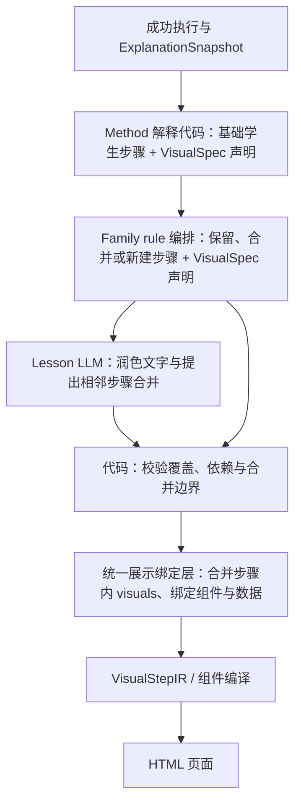

# 学生步骤、VisualSpec 与前端组件声明式绑定

状态：阶段 4B 最小闭环已实现；q07 业务编排、覆盖与组合仍为后续设计。更新：2026-09-24。

本文统一 Method 解释代码和 Family rule 编排代码的展示声明，定义 Lesson LLM 处理后如何绑定前端组件。§7 列明当前实现；q07、多次应用合成及覆盖/组合示例仍是目标契约，不代表已有业务能力。

本文取代此前“rule 生成的标题、正文和视觉全部锁死”的基本不等式讲解约定：数学内容、来源和必要边界由代码控制，文字可润色，步骤可在声明边界内合并。现有二次函数生产行为保持不变；可选 G1 的 LLM 组件选择不是本方案的前置条件。

## 1. 当前实现与需要补齐的部分

现有 `MethodSpec.visual` / `MethodVisualSpec` 继续声明数学场景的角色、模板和 binder；Macro 也有对应机制。新增 Method 的有序 `teaching_units`，每个单元可声明 `visuals` 与独立成步约束。最终 `LessonStep.visuals` 由代码从材料 authority 回填，LLM 无权改写。rule 新建单元共用此路径。

二次函数当前在递归 Scope/Goal 中维护完整 Frame，按数学对象 identity 继承、聚焦和替换对象。已有“抛物线解析式与交点材料合并到同一画面”的测试，以及 `focus` 覆盖 `context`、选定构型替换候选构型等局部规则。它不等于一个通用的自定义教学图合并器。

实现时复用现有 snapshot、owner、来源、组件编译和验证机制；新增学生步骤级声明与绑定适配，不再仅凭最终步骤的 capability 集合推断应画哪些图。

## 2. 唯一生成流程与职责



| 层 | 负责 | 不负责 |
| --- | --- | --- |
| Method 解释代码 | 从成功执行的公开证据产生基础学生步骤，声明每步 VisualSpec 和角色来源 | 重新求解、直接调用前端组件 |
| Family | 声明注册的讲解 rule ID 和配置 | 按题号指定单题路线 |
| rule 编排代码 | 按依赖编排步骤；保留、替换或新建展示声明 | 写 HTML/SVG、计算页面数学答案 |
| Lesson LLM | 润色学生文案，在边界内提出连续步骤合并 | 改数学事实、VisualSpec、绑定角色或组件 ID |
| 统一展示绑定层 | 校验最终步骤，执行展示合并规则，解析注册组件及参数 | 从润色文本猜表达式、从答案 fixture 补数据 |
| 前端组件 | 使用验证后的参数布局、渲染和交互 | 选择数学方法、证明结论 |

两个“绑定”时刻必须区分：LLM 之前，代码已把数学内容绑定到公开证据，形成可靠草稿；LLM 之后，统一层才确定最终步骤的组件组合与前端参数。不得把后置组件绑定理解成 LLM 之前没有来源校验。

## 3. 两种视觉类型、两套合并机制

分类由每个 VisualSpec 显式声明，不按 Family、题号或文字猜测。同一道题甚至同一个学生步骤可以同时使用两类展示。

| 维度 | `mathematical_scene`：数学对象图形 | `teaching_diagram`：自定义教学图 |
| --- | --- | --- |
| 示例 | 抛物线、几何构型、已验证函数的图像 | 条件与目标对照、换元示意、连续估计路线、取等验证卡片 |
| 图形语义 | 数学对象已有函数、坐标、关联或构造定义 | 代码设计的教学组织方式；框、箭头与位置通常不代表数学坐标 |
| 内容身份 | canonical 对象、状态版本、Scope/Goal | 展示实例、角色绑定、证据引用、应用事件 |
| 步骤间延续 | 按声明继承场景、调整 focus/context 和生命周期 | 默认仅当前步骤有效；不自动继承上一张教学图 |
| 合并机制 | 合并同一 scene 内的数学对象，去重并处理状态冲突 | 保留多个展示、覆盖、合成为新展示或要求独立 |
| 安全边界 | 不跨分支导入对象，不按同名/同坐标合并身份 | 不因相同组件或标题删除一次不同的数学应用 |

### 3.1 数学对象图形：共享场景内合并

相同 scene identity 与兼容 Scope/Goal 中，可复用当前 VisualStepIR 的 Frame 机制。例如求抛物线与求交点合并后，曲线和交点进入同一画面，同一个对象的重点状态覆盖背景状态。

不同坐标系、不同分支或不兼容 continuation policy 不强行合并。图形是否延续、何时替换仍由声明和对象身份决定。二次函数不是永远只能有一个组件；共享场景使多个相关展示能组合到同一图中。

### 3.2 自定义教学图：按展示契约组合

基本不等式结构图中的圆框、方框和箭头属于教学布局。两张图不能通过几何对象继承自动变成一张总览，必须有明确的展示合并规则：

| 动作 | 含义 | 必要条件 |
| --- | --- | --- |
| `coexist` | 同一步保留多个展示块 | 顺序明确，容器支持多块，各块角色完整 |
| `replace` | A 覆盖 B，只保留 A | 注册规则证明 A 的展示内容覆盖 B 的必需角色与教学信息，保留 B 的来源映射 |
| `compose` | A、B 生成 C | C 的 VisualSpec、组合 binder、组件均已注册，角色映射完整 |
| `separate` | 必须独立展示 | 拒绝导致该冲突的步骤合并，恢复编排后的原步骤 |

允许“A 优于 B”，但应声明为带条件的 `replace`，不能仅凭全局数字优先级删除 B。相同组件的两次不同应用默认是两个实例。无匹配合并规则时，能合法并存则并存，否则恢复原步骤；不能静默丢图。

规则按版本化的固定顺序处理；同一输入命中不兼容动作、覆盖形成循环或产生不唯一结果时返回明确诊断，不依赖导入顺序决定赢家。

### 3.3 混合展示

同一步既有抛物线又有公式推导卡时，图形部分按 scene 机制合并，卡片部分按教学图机制合并，最终作为同一步的多个展示块输出。两类之间不做隐式覆盖；确有复合组件时，必须注册显式角色映射和内容覆盖约定。

## 4. Method 与 rule 共用声明协议

### 4.1 VisualSpec 与步骤内 visuals

保留可复用规格与前端映射，不单独建立 VisualRequest 类型、注册表或生命周期：

- **VisualSpec**：声明 `visual_spec_id`、`visual_kind`、角色 schema、binder ID、组件绑定、合并策略及图形生命周期要求。
- **学生步骤的 `visuals[]`**：直接保存 `spec_id` 和本次 `roles` 数据引用，是步骤的一个字段，不是新增的一层协议。Method 与 rule 生成的步骤使用相同形态。
- **组件绑定注册表**：维护 VisualSpec → 前端组件的映射，以及组件版本、数据 schema、编译器与支持的模式；无需为每个步骤再创建一个绑定规格对象。

Scope/Goal owner、来源步骤/单元从所属学生步骤及内部 authority 取得，不在每个 visual 条目重复保存；更细的数学来源由角色引用携带。规格与组件的实际版本统一记录在生成产物的版本清单。必须独立成步的约束属于教学步骤；必需展示角色与内容属于 VisualSpec。图形的继承和生命周期仍按 §3 声明，去掉独立 VisualRequest 不等于去掉这些约束。

Method 和 rule 都引用同一个注册表。rule 可以在其代码模块内声明自身的 VisualSpec 及组件绑定注册项，与 Method 的声明方式相同；由启动注册阶段收集、检查唯一性和依赖。运行编排时只填充步骤内 `visuals`，不直接 import/调用 renderer，不另开一条 rule 专属前端路径。

Family 只引用稳定 rule ID；rule 不能通过动态文件路径加载任意代码。VisualSpec、binder、组件任一缺失都必须诊断。

### 4.2 rule 声明示意

以下 ID 和字段是拟定协议，角色值是引用，不是本题数值；正式模型在实现阶段定义。

```json
{
  "visual_spec_id": "basic_inequality.amgm_sequence_overview",
  "version": 1,
  "visual_kind": "teaching_diagram",
  "role_schema": {
    "applications": "VerifiedAmgmApplicationRef[]",
    "dependencies": "PublicDependencyRef[]",
    "target": "PublicGoalRef"
  },
  "role_binder_id": "basic_inequality.bind_amgm_sequence",
  "component_binding_id": "basic_inequality.amgm_sequence_overview.v1",
  "merge_policy_id": "basic_inequality.amgm_observation_coverage.v1",
  "lifecycle": "step_only"
}
```

rule 为总观察步骤添加该规格的 `visuals` 条目，`applications` 绑定本次成功执行中选中的应用事件。对应注册项将它映射到拟新增的连续应用总览组件；组件接收规范数学显示数据、顺序与依赖，不接收未审定的自由文本作为计算输入。

rule 生成的学生步骤示意（省略已有来源和推导字段；引用由代码解析，不是 LLM 自报）：

```json
{
  "title": "观察两次应用的路线",
  "visuals": [
    {
      "spec_id": "basic_inequality.amgm_sequence_overview",
      "roles": {
        "applications": ["application_a", "application_b"],
        "dependencies": ["application_a_to_b"],
        "target": "goal_ref"
      }
    }
  ]
}
```

`visuals` 保存在代码侧学生步骤及 authority 中，不进入 LLM 可写字段。合并时沿用原步骤来源、条目位置与角色引用区分各次使用；不能仅用 `spec_id` 去重，也不把数学上等值但来源不同的应用当成同一应用。保留编排与 LLM 后的覆盖映射即可，不新增展示请求身份系统。

### 4.3 rule 生成新步骤时

- 保留原步骤：保留其展示实例及来源。
- 合并原步骤：默认收集展示实例，再声明适用的覆盖/组合规则。
- 生成新总览：必须声明新 VisualSpec 和角色来源，不凭空继承某个 Method 的展示。
- 明确无需图形：记录 `no_visual` disposition 及原因；缺少声明不能被当作无需图形。

绑定器只消费 snapshot 中可公开的已验证内容。若需要新的教学证据投影，先完善 projector；不得直接把私有证明搜索、失败候选或原始 Planner 思考作为视觉数据。

## 5. LLM 合并后的统一处理

rule 产出的是编排后的草稿；LLM 输出经过代码校验后才成为最终学生步骤。

1. 为 rule 输出材料建立局部 `sN` 与内部 authority 映射，供同一次 Lesson LLM 润色和声明合并组。
2. LLM 不回写 `visuals`，只引用对应局部材料，沿用 Scope/Goal 容器。
3. 代码检查完整覆盖、连续性、依赖、不可切分单元和必须独立的边界。数学表达式、取等见证和结论保持 verified 来源；结构校验本身不宣称验证了每句自然语言。
4. 依据合并组收集原步骤的 `visuals` 条目，分别执行两类展示合并机制；检查必需内容没有丢失。
5. 最终绑定角色、组件版本与参数 schema，生成 VisualStepIR/编译输入，并保存覆盖和替换记录。
6. 全部通过后确定 LessonStep ID、步骤数量和导航，保证正文与展示对应同一最终分组；不允许先发布正文再悄悄拆图改步骤。

LLM 合并不能通过展示检查时，局部恢复 rule 输出的确定性原步骤和文案，再绑定展示。不尝试机械切开 LLM 合并后的段落。LLM 不可用时直接使用 rule 草稿，走同一绑定层。

若原步骤本身就缺少必需组件/角色，则报告 `VisualGap` 并保留已验证数学文本；页面验收不能算作完整视觉闭环。未知规格、角色歧义、版本不兼容、非法跨分支引用均不可猜测补齐。

## 6. 基本不等式例子

### 6.1 q01：两个 Method、三个学生步骤

| 来源 | 学生步骤 | 视觉类型与规格 |
| --- | --- | --- |
| M11 解释代码 | 观察结构：正项、定和与目标积 | 自定义教学图：条件与目标结构对照 |
| M11 解释代码 | 应用基本不等式，并代入定和得到上界 | 自定义教学图：不等式推导链 |
| M13 解释代码 | 检验取等并给出最大值 | 自定义教学图：取等与原条件验证 |

三步是 q01 教学验收目标，不是由题号触发的规则。M11 的通用解释投影提供观察与应用单元；对应必要认知边界阻止 LLM 把三步压成两步。M13 展示提交见证有效，不自动宣称所有取等解已穷尽。

M07、M08、M09 后续也由各自解释代码产生观察与执行单元；尚未实现的 Method 不因为声明了展示就获得执行能力。

### 6.2 q07：rule 新增两次应用之前的总观察

页面参考：[q07 多次应用基本不等式](https://www.shuxueshuo.com/problems/senior-high/inequalities/inequality-relations/inequality-basic-q07.html)。本节采用用户提供截图中的“四个教学步骤”作为展示参考，不把页面文案作为求解输入或数学证明。

题目为 `a>0, b>0`，求 `1/a+a/b²+b` 的最小值。已有解法的两次应用关系为：

| 应用 | 配对与已验证关系 | 本轮作用 | 取等条件 |
| --- | --- | --- | --- |
| A | `1/a+a/b² ≥ 2/b`，两项乘积为 `1/b²` | 先得到只含 b 的下界，目标降为估计 `2/b+b` | `a=b`（在 a、b 为正的原条件下） |
| B | `2/b+b ≥ 2√2`，两项乘积为 2 | 对上一轮下界再次估计，得到常数下界 | `b=√2` |

同时取 `a=b=√2` 可达到 `2√2`。生产讲解中的这些关系和见证必须来自成功执行的公开证据；表格只是设计示例，不允许 binder 硬编码它们或读取预期答案。

rule 判断的对象是同 Scope/Goal 中有依赖的已验证应用组：识别 A 的结果被 B 消费，整理两次配对的作用，然后在第一轮应用之前新增“观察结构”。这里的“应用之前”是学生展示顺序；rule 运行在求解成功之后，不负责在求解前预测次数。

```text
Method 解释：观察 A → 应用 A → 观察 B → 应用 B → 验等
rule 编排：总观察 → 应用 A → 应用 B → 验等
```

新增的总观察由 rule 声明 `amgm_sequence_overview` 并填充步骤内 `visuals`，按覆盖规则替换被汇总的单次观察展示，应用步骤保留各自推导链。总览只读引用两次应用，不重复占用详细推导材料的覆盖，也不生成 Runtime Step。

对应页面的四个学生步骤为：

1. **观察结构**：先把 `1/a` 与 `a/b²` 配对消去 a，再把所得下界中的 `2/b` 与 b 配对；本解法分两次应用基本不等式。
2. **应用基本不等式消元**：解释第一轮配对、正性及 `1/a+a/b² ≥ 2/b`。
3. **再次应用基本不等式取最值**：解释第二轮定积结构及常数下界 `2√2`。
4. **验证取等**：联合两轮取等条件，代回原条件与目标，确认最小值可取。

总观察的自定义图展示“当前条件与目标 → 第一轮配对及目的 → 第二轮配对及目的”，两个应用节点由同一组公开依赖连接，轮数由绑定的应用列表计算。中间下界在总览里标为后续路线预告，详细推导在第 2、3 步展开。

截图中的“变量数 2 − 已有等式条件数 0 = 应用次数 2”不进入通用判断代码，也不作为该组件的数学断言：变量与条件数量不足以决定估计次数、独立取等关系数或可达性。保留前置总观察的教学形式，用实际两轮配对及依赖说明本解法的次数。

轮数按去重后的真实已验证 AM-GM 应用事件统计，不按 Method 调用数、公式行数或证明节点数统计。总览可写“本解法分两次应用”，不能写成“所有解法都必须应用两次”。

若观察 B 依赖应用 A 才得到的新结论，总观察只预告路线，观察 B 中依赖新结论的必要解释仍保留在第二次应用之前或该步骤内。不能把未来结论呈现为初始已知条件，也不能为了四步样式强制删除观察。

多次应用用合成公开证据测试编排契约即可；完整求解验收须等待相应 Runtime 能力，不表示阶段 4A 已支持连续 AM-GM。

## 7. 阶段 4B 实现与验收

1. `runtime/inequality_teaching_evidence.py` 从成功执行生成类型化公开证据；`explanation/basic_inequality_teaching.py` 将 M11 拆为观察、应用，M13 产生验等单元。单 `teaching_unit` 兼容保留，与多单元声明互斥。
2. `explanation/teaching_rules.py` 提供显式注册的 Scope/Goal 编排入口、来源覆盖检查。默认无规则；测试规则新增概览并绑定已有 VisualSpec，不伪造 capability ID。q01 不注册无作用规则。
3. `visual/teaching_diagrams.py` 的 `VisualSpecRegistry` 声明规格 ID、版本、组件与角色 binder。4B 角色为公开证据引用；旧数学场景继续使用既有模板/binder/Frame。两条路径由 VisualStepBuilder 汇集到最终步骤，分别保留生命周期。
4. 教学图序列持久化为 `VisualStep.diagram_blocks`，包含实际规格/组件版本和来源；空值不改变既有 JSON。组件共享渲染入口在 `lesson-page-runtime.js`。规格版本清单另存 `visual-version-manifest.json`。
5. LLM 前生成确定性草稿，LLM 后校验来源与独立边界，再绑定组件；不合法合并局部恢复。`run_basic_inequality_stage4b.py` 支持草稿、录制回放及真实 Lesson LLM，输出新目录中的完整审计与 HTML。

4B 只实现 `coexist` 与独立边界检查；`replace`、`compose`、规则冲突解决及 q07 总观察业务留待连续 AM-GM 求解能力完成后。§4.2 的多次应用注册示例不是当前可调用规格。

AM-GM 教学图从公开证据的 `application_roles` 绑定数学角色，不能使用推导行下标：参与项由已验证的取等关系确定，AM-GM、定和代入、根式界和目标上界按关系两侧表达式识别，每个角色保留原行 `origins`。正性前置、同一行包含多个关系、交换项序或反向书写关系不改变角色。只提交 AM-GM 与上界的简写时，不生成代入/化简中间式；组件省略缺失的中间卡片。

必须覆盖以下回归：

- Method 和 rule 声明通过同一注册/绑定入口，rule 新步骤不靠伪造 capability ID 才能画图。
- q01 为三步，正性、定和、目标、上界及取等见证来自实际公开证据；变更题号或变量名无需增加绑定分支。
- 二次函数同一 scene 内曲线与交点合并、focus/context、分支隔离及生命周期保持既有行为。
- 测试规则新增概览与原始材料的覆盖/只读来源可审计；q07 多次应用规则不在本阶段验收范围。
- 自定义教学图不隐式继承；相同规格的两次应用不误去重；混合类型不强塞进同一几何 Frame。
- `coexist` 与独立边界有确定性测试；覆盖/组合测试随后续业务规则实现，当前不接受 rule 删除或合并原始独立材料。
- LLM 合并前后必讲材料完整、来源可追溯；非法合并局部回退，导航与展示数量一致。
- 缺组件、缺角色、未知版本产生明确 gap；可用文字不被删掉，完整页面验收仍失败。
- 不启用生产 basic_inequality Family、不改求解协议、不新增其余 21 题阶段资产。

已完成 q01 离线求解与两次独立真实 Lesson LLM 验收，均无回退地产出三步；浏览器检查桌面、390px 窄屏、公式及步骤导航。对应审计目录为 `internal/review-analysis/basic-inequality-stage4b/live-final-01`、`live-final-02`。公开证据缺失即报错，VisualGap 保留可靠 LessonIR 文字但不能计为页面闭环成功。

## 8. 相关设计

- [基本不等式实施计划](basic-inequality-expression-method-implementation-plan.md)：4A 已有求解链与 4B 实施边界。
- [基本不等式 Method 与讲解](basic-inequality-method-discussion.md)：Method、Family 与 rule 分工。
- [Lesson Scope LLM Authoring](lesson-scope-llm-authoring-vnext-design.md)：现有局部编号、覆盖、owner 与 fallback。
- [VisualStepIR v2](visual-step-ir-design.md)：数学对象场景的继承和完整 Frame 合同。
- [不等式视觉组件重构](inequality-visual-component-refactor-design.md)：共享组件和图谱扩展；非本阶段前置条件。
