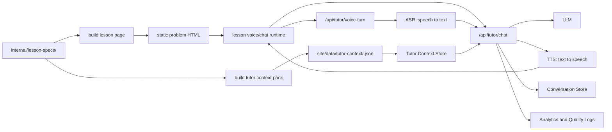

# 学生语音对话式解题导师系统设计

## 1. 背景

当前数学说的核心资产是已经编译好的静态题目页。每道题由 `internal/lesson-specs/<problem-id>/` 下的结构化内容生成，最终落到 `site/problems/<city>/<slot>/<problem-id>.html`。页面本身负责展示题目、步骤、图形、滑块、局部动点和步骤导航；后端目前是轻量 FastAPI，主要提供 `/api/` 能力。

新的核心功能是：学生在某一道题页面内，可以就“当前这道题”与模型对话。理想交互应以语音为主，学生可以像问身边老师一样直接开口；但数学题又离不开公式、点名、图形和步骤，所以系统必须同时保留文字转写、公式回显和页面动作建议。模型不是直接吐完整答案，而是像老师一样根据学生所在步骤、当前图形状态和已有解题结构，用启发式提问、分层提示、方法迁移和错因诊断带学生理解这道题。

设计目标不是把静态站点改成完整动态应用，而是在现有静态题页旁边加一个可复用的“AI 语音导师 sidecar”。

## 2. 设计目标

### 2.1 学习目标

- 帮学生从“看懂答案”推进到“知道下一步为什么这么想”。
- 对当前题进行上下文内讨论：题干、图形、步骤、参数、结论、方法标签都能被模型引用。
- 使用初中生可接受的方法语言，优先几何直观、全等、相似、特殊三角形、折线路径等，不把向量、投影、解析几何高级技巧作为主解。
- 用分层提示保护思考空间：先问问题，再给方向，再给关键构造，最后才完整解释。
- 能诊断学生的表达：学生给出自己的思路、算式或疑问时，模型指出第一个关键偏差，并把他带回正确关系。

### 2.2 产品目标

- 每个题页都有一个统一的“问老师”入口。
- “问老师”入口默认支持语音输入，同时保留文字输入。
- 模型知道学生当前停在哪一步、当前参数值和当前小问。
- 模型可以建议“回看第几步”“观察图中哪条线段”“拖动哪个参数试试”，但页面仍由前端 runtime 执行这些动作。
- 模型回答同时有语音播报和文字回显，公式、坐标、线段关系必须在屏幕上可读。
- 对话体验适合移动端微信浏览器和桌面浏览器。
- 首期不要求登录、不要求长期个性化，只做当前题的高质量即时辅导。

### 2.3 技术目标

- 保持题页静态发布能力，避免每个题页变成后端渲染页面。
- 不把模型 API key 暴露给浏览器，所有模型调用走后端 `/api/`。
- 不把语音识别、语音合成和模型供应商绑定进前端；前端只面向统一的导师语音 API。
- 复用现有 `lesson-data.json`、`geometry-spec.json`、`step-decorations.json`、`junior-math-methods.md` 和 `classification`。
- 新增上下文数据也走编译产物，不在单题 HTML 中手写大段提示词。
- 能逐步扩展：先一题试点，再批量生成上下文包，再做个性化和学习分析。

## 3. 推荐总体架构

推荐采用“静态题页 + 语音/文字对话运行时 + 导师 API + 题目上下文包”的四层结构。



核心判断：

- 题页仍是静态 HTML。
- 对话 UI 是共享前端 runtime，不在每道题里写特例；语音输入、文字输入、转写回显和音频播放都由这个 runtime 承担。
- 每道题额外有一个“导师上下文包”，作为模型可使用的题目知识源。
- 后端每次收到学生消息后，根据 `problemId`、`currentStepId`、当前参数状态、会话历史和上下文包组织模型调用。
- 模型响应不仅返回文本，还可以返回“建议动作”，例如跳转步骤、展开题目、聚焦图形区域、建议拖动参数。
- 语音链路首期采用“单轮语音回合”：录音上传、后端转写、模型回答、语音合成返回。后续再做实时双向流式语音。

## 4. 前端与语音体验设计

### 4.1 入口形态

桌面端：

- 右下角固定“问老师”按钮，展开后显示麦克风、文字输入和最近对话。
- 打开后出现右侧抽屉或浮层，不挤压主要步骤阅读区。
- 对话区顶部显示当前题名和当前步骤，例如“第（II）问 · 第3步”。

移动端：

- 底部固定按钮，打开后为 bottom sheet，底部主操作是麦克风。
- 不遮挡页面步骤导航 dock 的主要操作。
- 输入框上方显示当前上下文芯片：`当前步骤`、`完整题目`、`图形观察`。
- 微信内置浏览器里，麦克风授权和自动播放都依赖用户手势，因此首版以“按住说话”或“点一下开始/再点结束”为主。

### 4.2 语音优先，但文字不消失

数学题不能做成纯语音黑盒。语音负责降低提问门槛，文字负责承载精确数学对象。

界面应始终显示：

- 学生语音的转写文本。
- 模型回答的文字版。
- 公式、坐标、点名和线段关系的规范写法，例如 `√2`、`A(0, 3√3)`、`DM = DN`。
- 可点击的步骤引用，例如“回看第（II）问第2步”。
- 语音播放状态：正在思考、正在播放、可打断或可重播。

语音播报可以更口语，屏幕文字要更精确。比如语音说“根号二倍的 QN”，文字显示 `√2·QN`。

### 4.3 学生可发起的常见意图

前端不必做复杂 NLP，但可以提供少量快捷入口，降低学生提问成本：

| 入口 | 学生真实需求 | 导师行为 |
|---|---|---|
| 我卡住了 | 不知道下一步 | 先问“你现在想求什么”，再给当前步的最小提示 |
| 这一步为什么 | 看不懂某一步推导 | 解释该步依赖的已知条件和图形关系 |
| 检查我的思路 | 学生输入自己的做法 | 判断是否成立，定位第一处关键错误 |
| 图怎么看 | 看不懂辅助线或动点 | 引导观察点、线、角、面积或参数变化 |
| 换种说法 | 当前解释太抽象 | 用更低门槛语言或类比重讲 |
| 总结方法 | 想抽象到题型 | 连接到 method，例如将军饮马、旋转全等、等腰直角转化 |

### 4.4 当前页面状态

每次发消息时，前端应携带最小必要状态：

- `problemId`：题目唯一 ID。
- `currentStepId`：当前阅读步骤。
- `currentSection`：当前小问。
- `currentT`：主参数滑块值，如有。
- `localControls`：局部动点变量，如有。
- `solutionVisibleState`：学生当前是否在看完整步骤、是否展开题目。
- `clientHint`：快捷入口类型，例如 stuck、explain-step、check-work。
- `inputMode`：语音、文字、快捷入口。
- `speechTranscript`：语音转写后的文本，便于服务端记录和质量评估。
- `audioDurationMs`：本轮录音时长，用于限流和体验诊断。

这些状态让模型回答“当前这一屏”而不是泛泛讲整道题。

### 4.5 单轮语音回合

MVP 推荐先做单轮语音，而不是一开始就做连续实时通话。

一次语音回合：

1. 学生按住麦克风或点击开始录音。
2. 前端显示录音状态和时长。
3. 结束录音后上传音频和页面状态。
4. 后端转写语音，得到学生问题文本。
5. 前端先显示转写文本，允许学生发现明显识别错误。
6. 后端把转写文本送入导师对话链路。
7. 模型生成文字回答和建议动作。
8. 后端合成语音。
9. 前端播放语音，同时显示文字回答和步骤按钮。

这个方案的优点是实现简单、稳定、容易在移动浏览器中落地。延迟目标可以先控制在 2 到 5 秒内；真正实时的连续语音放到后续阶段。

### 4.6 连续语音模式

当单轮语音验证成功后，再升级连续语音：

- 学生打开“连续对话”模式。
- 系统持续监听短句，自动判断一句话结束。
- 模型回答时，学生可以打断。
- 打断后立即停止播报，进入新一轮理解。
- 屏幕仍持续显示转写、公式和步骤引用。

连续语音适合“老师在旁边陪做题”的体验，但工程复杂度更高，涉及浏览器音频流、网络抖动、回声处理、打断状态和更细的隐私提示。

### 4.7 数学语音转写与规范化

语音识别对数学表达天然容易出错，所以需要一层“数学转写规范化”：

| 学生可能说法 | 屏幕规范写法 |
|---|---|
| 根号二 | `√2` |
| 三根号三 | `3√3` |
| x 平方 | `x²` |
| A 点零逗号三根号三 | `A(0, 3√3)` |
| DM 等于 DN | `DM = DN` |
| 第二维第二小问 | `第（II）问第2步` |

遇到歧义时不要硬猜。例如学生说“点 B 还是点 P”听不清，系统应追问：“我听到你在问一个点，但不确定是 B 还是 P，你指的是哪一个？”

### 4.8 模型响应形态

响应文本应短而有推进感，一次只解决一个认知节点。建议结构：

1. 先复述学生当前问题。
2. 点出当前目标。
3. 给一个启发问题或最小提示。
4. 如果学生已经明确要求解释，再给关键推导。
5. 结尾给一个具体下一步动作。

示例风格：

> 你现在卡在“为什么要构造这个等腰直角三角形”。先别急着算，看看目标式里有一个 `√2`。初中几何里，`√2` 经常从等腰直角三角形的斜边来。  
> 你可以先想：如果把 `AN` 看成某个等腰直角三角形的斜边，那么它对应的直角边应该是哪一条？

前端可以接收附加动作：

| 动作 | 用途 |
|---|---|
| `jumpToStep` | 建议学生回看某一步 |
| `highlightStep` | 在步骤卡片中提示某个结论 |
| `suggestSlider` | 建议拖动参数观察某个阶段 |
| `showProblem` | 建议展开原题 |
| `askFollowup` | 给学生一个可点击的追问 |

首期可以只显示文本和“回看第 N 步”按钮，动作系统后续再扩展。

语音播报还需要额外规则：

- 每次播报尽量 10 到 20 秒，不长篇朗读。
- 复杂公式不只靠读出来，必须在屏幕显示。
- 回答结束时给一个明确问题，方便学生继续开口。
- 播报可暂停、重播、打断。

### 4.9 与移动端步骤导航的关系

当前手机浏览器里，底部已经有折叠步骤导航，因此语音功能不能再新增一个独立固定底栏。推荐把它们设计成同一个“底部交互层”的两种模式：步骤模式和语音模式。

核心原则：

- 页面底部同一时间只允许一个主控件占位。
- 折叠态保留现有步骤导航 dock，但在右侧增加一个小的麦克风入口。
- 打开语音后，语音 bottom sheet 接管底部区域，原步骤 dock 暂时隐藏或收进语音面板顶部。
- 打开步骤目录时，语音面板必须关闭或最小化。
- 语音回答中的“回看第 N 步”动作会先收起语音面板，再触发步骤跳转。

推荐移动端状态机：

| 状态 | 底部显示 | 可用操作 |
|---|---|---|
| `stepDock` | 当前步骤 + 目录按钮 + 麦克风小按钮 | 跳目录、开语音 |
| `stepSheet` | 步骤目录 bottom sheet | 选步骤、关闭目录；语音入口弱化 |
| `voicePeek` | 语音小面板，显示当前步骤芯片和麦克风 | 按住说话、切回目录 |
| `voiceRecording` | 录音面板，显示波形和时长 | 松开发送、取消录音 |
| `voiceAnswering` | 转写 + 回答 + 播放状态 | 重播、追问、回看步骤、最小化 |

折叠态布局建议：

```text
┌──────────────────────────────┐
│ 第（II）问 · 步骤 3 / 6       │
│ 构造等腰直角三角形   [目录] [麦克风] │
└──────────────────────────────┘
```

语音打开后：

```text
┌──────────────────────────────┐
│ 正在看：第（II）问 · 第3步   [目录] │
│ 学生转写：为什么这里想到根号二？     │
│ 老师：先看目标式里的 √2 ...        │
│              [按住说话]           │
└──────────────────────────────┘
```

这样有三个好处：

- 学生永远知道自己在第几步，语音不会脱离题页上下文。
- 底部不堆叠两个 fixed 元素，避免遮挡内容和浏览器安全区。
- 步骤跳转仍然是主流程，语音只是当前步骤上的辅助层。

实现上应把 `mobile-step-dock`、`mobile-step-sheet` 和未来的 `voice-sheet` 交给同一个 bottom-layer controller 管理，而不是各自维护 z-index。控制器只维护一个打开状态，并统一处理 `safe-area-inset-bottom`、键盘弹起、录音中防误触和滚动锁定。

## 5. 题目上下文包

### 5.1 为什么需要上下文包

不能让浏览器每次把整份 `geometry-spec`、`lesson-data` 和完整 HTML 都发给后端。一方面浪费 token，另一方面模型会被渲染细节干扰。更好的方式是在构建阶段生成一个面向导师对话的“教学上下文包”。

上下文包不是展示数据，而是模型辅导时需要的语义数据。

### 5.2 上下文包来源

上下文包由以下内容编译或整理而来：

- `01_problem.md`：题目原文、已知条件、小问。
- `02_solution.md`：标准解法和关键推导。
- `03_visual_steps.md`：每一步图形意图。
- `lesson-data.json`：步骤标题、derive、box、section、classification。
- `geometry-spec.json`：点、线、参数、曲线、动点关系。
- `step-decorations.json`：关键辅助线、角标、线段标注。
- `internal/knowledge-points/junior-math-methods.md`：method 的触发条件、允许方法、禁用方法、标准推导模板。
- 可选新增 `tutor-notes`：分层提示、常见错误、引导问题。

### 5.3 建议的数据内容

每道题的上下文包建议包含：

| 模块 | 内容 |
|---|---|
| meta | problemId、标题、地区、题位、classification |
| problem | 题干、已知条件、小问目标、最终答案 |
| stepMap | 每步 id、标题、小问、目标、使用的已知条件、输出结论 |
| methodMap | 本题涉及的方法 ID、中文名、触发点、禁用讲法 |
| diagramSemantics | 关键点、线段、角、辅助线、动点、参数的教学含义 |
| hintLadders | 按小问或步骤组织的 3 到 5 层提示 |
| misconceptions | 常见误解、错误算式、容易混淆的点 |
| speechExamples | 本题高频语音问法、公式读法、容易听错的点名 |
| prerequisiteLinks | 相关前置知识或相似题方法 |
| answerPolicy | 哪些答案可直接给，哪些需要先提示 |

### 5.4 分层提示设计

每个关键步骤可以预设提示阶梯：

| 层级 | 作用 | 例子 |
|---|---|---|
| H0 诊断 | 确认学生目标 | “你现在是想求点坐标，还是想解释为什么最短？” |
| H1 观察 | 引导看图或题干 | “注意目标式里出现了 `√2`，它可能来自什么图形？” |
| H2 方法 | 提醒解题方法 | “可以试着构造等腰直角三角形，把斜边转成直角边。” |
| H3 关键关系 | 给出核心等量 | “如果这个三角形是等腰直角，那么斜边 = `√2 × 直角边`。” |
| H4 完整解释 | 汇总推导 | “所以 `AN` 可以转成 `√2·QN`，目标式就变成折线路径最短。” |

模型默认从 H0/H1 开始；当学生明确说“直接告诉我”或已经多轮仍卡住时，再提升提示层级。

## 6. 后端服务设计

### 6.1 新增 API 能力

建议新增两个层级的 API：

- `/api/tutor/chat`：文字对话入口，支持流式文本返回。
- `/api/tutor/voice-turn`：单轮语音入口，接收音频，返回转写文本、导师文字回答、语音音频和建议动作。

后续可增加 `/api/tutor/realtime` 之类的实时语音通道，但不建议放在 MVP 第一版。

文字请求包含：

- 当前题目 ID。
- 当前页面状态。
- 学生消息。
- 会话 ID，匿名也可以。
- 可选客户端意图。

语音请求额外包含：

- 音频文件或音频片段。
- 音频格式、采样率、时长。
- 是否需要语音播报。
- 客户端已知的临时转写文本，如有。

后端负责：

1. 校验 `problemId` 是否存在。
2. 如果是语音输入，先做语音识别和数学表达规范化。
3. 读取对应上下文包。
4. 读取最近会话历史和会话摘要。
5. 构造导师提示词。
6. 调用模型。
7. 做响应后处理，包括安全检查、动作提取、日志记录。
8. 如果需要语音播报，做语音合成。
9. 返回文本、音频、转写文本和建议动作。

### 6.2 服务模块

| 模块 | 职责 |
|---|---|
| Tutor API | 接收聊天请求、鉴权或匿名限流、流式响应 |
| Context Store | 按 problemId 读取上下文包，做内存缓存 |
| Prompt Builder | 拼接系统规则、题目上下文、当前步骤状态、会话历史 |
| Conversation Store | 保存短期对话历史和摘要 |
| Model Client | 封装模型调用、超时、重试和降级 |
| Speech Gateway | 统一封装 ASR、TTS、实时语音能力 |
| Math Transcript Normalizer | 把“根号二”“x 平方”等口语转成规范数学文本 |
| Safety Guard | 防止泄露系统提示词、处理无关请求、保护未成年人隐私 |
| Analytics Logger | 记录问题、步骤、意图、提示层级、用户反馈 |

### 6.3 会话存储

MVP 可以先用匿名会话：

- 浏览器生成 `sessionId`。
- 后端保存最近 N 轮对话。
- 超过 token 预算后把早期对话压缩成“学生当前理解状态摘要”。
- 不保存姓名、手机号、学校等 PII。

后续如果做登录，再把会话与用户学习画像关联。

### 6.4 成本控制

- 上下文包按 `problemId` 缓存，不重复读取和大段拼接。
- 每轮只注入当前步骤附近内容，全题完整上下文按需摘要注入。
- 模型输出限制长度，默认 150 到 300 中文字。
- 语音输入限制单轮时长，例如 MVP 先限制 30 秒以内。
- 语音播报默认只读核心回答，不朗读完整推导表格。
- 对明显无关问题返回简短引导，不调用大模型或调用低成本模型。
- 常见固定问题可以缓存，例如“这一步为什么”“这道题用了什么方法”。

## 7. 提示词与教学策略

### 7.1 导师角色规则

导师应遵守：

- 面向初中生，语言短句、清楚、少术语。
- 先引导，后解释，最后总结。
- 不默认直接给最终答案。
- 不编造题目中没有的点、线、条件。
- 不使用当前知识体系禁用的方法作为主解。
- 学生提交解法时，先肯定有效部分，再指出第一处关键问题。
- 对图形问题尽量引用页面上的点、线、角和步骤。
- 语音回答要像老师当面说话，短句、停顿自然；屏幕文字负责承载精确公式。
- 对语音转写不确定的数学对象，先确认，不要擅自替学生改成另一个点或式子。
- 如果上下文不足，明确说“我需要回到题目/这一步看一下”，不要硬编。

### 7.2 按学生意图分流

| 意图 | 策略 |
|---|---|
| 不知道怎么开始 | 先问目标量，再提示已知条件与可用方法 |
| 看不懂某一步 | 解释“这一步用到了什么”和“得到什么” |
| 想直接要答案 | 先给一个最短提示，并提供“继续看完整解释”的选择 |
| 给出错误解法 | 定位第一个错误前提，不一次性批改所有细节 |
| 问方法迁移 | 抽象到 method，再给同类题的识别特征 |
| 问无关内容 | 温和拉回当前题，或简短拒绝不适合内容 |
| 语音识别不清 | 复述不确定部分，请学生确认点名、公式或步骤 |

### 7.3 上下文优先级

模型组织回答时，优先级如下：

1. 当前学生消息。
2. 当前步骤状态。
3. 当前题上下文包。
4. 本题 `classification` 对应的 method 规则。
5. 最近对话摘要。
6. 通用数学教学原则。

这能避免模型被历史闲聊带偏，也避免泛泛讲方法而忽略当前页面。

## 8. 内容生产流程改造

### 8.1 新增内容产物

建议在现有 lesson spec 流程后增加一个可选但推荐的导师笔记：

```text
internal/lesson-specs/<problem-id>/
├── 01_problem.md
├── 02_solution.md
├── 03_visual_steps.md
├── geometry-spec.json
├── step-decorations.json
├── lesson-data.json
└── tutor-notes.md 或 tutor-notes.json
```

`tutor-notes` 不进入页面展示，只服务对话。它可以包含：

- 本题的核心想法。
- 每个关键步骤的引导问题。
- 常见错误。
- 不建议采用的讲法。
- 与 method 的对应关系。
- 本题常见语音问法和容易听错的表达，例如 `B/P`、`根号二/二`、`x²/2x`。

### 8.2 编译产物

新增上下文包编译步骤：

```text
internal/lesson-specs/<problem-id>/...
        ↓
site/data/tutor-context/<problem-id>.json
```

如果不想在静态目录暴露完整上下文包，也可以编译到 `server/data/tutor-context/`，只由后端读取。更推荐后者，因为上下文包可能包含完整答案、提示词策略和质量标注。

### 8.3 与现有 schema 的关系

不要把大段导师提示塞进 `lesson-data.json`。`lesson-data.json` 继续服务页面展示；导师上下文包服务模型。两者通过 `problemId`、`stepId`、`classification` 对齐。

可以在 `lesson-data.json` 中只增加极少的公共字段，例如是否启用对话、默认欢迎语、推荐快捷入口。详细辅导内容放在上下文包。

## 9. 质量评估

### 9.1 评估维度

每道试点题准备一组标准学生问题，人工评分：

| 维度 | 通过标准 |
|---|---|
| 数学正确性 | 不引入错误条件，不算错，不混淆点线 |
| 引导性 | 不第一句直接给完整答案，能提出有效问题 |
| 当前步骤意识 | 能引用当前步骤目标和已有结论 |
| 方法一致性 | 使用本题 method 允许的初中方法 |
| 图形连接 | 能指导学生看图中的关键对象 |
| 表达友好 | 短、清楚、适合中学生 |
| 语音可听性 | 播报自然、不过长、公式不只靠口播 |
| 转写准确性 | 点名、公式、根式、平方、步骤编号能正确回显 |
| 语音延迟 | 单轮语音从停止录音到开始回答的等待可接受 |
| 抗跑题 | 无关请求能拉回学习场景 |

### 9.2 回归测试题库

建议每个 method 至少维护 3 类测试问题：

- 卡住型：“我不知道下一步怎么办。”
- 解释型：“为什么这里能得到这个结论？”
- 错误型：“我觉得这样算对吗？”
- 语音型：“根号二乘 QN 是怎么来的？”“A 点坐标是不是零逗号三根号三？”

后续每次改提示词、上下文包结构或模型版本，都跑一次离线评估。

### 9.3 线上反馈

对每次模型回答提供轻量反馈：

- 有帮助 / 没帮助。
- 太快给答案 / 还是没懂 / 讲错了。
- 当前题、当前步骤、学生意图、提示层级、输入方式和语音延迟写入日志。

这些数据会反过来改进 `tutor-notes` 和提示词，而不是盲目调大模型。

## 10. 安全与隐私

- API key 只放后端环境变量。
- `/api/tutor/chat` 做同源限制、频控和基本反滥用。
- `/api/tutor/voice-turn` 同样做时长限制、大小限制和频控。
- 不鼓励学生输入个人信息；检测到手机号、学校、姓名等敏感信息时不进入长期记忆。
- 对话日志默认脱敏。
- 原始音频默认不长期保存；如需保存用于质量评估，应单独开关并明确用途。
- 未登录 MVP 不做跨设备长期画像。
- 模型不得泄露系统提示词、上下文包内部策略或服务端配置。
- 对非学习类敏感请求，应简短拒绝并拉回当前数学题。

## 11. 分期实施建议

### Phase 0：产品原型

目标：验证学生是否愿意在题页里提问。

- 选择 1 到 2 道高质量已编译题。
- 手工整理上下文包和提示阶梯。
- 做一个最小语音入口：按住说话、显示转写、返回文字回答，可暂不播报。
- 不做账号、不做长期存储。
- 验证 20 到 30 条真实问题。

### Phase 1：MVP

目标：形成可复用系统边界。

- 新增共享 `lesson-voice-chat-runtime`。
- 新增 `/api/tutor/chat`。
- 新增 `/api/tutor/voice-turn`。
- 新增上下文包读取与缓存。
- 支持当前步骤、当前参数、快捷入口。
- 支持语音输入转写、文字回答和可选语音播报。
- 支持匿名短期会话。
- 记录基础质量日志。

### Phase 2：内容规模化

目标：让更多题页自动拥有导师上下文。

- 为 lesson spec 流程增加 `tutor-notes` 规范。
- 编译生成每题上下文包。
- 用 `classification` 自动注入 method 规则。
- 为每个 method 建立标准测试问题。
- 批量接入已发布题。

### Phase 3：更强的页面联动

目标：让模型不仅能说，还能带学生操作页面。

- 模型返回结构化动作。
- 前端支持跳转步骤、展开题目、建议拖动滑块。
- 对图形元素做可聚焦标记，例如高亮某条辅助线或某个结论框。
- 支持“老师问一句，学生点选/输入一句”的短练习。
- 支持连续语音、打断播报和多轮追问。

### Phase 4：个性化学习

目标：从单题辅导走向方法掌握。

- 建立学生在不同 method 上的掌握度。
- 同类题推荐。
- 错因归类。
- 课后小结和复习卡片。
- 登录用户的跨题学习记录。

## 12. MVP 推荐范围

首版建议非常克制：

- 只做当前题的语音问答。
- 只接入少量高质量题。
- 只支持单轮语音，不做连续实时通话。
- 显示学生语音转写，允许学生改用文字重问。
- 返回文字、可选语音播报和“回看某步”按钮。
- 不做复杂知识图谱。
- 不做长期用户画像。
- 不让模型直接改页面状态，只给建议动作。
- 每轮回答控制在短文本和短语音，避免语音导师替代题页学习。

MVP 的成功标准：

- 学生问“这一步为什么”，模型能准确解释当前步骤。
- 学生问“我卡住了”，模型能给出不剧透的下一步提示。
- 学生给错思路，模型能指出第一个关键错误。
- 学生用语音说出点名、根式、平方、步骤编号时，系统能正确转写或追问确认。
- 语音回答自然短促，公式在屏幕上同步可见。
- 模型不会使用超纲方法作为主讲法。
- 对话能自然引导学生回到页面步骤和图形。

## 13. 关键设计取舍

### 13.1 为什么不是直接把整道题发给模型

整题原始数据太多，包含大量渲染细节。模型容易注意力分散，也会增加成本。上下文包把“页面展示数据”转成“教学语义数据”，更稳定。

### 13.2 为什么不是把对话写进静态 HTML

模型调用必须走后端，且提示词和上下文策略会不断迭代。把对话逻辑放进共享 runtime 和 API，可以统一更新，不需要重编每道题。

### 13.3 为什么 MVP 先做单轮语音

连续实时语音体验更像真人老师，但第一版会同时遇到麦克风权限、网络抖动、回声、打断、语音识别中间结果和移动浏览器兼容问题。单轮语音已经能验证最关键的问题：学生是否愿意开口问、转写是否能处理数学表达、导师是否能基于当前步骤正确引导。

### 13.4 为什么语音不能取代文字

数学表达需要精确性。点 `A` 和点 `P`、`√2` 和 `2`、`x²` 和 `2x` 在语音里都容易混淆。语音负责自然提问和陪伴感，文字负责公式、坐标、步骤引用和可复查性。

### 13.5 为什么需要 tutor-notes

`02_solution.md` 说明“怎么解”，但不一定说明“学生会在哪卡住”和“该怎么提示”。对话导师需要的正是这些教学中间层。`tutor-notes` 可以先手工写，后续再由工具半自动生成。

### 13.6 为什么要保留静态题页

数学说当前的优势是题页可独立访问、部署简单、SEO 友好、微信分享直接。对话能力作为增强层接入，不应破坏这个优势。

## 14. 待确认问题

- 是否需要登录体系，还是先匿名试用。
- 对话日志保存多久，是否允许用于改进内容。
- 模型供应商和模型选择策略。
- ASR、TTS、实时语音是否使用同一供应商，还是分别选择。
- 是否允许保存原始音频用于质量评估，默认保存多久。
- 是否需要家长/老师端查看学习记录。
- 上下文包放在 `site/data` 还是仅服务端可读。
- 对“直接告诉我答案”的产品态度：允许直接给，还是需要二次确认。
- 首版语音交互采用“按住说话”还是“点按开始/结束”。
- 第一批试点题选择哪些 method：建议从 `horse-drinking`、`rotation-by-congruence`、`isosceles-right-triangle-transform` 开始，因为这几类最需要引导和看图。

## 15. 建议的下一步

1. 选一题作为试点，优先选择已经有高质量 `classification` 和清晰步骤图的题。
2. 手写该题 `tutor-notes`，包括 10 个典型学生问题和提示阶梯。
3. 补充 10 条语音测试句，覆盖点名、根式、平方、坐标、步骤编号。
4. 设计语音 UI 的桌面和移动端交互稿，尤其是录音状态、转写回显和重播。
5. 实现最小 `/api/tutor/voice-turn` 和上下文读取，不做复杂个性化。
6. 找真实学生或老师试用，记录模型在哪些地方“太快给答案”“讲得太抽象”“没有看当前步骤”“转写听错公式”。
7. 再决定是否把上下文包编译和语音回归测试纳入正式内容生产流程。
