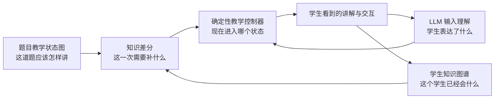
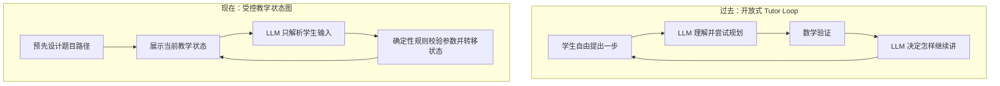
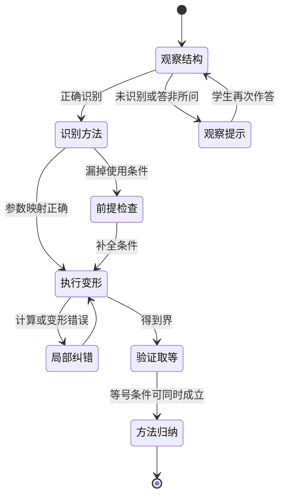
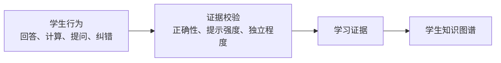
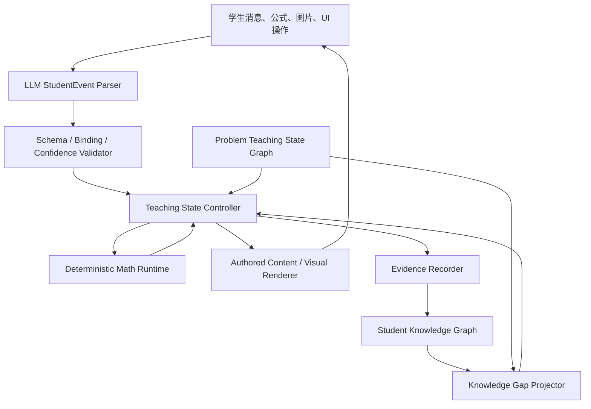

# 学生交互与个性化教学系统设计

## 1. 产品使命

我们的目标不是做一个能够自由讲题的聊天机器人，而是让每个学生都获得适合自己当前认知位置的讲解：

> **让每个学生的成绩，配得上他的能力。**

现有教学通常提供同一份讲解，再要求所有学生进入这套讲解。我们的方向相反：

> **看见学生在哪里，把讲解送到那里。**

产品由两个核心系统组成：

1. **题目教学状态图**：规定每道题应该怎样讲、先讲什么、学生不同反应对应怎样推进。
2. **学生长期知识图谱**：记录学生已经理解什么、在哪些环节需要提示、有哪些稳定误区。

两者在每次讲题时进行差分计算：

```text
题目所需知识与步骤
− 学生已经稳定掌握的部分
= 本次真正需要讲解的内容
```

因此，个性化不是让 LLM 即兴生成不同答案，而是在经过教学设计的路径中，为不同学生选择不同的进入位置、展开深度、提示强度和表达方式。

## 2. 核心产品模型


```mermaid
flowchart LR
    P["题目教学状态图<br/>这道题应该怎样讲"]
    K["学生知识图谱<br/>这个学生已经会什么"]
    D["知识差分<br/>这一次需要补什么"]
    C["确定性教学控制器<br/>现在进入哪个状态"]
    I["LLM 输入理解<br/>学生表达了什么"]
    U["学生看到的讲解与交互"]

    P --> D
    K --> D
    D --> C
    I --> C
    C --> U
    U --> I
    U --> K
```

这里真正的主控是确定性的教学控制器，不是一个不断自行计划和调用工具的主 LLM。

运行循环为：

```text
进入教学状态
→ 展示该状态允许的内容
→ 接收学生输入
→ LLM 解析为结构化事件与参数
→ 校验事件
→ 状态机决定下一状态
→ 记录学习证据
```

## 3. 设计认知发生了什么变化

### 3.1 从模型主导变为教学设计主导


```mermaid
flowchart TB
    subgraph OLD["过去：开放式 Tutor Loop"]
        O1["学生自由提出一步"] --> O2["LLM 理解并尝试规划"]
        O2 --> O3["数学验证"]
        O3 --> O4["LLM 决定怎样继续讲"]
        O4 --> O1
    end

    subgraph NEW["现在：受控教学状态图"]
        N1["预先设计题目路径"] --> N2["展示当前教学状态"]
        N2 --> N3["LLM 只解析学生输入"]
        N3 --> N4["确定性规则校验参数并转移状态"]
        N4 --> N2
    end
```

### 3.2 关键变化对照

| 过去的设计 | 现在的设计 | 改变的原因 |
| --- | --- | --- |
| LLM 与学生共同探索解题路线 | 每道题预先拥有清晰的教学状态图 | 保证讲解内容稳定、正确、可测试 |
| 主 LLM 维持 agent loop 并决定下一步 | 状态机维持教学 loop 并决定下一步 | 模型不再拥有教学决策权 |
| 学生或 LLM 可以临场创造主路线 | 学生在已设计的主路径和合法分支中推进 | 避免讲解漂移，也保留合理的多解法 |
| 依靠聊天上下文判断学生会什么 | 依靠长期知识图谱和可追溯证据 | 个性化能够跨题目、跨会话持续 |
| 用统一提示阶梯临时生成反馈 | 每个状态绑定具体问题、提示和揭示边界 | 提示与本题当前认知任务严格一致 |
| 从学生尝试临时生成一份讲解页 | 将学生行为映射回稳定的教学节点和组件 | 页面结构可预测、可复用、可验证 |
| 个性化主要靠给 LLM 更多上下文 | 先做题目图与学生图的差分，再给出参数 | 个性化从“生成风格”变为“教学内容选择” |

保留下来的能力包括：数学验证、定义域与等号条件检查、错误证据、提示强度记录、长期掌握更新。变化的是它们不再驱动一条自由生成的路线，而是服务于已设计的教学状态。

## 4. 题目教学状态图

### 4.1 每道题必须有自己的教学程序

一道题不能只有题面、答案和一篇静态解析。它至少需要定义：

- 主解题路径；
- 合法的替代路径；
- 每一步希望学生发现的数学对象；
- 该步允许展示的内容；
- 学生可能产生的正确、错误和不完整反应；
- 每类反应对应的状态转移；
- 当前步骤的提示阶梯；
- 定义域、取等、边界和可达性等未完成任务；
- 本状态能够产生哪些掌握证据。

它不是一段由 LLM 阅读后自由发挥的文字，而是一份可以执行、测试和版本化的教学程序。

### 4.2 状态图而不只是线性步骤

每道题应有一条明确主路径，但学生的反应并不完全线性，所以实现形式应是状态图：


```mermaid
stateDiagram-v2
    [*] --> 观察结构
    观察结构 --> 识别方法: 正确识别
    观察结构 --> 观察提示: 未识别或答非所问
    观察提示 --> 观察结构: 学生再次作答
    识别方法 --> 执行变形: 参数映射正确
    识别方法 --> 前提检查: 漏掉使用条件
    前提检查 --> 执行变形: 补全条件
    执行变形 --> 局部纠错: 计算或变形错误
    局部纠错 --> 执行变形
    执行变形 --> 验证取等: 得到界
    验证取等 --> 方法归纳: 等号条件可同时成立
    方法归纳 --> [*]
```

分支仍然由教学设计者声明。LLM 可以识别学生落在哪个分支，但不能自行新增一个未经审核的教学状态。

### 4.3 状态定义

```yaml
state_id: identify_symmetric_structure
teaching_goal: 学生能通过交换变量判断目标与条件是否对称

visible_content_refs:
  - problem.goal
  - problem.conditions
  - visual.swap_slots

expected_events:
  - kind: classify_structure
    params:
      target_symmetric: boolean
      condition_symmetric: boolean

transitions:
  - when: target_symmetric && condition_symmetric
    to: substitute_sum_and_product
  - when: interpretation_ambiguous
    to: clarify_student_input
  - otherwise: show_swap_comparison_hint

hints:
  - level: 1
    content_ref: hint.swap_variables
  - level: 2
    content_ref: visual.compare_before_after

evidence_rules:
  - knowledge_point: recognize_symmetric_structure
    dimension: recognition
```

状态中引用的讲解、公式和可视化组件都来自已审核内容。状态只决定何时展示，不把内容生成权交给模型。

### 4.4 可复用模板与题目实例

不需要为每道题从零编程。系统可以先建设方法级状态模板：

- 直接应用基本不等式；
- 配齐次式；
- 找对称结构；
- 多次应用基本不等式；
- 换元法；
- 条件消元法。

具体题目将自己的数学对象、公式角色、视觉槽位和转移条件绑定到模板，形成题目专属状态图。

```text
方法状态模板
+ 题目实体与参数绑定
+ 题目特有观察和误区
= 题目教学状态图
```

因此既能保证每道题有明确路径，也能避免大量重复实现。

## 5. LLM 的职责边界

### 5.1 LLM 是输入理解器，不是教学主控

LLM 的首要职责是把学生的自然表达转换为状态机能够处理的结构化事件：

```text
“我觉得可以把 2y 看成一个整体”
                  ↓
kind: propose_grouping
params:
  left_object: x
  right_object: 2y
confidence: 0.96
```

状态机随后判断：

- 当前状态是否接受 `propose_grouping`；
- `x` 和 `2y` 是否绑定到题目中的合法对象；
- 该分组是否满足已设计的后续路径；
- 应进入“换元后检查对称”还是“补充观察提示”。

### 5.2 LLM 可以做什么

- 理解自然语言、公式、手写识别结果和 UI 操作；
- 识别学生在回答哪个问题；
- 提取变量、表达式、关系、方法名称和理由；
- 判断一句话可能对应的少量候选事件；
- 在内容已经由状态确定后，做受约束的口语化表达；
- 将数学诊断翻译为学生能理解的语言。

### 5.3 LLM 不可以做什么

- 自行决定本题下一步应该讲什么；
- 跳过状态图中的教学目标；
- 自行创造新的主解法并替换已审核路径；
- 根据标准答案反向猜测学生意图；
- 在解释不确定时自动选择“最接近正确答案”的含义；
- 绕过状态的揭示边界，提前给出未来步骤；
- 把生成的自然语言当作数学事实或掌握证据。

### 5.4 结构化学生事件

```yaml
event_id: event-1024
session_id: session-88
state_id: identify_symmetric_structure

student_authored:
  text: "把 2y 看成一个整体行不行"

interpreted:
  kind: propose_grouping
  params:
    groups: [x, 2y]
  confidence: 0.96
  entity_refs: [entity-x, expression-2y]

validation:
  schema: passed
  binding: passed
  math_status: pending
```

必须永久区分：

- `student_authored`：学生原话；
- `interpreted`：模型理解出的事件与参数；
- `validated`：经过规则和数学内核确认的含义。

当存在多个非等价解释或置信度不足时，只能进入澄清状态。

## 6. 学生长期知识图谱

### 6.1 长期记忆不是聊天记录

聊天记录说明学生说过什么，但不能直接说明学生会什么。长期记忆应保存经过证据支持的认知状态：


```mermaid
flowchart LR
    A["学生行为<br/>回答、计算、提问、纠错"]
    V["证据校验<br/>正确性、提示强度、独立程度"]
    E["学习证据"]
    K["学生知识图谱"]

    A --> V --> E --> K
```

原始对话可以按隐私政策短期保存，但不能把模型对对话的总结直接当成长期掌握结论。

### 6.2 图谱节点

节点可以包括：

- 知识概念：基本不等式、韦达定理；
- 方法：换元法、条件消元法、配齐次式；
- 操作：通分、因式分解、配方；
- 结构识别：定和、定积、对称结构、齐次结构；
- 必要检查：正数、非零、定义域、等号可达；
- 表征能力：能否从代数式映射到图形槽位；
- 误区：忽略前提、方向判断错误、只求出界而未验证取等。

### 6.3 图谱关系

- `prerequisite_of`：前置知识；
- `part_of`：属于某种方法；
- `used_by`：被题目或状态使用；
- `transfers_to`：可迁移到另一结构；
- `confused_with`：容易混淆；
- `evidenced_by`：由哪次学生行为提供证据；
- `remediated_by`：由哪个讲解状态修复。

### 6.4 掌握不是布尔值

每个知识节点至少记录：

```yaml
knowledge_point: symmetric_sum_product_substitution
mastery:
  recognition: 0.82
  prerequisite_check: 0.65
  mapping: 0.78
  execution: 0.74
  explanation: 0.48
  equality_check: 0.51
  transfer: 0.36
confidence: 0.77
last_evidence_at: 2026-09-04
stable_misconceptions:
  - only_checks_goal_not_condition
```

推荐的可解释阶段是：

```text
未观察到
→ 提示下识别
→ 独立识别
→ 提示下应用
→ 独立应用
→ 能解释
→ 能迁移
```

每条更新必须保留题目难度、状态节点、提示等级、学生独立程度、验证结果和时间。学生在完整提示后答对，不能记录为独立掌握。

## 7. 题目图与学生图的差分

### 7.1 不是简单的会与不会相减

设当前题目路径需要的知识节点集合为 `R`，学生知识图谱为 `K`。教学差分可以表示为：

```text
Gap(problem, student)
= 当前路径需要、但学生掌握度或证据置信度不足的节点
+ 这些节点尚未掌握的必要前置节点
```

差分结果不能只输出“缺少哪些知识点”，还要生成教学参数：

- 从哪个状态进入；
- 哪些状态可以略过；
- 哪些观察必须展开；
- 默认从第几级提示开始；
- 优先使用公式、图形还是语言说明；
- 哪些误区需要主动检查；
- 完题后需要哪一道迁移题确认掌握。

### 7.2 同一道题的不同讲解

题目路径需要：

```text
识别对称结构
→ 用和与积换元
→ 应用基本不等式消元
→ 验证取等
```

三名学生可以得到不同的路径投影：

| 学生状态 | 本次路径 |
| --- | --- |
| 不会识别对称 | 从交换变量开始，完整展示结构识别 |
| 已会识别但不会和积换元 | 略过交换演示，从 `s=x+y, p=xy` 的映射开始 |
| 能独立求界但常漏等号 | 前两段压缩，只展开边界与取等验证 |

题目的数学主路径没有改变，改变的是学生进入路径的位置和每个状态的展开程度。

### 7.3 差分计算的更新时机

- 开始一道新题时；
- 学生在关键诊断状态产生新证据时；
- 学生明确要求更详细或更简洁时；
- 长时间间隔后重新学习同一知识点时；
- 课程或知识图谱版本发生变化时。

同一题内不应在每句话后完全重规划路径，只更新受当前证据影响的局部教学参数，避免讲解来回跳动。

## 8. 数学事实与教学内容的权威来源

系统需要明确分离四类权威：

| 权威 | 决定什么 |
| --- | --- |
| ProblemIR / Facts / Goals | 题面事实、条件和目标 |
| Method / Capability Runtime | 数学变形与结论是否正确 |
| TeachingStateGraph | 当前应该讲什么、允许展示什么 |
| StudentKnowledgeGraph | 对这个学生应该展开到什么程度 |

LLM 输出不是权威。模型解析的学生事件必须经过 schema、实体绑定、当前状态许可和必要的数学验证，才能参与状态转移或写入长期证据。

## 9. 数学验证与任务账本

状态图预先知道推荐路径，但学生输入中的具体公式仍然需要验证。系统可以：

- 验算学生提交的等式、不等式和数值；
- 检查当前步骤所需的正数、非零和定义域条件；
- 检查多次放缩的等号条件能否同时成立；
- 将错误定位到第一个失效的局部操作；
- 判断学生提出的表达是否与当前状态目标等价。

每次开方、除法、取倒数、平方、放缩或参数分支都可能产生未完成任务：

- 定义域条件；
- 正负条件；
- 非零条件；
- 放缩方向；
- 等号条件；
- 边界可达性。

这些任务进入状态机的 obligation ledger。例如学生已经证明下界，但尚未验证等号能否取得时，系统只能进入“界已得到、极值未完成”状态。

## 10. 学生行为、诊断与学习证据

学生每次行为至少分为：

| 类型 | 状态机处理 |
| --- | --- |
| `expected_correct` | 进入主路径下一状态并生成正向证据 |
| `correct_incomplete` | 保留当前状态，追问缺失参数或任务 |
| `known_misconception` | 进入该状态预设的误区修复分支 |
| `calculation_error` | 定位局部错误，进入计算纠错状态 |
| `missing_precondition` | 进入前提检查状态 |
| `alternative_authored_route` | 切换到已设计的替代路径 |
| `valid_but_unmodeled_route` | 认可其可能性，记录待扩展案例；不让 LLM 临场编写主讲解 |
| `irrelevant` | 说明与当前问题的距离，回到当前状态目标 |
| `ambiguous` | 进入澄清状态，不执行数学动作 |

错误行为不能被删除，但它只作为学习证据和误区记录，不能进入正式证明链。

## 11. 状态内提示设计

提示仍然分级，但每一级由当前教学状态预先绑定：

1. **确认当前进度**：指出学生已经完成的部分；
2. **观察性问题**：让学生注意本状态的目标对象；
3. **方法性提示**：点出相关方法或结构；
4. **关系槽位**：展示允许学生填入的公式或视觉槽位；
5. **当前步骤讲解**：完整展示当前状态的推导；
6. **后续路径**：仅在学生明确请求且策略允许时逐状态展开。

“提示等级”只控制同一个状态内揭示多少，不赋予 LLM 跨越未来状态的权力。

系统选择提示等级时考虑：

- 本状态已经尝试的次数；
- 对应知识节点的掌握度和证据置信度；
- 学生是否明确要求更强提示；
- 教师设置和课程模式；
- 当前状态已经展示过哪些内容。

## 12. 会话状态与长期记忆的边界

会话状态负责“这道题现在讲到哪里”，至少包含：

- problem、lesson、teaching graph revision；
- 当前 state id 与已访问状态；
- 本题个性化路径参数；
- 最近的结构化学生事件；
- 当前提示等级；
- 未完成任务账本；
- 本题新产生但尚未汇总的学习证据；
- 显式偏好，例如“先不要给答案”。

学生知识图谱负责“这个学生长期会什么”，不保存无界聊天历史。会话结束后，只把经过验证、带来源和置信度的证据汇总进长期图谱。

## 13. 页面与交互组件

页面不是由 Tutor LLM 自由生成，而由当前教学状态引用稳定组件：

- 题面对象高亮；
- 公式槽位；
- 变量交换；
- 配齐次式；
- 换元与同步改写；
- 条件消元；
- 多次取等关系；
- 定义域与等号任务；
- 方法归纳与迁移。

状态机可以控制组件中的参数、显隐、焦点和动画 beat。客户端只执行白名单 UI action：

- 跳到当前步骤；
- 高亮指定条件或目标；
- 展示当前状态允许的公式；
- 播放局部变化；
- 打开定义域或等号任务；
- 在已设计路径之间切换。

模型不能生成或执行任意前端代码。

## 14. 最小运行架构


```mermaid
flowchart TD
    U["学生消息、公式、图片、UI 操作"]
    L["LLM StudentEvent Parser"]
    S["Schema / Binding / Confidence Validator"]
    T["Teaching State Controller"]
    P["Problem Teaching State Graph"]
    G["Student Knowledge Graph"]
    D["Knowledge Gap Projector"]
    M["Deterministic Math Runtime"]
    R["Authored Content / Visual Renderer"]
    E["Evidence Recorder"]

    U --> L --> S --> T
    P --> T
    G --> D
    P --> D
    D --> T
    T --> M
    M --> T
    T --> R
    R --> U
    T --> E --> G
```

关键约束：

- `Teaching State Controller` 是唯一状态转移权威；
- `LLM StudentEvent Parser` 不持有教学循环；
- `Knowledge Gap Projector` 只在状态图允许的范围内调整路径参数；
- `Math Runtime` 判断数学正确性，不决定教学顺序；
- `Renderer` 只消费已审核内容与合法参数。

## 15. API 与数据对象

最小接口：

```text
POST /tutor/sessions
GET  /tutor/sessions/{id}
POST /tutor/sessions/{id}/events
GET  /tutor/sessions/{id}/state
GET  /tutor/sessions/{id}/obligations
GET  /students/{id}/knowledge-graph
GET  /students/{id}/mastery-evidence
POST /students/{id}/evidence
```

一次事件响应至少包括：

- interpreted event 与参数；
- interpretation confidence；
- validation status；
- previous state 与 next state；
- 当前状态允许的 content refs；
- personalized presentation parameters；
- 未完成任务变化；
- mastery evidence delta；
- source refs 与版本信息。

当解释置信度不足时，`next_state` 必须是澄清状态，不能直接执行可能错误的学生意图。

## 16. 隐私、安全与教育边界

- 只保存完成教学所需的数据；
- 原始个人信息与结构化学习证据分开存储；
- 不把模型推断直接写成学生长期能力标签；
- 不根据一次错误形成永久结论；
- 掌握状态可解释、可撤销，并允许教师复核；
- 学生、家长和教师能够看到主要证据来源；
- 学生文本不能被解释为系统指令；
- 不向其他学生暴露个人错误、路径或掌握状态；
- 课程、题目、状态图和知识图谱都必须带 revision；
- 版本不兼容时不能静默迁移旧会话。

## 17. 产品与教学质量指标

### 路径质量

- 题目状态图覆盖率；
- 学生输入能够映射到已设计状态的比例；
- `valid_but_unmodeled_route` 出现率；
- 状态转移准确率；
- 提前泄露未来步骤的比例；
- 在错误状态间反复跳转的比例。

### 学习质量

- 学生在下一次尝试中自行修正的比例；
- 独立识别与独立应用的增长；
- 等号、定义域和前提遗漏率；
- 近迁移与远迁移成功率；
- 同类题所需提示等级的下降；
- 知识图谱预测与真实表现的一致性。

### 产品质量

- 学生有效表达数学思路的比例；
- 完题率与中途放弃率；
- 个性化路径相对统一路径的学习收益；
- 家长和教师对诊断解释的认可度；
- 延迟、模型成本和确定性组件命中率。

产品不能只以最终答案正确率评价。真正重要的是：系统是否找到了学生的具体认知位置，并通过适量讲解让他完成下一步。

## 18. 测试门禁

### 状态图

- 每道题存在完整主路径；
- 所有状态可达且存在终止条件；
- 转移条件互斥或具有明确优先级；
- 每个提示都受当前 state 和 reveal boundary 限制；
- 每个数学结论引用可验证事实；
- 替代路径不能绕过定义域和等号任务。

### LLM 解析

- 同一表达的稳定事件类型；
- 多解释时必须进入澄清状态；
- 不根据 expected answer 反推学生意图；
- 不创造不存在的实体或状态；
- prompt injection 不改变控制器规则；
- 解析失败不能触发状态前进。

### 个性化与长期记忆

- 相同学生状态得到稳定的路径参数；
- 掌握证据与提示等级一致；
- 没有验证的自然语言不能更新图谱；
- 旧证据随时间和新证据合理衰减或增强；
- 知识差分包含必要前置闭包；
- 不同学生不会读到彼此的图谱。

### 数学与页面

- 错误定位到首个失效步骤；
- 下界已证但取等未闭合时不能完题；
- 页面只展示当前状态允许的组件和内容；
- UI action 全部来自白名单；
- 桌面端和移动端保持相同的教学语义。

## 19. 分阶段落地

### Phase 1：题目教学状态图

- 为已发布题目定义主路径、状态、转移和提示；
- 将现有讲解与可视化组件绑定到状态；
- 建立确定性控制器与会话状态；
- LLM 只输出结构化 StudentEvent。

### Phase 2：学习证据

- 在状态转移中记录识别、映射、执行、解释和取等证据；
- 建立题内未完成任务账本；
- 支持常见误区分支和局部纠错；
- 上线教师可复核的证据视图。

### Phase 3：学生知识图谱

- 建设知识点、方法、操作、误区和前置关系；
- 汇总跨题目、跨会话的长期证据；
- 建立掌握置信度与时间更新模型；
- 只以验证证据更新长期记忆。

### Phase 4：知识差分与个性化路径

- 为题目状态图标注所需知识子图；
- 计算题目图与学生图的差分；
- 自动决定进入状态、展开程度和初始提示等级；
- 用迁移题验证个性化讲解是否真正形成掌握。

## 20. 产品表达

技术结构可以概括为：

```text
题目教学状态图
+ 学生长期知识图谱
+ 受约束的语言理解
= 每个学生自己的讲解路径
```

面向用户的核心表达是：

> **每个孩子，都不止于现在的成绩。**

> **让每个学生的成绩，配得上他的能力。**

产品承诺不是“AI 什么题都会讲”，而是：

> **我们知道这道题应该怎样一步步讲，也知道这个孩子应该从哪一步开始。**

## 21. 相关文档

- `docs/method-solver-architecture.md`
- `docs/functional-method-dsl-authoring-guide.md`
- `docs/capability-authoring-guide.md`
- `docs/llm-context-model-design.md`
- `docs/explanation-builder-design.md`
- `docs/visual-step-ir-design.md`
- `docs/inequality-visual-component-refactor-design.md`
- `docs/frontend-parallel-development-with-mock-api-plan.md`
