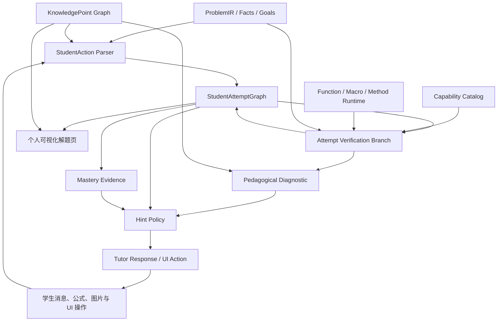

# 学生助教对话系统设计

## 1. 产品定义

学生助教不是一个根据标准答案讲题的聊天机器人，而是一个可验证的互动解题环境：

> 学生负责提出观察、猜想、变形和解题路线；系统负责理解、计算、验证并给出适量反馈；学生在不断修正中完成解题，系统从全过程判断其真正掌握了哪些知识点。

产品闭环为：

```text
学生表达
→ 机器理解
→ 数学验证
→ 教学反馈
→ 学生修正
→ 完成解题
→ 知识抽象与迁移
→ 更新掌握证据
```

核心产品判断是：**LLM 解题循环与学生学习循环共用同一套数学验证内核，但采用不同的输入协议、反馈策略和完成标准。**

## 2. LLM 解题循环与学生学习循环

当前 Functional Solver 的循环是：

```text
ProblemPlanningContext
→ LLM 提交 FunctionalPlan
→ schema / scope / binding / compiler 校验
→ Function 或 Macro lowering
→ Method runtime
→ typed diagnostic
→ LLM repair
→ verified execution
```

学生学习循环与之同构：

```text
StudentTutorContext
→ 学生提出自然语言、公式、草图或局部思路
→ 解析为 StudentAction / StudentClaim / StudentPlanDelta
→ 绑定题目实体、Fact、KnowledgePoint 与公开 Capability
→ 在学生尝试分支中进行数学验证
→ pedagogical diagnostic
→ 分级追问、提示、反例、可视化或局部纠错
→ 学生继续修改
→ verified StudentAttemptGraph
```

两者的对应关系如下：

| Functional Solver | 学生助教 |
| --- | --- |
| LLM 输出 FunctionalPlan | 学生说出一步思路或写出一步公式 |
| capability 与 typed binding | 系统理解学生想对哪些数学对象做什么 |
| Method 执行 | 系统验算学生当前一步 |
| typed diagnostic | 教学诊断：正确、缺条件、错误、绕远或表达不清 |
| retry prompt | 追问、提示、反例或局部纠错 |
| LLM 修改 Plan | 学生修改自己的思路 |
| verified execution | 学生自己的已验证解题图 |
| Goal complete | 解出题目并完成等号、定义域和答案检查 |
| — | 反思方法、迁移练习和 KnowledgePoint 掌握更新 |

## 3. 相同的验证内核，不同的反馈目标

对 Solver，首要目标是尽快得到一个合法、完整、可执行的 Plan。

对学生，首要目标是让学生在自己能够完成的范围内继续思考，并留下能够证明其掌握程度的学习证据。系统不能为了快速得到答案而静默替学生修复思路。

同一个内部诊断应投影成不同反馈。例如缺少正数条件时：

```text
Planner diagnostic：
参数 u、v 缺少 positivity proof，请修改 Plan。

Student feedback：
你准备对哪两个量使用基本不等式？它们一定都是正数吗？
```

因此需要独立的教学投影：

```text
FunctionalDiagnosticAuthority
→ PedagogicalDiagnosticProjector
→ HintPolicy
→ 学生可理解、符合 reveal boundary 的反馈
```

## 4. 核心原则

1. **学生拥有解题权**：系统验证和引导，不默认替学生生成完整解法。
2. **数学事实有唯一权威**：题面事实来自 ProblemIR；计算正确性来自 deterministic Method 和 verified execution；教学内容来自 KnowledgePoint 与教学投影。
3. **保留学生原意**：始终区分 `student_authored`、`system_interpreted` 和 `verified_meaning`。
4. **不静默修正歧义**：学生表达存在多种合理解释时先确认，不把错误或含混输入自动补成正确解法。
5. **反馈最小充分**：优先给能推动下一次独立思考的最小提示，不直接跨过尚未到达的 Goal。
6. **正确不等于最优**：合法但绕远的方法应被认可；系统可以比较认知成本和结构清晰度，但不能把非首选路线判错。
7. **解出不等于掌握**：最终答案只是证据之一；识别、前提、执行、解释、等号和迁移能力分别记录。
8. **对话不污染 Solver 权威**：学生尝试在独立 branch/context 中验证，不修改 canonical PlannerStateContext 或已发布课程事实。
9. **页面来自学生的可信路径**：只把学生已提出且通过验证的步骤编入个人解题页；系统补充内容必须标明为提示或讲解。
10. **所有反馈可追溯**：引用能够回到题面 Fact、KnowledgePoint、verified call、Lesson step 或 Visual role。

## 5. 总体架构


```mermaid
flowchart TD
    P["ProblemIR / Facts / Goals"]
    K["KnowledgePoint Graph"]
    C["Capability Catalog"]
    M["Function / Macro / Method Runtime"]
    U["学生消息、公式、图片与 UI 操作"]
    A["StudentAction Parser"]
    G["StudentAttemptGraph"]
    V["Attempt Verification Branch"]
    D["Pedagogical Diagnostic"]
    H["Hint Policy"]
    R["Tutor Response / UI Action"]
    E["Mastery Evidence"]
    L["个人可视化解题页"]

    U --> A
    P --> A
    K --> A
    A --> G
    G --> V
    C --> V
    M --> V
    P --> V
    V --> D
    K --> D
    D --> H
    G --> H
    E --> H
    H --> R
    R --> U
    V --> G
    G --> E
    G --> L
    K --> L
```

验证内核可以复用现有 Capability、compiler、Method 和 transaction 能力，但学生输入不应被强制直接书写为严格 `functional_plan/v2`。学生侧需要接受局部、自然和不完整表达的中间层。

## 6. StudentTutorContext

`StudentTutorContext` 是 Problem、Lesson、KnowledgePoint、verified execution 与会话状态的受限 projection。

至少包含：

- problem id、revision 与题目摘要；
- 当前 Goal 与允许推进的 Goal boundary；
- 当前可见 Entity、Fact 和 Condition；
- 已验证的学生步骤和当前开放分支；
- 已完成与尚未完成的 equality/domain obligations；
- 允许引用的 KnowledgePoint；
- 当前 Lesson/Visual roles 与 UI 状态；
- 学生最近消息与必要会话摘要；
- 已使用 hint level；
- 与本题相关的 mastery evidence 摘要；
- 用户偏好，例如“只提示不讲答案”。

不包含：

- 面向模型直接暴露的 expected answer 隐藏副本；
- 完整 Solver debug、内部 runtime path 或 typed identity；
- 不可见 sibling scope 的私有事实；
- 无关题目或其他学生数据；
- 可从 source refs 重建的完整历史 prompt；
- 未经过 reveal policy 的未来完整步骤。

课程、题目或 KnowledgePoint 版本变化时，旧会话不得静默绑定新事实。系统应校验 revision，迁移兼容摘要或开启新 session。

## 7. StudentAction 与学生表达 IR

学生输入不只是一条问句，可能是：

- 一个观察；
- 一个策略选择；
- 一步代数变形；
- 一条不等式或方程；
- 一个答案；
- 一个等号条件；
- 一张手写图；
- 对系统提示的质疑；
- 请求解释、比较方法或直接提示。

统一建模为 `StudentAction`：

```yaml
action_id: action-17
kind: propose_step

student_authored:
  text: "因为 x+2y=4，所以 xy 最大是 2"

system_interpreted:
  claim_kind: bound
  target: xy
  relation: "<="
  value: 2
  justification:
    capability_hint: fixed_sum_product_upper_bound
    operands: [x, 2y]
    fact_refs: [condition-x-plus-2y-equals-4]

verification:
  status: verified
  verified_meaning: "xy <= 2"
  evidence_refs: []
```

关键字段为：

- `student_authored`：学生真实表达，不可被覆盖；
- `system_interpreted`：系统对数学意图的结构化理解；
- `interpretation_confidence`：是否需要学生确认；
- `verification`：数学验证结果；
- `knowledge_point_refs`：这一步涉及的知识点；
- `pedagogical_status`：这一步在当前路线中的教学意义。

如果存在两个非等价解释，系统不得选择“最接近正确答案”的一个，而应先提问确认。

## 8. StudentAttemptGraph

对话不能只保存线性聊天记录。系统需要维护一个可分支、可撤回、可验证的 `StudentAttemptGraph`。

节点可以是：

- 题设 Fact；
- 学生观察；
- 学生猜想；
- 代数变形；
- Capability 调用意图；
- verified conclusion；
- 被反驳或撤回的 claim；
- 等号条件；
- 最终答案；
- 方法反思与迁移结论。

边表示：

- `depends_on`：数学依赖；
- `justified_by`：知识点或 verified evidence；
- `revises`：修改之前的学生步骤；
- `contradicts`：与题面或已验证结论冲突；
- `alternative_to`：另一条合法路线；
- `generalizes_to`：从本题抽象出的通用方法。

每个节点至少保存：

```yaml
student_text:
interpreted_claim:
scope_ref:
verification_status:
verified_outputs:
knowledge_point_refs:
diagnostic:
feedback_given:
hint_level:
domain_obligations:
equality_obligations:
source_refs:
```

错误节点不能被删除。它们是误区诊断和学习进步的重要证据，但不能进入最终已验证解题链。

## 9. 数学验证

### 9.1 验证边界

系统可以：

- 将学生明确提出的数学动作绑定到公开 Capability；
- 调用 deterministic evaluator 或 Method 验算等式、不等式、定义域和候选；
- 在隔离分支中执行学生提出的局部路线；
- 使用 typed diagnostic 定位失败角色和前提；
- 检查等号条件能否与题设同时成立；
- 比较两条已提出路线的数学等价性。

系统不可以：

- 为了判定当前步骤，静默求完整道题并把未来路线泄露给 Tutor LLM；
- 未经学生表达就把一个错误步骤改写成正确步骤；
- 使用 expected answer 反向猜学生意图；
- 根据字符串、对象名称或顺序猜 typed binding；
- 把学生的 provisional claim 提交为 canonical Solver StateVersion；
- 用自然语言 trace 代替 runtime authority。

### 9.2 尝试分支

每次需要执行数学能力时，从当前已验证学生图构造 disposable attempt branch：

```text
verified StudentAttemptGraph frontier
→ resolve student-authored refs
→ compile local capability call
→ run/check in isolated branch
→ project result or diagnostic
→ commit only to StudentAttemptGraph
```

“commit”只表示这一步成为学生解题图中的 verified node，不表示写入 canonical Solver Context。

### 9.3 等号与定义域账本

每次不等式、开方、除法、取倒数、平方或参数分支都会产生 obligation：

- 定义域条件；
- 正负条件；
- 非零条件；
- 放缩方向；
- 等号条件；
- 可达性条件。

这些 obligation 必须进入学生图。学生得到最终界但尚未关闭等号 obligation 时，状态应为“下界已证，极值未完成”，不能直接判定整题完成。

## 10. 教学诊断分类

学生的一步至少分为以下类型：

| 类型 | 含义 | 推荐反馈 |
| --- | --- | --- |
| `verified_progress` | 正确且推进当前 Goal | 简短确认，并把思考权交回学生 |
| `verified_incomplete` | 主要结论正确，但缺定义域、理由或等号条件 | 追问缺失 obligation |
| `verified_detour` | 数学正确但认知负担较高或暂时绕远 | 认可正确性，再邀请比较更直接结构 |
| `verified_irrelevant` | 正确但与当前 Goal 暂无有效依赖 | 说明其正确性，追问它如何服务目标 |
| `arithmetic_error` | 局部计算错误 | 定位第一个错误，不重做整段 |
| `algebraic_error` | 恒等变形、因式分解、通分等错误 | 指向失效变换并给最小反例或检查点 |
| `missing_precondition` | 未证明正数、非零、定义域或可见关系 | 追问使用公式需要哪些前提 |
| `bound_direction_error` | 倒数、负数乘除或单调传界方向错误 | 让学生比较简单数值或回忆符号规则 |
| `strategy_mismatch` | 方法不能控制当前目标量 | 引导识别目标依赖的核心量 |
| `equality_incompatible` | 多次放缩等号条件无法同时成立 | 展示冲突条件，但保留学生重新分组的机会 |
| `unsupported_claim` | 当前证据无法推出该结论 | 区分猜想与已证明结论 |
| `ambiguous_expression` | 无法唯一理解学生输入 | 明确列出少量解释并请求确认 |

教学诊断不是简单的正确/错误分类。一个正确但绕远的换元不能被标记为错误；一个数值正确但理由错误的步骤也不能被标记为完全掌握。

## 11. Hint Policy 与 reveal boundary

默认提示阶梯：

1. **状态确认**：复述学生已经正确得到的内容；
2. **观察性追问**：指向题目中的条件、图形或目标结构；
3. **方法性提示**：提醒相关 KnowledgePoint 或可用方法；
4. **关系框架**：给出带空位的关键关系；
5. **局部完整步骤**：展示当前卡点的完整推导；
6. **完整解法**：仅在学生明确请求、教学策略允许或多次尝试仍无法推进时提供。

示例：目标已化为 (2+5/(xy))。

```text
Level 1：要使这个式子最小，xy 应该变大还是变小？

Level 2：题设中的 x+2y=4 能否给出 xy 的范围？

Level 3：把 x 和 2y 看作基本不等式中的两个正项。

Level 4：(x+2y)/2 ≥ √(2xy)。

Level 5：4 ≥ 2√(2xy)，所以 xy≤2。
```

HintPolicy 应考虑：

- 学生当前 claim 与失败类型；
- 同一误区的尝试次数；
- 当前 KnowledgePoint 掌握状态；
- 学生是否明确请求更强提示；
- 年级、课程模式和教师配置；
- 是否即将跨越当前 Goal boundary；
- 之前的提示是否已经泄露某个关系。

## 12. KnowledgePoint 与掌握证据

KnowledgePoint 独立建模，作为数学语义和教学语义的事实源。它不等同于 Method，但与 Capability、Method、Recipe、Explanation 和 Visual 建立显式关联。

每个 KnowledgePoint 应支持三种 projection：

### Solver projection

- 适用前提；
- 目标类型；
- 可识别结构；
- 禁用条件；
- 关联公开 Capability。

### Lesson projection

- 公式与推导依据；
- 关键观察；
- 等号条件；
- 常见错误；
- 视觉角色和推荐组件。

### Tutor projection

- 诊断问题；
- hint ladder；
- 反例；
- 苏格拉底式追问；
- 掌握判据；
- 迁移问题。

### 掌握维度

同一知识点分别记录：

| 维度 | 证据示例 |
| --- | --- |
| 识别 | 主动发现题目中可以使用该知识点的结构 |
| 前提 | 主动检查定义域、正数、非零或实体关系 |
| 映射 | 正确把公式角色对应到本题对象 |
| 执行 | 独立完成变形和计算 |
| 解释 | 能说明为什么该方法成立 |
| 等号 | 能写出并联立等号条件 |
| 纠错 | 能根据反馈修正自己的错误 |
| 迁移 | 在不同表面结构的新题中独立使用 |

掌握状态不是一次作答后的布尔值，推荐使用：

```text
未观察到
→ 提示下识别
→ 独立识别
→ 提示下应用
→ 独立应用
→ 能解释
→ 能迁移
```

系统必须保存证据来源、题目难度、提示强度和时间。接受 Level 5 提示后做对，不能记为“独立掌握”。

## 13. 从学生解题图生成可视化页面

学生完成或暂时结束题目后，可以从 verified StudentAttemptGraph 生成个人解题页：

```text
verified student nodes
→ pedagogical grouping
→ ExplanationSnapshot projection
→ LessonIR / VisualStepIR
→ personalized lesson page
```

页面应区分：

- 学生独立完成的步骤；
- 在提示后完成的步骤；
- 系统提供的补充解释；
- 学生尝试但被验证为错误的分支；
- 与学生路线等价的更简洁方法；
- 尚未掌握、建议复习的 KnowledgePoint。

默认主线只展示学生最终认可且通过验证的解法。错误分支可以在“我的尝试”中回顾，但不能混入正式证明。

可视化不由 Tutor LLM 自由编写前端代码，而应由 KnowledgePoint/Method/Recipe 的稳定角色和 verified execution evidence 确定性生成。

## 14. 完题后的反思与迁移

Goal verified 后不立即结束会话。系统应进入 consolidation：

1. 让学生说明本题的关键观察；
2. 区分具体操作与可迁移方法；
3. 回顾等号、定义域和方向；
4. 比较学生路线与其他合法路线；
5. 给出一个表面不同、结构相同的迁移问题；
6. 根据迁移表现更新掌握证据。

例如基本不等式题可以追问：

```text
为什么先展开分子？
展开后出现了题设中的哪个结构？
为什么需要让 xy 最大？
公式中的两个正项分别是谁？
如果 x+2y=4 改成 x+3y=6，你会怎样处理？
```

## 15. 回答类型

```text
clarify_interpretation
acknowledge_progress
concept_explanation
observation_question
step_hint
error_diagnosis
counterexample
method_comparison
equality_check
evidence_reference
interaction_guidance
reflection_prompt
transfer_question
cannot_verify
cannot_answer
```

回答类型决定：

- 允许读取哪些事实；
- 最大 reveal level；
- 是否需要运行数学验证；
- 是否产生 UI action；
- 是否产生 mastery evidence。

## 16. 会话状态

会话至少保存：

- stable session id；
- problem/lesson/knowledge revision；
- 当前 Goal 与 reveal boundary；
- StudentAttemptGraph 引用；
- 当前 verified frontier；
- 开放的 domain/equality obligations；
- 消息摘要；
- 已使用 hint level；
- 误区与修正历史；
- 与本题相关的 mastery evidence；
- 显式用户偏好与教师策略。

完整原始消息可按隐私政策短期保存，但运行时 Context 应优先使用结构化状态与有界摘要，不能无限增长 prompt。

## 17. API

最小接口：

```text
POST /tutor/sessions
GET  /tutor/sessions/{id}
POST /tutor/sessions/{id}/messages
POST /tutor/sessions/{id}/actions
GET  /tutor/sessions/{id}/attempt-graph
GET  /tutor/sessions/{id}/mastery-evidence
POST /tutor/sessions/{id}/feedback
```

消息响应至少包括：

- response type；
- 文本与结构化数学内容；
- 对学生表达的解释摘要；
- verification status；
- source/evidence citations；
- 当前 Goal 与 reveal level；
- 可选 UI action；
- 可选 mastery evidence delta；
- safety/policy metadata。

当系统解释置信度不足时，响应必须是 `clarify_interpretation`，不能直接执行可能错误的学生意图。

## 18. UI actions

助教可建议受限动作：

- 跳到某 lesson 或学生步骤；
- 高亮某个题面条件或 visual role；
- 展示两个表达式的等价变形；
- 播放当前局部推导 beat；
- 展开定义域或等号 obligation；
- 对比两条已验证方法；
- 标记并回到某个错误分支；
- 重置局部互动；
- 打开个人可视化解题页。

客户端只执行白名单 action，不能执行模型生成的任意脚本。

## 19. 隐私、安全与教学边界

- 只保存完成教学服务所需的数据；
- 日志中避免原始个人信息；
- 学生表达、系统解释和 verified facts 分区保存；
- 不把一个学生的尝试、误区或掌握状态暴露给其他学生；
- 模型输出经过 schema、citation、math 和 UI-action validation；
- 防止学生文本被当作内部 prompt 指令；
- 对危险、不适当或无关请求提供课程内安全替代；
- 教师可配置 reveal policy，但不能降低数学验证要求；
- 系统不根据单次错误给学生贴永久能力标签；
- 自动掌握判断应可解释、可撤销并允许教师复核。

## 20. 质量指标

产品指标不能只看“是否得到最终答案”。至少包括：

### 数学质量

- 学生步骤解释准确率；
- verification precision/recall；
- typed evidence coverage；
- 错误定位到首个失效步骤的比例；
- 等号与定义域遗漏率；
- 错误步骤被误判为正确的比例。

### 教学质量

- hint appropriateness；
- 过早泄露答案比例；
- 学生在下一轮自行修正的成功率；
- 平均提示强度；
- 正确但非首选方法被错误否定的比例；
- 完题后方法复述成功率；
- 近迁移与远迁移成功率。

### 产品质量

- 有效对话轮数；
- 学生主动表达数学思路的比例；
- 中途放弃率；
- 个人解题页回看率；
- 延迟与 token 成本；
- 教师复核修改率；
- 学生对系统解释的纠正率。

## 21. 测试门禁

### 解析与绑定

- 同一学生表达的唯一解释；
- 多解释时必须澄清；
- 公式、自然语言与手写输入的一致 claim；
- 同名实体 role binding；
- sibling scope 不可见事实不泄漏；
- 不使用 expected answer 反推学生意图。

### 数学验证

- 正确步骤通过并生成 evidence；
- 局部错误定位到首个失效变换；
- 缺少正数、非零和定义域条件；
- 倒数与负数乘除方向；
- 多次不等式等号冲突；
- 下界已证但等号未闭合时不得完题；
- failed attempt 无 canonical state write。

### 教学策略

- 当前与未来 Goal reveal boundary；
- 多轮 hint progression；
- 正确但绕远路线的认可；
- 学生明确请求完整解答；
- 同一误区的递进反馈；
- 无证据时 `cannot_verify`；
- 完题后的反思与迁移。

### 状态、页面与安全

- session/problem/lesson/knowledge revision；
- StudentAttemptGraph 分支、撤回与恢复；
- mastery evidence 与 hint level 一致；
- 页面只消费 verified student nodes；
- citation 指向有效 source；
- UI action 白名单；
- prompt injection；
- 移动端上下文切换。

## 22. 分阶段落地

### Phase 1：已发布课程上的受控 Tutor

- 复用 Problem、Lesson、Explanation 和 Visual facts；
- 支持概念解释、逐级提示和局部 deterministic evaluator；
- 建立 reveal boundary、source citation 和基础会话状态。

### Phase 2：学生步骤验证

- 引入 StudentAction、StudentClaim 与 StudentAttemptGraph；
- 允许学生提交自然语言和公式步骤；
- 复用 Capability/Method 在隔离 branch 中验算；
- 上线 pedagogical diagnostic 与最小充分提示。

### Phase 3：学生路线驱动页面

- 从 verified StudentAttemptGraph 生成个人 Explanation/Lesson/Visual；
- 支持合法多方法、错误分支回顾和方法比较；
- 页面标记独立完成与提示后完成的步骤。

### Phase 4：掌握与迁移

- 建立 KnowledgePoint 多维 mastery evidence；
- 完题后自动生成反思与迁移任务；
- 支持教师复核、班级视图和长期学习路径。

## 23. Context 与现有系统集成

- `StudentTutorContext` 是 Problem/Lesson/Knowledge/Execution 的受限 projection，不复制完整 Planner Context。
- 学生尝试使用独立 attempt branch，不改变 canonical PlannerStateContext。
- 具名数学对象继续使用 canonical Entity/Fact identity；学生输入不创造新的权威题面事实。
- 数学验证复用 Function/Macro/Method typed contract；教学层不根据 trace 文本猜结论。
- `FunctionalDiagnosticAuthority` 可作为原始错误证据，但必须经过 `PedagogicalDiagnosticProjector` 才能面向学生。
- Explanation 和 Visual 只消费 verified、student-reachable attempt nodes 与稳定 KnowledgePoint 角色。
- Mastery evidence 引用 attempt/evidence/knowledge revision，不能只保存模型生成的自然语言评价。

## 24. 相关文档

- `docs/method-solver-architecture.md`
- `docs/functional-method-dsl-authoring-guide.md`
- `docs/capability-authoring-guide.md`
- `docs/llm-context-model-design.md`
- `docs/explanation-builder-design.md`
- `docs/visual-step-ir-design.md`
- `docs/inequality-visual-component-refactor-design.md`
- `docs/frontend-parallel-development-with-mock-api-plan.md`
