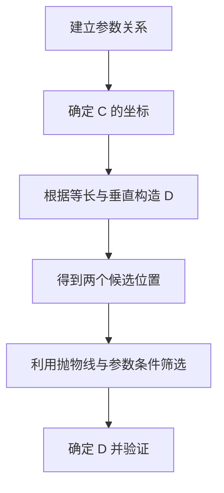
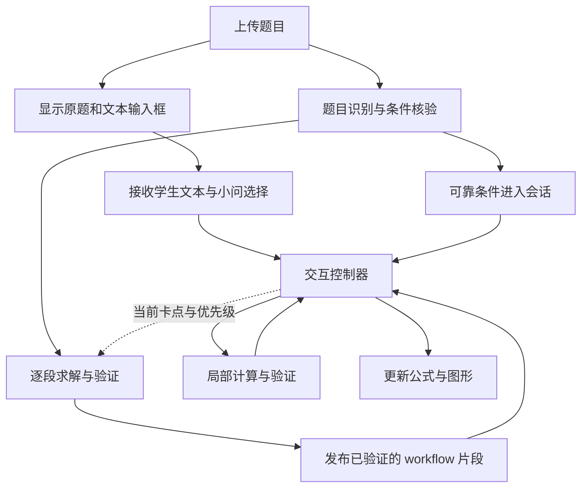
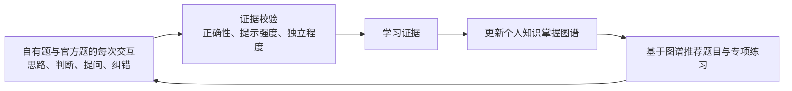

# 学生交互与个性化教学系统设计

状态：**目标设计，待实施**。更新日期：2026-09-25。

本文是学生解题交互的规范入口，覆盖自然语言文本思路输入（可使用系统语音输入法）、基础计算代办、受验证的解题 workflow，以及上传后的并行求解与交互。现有工作台仍是上传后生成解析网页；本文不表示这些交互能力已经实现，也不改变[系统路线图](functional-planner-next-stage-roadmap.md)的产品阶段顺序。

## 1. 产品目标与已确定原则

目标是帮助学生形成、检验和修正解题思路。学生负责方法选择与关键判断，系统执行基础计算，并通过公式、图形呈现结果。

当前阶段尚未引入知识图谱和学生长期记忆，仍然默认由系统承担基础计算；不要求先诊断每个学生是否掌握运算，再决定是否跳过。反复输入已经会的步骤，会降低思路训练的效率。

已确定的产品原则：

1. **学生先尝试，系统在需要时介入。** 尝试主要是表达思路，不要求逐步填写计算过程。
2. **首版只接收文本，鼓励自然口语表达。** 学生可打字或使用手机、电脑自带的语音输入法，检查转写后提交；系统不自行录音或实现语音识别，也不要求固定术语或完整公式。
3. **基础计算由系统执行。** 不把代入、展开、化简、解方程改造成必答填空或口述作业。
4. **一段思路可以推进多个节点，但不能跳过必经节点的完成条件。** 学生已经说清的判断不再重复追问；节点数不等于对话轮数。规定的思考顺序直接写进现有 workflow，不增加独立的教学框架层。
5. **引导围绕方法缺口。** 聚焦条件联系、方法选择、分类、验证、定义域和取等，不追求互动次数。
6. **数学进展由受验证的 workflow 管理。** LLM 理解意图、提出动作和组织反馈，程序依据数学证据提交状态。
7. **整题求解不阻塞所有交互。** 识别、后台求解、学生交互按依赖并行；workflow 分段验证、分段开放。
8. **本题会话状态先行，长期图谱后接。** 当前记录学生在本题表达了什么、获得了多少提示，不推断未经观察的长期掌握。

## 2. 当前页面与目标体验

讨论基于本地题目 `a47409a3-65c5-48ac-b732-db1882b199e4` 的解析页。当前页面顶部直接展示三问答案，后续完整展开 11 步讲解；第三问已有动点滑块，但构造方法和结论也已展示。

目标体验以“学生作出一次有价值的判断”为单位。原有解法、图形与讲解继续作为内容来源，由当前交互状态控制何时呈现。

| 当前区域 | 目标设计 |
| --- | --- |
| 题目卡中的答案标签 | 默认不提前揭示；对应目标完成或学生主动查看时显示 |
| 连续展开的完整讲解 | 当前目标、图形、文本输入框与简洁推理记录；完成的推理可回看 |
| 生成进度侧栏 | 准备期间呈现真实状态；交互开始后优先呈现已知条件、当前提示和未解决问题 |
| 步骤目录 | 按学习目标组织，允许选择小问、回看和切换已有合法分支 |
| 动点与动画 | 服务预测、探索、验证和解释；图形观察不自动成为证明 |

保留“给点提示”“查看本步讲解”“查看完整解析”入口，不强迫所有学生完成同样的问答。查看讲解与独立提出方法必须区分记录。

## 3. 学生判断与基础计算的边界

| 系统直接承担 | 学生主要负责 |
| --- | --- |
| 代入、展开、通分、化简、配方、解方程 | 选择哪个条件建立关系、希望得到什么 |
| 按已选方法求坐标、长度、参数 | 选择方法或构造，说明必要的依据 |
| 执行已明确的旋转等变换并求候选点 | 判断变换中心、角度、方向及是否需要分类 |
| 对候选进行代入并计算对应结果 | 决定检验条件、保留或排除的依据 |
| 按已建立的最值关系求数值 | 解释下界从何而来、取等是否可达 |

边界按数学含义划分。同一句话可能同时授权计算和筛选：学生已说“分别代回抛物线，结合 b 大于零筛选”，在 workflow 前置条件满足后，系统就连续完成这些动作，不再询问已经表达的依据。

同样，不能因为系统能自动求解，就把尚未由学生提出或由提示明确揭示的关键构造、分类和取等判断悄悄补齐，并记作学生独立完成。只报出一个方法名而关键对象或依据不明确时，针对缺口澄清；无需每一步都要求解释。

计算默认展示关键结果，可展开完整过程。系统代算不产生学生计算能力的正向掌握证据。若学生主动说错基础运算，系统可纠正并继续；方法选择错误则需要引导调整。

## 4. 代表性交互：第二问

题目条件：`a=2`，`A(-1,0)` 与 D 在抛物线 `y=ax²-bx+c` 上，C 为 y 轴交点，`AC=AD`、`∠CAD=90°`、`b>0`。

### 4.1 一次表达完整思路

学生提交的自然语言文本（可通过系统语音输入法转写）：

> 先用 A 求出 b、c 的关系，得到 C 的坐标。再把 AC 绕 A 正反转九十度，得到两个 D，分别代回抛物线，结合 b 大于零筛选。

系统理解成有依赖的动作序列，依次执行和验证：

1. 代入 A，得到 `c=-b-2`，因此 `C(0,-b-2)`。
2. 按已说明的两个旋转方向，得到 `D₁(-b-3,-1)`、`D₂(b+1,1)`。
3. 代回抛物线并结合 `b>0` 筛选，得到 `b=√2-1`、`D(√2,1)`。
4. 简洁展示推理与图形结果，保留计算展开入口。

这是一轮交互，可以跨越多个 workflow 节点。系统无需要求学生复述代入、旋转或筛选理由。

### 4.2 只表达了一部分思路

- “先把 A 代进去”：执行代入与化简，留下后续方法选择。
- “绕 A 转九十度”：执行明确的部分；方向不明时允许提出候选解释，必要时询问方向，不能把两个方向都算成学生已想到。
- 只找到了一个 D：提示“还有其他位置也满足这两个条件吗？”
- 已找到两个 D，不知道下一步：提示“题目中还有哪个条件可以用来检验？”
- 使用全等三角形而非旋转：验证其推理，若得到同样的候选位置，可汇入对应状态。

### 4.3 第三问中的图形用途

动点 N 可用于“先预测—拖动观察—提出猜想—转向证明”。学生已经明确方法且满足 workflow 前置条件时直接执行；未设为必经节点的探索环节不强制经历。

对于消去路径权重的困难，可依次提示“让两项系数相同”“√2 对应什么特殊三角形”，再揭示当前局部构造。提示后仍留给学生一个可完成的判断。拖动得到的近似最优位置不能替代下界与取等证明。

## 5. 解题 workflow 与状态模型

### 5.1 状态表示数学进展

状态记录已建立的事实、当前目标和待解决判断，不只记录“讲到第几步”。采用有前置条件、分支和汇合点的 workflow，支持多个可执行节点和动态接入经过验证的替代路径。


```mermaid
flowchart TD
    A[建立参数关系] --> B[确定 C 的坐标]
    B --> C[根据等长与垂直构造 D]
    C --> D[得到两个候选位置]
    D --> E[利用抛物线与参数条件筛选]
    E --> F[确定 D 并验证]
```

上图展示数学依赖；workflow 也可以直接规定必经思考环节，见第 5.5 节。这些依赖不等于必需的对话轮次。后台不必穷举所有解法，也不能按学生是否复述标准答案判断对错。

### 5.2 节点的最小语义

以下为目标契约，字段名与存储结构在实施时确定，不代表已有 schema。

| 内容 | 作用 |
| --- | --- |
| 节点标识、目标、版本 | 稳定引用当前数学任务 |
| 前置事实与依赖 | 限制可执行动作，引用题意与已验证结论 |
| 是否必经及通过依据 | 直接在节点中规定必须完成的思考环节；同一句话可满足多个节点，不要求逐节点问答 |
| 可接受的意图与参数 | 描述哪些数学操作可推进，避免只匹配关键词 |
| 系统计算动作 | 明确可代办的基础计算及输入输出 |
| 完成条件与证据引用 | 由验证结果确认完成，不能凭 LLM 的口头肯定 |
| 待完成义务 | 定义域、正负、分支、等号条件、边界可达性 |
| 提示阶梯与揭示边界 | 控制当前可以提供的方法帮助 |
| 图形与讲解绑定 | 引用稳定组件及经过验证的数学内容 |
| 后继与汇合条件 | 允许批量推进和替代方法汇合 |

方法级模板绑定本题实体、参数、目标和误区，形成题目实例，复用已有 Method/Capability 及教学视觉资产。

### 5.3 两类进度必须分离

| 维度 | 示例状态 | 含义 |
| --- | --- | --- |
| 后台准备状态 | 待求解、求解中、已验证、失败 | 节点是否已有可依赖的解法和内容 |
| 学生交互状态 | 未讨论、已提出思路、需要帮助、当前目标已达成 | 学生在本题推进到哪里 |

后台算出结果不会自动更新学生进度。交互还要记录关键判断的来源：学生主动提出、提示后提出、系统讲解或系统计算。目标达成不等于独立掌握。

### 5.4 未覆盖路径

学生的方法未命中模板时，进入验证流程，而非直接判错或强制返回主解法。LLM 可提出结构化局部路径；经实体绑定、前置条件和数学验证后，控制器才能接入分支或汇入已有状态。替代路径同样不能绕过规定的必经节点；方法正确但缺少必要的思考依据时，保留提议并先引导补齐，不将其判为数学错误。

无法验证时保留已成立的事实，明确需要核验，可澄清或在学生选择下转向已验证方法。不得把“工具暂不支持”表述成“方法错误”。

### 5.5 必经思考环节直接写入 workflow

例如基本不等式训练要求先观察数据结构，再据此选择方法，直接使用以下路径：

```text
观察结构（必经）→ 选择方法 → 系统计算 → 检查取等
```

“观察结构”的完成条件是：学生表达了与本题相关、正确的结构特征。只说“我观察过了”或只报方法名称，不能代替该节点需要的依据。固定的是必须先完成观察；学生可以提出不同的有效观察和后续方法，不要求复述唯一的标准句式。

| 学生表达或表现 | 处理方式 |
| --- | --- |
| “条件和目标交换 x、y 后都不变，所以用和与积换元” | 核验观察及方法适用性；成立时在同一轮依次完成观察和方法选择，继续计算，不重复追问 |
| “用和与积换元” | 保留方法提议，暂不执行换元，先问“你观察到什么，让你想到这个方法？” |
| 观察不出来 | 根据当前节点给提示，记录在帮助下完成；不把系统给出的观察记为学生独立发现 |

必经节点不要求额外一轮对话。学生一次表达已满足多个节点条件时，可以连续推进；缺少必经依据时，后续提议保持待执行，补齐后继续。学生主动查看讲解仍可使用原有入口，但查看不能自动满足学生完成该节点的条件。

此规则只使用现有节点的前置条件、完成依据、提示与来源记录，不另设“教学框架”系统，也不增加一套并行的状态控制器。

## 6. 运行职责与单轮流转

| 组件 | 职责 |
| --- | --- |
| 文本输入 | 接收学生明确提交的文字；打字和系统语音输入法共用一个入口，提交前可修改 |
| 交互 LLM | 理解意图、指代、依据和动作序列；提出下一步动作与提示建议；受约束地组织口语反馈 |
| 数学计算与验证 | 执行基础运算、检查方法前提和结论、生成数学证据 |
| Workflow 控制器 | 检查动作许可和依赖，提交状态变化，控制揭示、分支和任务账本 |
| 内容与图形呈现 | 将已允许展示的事实映射到稳定组件，显示意图理解和计算结果 |
| 会话记录 | 保存原始表达、解释、验证结果、提示来源、版本和待处理动作 |

```text
学生提交文本＋当前会话状态
→ 理解为一个或多个有依赖的动作提议
→ 检查指代、前置条件（含必经节点完成情况）、版本与执行权限
→ 按依赖执行计算和验证
→ 控制器提交已验证进展
→ 呈现结果，或只针对关键缺口提示
```

控制器是状态提交权威；交互 LLM 不通过自然语言直接写入事实或宣布通过。一次输入可以连续推进多个节点，遇到第一个未解决判断、未满足的必经节点、实质歧义或验证失败时停止依赖该处的后续动作，保留之前已验证的有效进展。后续方法提议可保留，待前置条件满足后执行。

始终区分学生原话、模型解释与已验证数学含义。最终答案用于核验，不用于反向猜测学生想说什么。存在会改变数学动作的非等价解释时先澄清；无影响的口语表达差异不必反复确认。

## 7. 文本思路交互与提示策略

### 7.1 首版输入体验与接口边界

主要入口为普通文本输入框，提示：

> 说说你的思路，不用写计算过程。可以使用键盘上的语音输入。

- 学生可打字，或自行启动手机、电脑的语音输入法；检查转写并明确提交后，系统才处理这一轮。
- 支持一次表达完整方法。输入法语音功能是否可用取决于学生设备；文本输入始终可用，页面不假设所有设备都有麦克风按钮。
- 不要求固定术语、规范句式或完整公式。例如“左右换一下好像没变，所以把它们的和设出来”，应结合题目理解；对象不明时只澄清实质歧义。
- 显示简短理解摘要，例如“代入 A，消去 c”，通常直接执行，不增加每轮确认按钮。
- 支持通过文本说“不是这个意思”“撤回刚才那一步”“换一种方法”“先做第二问”，并保留相应操作入口。
- 修改或撤回后回到合法状态，失效的依赖结果不继续展示为当前结论；保留可追溯记录。
- 系统采用简短文字、公式与图形反馈。首版不开发录音、麦克风权限、音频上传、流式语音识别、自动断句、语音播报或语音打断。
- 学生未提交不等于卡住；提示入口始终可用，不因沉默自动揭示下一步。

业务输入保持为“学生提交文本＋当前会话状态”，无需区分文字来自打字还是输入法。以后若引入原生语音，其识别结果接入同一文本入口，复用意图解析、workflow 和数学验证。连续语音的端点检测与打断届时另行设计，不预先增加首版依赖。

首版的已知限制是需要学生自行启动输入法、检查转写并提交，不提供连续语音对话。通过真实使用评估这些操作是否构成明显阻力，再决定是否增加原生语音能力。

### 7.2 引导触发

| 学生表现 | 系统动作 |
| --- | --- |
| 思路完整且成立，满足必经节点条件 | 执行并推进，不重复考察 |
| 思路成立但未说完 | 执行前置条件已满足的明确部分，给学生继续表达的空间 |
| 方法可能成立，但缺少必经节点要求的思考依据 | 保留方法提议，先引导补齐依据，不判为方法错误 |
| 缺少关键前提或分类 | 只针对缺口追问 |
| 方法不成立 | 展示局部矛盾或反例，帮助调整 |
| 主动求助 | 按当前节点提供逐级方法提示 |
| 只有方法名但语义不清 | 澄清必要对象、依据或操作 |

提示可从注意相关条件、联系结构、点出方法，逐步到局部构造和完整本步讲解。每一级受当前已验证路径和揭示边界约束。提示选择先使用本题尝试、已展示帮助和显式偏好；长期掌握数据未来可接入。

## 8. 上传后的并行处理

### 8.1 三条工作线按依赖启动


```mermaid
flowchart TD
    U[上传题目] --> S[显示原题和文本输入框]
    U --> X[题目识别与条件核验]
    S --> I[接收学生文本与小问选择]
    X --> P[逐段求解与验证]
    X --> L[可靠条件进入会话]
    P --> W[发布已验证的 workflow 片段]
    I --> T[交互控制器]
    L --> T
    W --> T
    T --> M[局部计算与验证]
    M --> T
    T --> V[更新公式与图形]
    T -. 当前卡点与优先级 .-> P
```

| 工作线 | 启动条件 | 可交付内容 |
| --- | --- | --- |
| 识别 | 上传完成 | 带可靠性与版本的题干、实体、条件、小问 |
| 后台求解 | 所需条件已可靠识别 | 分段验证的事实、路径、提示依据 |
| 学生交互 | 立即可接收输入；可靠条件就绪后可执行相关动作 | 思路理解、局部计算、方法提示与图形反馈 |

接收文本不等于已经能够判断全部内容。题意尚不可靠时保存输入和学生选择，不执行依赖未确认条件的数学动作。不要让学生通过复述整题来补偿后台等待；只确认影响当前讨论的识别歧义。

### 8.2 不等待最终答案也能推进

学生提出“代入 A”时，若 workflow 前置条件已满足，具备可靠的点坐标与函数关系即可局部执行；提出等长垂直的旋转构造时，可以局部验证构造并求坐标，不依赖整题最终答案。并行处理和局部执行同样遵守必经节点规则。

后台完整解法为后续引导提供保障，但不是所有学生动作的前置条件。已有解法只能通过已验证片段供前台使用，不能将未验证草稿当成提示依据。

### 8.3 优先级与依赖

- 当前学生所在小问及卡点优先于后续未讨论内容。
- 条件独立的小问可以并行求解；有依赖的步骤按顺序推进。
- 学生交互和局部计算优先获得服务资源，后台预计算并发需要限制，避免反而拖慢对话。
- 局部结论通过验证后，立即开放对应节点、公式和图形。
- 先加载固定交互页面，再填入题目与状态；完整解析页生成可在后台继续。
- 取消或降低不再需要的预计算优先级，复用当前题意版本下的有效结果，避免重复付费求解。

### 8.4 当前路径尚未就绪时

1. 学生有明确思路：优先局部验证，满足 workflow 前置条件后执行。
2. 学生需要提示且已有验证路径：提供对应帮助。
3. 学生需要提示但关键路径未验证：提高该卡点求解优先级，必要时说明“这一步我需要核验一下”。

不使用无关问题拖延，不要求基础计算来填补等待，不根据猜测编造引导。局部求解失败不抹掉此前已验证的进展。

## 9. 并行状态的一致性与恢复

以下为实施约束，具体事件和 API schema 待细化：

- 每个输入、计算任务、workflow 片段绑定题意修订、会话版本、路径版本和依赖事实。
- 后台结果先通过校验再发布；重复投递幂等，不重复展示或推进。
- 学生换小问、换方法或纠正指代后，晚到结果先检查兼容性。兼容时补充可用事实或路径，不能强制跳转当前焦点或揭示答案。
- 题意识别修订使前提失效时，只使相关依赖结果失效；不能静默混用两个题意版本。
- 后台准备进度与学生交互进度分别提交，后台完成事件不伪造学生学习证据。
- 输入框中的未提交草稿不触发数学动作。学生提交修正或撤回后，拒绝提交基于过期会话版本的动作；首版不接收音频流或输入法转写中间态。
- 撤回、重新解释与重试保留来源链，页面从权威快照恢复；网络重连不重复执行已完成动作。

版本与依赖处理复用[LLM Context 设计](llm-context-model-design.md)的原则；本文不声称现有系统已经支持实时 Tutor 的这些提交语义。

## 10. 数学证据、会话状态与呈现边界

事实权威分别为题意与已确认条件、数学运行时的验证结果、控制器提交的 workflow 状态。长期图谱未来影响教学展开程度，不能改变数学真值。

本题会话至少保存：题意和路径版本、已验证事实及来源、当前目标、节点准备和交互状态、最近输入及动作序列、未完成义务、提示及揭示记录、学生显式偏好、待处理任务和结果处理进度。

开方、除法、取倒数、放缩和参数分支产生的前置要求与取等任务进入义务账本。下界成立但取等未闭合时，不能宣布最小值问题完成。

页面使用稳定组件与白名单动作，例如高亮条件、更新公式、显示候选点、播放旋转、调整动点和呈现未完成义务。交互模型不生成并执行任意前端代码。后台已知答案只在对应教学状态允许或学生主动查看时呈现。

## 11. 五阶段实施计划与验收

第一个里程碑确定使用基本不等式 **q01（`inequality-basic-q01`，定和求积的最大值）**：设正实数 m、n 满足 m+n=2，求 mn 的最大值。通过文本完成“观察结构—应用基本不等式—验证取等”三个顺序节点，计算是节点内的系统动作。具体通过条件以[Q01 交互 Demo 讨论稿](q01-interaction-demo.md)为准。学生可使用系统语音输入法，不以原生语音能力为前置条件。第 4 节的二次函数例子保留为后续扩展场景。

以下五阶段属于学生交互子系统内部实施顺序，不等同于产品路线图的一期到四期。阶段 1–2 使用完整的已验证解法，阶段 3 接入新题 workflow 生成，阶段 4 再实现第 8–9 节的渐进式并行处理。各阶段的验收按支持范围实施，不要求第一个里程碑包含全部题型和并发场景。

### 阶段 1：单题最小交互闭环

- 人工配置 q01 的 workflow，包含最小节点定义、会话状态和确定性控制器；题号只用于题目实例和测试资产，控制器与意图解析不写 q01 专用分支。
- 文本输入、自然语言意图解析、真实计算与验证串联，支持一句话包含多个动作。
- 将观察结构设为必经节点；同一句话已提供依据时连续通过，缺失依据时保留后续方法提议并追问。
- 简单页面显示题目、输入框、当前思路和计算结果，优先复用已有呈现组件。
- 使用本题已验证的完整解法，不同时实现自动生成 workflow 或上传后并行求解。

**验收：** 学生能用自然语言文本完成本题思路讨论，不填写基础计算；只报方法会被引导补充观察依据，说清依据后不重复追问。不需要麦克风权限或系统自建语音服务。

#### q01 的节点与复用资产

Q01 固定沿用 LessonIR 的三个顺序节点。节点条件、默认可见的对话框、页面点选流程及独立的交互/展示组件声明见[Q01 交互 Demo](q01-interaction-demo.md)，本节不另行维护一份通过条件。Q01 同时接收点选和文本，交互配置与本节较早的文本闭环描述存在细节差异时，以该讨论稿为准。

首屏显示题目、第一节点的问题与方案选项，底部对话框默认可用；不预选正确方法，不提前揭示“定和求积”或答案。一次输入覆盖全部节点要求时可按序连续通过；只建立上界时，停留在验证取等节点。

已有资产作为实施起点：

- [冻结 ProblemIR](../server/tests/solver/fixtures/basic-inequality-problem-ir/v1/q01/problem-ir.json)：题意、条件和目标。
- [q01 已有求解计划](../internal/functional-plan-fixtures/basic-inequality-q01-stage4b.functional-plan.json)：复用 M11/M13 的计算、上界与取等验证；不把 expected answer 输入交互解析器。
- [已有讲解 fixture](../server/tests/solver/fixtures/lesson_scope_authoring_vnext/basic_inequality_q01/scope-content.json)与[页面内容](../internal/senior-high/lesson-specs/inequality-basic-q01/lesson-data.json)：复用结构对照、基本不等式推导和取等组件，按状态控制揭示。
- [既有求解与页面实施记录](basic-inequality-expression-method-implementation-plan.md)：已有求解/讲解能力的范围依据；交互接线及可复用程度仍须实施时验证。

交互状态机与现有三个 Lesson Step 对齐，不增加独立的方法选择、计算节点或 Runtime Method。Context、交互配置的具体字段及呈现方式继续在 Q01 讨论稿基础上细化。

### 阶段 2：引导、纠错与回退

- 处理思路不完整、方法错误、前提缺失、分类与取等遗漏。
- 支持主动求助与分级提示、文本歧义澄清、修改输入、撤回和换方法。
- 一段话中前半部分有效、后半部分失败时，保留有效进展，停止后续依赖动作。
- 支持少量已验证替代路径，未覆盖方法进入验证或明确待核验，不直接判错。
- 记录学生原话、系统解释、验证结果，以及独立提出、提示后完成和系统讲解的区别。
- 按交互需要联动已有公式、图形与提示组件，不另做通用图形编辑器。

**验收：** 错误输入不会导致错误推进，学生纠正后可以继续；帮助针对实际缺口。阶段结束即可小范围使用，收集表达理解、追问负担和输入体验反馈。

### 阶段 3：从单题配置扩展到新题生成

- 梳理已有 solver 的事实、依赖、计算结果和验证证据，明确可接入范围。
- 建立“已验证解题产物 → workflow 候选 → 结构与数学检查 → 可运行 workflow”的生成链。
- 方法模板绑定本题实体、条件和目标，补齐完成条件、提示依据与呈现内容。
- 检查路径可完成目标、必经节点不能绕过、定义域与取等等义务不遗漏。
- 从少量代表题扩展；不支持或生成失败时保留解析阅读入口，说明交互不可用。

**验收：** 支持范围内的新题无需逐题编写交互代码，可生成并实际运行经过验证的 workflow；生成 JSON 本身不算验收完成。本阶段同时确认 solver 能否输出可靠局部片段，为阶段 4 提供依据。

### 阶段 4：上传、求解与交互并行

- 上传后立即显示原题和文本输入框；可接收输入，可靠题意就绪后执行相关动作。
- 求解结果分段验证、workflow 分段开放，当前小问和卡点优先；独立任务才并行。
- 后台准备状态与学生交互状态独立维护，固定交互页面随状态更新，不等待完整解析页。
- 实现晚到结果、题意修订、路径切换、重复事件与断线恢复的版本检查。
- 对照串行基线测量有效讨论开始时间、阻塞时长和计算成本。

**验收：** 整题解法未完成时，学生已能基于可靠条件开展有效讨论；后台结果不能覆盖当前路径、绕过必经节点或提前展示答案。本阶段不依赖音频处理。

### 阶段 5：真实使用验证与稳定化

- 回放实际对话，改进自然口语、数学术语和指代的理解，减少方法误判、重复追问与过度提示。
- 验证连续文本对话、重连、刷新恢复及多轮修改后的状态一致性。
- 测量提交后响应时间、后台阻塞时间、模型和计算成本。
- 观察系统语音输入法的转写错误、修改负担与提交体验，再决定是否值得开发原生语音。
- 用撤掉提示后的独立尝试检验方法选择、关键条件和取等理解；学习效果反馈从阶段 2 开始收集。

**验收：** 在明确支持范围内形成可回放的正确性、体验与恢复验收结果，并据真实数据确定性能目标和后续语音投入。长期知识图谱、学生记忆和推荐仍为后续扩展，见第 13–14 节。

### 首版关键验收场景

1. 学生一次讲完整第二问方法，系统一轮执行完整序列，不要求基础计算或重复理由。
2. 学生只说代入 A，系统仅提交授权范围内的有效结果，不自动替他完成后续关键方法选择。
3. 学生漏掉另一旋转方向，系统针对分类缺口提示；两个方向已明确时不重复提问。
4. 合法替代方法可经过验证汇合；未知方法和数学错误得到不同反馈。
5. 含多个动作的输入中途失败，保留先前有效进展，后续依赖动作不执行。
6. 最终解法尚未完成时，可靠题意上的局部运算已可执行；输入可在识别期间接收。
7. 未验证后台草稿不产生数学事实或提前提示；晚到结果不覆盖当前路径或暴露答案。
8. 文本歧义、修改、撤回、重试、重连与题意修订不会重复推进或混用失效事实。
9. 下界与取等、系统计算与学生判断、提示后完成与独立完成分别记录。
10. 页面隐藏未来结论，但保留主动查看讲解入口；桌面与移动端教学语义一致。
11. 基本不等式 workflow 将观察结构设为必经：只报方法名称不能触发后续计算；系统保留提议并针对观察依据引导，不把缺少依据判成数学错误。
12. 学生同一句话正确说明结构与方法时，完成 Q01 观察节点；应用节点通过圈框点选或等效文本完成给定基本不等式模板的对象映射，文本明确时自动填入，不重复要求点击。系统展示定和替换与自动推导，取等节点仍需表达 m=n。一次覆盖多个节点要求时可连续通过；模板代入与独立表达分别记录，查看讲解不自动视为完成。
13. 替代路径、局部执行和并行后台结果都不能绕过必经节点；补齐依据后可继续处理已保留的方法提议。
14. 打字和系统语音输入法生成的文字共用提交入口；不要求固定术语或完整公式，未提交草稿不推进状态，首版不请求麦克风权限或接收音频。

以上是待实施验收要求，不是已运行通过的测试结果。

## 12. 评价指标与待定实施项

### 核心指标

- 从上传到可开始基于可靠题意有效讨论的时长。
- 从学生提交文本到有效反馈、计算结果和图形更新的时长，分别统计阶段延迟与 P50/P95；首版不声称能够测量系统输入法中的说话结束时刻。
- 通过使用反馈观察语音输入法转写错误、修改负担和提交阻力，不将输入法内部过程当作本系统已有遥测。
- 交互中因后台未准备好而阻塞的次数、时长及占比。
- 学生完整思路被一次正确理解和执行的比例。
- 不必要的重复追问、基础计算要求和提前答案揭示的比例。
- 方法缺口识别、状态转移、替代路径验证的准确性。
- 学生在撤掉提示后能否独立选择方法、解释分类与验证依据。
- 模型及计算成本、重复任务率、中断与恢复成功率。

整题求解时间仍需测量，但不能作为唯一体验指标；讨论中的“两分钟”是待改善的等待场景，不是已测得的稳定性能数据。首版不预先承诺具体秒数，需要基于真实文本交互、题目识别和求解链路确定目标。

### 待定项

- 自然口语文本中的数学实体、指代与歧义澄清策略。原生语音识别、播报、打断和端点检测不属于首版必交项，是否接入由实际使用反馈决定。
- 已有 solver 能暴露哪些局部计算与验证能力、何时能够产出首个可靠片段。
- workflow 模板、生成片段的验证门槛、替代路径接入范围。
- 会话事件、流式传输、任务优先级、版本提交与恢复接口。
- 提交文本与结构化证据的保存范围和期限；首版不接收或保存原始音频。未来若接入原生语音，再设计音频权限、处理和保存边界。

这些属于下一步实施设计，本文不锁定服务提供商，也不将方案描述为现有接口。

## 13. 后续阶段：学生长期知识图谱

本节与下一节保留长期规划，不是首版文本思路交互的运行依赖。系统代算不能作为学生计算能力的证据；未观察到的能力保持未知。

### 13.1 长期记忆不是聊天记录

聊天记录说明学生说过什么，但不能直接说明学生会什么。长期记忆应保存经过证据支持的认知状态：


```mermaid
flowchart LR
    A["自有题与官方题的每次交互<br/>思路、判断、提问、纠错"]
    V["证据校验<br/>正确性、提示强度、独立程度"]
    E["学习证据"]
    K["更新个人知识掌握图谱"]
    R["基于图谱推荐题目与专项练习"]

    A --> V --> E --> K
    K --> R --> A
```

原始对话可以按隐私政策短期保存，但不能把模型对对话的总结直接当成长期掌握结论。

### 13.2 图谱节点

节点可以包括：

- 知识概念：基本不等式、韦达定理；
- 方法：换元法、条件消元法、配齐次式；
- 操作：通分、因式分解、配方；
- 结构识别：定和、定积、对称结构、齐次结构；
- 必要检查：正数、非零、定义域、等号可达；
- 表征能力：能否从代数式映射到图形槽位；
- 误区：忽略前提、方向判断错误、只求出界而未验证取等。

### 13.3 图谱关系

- `prerequisite_of`：前置知识；
- `part_of`：属于某种方法；
- `used_by`：被题目或状态使用；
- `transfers_to`：可迁移到另一结构；
- `confused_with`：容易混淆；
- `evidenced_by`：由哪次学生行为提供证据；
- `remediated_by`：由哪个讲解状态修复。

### 13.4 掌握不是布尔值

每个知识节点至少记录：

```yaml
knowledge_point: symmetric_sum_product_substitution
mastery:
  recognition: 0.82
  prerequisite_check: 0.65
  mapping: 0.78
  execution: 0.74
  explanation: 0.48
  equality_check: 0.51
  transfer: 0.36
confidence: 0.77
last_evidence_at: 2026-09-04
stable_misconceptions:
  - only_checks_goal_not_condition
```

推荐的可解释阶段是：

```text
未观察到
→ 提示下识别
→ 独立识别
→ 提示下应用
→ 独立应用
→ 能解释
→ 能迁移
```

每条更新必须保留题目难度、状态节点、提示等级、学生独立程度、验证结果和时间。学生在完整提示后答对，不能记录为独立掌握。

### 13.5 每次交互后的图谱更新闭环

四期覆盖学生上传的题目与官方题目，两类交互证据归入同一学生的个人知识掌握图谱。
一次交互指系统接收并处理的一次业务输入及其结果，如作答、追问、提示请求或纠错；不按流式 token 更新。

```text
本次交互与对应题意/会话版本
→ 评估知识、方法、独立程度和误区证据
→ 增量更新个人掌握图谱及证据处理进度
→ 基于已提交图谱推荐题目与专项练习
→ 新交互继续更新同一学生图谱
```

每次交互都经过评估并记录结果，不等待会话结束或整题完成。无有效掌握证据时可保持原结论，
记录本次未改变结论的依据；单纯上传、阅读解析或无关表述不能推导掌握，也不能强行改变分数。
更新记录关联学生、交互、题目修订、证据、图谱版本及评估规则版本，可追溯前后变化。
同一交互重复投递只处理一次；同一学生多会话并发采用版本检查或顺序提交，失败更新可恢复，不能静默丢失或覆盖。
推荐基于已提交的图谱版本，说明目标薄弱知识与前置要求；专项练习围绕目标组织题目，练习结果继续作为更新证据。
推荐候选必须经过题目发布/授权检查，个人状态不改变共享知识定义或题目事实。

验收包含自有题/官方题证据汇合、每次交互更新、无新证据时保留结论、重复交互幂等、并发更新与失败恢复，
以及推荐及专项练习能追溯到个人图谱版本和对应知识缺口。具体模型、掌握算法与组题策略在四期细化。

## 14. 后续阶段：题目图与学生图的差分

### 14.1 不是简单的会与不会相减

设当前题目路径需要的知识节点集合为 `R`，学生知识图谱为 `K`。教学差分可以表示为：

```text
Gap(problem, student)
= 当前路径需要、但学生掌握度或证据置信度不足的节点
+ 这些节点尚未掌握的必要前置节点
```

差分结果不能只输出“缺少哪些知识点”，还要生成教学参数：

- 从哪个状态进入；
- 哪些状态可以略过；
- 哪些观察必须展开；
- 默认从第几级提示开始；
- 优先使用公式、图形还是语言说明；
- 哪些误区需要主动检查；
- 完题后需要哪一道迁移题确认掌握。

### 14.2 同一道题的不同讲解

题目路径需要：

```text
识别对称结构
→ 用和与积换元
→ 应用基本不等式消元
→ 验证取等
```

三名学生可以得到不同的路径投影：

| 学生状态 | 本次路径 |
| --- | --- |
| 不会识别对称 | 从交换变量开始，完整展示结构识别 |
| 已会识别但不会和积换元 | 略过交换演示，从 `s=x+y, p=xy` 的映射开始 |
| 能独立求界但常漏等号 | 前两段压缩，只展开边界与取等验证 |

题目的数学主路径没有改变，改变的是学生进入路径的位置和每个状态的展开程度。

### 14.3 差分计算的更新时机

- 开始一道新题时；
- 学生在关键诊断状态产生新证据时；
- 学生明确要求更详细或更简洁时；
- 长时间间隔后重新学习同一知识点时；
- 课程或知识图谱版本发生变化时。

个人知识掌握图谱仍在每次交互后执行更新评估；教学路径不必因此每句话都完全重规划，
只更新受当前证据影响的局部教学参数，避免讲解来回跳动。图谱更新与教学路径调整是两个不同操作。

## 15. 数据与教育边界

- 学生表达、模型解释、数学证据及长期掌握判断分别保存，模型文本不直接成为能力标签。
- 不以一次错误、看过解析或系统代算判断学生掌握；没有证据的维度保留未知。
- 证据关联题目修订、提示程度和独立程度，可追溯、可纠正。
- 学生输入不能更改控制器规则；不同学生的会话和图谱相互隔离。
- 首版只处理提交文本和必要会话信息，不采集音频；个人信息与结构化证据分开管理，只保留教学所需数据。
- 后续接入教师、家长和学生证据视图时，权限和可见范围需另行设计。

## 16. 相关文档

- [系统路线图](functional-planner-next-stage-roadmap.md)
- [工作台首版设计](workspace-product-design.md)
- [Solver 架构](method-solver-architecture.md)
- [Method DSL 编写规范](functional-method-dsl-authoring-guide.md)
- [Capability 编写规范](capability-authoring-guide.md)
- [LLM Context 设计](llm-context-model-design.md)
- [讲解构建](explanation-builder-design.md)
- [视觉步骤 IR](visual-step-ir-design.md)
- [教学 Scope 与视觉动画](teaching-scope-student-visual-animation-design.md)
- [不等式视觉组件重构](inequality-visual-component-refactor-design.md)
- [前端并行开发与接口合同](frontend-parallel-development-with-mock-api-plan.md)
