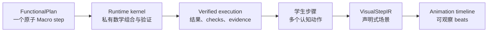
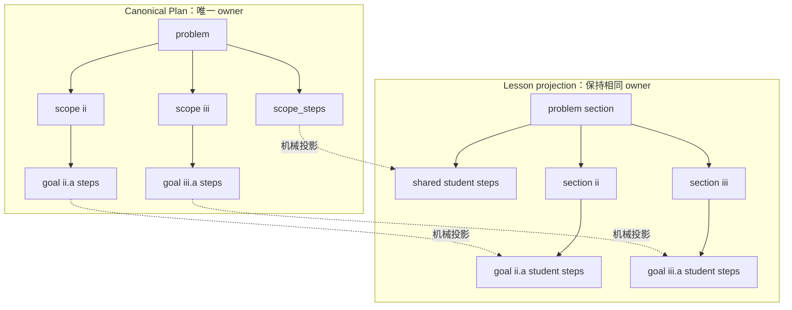
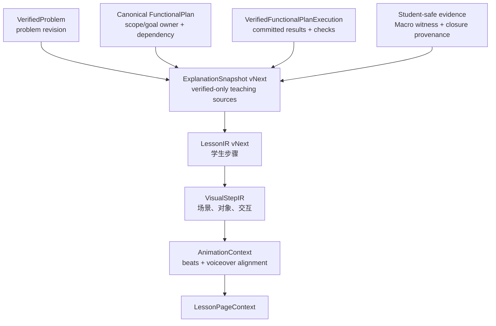
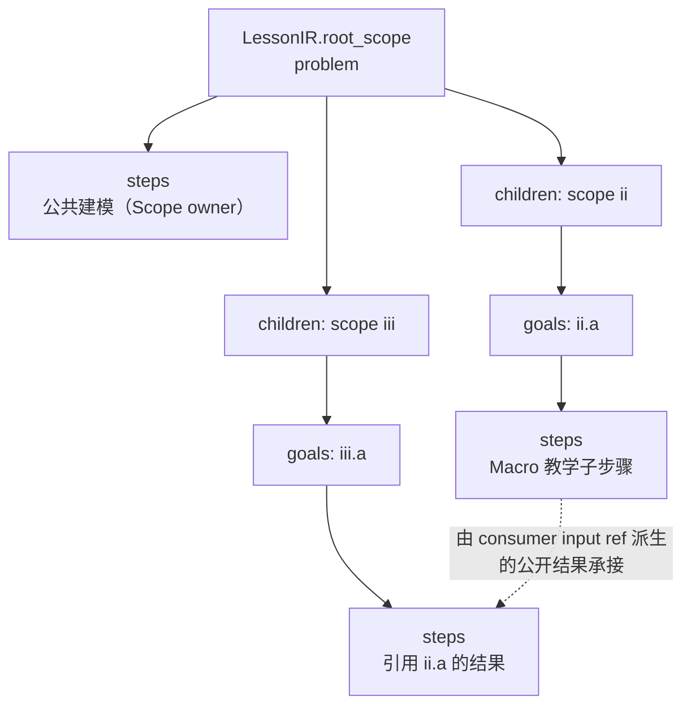
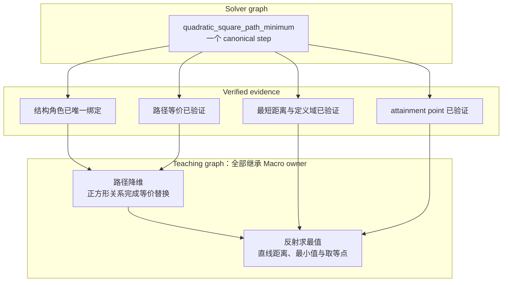
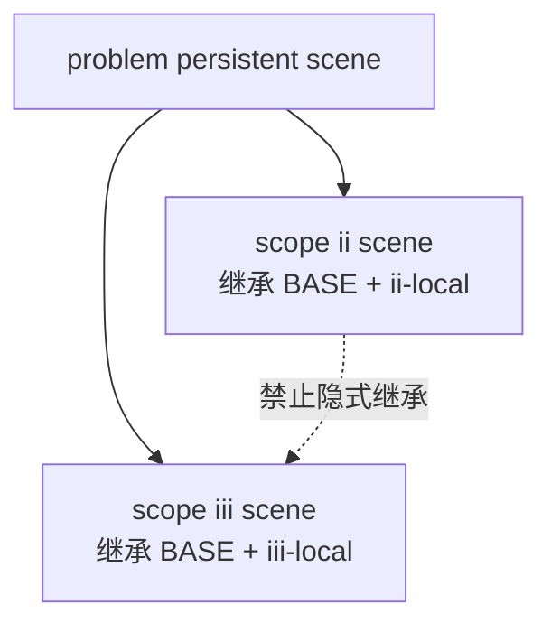
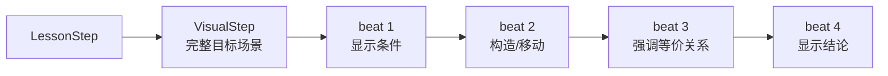

# F5-F5 Teaching Scope、学生步骤、可视化与动画设计

状态：`IMPLEMENTATION`。`F5-F5A COMPLETE`；`F5-F5B0 COMPLETE`；`F5-F5B1 COMPLETE`；
`F5-F5B2 COMPLETE`；`F5-F5B3 COMPLETE`；`F5-F5B4/B4V COMPLETE`；
`F5-F5C0 COMPLETE`；`F5-F5C1 PENDING ACCEPTANCE`；`G3 NEXT`。

2026-09-09 优先级调整：以[真实上传与变更重建计划](online-service-development-plan.md#11-实施顺序)
为当前执行顺序。G1 的 LLM 视觉选择仅保留候选设计，本文涉及 `available_visuals` 和 LLM
组件选择的合同只适用于未来可选 G1，不是当前生产 wire。G2 新动画及配音延后；
已有图形、滑块与最短路径交互仍须通过门禁。C1 质量验收保留，但不阻塞 G3 接线。

本文是 F5-F5 以及后续 Track G 教学链的统一规范入口。它定义：如何从
`VerifiedFunctionalPlanExecution` 生成学生可见步骤，如何继续生成 `VisualStepIR` 与动画
timeline，以及三层之间的身份、Scope、证据和版本边界。

详细的文字生成与视觉组件合同仍分别见：

- [Lesson Scope LLM Authoring vNext 设计与分阶段实现](lesson-scope-llm-authoring-vnext-design.md)；
- [Explanation Builder 设计](explanation-builder-design.md)；
- [VisualStepIR 设计](visual-step-ir-design.md)；
- [LLM Context 模型](llm-context-model-design.md)。

本文不改变 FunctionalPlan 或 Scope Retry wire。F5-F5B 的 LLM-facing Annotated Teaching Plan、
Scope Lesson body、一次调用 visual selection、无 semantic retry 以及和平二模纵向冒烟计划，
以 vNext 设计文档为详细合同；本文保留端到端 Scope/Visual/Animation 总边界。

## 1. 背景

F5-F4.3 已将路径最值能力收敛为原子 Macro。Planner 只需要选择公开能力和参数；降维、
候选搜索、几何变换、取等验证和 clean replay 留在 runtime kernel 内部。

这使求解图变得稳定，但求解粒度不再等于教学粒度：一个原子 Macro 在 FunctionalPlan 中
必须是一个 step，在学生讲解中却可能需要拆成多个认知动作。



F5-F5 的任务不是重新展开 Solver Plan，而是建立从 verified execution 到学生步骤的单向、
可追溯 projection。后续 Track G 在相同身份与 provenance 上继续生成视觉和动画产物。

## 2. 核心决定

### 2.1 Canonical Scope 树是唯一教学归属权威

Canonical FunctionalPlan 已经明确保存：

- Scope 的父子嵌套；
- `scope_steps` 的直接 owner Scope；
- 每个 Goal 的直接 owner Scope；
- Goal-local step 的直接 owner Goal；
-跨 Scope 的 `StepResultRef` 依赖。

因此不再建立独立的 `semantic_owner_scope_id`，也不从 `execution_scope_id`、consumer、最终
answer 或实际值反推教学归属。

```text
teaching owner scope = canonical step container 的 scope_ref
teaching owner goal  = canonical step container 的 goal_ref（若为 Goal-local）
```

`execution_scope_id` 只描述物理执行位置、visibility 和 restore placement，不进入教学
ownership 决策。

### 2.2 Teaching scope 不是第二棵可编辑 Scope 树

Teaching scope 是 Canonical Scope 树的只读投影：



代码可以在一个 source step 内生成多个 teaching substep，但这些 substep 全部继承 source
step 的 Scope/Goal owner，不能移动到 sibling、ancestor 或 consumer Scope。

### 2.3 三张图相互独立

系统同时存在三张有向图：

| 图 | 解决的问题 | 节点 | 是否可由 LLM 改写 |
| --- | --- | --- | --- |
| Solver graph | 怎样正确求出答案 | Function/Macro step | Pass 1/Retry 只编辑公开 Plan |
| Teaching graph | 学生按什么认知顺序理解 | Lesson step/substep | 仅可选择粒度和措辞 |
| Visual/animation graph | 每一步看到什么变化 | scene object/beat | 仅可选择已注册视觉意图 |

Teaching 或 Visual 节点永远不能反向生成、替换或修改 Solver step。

## 3. 总数据链



每条边都是单向 projection。下游可以报告 gap，但不能回写上游数学状态。

## 4. F5-F5 输入边界

### 4.1 必需输入

- accepted `VerifiedProblem` 与 revision/hash；
-最终 committed Canonical FunctionalPlan；
- `VerifiedFunctionalPlanExecution`；
- canonical step owner 与跨 Scope dependency；
-实际 materialized public runtime results；
- verified checks 与 answer producer；
-经过专用 projector 审计的 Macro evidence（若该 step 产生 evidence）。

F5-F5A 不再读取 transaction replay、StateVersion write 或 method trace fragment。closure 的
学生化拆分属于 F5-F5B；在拥有 verified public evidence projector 前，不得从旧 trace
补造 closure 教学事实。

### 4.2 禁止输入

- failed、blocked、not-run step；
- provisional transaction state；
- retry 中已被替换的旧 candidate Plan；
- shadow candidate、loser 或 dead-pruned branch；
- expected answer；
- provider thinking 或 Planner reason；
- runtime path、StateVersion 内部序列化、checkpoint handle；
- Macro synthetic `PointRef`、`PathTransformation` 或 kernel-only candidate；
-通过解析 debug 文本恢复的数学事实。

缺少任一必需 authority 时必须 fail loud，不从 transitional replay 或旧 SolverResult debug
字段补数据。

这里的“禁止输入”约束不禁止本地 harness 保存 provider 原样返回的 reasoning debug。
reasoning 只能按 transport attempt 写入独立、ignored 的 debug artifact，并记录 hash 与
capture completeness；任何教学 projector、Prompt、validator、rubric、LessonIR、VisualIR
和页面编译器都不得读取该文件。

## 5. ExplanationSnapshot vNext

F5-F5 复用 `ExplanationSnapshot` 作为学生链的唯一事实入口，不新增独立 Teaching Plan。
Snapshot 需要从当前的 flat execution/presentation view 收敛为 Canonical owner projection。

目标结构：

```text
ExplanationSnapshot
├── problem_id
├── problem_revision
├── canonical_plan_hash
├── verified_execution_hash
├── root_scope                         # Canonical Scope tree 的只读投影
│   ├── scope_ref
│   ├── steps[]                        # 原 Canonical scope_steps，内联 TeachingSource
│   ├── goals{goal_ref}
│   │   ├── steps[]                    # 原 Goal steps，内联 TeachingSource
│   │   └── answer_from                # 原 Canonical Goal answer contract
│   └── children[]
├── evidence{}
└── answers{}

TeachingSource
├── source_step_id
├── capability_id
├── inputs{}                           # 精确 ref + verified runtime value/display
├── output_targets{}
├── intent?
├── outputs{}
├── calculations[]                    # projector 生成的学生可读 evidence 内容
└── checks[]
```

该 `root_scope` 不是第二份 authority：构建时从 Canonical Plan 机械复制，并保存
`canonical_plan_hash`；hydrate 时重新验证 owner、顺序和 hash。TeachingSource 不重复保存
owner Scope/Goal，其嵌套容器就是 owner。需要按 `source_step_id` 查询时，只能从树派生
临时 `teaching_source_by_id`。

教学层的 Scope 和 Goal 容器统一使用 `steps[]`，元素都是 TeachingSource。
`Canonical Scope.scope_steps` 只在投影边界机械映射到 `Teaching Scope.steps`；不在
Snapshot 内继续传播两套 Step 名称。

F5-F5B 的目标持久化协议升级为 `explanation-snapshot/v3`，直接删除
`TeachingCrossScopeReference`、顶层 `cross_scope_references` 及其 builder/validator。v3 不读取
或双写 v2 artifact，也不保留 debug sidecar；consumer 的精确依赖全部内联在
`TeachingSource.input_refs`。`effective_steps`、`fact_index` 和原子的 `teaching_trace` 也随旧
Lesson/Visual 主链一起删除，不参与 v3 Snapshot JSON、hash 或 hydrate authority。

### 5.1 删除的兼容概念

- `StudentStepPlacement.execution_scope_id`；
-通过 source/consumer/terminal Scope 推断 `presentation_scope_id`；
- verified execution 缺失时，从最终 transactional call result 收集 Macro witness；
-由 method 名、call 顺序或 runtime path 猜 owner；
-将同值 result 合并为同一 teaching source。
- 独立持久化 `TeachingCrossScopeReference/cross_scope_references`；
- 为旧 `explanation-snapshot/v2` 提供兼容读取或双写。

### 5.2 跨 Scope 消费的内联表示

跨 Scope 消费不增加顶层 reference collection，也不转移 producer ownership。Scope 树表示
owner/visibility，consumer 的对应输入直接携带精确引用：

```json
{
  "input_refs": {
    "parabola": {
      "kind": "step_result",
      "step_id": "derive_parabola_i",
      "return": "parabola"
    }
  }
}
```

该引用由 `VerifiedFunctionalPlanExecution/v2` 中的两层 authority 在 Snapshot 构建时确定：

- `dependency_graph` 精确确定 producer step 与 consumer step，并与 checkpoint 的
  `execution_graph_signature` 核对；
- `public_result_dependencies` 从同一 reconciliation 的 typed state/input authority 机械生成，
  精确确定该输入消费的 producer public return，并由最终 execution signature 覆盖。

Canonical Plan 中命名结果会规范化成 SourceRef，因此不能要求它始终保留显式
`StepResultRef`。SnapshotBuilder 必须在构建时把这类消费解析成精确的 per-input `ref`；不得按
字符串、return 名、`output_targets`、Scope depth 或 authored order 猜 producer。任何跨 Scope
dependency 缺少精确 public-result authority 时必须 fail loud。

下游若需要 dependency edge，只能从：

```text
consumer 所在 Scope + consumer.input_refs + producer 所在 Scope
    → 临时派生 dependency edge
```

该派生 index 不持久化、不进入 LLM Schema，也不进入 LessonIR。

学生展示由代码生成稳定提示，例如“由第 ii 问结果可得”，不复制执行，也不重新讲解同一
producer。ancestor shared step 留在 ancestor section；child 与 sibling 只引用。

## 6. 学生步骤设计

### 6.1 LessonIR 的 owner 结构

LessonIR 必须与 Canonical Plan、ExplanationSnapshot 一样保存真正递归的 Scope 树。不能用
`sections[] + parent_scope_ref + child_scope_refs[]` 模拟树，也不能持久化一份脱离容器的
flat `steps[]`：

```text
LessonIR
├── problem_id
├── problem_revision
├── source_snapshot_hash
├── root_scope
│   ├── scope_ref
│   ├── title
│   ├── steps[]                        # LessonStep; owner = current Scope
│   │   └── LessonStep
│   ├── goals{goal_ref}
│   │   ├── title
│   │   └── steps[]                    # 同一 LessonStep; owner = current Goal
│   │       └── LessonStep
│   └── children[]                     # 递归 LessonScope

LessonStep
├── lesson_step_id
├── source_step_ids[]
├── teaching_substep_ids[]
├── title / goal / derive / box
└── visuals[]                           # validated visual_id + supported mode
```

LessonStep 不再重复保存 `owner_scope_ref` / `owner_goal_ref`；Scope 容器的 `steps`
与 `goals{goal_ref}.steps` 容器使用同一 Step Schema，容器路径就是唯一 owner。Scope
层次和 Goal keys 由代码从 Snapshot 机械复制，LLM 不填写、不移动、不新增。

当前 `LessonIR.sections + LessonIR.steps` 是待退役的 flat compatibility view。若 builder、
validator 或前端需要按 ID 查询，可以从 `root_scope` 在内存中派生：

```text
lesson_step_by_id
lesson_step_owner_by_id
scope_by_ref
goal_by_ref
preorder_step_ids
```

这些 index 不写入 LessonIR、不参与 LLM Schema，也不能成为 hydrate authority。

### 6.2 嵌套结构示例



### 6.3 一个 source step 到学生步骤的映射

允许以下关系：

- 普通 Function：通常 `1 source step → 1 lesson step`；
-机械代入：可与同 owner、同 Goal、紧邻的前一步合并；
- symbolic closure companion returns：按同一 closure signature 合并一次；
-原子 Macro：`1 source step → 1..N teaching substeps`；
-纯基础设施、cache 或内部 prep：不生成学生步骤。

禁止：

-跨 Scope 合并；
-跨 Goal 合并；
-将 consumer 归入 producer Scope；
-将未验证的 trace fragment写成推导；
-因标题相似或公式值相同而合并；
-让 LLM 创建新的 source step/evidence ref。

### 6.4 稳定 ID

学生步骤 ID 由代码确定：

```text
普通步骤：teach:{source_step_id}
Macro 材料步骤：teach:{source_step_id}:{internal_unit_key}
合并步骤：teach:group:{stable internal-material-span signature}
```

显示标题、导航标题和措辞变化不改变 ID。ID 的输入必须包含 source refs，以及从容器读取
的 owner Scope/Goal，不包含 LLM 文本。这些 ID 全部由代码注入，不进入 LLM prompt 或
response；LLM 只返回同容器局部 `source_steps` 编号。

### 6.5 LLM 权限

LLM 可以：

-在代码给定的 teaching candidates 中选择粒度；
-参考已经绑定本题 runtime 数据的 title/nav_title/goal/derive/conclusions，并结合完整
  verified calculations 输出最终学生文案；
-自行合并同一 Scope/Goal 中 canonical-contiguous teaching materials；

LLM 不可以：

-修改 owner Scope/Goal；
-发明未出现在 verified inputs/outputs/calculations 中的公式、数值或对象 identity；
-修改 answer producer；
-增加不存在的推导、条件或 equality witness；
-让 `source_steps` 重复、逆序、越界或遗漏多个 teaching materials；单个遗漏只由代码窄兜底；
-生成坐标、runtime handle、HTML、CSS 或 JavaScript；
-改变 source/evidence refs；
-填写 visual selection、role binding、geometry ref、interaction formula 或 animation beat。

## 7. 原子 Macro 的教学展开

Method 可选的单个 `TeachingUnitSpec`、单一推导 Macro 或当前已选 Variant 的有序
`TeachingUnitSpec[]` 描述认知结构；未声明时代码生成一个 default unit。verified evidence
填充当前题的数学事实。两者缺一不可：unit 的 title/nav_title/goal/derive/box templates 提供
建议讲法，但不能证明当前题；evidence 提供真实数学数据，但不独自决定教学语言。代码先绑定
二者，形成带具体公式和对象的 `∵/∴` suggested draft，再交给 LLM。unit key/ID 只属于
代码内部 authority，不投影给 LLM。

若 Macro 存在多个内部 candidates，但学生证明相同，仍共用一套 TeachingUnitSpec。只有
interior/boundary/Piecewise 等学生推导真正不同的 verified public derivation，才声明内部
`TeachingVariantSpec[]`。Runtime typed evidence 唯一选择实际 Variant；LLM 只收到 winner
units 绑定后的材料，不看到 teaching_case、variant key、失败候选或其他 Variant。Piecewise
结果使用包含全部必讲分支的 composite Variant，不能只投影其中一支。

以 `quadratic_square_path_minimum` 为例：



教学 evidence 只能使用 student-safe 公共表示。Kernel helper 名、synthetic auxiliary、
private runtime type 和内部 search candidate 不得出现在 Snapshot、LessonIR、VisualStepIR
或 timeline 中。

## 8. 可视化设计

### 8.1 VisualStepIR 的位置

VisualStepIR 只消费：

- ProblemIR 中的公开几何对象和条件；
- ExplanationSnapshot 的 student-safe values/evidence；
- LessonIR 的稳定 lesson step ID、owner 和 visual intent；
-前一视觉步骤显式保留的 scene state。

它不调用 Solver，不重新求值，不从 label、method 名或 DOM 状态猜对象。

MethodVisualSpec 与 Macro TeachingUnitSpec 对应的 visual metadata 声明可用语义组件和
deterministic default；代码先用 verified evidence 唯一绑定角色，只把成功候选作为
`available_visuals` 提供给同一次 Lesson LLM。
LLM 只选择 `visual_id/mode`，VisualStepIR builder 再从内部 bound candidate envelope
确定性渲染。LLM 不接触组件参数，也不在 LessonIR 后增加第二次 Visual LLM 调用。

### 8.2 一个学生步骤对应一个视觉状态变更

每个 LessonStep 必须明确三种模式之一：

```text
visual_mode = scene       # 产生或更新 VisualStep
visual_mode = retain      # 保留前一显式场景，仅更新文字/强调
visual_mode = none        # 该认知步骤不需要图形，必须显式声明
```

不能因为 builder 没找到模板就静默省略视觉；无法表达时生成结构化 `VisualGap`。

### 8.3 VisualStep 最小合同

VisualStepIR 也必须镜像 LessonIR 的递归 Scope/Goal 树。否则把 LessonIR 展平后再保存视觉
步骤，会重新引入 owner 推断：

```text
VisualStepIR
├── problem_id
├── source_lesson_hash
└── root_scope
    ├── scope_ref
    ├── steps[]                        # VisualStep; owner = current Scope
    │   └── VisualStep
    ├── goals{goal_ref}.steps[]        # 同一 VisualStep; owner = current Goal
    │   └── VisualStep
    └── children[]                     # 递归 VisualScope
```

允许在内存中构建 `visual_step_by_id`，但不持久化第二份 flat ownership map。

```text
VisualStep
├── visual_step_id
├── lesson_step_id
├── source_refs[]
├── scene_objects[]
├── role_bindings[]
├── visibility_changes[]
├── annotations[]
├── interactions[]
├── retained_from_visual_step_id?
└── timeline_intent?
```

`visual_step_id` 从 `lesson_step_id` 确定性派生。VisualStep 所在的递归容器必须与源
LessonStep 容器相同；视觉对象使用公开 semantic source identity，页面内 visual ID 不能
替代数学对象 identity。

### 8.4 Scope 与场景继承

- child Scope 可以继承 ancestor 的题面基础图形；
- sibling Scope 不继承彼此的 step-local 或 interaction-local 状态；
- shared Scope 的视觉结论保留在 shared section，consumer 只显式引用；
-进入 child、返回 parent 或切换 sibling 时，retain/update/remove 必须显式；
- DOM 中残留的对象不构成 scene state。



### 8.5 Role binding

视觉角色由 `source identity + teaching evidence + registered role contract` 唯一绑定，例如：

- moving point；
- fixed endpoint；
- transformed/equivalent public construction；
- candidate set 中被验证的 selected point；
- minimum segment；
- attainment point；
- result curve/locus。

零候选或多候选必须 fail loud；禁止使用点名、出现顺序或坐标相等兜底。

## 9. 动画设计

### 9.1 Animation 是 VisualStep 的时间投影

动画不拥有新的数学事实。它只把一个已验证的 VisualStep 拆成可观察的状态变化：



Beat 不能新增 VisualStep 中不存在的对象、关系或公式。

### 9.2 Beat 最小合同

AnimationContext 同样镜像 VisualStepIR 的 `root_scope → steps/goals/children`。每条
timeline 与其 VisualStep 位于同一容器，Beat 不重复保存 Scope/Goal owner：

```text
AnimationContext
├── problem_id
├── source_visual_hash
└── root_scope
    ├── scope_ref
    ├── steps[].timeline
    ├── goals{goal_ref}.steps[].timeline
    └── children[]
```

```text
AnimationTimeline
├── lesson_step_id
├── visual_step_id
├── source_visual_hash
├── mode
├── beats[]
│   ├── beat_id
│   ├── action
│   ├── target_visual_ids[]
│   ├── state_before?
│   ├── state_after
│   ├── narration_anchor?
│   ├── interaction_gate?
│   └── duration_policy
└── on_complete
```

Beat ID 使用：

```text
beat:{lesson_step_id}:{registered_action_id}:{ordinal}
```

时间长度、缓动和旁白时刻不参与数学 identity，也不进入 LessonIR。

### 9.3 注册动作

第一阶段只允许有 validator/compiler 的动作，例如：

- `reveal` / `hide`；
- `emphasize_condition`；
- `construct_point_or_segment`；
- `translate_or_reflect_public_object`；
- `sweep_parameter_on_domain`；
- `trace_locus`；
- `compare_segments`；
- `show_equivalent_path`；
- `show_formula_transition`；
- `reveal_minimum_and_attainment`；
- `wait_for_interaction`。

若需要新动作，先增加通用 action spec、compiler 和 synthetic fixture；禁止把任意脚本放入
timeline。

### 9.4 动态数学

拖拽、参数 sweep 或轨迹采样使用确定性 evaluator：

- domain 来自 verified evidence；
-输入只改变页面 visual state；
-不能回写 Solver Context 或生成新 answer；
-越界输入被 clamp/reject，并可视化说明约束；
- reset 必须恢复已编译的初始状态。

### 9.5 Voiceover 对齐

F5-F5 只保证稳定 LessonStep/VisualStep/Beat ID。Track G 的 VoiceoverContext 再建立：

```text
narration_unit_id
lesson_step_id
covered_beat_ids[]
audio_asset_ref
start/end alignment
```

旁白缺失时 timeline 仍可独立播放；音频变化不使数学、LessonIR 或 VisualStepIR stale。

## 10. Version、provenance 与 stale

所有下游 artifact 都绑定同一上游 revision：

```text
Problem revision
  → Canonical Plan hash
  → Verified execution hash
  → ExplanationSnapshot hash
  → LessonIR hash
  → VisualStepIR hash
  → Animation timeline hash
```

依赖变化规则：

| 变化 | 必须失效 |
| --- | --- |
| Problem/Scope/Goal 变化 | Snapshot 及全部下游 |
| Plan owner/dependency 变化 | Snapshot 及全部下游 |
| verified result/evidence 变化 | 受影响 LessonStep 及视觉/动画 descendants |
|只改教学措辞 | LessonIR 文本、Voiceover；几何可复用 |
|只改 visual layout | VisualStepIR 与 Animation；LessonIR 可复用 |
|只改动画节奏/音频 | Animation/Voiceover；上游全部可复用 |

任何 artifact 不得仅凭相同 `problem_id` 复用；必须比较 revision 与 dependency hashes。

## 11. 诊断与 gap

失败必须归属到产生缺口的层：

| 层 | 典型错误 | 处理 |
| --- | --- | --- |
| Teaching projection | verified source/owner/evidence 缺失 | configuration，拒绝生成 Snapshot |
| LessonIR | required unit 缺失、Scope body 或 source coverage 无效 | 单次校验失败后回退确定性模板，不做 semantic retry |
| Visual selection | 未知 visual、mode 不支持、组件冲突 | 保留合法正文，仅回退该步骤的视觉默认值 |
| Visual binding | role 零候选/多候选、组件缺失 | 候选不暴露；必要视觉生成 `VisualGap`，不猜测 |
| Animation | beat 引用未知对象、动作未注册 | `AnimationGap`，不生成部分 timeline |
| Voiceover | narration 未覆盖 required step | voiceover 层重建，不修改数学事实 |

Gap 必须包含稳定 source ID、owner Scope/Goal、缺失 role/action、已有 evidence 和最小 fixture。

## 12. 分阶段实施

### F5-F5A：Canonical owner projection（COMPLETE）

- 从 Canonical Plan 机械生成 Snapshot Scope/Goal 树；
- TeachingSource 内联在原 `scope_steps` / Goal `steps` 容器，不保存第二份 owner 字段；
-教学 source 只来自 verified execution；
-增加 problem revision、plan hash、execution hash；
-删除 execution/presentation Scope 推断；
-删除 transitional replay witness fallback。

已实现：

- `ExplanationSnapshot` 已切换为严格 `explanation-snapshot/v2`；
- 构建器逐 Scope、逐 Goal、逐 step 对齐 Canonical Plan 与
  `VerifiedFunctionalPlanExecution`，owner、顺序、数量或 authored body 漂移均 fail loud；
-只投影 `runtime_verified` step 的完整 materialized public results；缺值、静默省略、内部
  identity 或 private Macro marker 均拒绝生成；
-保存 problem revision/semantic hash、Canonical Plan hash 与 verified execution hash；
- hydrate 时拒绝额外字段并重新计算 Canonical Plan hash；
- `VerifiedFunctionalPlanExecution/v2` 保存已认证的完整 dependency graph 与精确
  public-result dependency；跨 Scope 引用只消费这两项 authority，不做 string-channel 推断；
-旧 `StudentStepPlacement`、presentation Scope 推断、Planner insight 与 transactional replay
  fallback 已从生产教学投影删除。

门禁：Snapshot Scope/Goal/step owner 与 Canonical Plan 完全同构。

### F5-F5B：学生步骤（B0–B4/B4V COMPLETE）

- 直接升级到 `explanation-snapshot/v3`，物理删除 `TeachingCrossScopeReference` 与顶层
  `cross_scope_references`；consumer input 内联精确 ref，不保留 v2 reader/双写；
- v3 起教学层的 Scope/Goal 容器统一使用 `steps[]`，元素类型由当前
  artifact 决定；`scope_steps` 只保留为 FunctionalPlan 输入边界的原字段名；
- B0 已固化和平二模 successful Snapshot、旧 Prompt、deterministic LessonIR/Visual/page，
  并实现独立 rubric、coverage inventory 与 recorded/live harness；live `1×3` 的 provider/page
  completion 为 `3/3`，旧 semantic retry 轮数 `2/3/3`。B0 不改生产 Spec/Builder/Prompt；
- B1.1–B1.3 已落地 Snapshot v3、Evidence Projector Registry、和平二模 `8` 个 Method 的
  显式 TeachingUnitSpec、Macro 两个有序教学单元和只读 Review artifact；页面包含 `12` 张
  Canonical Step 卡片与 `13` 份绑定后教学材料，Macro rubric 达到 `5/5`；
- B1.4 人工门禁已通过；审阅反馈只修改通用 Spec、projector 或 binder，并由代码重新生成
  Review 页面，未手改生成 artifact；
- B2 已生成并人工确认 `annotated-teaching-plan.json` 与实际 `prompt.user.md`：和平二模为
  `5` 个 Scope、`4` 个 Goal、`12` 个 Step、`13` 份材料和 `4` 个 verified answer；LLM wire
  删除 checks 与内部 ID，叶子 Scope 省略空 `children`，Prompt 使用“中学数学讲解编排器”并
  明确只有必要时才合并、以学生理解当前题为目标；
- B3 复用已审阅的 B2 request builder，完成一次 Scope Lesson LLM、严格输出校验、
  deterministic fallback 与 evaluator；任何 LLM-facing 输入合同变化都必须重新触发人工审阅；
- LLM 获得绑定完成的 `title/nav_title/goal/derive/conclusions` 与完整 student-safe
  inputs/outputs/calculations，只输出 `source_steps/title/nav_title/goal/derive`；box 由代码从
  verified conclusions 注入；
- Scope/Goal 容器、teaching material 顺序、source/evidence provenance 与 answer producer
  由代码控制；
- 普通 Method 可选声明一个 `TeachingUnitSpec`，未声明时生成 default unit；单一推导的原子
  Macro 可声明有序 `TeachingUnitSpec[]`。代码先用 verified runtime data 绑定建议的
  title/nav_title/goal/derive/box，再连同完整计算材料和可用视觉内联；不投影 unit key/ID；
  LLM wire 不存在
  `teaching_guides`、`guide_id`、`important_calculation_ids` 或 merge policy；
- 多数学分支 Macro 使用内部 `TeachingVariantSpec[]`；typed evidence 唯一选中 winner 后才
  投影 units，teaching_case/variant key/其他分支不进入 LLM wire；
- 无 Lesson semantic retry；单个合法遗漏材料按 Canonical 位置补齐，其他 invalid body 使用
  deterministic fallback；
- B3 wire 不包含 visual 字段，先独立稳定教学输入、输出和评测链；
- 和平 `thinking=low/disabled` live `1×3` 均为 `3/3` 直接接受、Rubric `5/5 × 3`、零
  fallback；输出人工审阅已通过，并保存 regression-only B3 fixture；
- B4 已将 accepted Scope Content 组装为递归 LessonIR 并切换生产入口；B4V 已将图形链切换为
  与 LessonIR 同构的 recursive VisualStepIR v2，每个 Frame 是独立完整场景；
- 退役 stub trace、flat candidate placement、多轮 repair 与 LLM-authored source refs。

纵向门禁统一使用和平二模 `tj-2026-heping-ermo-25`，逐阶段保存 Snapshot、实际 LLM 输入、
prompt/raw response、evaluation 与 recursive LessonIR。详细合同与各阶段门禁见 vNext 设计第
18 节。

### F5-F5C0：全部公开能力覆盖（COMPLETE）

- 从五个 Family Catalog 动态推导 `23 Function + 6 Macro`，不使用手写 allowlist；
- 五道 recorded 题覆盖 26 项，三个 typed synthetic execution 补齐全部 29 项；
- 每个公开 Function 的 TeachingSpec/generic teaching 与 VisualSpec/no-new-visual disposition
  均恰有一个；六个公开 Macro 的 Recipe、teaching units、visual units 完整对齐；
- 统一 batch `f5-f5c0-public-capability-review` 的 29 张卡片与八个页面已经人工审阅通过；
- coverage、occurrence、synthetic scenario、semantic hashes 与人工结论作为 regression-only
  fixture 保存，不进入 LLM 输入。

### F5-F5C1：五题教学 LLM 验收（待验收，不阻塞 G3 接线）

- 先用和平 live `1×3` 对真实 LLM 输出做结构、authority 与教学质量评测，按错误簇优化
  projector、Macro outline（仅 Macro）、prompt/schema 或通用 few-shot；
- smoke evaluator 的本题 expected teaching points 只用于测试，不进入 generator prompt 或
  few-shot；
-记录每份 first-call pass、fallback、token、耗时和缺失/新增教学点；
-和平达到 `3/3` 后再扩到 equal-length、和平、南开、河西、西青 teaching-only `5×3`；
-无 private Path marker、failed/shadow/provisional 数据，相同输入生成稳定 ID/owner。

### G1：视觉组件选择（可选未来设计，不排期）

以下候选方案不作为 G3 或当前发布前置条件；当前 VisualStepIR 继续确定性构建。

-只有后续明确启用 G1 时才评估打开 `available_visuals`；
- MethodVisualSpec/Macro outline unit 声明可用语义组件、binding contract、supported modes 与默认项；
-代码先绑定角色，Lesson LLM 在同一次调用中只选择 `visual_id/mode`；
-选择非法时保留 Lesson 正文并回退该步骤视觉默认值，不调用第二个 Visual LLM；
- VisualStepIR 使用与 LessonIR 相同的递归 Scope/Goal 容器；
- VisualStep owner 由容器直接继承，不保存或推断第二份 owner；
-统一 role binding、scene inheritance、retain/remove 与 VisualGap；
-逐步删除 preserved authored `geometry_spec/lesson_data` 兼容读取；
-先完成和平 visual `1×3` 的组件选择、VisualStepIR、compiled page 与截图回归，再运行五题
  full lesson-page `5×3`。

### G2：AnimationContext（新能力延后，配音亦延后）

- AnimationContext 使用与 VisualStepIR 相同的递归 Scope/Goal 容器；
- timeline 只引用有效 LessonStep/VisualStep/object ID；
- registered actions、deterministic evaluator、interaction reset 完成；
- beat 与 voiceover anchor 可独立验证；
-保留已注册的 Method/Recipe visual spec，但删除绕过 LessonStep visual intent/role contract、
  仅按 capability 名或 DOM 残留猜动画的 fallback。

### G3：真实图片上传与课程页重建（NEXT）

-先接通真实上传、抽取、Solver、Lesson、Visual、编译与服务预览，不以旧 fixture 替代；
-各阶段记录实际输入版本和 dependency/hash，局部 stale 与重建在本阶段完成；
-验证题意、教学、视觉、渲染变化的失效边界与旧任务晚完成防护；
-至少一题完成真实冷路径及变更重建，再扩到五题并人工审阅；
-无新增动画或配音要求；已有交互继续验证；具体退出条件见在线服务开发计划 §11。

## 13. 测试矩阵

### Teaching scope

- nested ancestor/child/sibling Scope；
-同 Scope shared step 与多个 Goal；
-跨 Scope public answer 引用；
-执行 placement 与 Plan owner 不同；
- failed、not-run、provisional、shadow、dead-pruned 排除；
- owner/hash/source ref 缺失 fail loud；
- Snapshot JSON round-trip 后 owner 不变。
- Snapshot 不持久化 flat source/owner map；

### 学生步骤

- LessonIR root Scope 与 Snapshot/Canonical Plan 递归同构；
- flat sections/steps 只允许作为派生 index，不得持久化；
-一 Function 一步骤；
- closure companion 去重；
- Macro 一 source step 多 teaching substeps；
- Macro teaching materials 可分开或合并；各 body 的 `source_steps` 必须构成 `s1...sN`
  的相邻、有序、完整分组；恰好一个遗漏可由代码按 Canonical 位置补齐并单独审计；
- 多分支 Macro 只投影 typed evidence 选中的 Teaching Variant；interior、boundary、Piecewise、
  零匹配和多匹配均有确定性回归；
-跨 Scope/Goal 合并拒绝；
- LLM 修改公式、owner 或 source refs 被拒绝；
-确定性模板与 LLM 文案数学内容一致。

### 可视化

- VisualStepIR root Scope 与 LessonIR 递归同构；
-每个 Lesson Step 的视觉由其消费的 teaching materials 与确定性 VisualSpec/binder 生成；
-当前 Lesson LLM wire 不包含 `available_visuals/visuals`，不由 LLM 填写 component args；
-未来若启用 G1，再增加动态枚举选择及非法选择局部 fallback 专项；
- role binding 唯一；
-同名不同对象不混淆；
-ancestor persistent scene 与 sibling isolation；
- retain/update/remove 闭合；
- viewport、domain、label collision；
-缺组件生成 VisualGap；
- private runtime identity 零泄漏。

### 动画（已有功能回归；新增能力在 G2 验收）

- AnimationContext root Scope 与 VisualStepIR 递归同构；
-每个 beat 引用已声明对象；
- state transition before/after 可重放；
- domain sweep、clamp/reject 与 reset；
- timeline 无音频时独立运行；
- voiceover alignment 不改变数学 state；
-未知 action 与任意脚本 fail loud。

## 14. 发布门禁

- Canonical Plan 与 Snapshot Scope/Goal owner `100%` 同构；
- Snapshot、LessonIR、VisualStepIR 的 Scope/Goal topology 与 Canonical Plan `100%` 同构；
  若产出 AnimationContext，也须遵守同一 topology；
-持久化 flat section/step ownership map 数量为 `0`；
- `execution_scope_id → teaching owner` 推断数量为 `0`；
- failed/provisional/shadow/dead-pruned 学生投影数量为 `0`；
- Macro 内部 generated Planner step 数量为 `0`；
-每个 required teaching substep 有 verified evidence；
- LessonIR 中每个公式、对象和结论都有 source ref；
- VisualStepIR 中每个对象/role/annotation 有 source ref；
- animation 中每个 beat 只使用已声明 visual object/action；
- private Path type、synthetic PointRef、runtime path 和 internal identity 泄漏为 `0`；
-五题教学、视觉及已有交互 fixture 全部通过；不要求新增动画或配音；
- Lesson 主链每个 sample 只有一次 semantic LLM 调用；
- Method/Macro VisualSpec 经过确定性绑定与 renderer，不要求启用 LLM selection；
-至少一题、再五题完成真实图片上传到服务课程页，并验证上游变更后的正确重建；
- `git diff --check` 与 Solver/lesson page 全量门禁通过。

## 15. 明确不做

F5-F5 不负责：

-修改 FunctionalPlan、Scope Retry 或 Macro public contract；
-让 LLM 编辑 Macro 内部步骤；
-在教学层重新求解或验证答案；
-为单题注入专用 HTML/CSS/JavaScript；
-将视觉交互结果写回 Solver Context；
- artifact cache、并发去重或 Best-of-N。

最后一项属于 Track E；Context orchestration、Voiceover 和最终课程页编译属于 Track G。
