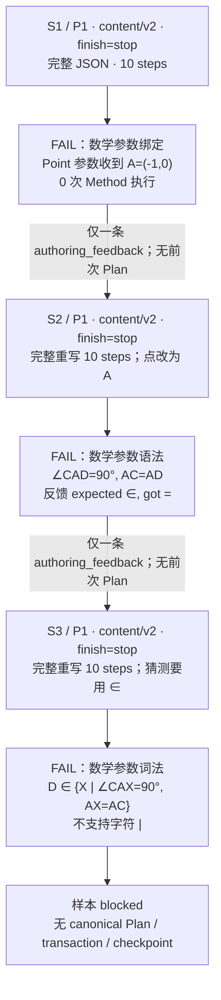
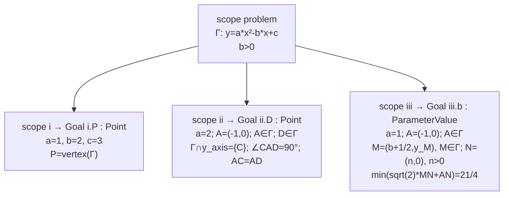
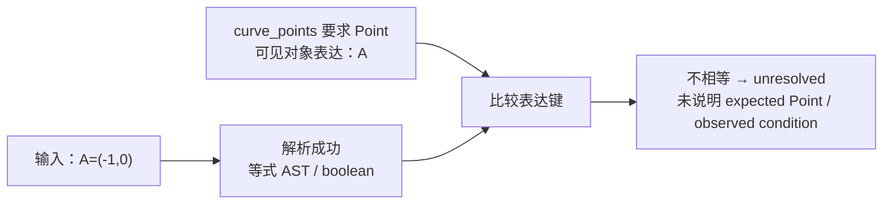
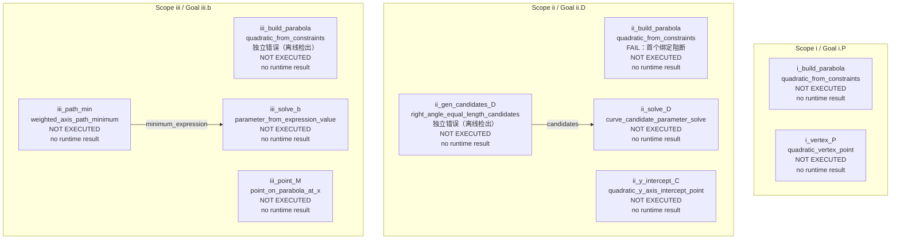
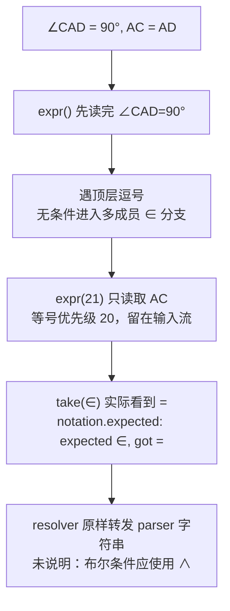
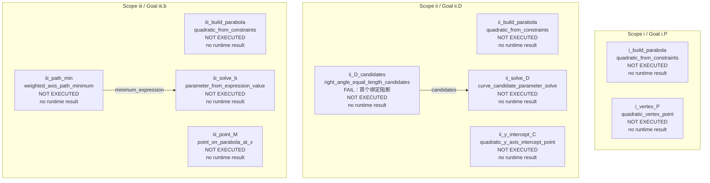
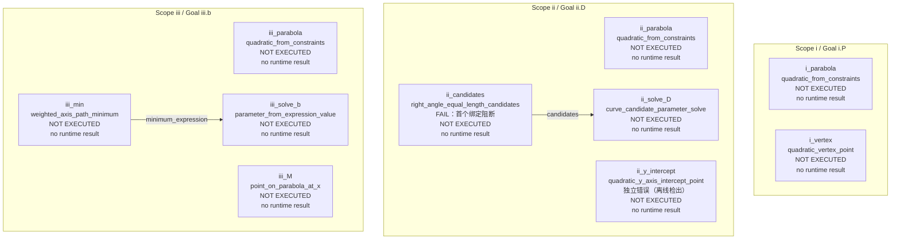
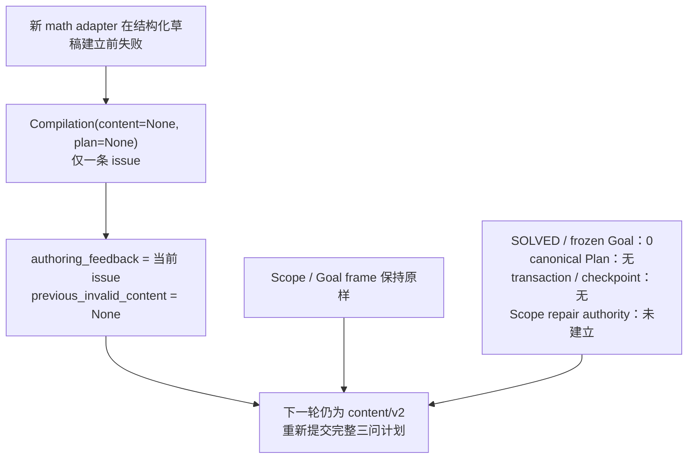
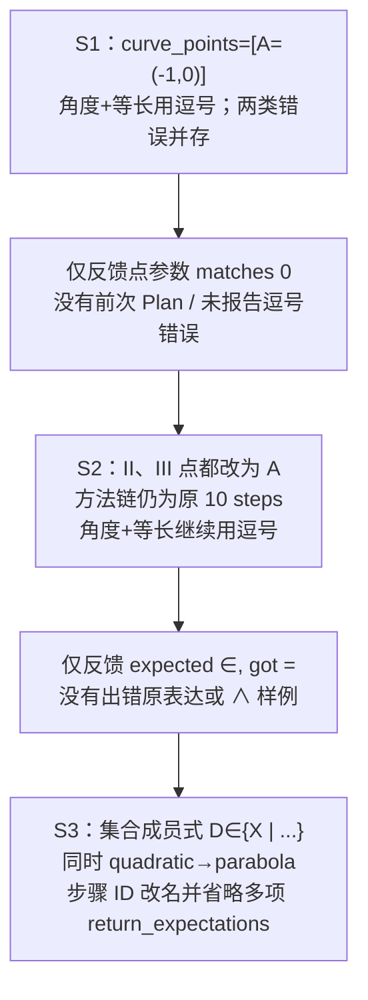
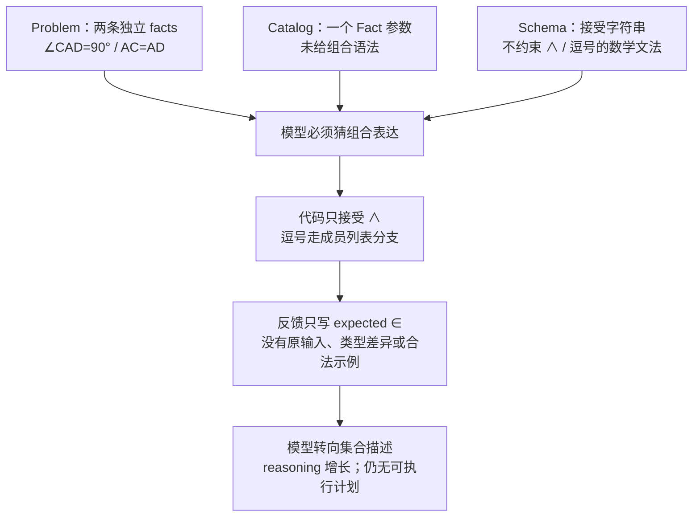

# 河西一模 / 数学参数 sample 1 故障审查

按[《LLM Sample 故障审查指南》](../../../llm-sample-failure-review-guide.md)逐项审查。样本为 `tj-2026-hexi-yimo-25 / math / 1`，不是三组样本拼接。三轮原始结果保持不变；本报告不修订生产代码，不新增模型调用。

## 结论

**这组失败主要暴露了新参数适配层的表达契约和反馈缺陷，不能概括成“方法算错”或“模型数学能力不行”。**

1. 三轮都返回完整 JSON，provider 均 `finish_reason=stop`。每轮只有一个 provider attempt，没有 timeout、空响应或 transport retry。
2. 三轮各有 10 个 step，全部在数学参数绑定阶段被拦截；**原始三轮共 30 个 step 均未执行**。没有 canonical Plan、事务、执行结果、已提交 Goal 或 checkpoint。
3. 第一轮同时有三处绑定问题，但新适配器在第一处抛错，只反馈了一个点参数错误。第二轮修复点表达后，才收到第一轮就存在的复合条件错误。
4. 三轮实际 Prompt 均没有 `∧`，而解析器要求复合直角等长条件使用它。Catalog 只写 `Fact/right_angle_equal_length`，没有给出这种单参数如何承载两条题设的可用表达。
5. 第二轮的反馈 `expected ∈, got =` 来自解析器的逗号列表分支，不是数学条件必须使用“属于”。第三轮 reasoning 明确把它误解为成员关系要求，最终编造集合表达；反馈对这次错误有直接的可追溯影响。
6. 离线仅修正第一轮的点表达和条件连接符，原步骤、方法、Scope、参数基底、结果引用保持不变，整题通过。第二轮仅改连接符也通过。**这是离线反事实证据，不把真实失败改记为成功。**

最终真实状态：`blocked`；3 次 semantic attempt、3 次 provider attempt、2 次语义重试；89,429 tokens；样本总耗时 201.95 秒。每轮单独耗时未保存，不能由总耗时平均推算。机器可读审计见 [analysis.json](analysis.json)。

## 证据与完整输入输出

原目录：[不可变的 sample 证据](../../../../internal/solver-runs/method-math-arguments-20260917/live/tj-2026-hexi-yimo-25/math/1)。每轮已保存文件的 SHA-256 均与 `evidence-index.json` 一致；保存的 messages 与 provider 实际请求 messages 逐字一致。

| 轮次 | 实际输入 | 原始输出与 step JSON | 原始阶段证据 |
|---|---|---|---|
| S1 / P1 | [system](attempt-1.prompt.system.md)、[user](attempt-1.prompt.user.md)、[上下文 JSON](attempt-1.context.json) | [可见原文](attempt-1.raw-response.txt)、[完整 step JSON](attempt-1.steps.json)、[reasoning](attempt-1.reasoning.txt) | [索引](../../../../internal/solver-runs/method-math-arguments-20260917/live/tj-2026-hexi-yimo-25/math/1/attempt-1.evidence-index.json)、[错误](../../../../internal/solver-runs/method-math-arguments-20260917/live/tj-2026-hexi-yimo-25/math/1/attempt-1.attempt-error.json) |
| S2 / P1 | [system](attempt-2.prompt.system.md)、[user](attempt-2.prompt.user.md)、[上下文 JSON](attempt-2.context.json) | [可见原文](attempt-2.raw-response.txt)、[完整 step JSON](attempt-2.steps.json)、[reasoning](attempt-2.reasoning.txt) | [索引](../../../../internal/solver-runs/method-math-arguments-20260917/live/tj-2026-hexi-yimo-25/math/1/attempt-2.evidence-index.json)、[错误](../../../../internal/solver-runs/method-math-arguments-20260917/live/tj-2026-hexi-yimo-25/math/1/attempt-2.attempt-error.json) |
| S3 / P1 | [system](attempt-3.prompt.system.md)、[user](attempt-3.prompt.user.md)、[上下文 JSON](attempt-3.context.json) | [可见原文](attempt-3.raw-response.txt)、[完整 step JSON](attempt-3.steps.json)、[reasoning](attempt-3.reasoning.txt) | [索引](../../../../internal/solver-runs/method-math-arguments-20260917/live/tj-2026-hexi-yimo-25/math/1/attempt-3.evidence-index.json)、[错误](../../../../internal/solver-runs/method-math-arguments-20260917/live/tj-2026-hexi-yimo-25/math/1/attempt-3.attempt-error.json) |

报告旁的 prompt、reasoning、step 文件是从原 artifact 无改写提取的阅读副本。原 artifact 是权威；`normalized-content` 在这三轮只是编译失败时保存的原 payload 副本，**不表示已经规范化成功**。`candidate-plan/compiled-plan/canonical-plan/transaction/checkpoint` 均明确为 `not_available`；不是文件丢失。

离线复现使用当前工作区代码；与真实批次冻结代码的差异只有三条相邻局部 import 的排序，见[冻结差异审计](../code-freeze-audit.json)。本次复现逐条断言了三轮原始诊断一致；未把重跑生成物写回原 sample 目录。

## 轮次总览

| Semantic / Provider | 协议 | 输入 token | reasoning token | 可见输出 token¹ | 总 token | cache hit / miss | finish | 首个阻断 |
|---|---|---:|---:|---:|---:|---|---|---|
| S1 / P1 | content/v2 | 13,609 | 11,283 | 904 | 25,796 | 1,280 / 12,329 | stop | `curve_points[0]` 中坐标等式无法绑定 Point |
| S2 / P1 | content/v2 | 13,685 | 13,959 | 894 | 28,538 | 9,728 / 3,957 | stop | 逗号连接条件进入成员列表语法分支 |
| S3 / P1 | content/v2 | 13,670 | 20,687 | 738 | 35,095 | 9,728 / 3,942 | stop | 集合描述中的 `|` 不在受限词法中 |

¹ 可见输出 token = provider completion_tokens − reasoning_tokens，属于由 provider 数据计算的差值。三轮 reasoning 字符数为 29,716 / 35,033 / 51,710，可见输出字符数为 2,813 / 2,842 / 2,318。推理增长不能描述为 `length` 超限：三轮都正常返回了 JSON。

三轮 request model 为 `deepseek-v4-flash`，response model 为 `deepseek-flash`；thinking enabled、effort low、timeout 120 秒、response_format `json_object`。请求没有设置 `max_tokens` 或 temperature；不猜测 provider 默认值。JSON Schema 在 user 文本中，不是 provider 强制执行的结构化 Schema。



## 三轮共同输入：模型实际看到了什么

实际 system 3,165 字符，三轮相同。user 分别 37,815 / 38,062 / 38,020 字符；变化仅在 Validation Feedback 段。Problem、Frame、Catalog、机制示例、Schema 和策略规则均保持不变。



`i/ii/iii` 为兄弟 Scope，同名 A 有各自的来源。以上是模型输入；内部 BindingCatalog、parser environment 不在这段 Prompt 中，不能假定模型看到了它们。

| 实际 user 段 | S1 字符数 | S2 | S3 | 与本案的关系 |
|---|---:|---:|---:|---|
| Problem Planning Context | 859 | 859 | 859 | 坐标、直角、等长均作为数学 facts 展示 |
| Plan Authority Frame | 407 | 407 | 407 | 原 Scope / Goal / answer_type 不变 |
| Strategy Principles | 469 | 469 | 469 | 方法选择原则不变 |
| Capability Catalog | 22,557 | 22,557 | 22,557 | 16 个可选能力；缺复合条件的表达说明 |
| Mechanism Example | 833 | 833 | 833 | 选中 weighted-axis-path-minimum 示例，不含直角等长参数 |
| Validation Feedback | 97 | 344 | 302 | 空 → 点绑定错误 → 逗号语法错误 |
| Output Schema | 12,523 | 12,523 | 12,523 | 字符串结构约束没有描述复合条件文法 |

表中统计 `##` 段；user 开头短指令另计。Catalog 与 Schema 合计约占第一轮 user 字符的 92.8%，但缺失本案决定性的单参数表达规则。不能用“大目录已经给了”代替验证可调用性。

与失败直接相关的实际 Catalog：

```json
{
  "curve_points": {
    "domain_type": "Point",
    "cardinality": "many",
    "role": "零个或多个已知坐标的曲线点；每个点都会作为独立曲线约束。",
    "math_argument": {"encoding": "math-expression/v1", "domain_type": "Point"}
  },
  "right_angle_equal_length": {
    "domain_type": "Fact",
    "required": true,
    "cardinality": "one",
    "fact_types": ["right_angle_equal_length"],
    "math_argument": {
      "encoding": "math-expression/v1",
      "domain_type": "Fact",
      "fact_types": ["right_angle_equal_length"]
    }
  }
}
```

system 提供了 `Γ`、`vertex(Γ)`、`b`、`a=1`、`N∈ray(C,D)`、`min(...)` 等示例，但没有点的坐标描述与点引用的区分，也没有 `∧`。虽然仓库另有直角等长机制示例文件，**本次请求未选中它**，不能拿那个文件说明模型已经看过写法。

## Attempt 1：点的描述被当作 Point 参数

### 输入、推理、输出

输入为共同上下文，`authoring_feedback=[]`。没有 previous Plan、执行树或开放 Scope authority。

reasoning 先正确选择了各问的方法链，第 68 行开始把 `A=(-1,0)` 当成 curve_point 的候选写法；第 403 行仍犹豫如何把两条条件合并为一个 Fact，最终选择逗号。这里只描述 provider 返回的推理，不将其中手算坐标当成 runtime 输出。[reasoning 阅读副本](attempt-1.reasoning.txt)

首个错误 step：

```json
{
  "step_id": "ii_build_parabola",
  "capability_id": "quadratic_from_constraints",
  "args": {
    "known_coefficients": ["a=2"],
    "curve_points": ["A=(-1,0)"],
    "free_parameters": ["b"]
  },
  "output_targets": {"parabola": "Γ"},
  "return_expectations": {"parabola": "open_state"},
  "intent": "建立(Ⅱ)中 a=2 且过 A 的含 b 抛物线 Γ。"
}
```

### 代码为什么拒绝

`A=(-1,0)` 可以被语法解析，但其 AST 是等式，类型为 boolean；这个参数要求 Point。resolver 的候选点来源以 `A` 作为表达，比较规范表达键时，等式不等于点对象。因而报“0 visible typed sources”。**A 实际存在且可见；这不是缺对象、Scope 越权或坐标不正确。** [受控 parser/binder 探针](parser-probes.json)



原报告只含这一条错误。离线将每个参数独立绑定，另发现 `iii.b` 中同样的点表达错误，以及 `ii.D` 中早已存在的逗号条件错误。三者是独立绑定问题，后两者不是第一个错误的级联结果。[逐参数检查](attempt-1.isolated-arguments.json)

原始 JSON 可解析；离线用实际公开 Schema 校验也通过。但原运行先进行数学绑定，未到达常规 wire 归一和内容校验。全轮 `math-argument-bindings=[]`，成功经过的局部绑定没有形成可交付审计；`normalized-content` 等于 raw parsed payload。

### 本轮原始 Plan 图与全部 step JSON

图中按 Scope / Goal 分组，实线只表示 raw JSON 中明确的 `{step_id, return}`；不把数组顺序或具名对象读取推断成已建立的 runtime DAG。所有节点均未执行、无实际结果。独立问题标记来自离线检查。



`scope_steps={}`；三个 `answer_from` 只是输出声明，尚未完成绑定或提交。

<details>
<summary>S1 原始完整 JSON：10 个 step、全部参数和 answer_from</summary>

```json
{
  "format": "functional-plan-content/v2",
  "goal_plans": {
    "i.P": {
      "answer_from": {
        "step_id": "i_vertex_P",
        "return": "point"
      },
      "steps": [
        {
          "step_id": "i_build_parabola",
          "capability_id": "quadratic_from_constraints",
          "args": {
            "known_coefficients": [
              "a=1",
              "b=2",
              "c=3"
            ]
          },
          "output_targets": {
            "parabola": "Γ"
          },
          "return_expectations": {
            "parabola": "closed_state"
          },
          "intent": "建立(Ⅰ)中系数完全确定的抛物线 Γ。"
        },
        {
          "step_id": "i_vertex_P",
          "capability_id": "quadratic_vertex_point",
          "args": {
            "parabola": "Γ"
          },
          "output_targets": {
            "point": "P"
          },
          "return_expectations": {
            "point": "closed_state"
          },
          "intent": "求抛物线 Γ 的顶点 P。"
        }
      ]
    },
    "ii.D": {
      "answer_from": {
        "step_id": "ii_solve_D",
        "return": "selected_curve_point"
      },
      "steps": [
        {
          "step_id": "ii_build_parabola",
          "capability_id": "quadratic_from_constraints",
          "args": {
            "known_coefficients": [
              "a=2"
            ],
            "curve_points": [
              "A=(-1,0)"
            ],
            "free_parameters": [
              "b"
            ]
          },
          "output_targets": {
            "parabola": "Γ"
          },
          "return_expectations": {
            "parabola": "open_state"
          },
          "intent": "建立(Ⅱ)中 a=2 且过 A 的含 b 抛物线 Γ。"
        },
        {
          "step_id": "ii_y_intercept_C",
          "capability_id": "quadratic_y_axis_intercept_point",
          "args": {
            "quadratic": "Γ"
          },
          "output_targets": {
            "point": "C"
          },
          "return_expectations": {
            "point": "open_state"
          },
          "intent": "求 Γ 与 y 轴交点 C，坐标为含 b 的表达式。"
        },
        {
          "step_id": "ii_gen_candidates_D",
          "capability_id": "right_angle_equal_length_candidates",
          "args": {
            "target": "D",
            "right_angle_equal_length": "∠CAD=90°, AC=AD"
          },
          "intent": "由直角等腰关系列出 D 的两个候选点。"
        },
        {
          "step_id": "ii_solve_D",
          "capability_id": "curve_candidate_parameter_solve",
          "args": {
            "candidates": {
              "step_id": "ii_gen_candidates_D",
              "return": "candidates"
            },
            "parabola": "Γ",
            "target_point": "D",
            "point_on_curve": "D∈Γ",
            "symbol_constraint": "b>0"
          },
          "output_targets": {
            "selected_curve_point": "D"
          },
          "return_expectations": {
            "selected_curve_point": "closed_state"
          },
          "intent": "用 D 在 Γ 上及 b>0 筛选候选并反求 b，得到 D 坐标。"
        }
      ]
    },
    "iii.b": {
      "answer_from": {
        "step_id": "iii_solve_b",
        "return": "parameter_value"
      },
      "steps": [
        {
          "step_id": "iii_build_parabola",
          "capability_id": "quadratic_from_constraints",
          "args": {
            "known_coefficients": [
              "a=1"
            ],
            "curve_points": [
              "A=(-1,0)"
            ],
            "free_parameters": [
              "b"
            ]
          },
          "output_targets": {
            "parabola": "Γ"
          },
          "return_expectations": {
            "parabola": "open_state"
          },
          "intent": "建立(Ⅲ)中 a=1 且过 A 的含 b 抛物线 Γ。"
        },
        {
          "step_id": "iii_point_M",
          "capability_id": "point_on_parabola_at_x",
          "args": {
            "parabola": "Γ"
          },
          "output_targets": {
            "point": "M"
          },
          "return_expectations": {
            "point": "open_state"
          },
          "intent": "由 M 的结构化横坐标求其在 Γ 上的纵坐标。"
        },
        {
          "step_id": "iii_path_min",
          "capability_id": "weighted_axis_path_minimum",
          "args": {
            "path_minimum_target": "min(sqrt(2)*MN+AN)"
          },
          "return_expectations": {
            "minimum_expression": "open_expression"
          },
          "intent": "原子求出覆盖定义域的加权路径最小值表达式。"
        },
        {
          "step_id": "iii_solve_b",
          "capability_id": "parameter_from_expression_value",
          "args": {
            "expression": {
              "step_id": "iii_path_min",
              "return": "minimum_expression"
            },
            "minimum_value": "min(sqrt(2)*MN+AN)=21/4",
            "parameter": "b"
          },
          "output_targets": {
            "parameter_value": "b"
          },
          "intent": "由题设最小值反求参数 b。"
        }
      ]
    }
  }
}
```

</details>

本轮责任：模型将条件形态填进 Point 参数；新适配层没有清楚说明点的可写形式，并返回了欠缺类型差异和修复动作的泛化错误。执行器未运行，不承担本轮数学失败。

### 下一轮实际收到什么

```json
[
  {
    "code": "functional.math_argument_unresolved",
    "path": "$.goal_plans.ii.D.steps[0].args.curve_points[0]",
    "message": "quadratic_from_constraints.curve_points: 'A=(-1,0)' matches 0 visible typed sources.",
    "details": {"diagnostic_id": "3a13339078ab5436"}
  }
]
```

只发送这一条；没有前一轮原始 step JSON，也没有 III 问同类错误或复合条件错误。S2 的模型自行推断应该用 `A`，并同时修复 II、III 问的点参数。

## Attempt 2：逗号误入成员列表语法

### 输入、推理、输出

输入仅增加上面的点绑定反馈，其他段逐字相同。模型第 1、17 行理解了 Point 与坐标等式的区别；第 23、127、230 行反复猜测单个 Fact 如何表达两条几何条件，最后仍选择逗号。[reasoning](attempt-2.reasoning.txt)

首个错误 step：

```json
{
  "step_id": "ii_D_candidates",
  "capability_id": "right_angle_equal_length_candidates",
  "args": {
    "target": "D",
    "right_angle_equal_length": "∠CAD = 90°, AC = AD"
  },
  "intent": "由直角等腰关系生成 D 的候选点。"
}
```

### 报错的精确来源

受限解析器的顶层逗号分支用于 `A,B∈Γ` 一类成员列表。它不支持用逗号连接完整布尔条件：



代码位置：[Parser.parse](../../../../server/shuxueshuo_server/problem_understanding/notation_parser.py:152)、[优先级表](../../../../server/shuxueshuo_server/problem_understanding/notation_parser.py:27)、[resolver 异常转换](../../../../server/shuxueshuo_server/solver/runtime/method_math_arguments.py:320)。

不是角度条件应写 `∈`，也不是题设不成立。把连接符改为 `∧` 后可唯一绑定到原有 `right_angle_equal_length_c_a_d_ac_ad`，来源就是 II 问原题的 facts[5] 与 facts[6]；交换两个条件顺序仍绑定同一对象。没有新增题设。

本轮 JSON 和公开 Schema 均可通过独立校验；实际运行仍止于数学绑定，全轮无 canonical Plan、Method 调用、事务或 checkpoint。

### 本轮原始 Plan 图与全部 step JSON

图中按 Scope / Goal 分组，实线只表示 raw JSON 中明确的 `{step_id, return}`；不把数组顺序或具名对象读取推断成已建立的 runtime DAG。所有节点均未执行、无实际结果。独立问题标记来自离线检查。



`scope_steps={}`；三个 `answer_from` 只是输出声明，尚未完成绑定或提交。

<details>
<summary>S2 原始完整 JSON：10 个 step、全部参数和 answer_from</summary>

```json
{
  "format": "functional-plan-content/v2",
  "goal_plans": {
    "i.P": {
      "answer_from": {
        "step_id": "i_vertex_P",
        "return": "point"
      },
      "steps": [
        {
          "step_id": "i_build_parabola",
          "capability_id": "quadratic_from_constraints",
          "args": {
            "known_coefficients": [
              "a=1",
              "b=2",
              "c=3"
            ],
            "free_parameters": []
          },
          "output_targets": {
            "parabola": "Γ"
          },
          "return_expectations": {
            "parabola": "closed_state"
          },
          "intent": "由已知系数建立封闭抛物线 Γ。"
        },
        {
          "step_id": "i_vertex_P",
          "capability_id": "quadratic_vertex_point",
          "args": {
            "parabola": "Γ"
          },
          "output_targets": {
            "point": "P"
          },
          "return_expectations": {
            "point": "closed_state"
          },
          "intent": "求抛物线顶点 P 的坐标。"
        }
      ]
    },
    "ii.D": {
      "answer_from": {
        "step_id": "ii_solve_D",
        "return": "selected_curve_point"
      },
      "steps": [
        {
          "step_id": "ii_build_parabola",
          "capability_id": "quadratic_from_constraints",
          "args": {
            "known_coefficients": [
              "a=2"
            ],
            "curve_points": [
              "A"
            ],
            "free_parameters": [
              "b"
            ]
          },
          "output_targets": {
            "parabola": "Γ"
          },
          "return_expectations": {
            "parabola": "open_state"
          },
          "intent": "由 a=2 和曲线点 A 建立含参抛物线 Γ。"
        },
        {
          "step_id": "ii_y_intercept_C",
          "capability_id": "quadratic_y_axis_intercept_point",
          "args": {
            "quadratic": "Γ"
          },
          "output_targets": {
            "point": "C"
          },
          "return_expectations": {
            "point": "open_state"
          },
          "intent": "求 Γ 与 y 轴交点 C。"
        },
        {
          "step_id": "ii_D_candidates",
          "capability_id": "right_angle_equal_length_candidates",
          "args": {
            "target": "D",
            "right_angle_equal_length": "∠CAD = 90°, AC = AD"
          },
          "intent": "由直角等腰关系生成 D 的候选点。"
        },
        {
          "step_id": "ii_solve_D",
          "capability_id": "curve_candidate_parameter_solve",
          "args": {
            "candidates": {
              "step_id": "ii_D_candidates",
              "return": "candidates"
            },
            "parabola": "Γ",
            "target_point": "D",
            "point_on_curve": "D ∈ Γ",
            "symbol_constraint": "b>0"
          },
          "output_targets": {
            "selected_curve_point": "D",
            "solved_parabola": "Γ"
          },
          "return_expectations": {
            "selected_curve_point": "closed_state",
            "solved_parabola": "closed_state"
          },
          "intent": "用曲线归属和参数约束筛选候选点并反求参数，确定 D 坐标。"
        }
      ]
    },
    "iii.b": {
      "answer_from": {
        "step_id": "iii_solve_b",
        "return": "parameter_value"
      },
      "steps": [
        {
          "step_id": "iii_build_parabola",
          "capability_id": "quadratic_from_constraints",
          "args": {
            "known_coefficients": [
              "a=1"
            ],
            "curve_points": [
              "A"
            ],
            "free_parameters": [
              "b"
            ]
          },
          "output_targets": {
            "parabola": "Γ"
          },
          "return_expectations": {
            "parabola": "open_state"
          },
          "intent": "由 a=1 和曲线点 A 建立含参抛物线 Γ。"
        },
        {
          "step_id": "iii_point_M",
          "capability_id": "point_on_parabola_at_x",
          "args": {
            "parabola": "Γ"
          },
          "output_targets": {
            "point": "M"
          },
          "return_expectations": {
            "point": "open_state"
          },
          "intent": "由 M 的结构化横坐标求 M 在 Γ 上的坐标。"
        },
        {
          "step_id": "iii_path_min",
          "capability_id": "weighted_axis_path_minimum",
          "args": {
            "path_minimum_target": "min(sqrt(2)*MN + AN)"
          },
          "return_expectations": {
            "minimum_expression": "open_expression"
          },
          "intent": "求加权路径的最小值表达式。"
        },
        {
          "step_id": "iii_solve_b",
          "capability_id": "parameter_from_expression_value",
          "args": {
            "expression": {
              "step_id": "iii_path_min",
              "return": "minimum_expression"
            },
            "minimum_value": "min(sqrt(2)*MN + AN) = 21/4",
            "parameter": "b"
          },
          "output_targets": {
            "parameter_value": "b"
          },
          "intent": "由给定最小值反求参数 b。"
        }
      ]
    }
  }
}
```

</details>

本轮责任：模型猜测了未声明的逗号组合形式；代码提供的数学参数契约不完整，并把内部 parser 期待直接作为修复反馈。这是本案最关键的实现缺陷。

### 下一轮实际收到什么

```json
[
  {
    "code": "functional.math_argument_invalid",
    "path": "$.goal_plans.ii.D.steps[2].args.right_angle_equal_length",
    "message": "notation.expected: expected ∈, got =",
    "details": {"diagnostic_id": "de16701d01f14b7f"}
  }
]
```

仍未发送上一轮原始计划或该参数原文。第三轮 reasoning 多次猜测“上一轮可能只写了角度等式”，而实际上一轮使用的是两个条件的逗号连接。这使模型无法准确定位报错中的 `=` 是哪一个。

## Attempt 3：错误反馈诱发集合猜测，并新增参数名错误

### 输入、推理、输出

输入仅有第二轮的 parser 错误，原点参数错误已不在反馈中；无 previous Plan。第三轮 reasoning 第 1 行开始猜“该 Fact 类型是否必须是成员关系”，第 41 行指出目录没有说明格式，第 212 行写到“错误提示强烈要求 ∈”，随后选择集合描述。[reasoning](attempt-3.reasoning.txt)

首个错误 step：

```json
{
  "step_id": "ii_candidates",
  "capability_id": "right_angle_equal_length_candidates",
  "args": {
    "target": "D",
    "right_angle_equal_length": "D ∈ {X | ∠CAX=90°, AX=AC}"
  },
  "intent": "由直角等腰关系列D候选点"
}
```

实际词法错误为 `notation.unrecognized_token: at 6:  | ∠CAX=90°,`。`|` 不在 TOKEN 允许集合，词法分析即停止，尚未校验集合是否代表受信题设、X 是否允许或几何条件是否等价。不能把尚未执行的后续检查写成实际失败原因。

### 独立的新增错误

本轮还把 y 轴截距 step 写成：

```json
{
  "step_id": "ii_y_intercept",
  "capability_id": "quadratic_y_axis_intercept_point",
  "args": {"parabola": "Γ"},
  "output_targets": {"point": "C"},
  "intent": "求y轴交点C"
}
```

实际 Catalog 和 [该 capability 的实际 Schema 分支](y-intercept-schema-branch.json) 都要求 `args.quadratic`。第三轮 reasoning 第 386、398、412 行误以为 Schema 要求 `parabola`，这是模型把其他共享定义/方法的字段看错了，**不是真实 Schema/Catalog 冲突**。

原运行中该错误尚未报告，因为数学参数层先在后面的集合表达抛错，常规 Schema 校验未到达。离线只修集合表达，下一阻断立即变成该 step 的 `Undeclared fields are not allowed`。它是独立错误，不是集合表达报错的 runtime 级联。

### 本轮原始 Plan 图与全部 step JSON

图中按 Scope / Goal 分组，实线只表示 raw JSON 中明确的 `{step_id, return}`；不把数组顺序或具名对象读取推断成已建立的 runtime DAG。所有节点均未执行、无实际结果。独立问题标记来自离线检查。



`scope_steps={}`；三个 `answer_from` 只是输出声明，尚未完成绑定或提交。

<details>
<summary>S3 原始完整 JSON：10 个 step、全部参数和 answer_from</summary>

```json
{
  "format": "functional-plan-content/v2",
  "goal_plans": {
    "i.P": {
      "answer_from": {
        "step_id": "i_vertex",
        "return": "point"
      },
      "steps": [
        {
          "step_id": "i_parabola",
          "capability_id": "quadratic_from_constraints",
          "args": {
            "known_coefficients": [
              "a=1",
              "b=2",
              "c=3"
            ],
            "free_parameters": []
          },
          "output_targets": {
            "parabola": "Γ"
          },
          "intent": "建立第(i)问的确定抛物线"
        },
        {
          "step_id": "i_vertex",
          "capability_id": "quadratic_vertex_point",
          "args": {
            "parabola": "Γ"
          },
          "output_targets": {
            "point": "P"
          },
          "intent": "求顶点P"
        }
      ]
    },
    "ii.D": {
      "answer_from": {
        "step_id": "ii_solve_D",
        "return": "selected_curve_point"
      },
      "steps": [
        {
          "step_id": "ii_parabola",
          "capability_id": "quadratic_from_constraints",
          "args": {
            "known_coefficients": [
              "a=2"
            ],
            "curve_point": "A",
            "free_parameters": [
              "b"
            ]
          },
          "output_targets": {
            "parabola": "Γ"
          },
          "intent": "建立第(ii)问含参抛物线"
        },
        {
          "step_id": "ii_y_intercept",
          "capability_id": "quadratic_y_axis_intercept_point",
          "args": {
            "parabola": "Γ"
          },
          "output_targets": {
            "point": "C"
          },
          "intent": "求y轴交点C"
        },
        {
          "step_id": "ii_candidates",
          "capability_id": "right_angle_equal_length_candidates",
          "args": {
            "target": "D",
            "right_angle_equal_length": "D ∈ {X | ∠CAX=90°, AX=AC}"
          },
          "intent": "由直角等腰关系列D候选点"
        },
        {
          "step_id": "ii_solve_D",
          "capability_id": "curve_candidate_parameter_solve",
          "args": {
            "candidates": {
              "step_id": "ii_candidates",
              "return": "candidates"
            },
            "parabola": "Γ",
            "target_point": "D",
            "point_on_curve": "D ∈ Γ",
            "symbol_constraint": "b>0"
          },
          "output_targets": {
            "selected_curve_point": "D"
          },
          "return_expectations": {
            "selected_curve_point": "closed_state"
          },
          "intent": "用曲线与参数约束筛选D并反求参数"
        }
      ]
    },
    "iii.b": {
      "answer_from": {
        "step_id": "iii_solve_b",
        "return": "parameter_value"
      },
      "steps": [
        {
          "step_id": "iii_parabola",
          "capability_id": "quadratic_from_constraints",
          "args": {
            "known_coefficients": [
              "a=1"
            ],
            "curve_point": "A",
            "free_parameters": [
              "b"
            ]
          },
          "output_targets": {
            "parabola": "Γ"
          },
          "intent": "建立第(iii)问含参抛物线"
        },
        {
          "step_id": "iii_M",
          "capability_id": "point_on_parabola_at_x",
          "args": {
            "parabola": "Γ"
          },
          "output_targets": {
            "point": "M"
          },
          "intent": "由结构化横坐标求抛物线上点M"
        },
        {
          "step_id": "iii_min",
          "capability_id": "weighted_axis_path_minimum",
          "args": {
            "path_minimum_target": "min(sqrt(2)*MN+AN)"
          },
          "intent": "求加权路径最小值表达式"
        },
        {
          "step_id": "iii_solve_b",
          "capability_id": "parameter_from_expression_value",
          "args": {
            "expression": {
              "step_id": "iii_min",
              "return": "minimum_expression"
            },
            "minimum_value": "min(sqrt(2)*MN+AN)=21/4",
            "parameter": "b"
          },
          "output_targets": {
            "parameter_value": "b"
          },
          "intent": "由给定最小值反求b"
        }
      ]
    }
  }
}
```

</details>

本轮责任：代码的歧义反馈和缺失 previous content 明显促成了集合方向的错误推断；模型仍须为自造不受支持表达、误读明确的 `quadratic` 参数承担相应责任。provider 正常返回，原 Method 未运行。

## Retry authority：为何三轮都是 content/v2



这条协议选择遵循原规则，不能强行伪造 checkpoint 或锁住“看起来已经正确”的 I 问。但新 adapter 的早退方式丢掉了可用于 authoring 修复的结构化内容与局部诊断，改变了模型收到的信息质量。问题应在适配层保留草稿/证据和诊断投影处修复，而不是更换 retry 协议、预算或开放范围。

代码依据：[数学绑定失败的提前返回](../../../../server/shuxueshuo_server/solver/runtime/functional_plan_content.py:912)、[previous_invalid_content 的来源](../../../../server/shuxueshuo_server/solver/runtime/functional_scope_retry.py:1095)、[协议分支](../../../../server/shuxueshuo_server/solver/runtime/functional_scope_retry.py:940)。

## 轮间 Plan diff 与反馈因果图



S1→S2 的其他变化包括增加 I 问 `free_parameters=[]`、D 筛选步骤增加 `solved_parabola` 的 target/expectation、候选 step 改名与空格/intent 调整；它们不是当前首个失败原因。S2→S3 保留同样八类能力、10 个步骤和原 Goal owner，但重写了步骤标识和部分字段。原始完整 JSON 已逐轮保留，未以重建的“理想计划”替代。

## Root、级联与独立错误

| 层次 | S1 | S2 | S3 |
|---|---|---|---|
| 实际首个阻断 | II 问 Point 参数坐标等式 | 逗号组合条件的语法错误 | 集合描述的词法错误 |
| 独立潜在阻断 | III 问同类 Point 错误；直角等长逗号错误 | 逐参数探针未发现其他数学绑定错误 | y 截距方法参数名错误 |
| runtime 级联失败 | 无；没有启动执行 | 无；没有启动执行 | 无；没有启动执行 |
| 后果 | 整个计划无法组装；所有 step NOT EXECUTED | 同左 | 同左 |

“所有 Goal 未得到答案”是前置门禁阻断的后果，不能被统计成三个独立的数学求解失败，也不能把 I 问标记为 SOLVED。

## 离线反事实验证

所有实验只编辑响应副本，使用相同的既有 compiler、Method、Scope 和执行规则，不调用模型。并未修改生产解析器；实际成功结果只存在于下列 `offline-probes`，不是原真实样本的执行结果。[实验脚本](counterfactual.py)、[机器可读结果](counterfactual-results.json)

| 输入副本 | 唯一改动 | 离线结果 |
|---|---|---|
| S1 | 两处 `A=(-1,0)` → `A` | 仍失败，暴露原有逗号条件错误 |
| S1 | 逗号条件 → `∠CAD=90° ∧ AC=AD` | 仍失败，Point 错误保留 |
| S1 | 同时修正上述两类表达，3 个字符串 | **accepted，三问答案核验通过** |
| S2 | 仅修正条件连接符，1 个字符串 | **accepted，三问答案核验通过** |
| S3 | 仅替换集合表达为受信合取条件 | 仍失败，暴露 `parabola` 未声明字段 |
| S3 | 条件表达 + 截距参数名改回 `quadratic` | **accepted，三问答案核验通过** |

成功副本的实际执行证据：[S1](offline-probes/attempt-1-point-and-angle/execution-audit.json)、[S2](offline-probes/attempt-2-angle/execution-audit.json)、[S3](offline-probes/attempt-3-angle-and-argument-name/execution-audit.json)。由此可证本 sample 的原方法链可以工作，关键阻断在表达适配和反馈环节；不能由此声称另两组样本或新 Prompt 的真实成功率已经改善。

## 同题另外两组对照

三个 sample 的首轮 system、user、Catalog 和 Schema 的 SHA-256 均一致，见 [analysis.json 的 sample_prompt_comparison](analysis.json)。三组首轮都使用逗号连接直角与等长条件，说明缺失的表达规则反复影响同一能力。

- sample 1 首轮用坐标等式传点，并保留自由参数 b；第 68 行进入这种写法。
- sample 2 首轮使用 `curve_point="A"`、自由参数 c，但仍采用逗号条件；reasoning 第 27、446 行对单 Fact 组合形式进行猜测。
- sample 3 首轮最终使用 `curve_point="A"`、自由参数 c，并少列了显式 y 轴截距步骤；reasoning 第 12 行仍曾考虑坐标描述，第 324 行仍猜测逗号组合可用。

后两组的完整方法/状态缺口不属于本次 sample 1 的逐轮结论，不能因修好 sample 1 就宣称全部已修复。其原始证据：[sample 2 首轮](../../../../internal/solver-runs/method-math-arguments-20260917/live/tj-2026-hexi-yimo-25/math/2/attempt-1.request.json)、[sample 3 首轮](../../../../internal/solver-runs/method-math-arguments-20260917/live/tj-2026-hexi-yimo-25/math/3/attempt-1.request.json)。

## 根因图与后续修复边界



建议按同类契约修复，当前报告不实施：

1. **参数契约/目录**：由实际 binder contract 给出 Point 与条件表达的区别、复合 Fact 的合取形式和可解析样例；不让模型从 `fact_types` 名称推测语法。若支持坐标描述，必须核对原可见题设和对象身份，不能直接截等号左边。
2. **解析/诊断**：将顶层“布尔条件列表”与 `A,B∈Γ`、坐标 tuple、函数参数区分。错误应指明收到哪种表达、当前参数要求什么、哪个 token 失败；不能把内部 `take(∈)` 文案变成错误的修复方向。不做全局逗号替换。
3. **编译接线/证据**：收集相互独立的参数错误，沿用原最多 8 条反馈预算；保留原 authoring content 和已成功绑定的来源记录。未编译的内容仍标为草稿，不伪装成 canonical Plan。
4. **retry**：仍采用原 content/v2 与 scope-repair/v1 分支；保留原预算、权限和事务边界。无 runtime 状态时不能伪造 solved/frozen Goal。
5. **离线回归**：将这些真实 raw responses 加入回归；验证错误指向、完整反馈、可见来源、错误射线/比例/兄弟问隔离，以及 Point 描述不能偷偷引入新事实。继续保留两种参数编码下原规则的等价回归。
6. **真实验收**：后续若要付费验证，按规范先定向 1 次，再同题 3 次、五题 5×1、五题 5×3，并另看 reasoning、绑定错误和 retry 信息质量。当前无新调用，不将离线结果覆盖真实失败。

审查范围内未发生 provider 故障，也未触发执行器 configuration error。`math_argument_invalid/unresolved` 按现有 authoring retry 分类处理是原机制；真正需修复的是表达契约不完整、诊断误导和早退造成的信息丢失。新适配层的这些缺陷由本轮实现承担。

## 规范完成核对

机器核验与图示检查记录见 [verification.json](verification.json)。两个复现脚本均读取本地冻结输入；`analyze.py` 复核原始证据并重现诊断，`counterfactual.py` 使用响应录制入口执行上述 6 个副本实验。

- 已区分 semantic/provider，核对三轮实际 system/user、响应格式、Schema 和原始 thinking。
- 已逐轮给出完整 step JSON、Scope/Goal 图、首个阻断及 NOT EXECUTED 状态。
- 已画全局轮次、retry authority、轮间 diff 和上下文根因图。
- 已说明 raw/normalized/canonical 的边界，核对下一轮确实收到的反馈与未收到的内容。
- 已用原始哈希、逐参数探针和离线反事实验证区分 root、独立错误及非 runtime 级联。
- 已比较三组首轮 Prompt 与首次表达分歧；区分模型、上下文、代码和 provider 责任。
- 已列出同类修复及验收顺序，未改变原规则或付费重跑。
