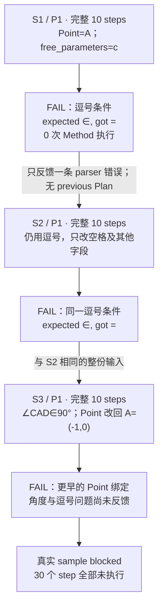
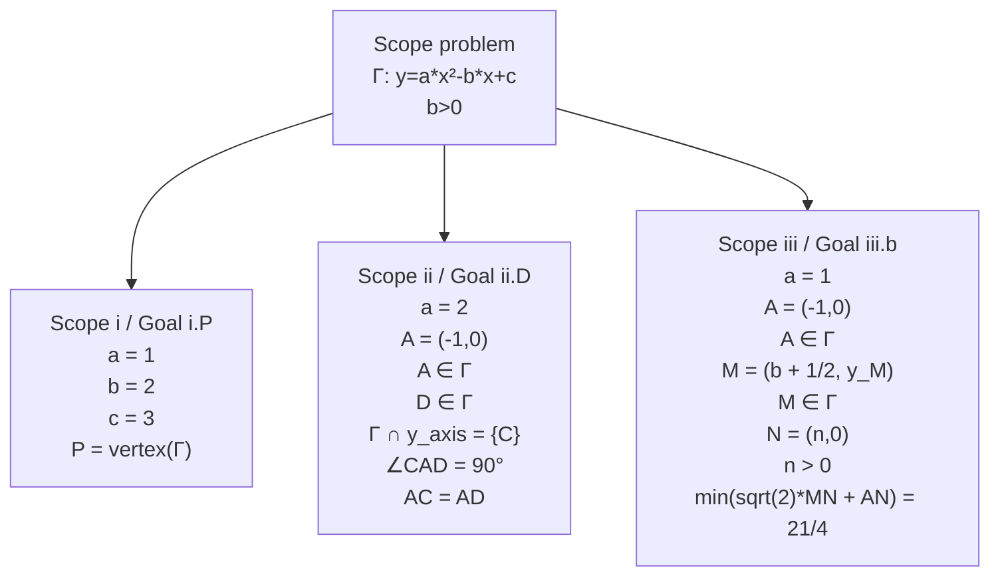
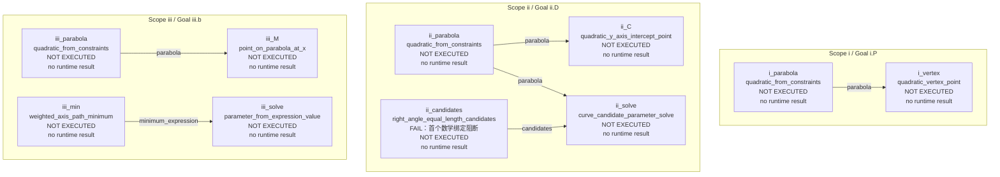
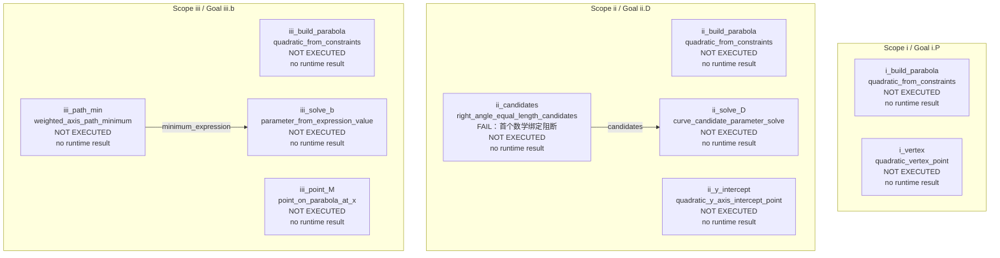
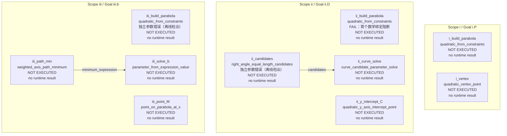
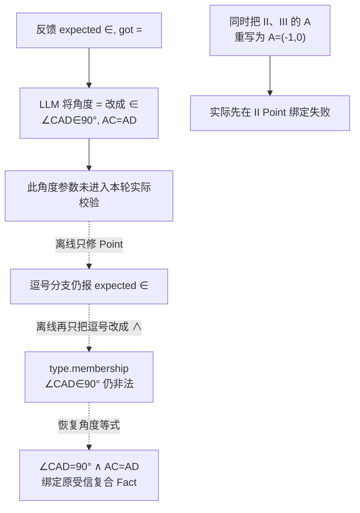
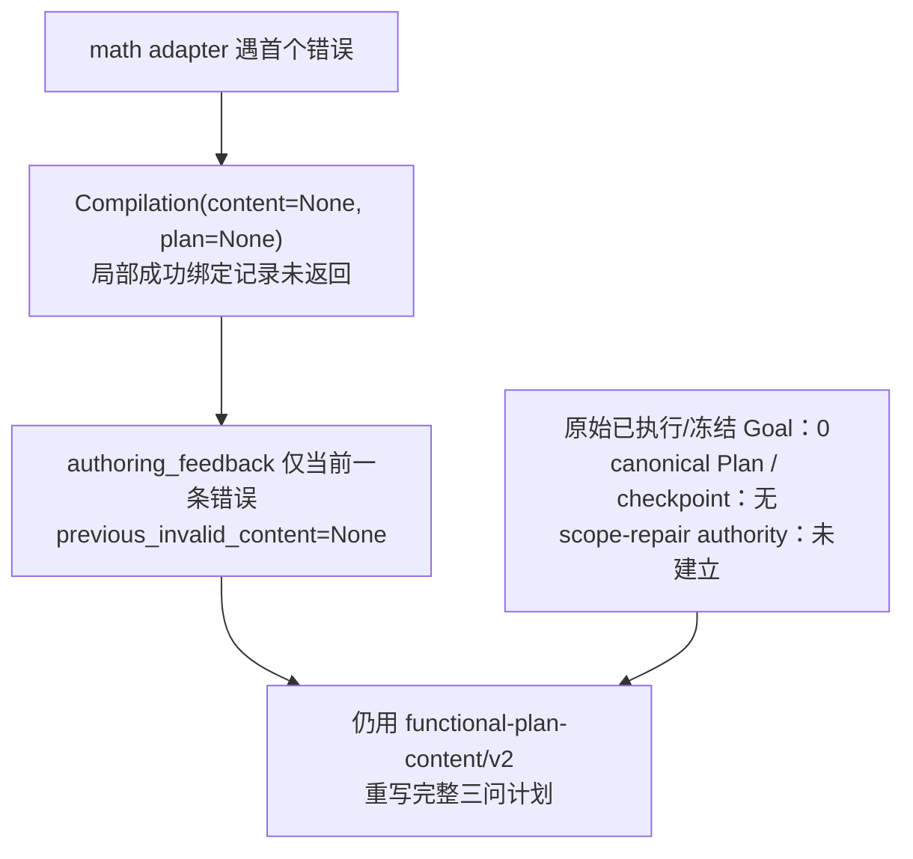
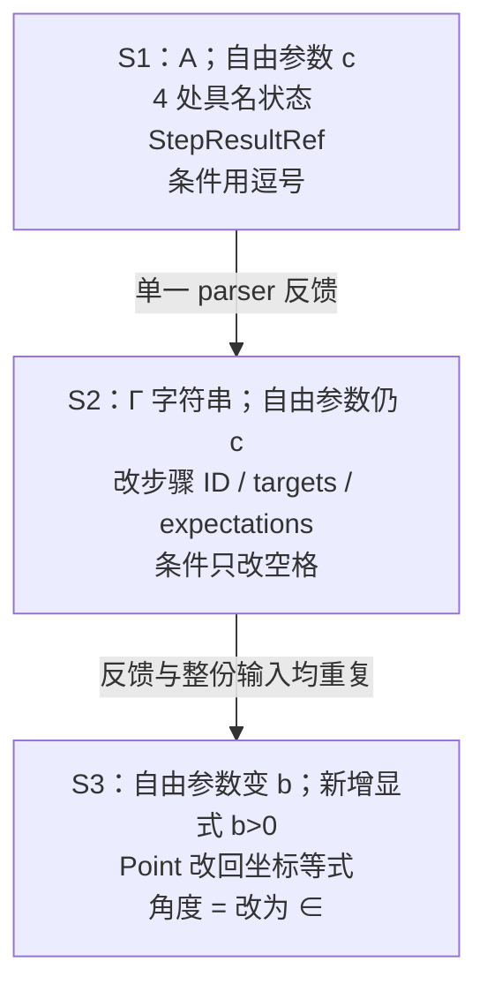
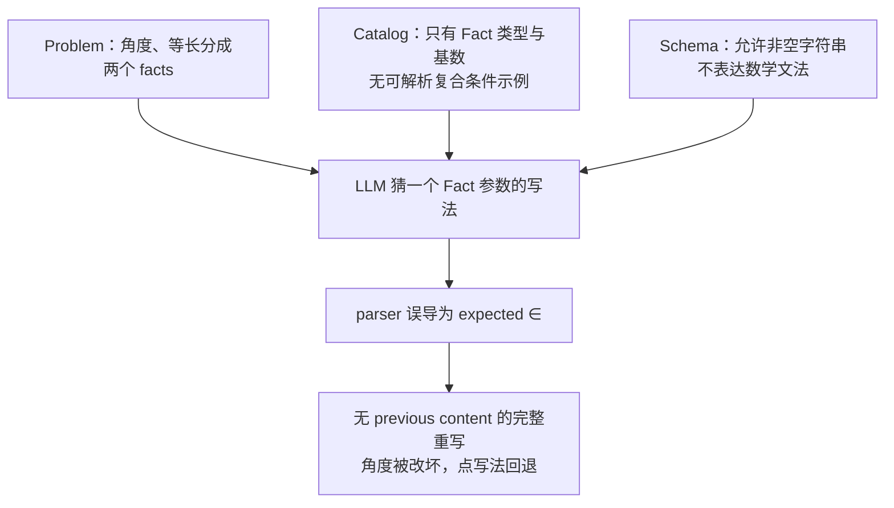

# 河西一模 / 数学参数 sample 2 故障审查

依据[《LLM Sample 故障审查指南》](../../../llm-sample-failure-review-guide.md)，逐轮检查 `tj-2026-hexi-yimo-25 / math / 2`。这是 sample 2 的三次 semantic attempt，不与其他 sample 拼接。审查不修改生产代码，不新增模型调用。

## 结论

**本 sample 的三个原方法链都可以工作，真实失败集中在数学参数表达及其反馈。** S1、S2 用逗号连接直角与等长，均收到 `expected ∈, got =`；S3 据此把角度等式改成 `∠CAD∈90°`，同时重新引入两个 Point 坐标等式，导致更早的绑定失败。

- 原始三轮都是完整 JSON、`finish_reason=stop`，每轮一个 provider attempt，无 transport retry。
- 原始每轮 10 个 step，共 **30 个 step 全部 NOT EXECUTED**；未建立 canonical Plan、事务、运行结果、Goal 提交或 checkpoint。
- S2 与 S3 的实际 system/user Prompt 逐字相同；两轮均只收到同一条逗号语法反馈，没有 previous Plan、出错表达原文或累积错误清单。
- 离线只改 S1、S2 各一个条件字符串，即可通过。S3 同时修两个点字符串和一个条件字符串后通过；不改方法、步骤、Scope、Goal、自由参数基底或结果引用。
- S1 原始 JSON 中四处具名状态 StepResultRef 不符合公开 Schema，但原归一流程能够安全转换，并非独立终局错误。S2 未显式传 `symbol_constraint`、保留自由参数 c，也均符合既有能力规则。

真实最终状态仍为 `blocked`：3 次 semantic attempt、3 次 provider attempt、2 次语义重试，81,264 tokens，164.56 秒。单轮耗时未保存，不做均摊估算。[原始结果副本](original-result.json)、[完整审计](analysis.json)

## 证据与轮次总览

原始证据目录：[math/2](../../../../internal/solver-runs/method-math-arguments-20260917/live/tj-2026-hexi-yimo-25/math/2)。以下阅读副本由 artifact 无改写提取。

| 轮次 | 实际输入 | 原始输出 | 阶段与错误 |
|---|---|---|---|
| S1 / P1 | [system](attempt-1.prompt.system.md)、[user](attempt-1.prompt.user.md)、[上下文](attempt-1.context.json) | [原文](attempt-1.raw-response.txt)、[完整 steps](attempt-1.steps.json)、[reasoning](attempt-1.reasoning.txt) | [索引](../../../../internal/solver-runs/method-math-arguments-20260917/live/tj-2026-hexi-yimo-25/math/2/attempt-1.evidence-index.json)、[原错误](../../../../internal/solver-runs/method-math-arguments-20260917/live/tj-2026-hexi-yimo-25/math/2/attempt-1.attempt-error.json)、[复用/执行](../../../../internal/solver-runs/method-math-arguments-20260917/live/tj-2026-hexi-yimo-25/math/2/attempt-1.reuse.json) |
| S2 / P1 | [system](attempt-2.prompt.system.md)、[user](attempt-2.prompt.user.md)、[上下文](attempt-2.context.json) | [原文](attempt-2.raw-response.txt)、[完整 steps](attempt-2.steps.json)、[reasoning](attempt-2.reasoning.txt) | [索引](../../../../internal/solver-runs/method-math-arguments-20260917/live/tj-2026-hexi-yimo-25/math/2/attempt-2.evidence-index.json)、[原错误](../../../../internal/solver-runs/method-math-arguments-20260917/live/tj-2026-hexi-yimo-25/math/2/attempt-2.attempt-error.json)、[复用/执行](../../../../internal/solver-runs/method-math-arguments-20260917/live/tj-2026-hexi-yimo-25/math/2/attempt-2.reuse.json) |
| S3 / P1 | [system](attempt-3.prompt.system.md)、[user](attempt-3.prompt.user.md)、[上下文](attempt-3.context.json) | [原文](attempt-3.raw-response.txt)、[完整 steps](attempt-3.steps.json)、[reasoning](attempt-3.reasoning.txt) | [索引](../../../../internal/solver-runs/method-math-arguments-20260917/live/tj-2026-hexi-yimo-25/math/2/attempt-3.evidence-index.json)、[原错误](../../../../internal/solver-runs/method-math-arguments-20260917/live/tj-2026-hexi-yimo-25/math/2/attempt-3.attempt-error.json)、[复用/执行](../../../../internal/solver-runs/method-math-arguments-20260917/live/tj-2026-hexi-yimo-25/math/2/attempt-3.reuse.json) |

每轮 16 个已保存角色的 SHA-256 均与原 `evidence-index.json` 一致；provider 实际 messages 与保存的 request messages 逐字一致。raw parsed payload 等于保存的 `normalized-content`，因为数学适配器早退时保存的是原 payload 副本，不能将文件名理解为已经归一成功。每轮 `math-argument-bindings=[]`；其余关键阶段均明确为 `not_available`。

当前离线代码与真实批次冻结代码只差三条相邻局部 import 的排序，见[冻结差异审计](../code-freeze-audit.json)。本次再次精确复现了三轮原诊断，未覆盖原 sample 证据。

| Semantic / Provider | 输入 tokens | reasoning tokens | 可见 tokens¹ | total tokens | cache hit / miss | steps |
|---|---:|---:|---:|---:|---|---:|
| S1 / P1 | 13,609 | 12,003 | 915 | 26,527 | 13,440 / 169 | 10 |
| S2 / P1 | 13,670 | 14,495 | 846 | 29,011 | 13,440 / 230 | 10 |
| S3 / P1 | 13,670 | 11,156 | 900 | 25,726 | 13,440 / 230 | 10 |

¹ 可见 tokens = provider completion_tokens − reasoning_tokens；这是由 provider 数据计算的差值。

| 轮次 | system 字符 / 字节 | user 字符 / 字节 | reasoning 字符 | 可见输出字符 |
|---|---|---|---:|---:|
| S1 | 3,165 / 5,785 | 37,815 / 49,849 | 31,630 | 2,838 |
| S2 | 3,165 / 5,785 | 38,020 / 50,056 | 35,258 | 2,713 |
| S3 | 3,165 / 5,785 | 38,020 / 50,056 | 28,111 | 2,829 |

三轮请求模型 `deepseek-v4-flash`，响应模型名 `deepseek-flash`；thinking enabled、effort low、timeout 120 秒、response_format `json_object`。没有显式 temperature/max_tokens。Schema 是 user Prompt 的文本内容，不是 provider 强制 Schema。正常 `stop` 不等于计划成功，也不属于输出长度耗尽。



## 三轮实际上下文



| 实际 user 段 | S1 字符 | S2 字符 | S3 字符 |
|---|---:|---:|---:|
| Problem Planning Context | 859 | 859 | 859 |
| Plan Authority Frame | 407 | 407 | 407 |
| Strategy Principles | 469 | 469 | 469 |
| Functional Capability Catalog | 22557 | 22557 | 22557 |
| FunctionalPlan Content Mechanism Example | 833 | 833 | 833 |
| Full-plan Validation Feedback | 97 | 302 | 302 |
| Authority-bound Output JSON Schema | 12523 | 12523 | 12523 |

user 开头短指令另计。system 三轮相同；user 变化仅在 Validation Feedback 段。全部三组 sample 的首轮 system/user/Catalog/Schema 哈希一致，完整值保存在 analysis.json。

<details><summary>实际 Scope / Goal authority frame</summary>

```json
{
  "root_scope": {
    "children": [
      {
        "goal_refs": [
          "i.P"
        ],
        "scope_ref": "i"
      },
      {
        "goal_refs": [
          "ii.D"
        ],
        "scope_ref": "ii"
      },
      {
        "goal_refs": [
          "iii.b"
        ],
        "scope_ref": "iii"
      }
    ],
    "scope_ref": "problem"
  },
  "goal_answers": {
    "i.P": {
      "target_ref": "P",
      "answer_type": "Point"
    },
    "ii.D": {
      "target_ref": "D",
      "answer_type": "Point"
    },
    "iii.b": {
      "target_ref": "b",
      "answer_type": "ParameterValue"
    }
  }
}
```

</details>

同一 Scope 中 A 的坐标来源存在且可见；不同兄弟问中的 A 保持各自身份。模型收到的是数学题意和原 Scope/Goal frame，并未收到内部 BindingCatalog。三轮实际 Prompt 均没有 `∧`；选中的机制示例是 weighted-axis-path-minimum，不是直角等长示例。

与错误有关的完整契约见 [relevant-catalog.json](relevant-catalog.json)。`curve_point/curve_points` 的 `math_argument` 仅说明 Point；`right_angle_equal_length` 则说明 Fact、单值和 fact_types，但没有复合条件的连接语法。两个独立 facts 与单个 Fact 参数之间的可用表达没有被明确告知模型。

## Attempt 1：条件连接符失败，其他可归一写法不能误报为根因

### 输入与 thinking 轨迹

输入没有 authoring feedback。模型第 27、29 行开始把直角与等长合成单一 Fact，并猜测逗号/中文“且”；第 31、37 行决定先求 C 坐标；第 269 行明确辨别 Point 与 Fact，放弃坐标等式，最终正确传 `A`。[原始 reasoning](attempt-1.reasoning.txt)

II 问选自由参数 c，先建立 Γ、求 C，再生成候选并筛选。它没有显式写 `symbol_constraint`；实际 Catalog 允许 runtime 按残余符号绑定唯一可见约束，所以不能把该省略算成错误。离线通过进一步证实本计划没有因此失效。

实际错误：

```json
{
  "code": "functional.math_argument_invalid",
  "path": "$.goal_plans.ii.D.steps[2].args.right_angle_equal_length",
  "message": "notation.expected: expected ∈, got =",
  "retryable": true,
  "details": {
    "diagnostics": [
      {
        "code": "functional.math_argument_invalid",
        "path": "$.goal_plans.ii.D.steps[2].args.right_angle_equal_length",
        "message": "notation.expected: expected ∈, got ="
      }
    ]
  }
}
```

图按原 Scope / Goal 分组；实线仅为 raw 中明确的 `{step_id, return}` 引用，不代表已经建立 runtime DAG。具名对象仍保留在 JSON 中。



<details><summary>S1 原始完整 JSON：10 个 step，全部参数、输出目标与 answer_from</summary>

```json
{
  "format": "functional-plan-content/v2",
  "goal_plans": {
    "i.P": {
      "answer_from": {
        "step_id": "i_vertex",
        "return": "point"
      },
      "steps": [
        {
          "step_id": "i_parabola",
          "capability_id": "quadratic_from_constraints",
          "args": {
            "known_coefficients": [
              "a=1",
              "b=2",
              "c=3"
            ],
            "free_parameters": []
          },
          "output_targets": {
            "parabola": "Γ"
          },
          "return_expectations": {
            "parabola": "closed_state"
          },
          "intent": "由 a=1,b=2,c=3 建立闭合的抛物线 Γ。"
        },
        {
          "step_id": "i_vertex",
          "capability_id": "quadratic_vertex_point",
          "args": {
            "parabola": {
              "step_id": "i_parabola",
              "return": "parabola"
            }
          },
          "output_targets": {
            "point": "P"
          },
          "return_expectations": {
            "point": "closed_state"
          },
          "intent": "求 Γ 的顶点 P 坐标。"
        }
      ]
    },
    "ii.D": {
      "answer_from": {
        "step_id": "ii_solve",
        "return": "selected_curve_point"
      },
      "steps": [
        {
          "step_id": "ii_parabola",
          "capability_id": "quadratic_from_constraints",
          "args": {
            "known_coefficients": [
              "a=2"
            ],
            "curve_point": "A",
            "free_parameters": [
              "c"
            ]
          },
          "output_targets": {
            "parabola": "Γ"
          },
          "return_expectations": {
            "parabola": "open_state"
          },
          "intent": "由 a=2 和 A∈Γ 建立仍含参数 c 的抛物线状态。"
        },
        {
          "step_id": "ii_C",
          "capability_id": "quadratic_y_axis_intercept_point",
          "args": {
            "quadratic": {
              "step_id": "ii_parabola",
              "return": "parabola"
            }
          },
          "output_targets": {
            "point": "C"
          },
          "return_expectations": {
            "point": "open_state"
          },
          "intent": "求 Γ 与 y 轴交点 C 的含参坐标。"
        },
        {
          "step_id": "ii_candidates",
          "capability_id": "right_angle_equal_length_candidates",
          "args": {
            "target": "D",
            "right_angle_equal_length": "∠CAD = 90°, AC = AD"
          },
          "intent": "由直角等腰关系生成 D 的两个候选点。"
        },
        {
          "step_id": "ii_solve",
          "capability_id": "curve_candidate_parameter_solve",
          "args": {
            "candidates": {
              "step_id": "ii_candidates",
              "return": "candidates"
            },
            "parabola": {
              "step_id": "ii_parabola",
              "return": "parabola"
            },
            "target_point": "D",
            "point_on_curve": "D ∈ Γ"
          },
          "return_expectations": {
            "selected_curve_point": "closed_state",
            "solved_parabola": "closed_state"
          },
          "intent": "用 D∈Γ 筛选候选并反求参数，得到 D 坐标。"
        }
      ]
    },
    "iii.b": {
      "answer_from": {
        "step_id": "iii_solve",
        "return": "parameter_value"
      },
      "steps": [
        {
          "step_id": "iii_parabola",
          "capability_id": "quadratic_from_constraints",
          "args": {
            "known_coefficients": [
              "a=1"
            ],
            "curve_point": "A",
            "free_parameters": [
              "b"
            ]
          },
          "output_targets": {
            "parabola": "Γ"
          },
          "return_expectations": {
            "parabola": "open_state"
          },
          "intent": "由 a=1 和 A∈Γ 建立以 b 为自由参数的抛物线状态。"
        },
        {
          "step_id": "iii_M",
          "capability_id": "point_on_parabola_at_x",
          "args": {
            "parabola": {
              "step_id": "iii_parabola",
              "return": "parabola"
            }
          },
          "output_targets": {
            "point": "M"
          },
          "return_expectations": {
            "point": "open_state"
          },
          "intent": "由 M 的结构化横坐标 b+1/2 求 M 在 Γ 上的含参坐标。"
        },
        {
          "step_id": "iii_min",
          "capability_id": "weighted_axis_path_minimum",
          "args": {
            "path_minimum_target": "min(sqrt(2)*MN+AN)"
          },
          "return_expectations": {
            "minimum_expression": "open_expression"
          },
          "intent": "原子求出加权路径的最小值表达式。"
        },
        {
          "step_id": "iii_solve",
          "capability_id": "parameter_from_expression_value",
          "args": {
            "expression": {
              "step_id": "iii_min",
              "return": "minimum_expression"
            },
            "minimum_value": "min(sqrt(2)*MN+AN)=21/4",
            "parameter": "b"
          },
          "intent": "由给定最小值反求参数 b。"
        }
      ]
    }
  }
}
```

</details>

### 具体原因及下一轮反馈

顶层表达 `∠CAD = 90°, AC = AD` 中，parser 先读完角度等式，再把顶层逗号当作 `A,B∈Γ` 的成员列表。`expr(21)` 读取 AC 后留下优先级为 20 的 `=`，随后的 `take(∈)` 因而报错。[Parser.parse](../../../../server/shuxueshuo_server/problem_understanding/notation_parser.py:152)

这是不支持的复合条件写法，**不是角度关系应使用 ∈**。解析器内部期待被直接转发为用户反馈，既未给出出错 token 的真实上下文，也没有合法连接符样例。[resolver 转换](../../../../server/shuxueshuo_server/solver/runtime/method_math_arguments.py:320)

原始 payload 单独做公开 Schema 校验会在四处具名 Γ 的 StepResultRef 上失败。然而仅修复条件字符串后，原 `_normalize_content_wire` 生成四条 `functional.named_entity_result_ref_normalized`，转成具名 Entity SourceRef 并保留 producer 依赖，最终通过。因此这四处是**原规则可处理的写法**，不是必须让模型继续修复的独立失败。[实际归一记录](offline-probes/attempt-1-expression-only/attempt-1.normalizations.json)、[成功执行审计](offline-probes/attempt-1-expression-only/execution-audit.json)

S2 实际收到的反馈如下；没有前次 raw step JSON、规范计划或执行树。

```json
[
  {
    "code": "functional.math_argument_invalid",
    "path": "$.goal_plans.ii.D.steps[2].args.right_angle_equal_length",
    "message": "notation.expected: expected ∈, got =",
    "details": {
      "diagnostic_id": "de16701d01f14b7f"
    }
  }
]
```

本轮责任：模型猜测逗号连接；新数学契约没有规定复合 Fact 写法，诊断又误导了修复方向。原归一规则与原 Method 在离线修正后正常工作。

## Attempt 2：完整重写后，仍停在同一个错误

### 输入与 thinking 轨迹

输入只有上一轮的一条 parser 反馈，所有共同上下文保持相同。第 31–61 行反复猜测角度是否要用 ∈、是否是空格问题、是否可换中文“且”；第 428 行仍决定保留逗号。[reasoning](attempt-2.reasoning.txt)

本轮把具名 Γ 的引用改为数学字符串，调整步骤 ID、output_targets 和 return_expectations；II 问仍保留 c。条件从 `∠CAD = 90°, AC = AD` 变成 `∠CAD=90°, AC=AD`，仅移除部分空格。parser 忽略空白，因此触发完全相同的错误。

实际错误：

```json
{
  "code": "functional.math_argument_invalid",
  "path": "$.goal_plans.ii.D.steps[2].args.right_angle_equal_length",
  "message": "notation.expected: expected ∈, got =",
  "retryable": true,
  "details": {
    "diagnostics": [
      {
        "code": "functional.math_argument_invalid",
        "path": "$.goal_plans.ii.D.steps[2].args.right_angle_equal_length",
        "message": "notation.expected: expected ∈, got ="
      }
    ]
  }
}
```

图按原 Scope / Goal 分组；实线仅为 raw 中明确的 `{step_id, return}` 引用，不代表已经建立 runtime DAG。具名对象仍保留在 JSON 中。



<details><summary>S2 原始完整 JSON：10 个 step，全部参数、输出目标与 answer_from</summary>

```json
{
  "format": "functional-plan-content/v2",
  "goal_plans": {
    "i.P": {
      "answer_from": {
        "step_id": "i_vertex",
        "return": "point"
      },
      "steps": [
        {
          "step_id": "i_build_parabola",
          "capability_id": "quadratic_from_constraints",
          "args": {
            "known_coefficients": [
              "a=1",
              "b=2",
              "c=3"
            ],
            "free_parameters": []
          },
          "output_targets": {
            "parabola": "Γ"
          },
          "return_expectations": {
            "parabola": "closed_state"
          },
          "intent": "由已知系数建立闭合抛物线 Γ"
        },
        {
          "step_id": "i_vertex",
          "capability_id": "quadratic_vertex_point",
          "args": {
            "parabola": "Γ"
          },
          "output_targets": {
            "point": "P"
          },
          "return_expectations": {
            "point": "closed_state"
          },
          "intent": "求抛物线顶点 P"
        }
      ]
    },
    "ii.D": {
      "answer_from": {
        "step_id": "ii_solve_D",
        "return": "selected_curve_point"
      },
      "steps": [
        {
          "step_id": "ii_build_parabola",
          "capability_id": "quadratic_from_constraints",
          "args": {
            "known_coefficients": [
              "a=2"
            ],
            "curve_point": "A",
            "free_parameters": [
              "c"
            ]
          },
          "output_targets": {
            "parabola": "Γ"
          },
          "return_expectations": {
            "parabola": "open_state"
          },
          "intent": "由 a=2 和点 A 在抛物线上建立含参抛物线"
        },
        {
          "step_id": "ii_y_intercept",
          "capability_id": "quadratic_y_axis_intercept_point",
          "args": {
            "quadratic": "Γ"
          },
          "output_targets": {
            "point": "C"
          },
          "return_expectations": {
            "point": "open_state"
          },
          "intent": "求 Γ 与 y 轴交点 C"
        },
        {
          "step_id": "ii_candidates",
          "capability_id": "right_angle_equal_length_candidates",
          "args": {
            "target": "D",
            "right_angle_equal_length": "∠CAD=90°, AC=AD"
          },
          "intent": "由直角等腰关系生成 D 的两个候选点"
        },
        {
          "step_id": "ii_solve_D",
          "capability_id": "curve_candidate_parameter_solve",
          "args": {
            "candidates": {
              "step_id": "ii_candidates",
              "return": "candidates"
            },
            "parabola": "Γ",
            "target_point": "D",
            "point_on_curve": "D∈Γ"
          },
          "output_targets": {
            "selected_curve_point": "D"
          },
          "return_expectations": {
            "selected_curve_point": "closed_state"
          },
          "intent": "筛选候选点并反求参数，得到 D 坐标"
        }
      ]
    },
    "iii.b": {
      "answer_from": {
        "step_id": "iii_solve_b",
        "return": "parameter_value"
      },
      "steps": [
        {
          "step_id": "iii_build_parabola",
          "capability_id": "quadratic_from_constraints",
          "args": {
            "known_coefficients": [
              "a=1"
            ],
            "curve_point": "A",
            "free_parameters": [
              "b"
            ]
          },
          "output_targets": {
            "parabola": "Γ"
          },
          "return_expectations": {
            "parabola": "open_state"
          },
          "intent": "由 a=1 和点 A 在抛物线上建立含参抛物线"
        },
        {
          "step_id": "iii_point_M",
          "capability_id": "point_on_parabola_at_x",
          "args": {
            "parabola": "Γ"
          },
          "output_targets": {
            "point": "M"
          },
          "return_expectations": {
            "point": "open_state"
          },
          "intent": "由 M 的结构化横坐标求其在抛物线上的坐标"
        },
        {
          "step_id": "iii_path_min",
          "capability_id": "weighted_axis_path_minimum",
          "args": {
            "path_minimum_target": "min(sqrt(2)*MN+AN)"
          },
          "return_expectations": {
            "minimum_expression": "open_expression"
          },
          "intent": "求加权轴上路径的最小值表达式"
        },
        {
          "step_id": "iii_solve_b",
          "capability_id": "parameter_from_expression_value",
          "args": {
            "expression": {
              "step_id": "iii_path_min",
              "return": "minimum_expression"
            },
            "minimum_value": "min(sqrt(2)*MN+AN)=21/4",
            "parameter": "b"
          },
          "output_targets": {
            "parameter_value": "b"
          },
          "intent": "由给定最小值反求参数 b"
        }
      ]
    }
  }
}
```

</details>

此轮 raw JSON 的公开 Schema 独立校验通过，但实际运行仍未到常规内容校验或执行。离线只修条件连接符，全部答案核验通过。[离线结果](offline-probes/attempt-2-expression-only/result.json)

S3 收到的错误与 S2 收到的错误逐字一致，诊断 ID 同为 `de16701d01f14b7f`；整个 system/user 请求哈希也分别相同。它没有看到这轮实际使用了什么表达，自然也不知道“只改空格”已经再次失败。这不是 provider 重发同一响应，而是同一输入下的一次新的 semantic attempt。

```json
[
  {
    "code": "functional.math_argument_invalid",
    "path": "$.goal_plans.ii.D.steps[2].args.right_angle_equal_length",
    "message": "notation.expected: expected ∈, got =",
    "details": {
      "diagnostic_id": "de16701d01f14b7f"
    }
  }
]
```

本轮责任：模型没有找到有效表达；反馈的信息量不足以定位错误中的第二个等号，完整重写也引入了不必要的改动机会。没有 Method 执行失败。

## Attempt 3：按误导反馈改坏角度，同时重新引入 Point 错误

### 输入与 thinking 轨迹

输入与 S2 完全相同。第 9、39、102、167、215 行都把 `expected ∈` 解释为角度处应将 `=` 改成 `∈`；第 215 行甚至明确表示是在猜第一个关系符号。第 25、29、92 行又把 Point 参数重新写成 `A=(-1,0)`，并同时用于 II、III 问。[reasoning](attempt-3.reasoning.txt)

实际错误：

```json
{
  "code": "functional.math_argument_unresolved",
  "path": "$.goal_plans.ii.D.steps[0].args.curve_points[0]",
  "message": "quadratic_from_constraints.curve_points: 'A=(-1,0)' matches 0 visible typed sources.",
  "retryable": true,
  "details": {
    "diagnostics": [
      {
        "code": "functional.math_argument_unresolved",
        "path": "$.goal_plans.ii.D.steps[0].args.curve_points[0]",
        "message": "quadratic_from_constraints.curve_points: 'A=(-1,0)' matches 0 visible typed sources."
      }
    ]
  }
}
```

图按原 Scope / Goal 分组；实线仅为 raw 中明确的 `{step_id, return}` 引用，不代表已经建立 runtime DAG。具名对象仍保留在 JSON 中。



<details><summary>S3 原始完整 JSON：10 个 step，全部参数、输出目标与 answer_from</summary>

```json
{
  "format": "functional-plan-content/v2",
  "goal_plans": {
    "i.P": {
      "answer_from": {
        "step_id": "i_vertex",
        "return": "point"
      },
      "steps": [
        {
          "step_id": "i_build_parabola",
          "capability_id": "quadratic_from_constraints",
          "intent": "建立闭合抛物线状态。",
          "args": {
            "known_coefficients": [
              "a=1",
              "b=2",
              "c=3"
            ]
          },
          "output_targets": {
            "parabola": "Γ"
          },
          "return_expectations": {
            "parabola": "closed_state"
          }
        },
        {
          "step_id": "i_vertex",
          "capability_id": "quadratic_vertex_point",
          "intent": "求抛物线顶点 P。",
          "args": {
            "parabola": "Γ"
          },
          "output_targets": {
            "point": "P"
          },
          "return_expectations": {
            "point": "closed_state"
          }
        }
      ]
    },
    "ii.D": {
      "answer_from": {
        "step_id": "ii_curve_solve",
        "return": "selected_curve_point"
      },
      "steps": [
        {
          "step_id": "ii_build_parabola",
          "capability_id": "quadratic_from_constraints",
          "intent": "由 a=2 和 A∈Γ 建立含 b 的抛物线状态。",
          "args": {
            "known_coefficients": [
              "a=2"
            ],
            "curve_points": [
              "A=(-1,0)"
            ],
            "free_parameters": [
              "b"
            ]
          },
          "output_targets": {
            "parabola": "Γ"
          },
          "return_expectations": {
            "parabola": "open_state"
          }
        },
        {
          "step_id": "ii_y_intercept_C",
          "capability_id": "quadratic_y_axis_intercept_point",
          "intent": "求 Γ 与 y 轴交点 C。",
          "args": {
            "quadratic": "Γ"
          },
          "output_targets": {
            "point": "C"
          },
          "return_expectations": {
            "point": "open_state"
          }
        },
        {
          "step_id": "ii_candidates",
          "capability_id": "right_angle_equal_length_candidates",
          "intent": "由直角等腰关系生成 D 的候选点。",
          "args": {
            "target": "D",
            "right_angle_equal_length": "∠CAD∈90°, AC=AD"
          }
        },
        {
          "step_id": "ii_curve_solve",
          "capability_id": "curve_candidate_parameter_solve",
          "intent": "用曲线和参数约束筛选候选并求 D 坐标。",
          "args": {
            "candidates": {
              "step_id": "ii_candidates",
              "return": "candidates"
            },
            "parabola": "Γ",
            "target_point": "D",
            "point_on_curve": "D∈Γ",
            "symbol_constraint": "b>0"
          },
          "output_targets": {
            "selected_curve_point": "D",
            "solved_parabola": "Γ",
            "parameter_value": "b"
          },
          "return_expectations": {
            "selected_curve_point": "closed_state",
            "solved_parabola": "closed_state"
          }
        }
      ]
    },
    "iii.b": {
      "answer_from": {
        "step_id": "iii_solve_b",
        "return": "parameter_value"
      },
      "steps": [
        {
          "step_id": "iii_build_parabola",
          "capability_id": "quadratic_from_constraints",
          "intent": "由 a=1 和 A∈Γ 建立含 b 的抛物线状态。",
          "args": {
            "known_coefficients": [
              "a=1"
            ],
            "curve_points": [
              "A=(-1,0)"
            ],
            "free_parameters": [
              "b"
            ]
          },
          "output_targets": {
            "parabola": "Γ"
          },
          "return_expectations": {
            "parabola": "open_state"
          }
        },
        {
          "step_id": "iii_point_M",
          "capability_id": "point_on_parabola_at_x",
          "intent": "由 M 的横坐标 b+1/2 求 M 的纵坐标。",
          "args": {
            "parabola": "Γ"
          },
          "output_targets": {
            "point": "M"
          },
          "return_expectations": {
            "point": "open_state"
          }
        },
        {
          "step_id": "iii_path_min",
          "capability_id": "weighted_axis_path_minimum",
          "intent": "求加权路径的最小值表达式。",
          "args": {
            "path_minimum_target": "min(sqrt(2)*MN+AN)"
          },
          "return_expectations": {
            "minimum_expression": "open_expression"
          }
        },
        {
          "step_id": "iii_solve_b",
          "capability_id": "parameter_from_expression_value",
          "intent": "由给定最小值反求 b。",
          "args": {
            "expression": {
              "step_id": "iii_path_min",
              "return": "minimum_expression"
            },
            "minimum_value": "min(sqrt(2)*MN+AN)=21/4",
            "parameter": "b"
          },
          "output_targets": {
            "parameter_value": "b"
          }
        }
      ]
    }
  }
}
```

</details>

### 三个独立参数问题与被遮蔽的类型错误

首个阻断在 II 问的 `curve_points[0]`：`A=(-1,0)` 被解析为等式，而参数要求 Point；可见点表达为 `A`。实际有该点，不是 Scope 越权、缺少对象或坐标错误。适配器按遍历顺序在这里提前返回，未检查到后续角度条件或 III 问同类点参数。

逐参数探针证明两处 Point 和条件字符串分别有问题。只修点仍触发逗号错误；只修条件仍被 Point 阻断。即使只将坏条件中的逗号换成 `∧`，`∠CAD∈90° ∧ AC=AD` 仍触发 `type.membership`；必须把角度关系恢复为等式。[逐参数证据](attempt-3.isolated-arguments.json)、[角度成员关系探针](angle-membership-probes.json)



本轮责任：误导性诊断对角度写法的破坏有直接 thinking 证据；点写法的回退是完整重写中的另一次类型误用。早退进一步遮蔽了错误，原 Method 没有机会执行。没有实际下一轮。

## Retry authority 与轮间差异



依据：[提前返回](../../../../server/shuxueshuo_server/solver/runtime/functional_plan_content.py:912)、[previous_invalid_content 来源](../../../../server/shuxueshuo_server/solver/runtime/functional_scope_retry.py:1095)、[原协议分支](../../../../server/shuxueshuo_server/solver/runtime/functional_scope_retry.py:940)。

三轮都处于 authoring content/v2 分支；无已编译有效 Plan 或 checkpoint，不能伪造 scope-repair authority，也不能锁住尚未执行的第一问。需要修复的是 adapter 对草稿和诊断的保留质量，不能通过扩大重试范围或预算掩盖问题。



Root 是当轮最早的数学绑定阻断；S3 中其余点/条件错误是独立错误。原始运行没有 runtime cascade，也没有已成功 Goal。自由参数 c、可归一 StepResultRef、省略可自动唯一绑定的约束，不应被列作失败理由。

## 离线反事实与同题对照

共 5 组本地录制响应实验，0 次模型调用。[全部逐项改动与结果](counterfactual-results.json)

| 原响应 | 副本变更 | 离线结果 | 证据 |
|---|---|---|---|
| S1 | 修正全部错误数学表达 | accepted，三问答案核验通过 | [完整改动/结果](offline-probes/attempt-1-expression-only/result.json) |
| S2 | 修正全部错误数学表达 | accepted，三问答案核验通过 | [完整改动/结果](offline-probes/attempt-2-expression-only/result.json) |
| S3 | 只修直角等长条件 | 仍阻断，具体独立错误见本轮分析 | [完整改动/结果](offline-probes/attempt-3-angle-only/result.json) |
| S3 | 修正全部错误数学表达 | accepted，三问答案核验通过 | [完整改动/结果](offline-probes/attempt-3-expression-only/result.json) |
| S3 | 只修 Point | 仍阻断，具体独立错误见本轮分析 | [完整改动/结果](offline-probes/attempt-3-point-only/result.json) |

这些结果只描述对应响应副本；不修改真实成功率，也不表示新 Prompt 经真实调用验证。除表中明确新增 producer 的两个模式外，实验保留全部原方法、步骤、Scope、Goal、结果引用和自由参数基底。

三组首轮 Prompt、模型配置、Catalog 和 Schema 相同。sample 2 首轮第 269 行自行选对 Point 写法，早于 sample 1 遇到的点绑定反馈；但三个 sample 首轮都猜逗号，显示复合 Fact 的表达缺口会稳定影响同一能力。sample 2 的 S2/S3 又提供了“完整输入相同、输出退化方向不同”的直接对照。[哈希与分段统计](analysis.json)

## 后续修复范围与核对



应补全由真实 binder 契约生成的 Point/复合 Fact 说明；诊断应给出原表达、参数类型、实际 token 位置和合法修复形式；在原诊断预算内收集独立错误并保留前次 authoring 草稿及成功绑定来源。保留现有具名结果安全归一、自由参数基底、约束唯一绑定、Scope、retry 和事务规则。不得将 `=` 全局改成 `∈`、将逗号全局改成 `∧`，或为 Point 直接截取等式左边而跳过受信来源核对。

本次完成三轮输入/输出/证据哈希、Scope/Goal 图、retry authority、Plan diff、责任层与离线复现；未做新真实调用。脚本入口：[原证据复核](../hexi-remaining-reviews/analyze.py)、[录制响应对照](../hexi-remaining-reviews/counterfactual.py)、[对照校验](../hexi-remaining-reviews/verify_controls.py)。
