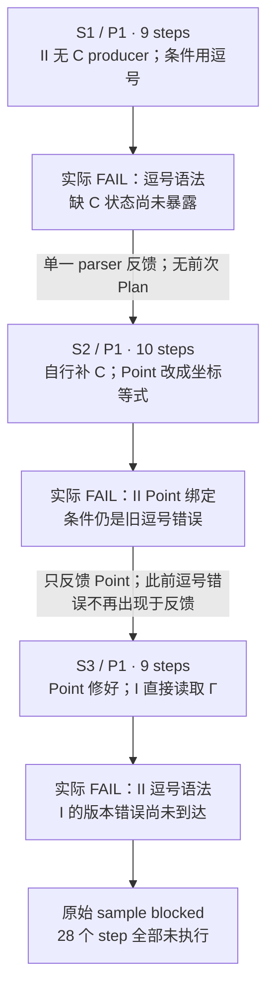
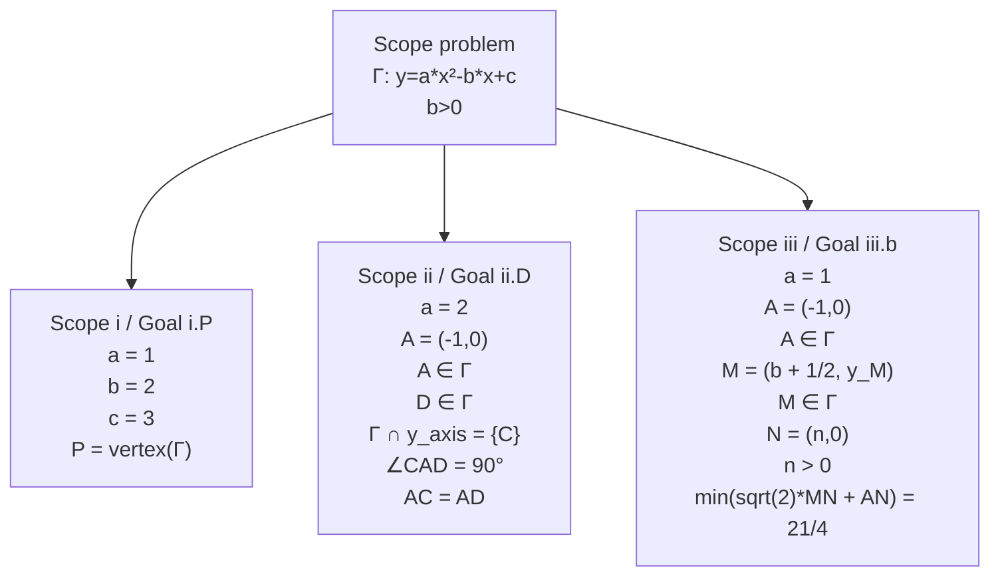
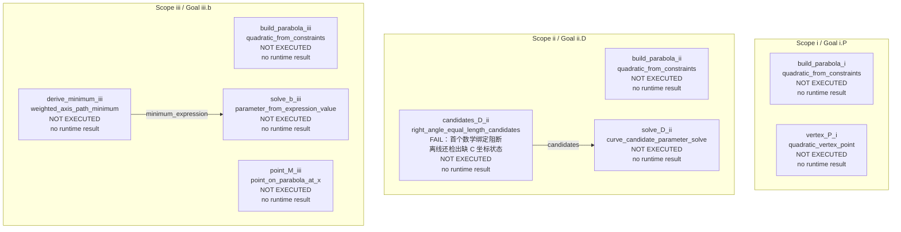
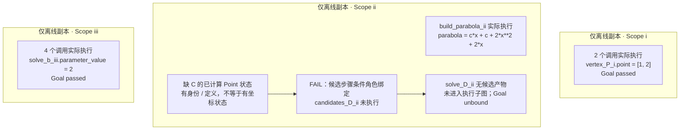
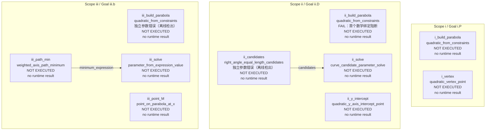
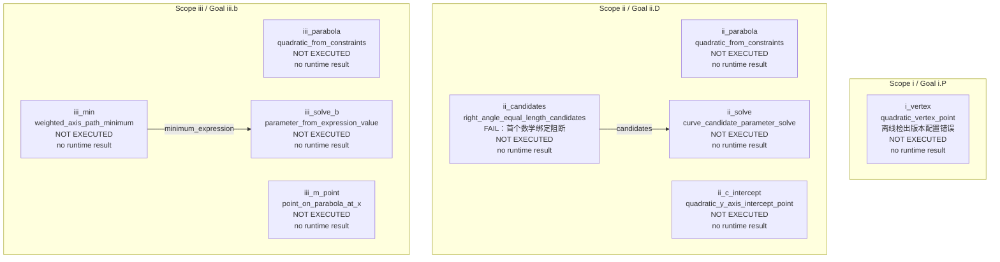
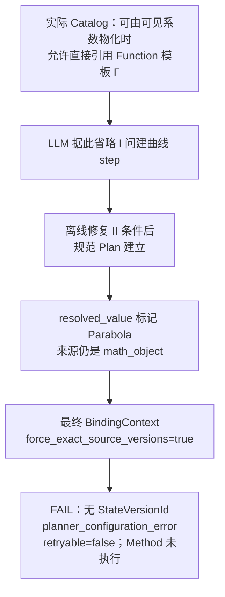
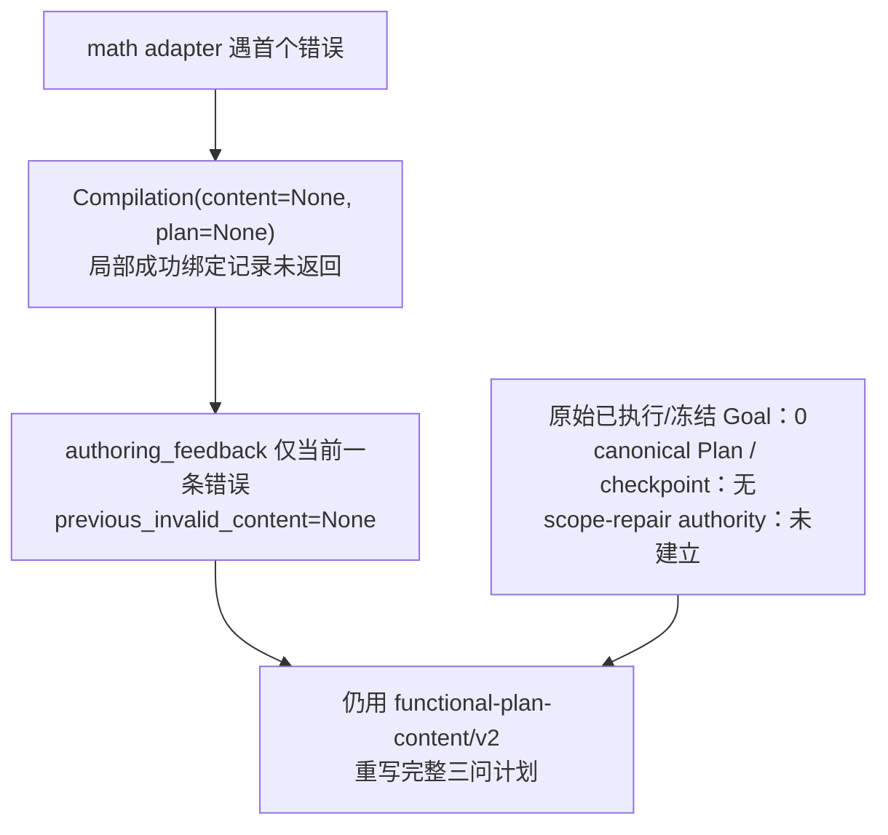
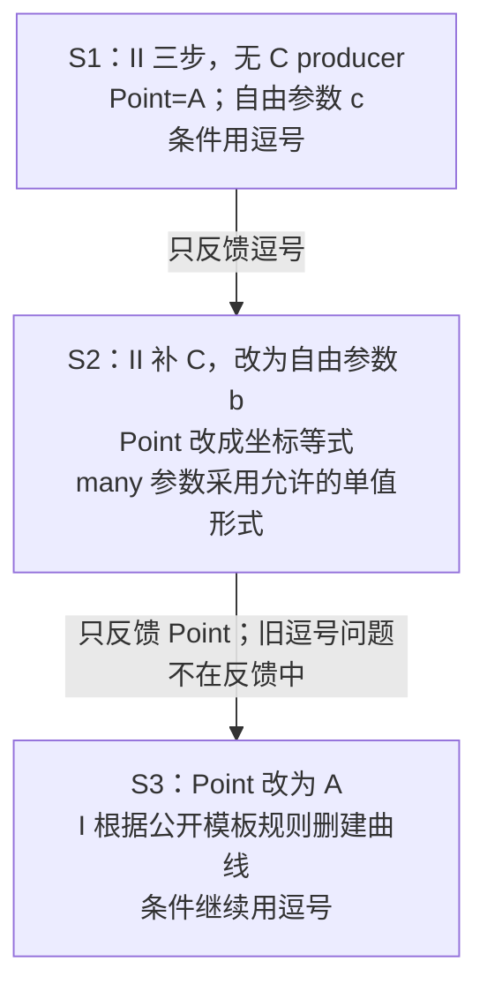

# 河西一模 / 数学参数 sample 3 故障审查

依据[《LLM Sample 故障审查指南》](../../../llm-sample-failure-review-guide.md)，逐轮检查 `tj-2026-hexi-yimo-25 / math / 3`。区分原始三轮、离线修正副本及旧编码对照；不把离线运行状态补写成原始结果。本次不修改生产代码，不新增模型调用。

## 结论

**本 sample 不仅有数学表达和反馈问题，还被它们遮蔽了两个性质不同的问题。** 第一轮缺 C 的可见坐标状态，是计划缺少状态生产步骤；第三轮按照公开契约直接读取 Γ，则暴露了模板物化与最终版本记录之间的配置错误，不能都归为“LLM 少写一步”。

- 原始 S1/S2/S3 分别 9、10、9 个 step，共 **28 个 step 全部 NOT EXECUTED**。原始首个错误依次是逗号条件、Point 坐标等式、逗号条件。三轮均为完整 JSON、`finish_reason=stop`，每轮一个 provider attempt。
- S1 离线只修条件后，得到 `functional.condition_role_state_unavailable`，对象 C、角色 reference；新增显式 C 状态 producer 后通过。
- S2 自行补上了 C producer，却新引入 II、III 两处 Point 坐标等式。离线同时修两个点和条件字符串后通过；单值形式的 many 参数不是错误。
- S3 自行修对 Point，却按 Catalog 的模板物化说明省略 I 问建曲线步骤。离线修条件后，在最终 BindingContext 阶段出现非 retryable 的 `planner.functional_arg_version_drift`。
- S3 换成旧对象引用编码后，**canonical Plan 完全相同、异常及失败现场也完全相同**。显式加回 I 问建曲线步骤能绕过该路径，但这不等于模板直读契约已经正确实现。

真实最终状态仍为 `blocked`：3 次 semantic attempt、3 次 provider attempt、2 次语义重试，83,193 tokens，169.33 秒。单轮耗时未保存，不均摊推算。[原始结果副本](original-result.json)、[完整审计](analysis.json)

## 证据与轮次总览

原始证据目录：[math/3](../../../../internal/solver-runs/method-math-arguments-20260917/live/tj-2026-hexi-yimo-25/math/3)。以下阅读副本由 artifact 无改写提取。

| 轮次 | 实际输入 | 原始输出 | 阶段与错误 |
|---|---|---|---|
| S1 / P1 | [system](attempt-1.prompt.system.md)、[user](attempt-1.prompt.user.md)、[上下文](attempt-1.context.json) | [原文](attempt-1.raw-response.txt)、[完整 steps](attempt-1.steps.json)、[reasoning](attempt-1.reasoning.txt) | [索引](../../../../internal/solver-runs/method-math-arguments-20260917/live/tj-2026-hexi-yimo-25/math/3/attempt-1.evidence-index.json)、[原错误](../../../../internal/solver-runs/method-math-arguments-20260917/live/tj-2026-hexi-yimo-25/math/3/attempt-1.attempt-error.json)、[复用/执行](../../../../internal/solver-runs/method-math-arguments-20260917/live/tj-2026-hexi-yimo-25/math/3/attempt-1.reuse.json) |
| S2 / P1 | [system](attempt-2.prompt.system.md)、[user](attempt-2.prompt.user.md)、[上下文](attempt-2.context.json) | [原文](attempt-2.raw-response.txt)、[完整 steps](attempt-2.steps.json)、[reasoning](attempt-2.reasoning.txt) | [索引](../../../../internal/solver-runs/method-math-arguments-20260917/live/tj-2026-hexi-yimo-25/math/3/attempt-2.evidence-index.json)、[原错误](../../../../internal/solver-runs/method-math-arguments-20260917/live/tj-2026-hexi-yimo-25/math/3/attempt-2.attempt-error.json)、[复用/执行](../../../../internal/solver-runs/method-math-arguments-20260917/live/tj-2026-hexi-yimo-25/math/3/attempt-2.reuse.json) |
| S3 / P1 | [system](attempt-3.prompt.system.md)、[user](attempt-3.prompt.user.md)、[上下文](attempt-3.context.json) | [原文](attempt-3.raw-response.txt)、[完整 steps](attempt-3.steps.json)、[reasoning](attempt-3.reasoning.txt) | [索引](../../../../internal/solver-runs/method-math-arguments-20260917/live/tj-2026-hexi-yimo-25/math/3/attempt-3.evidence-index.json)、[原错误](../../../../internal/solver-runs/method-math-arguments-20260917/live/tj-2026-hexi-yimo-25/math/3/attempt-3.attempt-error.json)、[复用/执行](../../../../internal/solver-runs/method-math-arguments-20260917/live/tj-2026-hexi-yimo-25/math/3/attempt-3.reuse.json) |

每轮 16 个已保存角色的 SHA-256 与索引一致；实际 provider messages 与 request messages 一致。三轮 raw parsed payload 等于保存的 `normalized-content`，是 adapter 早退时的原 payload 副本，不是成功归一的规范计划；`math-argument-bindings=[]`，canonical Plan、事务、运行结果、checkpoint 等均为 `not_available`。

离线复现使用同一冻结输入与绑定目录；运行时代码与真实批次只差局部 import 排序，见[冻结差异审计](../code-freeze-audit.json)。三轮原诊断均已重新精确复现，原样本文件未覆盖。

| Semantic / Provider | 输入 tokens | reasoning tokens | 可见 tokens¹ | total tokens | cache hit / miss | steps |
|---|---:|---:|---:|---:|---|---:|
| S1 / P1 | 13,609 | 11,373 | 634 | 25,616 | 13,440 / 169 | 9 |
| S2 / P1 | 13,671 | 10,494 | 696 | 24,861 | 9,728 / 3,943 | 10 |
| S3 / P1 | 13,683 | 18,285 | 748 | 32,716 | 9,728 / 3,955 | 9 |

¹ 可见 tokens = provider completion_tokens − reasoning_tokens；这是由 provider 数据计算的差值。

| 轮次 | system 字符 / 字节 | user 字符 / 字节 | reasoning 字符 | 可见输出字符 |
|---|---|---|---:|---:|
| S1 | 3,165 / 5,785 | 37,815 / 49,849 | 29,744 | 2,159 |
| S2 | 3,165 / 5,785 | 38,020 / 50,056 | 25,648 | 2,163 |
| S3 | 3,165 / 5,785 | 38,059 / 50,093 | 46,857 | 2,367 |

三轮请求模型 `deepseek-v4-flash`，响应模型名 `deepseek-flash`；thinking enabled、effort low、timeout 120 秒、response_format `json_object`。没有显式 temperature/max_tokens；Schema 放在 user 文本中。第三轮 reasoning 增长到 18,285 tokens，但仍正常返回 JSON，不能写成 length 超限或 provider 卡死。



## 三轮实际上下文



| 实际 user 段 | S1 字符 | S2 字符 | S3 字符 |
|---|---:|---:|---:|
| Problem Planning Context | 859 | 859 | 859 |
| Plan Authority Frame | 407 | 407 | 407 |
| Strategy Principles | 469 | 469 | 469 |
| Functional Capability Catalog | 22557 | 22557 | 22557 |
| FunctionalPlan Content Mechanism Example | 833 | 833 | 833 |
| Full-plan Validation Feedback | 97 | 302 | 341 |
| Authority-bound Output JSON Schema | 12523 | 12523 | 12523 |

user 开头短指令另计。system 三轮相同；user 变化仅在 Validation Feedback 段。全部三组 sample 的首轮 system/user/Catalog/Schema 哈希一致，完整值保存在 analysis.json。

<details><summary>实际 Scope / Goal authority frame</summary>

```json
{
  "root_scope": {
    "children": [
      {
        "goal_refs": [
          "i.P"
        ],
        "scope_ref": "i"
      },
      {
        "goal_refs": [
          "ii.D"
        ],
        "scope_ref": "ii"
      },
      {
        "goal_refs": [
          "iii.b"
        ],
        "scope_ref": "iii"
      }
    ],
    "scope_ref": "problem"
  },
  "goal_answers": {
    "i.P": {
      "target_ref": "P",
      "answer_type": "Point"
    },
    "ii.D": {
      "target_ref": "D",
      "answer_type": "Point"
    },
    "iii.b": {
      "target_ref": "b",
      "answer_type": "ParameterValue"
    }
  }
}
```

</details>

兄弟问共享原 Scope/Goal frame；同名 A 的来源按各自 Scope 解析。模型没有收到内部 BindingCatalog。三轮实际 Prompt 都没有 `∧`，机制示例只覆盖 weighted-axis-path-minimum。单个 `right_angle_equal_length` 参数如何组合两个题设 facts 没有说明，详见 [relevant-catalog.json](relevant-catalog.json)。

另一个决定性契约是 `quadratic_vertex_point.args.parabola.role`：公开说明允许在代码能由可见系数确定性物化到要求边界时直接引用题面 Function 模板。I 问可见 a=1、b=2、c=3；审查必须据此判断 S3 的选择，不能事后添加“必须先写建曲线 step”的隐藏要求。

## Attempt 1：逗号阻断遮蔽了缺 C 状态

### 输入、thinking 与原始输出

输入无 feedback。第 12、18 行规划用 c 保留 II 问开放状态；第 22–36 行直接从建曲线跳到候选与筛选，没有 C 坐标 producer；第 324 行猜测两个事实可用逗号合成。[reasoning](attempt-1.reasoning.txt)

实际错误：

```json
{
  "code": "functional.math_argument_invalid",
  "path": "$.goal_plans.ii.D.steps[1].args.right_angle_equal_length",
  "message": "notation.expected: expected ∈, got =",
  "retryable": true,
  "details": {
    "diagnostics": [
      {
        "code": "functional.math_argument_invalid",
        "path": "$.goal_plans.ii.D.steps[1].args.right_angle_equal_length",
        "message": "notation.expected: expected ∈, got ="
      }
    ]
  }
}
```

图按原 Scope / Goal 分组；实线仅为 raw 中明确的 `{step_id, return}` 引用，不代表已经建立 runtime DAG。具名对象仍保留在 JSON 中。



<details><summary>S1 原始完整 JSON：9 个 step，全部参数、输出目标与 answer_from</summary>

```json
{
  "format": "functional-plan-content/v2",
  "goal_plans": {
    "i.P": {
      "answer_from": {
        "step_id": "vertex_P_i",
        "return": "point"
      },
      "steps": [
        {
          "step_id": "build_parabola_i",
          "capability_id": "quadratic_from_constraints",
          "args": {
            "known_coefficients": [
              "a=1",
              "b=2",
              "c=3"
            ]
          },
          "output_targets": {
            "parabola": "Γ"
          },
          "return_expectations": {
            "parabola": "closed_state"
          }
        },
        {
          "step_id": "vertex_P_i",
          "capability_id": "quadratic_vertex_point",
          "args": {
            "parabola": "Γ"
          },
          "return_expectations": {
            "point": "closed_state"
          }
        }
      ]
    },
    "ii.D": {
      "answer_from": {
        "step_id": "solve_D_ii",
        "return": "selected_curve_point"
      },
      "steps": [
        {
          "step_id": "build_parabola_ii",
          "capability_id": "quadratic_from_constraints",
          "args": {
            "known_coefficients": [
              "a=2"
            ],
            "curve_point": "A",
            "free_parameters": [
              "c"
            ]
          },
          "output_targets": {
            "parabola": "Γ"
          },
          "return_expectations": {
            "parabola": "open_state"
          }
        },
        {
          "step_id": "candidates_D_ii",
          "capability_id": "right_angle_equal_length_candidates",
          "args": {
            "target": "D",
            "right_angle_equal_length": "∠CAD = 90°, AC = AD"
          }
        },
        {
          "step_id": "solve_D_ii",
          "capability_id": "curve_candidate_parameter_solve",
          "args": {
            "candidates": {
              "step_id": "candidates_D_ii",
              "return": "candidates"
            },
            "parabola": "Γ",
            "target_point": "D",
            "point_on_curve": "D∈Γ",
            "symbol_constraint": "b>0"
          },
          "return_expectations": {
            "selected_curve_point": "closed_state"
          }
        }
      ]
    },
    "iii.b": {
      "answer_from": {
        "step_id": "solve_b_iii",
        "return": "parameter_value"
      },
      "steps": [
        {
          "step_id": "build_parabola_iii",
          "capability_id": "quadratic_from_constraints",
          "args": {
            "known_coefficients": [
              "a=1"
            ],
            "curve_point": "A",
            "free_parameters": [
              "b"
            ]
          },
          "output_targets": {
            "parabola": "Γ"
          },
          "return_expectations": {
            "parabola": "open_state"
          }
        },
        {
          "step_id": "point_M_iii",
          "capability_id": "point_on_parabola_at_x",
          "args": {
            "parabola": "Γ"
          },
          "output_targets": {
            "point": "M"
          },
          "return_expectations": {
            "point": "open_state"
          }
        },
        {
          "step_id": "derive_minimum_iii",
          "capability_id": "weighted_axis_path_minimum",
          "args": {
            "path_minimum_target": "min(sqrt(2)*MN+AN)"
          },
          "return_expectations": {
            "minimum_expression": "open_expression"
          }
        },
        {
          "step_id": "solve_b_iii",
          "capability_id": "parameter_from_expression_value",
          "args": {
            "expression": {
              "step_id": "derive_minimum_iii",
              "return": "minimum_expression"
            },
            "minimum_value": "min(sqrt(2)*MN+AN)=21/4",
            "parameter": "b"
          }
        }
      ]
    }
  }
}
```

</details>

原始首个错误来自顶层逗号进入 `A,B∈Γ` 的成员列表分支，`expr(21)` 只读 AC，随后 `take(∈)` 遇到 `=`。[parser](../../../../server/shuxueshuo_server/problem_understanding/notation_parser.py:152) 这是复合条件文法问题，不是角度必须属于某个集合。S2 实际仅收到以下错误，没有 C 状态信息，也没有 previous Plan。

```json
[
  {
    "code": "functional.math_argument_invalid",
    "path": "$.goal_plans.ii.D.steps[1].args.right_angle_equal_length",
    "message": "notation.expected: expected ∈, got =",
    "details": {
      "diagnostic_id": "c0410fcd272e6e4d"
    }
  }
]
```

### 离线修掉表达后，独立问题才出现

只替换条件字符串为 `∠CAD=90° ∧ AC=AD`，绑定到 II 原 facts[5]/facts[6]，随后在条件角色解析阶段报：

```json
{
  "code": "functional.condition_role_state_unavailable",
  "stage": "reconciliation_binding",
  "subjects": [{"ref": "C", "role": "reference", "expected_type": "Point"}],
  "repair_action": "provide_visible_state_producer",
  "scope_id": "ii",
  "step_id": "candidates_D_ii"
}
```

C 的题面身份和“Γ 与 y 轴交点”定义是可见的，但 `right_angle_equal_length_candidates` 的 reference 角色要求已计算的 Point 坐标状态。`latest_point_state_for_object(C)` 未找到该状态，原条件 resolver 发出 typed diagnostic；它没有替模型增加求 C 的方法。[代码](../../../../server/shuxueshuo_server/solver/runtime/functional_condition_context_resolvers.py:250)、[离线诊断](offline-probes/attempt-1-expression-only/result.json)

这个离线副本实际执行了 7 个调用：I 问两步、II 问建曲线、III 问四步。I/III 的 Goal passed，II 的 Goal unbound。`failed_call_ids` 与 `blocked_call_ids` 均为空，因为两个无法建立的 II 调用没有进入可执行子图；不能称为两个 Method runtime 失败。[离线 transaction](offline-probes/attempt-1-expression-only/attempt-1.transaction.json)、[离线 reuse](offline-probes/attempt-1-expression-only/attempt-1.reuse.json)



图中值逐字来自该离线 transaction，不来自原始运行或 LLM 手算。补一个 `quadratic_y_axis_intercept_point`，输入 Γ、输出目标 C 后，完整答案通过；保持自由参数 c，未重写为 b。旧对象编码复现同一缺 C 诊断及同一 canonical Plan。[补 C 实验](offline-probes/attempt-1-add-c-state/result.json)、[双编码对照](encoding-controls.json)

本轮责任：表达契约/诊断造成原始首阻断；缺 C 状态是独立的计划依赖缺口。模型将题面定义当成可用坐标状态，Catalog 对条件内角色的状态需求也应更明确。不能在报告中伪造原始部分成功。

## Attempt 2：自行补 C，却回退到错误的 Point 表达

### 输入、thinking 与输出

输入只有 S1 逗号错误。第 1、11–17、77、224 行反复猜是空格或角度符号问题，最终继续用逗号；第 79 行独立意识到 C 必须先有坐标，新增截距 step。与此同时，第 9 行又把曲线点写成 `A=(-1,0)`。[reasoning](attempt-2.reasoning.txt)

实际错误：

```json
{
  "code": "functional.math_argument_unresolved",
  "path": "$.goal_plans.ii.D.steps[0].args.curve_points",
  "message": "quadratic_from_constraints.curve_points: 'A=(-1,0)' matches 0 visible typed sources.",
  "retryable": true,
  "details": {
    "diagnostics": [
      {
        "code": "functional.math_argument_unresolved",
        "path": "$.goal_plans.ii.D.steps[0].args.curve_points",
        "message": "quadratic_from_constraints.curve_points: 'A=(-1,0)' matches 0 visible typed sources."
      }
    ]
  }
}
```

图按原 Scope / Goal 分组；实线仅为 raw 中明确的 `{step_id, return}` 引用，不代表已经建立 runtime DAG。具名对象仍保留在 JSON 中。



<details><summary>S2 原始完整 JSON：10 个 step，全部参数、输出目标与 answer_from</summary>

```json
{
  "format": "functional-plan-content/v2",
  "goal_plans": {
    "i.P": {
      "answer_from": {
        "step_id": "i_vertex",
        "return": "point"
      },
      "steps": [
        {
          "step_id": "i_build_parabola",
          "capability_id": "quadratic_from_constraints",
          "args": {
            "known_coefficients": [
              "a=1",
              "b=2",
              "c=3"
            ],
            "free_parameters": []
          },
          "intent": "由已知系数建立闭合抛物线"
        },
        {
          "step_id": "i_vertex",
          "capability_id": "quadratic_vertex_point",
          "args": {
            "parabola": "Γ"
          },
          "output_targets": {
            "point": "P"
          },
          "intent": "求抛物线顶点P"
        }
      ]
    },
    "ii.D": {
      "answer_from": {
        "step_id": "ii_solve",
        "return": "selected_curve_point"
      },
      "steps": [
        {
          "step_id": "ii_build_parabola",
          "capability_id": "quadratic_from_constraints",
          "args": {
            "known_coefficients": "a=2",
            "curve_points": "A=(-1,0)",
            "free_parameters": [
              "b"
            ]
          },
          "intent": "由a=2和A在抛物线上建立含参抛物线"
        },
        {
          "step_id": "ii_y_intercept",
          "capability_id": "quadratic_y_axis_intercept_point",
          "args": {
            "quadratic": "Γ"
          },
          "output_targets": {
            "point": "C"
          },
          "intent": "求y轴交点C"
        },
        {
          "step_id": "ii_candidates",
          "capability_id": "right_angle_equal_length_candidates",
          "args": {
            "target": "D",
            "right_angle_equal_length": "∠CAD=90°,AC=AD"
          },
          "intent": "由直角等腰关系生成D的候选点"
        },
        {
          "step_id": "ii_solve",
          "capability_id": "curve_candidate_parameter_solve",
          "args": {
            "candidates": {
              "step_id": "ii_candidates",
              "return": "candidates"
            },
            "parabola": "Γ",
            "target_point": "D",
            "point_on_curve": "D∈Γ"
          },
          "output_targets": {
            "selected_curve_point": "D"
          },
          "intent": "用抛物线筛选D并反求参数"
        }
      ]
    },
    "iii.b": {
      "answer_from": {
        "step_id": "iii_solve",
        "return": "parameter_value"
      },
      "steps": [
        {
          "step_id": "iii_build_parabola",
          "capability_id": "quadratic_from_constraints",
          "args": {
            "known_coefficients": "a=1",
            "curve_points": "A=(-1,0)",
            "free_parameters": [
              "b"
            ]
          },
          "intent": "由a=1和A在抛物线上建立含参抛物线"
        },
        {
          "step_id": "iii_point_M",
          "capability_id": "point_on_parabola_at_x",
          "args": {
            "parabola": "Γ"
          },
          "output_targets": {
            "point": "M"
          },
          "intent": "由M的结构化横坐标求M坐标"
        },
        {
          "step_id": "iii_path_min",
          "capability_id": "weighted_axis_path_minimum",
          "args": {
            "path_minimum_target": "min(sqrt(2)*MN+AN)"
          },
          "intent": "求加权路径的最小值表达式"
        },
        {
          "step_id": "iii_solve",
          "capability_id": "parameter_from_expression_value",
          "args": {
            "expression": {
              "step_id": "iii_path_min",
              "return": "minimum_expression"
            },
            "minimum_value": "min(sqrt(2)*MN+AN)=21/4",
            "parameter": "b"
          },
          "output_targets": {
            "parameter_value": "b"
          },
          "intent": "由给定最小值反求b"
        }
      ]
    }
  }
}
```

</details>

实际最早失败在 `$.goal_plans.ii.D.steps[0].args.curve_points`，注意此处没有 `[0]`：模型用了单个字符串。parser 可解析该等式，但绑定层要求 Point，不能将条件 AST 与可见点 A 的对象表达唯一匹配。

**单个字符串不是基数错误。** 实际公开 Schema 允许 many 参数的单值 wire 形式；本轮独立 Schema 校验通过。只将两处 `A=(-1,0)` 改成 `A`，仍能沿用既有基数处理；再修复条件连接符后整题通过，不需要额外改成数组。

II、III 的 Point 错误和逗号条件是独立问题：只修点仍报逗号，只修条件仍报 Point。原始运行只向 S3 反馈第一处 Point，已经持续两轮的逗号问题不再出现在 feedback 中。

```json
[
  {
    "code": "functional.math_argument_unresolved",
    "path": "$.goal_plans.ii.D.steps[0].args.curve_points",
    "message": "quadratic_from_constraints.curve_points: 'A=(-1,0)' matches 0 visible typed sources.",
    "details": {
      "diagnostic_id": "feeddb5d1d5df974"
    }
  }
]
```

本轮责任：模型在完整重写中补上一个真实缺失步骤，却引入了两处参数类型问题；代码继续只报首错、丢失前次草稿及其他独立诊断。C 的补齐来自本轮 thinking 自行推断，不是收到过缺 C 反馈。

## Attempt 3：Point 修好，模板直读暴露独立配置错误

### 输入、thinking 与原始输出

输入只有 Point 反馈。第 23 行正确解释 Point 应传 `A`；第 43、45 行引用 Catalog 的函数模板物化说明，决定 I 问直接调用 `quadratic_vertex_point(Γ)`，省略建曲线步骤；第 58–60 行重新猜测两个几何 facts 可用逗号。[reasoning](attempt-3.reasoning.txt)

实际错误：

```json
{
  "code": "functional.math_argument_invalid",
  "path": "$.goal_plans.ii.D.steps[2].args.right_angle_equal_length",
  "message": "notation.expected: expected ∈, got =",
  "retryable": true,
  "details": {
    "diagnostics": [
      {
        "code": "functional.math_argument_invalid",
        "path": "$.goal_plans.ii.D.steps[2].args.right_angle_equal_length",
        "message": "notation.expected: expected ∈, got ="
      }
    ]
  }
}
```

图按原 Scope / Goal 分组；实线仅为 raw 中明确的 `{step_id, return}` 引用，不代表已经建立 runtime DAG。具名对象仍保留在 JSON 中。



<details><summary>S3 原始完整 JSON：9 个 step，全部参数、输出目标与 answer_from</summary>

```json
{
  "format": "functional-plan-content/v2",
  "goal_plans": {
    "i.P": {
      "answer_from": {
        "step_id": "i_vertex",
        "return": "point"
      },
      "steps": [
        {
          "step_id": "i_vertex",
          "capability_id": "quadratic_vertex_point",
          "args": {
            "parabola": "Γ"
          },
          "return_expectations": {
            "point": "closed_state"
          },
          "intent": "求抛物线 Γ 的顶点 P"
        }
      ]
    },
    "ii.D": {
      "answer_from": {
        "step_id": "ii_solve",
        "return": "selected_curve_point"
      },
      "steps": [
        {
          "step_id": "ii_parabola",
          "capability_id": "quadratic_from_constraints",
          "args": {
            "known_coefficients": [
              "a = 2"
            ],
            "curve_points": [
              "A"
            ],
            "free_parameters": [
              "b"
            ]
          },
          "output_targets": {
            "parabola": "Γ"
          },
          "return_expectations": {
            "parabola": "open_state"
          },
          "intent": "由 a=2 和 A∈Γ 建立含参数 b 的抛物线状态"
        },
        {
          "step_id": "ii_c_intercept",
          "capability_id": "quadratic_y_axis_intercept_point",
          "args": {
            "quadratic": "Γ"
          },
          "output_targets": {
            "point": "C"
          },
          "return_expectations": {
            "point": "open_state"
          },
          "intent": "求抛物线与 y 轴交点 C"
        },
        {
          "step_id": "ii_candidates",
          "capability_id": "right_angle_equal_length_candidates",
          "args": {
            "right_angle_equal_length": "∠CAD = 90°, AC = AD",
            "target": "D"
          },
          "intent": "由直角等腰条件生成候选点 D"
        },
        {
          "step_id": "ii_solve",
          "capability_id": "curve_candidate_parameter_solve",
          "args": {
            "candidates": {
              "step_id": "ii_candidates",
              "return": "candidates"
            },
            "parabola": "Γ",
            "point_on_curve": "D ∈ Γ",
            "symbol_constraint": "b > 0",
            "target_point": "D"
          },
          "return_expectations": {
            "selected_curve_point": "closed_state"
          },
          "intent": "用 D∈Γ 和 b>0 筛选候选并反求参数"
        }
      ]
    },
    "iii.b": {
      "answer_from": {
        "step_id": "iii_solve_b",
        "return": "parameter_value"
      },
      "steps": [
        {
          "step_id": "iii_parabola",
          "capability_id": "quadratic_from_constraints",
          "args": {
            "known_coefficients": [
              "a = 1"
            ],
            "curve_points": [
              "A"
            ],
            "free_parameters": [
              "b"
            ]
          },
          "output_targets": {
            "parabola": "Γ"
          },
          "return_expectations": {
            "parabola": "open_state"
          },
          "intent": "由 a=1 和 A∈Γ 建立含参数 b 的抛物线状态"
        },
        {
          "step_id": "iii_m_point",
          "capability_id": "point_on_parabola_at_x",
          "args": {
            "parabola": "Γ"
          },
          "output_targets": {
            "point": "M"
          },
          "return_expectations": {
            "point": "open_state"
          },
          "intent": "由 M 的结构化横坐标求 M 的含参坐标"
        },
        {
          "step_id": "iii_min",
          "capability_id": "weighted_axis_path_minimum",
          "args": {
            "path_minimum_target": "min(sqrt(2)*MN + AN)"
          },
          "return_expectations": {
            "minimum_expression": "open_expression"
          },
          "intent": "求加权路径最小值表达式"
        },
        {
          "step_id": "iii_solve_b",
          "capability_id": "parameter_from_expression_value",
          "args": {
            "expression": {
              "step_id": "iii_min",
              "return": "minimum_expression"
            },
            "minimum_value": "min(sqrt(2)*MN + AN) = 21/4",
            "parameter": "b"
          },
          "intent": "由给定最小值反求参数 b"
        }
      ]
    }
  }
}
```

</details>

原始运行仍先在 II 的逗号条件失败，所有 9 个 step 都未执行。I 问的版本错误仅在下述离线副本里暴露，不能替代原始首个错误。

### 配置错误的精确现场与双编码证明

离线只修条件字符串后，content compiler 能建立规范 Plan；在 `_PlacementLivenessProjectionStage` 建立最终 BindingContext 时抛出：

```text
planner_configuration_error: planner.functional_arg_version_drift:
materialized arg i_vertex.parabola[0] has no StateVersionId
```

捕获的失败现场：

```json
{
  "call_id": "i_vertex",
  "arg_name": "parabola",
  "requires_materialized_state": true,
  "force_exact_source_versions": true,
  "debug_materialized_value": false,
  "source": {"kind": "math_object", "math_object_id": {"value": "function:problem:parabola"}},
  "resolved_value": {"runtime_type": "Function", "materialized_runtime_type": "Parabola"}
}
```

可见输入被标记为可物化成 Parabola，但来源仍是函数对象身份，没有 StateVersionId。存在 ProblemBindingCatalog 时，最终阶段强制精确来源版本；`debug_materialized_value` 因此不能替代版本记录，触发原配置检查。这说明问题位于公开模板直读路径与最终状态版本约束之间，不能靠放松版本断言解决。[最终阶段](../../../../server/shuxueshuo_server/solver/runtime/functional_plan_reconciliation.py:2456)、[版本检查](../../../../server/shuxueshuo_server/solver/runtime/functional_binding_context.py:866)、[完整 traceback](offline-probes/attempt-3-expression-only/exception-traceback.txt)



把同一内容转换为旧对象引用后，两个 canonical Plan 的 SHA-256 同为 `29b270639069fa5bcc8612532f481b8c5f31092104be5f45231f56660d3557ad`；异常类型、错误字符串、失败现场完全相同。[对照断言](encoding-controls.json)、[旧编码异常](offline-probes/attempt-3-source-ref/result.json)

结论限定在**同一冻结输入与绑定目录下的两种编码**，不外推为所有历史入口都有相同配置。这里不能让 LLM 继续猜内部 StateVersionId；异常本身 `retryable=false / repair_action=fix_runtime_contract`，沿用配置错误停止语义重试的规则。

离线显式加回 I 问建曲线步骤后通过，证明可用另一条公开方法路径建立版本；它只是绕过模板直读问题，**不是修复该配置缺陷的证据**。[显式 producer 对照](offline-probes/attempt-3-add-i-state/result.json)

本轮责任：逗号依旧是新数学表达契约与反馈的首阻断；I 问选择有公开规则及 thinking 支持。最终版本账本不接纳这条物化路径属于独立代码契约问题，两种编码都会触发，不能统一归为模型漏步骤。

## Retry authority、轮间差异与错误分类



依据：[提前返回](../../../../server/shuxueshuo_server/solver/runtime/functional_plan_content.py:912)、[previous_invalid_content 来源](../../../../server/shuxueshuo_server/solver/runtime/functional_scope_retry.py:1095)、[原协议分支](../../../../server/shuxueshuo_server/solver/runtime/functional_scope_retry.py:940)。

原始三轮都没有可执行 Plan 或 checkpoint，所以持续使用 content/v2；不能伪造 frozen/solved Goal。S1 的独立缺 C、S3 的独立配置错误都未发给真实模型。离线 S1 的部分成功只属于实验副本，也没有触发新的真实 scope repair 请求。



| 类别 | S1 | S2 | S3 |
|---|---|---|---|
| 原始首个阻断 | II 逗号语法 | II Point 表达 | II 逗号语法 |
| 独立问题 | 缺 C 的 Point 状态 | III Point；逗号条件 | 模板直读无 StateVersionId |
| 原始 runtime 级联 | 无，未执行 | 无，未执行 | 无，未执行 |
| 离线修表达后的行为 | 部分调用执行，II 不能建立 | 全部通过 | reconciliation 配置异常，停止 |
| 应修复的位置 | 计划 producer + 表达契约 | 表达契约与多错反馈 | 表达契约 + 模板状态版本接入 |

## 离线反事实、同题对照与后续范围

共 9 组本地录制响应实验，0 次模型调用。[全部逐项改动与结果](counterfactual-results.json)

| 原响应 | 副本变更 | 离线结果 | 证据 |
|---|---|---|---|
| S1 | 修表达 + 新增显式 C producer | accepted，三问答案核验通过 | [完整改动/结果](offline-probes/attempt-1-add-c-state/result.json) |
| S1 | 修正全部错误数学表达 | 仍阻断，具体独立错误见本轮分析 | [完整改动/结果](offline-probes/attempt-1-expression-only/result.json) |
| S1 | 修表达后转换为旧对象引用编码 | 仍阻断，具体独立错误见本轮分析 | [完整改动/结果](offline-probes/attempt-1-source-ref/result.json) |
| S2 | 只修直角等长条件 | 仍阻断，具体独立错误见本轮分析 | [完整改动/结果](offline-probes/attempt-2-angle-only/result.json) |
| S2 | 修正全部错误数学表达 | accepted，三问答案核验通过 | [完整改动/结果](offline-probes/attempt-2-expression-only/result.json) |
| S2 | 只修 Point | 仍阻断，具体独立错误见本轮分析 | [完整改动/结果](offline-probes/attempt-2-point-only/result.json) |
| S3 | 修表达 + 新增显式 I 问曲线 producer | accepted，三问答案核验通过 | [完整改动/结果](offline-probes/attempt-3-add-i-state/result.json) |
| S3 | 修正全部错误数学表达 | 配置异常：无 StateVersionId（非 retryable） | [完整改动/结果](offline-probes/attempt-3-expression-only/result.json) |
| S3 | 修表达后转换为旧对象引用编码 | 配置异常：无 StateVersionId（非 retryable） | [完整改动/结果](offline-probes/attempt-3-source-ref/result.json) |

这些结果只描述对应响应副本；不修改真实成功率，也不表示新 Prompt 经真实调用验证。除表中明确新增 producer 的两个模式外，实验保留全部原方法、步骤、Scope、Goal、结果引用和自由参数基底。

所有样本首轮 Prompt、模型配置、Catalog、Schema 都相同。sample 3 首轮选择省略 C producer，与 sample 2 第 31、37 行主动补 C 的思路不同；第三轮则根据公开模板规则省略 I 建曲线。这些差异必须按依赖及实现契约逐项判断，不能用“步骤更少”直接判错，也不能因数学表达修复成功就跳过后续状态检查。

应同时处理三层：补齐数学参数的合法表达说明与可定位诊断；保留原 authoring 草稿并反馈独立错误；使公开模板物化路径与最终版本账本一致，并用同一原始响应、两种编码回归。条件角色缺状态继续用现有 `provide_visible_state_producer`，配置错误继续 fail loud，不新增自动 Method 选择、伪造版本或放宽 Scope/retry/事务规则。

已完成全部原始哈希、实际 Prompt、28 个 step 图、原始/离线状态分离、根因/独立错误、retry authority、轮间 diff 和两个双编码对照。脚本入口：[证据复核](../hexi-remaining-reviews/analyze.py)、[响应副本实验](../hexi-remaining-reviews/counterfactual.py)、[对照校验](../hexi-remaining-reviews/verify_controls.py)。初次旧编码实验的录制文件路径错误另存于 `offline-probes/attempt-3-source-ref/setup-error.initial.*`，修正分析驱动的文件读取入口后重跑；该准备错误不计为产品错误。
