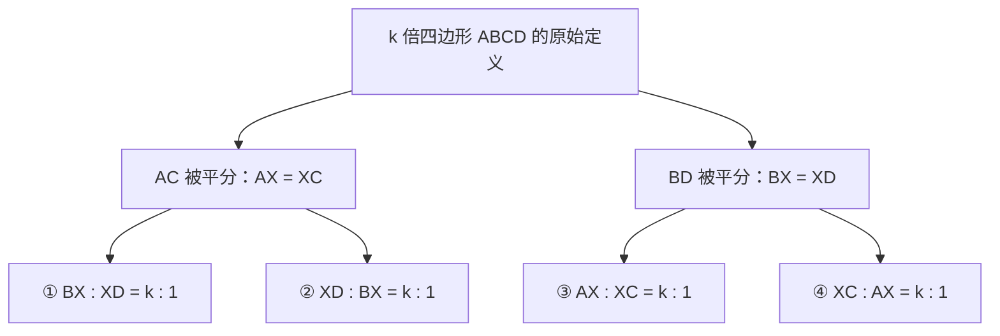
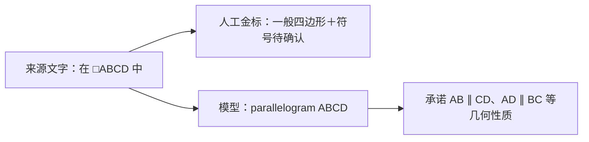
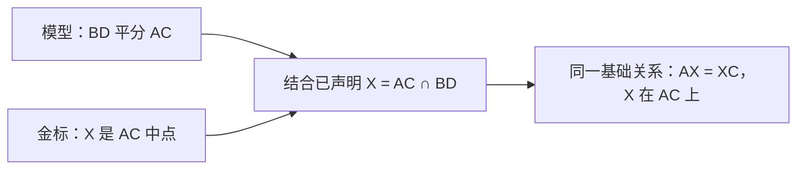

# v6 真实抽取：差异图解与推理行为复核

本分析核对冻结人工金标、完整最终 JSON、完整 reasoning_content 及比较器代码。只归纳可核查行为，不将推理文字视为题面证据。未修改实现、金标或测试结果，未新增模型调用。

## 结论修正

严格验收失败中混合了三类问题：未保留符号歧义、未遵守字面展开策略，以及比较器不支持合法等价表达。不能将全部差异称为题意抽错，更不能把 diff 的 292 个结构差异条目当成 292 个独立错误。

缺图阻断是此次正确行为，不是金标比较失败的原因。

## 1. 四分支与两分支

为比较名字统一记两条对角线交点为 X；这不是改写实际 JSON。图2/3/4的模型使用 O，图1 AECD 交点使用 P。图2/3/4均额外明确 BD 平分 AC，即 AX=XC。定义完整展开为：

|图景|当前金标要求|模型实际|
|---|---|---|
|图1 AECD|四分支|四分支，交点名 P|
|图2 ABCD|四分支＋单独的 BD 平分 AC|BD 平分 AC＋①或②|
|图3 ABCD|四分支＋单独的 BD 平分 AC|BD 平分 AC＋①或②|
|图4 ABCD|四分支，代入 k=2＋单独的 BD 平分 AC|BD 平分 AC＋①或②，比例直接用2|

数学上，在非退化且 AX=XC 的前提下，后面三图两分支与四分支可等价：若③或④成立，则 k=1；同时 BX=XD，所以①和②也成立。这些分支没有额外解。k=2 的图4中③④则与 AX=XC 不相容。

所以，这不是已证实的条件丢失；它违背的是用户此前确认的“定义只代入展开，不利用其他条件消去分支”抽取策略。若未来决定允许由代码确认等价后接受，两分支本例有依据；本次未改变验收策略或结果。

## 2. □ 与平行四边形

实际输出包含 parallelogram，只有 missing_figure，没有 ambiguous_symbol。模型将符号解释为平行四边形，并非通过缺失图形观察到两组平行边。缺图识别正确不保证符号解释同样可靠。

这不是普通 kind 换名，特殊四边形声明会增加数学约束。但人工金标对该符号采取的是保守解释，不能仅凭“与金标不同”断言原题作者一定不是平行四边形。需要更清楚的符号或用户确认；本次已经因缺图阻断。

## 3. 合法表达与比较器缺口

模型的典型表达（以同名 X 示意）为 intersection(X, AC, BD)＋diagonal_bisects(ABCD, BD, AC)。金标为 intersection(X, AC, BD)＋midpoint(X, AC)。这两组在同一非退化四边形、同一交点的语境下表示同一个平分关系。

现编译器仅检查 diagonal_bisects 的对角线合法性，再保留其 kind 和字段，未归一为 midpoint，因此会报差异。这属于代码能力缺口，不应靠迫使模型逐字模仿金标来解决。

其他差异：

- 金标另写 polygon facts；模型的 diagonal_bisects/parallelogram 已携带有序 polygon 字段。不能只因没有独立 polygon fact 就断言模型遗漏四边形，但比较器目前未统一隐含/显式声明。
- 图4金标直接使用常数2；模型使用常数2的同时，另声明 k=2 和 k≥1。该 k 没有承担额外所求，是冗余表达，不是错误答案。
- 第三问因此实体数量为金标6、实际7。comparison._aligned_candidates 的 collect 遇到任一作用域数量不同即放弃整题对齐，导致图1的 E/O 声明顺序及 P/X 辅助名差异也无法被消去。差异清单于是出现连锁噪声。

## 4. 原有问题变化

|问题|此次观察|判断|
|文字引用误当实际有图|开头即识别输入只有文字，最终四处 missing_figure|本次修复有效|
|默认 interior=true|所有实际 fact 均未填写 interior|本次修复有效|
|层级与 source_text 重复|最终 root→（1）→图1/图2，另有（2）（3）；原文不跨层重复|输出改善，组织讨论仍反复|
|局部名字与 role|使用原名，A/B fixed、C moving，其他省略；辅助名 P/O|输出改善，仍讨论命名与声明|
|OR 例外格式|全部为 kind=any_of、branches|本次消除格式问题|
|展开定义还是使用命名类型|仍反复考虑只留文字、创造专用 fact、使用基础关系；最终选基础关系|输出正确，决策负担仍在|
|抽取越界求解|未见计算所求的数值答案；但按已知平分条件收窄定义|数值求解越界改善，展开策略仍未遵守|
|推理区先写整份 JSON|未发现可解析的完整 root/schema_version 对象；仍有逐问事实与字段清单|完整重复草稿未重现，不代表无重复工作|
|把 □ 确认为平行四边形|仍发生，未记录符号歧义|未解决|

以上仅为两次单样本观察，不证明任何提示词改动单独造成效果，也不证明今后稳定成功。

## 5. 量化观察

|项目|上次简洁版|本次 v6|
|---|---:|---:|
|最终 JSON|截断|完整|
|耗时（秒）|75.477|71.779|
|推理 tokens|14,399|12,737|
|输出总 tokens（含推理）|16,384|14,977|
|推理占比|87.9%|85.0%|
|推理文本字符|31,349|25,601|
|可解析的完整 JSON 草稿|1份，6,599字符|0份|

完整草稿检测：对 reasoning_content 中每个左花括号尝试 JSONDecoder.raw_decode，只计同时包含 root/schema_version 的整题对象；不将近似 JSON 的字段清单计为完整对象。该检测不能证明内部没有其他形式的预写。

没有干预推理区预写 JSON，继续按用户指示观察；当前最明显开销仍为反复选择表达和核对字段。

## 6. 新显露的风险

1. **测试标准混合了数学语义与作者策略。** 四分支/两分支、缺失不确定项和 kind 替换不应在报告中统一叫“语义错误”。
2. **比较器正常化能力不足。** 合法的 diagonal_bisects、中点、隐含多边形与冗余参数尚不能按语义对齐；局部实体数量差异会使全题名字对齐退出。
3. **辅助交点身份的文字解释仍不可靠。** 推理归纳将 P/O 当作不同交点，但题设给 E 为 OB 中点且 O∈BD、O∈AC，可推出 P=O（非退化情形）。最终 JSON 没有写 P≠O；金标也使用独立 X，不能把单纯多取一个名字作为模型独有错误。对象身份确认仍应交给代码。
4. **缺图已经确定后仍花时间完整形式化。** 这是当前“保留完整 IR”目标造成的开销，不是服务端越过了阻断。若将来要更早停止，应另行确认缺图时是否允许仅返回题干和缺图列表；本次不改变目标。

建议优先处理比较器对明确等价关系的归一与报告分类，保留符号歧义检查；不要依据本次 diff 清单继续堆叠大量提示词规则。本次只分析，不实施新修改。
