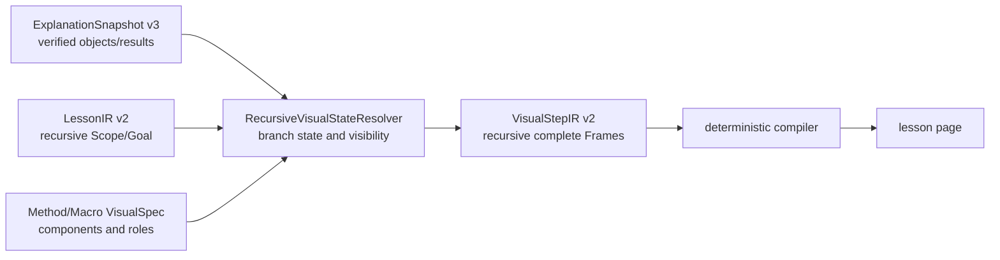
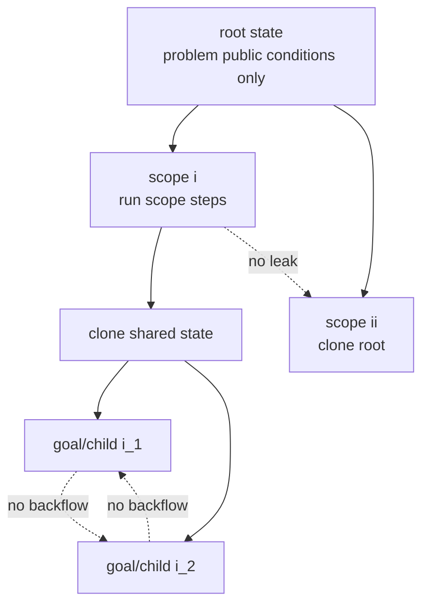

# VisualStepIR v2：递归 Scope 图形状态设计

状态：`F5-F5B4V COMPLETE`；`F5-F5C0 COMPLETE`；`F5-F5C1 PENDING ACCEPTANCE`；`G3-A/B COMPLETE (Review)`。

当前优先级以[产品服务与工作台计划](online-service-development-plan.md#11-实施顺序)为准。
G1 的 LLM 视觉选择不列为必做项；G2 新动画和配音延后。现有确定性图形及交互仍须通过回归。

阶段 4B 的学生步骤级声明与组件绑定见[专项设计](student-step-visual-binding-design.md)（待实现）。本文已有 Frame 继承与对象合并属于数学对象图形机制；自定义教学图另按展示契约处理并存、覆盖、组合与独立，不自动套用场景继承。同一步可包含两类展示。

## 1. 目标与边界

VisualStepIR 把递归 LessonIR 转换为可验证、可独立渲染的完整图形 Frame。视觉层不重新解题，
也不让 LLM 生成坐标、SVG、HTML、交互公式或动画代码。



三类信息必须分开：

- `geometry_registry`：哪些对象有可绘制定义；
- branch state：在当前 Scope/Goal 的这一时刻，上一幅完整可见场景；
- Frame `objects[]`：这一幅图实际显示哪些对象。

Registry 中存在对象或题面提过对象，不会自动使它出现在当前 Frame。同一分支的上一幅完整
Frame 则是当前步骤的确定性增量基线：旧对象转为 `context`，当前 VisualSpec 新增或更新的对象
为 `focus`；对象只有经过基于数学身份的显式 replace/remove 才消失。

## 2. 持久化合同

生产只接受 `visual-step-ir/v2`；不兼容读取或双写 flat v1。

```text
VisualStepIR
├── schema_version: visual-step-ir/v2
├── problem_id
├── source_snapshot_hash
├── source_lesson_hash
├── geometry_registry
└── root_scope
    ├── scope_ref
    ├── steps[]
    ├── goals{goal_ref}.steps[]
    └── children[]
```

Visual Scope/Goal 拓扑与 LessonIR 同构。owner 只由递归容器表达；`steps`、owner map 等按 ID
查询结构只能在内存中由 `VisualTraversalIndex` 机械派生，不序列化。

每个 `VisualStep` 包含：

```text
visual_step_id
lesson_step_id
visual_mode: scene | retain | none
frames[]
```

每个 Frame 是完整场景：

```text
frame_id
caption?
teaching_unit_keys[]
viewport
local_parameters[]
objects[]
timeline?
```

页面渲染 Frame 时不读取上一张 SVG、DOM、section layer、`inherits_from` 或 `hideLayers`。
`caption` 只服务 Macro 多 Frame 的内部阶段审计与 SVG 无障碍名称；Lesson 页面不把它作为
标题下方的第二行可见文案，避免与 LessonStep 的 `title/nav_title` 重复。

## 3. 显式可见对象

Frame 中每个对象包含：

```text
visual_object_id
component
role
source_refs[]
geometry_refs[]
display_label?
state: focus | context
component_payload
```

- `focus`：当前步骤正在引入、计算或强调；
- `context`：直接 Scope 入口、同一 Goal/Scope 上一步继承，或当前组件明确需要的已知背景；
- 不在 `objects[]`：不可见。

`introduced/retained/removed` 只进入 `visual-state-authority/v1` 调试审计，不进入页面合同。
没有 VisualSpec 的代数步骤使用 `retain`（明确保留上一幅完整 Frame）或 `none`，不生成
`VisualGap` 占位图。

对象可见原因只能是：同一 Goal/Scope 上一步完整 Frame、直接 Scope 入口、当前 VisualSpec 的
结果角色、组件所需输入/结构上下文、精确公开依赖导入，或当前组件生成且带 provenance 的
视觉辅助对象。

VisualSpec 只选择高层组件，不需要逐个枚举组件内部每个点和线。组件 renderer 使用 verified
role binder 给出的 `roles + role_point_refs + segment payloads` 建立语义图形闭包：结构化线段的
端点若尚无 Point，就按精确 geometry identity 自动补出；声明的结构化线段必须实际绘制；局部
动点交互还会把其 verified 约束载体（例如所属抛物线的对称轴）自动加入 Frame。闭包按 geometry
ref 去重，不比较学生点名或坐标字符串。代码不解析 LLM 自由编写的 `derive` 文本来猜图形；角色、
线段或约束载体无法唯一绑定时直接 fail loud。

## 4. 递归分支状态



算法：

1. Scope 从 ancestor state 建立副本；
2. 顺序执行本 Scope 的 steps；
3. 当前 Scope 内每一步都以前一步完整 Frame 为基线，继承对象降为 `context`；
4. 每个直属 Goal 和 child Scope 从相同的 Scope 结束状态分别 clone；
5. Goal 第一帧继承其直接 Scope 入口，Goal 后续帧继承同 Goal 上一完整 Frame；
6. 当前 VisualSpec 以数学对象 identity 增加、聚焦或替换对象；只有显式 lifecycle 才删除对象；
7. 分支更新不回流 parent 或 sibling；
8. 跨容器精确依赖只导入被引用的公开对象，不复制 producer 的整幅场景；
9. 教学顺序中已经验证的曲线标志点（例如同一抛物线的顶点）可以通过“曲线表达式 + 公开
   Point 结果”精确导入后续 sibling，仍不导入 producer 的其他场景对象。

递归增量只发生在代码状态解析阶段。持久化的每个 Frame 仍包含完整 `objects[]`，页面不读取
上一张 SVG 或 DOM。因此“增量求下一场景”和“每帧独立渲染”并不冲突。

`visual-state-authority/v1` 为每步保存 `available_before/after`、可见对象、状态、原因与该时刻
已知的参数值，用于 debug 和 Review，不进入 VisualStepIR、LLM 或页面数据。

## 5. 对象身份

内部 geometry identity 由数学对象语义、owner branch、公开来源和 value/expression signature
共同确定，不使用点名字母或顶层 section 猜对象。

```text
页面均显示 M
├── geometry:M:i:<axis-of-curve-i>   = M(-1,0)
└── geometry:M:ii:<axis-of-curve-ii> = M((1-c)/2,0)
```

同名对象可在不同分支拥有不同内部 ID。同一分支内含参对象求得精确值时，以同一语义对象的
新状态替换旧状态。label collision、保留最后一个同名点、`A1` 式启发式重命名均被禁止；
冲突必须 fail loud。

## 6. 局部参数与时间正确性

每个 Frame 只使用所在分支当时已经产生的事实，禁止从最终答案反向选择早期示意点。

```text
local parameter
├── name
├── mathematical_domain
├── display_window
├── default_value
├── source_refs[]
├── controls[]
├── parameterized_points{}
└── landmarks[]
```

- `mathematical_domain` 来自题设或 verified constraints；
- `display_window` 只是代码计算的有限演示窗口；
- 默认值来自当前约束和 viewport；
- 只有 verified Step 同时公开“含参 Point + 该 Point 的 Symbol 参数”时才显示 Frame-local
  slider；仅用于描述曲线族或题目条件的自由符号保留内部示意值，但 `controls=[]`；
- 参数求出后移除 slider，替换为精确状态。

`landmarks[]` 不是答案提示或 Method 私有配置，而是从当前 verified Step 的公开候选集合与
参数化点表达式确定性反解得到的参数位置。它保存精确值、对应候选 geometry refs 以及命中时
需要强调的同一动态构型 geometry refs。页面据此提供候选快捷位置，并在滑杆命中候选时强调
对应点和联动构型；不得按题号、点名、显示字符串或固定数值匹配。

共享 `geometry_registry` 可能同时含有多个 Frame 的局部表达式。渲染器会用各 Frame 的默认值
使隐藏定义可求值，再由当前 Frame 的 `localValues` 覆盖；这只是内部求值环境，不改变可见性，
也不会把局部参数升级成全局数学事实。

## 7. TeachingUnit 与独立视觉阶段

普通 LessonStep 默认一幅 Frame。Method 或 Macro 的 TeachingUnit 若命中
`requires_independent_lesson_step` 的 VisualSpec，教学生成阶段必须让该材料独占 LessonStep；
因此原子 Macro 仍是一个 FunctionalPlan Step，但可形成多个学生教学步骤，每个步骤各有一幅
完整 Frame。例如：

```text
quadratic_square_path_minimum FunctionalPlan Step
├── LessonStep 1 / Frame 1：正方形关系化简
│   └── A/E/K/G/F/H/M 与 HF/FM/MG/AG
└── LessonStep 2 / Frame 2：轨迹与反射
    └── G 轨迹、A′、A′G、GM、A′M、取等点
```

第二个步骤不继承第一个步骤的 E/K/F/H 或旧路径。多个未标记独立边界、且视觉兼容的普通
Method 仍可由 LLM 合并为一个 LessonStep，并把组件合成一幅 Frame，不按 source Method 数
机械拆图。若 LLM 违规跨越独立边界，代码只把该合并局部恢复为逐材料确定性步骤。

## 8. VisualSpec、组件与 LLM 边界

Method/Macro VisualSpec 声明通用组件、focus roles、context roles 与 Macro frame 边界；代码用
verified public inputs/results 绑定 geometry identity、坐标和角色。Spec 不包含题号、固定点名或
固定坐标。

`context_roles` 是组件以外的上下文选择唯一配置源；Visual builder 不再按 capability ID 维护
第二张分支表。`input_curve`、`curve_axis`、`curve_x_intercepts`、`prior_curve_vertex`、
`square_predecessor`、`connected_dependency_geometry` 等角色都通过当前 Step 的精确
`SourceRef/StepResultRef`、Goal `answer_from` 和 ProblemIR entity/fact identity 绑定，不能从
单字母标签或显示字符串猜测。Macro 的正方形也必须由 witness 的实际顶点角色唯一匹配，不能
取题面中的第一个 square fact。

参数化点身份同样从公开返回合同推导：一个 Step 同时公开 `Symbol` 与依赖该符号的 `Point`，
即可成为动点参数来源；后续只沿精确 StepResultRef 传播。它不依赖某个固定 Method ID。Frame
标题直接使用绑定后的 Lesson `nav_title`，不再针对 unit key 维护重复文案映射。

当前不增加视觉 LLM。G1 仅为未排期的可选未来设计，不是当前 wire 或发布门禁；若后续启用，
同一次 Lesson LLM 可以从代码已成功绑定的
`available_visuals` 中选择 `visual_id/mode`；非法选择只回退该 LessonStep 的 deterministic
default，不启动第二个视觉 LLM，也不允许 LLM 填写 roles、geometry refs、公式或 scene item。

## 9. Compiler、页面与动画

- compiler 直接编译每个完整 Frame；
- Lesson 卡片可上下展示多幅 SVG；
- Macro 多 Frame 可共享同一组局部参数控件；
- viewport 只根据当前 Frame 的有限 focus、与 focus 相连的有限结构上下文、当前参数状态
  以及本步同时展示的 verified landmarks 计算；
- 对真正的动点 slider，代码同时采样 `display_window` 两端，保证整个有限联动构型在拖动范围
  内始终完整；无控件的曲线参数只采样当前示意值；抛物线、对称轴、轨迹、射线等无界对象
  不扩大 viewport，只在最终 viewport 内裁剪；
- Timeline 只能引用所属 Frame 已声明的对象；
- 动画动作扩展属于 G2，本阶段只迁移现有确定性 timeline。

VisualStepIR v2 的持久化 Schema 位于
`internal/schemas/visual-step-ir.schema.json`。页面编译产物仍是现有
`geometry-spec.json + step-decorations.json + lesson-data.json`，但 decorations 仅含每步完整
`visualFrames[]`；页面 runtime 不再使用 section accumulator 或 carry-forward DOM 状态。

## 10. 验证门禁

至少检查：

- Visual 与 Lesson Scope/Goal 拓扑、owner、顺序完全一致；
- source ref、component role、geometry ref 唯一且存在；
- 对象只有 `focus/context` 两态；
- 每个 Frame 可独立求值和渲染；
- local parameter 的 domain/window/default/source 完整；
- sibling、child、parent 不发生非法回流；
- timeline 引用属于自己的 Frame；
- 单幅 Frame 无重复语义线；
- 所有有限教学焦点及与其相连的构型点位于 viewport；无界对象的辅助端点和无关的弱 context
  允许被裁剪；
- 无 private runtime、synthetic identity、HTML/JS/CSS 泄漏；
- flat v1、section layer 和旧 accumulator payload 严格失败。

和平二模人工门禁为 12 个 LessonStep、12 个 Frame，并逐步审阅每幅图的 focus/context、
geometry identity、局部参数、viewport 与实际课程页面。

## 11. 相关文档

- `docs/lesson-scope-llm-authoring-vnext-design.md`
- `docs/teaching-scope-student-visual-animation-design.md`
- `docs/explanation-builder-design.md`
- `docs/llm-context-model-design.md`
